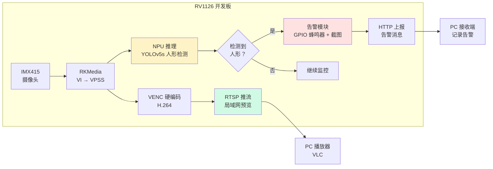

> 系列：RKNN 端侧部署实战：基于 RV1126 的模型转换与部署
> 前置：摄像头链路跑通 + 性能调优完成
> 目标：把前九期能力组装成一个可交付的完整产品原型

## 0. 本期目标

前九期我们分别打通了：环境与转换（01~04）、板端推理（05~06）、YOLO 检测（07）、摄像头链路（08）、性能调优（09）。

本期把这些能力组装成一个**完整产品原型**：人形检测周界报警系统。它具备真实 IPC（网络摄像头）的核心功能：

1. **采集**：IMX415 实时画面；
2. **检测**：NPU 运行 YOLOv5s 人形检测；
3. **告警**：检测到人形后触发报警（GPIO 蜂鸣器 + 截图保存 + 时间戳日志）；
4. **传输**：RTSP 推流预览 + HTTP 告警上报。

做完这个项目，你就拥有一个能写进简历的完整嵌入式 AI 案例。

## 1. 需求拆解

先想清楚"要做什么"，再写代码。画一张系统框图：



**模块划分**：

| 模块 | 技术点 | 对应前文 |
|:---|:---|:---|
| 采集 | RKMedia VI→VPSS 640×640 | 第8期 |
| 推理 | rknn 五步 API + YOLOv5 后处理 | 第5/7期 |
| 编码推流 | RKMedia VENC + RTSP 服务 | 第8期框架 |
| 告警 | GPIO + 截图 + 日志 | 本期 |
| 主控 | 多线程流水线 + 状态机 | 第9期 |

## 2. 工程目录结构

一个可维护的项目要有清晰结构，而不是一个 main.c 到底：

```text
perimeter-alarm/
├── CMakeLists.txt              # 工程构建
├── src/
│   ├── main.c                  # 主控状态机 + 线程创建
│   ├── camera.c/.h             # RKMedia 采集封装（VI/VPSS）
│   ├── rknn_det.c/.h           # NPU 推理 + YOLO 后处理封装
│   ├── alarm.c/.h              # GPIO 蜂鸣器 + 告警逻辑
│   ├── rtsp_server.c/.h        # VENC 编码 + RTSP 推流
│   └── utils.c/.h              # 日志、时间戳、截图
├── model/
│   └── yolov5s_person.rknn     # 模型（可只检 person 一类）
└── scripts/
    └── flash_and_run.sh        # 编译部署脚本
```

## 3. 核心代码实现

### 3.1 主控状态机

报警系统不是一直"检测→报警"，而要有状态管理，避免同一目标反复触发告警：

```c
typedef enum {
    ST_IDLE,      // 空闲监控
    ST_CONFIRM,   // 检测到人形，进入确认期（连续 N 帧确认）
    ST_ALARM,     // 确认触发，拉响警报
    ST_COOLDOWN   // 冷却期，避免重复报警
} AlarmState;

static AlarmState state = ST_IDLE;
static int confirm_count = 0;
static int cooldown_frames = 0;

void alarm_update(int person_detected) {
    switch (state) {
    case ST_IDLE:
        if (person_detected) {
            confirm_count = 1;
            state = ST_CONFIRM;
        }
        break;
    case ST_CONFIRM:
        if (person_detected) {
            if (++confirm_count >= CONFIRM_THRESHOLD) {  // 连续 5 帧确认
                trigger_alarm();                          // 拉响蜂鸣器 + 截图 + 上报
                state = ST_ALARM;
            }
        } else {
            state = ST_IDLE;                              // 中途消失，取消确认
        }
        break;
    case ST_ALARM:
        if (!person_detected || ++alarm_frames >= MAX_ALARM_FRAMES) {
            stop_alarm();
            cooldown_frames = COOLDOWN_FRAMES;            // 冷却 300 帧 ≈ 10 秒
            state = ST_COOLDOWN;
        }
        break;
    case ST_COOLDOWN:
        if (--cooldown_frames <= 0)
            state = ST_IDLE;
        break;
    }
}
```

**为什么需要确认期**：单帧误检（光线变化、动物、树叶晃动）很常见。连续 5 帧都检测到才告警，大幅降低误报率。**这是真实产品的必备设计**。

### 3.2 告警动作：蜂鸣器 + 截图 + 日志

```c
void trigger_alarm(void) {
    // 1. GPIO 拉高，蜂鸣器响
    gpio_set_value(ALARM_GPIO, 1);

    // 2. 保存当前帧截图（复用 VPSS 通道的 JPEG 或原始 YUV）
    save_snapshot("/data/alarm/%ld.jpg", time(NULL));

    // 3. 写告警日志（时间 + 目标框坐标 + 置信度）
    log_alarm(time(NULL), boxes, n);

    // 4. HTTP 上报到服务端（可选，见 4.2）
    http_post_alarm("http://192.168.1.100:8080/alarm", payload);
}

void stop_alarm(void) {
    gpio_set_value(ALARM_GPIO, 0);
}
```

GPIO 操作在 RV1126 上可以通过 sysfs 或 libgpiod：

```c
// libgpiod 方式
#include <gpiod.h>

struct gpiod_line *line = gpiod_line_get(
    gpiod_chip_open("/dev/gpiochip0"), ALARM_GPIO_OFFSET);
gpiod_line_request_output(line, "alarm", 0);
gpiod_line_set_value(line, 1);   // 响
gpiod_line_set_value(line, 0);   // 停
```

### 3.3 RTSP 推流

预览功能让系统"可见"。RV1126 的 VENC 硬编码 H.264，配合 SDK 自带的 RTSP 库（或移植 live555）即可：

```c
// 流程示意：VPSS 另一通道 → VENC → RTSP
VPSS_CHN_ATTR_S vpss_chn2 = { .u32Width = 1280, .u32Height = 720, ... };
RK_MPI_VPSS_SetChnAttr(VPSS_GRP, 1, &vpss_chn2);
RK_MPI_VPSS_EnableChn(VPSS_GRP, 1);

// VENC 编码
VENC_CHN_ATTR_S venc_attr = { .enType = RK_VIDEO_ID_AVC,   // H.264
                              .u32Width = 1280, .u32Height = 720, ... };
RK_MPI_VENC_CreateChn(0, &venc_attr);
RK_MPI_SYS_Bind(&vpss_chn1, &venc_chn);   // VPSS chn1 → VENC

// 编码后码流送给 RTSP 库发送（SDK 示例 rtsp_demo）
```

PC 端用 VLC 打开 `rtsp://板子IP:554/live` 即可看到实时画面。

## 4. 让项目更完整

### 4.1 告警去重与联动

真实系统里，告警不应该只是"响一下"：

- **去重**：同一目标在视野内持续存在，只告警一次（冷却期解决）；
- **截图留存**：保存触发时刻的图片，便于事后查看；
- **联动**：可扩展继电器控制灯光/门禁、推送到手机。

### 4.2 HTTP 告警上报

板端作为 HTTP 客户端，把告警信息 POST 到服务端：

```c
// 简易 HTTP POST（示意，用 libcurl 更健壮）
int http_post_alarm(const char *url, const char *json) {
    // 组装 HTTP 请求
    char req[512];
    snprintf(req, sizeof(req),
        "POST %s HTTP/1.1\r\n"
        "Host: %s\r\n"
        "Content-Type: application/json\r\n"
        "Content-Length: %zu\r\n\r\n%s",
        url, HOST, strlen(json), json);

    // TCP 连接 + send + recv
    // ...（网络编程基础，不再展开）
    return 0;
}
```

服务端收到后可以发短信、推微信、弹窗——这就是完整的"报警闭环"。

## 5. 部署与验证

### 5.1 构建部署

```bash
# 交叉编译（使用 SDK 工具链 + RKMedia/RKNN 库）
cmake -B build -DCMAKE_TOOLCHAIN_FILE=../toolchains/aarch64-rockchip-linux-gnu.cmake
cmake --build build -j4

# 拷贝到板子
scp build/perimeter_alarm root@板子IP:/userdata/
scp model/yolov5s_person.rknn root@板子IP:/userdata/

# 板端运行
ssh root@板子IP "/userdata/perimeter_alarm"
```

### 5.2 验证清单

```text
□ 启动后 VLC 能看到实时画面（RTSP 通）
□ 人走进画面 5 帧内蜂鸣器响（检测+确认通）
□ 离开后蜂鸣器停，冷却期后恢复监控（状态机通）
□ /data/alarm/ 下有告警截图（截图通）
□ 服务端收到告警 HTTP 请求（上报通）
□ 连续运行 24 小时不崩、内存不涨（稳定性通）
```

## 6. 简历作品集包装

做完项目，把它写进简历。用**项目公式**：背景 → 方案 → 技术亮点 → 量化结果。

```text
项目：基于 RKNN 的人形检测周界报警系统（RV1126 + IMX415）

背景：面向工厂周界安防场景，需在低成本边缘设备上实现实时人形检测告警。
方案：RKMedia 采集摄像头视频流，VPSS 硬件缩放至 640×640，
      RKNN NPU 运行 YOLOv5s 人形检测模型，VENC 硬编码 + RTSP 推流预览，
      多线程流水线 + 状态机管理告警（确认期/冷却期降误报）。

技术亮点：
- 全硬件管线：VPSS 缩放 + RGA 格式转换 + NPU 推理 + VENC 编码，CPU 占用 < 30%；
- 三线程流水线（采集/推理/后处理）+ 绑核优化，实测 640 输入 ~18 FPS；
- 连续 N 帧确认 + 冷却期状态机，误报率显著下降；
- 告警联动：GPIO 蜂鸣器 + 截图留存 + HTTP 上报闭环。

量化结果：端到端延迟 < 200ms，24 小时稳定运行，误报率 < 5%（测试集）。
```

> 数字以你的实测为准，**不要编造**。简历写"做过什么 + 怎么做的 + 效果数据"，比罗列技术名词有力得多。

## 7. 练习与里程碑

### 练习

1. **跑通最小闭环**：只做检测 + 打印结果，确认状态机逻辑正确；
2. **加告警**：接入 GPIO 蜂鸣器，人走进/离开验证状态切换；
3. **加预览**：接入 RTSP 推流，VLC 实时查看画面；
4. **加截图**：告警时保存 JPEG，验证文件可打开；
5. **稳定性测试**：跑 24 小时，观察内存曲线（`cat /proc/meminfo` / `top`）；
6. **文档**：写一份 README（硬件接线、编译步骤、使用说明）。

### 里程碑自检

- [ ] 系统框图能画出来
- [ ] 状态机（IDLE/CONFIRM/ALARM/COOLDOWN）能讲清为什么这样设计
- [ ] 四个功能模块（采集/检测/告警/推流）都跑通
- [ ] 简历项目描述能写出来（背景/方案/亮点/数据）
- [ ] 知道自己项目里每个数字是怎么测出来的

## 8. 小结

- **综合项目 = 前九期的组装**：采集链路 + NPU 推理 + 性能调优 + 工程封装；
- **真实产品设计**：确认期降误报、冷却期去重、截图留存、告警上报闭环；
- **可交付标准**：不只是"能跑"，而是稳定、可部署、有文档、有数据；
- **简历价值**：一个完整的嵌入式 AI 案例，胜过十个零散 demo。

十期走完，从"下载模型、PC 转换"到"板端实时检测告警"，你已经掌握了 RKNN 端侧部署的完整链路。工具会迭代（一代工具链已老旧，后续平台多用 RKNN-Toolkit2），但**"硬件感知 + 全链路思维 + 工程化习惯"这些核心能力不会过时**。继续，下一站可以是更复杂的模型、更大的平台、或者把检测能力接到你的音视频管线里。

> 🏷️ 标签：#RKNN #综合项目 #人形检测 #周界报警 #RTSP #作品集
