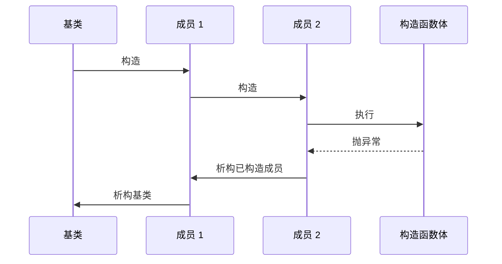

> 系列：RKNN 端侧部署实战
> 本篇只讨论 C++17 的对象生命周期。模型句柄、文件和线程只是资源的例子，不构成部署流程。

# C++ 对象模型：构造、析构、RAII 与生命周期

C++ 的很多“内存问题”并不是 `malloc` 与 `free` 没配对，而是对象尚未开始生命周期、已经结束生命周期，或者多个对象对同一个资源给出了互相矛盾的所有权解释。要理解 RAII、智能指针、移动语义和并发安全，必须先建立一张准确的对象生命周期地图。

## 对象与存储：先有字节，不等于先有对象

**对象与存储**不是同义词。存储是一段可用字节；对象是在这段存储上以某个类型开始了生命周期、因而可以合法访问其成员和调用成员函数的实体。一个地址看起来像 `T*`，并不证明那里一定活着一个 `T` 对象。

```cpp
#include <cstddef>
#include <new>

struct Packet {
  int id;
  int size;
};

alignas(Packet) std::byte storage[sizeof(Packet)]; // 只有存储，没有 Packet 对象
Packet* packet = new (storage) Packet{7, 128};     // placement new：对象生命周期开始
int id = packet->id;                               // 合法
packet->~Packet();                                 // 生命周期结束；storage 仍然存在
```

`storage` 的生存期和 `Packet` 的生存期不同。析构 `Packet` 不会释放这块静态数组；反过来，在没有构造 `Packet` 前访问 `packet->id` 也没有意义。


这个区分解释了为什么 `reinterpret_cast<T*>` 不是“把内存变成 T”：它只改变指针的静态解释，不自动构造对象。

## 四种存储期：对象可能在哪个时间范围存在

C++ 按存储期决定对象关联的存储持续多久。对象实际的生命周期还受初始化和析构影响，但存储期决定了它可能存在的外层范围。

| 存储期 | 常见位置 | 开始/结束 | 典型问题 |
| --- | --- | --- | --- |
| 静态存储期 | 全局对象、命名空间对象、`static` 成员 | 程序开始前或首次使用后，到程序结束 | 跨翻译单元初始化顺序 |
| 线程存储期 | `thread_local` | 线程开始，到线程退出 | 每线程副本、析构时机 |
| 自动存储期 | 函数局部变量、块内变量 | 进入声明所在块，到离开块 | 返回引用或指针后悬空 |
| 动态存储期 | `new`、allocator、内存池 | 显式释放或 owner 析构 | 所有权不清、泄漏、double free |

### 静态存储期

```cpp
int global_counter = 0;       // 静态存储期
static int cache_size = 128;  // 同样是静态存储期，链接可见性不同

int NextId() {
  static int next = 0;        // 首次执行到声明时初始化，C++11 起初始化线程安全
  return ++next;
}
```

静态对象最大的陷阱不是“它一直存在”，而是不同翻译单元中的动态初始化顺序未定义。一个全局对象构造函数访问另一个 `.cpp` 文件的全局对象，可能在后者构造前运行。函数内静态对象常用来规避这类初始化顺序问题，但仍要考虑程序退出时析构顺序。

### 线程存储期

```cpp
thread_local int request_depth = 0;
```

线程存储期的每个线程有独立对象。它不是“带锁的全局变量”：线程间看见的是不同副本，线程池复用线程时，这个副本也会跨多个任务残留。

### 自动存储期与动态存储期

```cpp
Packet MakePacket() {
  Packet local{1, 64};
  return local;  // 返回值优化或移动；不是返回 local 的引用
}

Packet* Bad() {
  Packet local{1, 64};
  return &local; // 错误：离开函数后 local 生命周期结束
}
```

自动对象默认最安全，因为作用域给出了明确的析构边界。动态存储期不是更高级的自动对象，只在对象需要跨作用域、运行时多态、可选存在或大小运行时决定时才需要。

## 初始化不是一个概念：六种常见初始化形式

初始化决定对象生命周期如何开始，C++ 中不同写法的规则并不相同。

| 名称 | 例子 | 关键语义 |
| --- | --- | --- |
| 零初始化 | `static int x;` | 标量置零；静态对象动态初始化前也会先零初始化 |
| 默认初始化 | `Widget x;` | 类类型调用默认构造；内置标量可能未初始化 |
| 值初始化 | `Widget x{};`、`int x{};` | 类调用默认构造；标量置零 |
| 直接初始化 | `Widget x(arg);` | 直接选择构造函数，可调用 explicit 构造 |
| 拷贝初始化 | `Widget x = arg;` | 允许转换，不能调用 explicit 构造 |
| 列表初始化 | `Widget x{arg};` | 禁止窄化转换，优先匹配 initializer_list |

```cpp
struct Point {
  Point() : x(0), y(0) {}
  explicit Point(int value) : x(value), y(value) {}
  int x;
  int y;
};

int a;          // 默认初始化：a 的值不确定
int b{};        // 值初始化：b == 0
Point p1;       // 默认初始化，调用 Point()
Point p2(3);    // 直接初始化，可调用 explicit Point(int)
// Point p3 = 3; // 错误：拷贝初始化不使用 explicit 构造函数
Point p4{3};    // 列表初始化，合法
```

列表初始化最值得记住的规则是拒绝窄化：`int x{3.14};` 不合法。它用编译期错误阻止“看起来能转换、实际丢精度”的初始化。

### 聚合初始化

**聚合初始化**适用于没有用户提供构造函数、没有 private/protected 非静态成员等条件的聚合类型。它按成员声明顺序初始化：

```cpp
struct ImageSize {
  int width;
  int height;
};

ImageSize size{640, 480};
```

聚合类型适合纯数据载体。若给它增加用户提供构造函数、私有成员或复杂不变量，它就不再适合被任意花括号直接构造；这是封装与便捷之间的真实取舍。

## 构造函数：成员初始化列表、委托构造与异常路径

成员对象在进入构造函数体之前已经完成构造，因此**成员初始化列表**不是可选的性能小技巧，而是正确初始化 `const` 成员、引用成员和无默认构造成员的唯一位置。

```cpp
#include <string>

class ModelName {
 public:
  ModelName(std::string name, int version)
      : name_(std::move(name)), version_(version) {}

 private:
  const std::string name_;
  const int version_;
};
```

成员构造的真实顺序由**声明顺序**决定，而非初始化列表书写顺序。编译器警告 `-Wreorder` 正是在提醒初始化列表与声明顺序不一致。

**委托构造**让一个构造函数复用同一类的另一个构造函数：

```cpp
class RetryPolicy {
 public:
  RetryPolicy() : RetryPolicy(3, 100) {}     // 委托构造
  RetryPolicy(int retries, int delay_ms)
      : retries_(retries), delay_ms_(delay_ms) {}
 private:
  int retries_;
  int delay_ms_;
};
```

被委托构造函数负责完整初始化；委托构造函数的函数体随后执行。不要同时在委托构造函数里初始化成员，C++ 不允许两个构造路径竞争同一成员的初始化责任。

### 部分构造与构造函数异常

构造一个对象时，先构造基类和成员，再执行构造函数体。如果后续成员或构造函数体抛异常，已经成功构造的成员会按逆序析构；对象本身没有完成构造，因此不会调用它的析构函数。这叫**部分构造**。

```cpp
class Session {
 public:
  Session() : file_(OpenFile()), lock_(AcquireLock()) {
    Validate(); // 若这里抛异常，lock_ 和 file_ 会逆序析构
  }
 private:
  File file_;
  Lock lock_;
};
```

这正是 RAII 的第一层价值：成员自己管理资源时，**构造函数异常**不需要手写一串失败清理分支。反例是构造函数里先拿裸资源、后面失败却依赖人工 goto 清理。



## 析构函数：结束生命周期，不等于一定释放存储

析构函数负责结束类对象语义并释放它拥有的资源。对自动对象，离开作用域后编译器先调用析构函数，再回收栈存储；对 placement new 对象，显式析构只结束对象生命周期，原始存储仍由调用者管理。

```cpp
class File {
 public:
  ~File() noexcept {
    if (fd_ >= 0) Close(fd_);
  }
 private:
  int fd_ = -1;
};
```

析构函数默认是 `noexcept(true)`。若栈展开期间析构函数又抛异常，程序会 `std::terminate`。因此析构函数应执行不可失败的清理；需要报告失败的关闭、提交或刷新操作应提供显式接口，例如 `Close()` 返回错误，让调用者选择处理方式。

## 多态销毁：虚析构函数、纯虚析构函数与对象切片

通过基类指针删除派生对象时，基类必须有**虚析构函数**：

```cpp
class Backend {
 public:
  virtual ~Backend() = default;
  virtual void Run() = 0;
};

class FastBackend final : public Backend {
 public:
  ~FastBackend() override = default;
  void Run() override {}
};

std::unique_ptr<Backend> backend = std::make_unique<FastBackend>();
```

没有 virtual 析构函数时，`delete Backend*` 不会正确析构派生部分，行为未定义。若类不打算被多态删除，就不应无意义地引入虚函数表。

**纯虚析构函数**也必须有定义，因为派生对象销毁时仍会调用基类析构：

```cpp
class Interface {
 public:
  virtual ~Interface() = 0;
};
inline Interface::~Interface() = default;
```

**对象切片**发生在派生对象按值赋给基类对象时：

```cpp
class Base { public: int id = 0; };
class Derived : public Base { public: int extra = 1; };

Derived derived;
Base sliced = derived;  // extra 被切掉；sliced 不再是 Derived
```

多态对象应通过引用、指针或拥有指针传递，而不是按值传递基类。

## RAII：把资源所有权变成对象不变量

RAII 的完整含义不是“写一个析构函数”，而是让资源的取得与对象初始化绑定、让归还与析构绑定。资源包括堆内存、文件描述符、锁、线程和库句柄。

```cpp
class ScopedLock {
 public:
  explicit ScopedLock(std::mutex& mutex) : mutex_(mutex) { mutex_.lock(); }
  ~ScopedLock() noexcept { mutex_.unlock(); }
  ScopedLock(const ScopedLock&) = delete;
 private:
  std::mutex& mutex_;
};
```

实际代码应使用 `std::lock_guard` 或 `std::unique_lock`，这里仅展示不变量：构造成功就持锁，离开作用域必解锁。RAII 将异常、早返回和多个分支统一成一条析构路径。

## 显式生命周期：placement new 与 std::launder

**placement new** 在已有存储上构造对象，不分配内存。它用于内存池、arena、对象复用和硬件共享内存；它也要求调用者精确管理构造、析构和对齐。

```cpp
#include <new>
#include <utility>

struct Counter { int value; };
alignas(Counter) std::byte bytes[sizeof(Counter)];

Counter* first = new (bytes) Counter{1};
first->~Counter();
Counter* second = new (bytes) Counter{2};
```

当同一地址上结束旧对象后构造了新对象，旧指针不总能安全代表新对象。C++17 的 `std::launder` 用于某些严格的对象替换场景：

```cpp
Counter* current = std::launder(reinterpret_cast<Counter*>(bytes));
int value = current->value;
```

`std::launder` 不是日常工具，也不能修复悬空指针。它只解决编译器可能基于旧对象身份做优化、而新对象确实已在同一存储开始生命周期的少数场景。普通业务代码应优先避免显式复用对象存储。

## 三法则、五法则与零法则

若类直接管理资源，必须定义它的复制与移动语义。传统的**三法则**包括析构函数、拷贝构造函数、拷贝赋值运算符：任意一个需要自定义，另外两个通常也需要。

C++11 后加入移动构造与移动赋值，形成**五法则**。它们处理“复制资源”与“转交资源”的完整组合。

| 法则 | 何时考虑 | 推荐动作 |
| --- | --- | --- |
| 三法则 | 手持裸资源，允许复制 | 明确深复制或禁止复制 |
| 五法则 | 手持裸资源，还要高效转交 | 定义/默认/删除五个特殊成员函数 |
| 零法则 | 成员全是 RAII 类型 | 不手写特殊成员，让成员类型管理资源 |

```cpp
class Job {
 public:
  std::string name;
  std::vector<std::byte> payload;
  // 零法则：编译器生成的复制、移动和析构已经正确。
};
```

**零法则**是默认目标。若你发现自己正在为一个类手写五个函数，先问能否把裸 fd、数组或句柄封装进更小的 RAII 成员类型。

## 容易混淆的结论

- 析构函数被调用，不必然意味着存储被释放；placement new 是反例。
- `delete` 不只是释放内存，它先调用析构函数；不能用它释放非 new 得到的对象。
- `static` 局部对象初始化线程安全，不代表其后续读写线程安全。
- `std::move`、智能指针和 RAII 都建立在对象生命周期正确的前提上，不能挽救悬空引用。
- 构造函数失败时，已完成构造的成员会析构；对象自身没有成为一个完整可用对象。

## 知识地图

对象模型并不是孤立主题：存储期决定外层时间范围，初始化决定生命周期如何开始，构造/析构维护类不变量，RAII 把外部资源纳入对象生命周期，三/五/零法则决定复制和移动时不变量如何保持。后续的智能指针、移动语义和并发对象所有权都建立在这条链上。

> 🏷️ 标签：#C++17 #对象模型 #对象与存储 #RAII #placement-new #生命周期
