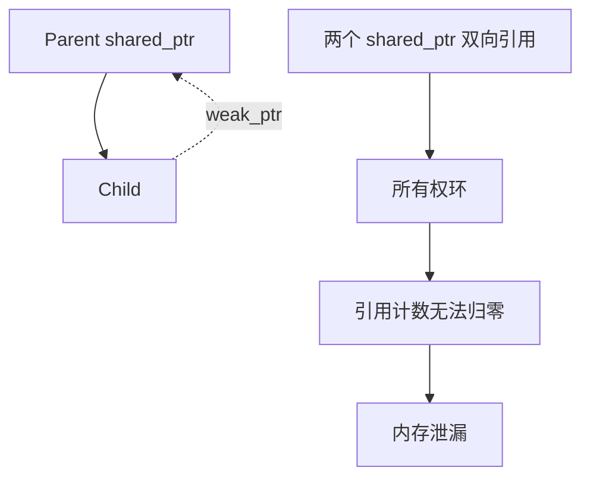

> 系列：RKNN 端侧部署实战
> 本篇讨论 C++17 内存模型、分配器与所有权。它不提供某个业务项目的内存方案，而是解释语言和标准库原语各自保证什么。

# C++ 内存管理：new/delete、智能指针与所有权

C++ 的内存管理至少有三层：对象如何开始和结束生命周期，存储从哪里取得和归还，以及谁拥有对象并决定它何时销毁。把它们全部叫作“指针问题”，会导致 `shared_ptr` 滥用、allocator 误解和 placement new 事故。

## new 表达式与 operator new 不是同一个东西

**new 表达式**是语言语法：它先请求存储，再在存储上构造对象；失败时它会处理异常路径。`operator new` 是可重载的分配函数，只负责提供原始存储。类似地，delete 表达式负责析构再归还存储，`operator delete` 只负责归还存储。

```cpp
struct Node { int value; Node(int v) : value(v) {} };

Node* node = new Node(42); // 调 operator new -> 调 Node 构造函数
// 使用 node
delete node;               // 调 Node 析构函数 -> 调 operator delete
```

这解释两个常见错误：不能用 `free()` 释放 `new` 的对象，因为它跳过析构；不能用 `delete` 释放 `malloc` 得到的字节，因为那里未必存在 C++ 对象。


### 分配失败与 nothrow

默认 `operator new` 分配失败会抛 `std::bad_alloc`。`new (std::nothrow)` 则返回空指针，但它不能让构造函数失败变成空指针：构造函数若抛异常，异常仍会传播。

```cpp
#include <new>

int* values = new (std::nothrow) int[1024];
if (values == nullptr) {
  // 仅代表存储分配失败
}
delete[] values;
```

在现代 C++ 中，优先使用容器或智能指针，把这种失败路径收在创建边界；业务代码不应到处检查裸 `new`。

## 对齐：地址正确还不够

对象地址必须满足其对齐要求。`alignas` 指定存储对齐，`alignof(T)` 查询类型要求。

```cpp
#include <cstddef>

struct alignas(32) AlignedBlock { std::byte bytes[32]; };
static_assert(alignof(AlignedBlock) == 32);
```

自定义内存池若返回了不满足 `alignof(T)` 的地址，即使缓冲区足够大，构造 `T` 也是未定义行为。`std::align` 可在一块更大的缓冲区中向前移动指针以寻找可用的对齐位置：

```cpp
#include <memory>
#include <cstddef>

void* cursor = raw_buffer;
std::size_t space = raw_bytes;
void* aligned = std::align(alignof(AlignedBlock), sizeof(AlignedBlock), cursor, space);
if (aligned != nullptr) {
  auto* block = new (aligned) AlignedBlock{}; // placement new
  block->~AlignedBlock();
}
```

**placement new** 不分配存储，只在既有、已对齐的存储上构造对象；它要求调用者明确析构和存储复用边界。

## 裸指针：它可以借用，但默认不拥有

`T*` 的类型本身不说明它是否需要 delete。好用的裸指针通常表示“此函数在调用期间借用一个非空或可空对象”：

```cpp
void Render(const Image* image); // 不拥有 image；可用 nullptr 表示无图像
void Normalize(Image& image);    // 不拥有且要求非空，允许修改
```

若接口转移所有权，应当使用 `std::unique_ptr<T>`；若接口共享延长寿命，应当使用 `std::shared_ptr<T>`。让裸指针同时承担“可空、借用、拥有、数组首地址”四种含义，是悬空指针、double free 和内存泄漏的源头。

| 错误 | 本质 | 正确模型 |
| --- | --- | --- |
| 悬空指针 | 借用者比 owner 活得久 | 缩短借用范围或传 owner |
| double free | 两个对象都以为拥有 | 唯一所有权或共享控制块 |
| 内存泄漏 | 无人拥有或所有权环 | RAII owner、断开 weak 边 |
| delete[] 错配 | 对象类型/数组语义丢失 | vector、array、unique_ptr<T[]> |

## unique_ptr：唯一所有权的默认答案

`std::unique_ptr` 不可复制、可移动，析构时调用 deleter。它正好表达“一个对象有一个最终释放者”。

```cpp
#include <memory>

std::unique_ptr<int> value = std::make_unique<int>(42);
std::unique_ptr<int> next = std::move(value); // 所有权转移
// value.get() == nullptr；next 是唯一 owner
```

`make_unique` 把分配和所有权绑定在一个表达式中，避免复杂调用中“new 成功但还未来得及交给 owner 就抛异常”的窗口。数组用 `std::make_unique<T[]>(count)`；可变大小普通数组多数情况下更应使用 `std::vector<T>`。

### 自定义 deleter

**自定义 deleter** 让 `unique_ptr` 管理非 `new` 资源。deleter 是类型的一部分，因此释放策略可审计：

```cpp
#include <cstdio>
#include <memory>

struct FileCloser {
  void operator()(std::FILE* file) const noexcept {
    if (file != nullptr) std::fclose(file);
  }
};
using FileHandle = std::unique_ptr<std::FILE, FileCloser>;

FileHandle file(std::fopen("config.bin", "rb"));
```

使用 `get()` 交给 C API 时，C API 只是借用；不能把得到的裸指针保存到 `unique_ptr` 生命周期以外。

## shared_ptr：共享的是控制块管理的寿命

`std::shared_ptr` 在对象外还有控制块，记录强引用计数、弱引用计数、deleter 和 allocator。复制 shared_ptr 会增加强引用，最后一个强引用销毁时对象才销毁。

```cpp
#include <memory>

auto config = std::make_shared<const Config>();
Consume(config);   // 只有 Consume 需要保存 config 才有共享寿命的理由
```

`make_shared` 通常一次分配同时容纳控制块与对象，局部性和分配次数更好；但它会让控制块与对象存储绑定，弱引用长期存在时对象存储可能不能立刻归还。若对象很大、弱观察者可能长期存在、或需要自定义 deleter，直接 `shared_ptr<T>(new T, deleter)` 可能更合适。

### aliasing constructor

**aliasing constructor** 允许一个 shared_ptr 共享控制块，却暴露另一个相关地址：

```cpp
struct Image { Header header; std::vector<std::byte> pixels; };
auto image = std::make_shared<Image>();
std::shared_ptr<Header> header(image, &image->header);
```

`header` 的 `get()` 指向成员 `Header`，但它的所有权计数绑定 `image` 的控制块。它适合让子对象借父对象寿命，不适合把任意不相关裸指针伪装成已拥有对象。

## weak_ptr、所有权环与 enable_shared_from_this

两个对象互相持有 shared_ptr 会形成**所有权环**，即使外部引用都消失，强计数也不为零。反向关系通常使用 `std::weak_ptr`：

```cpp
struct Parent;
struct Child { std::weak_ptr<Parent> parent; };
struct Parent { std::shared_ptr<Child> child; };
```

访问 weak_ptr 必须 `lock()`，因为观察者不保证对象仍存在。

`std::enable_shared_from_this<T>` 允许对象在已被 shared_ptr 管理时安全获取指向自己的 shared_ptr：

```cpp
class Listener : public std::enable_shared_from_this<Listener> {
 public:
  std::shared_ptr<Listener> Self() { return shared_from_this(); }
};
```

对象必须先由 shared_ptr 创建；在普通栈对象或尚未进入控制块的对象上调用 `shared_from_this()` 会抛 `std::bad_weak_ptr`。不要用 `std::shared_ptr<T>(this)` 伪造第二个控制块，那会导致 double free。



## allocator 与 std::allocator

容器不会直接写 `new T[n]`；它通过 allocator 取得原始存储、构造元素、析构元素并归还存储。`std::allocator<T>` 是默认 allocator，表达“按 T 的对齐和大小从全局分配器取得存储”。

```cpp
#include <memory>

std::allocator<int> alloc;
int* memory = alloc.allocate(4);        // 只有存储
std::allocator_traits<decltype(alloc)>::construct(alloc, memory, 7);
std::allocator_traits<decltype(alloc)>::destroy(alloc, memory);
alloc.deallocate(memory, 4);
```

业务代码通常不直接这么写；理解它的目的，是知道容器为何能把分配策略替换掉、为何 element 的构造与内存分配是分离步骤。

## std::pmr：运行时可替换的多态分配资源

C++17 的 `<memory_resource>` 提供 **std::pmr**。`std::pmr::polymorphic_allocator` 把“从哪个内存资源分配”放到运行时，而容器类型不变：

```cpp
#include <array>
#include <memory_resource>
#include <vector>

std::array<std::byte, 4096> arena;
std::pmr::monotonic_buffer_resource resource(arena.data(), arena.size());
std::pmr::vector<int> values{&resource};
values.push_back(1);
```

`std::pmr::monotonic_buffer_resource` 从一块 arena 单向增长分配，通常不会单独释放每个小对象；调用 `release()` 或销毁 resource 时批量归还。它适合“请求/帧/解析阶段内创建大量短命对象，整体结束时一起释放”，不适合需要随机释放单个对象的通用堆。

其他常见资源：

| 资源 | 特性 | 适合什么 |
| --- | --- | --- |
| `new_delete_resource` | 默认全局 new/delete | 通用默认 |
| `monotonic_buffer_resource` | 单调增长、整体释放 | arena、一次性解析 |
| `unsynchronized_pool_resource` | 单线程小块复用 | 局部对象池 |
| `synchronized_pool_resource` | 内部同步的小块复用 | 多线程共享分配器，先量化再用 |

pmr 改变的是分配来源，不改变对象所有权。`pmr::vector` 仍按 vector 的规则管理元素；不能因为 arena 很快就让借用者保存指向已 release 的对象。

## 三法则、五法则与零法则

直接管理原始资源的类要考虑复制与移动：析构、拷贝构造、拷贝赋值构成**三法则**；再加移动构造和移动赋值构成**五法则**。它们的核心是保持所有权不变量，不是机械地补五个函数。

更好的默认是**零法则**：成员使用 `std::string`、`std::vector`、unique_ptr 等 RAII 类型，类本身不写任何特殊成员函数。

```cpp
struct Message {
  std::string topic;
  std::vector<std::byte> body;
  // 零法则：默认复制、移动、析构都符合成员语义。
};
```

当类中出现裸 `new`、裸句柄和手写析构时，先尝试把它们封装为小的 owner 类型；这通常比手写五个函数更可靠。

## 选择规则

1. 不需要跨作用域：自动对象。
2. 运行时对象且唯一拥有：unique_ptr 或容器。
3. 多个独立组件确实共同延长寿命：shared_ptr。
4. 只观察、不延长寿命：weak_ptr、引用或裸借用指针。
5. 大量同寿命短对象：评估 pmr 的 monotonic resource。
6. 自定义池之前先测分配热点、峰值和碎片；allocator 不是默认优化。

> 🏷️ 标签：#C++17 #new-表达式 #std::pmr #智能指针 #所有权 #allocator
