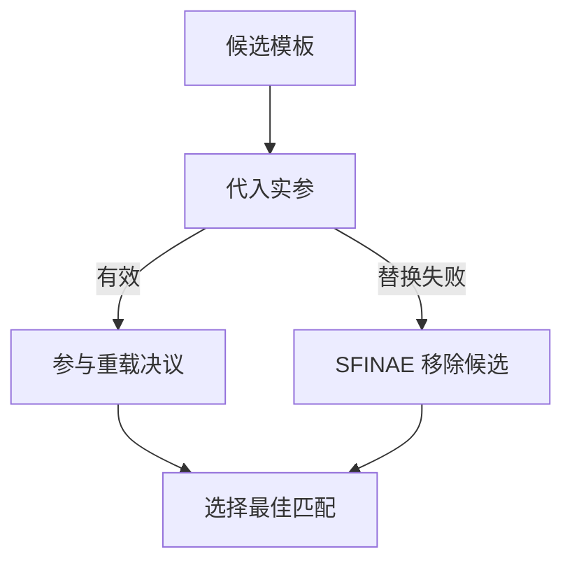

# C++ 泛型编程：模板、类型推导、Lambda 与回调

模板不是“用 `typename T` 替代 int”。它把类型检查和多态选择移到编译期；因此必须理解**模板实例化**发生在哪、名字何时查找、失败如何参与重载决议。

## 模板实例化与两阶段查找

模板定义被解析时先检查不依赖模板参数的名字；真正实例化时才检查依赖参数的名字。这是**两阶段查找**。依赖于模板参数的成员类型需要 `typename`，成员模板需要 `template 关键字`：

```cpp
template <typename T>
void Read(typename T::value_type value, T& container) {
  container.template emplace_back< typename T::value_type >(value);
}
```

这里 `T::value_type` 是**依赖名**，编译器不知道它是类型还是静态成员；`typename` 消除歧义。`container.template emplace_back<...>` 告诉编译器 `<` 是模板实参列表而不是小于号。


## 函数模板、类模板、变量模板

```cpp
template <typename T> T Max(T a, T b) { return a < b ? b : a; }
template <typename T, std::size_t N> struct Fixed { T values[N]; };
template <typename T> constexpr bool IsPointer = std::is_pointer<T>::value;
```

函数模板可重载；类模板支持**偏特化**，函数模板不支持偏特化，只能用重载或辅助类。**显式特化**为一个完整实参组合提供不同实现：

```cpp
template <typename T> struct Printer { static void Print(const T&); };
template <> struct Printer<bool> { static void Print(bool value); }; // 显式特化
template <typename T> struct Printer<T*> { static void Print(T*); }; // 偏特化
```

特化不是“优化所有类型”的替代品。优先让主模板语义一致；特化只处理确有不同契约的类型族。

## SFINAE 与 type traits

**SFINAE** 是 Substitution Failure Is Not An Error：模板实参替换失败时，该候选从重载集合移除，而不是立刻报错。C++17 常用 `std::enable_if` 和 `std::void_t` 表达约束。

```cpp
template <typename T, std::enable_if_t<std::is_integral<T>::value, int> = 0>
T Twice(T value) { return value * 2; }

template <typename, typename = void> struct HasSize : std::false_type {};
template <typename T> struct HasSize<T, std::void_t<decltype(std::declval<T>().size())>>
    : std::true_type {};
```

**type traits** 把类型属性变成编译期值或新类型。常用的 `std::decay` 去除引用、cv 限定并把数组/函数退化为指针；`remove_reference` 只移除引用；两者不能互换。

```cpp
using A = std::remove_reference_t<const int&>; // const int
using B = std::decay_t<const int&>;            // int
```



## auto、decltype 与泛型 Lambda

`auto` 根据初始化器推导；`decltype(expr)` 保留表达式类别规则；`decltype(auto)` 常用于需要保留引用的转发返回。公共 API 不应因省字而隐藏所有权。

**Lambda** 是闭包类型的匿名对象。**泛型 Lambda** 的参数写作 `auto`，等价于带模板 `operator()`：

```cpp
auto twice = [](auto value) { return value + value; }; // 泛型 Lambda
auto less = [threshold = 0.5F](float score) { return score < threshold; };
```

捕获决定生命周期：按值捕获拥有副本；按引用捕获要求外部对象存活；捕获 `this` 的异步回调可能悬空。Lambda 不是“短函数语法”，它是带状态的对象。

## std::function 与类型擦除

`std::function<R(Args...)>` 是**类型擦除**：它能保存函数指针、Lambda、bind 对象等不同可调用类型，代价是间接调用和可能的动态分配。

```cpp
std::function<void(int)> callback = [](int value) { Log(value); };
```

模板 callable 保留具体类型，适合热路径；std::function 适合回调必须存入成员、跨模块或运行时替换的接口。不要为同一接口同时叠加 virtual、模板和 std::function。

## 选型表

| 需求 | 工具 |
| --- | --- |
| 编译期复用算法 | 函数/类模板 |
| 类型条件重载 | SFINAE、enable_if、void_t |
| 局部短回调 | Lambda |
| 保存异构回调 | std::function / 类型擦除 |
| 运行时替换后端 | virtual 接口或显式 variant |

> 🏷️ 标签：#C++17 #模板实例化 #SFINAE #Lambda #类型擦除

## 模板诊断与可见性

模板定义通常必须位于头文件：调用点需要看到定义才能模板实例化。显式实例化可以把少数固定类型放进 cpp，但它是发布边界，不是隐藏所有模板实现的通用办法。

重载、特化和 ADL（argument-dependent lookup）会共同影响候选集合。为模板提供 `swap` 时，惯用写法是先 `using std::swap;`，再调用未限定 `swap(a, b)`，让用户类型所在命名空间的 swap 能参与查找。

```cpp
using std::swap;
swap(left, right); // ADL 可发现用户类型的高效 swap
```

模板错误首先检查：类型是否满足表达式要求、依赖名是否加 typename/template、特化是否在首次隐式实例化前可见、以及是否该用运行时多态而非模板。
