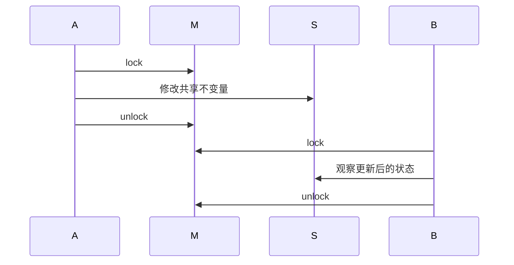
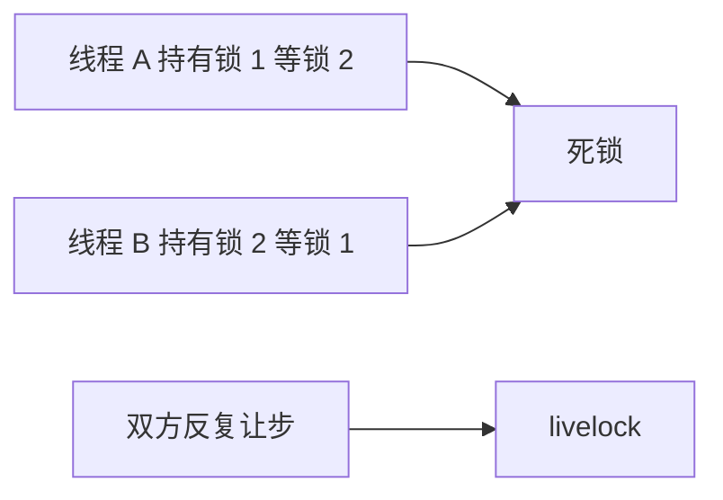

# C++ 多线程基础：std::thread、互斥、条件变量与锁

并发的第一问题是正确性。无同步的读写形成**数据竞争**，行为未定义。锁、atomic 和线程启动/join 建立 **happens-before** 关系，决定一个线程写入何时对另一个线程可见。

## thread 生命周期

`std::thread` 创建线程；`joinable()` 表示仍关联可 join 的执行线程；析构 joinable thread 会 terminate。`detach` 放弃 join 与结果归属，只有线程完全不访问宿主对象时才可能合理。

```cpp
std::thread worker([] { Work(); });
if (worker.joinable()) worker.join();
```

## mutex 家族与锁封装

| 类型 | 语义 |
| --- | --- |
| `std::mutex` | 普通互斥 |
| `recursive_mutex` | 同线程可递归锁，通常暴露设计问题 |
| `timed_mutex` | 支持超时尝试锁 |
| `shared_mutex` | 多读单写，C++17 |

`lock_guard` 简单 RAII 加锁；`unique_lock` 可延迟加锁、解锁和等待；`scoped_lock` 一次锁多个 mutex，减少死锁风险。

```cpp
std::unique_lock<std::mutex> lock(mutex, std::defer_lock); // defer_lock：暂不加锁
lock.lock();
std::lock_guard<std::mutex> adopted(mutex, std::adopt_lock); // adopt_lock：已持锁
```

`adopt_lock` 只有调用方已拥有锁时合法；误用会 double unlock。不要在持锁时做 I/O、外部回调或等待另一个线程。



## 条件变量等待状态

**条件变量** 不保存通知。`wait` 必须带谓词，因为存在**虚假唤醒**，通知也可能先于等待发生。

```cpp
std::unique_lock<std::mutex> lock(mutex);
cv.wait(lock, [&] { return closed || !queue.empty(); });
```

`notify_one` 唤醒一个等待者，`notify_all` 唤醒所有等待者；两者都只是促使线程重新检查谓词。关闭队列时通常更新 `closed` 后 `notify_all`。

## once、future 与异步结果

`std::once_flag` 与 `std::call_once` 保证一次初始化；不要手写双重检查锁。

```cpp
std::once_flag flag;
std::call_once(flag, [] { Initialize(); });
```

`promise` 写入一次值/异常，`future` 获取结果；`packaged_task` 把可调用对象包装成 future；`async` 由实现选择异步或延迟执行策略，不能把它当固定线程池。

```cpp
std::promise<int> p; auto f = p.get_future();
p.set_value(42); int answer = f.get();
```

## 死锁与 livelock

**死锁** 是循环等待锁；用固定锁顺序、缩小临界区或 `scoped_lock(a,b)` 规避。**livelock** 是线程持续让步、状态持续变化却没有进展；不断 `try_lock` 后 sleep/retry 可能造成它。正确性不仅是“不挂住”，还要保证可进展。



> 🏷️ 标签：#C++17 #happens-before #条件变量 #future #死锁

## shared_mutex、超时锁与异步等待边界

`shared_mutex` 配合 `shared_lock` 允许多读单写，但读多写少只是必要条件；写者饥饿、公平性和临界区长度仍要测量。`timed_mutex` 的 `try_lock_for` 只能让调用者获得超时分支，不能修复锁顺序错误。

```cpp
std::shared_mutex cache_mutex;
std::shared_lock<std::shared_mutex> read_lock(cache_mutex);
// 多个读者可并发；写者需 unique_lock<shared_mutex>
```

future 的 `get()` 只能调用一次，`shared_future` 才能被多个观察者读取。`async` 若未指定 launch policy，任务可能延迟到 get/wait 才执行；需要确定线程归属时应明确使用自己的 worker 或 `std::launch::async`，并评估线程数量。

线程安全不等于可取消：promise/future 没有内建取消协议。长任务应由单独的停止状态、队列关闭或取消令牌表达，不能仅靠丢弃 future。

## 同步原语的选择顺序

1. 单个独立状态：评估 atomic；
2. 多字段不变量：mutex；
3. 等待状态变化：mutex + 条件变量；
4. 一次初始化：call_once；
5. 一次性结果：promise/future；
6. 多读单写且测得争用：shared_mutex。

## 锁的粒度与不变量

一个 mutex 应保护清晰命名的不变量，而不是“所有看起来共享的变量”。先写出状态转移，再决定锁覆盖范围；锁太小会破坏不变量，锁太大会放大争用和死锁面。

销毁持锁对象前必须确认没有其它线程仍可能访问该 mutex 或其保护的数据。对象生命周期与同步协议必须一起设计。
