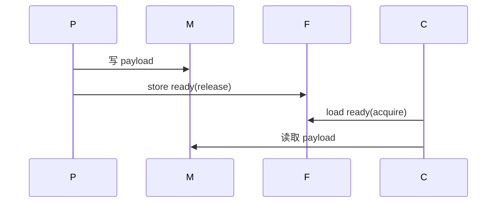
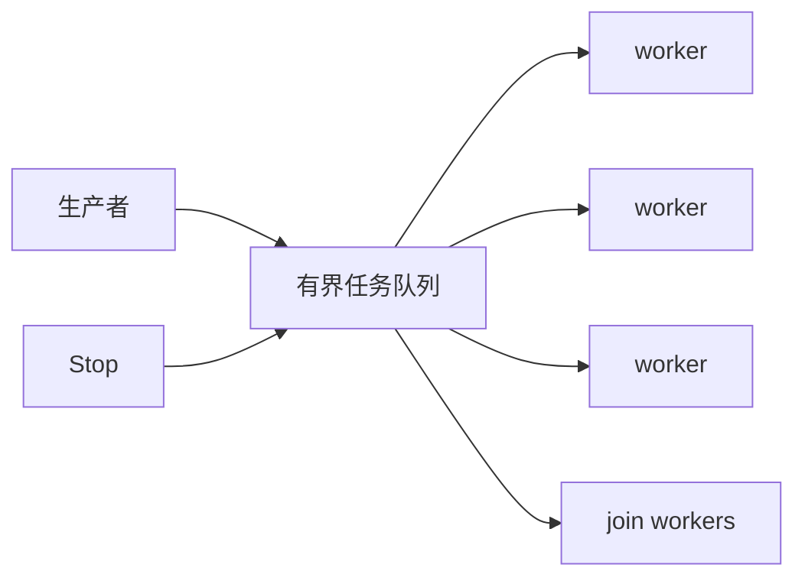

# C++ 并发进阶：atomic、内存序、生产者消费者与线程池

`std::atomic` 只保证单个原子对象操作没有数据竞争；它不自动维护多个字段的一致性，也不让容器线程安全。复杂不变量仍需要 mutex。

## atomic 操作与 lock-free

常用操作包括 `load`、`store`、`exchange`、`fetch_add`、`compare_exchange_weak` 和 `compare_exchange_strong`。`is_lock_free()` 只表示实现是否不借助内部锁，不表示一定更快。

```cpp
std::atomic<int> state{0};
int expected = 0;
while (!state.compare_exchange_weak(expected, 1,
                                    std::memory_order_acq_rel,
                                    std::memory_order_relaxed)) {
  expected = 0;
}
```

`compare_exchange_weak` 允许伪失败，适合循环；`compare_exchange_strong` 不允许伪失败，适合单次尝试。失败路径会更新 expected，循环必须重新处理它。

## 内存序与 synchronizes-with

**内存序**决定原子操作与普通内存读写如何排序。release store 与读取同一值的 acquire load 建立 **synchronizes-with**，进而形成 happens-before。

| 枚举 | 语义 |
| --- | --- |
| `memory_order_relaxed` | 只原子，不发布其它数据 |
| `memory_order_consume` | 依赖排序；实践中常按 acquire 实现，谨慎使用 |
| `memory_order_acquire` | 获取发布前写入 |
| `memory_order_release` | 发布此前写入 |
| `memory_order_acq_rel` | 读改写同时获取与发布 |
| `memory_order_seq_cst` | 全局单一顺序，最强也最易推理 |

```cpp
payload = 42;
ready.store(true, std::memory_order_release);
while (!ready.load(std::memory_order_acquire)) {}
Use(payload);
```

`fence`（如 `atomic_thread_fence`）只在特定原子通信模式中有意义；它不是给普通变量“加线程安全”的补丁。



## false sharing 与缓存线

不同线程频繁写同一缓存线的不同 atomic 会互相失效缓存，称为 **false sharing**。C++17 提供 `hardware_destructive_interference_size` 作为实现给出的隔离尺寸：

```cpp
struct alignas(std::hardware_destructive_interference_size) Counter {
  std::atomic<uint64_t> value{0};
};
```

先用 profiler 证明争用存在；盲目填充会增加内存与缓存压力。

## 生产者消费者与线程池

**生产者消费者** 的核心不是无锁，而是容量、关闭和唤醒协议。mutex + 条件变量队列通常比手写 lock-free 更可维护。线程池拥有 worker、任务队列和停止顺序：关闭队列，唤醒 worker，join 全部线程；不要在任务中同步等待同一小线程池的任务，否则可能饥饿。



原子停止标志适合防止重复 Stop；队列内容和 closed 状态仍是联合不变量，必须由 mutex 保护。lock-free 只有在测量证明确为瓶颈、并且团队能验证 ABA、内存回收和内存序时才值得引入。

> 🏷️ 标签：#C++17 #std::atomic #内存序 #生产者消费者 #线程池

## CAS 循环、ABA 与内存回收

compare-exchange 的循环必须在失败后接受 expected 被更新；否则会持续比较旧值。CAS 能更新一个原子字，却不自动解决链表节点何时释放。无锁栈中地址 A 被移除、释放、又复用为新 A 时，比较仍成功但对象身份已变，这就是 ABA 问题。

hazard pointer、epoch reclamation 和引用计数能处理不同形式的延迟回收，但都增加协议复杂度。没有明确内存回收方案的 lock-free 容器不是完成品。

## 内存序的决策边界

- 计数、统计、不会发布其它数据的标志：relaxed；
- 发布普通数据给消费者：release store 与 acquire load；
- 原子读改写同时消费旧状态并发布新状态：acq_rel；
- 需要所有线程观察同一全局原子顺序：seq_cst；
- consume 的依赖排序在实现与工具支持上不稳定，除非完整理解平台约束，否则使用 acquire；
- fence 仅配合特定原子通信建立顺序，不能替代原子对象。

线程池还需定义异常语义：任务抛异常是写入 future、记录并继续，还是关闭整个 pool；无论选哪种，都不能让异常逃出 worker 函数导致 std::terminate。

## 何时停止追求 lock-free

若瓶颈是 I/O、缓存未命中、任务粒度过小或错误的队列容量，lock-free 不会改善系统。先用 mutex 队列测量 p95 等待、上下文切换与 cache miss；只有锁争用被证实且团队能维护 ABA/回收协议时再替换。

## 原子对象的生命周期

atomic 只在对象生命周期内有效。发布指针时，发布者必须保证对象在所有 acquire 读取者结束前仍存在；release/acquire 只保证可见性，不负责延长对象寿命。需要延长寿命时使用 owner、引用计数或明确的 epoch/hazard 协议。

把指针改为 `std::atomic<T*>` 不能自动消除悬空指针。内存模型解决排序，资源模型解决谁何时销毁对象。

## 发布协议的最小审计表

发布者写普通数据、执行 release 操作；消费者读取同一原子并以 acquire 成功观察到该值；这两步才能把此前普通写入传递给消费者。若消费者只读取不同的 atomic，或读取的值不是该 release 序列的一部分，就没有 synchronizes-with。

原子计数也不能证明对象仍存在：引用计数归零、worker 退出和队列清空之间的先后关系必须由 owner 明确规定。并发设计审计时分别记录“数据可见性”“对象生命周期”“任务取消”三条关系，避免把其中一条误当成另两条的保证。

当 memory_order 选择无法用一句 happens-before 关系解释时，应退回 mutex 或 seq_cst 原型，再在 profiler 与压力测试证据支持下收紧顺序。
