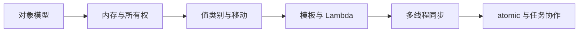
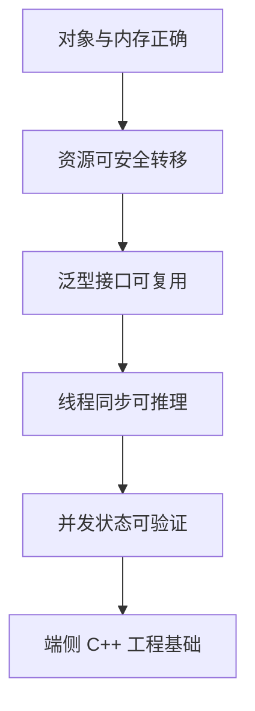

# RKNN 端侧部署实战：C++17 核心语法模块框架

模型能跑通之后，端侧项目往往从 C 或脚本原型进入 C++ 工程。此时真正需要补齐的不是某一家 SDK 的更多函数，而是 C++ 的对象生命周期、内存所有权、泛型抽象和并发规则。没有这些基础，智能指针会被滥用，`std::move` 会被误解，线程池会变成偶发死锁的来源。

本模块归入 RKNN 系列，因为它服务于端侧 AI 工程师的日常代码；但正文以 **C++17 语法与机制** 为主，RKNN、图像 buffer 和任务队列只作为易于理解的嵌入式例子。



## 学习边界

- 语言基线：C++17；明确标注 C++20 才提供的能力，不把它们伪装成 C++17 语法。
- 读者前置：会写函数、类和 STL 基础容器；不要求熟悉模板和并发。
- 重点：资源管理、对象语义、可调用对象、线程与内存模型。
- 不展开：完整 STL API 词典、模板元编程技巧竞赛、协程、GUI 和特定推理 SDK 手册。

## 六篇核心文章

### 11. C++ 对象模型：构造、析构、RAII 与生命周期

从存储期、对象构造顺序和析构顺序出发，解释自动对象、动态对象、成员依赖和多态析构。用 RAII 管理文件、锁和外部句柄，建立“构造成功即拥有、析构必然归还”的思维。

完成后能回答：对象何时存在，析构函数能做什么，为什么默认优先放栈上。

### 12. C++ 内存管理：new/delete、智能指针与所有权

讲清裸指针的借用语义、`std::unique_ptr` 的唯一所有、`std::shared_ptr` 的共享寿命和 `std::weak_ptr` 的观察关系。以 Rule of Zero 为默认设计，必要时再理解 Rule of Five。

完成后能画出资源所有权图，不再把 shared_ptr 当作默认指针。

### 13. C++ 值类别与移动语义：拷贝控制、右值与完美转发

区分左值、右值、拷贝和移动；解释 `std::move`、`std::forward`、移动构造、返回值优化和 `noexcept`。重点是何时允许转交资源，而不是到处添加 move。

完成后能判断一次传参是复制、借用还是转移所有权。

### 14. C++ 泛型编程：模板、类型推导、Lambda 与回调

学习函数模板、类模板、非类型模板参数、`auto`、`decltype(auto)`、Lambda 捕获和 `std::function`。比较模板泛型与 virtual 运行时多态的边界。

完成后能为稳定算法选择模板，为长期回调选择恰当的 callable 类型。

### 15. C++ 多线程基础：std::thread、互斥、条件变量与锁

从数据竞争与共享不变量开始，掌握 `std::thread`、`std::mutex`、`lock_guard`、`unique_lock`、`condition_variable` 和停止/join 协议。

完成后能写出可关闭的线程与队列，而不是依赖 detach 或忙等。

### 16. C++ 并发进阶：atomic、内存序、生产者消费者与线程池

理解 `std::atomic` 的适用范围、relaxed 与 acquire/release 的发布关系、生产者消费者队列和最小线程池的所有权。强调 mutex 与 atomic 的协作而非互相替代。

完成后能用正确的原语表达共享状态，并用 TSan 验证并发假设。



## 建议练习方式

每篇先在 x86 开发机编译最小程序，开启 `-Wall -Wextra -Werror`；内存篇加 ASan/UBSan，并发篇加 TSan。不要一开始把语言实验绑定到真机或模型：先让 C++ 机制在最小程序里可观察，再迁移到端侧项目。

```bash
g++ -std=c++17 -Wall -Wextra -Werror lesson.cpp -o lesson
./lesson
```

每个例子都应回答四个问题：对象谁拥有、何时销毁、哪些数据共享、通过什么机制同步。能回答这四个问题，C++ 代码才具备继续接入模型、摄像头和业务逻辑的基础。
