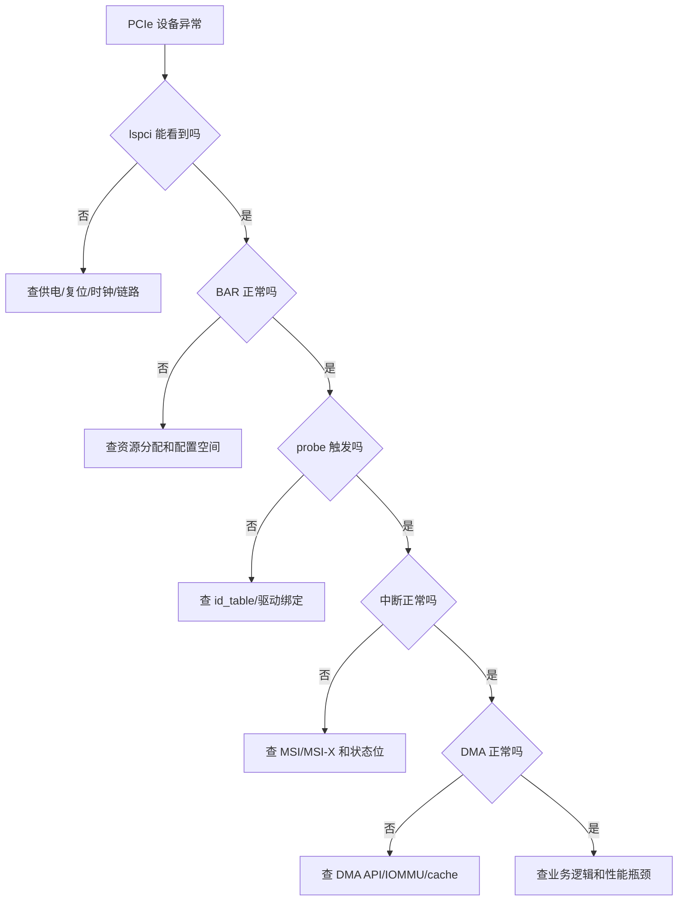

PCIe 问题排查比普通外设复杂，因为它跨越硬件、固件、内核、驱动和用户态。设备不出现、BAR 没分配、中断不来、DMA 超时、IOMMU fault，这些问题都很常见。

这一篇建立一套完整的 PCIe 排查方法。

## 一、PCIe 排查要按层次来

不要一上来就改驱动。PCIe 问题建议按以下层次排查：

1. 供电、时钟、复位
2. 链路训练
3. 枚举和配置空间
4. BAR 资源
5. 驱动 probe
6. 中断
7. DMA 和 IOMMU
8. 用户态接口

## 二、第一层：硬件基础

如果设备在系统里完全看不到，先查硬件：

- 供电是否正常
- PERST# 是否释放
- REFCLK 是否稳定
- lane 连接是否正确
- 插槽或连接器是否接触良好

这些问题会导致链路根本起不来。

## 三、第二层：链路训练

链路训练失败时，系统可能完全看不到设备，或者只能以低速、低宽度工作。

常见检查：

```bash
lspci -vv
```

关注：

- LnkCap
- LnkSta
- Speed
- Width

如果期望 x4，实际只有 x1，就要查硬件连接、lane 配置和信号质量。

## 四、第三层：枚举和配置空间

设备能出现在 `lspci`，说明枚举至少成功了一部分。

常用命令：

```bash
lspci -nn
lspci -vv -s <bus:dev.fn>
lspci -xxx -s <bus:dev.fn>
```

重点看：

- Vendor ID / Device ID
- Class Code
- Command 寄存器
- BAR
- MSI/MSI-X 能力

## 五、第四层：BAR 资源

BAR 异常常见表现：

- 驱动 `pci_request_regions()` 失败
- `pci_iomap()` 失败
- MMIO 读到异常值

排查方向：

- 系统是否分配资源
- BAR 大小是否正确
- 驱动访问 offset 是否正确
- 设备是否需要先解除复位

## 六、第五层：驱动 probe

probe 不触发通常有这些原因：

- id_table 不匹配
- 驱动模块没加载
- 设备被其他驱动绑定
- 内核没有启用相关配置

可以查看：

```bash
ls /sys/bus/pci/drivers/
readlink /sys/bus/pci/devices/<BDF>/driver
```

## 七、第六层：中断不来

中断问题常见原因：

- MSI/MSI-X 没启用
- 设备没有真正触发中断
- 中断状态位没有清除
- 中断被屏蔽
- request_irq 失败

检查：

```bash
cat /proc/interrupts
lspci -vv
```

驱动里要打印中断申请结果和中断计数。

## 八、第七层：DMA 异常

DMA 问题是 PCIe 驱动中最常见、也最难查的部分。

常见表现：

- DMA 超时
- 数据不一致
- 设备卡死
- IOMMU fault
- 系统内存破坏

排查方向：

- DMA 地址是否来自 DMA API
- DMA mask 是否正确
- `pci_set_master()` 是否调用
- buffer 生命周期是否足够长
- direction 是否正确
- map/unmap 是否成对

## 九、IOMMU fault 怎么看

执行：

```bash
dmesg | grep -i iommu
dmesg | grep -i dma
```

如果看到设备访问非法地址，通常要检查：

- DMA 地址写错
- 描述符地址错
- 长度越界
- 设备访问已释放 buffer
- IOMMU group 或映射配置异常

## 十、一个完整排查流程



## 十一、常用命令清单

```bash
lspci
lspci -nn
lspci -vv
lspci -xxx
setpci
cat /proc/interrupts
dmesg -w
ls /sys/bus/pci/devices/
```

## 十二、工程建议

### 1. 每个阶段都要有日志

probe、BAR、DMA、中断都要打印关键状态。

### 2. 不要跳过硬件层

设备不枚举，驱动代码通常不是第一嫌疑。

### 3. DMA 必须做数据校验

只看“不报错”不够，要验证数据内容。

### 4. 长时间压力测试必不可少

PCIe 问题很多是长时间运行后才暴露。

## 十三、验证清单

- `lspci` 能看到设备
- 链路速率和宽度符合预期
- BAR 分配正常
- 驱动 probe 成功
- 中断计数增长正常
- DMA 数据校验正确
- 无 IOMMU fault
- 长时间运行稳定

## 十四、小结

PCIe 排查要抓主线：链路、枚举、BAR、驱动、中断、DMA、IOMMU。只要按照这条链路分层定位，大多数问题都能逐步收敛。

> 🏷️ PCIe调试 / lspci / BAR / MSI / DMA / IOMMU / Linux驱动

---

## 初学者扩展讲解


## PCIe 学习中的关键主线

PCIe 的核心主线可以概括为：链路训练、配置空间、资源分配、BAR 映射、中断通知、DMA 搬运。初学者不要一开始就陷入 TLP、DLLP 等协议细节，先把 Linux 驱动真正会接触到的对象搞清楚。

设备上电后，Root Complex 会尝试和 Endpoint 建立链路，这个过程叫链路训练。链路训练成功以后，系统才能扫描配置空间。配置空间里有 Vendor ID、Device ID、Class Code、BAR、Capability 等信息。系统根据这些信息识别设备、分配 MMIO 地址空间、配置中断能力，然后内核 PCI 子系统根据匹配表调用具体驱动的 `probe()`。

如果 `lspci` 看不到设备，通常说明问题还在驱动 probe 之前。此时要优先检查供电、PERST#、REFCLK、lane 连接、Root Complex 配置和设备树。很多初学者会在驱动代码里找半天，但设备根本没有枚举，驱动没有任何机会执行。

## BAR 和 MMIO 要这样理解

PCIe 设备内部有寄存器，但 CPU 不能直接凭空访问这些寄存器。BAR 可以理解为设备向系统声明的一扇窗口：设备说“我需要一段地址空间”，系统分配一个 CPU 可访问的物理地址范围，驱动再把这段范围映射成内核虚拟地址。之后驱动通过 `readl()`、`writel()` 读写这段地址，就相当于访问设备寄存器。

典型流程是：

```c
pci_enable_device(pdev);
pci_request_regions(pdev, "demo");
bar = pci_iomap(pdev, 0, 0);
value = readl(bar + REG_STATUS);
writel(0x1, bar + REG_CTRL);
```

这里每一步都有意义。`pci_enable_device()` 使能设备；`pci_request_regions()` 申请 BAR 资源，避免多个驱动冲突；`pci_iomap()` 建立映射；`readl/writel` 才是真正访问寄存器。不要用普通指针直接访问 MMIO，也不要用 `memcpy` 随便操作寄存器区域。

## DMA、IOMMU 和 cache 一致性

PCIe 高速设备通常不会依赖 CPU 一字节一字节搬数据，而是使用 DMA。DMA 的意思是设备直接读写内存，CPU 只负责准备 buffer、告诉设备地址和长度、等待完成通知。

这里有三个地址概念必须区分：CPU 虚拟地址、CPU 物理地址、设备看到的 DMA 地址。驱动不能把普通虚拟地址直接写给设备，而要通过 DMA API 获取设备可访问地址：

```c
void *cpu_addr;
dma_addr_t dma_addr;

cpu_addr = dma_alloc_coherent(&pdev->dev, size, &dma_addr, GFP_KERNEL);
```

`cpu_addr` 给 CPU 访问，`dma_addr` 给设备访问。如果平台启用了 IOMMU，`dma_addr` 可能是 IOVA，不等于真实物理地址。使用 DMA API 的好处是内核会帮你处理映射、权限和 cache 一致性问题。工程中很多“DMA 写了但 CPU 看不到”“偶发数据错误”“IOMMU fault”，本质都是地址、cache 或生命周期管理出错。

## PCIe 排错的顺序

PCIe 排错建议按下面顺序：

```bash
lspci
lspci -vv
lspci -xxx
cat /proc/interrupts
dmesg -w
```

`lspci` 看设备是否枚举；`lspci -vv` 看 BAR、链路速率、链路宽度、MSI/MSI-X 和驱动绑定；`lspci -xxx` 看配置空间原始内容；`/proc/interrupts` 看中断是否触发；`dmesg` 看驱动日志、AER 错误、IOMMU fault 和 DMA 报错。性能问题还要进一步看 `perf`、ftrace、队列深度、buffer 大小和 CPU 亲和性。

## PCIe 驱动代码阅读建议

阅读 PCIe 驱动时，先看 `pci_device_id` 匹配表，再看 `pci_driver` 结构体。进入 `probe()` 后，重点看是否调用 `pci_enable_device()`、`pci_request_regions()`、`pci_set_master()`、`dma_set_mask_and_coherent()`、`pci_iomap()` 和中断申请函数。随后再看驱动如何创建 DMA 描述符队列、如何启动硬件、如何在中断处理里回收完成项。

一个成熟的 PCIe 驱动不只是能收发数据，还要处理热插拔、错误恢复、DMA 超时、中断丢失、设备复位、IOMMU fault 和长时间压力测试。初学时可以先跑通最小路径，但最终必须理解这些异常路径。


## 面向初学者的阅读方法

刚开始学习这类驱动文章时，最容易犯的错误，是把每一个名词都当成孤立知识点去背。实际工程里，驱动不是由名词堆起来的，而是一条从硬件连接、总线枚举、内核匹配、资源申请、数据传输到用户态验证的完整链路。读这一篇时，建议先抓住三件事：第一，这个机制解决什么问题；第二，Linux 内核用什么对象表达它；第三，出现故障时应该从哪一层开始查。

例如看到“枚举”，不要只记住它叫 enumeration，而要理解为：系统需要先发现设备、识别设备能力、给设备分配地址或资源，然后才可能让具体驱动接管。看到“驱动匹配”，也不要只背 `probe()`，而要继续追问：是谁触发 `probe()`？匹配表里放了什么？设备还没有出现时驱动会不会执行？驱动执行以后第一步应该申请什么资源？这些问题连起来，才是真正能在板子上排错的知识。

## 从硬件到软件的完整路径

一条外设链路通常可以分成五层。第一层是硬件层，包括供电、时钟、复位、信号线、连接器和外设本身。第二层是总线层，也就是 USB、PCIe、I2C、SPI 这类协议如何发现设备、传输数据。第三层是内核框架层，Linux 会把设备抽象成 `struct device`、总线对象、驱动对象和资源对象。第四层是具体驱动层，驱动负责把通用框架和具体芯片寄存器、端点、队列、描述符连接起来。第五层是用户态验证层，包括命令行工具、测试程序、日志和性能统计。

初学者排错时不要一上来就怀疑驱动代码。设备没有被系统看到时，驱动代码通常还没有执行；驱动没有绑定时，可能是匹配表或描述符问题；驱动绑定了但不能传输时，才更可能进入 buffer、DMA、中断、同步和协议细节。按照这个顺序排查，可以避免在错误层面浪费时间。

## 建议准备的实验环境

学习 USB/PCIe 驱动，最好准备一台 Linux 主机、一块支持外设扩展的开发板，以及至少一个真实设备。USB 方向可以从 U 盘、USB 串口、USB 摄像头、USB 网卡开始；PCIe 方向可以从 NVMe、PCIe 网卡、PCIe 转串口卡、FPGA PCIe Endpoint 或开发板自带 PCIe 插槽开始。没有 PCIe 硬件时，也可以先通过 `lspci` 观察 PC 上已有设备，理解配置空间、BAR 和驱动绑定。

每次实验都建议记录四类信息：硬件连接照片或说明、内核版本和设备树/配置、关键命令输出、问题现象和解决过程。驱动学习的进步往往不是来自“看懂一段代码”，而是来自反复把现象、日志、源码和硬件状态对应起来。

## 常用观察命令

无论是 USB 还是 PCIe，都建议养成先看系统状态的习惯：

```bash
uname -a
dmesg -w
lsmod
cat /proc/interrupts
cat /proc/iomem
```

`uname -a` 用来确认内核版本；`dmesg -w` 用来实时观察设备插拔、枚举和驱动 probe 日志；`lsmod` 用来看模块是否加载；`/proc/interrupts` 用来看中断是否触发；`/proc/iomem` 可以帮助理解 MMIO 资源分配。不要小看这些基础命令，很多现场问题并不是复杂 bug，而是设备没枚举、驱动没加载、资源没分配或中断没到。

## 初学者最容易混淆的点

第一，不要把“用户态能看到设备节点”等同于“驱动完全正常”。设备节点只说明某个驱动创建了接口，真正的数据通路还要看读写、ioctl、mmap、poll、DMA 和中断是否正常。

第二，不要把“驱动 probe 成功”等同于“硬件已经工作”。probe 成功通常只代表资源申请和初始化基本完成，后续传输仍可能因为时钟、复位、buffer、协议状态或固件问题失败。

第三，不要把“命令没有报错”等同于“性能达标”。高速设备还要统计吞吐、延迟、CPU 占用、内存拷贝次数、DMA 是否真正生效，以及异常恢复是否可靠。

## 推荐的验证闭环

一篇驱动文章学完以后，不建议只停留在阅读层面。至少做一个小闭环：先用命令确认设备存在，再找到它绑定的驱动，然后观察内核日志，再做一次最小读写或传输测试，最后故意制造一个小错误，例如拔掉设备、改错匹配 ID、禁用模块或调整 buffer 数量，观察系统如何报错。只有经历过“正常路径”和“异常路径”，才能真正理解驱动框架为什么这样设计。
