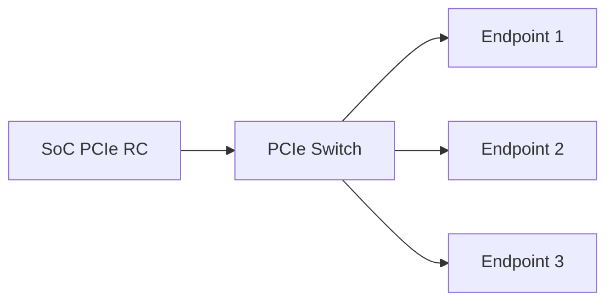

PCIe 驱动开发经常被误解成“写一个 `pci_driver`，然后访问 BAR”。实际项目中，驱动能否进入 `probe()`，取决于更底层的一整条链路：参考时钟、复位、PERST#、供电、参考地、lane 配置、LTSSM、配置空间和资源分配。

这一篇以嵌入式 SoC 连接 FPGA、网卡或自研加速器为场景，建立一套从原理图到 Linux 的 PCIe Endpoint bring-up 方法。示例命令适用于常见 Linux 系统，具体寄存器和设备树属性必须以目标 SoC 手册为准。

## 一、先分清 Root Complex 与 Endpoint

PCIe 链路至少包含两个角色：

- **Root Complex，RC**：通常位于 SoC 内，负责发起配置访问、分配总线号和 BAR 地址；
- **Endpoint，EP**：网卡、NVMe、FPGA 或加速器等设备，响应配置访问并提供功能；
- **Switch**：在一个 RC 下扩展多个下游端口。

嵌入式板卡中最常见的两种结构是：




如果 SoC 被配置成 Endpoint，它不会主动枚举其他设备，而是等待外部 RC 对它进行配置。RC/EP 角色必须先从硬件设计和控制器模式上确认，不能仅根据设备树节点名字猜测。

## 二、硬件设计中必须核对的信号

### 1. REFCLK

PCIe 设备通常需要 100 MHz 参考时钟。需要核对：

- 时钟由 RC、EP 还是独立时钟芯片提供；
- Common Clock 或 SRIS/SRNS 架构；
- 时钟是否在 PERST# 释放前稳定；
- 差分时钟走线、端接和 AC 耦合方案；
- Endpoint 是否有独立参考时钟输入。

参考时钟异常时，最常见表现是 LTSSM 长时间停在 Detect 或 Polling，系统看不到设备。

### 2. PERST#

`PERST#` 是低有效复位信号。RC 通常负责在参考时钟稳定、电源就绪后释放 Endpoint 复位。必须检查：

- 上电默认电平是否为低；
- 释放时序是否满足 Endpoint 数据手册；
- GPIO 复用是否正确；
- 是否被其他设备共享；
- 设备树中的 reset-gpios 极性是否与原理图一致。

PERST# 提前释放会导致 Endpoint 没有完成内部电源和 PLL 初始化；一直拉低则设备永远不会进入配置阶段。

### 3. CLKREQ# 与 WAKE#

低功耗系统可能使用 `CLKREQ#` 请求参考时钟，也可能使用 `WAKE#` 唤醒主机。初次 bring-up 建议先确认链路是否能在非低功耗路径下稳定建立，再逐步启用 ASPM 和 runtime PM。

### 4. TX/RX lane 方向

PCIe TX 必须连接对端 RX，RX 必须连接对端 TX。差分对的极性翻转在部分控制器中可配置，但不能假设所有芯片都能自动修正。x1、x2、x4 的 lane 数量和 lane 映射也必须与控制器支持范围一致。

## 三、链路训练与 LTSSM

PCIe 链路启动会经历 LTSSM，即 Link Training and Status State Machine。初学阶段重点关注这些状态：

- `Detect`：检测对端接收器；
- `Polling`：交换训练序列并建立同步；
- `Configuration`：交换链路宽度和编号等配置；
- `L0`：正常工作状态；
- `Recovery`：重新训练或降速降宽；
- `Disabled` / `Hot Reset`：链路被禁用或复位。

链路最终必须进入 `L0`，但“进入 L0”还不代表设备功能一定可用，因为后面仍有枚举、BAR 和中断配置。

## 四、设备树中的 RC 节点

一个抽象的 RC 节点可能包含以下资源：

```dts
pcie0: pcie@40000000 {
    compatible = "vendor,soc-pcie";
    reg = <0x0 0x40000000 0x0 0x100000>;
    reg-names = "dbi";

    interrupts = <GIC_SPI 100 IRQ_TYPE_LEVEL_HIGH>;
    clocks = <&cru PCLK_PCIE>, <&cru ACLK_PCIE>, <&cru CLK_PCIE_REF>;
    clock-names = "pclk", "aclk", "ref";
    resets = <&cru SRST_PCIE>;
    reset-names = "phy";

    phys = <&pcie_phy0>;
    phy-names = "pcie-phy";
    num-lanes = <1>;
    reset-gpios = <&gpio2 4 GPIO_ACTIVE_LOW>;
    status = "okay";
};
```

不同平台的字段差异很大，有的把 PERST# 放在 endpoint 节点，有的使用 `reset-gpios`，还有的平台使用专门的 PHY、pipe、rockchip、cadence 或 dwc glue 属性。修改前要对照：

- SoC 官方设备树；
- 当前内核对应的 binding 文档；
- 板卡原理图；
- bootloader 实际加载的 DTB。

### 运行时确认 DTB

```bash
find /proc/device-tree -iname '*pcie*' -o -iname '*pci*'
cat /proc/device-tree/soc/pcie@40000000/status
tr '\0' '\n' < /proc/device-tree/soc/pcie@40000000/compatible
```

节点路径只是示意，实际路径需要根据 `/proc/device-tree` 查找结果调整。

## 五、Linux 侧的第一轮检查

启动后先执行：

```bash
dmesg | grep -Ei 'pcie|pci|link|ltssm|phy|aer|reset'
lspci -nn
lspci -vv
```

可以按下面的结果分类：

### 情况 1：`lspci` 没有任何设备

优先查 RC 控制器是否 probe、链路是否进入 L0、Endpoint 是否释放 PERST#、参考时钟是否正常。此时还没有必要分析 BAR 或驱动匹配。

### 情况 2：能看到设备，但没有绑定驱动

这说明链路、配置访问和枚举基本成功。接下来检查：

```bash
lspci -k
modinfo your_driver
```

确认 `vendor:device` ID 是否在驱动的 `pci_device_id` 表中，以及模块是否已经加载。

### 情况 3：驱动进入 `probe()`，但资源初始化失败

查看 `lspci -vv` 中的 BAR、BusMaster、MSI/MSI-X 和链路状态，再检查驱动的错误回滚路径。

## 六、用 lspci 读懂一块真实设备

```bash
lspci -s 01:00.0 -nn
lspci -s 01:00.0 -vv
lspci -s 01:00.0 -xxxx
```

重点观察：

- `LnkCap`：设备支持的最大速率和宽度；
- `LnkSta`：当前协商出的速率和宽度；
- `Region 0` 等 BAR：基地址和大小；
- `BusMaster+`：是否允许设备发起 DMA；
- `MSI` / `MSI-X`：中断能力；
- `AER`：高级错误报告能力；
- `Kernel driver in use`：当前绑定驱动。

例如设备支持 Gen3 x4，但 `LnkSta` 只有 Gen1 x1，说明链路虽然工作，却存在速度或宽度降级，需要回到信号、lane、参考时钟和训练日志排查。

## 七、链路速度与宽度验证

可以使用：

```bash
lspci -s 01:00.0 -vv | grep -E 'LnkCap|LnkSta'
```

还可以查看内核 sysfs：

```bash
cat /sys/bus/pci/devices/0000:01:00.0/current_link_speed
cat /sys/bus/pci/devices/0000:01:00.0/current_link_width
cat /sys/bus/pci/devices/0000:01:00.0/max_link_speed
cat /sys/bus/pci/devices/0000:01:00.0/max_link_width
```

如果这些文件不存在，可能是内核版本、设备类型或 sysfs 支持不同，应以 `lspci -vv` 为准。

## 八、链路稳定性测试

初次 bring-up 不能只执行一次 `lspci`。建议组合测试：

```bash
for i in $(seq 1 20); do
    date
    lspci -s 01:00.0 -vv | grep -E 'LnkSta|DevSta|AER'
    sleep 1
done
```

有条件时再进行：

- 设备复位后重新枚举；
- 冷启动和热启动对比；
- 不同 PCIe 代际和宽度测试；
- 高负载 DMA 测试；
- runtime suspend/resume；
- 多次插拔或 hot reset。

稳定性测试的价值在于区分“一次能起来”和“产品可以长期工作”。

## 九、常见故障定位

### 故障 1：链路停在 Detect

检查 Endpoint 供电、参考时钟、TX/RX 连接、PERST# 和接收器终端。示波器或高速协议分析仪比反复改软件更有效。

### 故障 2：链路停在 Polling 或 Recovery

重点查信号完整性、lane 极性、参考时钟架构、速率降级配置和 PHY 参数。可以先强制 Gen1/x1 验证基础链路，再逐步提升。

### 故障 3：设备偶尔枚举，冷启动失败

重点看电源时序、PERST# 释放时机、参考时钟稳定时间以及 Endpoint 内部固件启动时间。

### 故障 4：设备能枚举但 DMA 一启动就崩

这已经不是单纯的链路问题，应转向 BusMaster、DMA 地址宽度、IOMMU 映射、缓存一致性和设备侧 DMA 描述符检查。

### 故障 5：开启 ASPM 后链路异常

先关闭省电特性建立稳定基线，再逐项启用 L0s/L1、L1 Substates 和 runtime PM。不要把低功耗问题与初始链路问题混在一起。

## 十、验收清单

- [ ] 已确认 RC/EP 角色和 lane 配置；
- [ ] REFCLK、PERST#、电源和连接器信号经过原理图核对；
- [ ] 设备树运行时节点与预期一致；
- [ ] 链路进入 L0，且速度与宽度符合设计目标；
- [ ] `lspci -nn` 能看到正确 Vendor ID、Device ID 和 class；
- [ ] BAR 资源已分配，BusMaster 和 MSI/MSI-X 状态符合设计；
- [ ] 冷启动、热启动、复位和连续枚举测试通过；
- [ ] Gen1/x1 基线通过后，再验证目标速率和宽度；
- [ ] 高负载下没有 AER、Completion Timeout 或链路反复 Recovery。

## 十一、小结

PCIe Endpoint bring-up 的主线是：

**确认角色 → 核对时钟与复位 → 检查 PHY 和 lane → 让 LTSSM 进入 L0 → 完成枚举 → 验证 BAR/中断 → 进入 DMA。**

驱动只是在这条链路稳定后接管设备。遇到 `probe()` 不进，应先问设备是否已经出现在 `lspci`；遇到 DMA 数据错误，应先确认链路、BAR、BusMaster 和地址映射，再分析软件队列。

---

## 初学者扩展讲解


## PCIe 学习中的关键主线

PCIe 的核心主线可以概括为：链路训练、配置空间、资源分配、BAR 映射、中断通知、DMA 搬运。初学者不要一开始就陷入 TLP、DLLP 等协议细节，先把 Linux 驱动真正会接触到的对象搞清楚。

设备上电后，Root Complex 会尝试和 Endpoint 建立链路，这个过程叫链路训练。链路训练成功以后，系统才能扫描配置空间。配置空间里有 Vendor ID、Device ID、Class Code、BAR、Capability 等信息。系统根据这些信息识别设备、分配 MMIO 地址空间、配置中断能力，然后内核 PCI 子系统根据匹配表调用具体驱动的 `probe()`。

如果 `lspci` 看不到设备，通常说明问题还在驱动 probe 之前。此时要优先检查供电、PERST#、REFCLK、lane 连接、Root Complex 配置和设备树。很多初学者会在驱动代码里找半天，但设备根本没有枚举，驱动没有任何机会执行。

## BAR 和 MMIO 要这样理解

PCIe 设备内部有寄存器，但 CPU 不能直接凭空访问这些寄存器。BAR 可以理解为设备向系统声明的一扇窗口：设备说“我需要一段地址空间”，系统分配一个 CPU 可访问的物理地址范围，驱动再把这段范围映射成内核虚拟地址。之后驱动通过 `readl()`、`writel()` 读写这段地址，就相当于访问设备寄存器。

典型流程是：

```c
pci_enable_device(pdev);
pci_request_regions(pdev, "demo");
bar = pci_iomap(pdev, 0, 0);
value = readl(bar + REG_STATUS);
writel(0x1, bar + REG_CTRL);
```

这里每一步都有意义。`pci_enable_device()` 使能设备；`pci_request_regions()` 申请 BAR 资源，避免多个驱动冲突；`pci_iomap()` 建立映射；`readl/writel` 才是真正访问寄存器。不要用普通指针直接访问 MMIO，也不要用 `memcpy` 随便操作寄存器区域。

## DMA、IOMMU 和 cache 一致性

PCIe 高速设备通常不会依赖 CPU 一字节一字节搬数据，而是使用 DMA。DMA 的意思是设备直接读写内存，CPU 只负责准备 buffer、告诉设备地址和长度、等待完成通知。

这里有三个地址概念必须区分：CPU 虚拟地址、CPU 物理地址、设备看到的 DMA 地址。驱动不能把普通虚拟地址直接写给设备，而要通过 DMA API 获取设备可访问地址：

```c
void *cpu_addr;
dma_addr_t dma_addr;

cpu_addr = dma_alloc_coherent(&pdev->dev, size, &dma_addr, GFP_KERNEL);
```

`cpu_addr` 给 CPU 访问，`dma_addr` 给设备访问。如果平台启用了 IOMMU，`dma_addr` 可能是 IOVA，不等于真实物理地址。使用 DMA API 的好处是内核会帮你处理映射、权限和 cache 一致性问题。工程中很多“DMA 写了但 CPU 看不到”“偶发数据错误”“IOMMU fault”，本质都是地址、cache 或生命周期管理出错。

## PCIe 排错的顺序

PCIe 排错建议按下面顺序：

```bash
lspci
lspci -vv
lspci -xxx
cat /proc/interrupts
dmesg -w
```

`lspci` 看设备是否枚举；`lspci -vv` 看 BAR、链路速率、链路宽度、MSI/MSI-X 和驱动绑定；`lspci -xxx` 看配置空间原始内容；`/proc/interrupts` 看中断是否触发；`dmesg` 看驱动日志、AER 错误、IOMMU fault 和 DMA 报错。性能问题还要进一步看 `perf`、ftrace、队列深度、buffer 大小和 CPU 亲和性。

## PCIe 驱动代码阅读建议

阅读 PCIe 驱动时，先看 `pci_device_id` 匹配表，再看 `pci_driver` 结构体。进入 `probe()` 后，重点看是否调用 `pci_enable_device()`、`pci_request_regions()`、`pci_set_master()`、`dma_set_mask_and_coherent()`、`pci_iomap()` 和中断申请函数。随后再看驱动如何创建 DMA 描述符队列、如何启动硬件、如何在中断处理里回收完成项。

一个成熟的 PCIe 驱动不只是能收发数据，还要处理热插拔、错误恢复、DMA 超时、中断丢失、设备复位、IOMMU fault 和长时间压力测试。初学时可以先跑通最小路径，但最终必须理解这些异常路径。


## 面向初学者的阅读方法

刚开始学习这类驱动文章时，最容易犯的错误，是把每一个名词都当成孤立知识点去背。实际工程里，驱动不是由名词堆起来的，而是一条从硬件连接、总线枚举、内核匹配、资源申请、数据传输到用户态验证的完整链路。读这一篇时，建议先抓住三件事：第一，这个机制解决什么问题；第二，Linux 内核用什么对象表达它；第三，出现故障时应该从哪一层开始查。

例如看到“枚举”，不要只记住它叫 enumeration，而要理解为：系统需要先发现设备、识别设备能力、给设备分配地址或资源，然后才可能让具体驱动接管。看到“驱动匹配”，也不要只背 `probe()`，而要继续追问：是谁触发 `probe()`？匹配表里放了什么？设备还没有出现时驱动会不会执行？驱动执行以后第一步应该申请什么资源？这些问题连起来，才是真正能在板子上排错的知识。

## 从硬件到软件的完整路径

一条外设链路通常可以分成五层。第一层是硬件层，包括供电、时钟、复位、信号线、连接器和外设本身。第二层是总线层，也就是 USB、PCIe、I2C、SPI 这类协议如何发现设备、传输数据。第三层是内核框架层，Linux 会把设备抽象成 `struct device`、总线对象、驱动对象和资源对象。第四层是具体驱动层，驱动负责把通用框架和具体芯片寄存器、端点、队列、描述符连接起来。第五层是用户态验证层，包括命令行工具、测试程序、日志和性能统计。

初学者排错时不要一上来就怀疑驱动代码。设备没有被系统看到时，驱动代码通常还没有执行；驱动没有绑定时，可能是匹配表或描述符问题；驱动绑定了但不能传输时，才更可能进入 buffer、DMA、中断、同步和协议细节。按照这个顺序排查，可以避免在错误层面浪费时间。

## 建议准备的实验环境

学习 USB/PCIe 驱动，最好准备一台 Linux 主机、一块支持外设扩展的开发板，以及至少一个真实设备。USB 方向可以从 U 盘、USB 串口、USB 摄像头、USB 网卡开始；PCIe 方向可以从 NVMe、PCIe 网卡、PCIe 转串口卡、FPGA PCIe Endpoint 或开发板自带 PCIe 插槽开始。没有 PCIe 硬件时，也可以先通过 `lspci` 观察 PC 上已有设备，理解配置空间、BAR 和驱动绑定。

每次实验都建议记录四类信息：硬件连接照片或说明、内核版本和设备树/配置、关键命令输出、问题现象和解决过程。驱动学习的进步往往不是来自“看懂一段代码”，而是来自反复把现象、日志、源码和硬件状态对应起来。

## 常用观察命令

无论是 USB 还是 PCIe，都建议养成先看系统状态的习惯：

```bash
uname -a
dmesg -w
lsmod
cat /proc/interrupts
cat /proc/iomem
```

`uname -a` 用来确认内核版本；`dmesg -w` 用来实时观察设备插拔、枚举和驱动 probe 日志；`lsmod` 用来看模块是否加载；`/proc/interrupts` 用来看中断是否触发；`/proc/iomem` 可以帮助理解 MMIO 资源分配。不要小看这些基础命令，很多现场问题并不是复杂 bug，而是设备没枚举、驱动没加载、资源没分配或中断没到。

## 初学者最容易混淆的点

第一，不要把“用户态能看到设备节点”等同于“驱动完全正常”。设备节点只说明某个驱动创建了接口，真正的数据通路还要看读写、ioctl、mmap、poll、DMA 和中断是否正常。

第二，不要把“驱动 probe 成功”等同于“硬件已经工作”。probe 成功通常只代表资源申请和初始化基本完成，后续传输仍可能因为时钟、复位、buffer、协议状态或固件问题失败。

第三，不要把“命令没有报错”等同于“性能达标”。高速设备还要统计吞吐、延迟、CPU 占用、内存拷贝次数、DMA 是否真正生效，以及异常恢复是否可靠。

## 推荐的验证闭环

一篇驱动文章学完以后，不建议只停留在阅读层面。至少做一个小闭环：先用命令确认设备存在，再找到它绑定的驱动，然后观察内核日志，再做一次最小读写或传输测试，最后故意制造一个小错误，例如拔掉设备、改错匹配 ID、禁用模块或调整 buffer 数量，观察系统如何报错。只有经历过“正常路径”和“异常路径”，才能真正理解驱动框架为什么这样设计。
