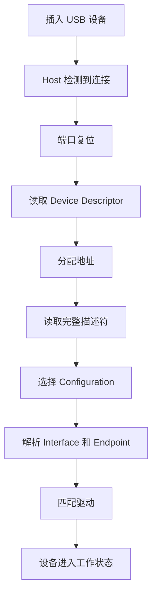

USB 是嵌入式 Linux 中最常见、也最值得系统学习的一类外设总线。U 盘、摄像头、USB 转串口、网卡、键盘、鼠标、采集卡，很多工程现场都会遇到它。对驱动开发来说，USB 不是“插上能用”这么简单，而是一套完整的体系：总线拓扑、角色分工、描述符、枚举、传输类型、驱动匹配、热插拔，缺一块都容易出问题。

这篇先把 USB 的底层地图搭起来。只要把架构和枚举流程吃透，后面再学 Linux USB 驱动框架、URB、描述符、gadget 和问题排查，就会顺很多。

## 一、USB 到底是什么

USB 的全称是 Universal Serial Bus，中文常叫“通用串行总线”。它表面上是一根线，实际上是一整套协议体系：

- 规定谁来发起通信
- 规定设备如何被识别
- 规定数据怎么收发
- 规定设备如何描述自己
- 规定驱动如何接管设备

USB 的最大特点有三个：

1. **主机主导**：所有通信都由 Host 发起
2. **即插即用**：设备插上后会自动被发现和识别
3. **层次清晰**：Device / Configuration / Interface / Endpoint 层次分明

这也是 USB 和串口、I2C、SPI 这些总线最不同的地方。USB 不是“打开设备文件就直接传数据”，它先要完成一整套枚举流程。

## 二、USB 系统里的四个核心角色

### 1. Host

Host 是主机，通常是 PC、工控机，或者带 USB Host 控制器的 Linux 开发板。

Host 的职责包括：

- 检测设备插入和拔出
- 复位端口
- 发起枚举
- 读取描述符
- 分配地址
- 绑定驱动
- 调度传输

可以把 Host 理解成 USB 世界里的“总指挥”。

### 2. Device

Device 是外设，例如：

- U 盘
- USB 摄像头
- USB 转串口芯片
- USB 网卡
- 采集卡

Device 的任务是：

- 响应 Host 的请求
- 提供自己的描述信息
- 提供端点
- 接收和发送数据

### 3. Hub

Hub 是 USB 集线器，把一个上游端口扩展成多个下游端口。

它不只是“接口扩展器”，还负责端口供电、连接状态检测和复位协同。

### 4. Gadget

Gadget 是 USB 设备侧功能的统称。Linux 开发板可以通过 gadget 伪装成：

- 串口
- 网卡
- 存储设备
- 自定义 USB 功能设备

这条线在嵌入式工程里非常实用，因为它能让板子直接通过 USB 和 PC 建立通信，不依赖额外外设。

## 三、USB 设备为什么不是一个“扁平对象”

USB 设备的组织结构是分层的，而不是一个简单的“插入一个设备就完事”。这套分层决定了驱动的设计方式。

### 1. Device

最外层实体。一个 USB 外设插上以后，Host 先把它看成一个设备。

### 2. Configuration

一个设备可以有一个或多个配置。配置描述了设备在某种工作模式下有哪些功能组合。

例如一个复合设备，可能既有串口功能，也有网络功能，不同配置可以暴露不同能力。

### 3. Interface

接口是功能单元。很多 USB 驱动实际接管的就是接口，而不是整个设备。

例如：

- 摄像头可能有视频接口和控制接口
- 复合设备可能有多个功能接口
- 一个设备可能包含多个逻辑子功能

### 4. Endpoint

端点是真正的数据通道。Host 和 Device 的数据交换，就是通过端点完成的。

常见方向：

- **IN**：设备向主机发数据
- **OUT**：主机向设备发数据
- **Control Endpoint**：控制端点，所有设备都必须有，默认是 0 号端点

你可以把端点理解成“设备内部开出来的几个通信窗口”。

## 四、USB 的四种传输方式

USB 之所以适合各种外设，是因为它支持不同特性的传输方式。

### 1. Control Transfer

控制传输用于初始化、配置和管理。

特点：

- 所有设备都必须支持
- 用于读取描述符、设置地址、设置配置
- 数据量小，但语义清晰、可靠

### 2. Bulk Transfer

批量传输适合大数据量场景，例如 U 盘。

特点：

- 适合高吞吐
- 保证数据正确性
- 不保证固定时延

### 3. Interrupt Transfer

中断传输适合小数据、低延迟、周期性的场景。

常见设备：

- 键盘
- 鼠标
- 部分控制类外设

### 4. Isochronous Transfer

等时传输适合音视频这类对实时性要求高、但允许少量丢包的场景。

常见设备：

- USB 摄像头
- USB 声卡

它更强调持续性和时序，而不是重传可靠性。

## 五、USB 插上后发生了什么

这是 USB 最关键的过程：**枚举**。

枚举的作用是：让 Host 认识设备、了解设备能力、分配地址、选择配置，并最终决定由哪个驱动接管。

### 枚举的大致步骤

1. 设备插入，Host 检测到电气连接
2. Host 复位端口
3. 设备进入默认地址状态
4. Host 读取设备描述符的一部分
5. Host 分配一个唯一地址
6. Host 读取完整设备描述符
7. Host 读取配置描述符
8. Host 选择一个配置
9. Host 绑定合适的驱动
10. 设备进入正常工作状态

### 为什么这一步重要

因为 USB 驱动不是靠你手工指定设备类型，而是靠描述符和 ID 匹配。

也就是说：

- 设备先告诉系统“我是什么”
- 系统再决定“谁来驱动我”

这就是 USB 高度标准化的地方。

## 六、枚举过程中最重要的几类描述符

这一篇先不逐字段展开，只建立整体理解。

### 1. Device Descriptor

描述设备的基础身份信息，例如：

- USB 版本
- Vendor ID
- Product ID
- 设备类信息
- 最大包长

### 2. Configuration Descriptor

描述设备的配置模式，包括：

- 有多少接口
- 总功耗
- 配置值

### 3. Interface Descriptor

描述某个功能接口，例如视频接口、存储接口、串口接口。

### 4. Endpoint Descriptor

描述某个接口下的端点，以及端点方向、类型、最大包长等。

### 5. String Descriptor

描述字符串信息，例如厂商名、产品名、序列号。

## 七、Linux 里怎么看 USB 枚举

学 USB 不能只看概念，必须能在系统里把它“看见”。

### 常用命令

```bash
lsusb
lsusb -v
lsusb -t
dmesg -w
usb-devices
cat /sys/kernel/debug/usb/devices
```

### 重点观察什么

- 设备是否被识别
- Vendor ID / Product ID 是否正确
- 接口和端点是否正常出现
- 驱动是否绑定成功
- 有没有超时、枚举失败、端点错误等日志

### 一个常见现象

插入 USB 设备后，`dmesg` 可能会看到类似：

```text
usb 1-1: new high-speed USB device number 4 using xhci_hcd
usb 1-1: New USB device found, idVendor=xxxx, idProduct=yyyy
usb 1-1: New USB device strings: Mfr=1, Product=2, SerialNumber=3
usb 1-1: Product: xxx
usb 1-1: Manufacturer: yyy
```

这说明设备完成了基本枚举。

## 八、一个最小化的枚举理解模型

可以把 USB 枚举理解成下面这个流程：



这张图虽然简单，但它是后面所有 USB 驱动理解的基础。

## 九、实际硬件上怎么验证

USB 不能只在纸面上学，必须在硬件上看见它。

### 实验 1：插一个 U 盘

观察：

```bash
lsusb
lsblk
dmesg -w
```

你会看到设备被识别成存储设备，并出现块设备节点。

### 实验 2：插一个 USB 转串口芯片

观察：

```bash
ls /dev/ttyUSB*
dmesg -w
```

你会看到系统加载串口驱动，并生成字符设备节点。

### 实验 3：插一个 USB 摄像头

观察：

```bash
lsusb
v4l2-ctl --list-devices
dmesg -w
```

你会看到视频设备节点出现，后续可以进一步做采集测试。

### 实验 4：让开发板做 gadget

如果你的板子支持 USB Device 模式，可以尝试：

- USB 串口 gadget
- USB 网卡 gadget

这一步特别适合嵌入式开发，因为它能让板子不依赖复杂外设就和 PC 建立稳定通信。

## 十、USB 枚举失败通常看什么

常见故障一般集中在以下几类：

### 1. 供电问题

设备根本没上电，或者电流不足。

现象：

- 插入后无反应
- `dmesg` 没有新设备日志

### 2. 线材或接口问题

USB 线只接通了供电，数据线没通，或者接触不良。

现象：

- 能亮灯，但不能识别
- 时好时坏

### 3. 描述符异常

设备返回的描述符不符合规范。

现象：

- 枚举到一半失败
- `lsusb -v` 报错
- 驱动无法绑定

### 4. 驱动不匹配

设备已经枚举成功，但没有合适驱动接管。

现象：

- 能看到设备 ID
- 但功能不可用

### 5. 带宽或传输问题

比如摄像头、声卡这类高数据量设备，如果总线带宽不够，可能出现掉帧、卡顿、超时。

## 十一、应该如何建立 USB 的学习脑图

建议记住这条主线：

**设备插入 → Host 检测 → 端口复位 → 读取描述符 → 分配地址 → 选择配置 → 绑定驱动 → 开始传输**

这条链路就是 USB 的骨架。

只要骨架清楚了，后面再学：

- Linux USB 驱动框架
- URB
- endpoint
- gadget
- 类驱动
- 调试排查

都会顺很多。

## 十二、小结

这一讲先把 USB 的整体地图搭起来。

你现在应该已经知道：

- USB 是 Host 主导的总线
- USB 设备有 Device / Configuration / Interface / Endpoint 的层次
- 枚举是 USB 驱动世界的第一件大事
- 描述符是系统认识设备的依据
- Linux 里可以通过 `lsusb`、`dmesg`、`usb-devices` 观察枚举过程
- 实际硬件实验对理解 USB 非常重要

下一讲我们会进入 Linux USB 驱动框架，看看 `struct usb_driver`、`probe()`、`disconnect()`、`id_table` 这些核心接口到底怎么工作。

> 🏷️ USB驱动 / 枚举 / 描述符 / 接口 / 端点 / Host / Gadget / Linux驱动

---

## 初学者扩展讲解


## USB 学习中的关键主线

USB 的核心主线可以概括为：Host 控制总线，Device 提供描述符，Interface 表示功能，Endpoint 承担数据通道，URB 表示一次传输请求。初学者只要把这五个词连成一条线，就能理解大多数 USB 驱动问题。

设备插入以后，Host 先检测到连接状态变化，然后复位端口，再读取设备描述符。设备描述符告诉系统这个设备的 VID、PID、USB 版本和最大包长等基本信息。接着系统继续读取配置描述符、接口描述符和端点描述符。配置描述符说明设备有几组配置；接口描述符说明设备暴露了哪些功能；端点描述符说明每个功能如何传输数据。

为什么很多 USB 驱动是按 interface 绑定，而不是按 device 绑定？因为一个 USB 设备可能是复合设备。例如一个 USB 摄像头可能同时包含视频接口、音频接口和控制接口；一个手机接到电脑上，可能同时提供 MTP、ADB、网络共享等功能。Linux 需要让不同接口绑定到不同驱动，所以 USB 驱动开发时经常看到的是 `struct usb_interface`，而不是只操作整个设备。

## 端点和传输类型要一步步理解

USB 端点有方向，IN 表示设备到主机，OUT 表示主机到设备。这个方向是从 Host 视角定义的，初学者很容易反过来理解。端点还有类型：control 用于控制传输，bulk 用于大块可靠数据，interrupt 用于小数据低延迟轮询，isochronous 用于音视频这类实时数据。

这里要特别注意：USB 的 interrupt transfer 不是 CPU 中断。它只是 USB 协议里的一种传输类型，由 Host 周期性查询设备端点。比如 USB 键盘鼠标常用 interrupt endpoint，是因为数据量小但希望延迟低；这和 PCIe 设备通过 MSI/MSI-X 触发 CPU 中断完全不是一回事。

## USB 排错的顺序

USB 排错建议按下面顺序走：

```bash
lsusb
lsusb -t
lsusb -v
dmesg -w
modprobe usbmon
```

`lsusb` 看设备是否枚举；`lsusb -t` 看拓扑、速率和驱动绑定；`lsusb -v` 看描述符是否符合预期；`dmesg` 看内核报错；`usbmon` 看传输细节。如果 `lsusb` 都看不到设备，优先查线材、供电、VBUS、OTG 模式和控制器驱动；如果 `lsusb` 能看到但驱动没绑定，再查 VID/PID、class/subclass/protocol 和模块是否加载；如果驱动绑定但传输失败，再看 URB 状态码、端点地址、包长、超时和设备协议。

## USB 驱动代码阅读建议

阅读 USB 驱动时，可以按函数调用顺序看。先看 `usb_device_id` 匹配表，确认它匹配的是 VID/PID 还是 class。再看 `usb_driver` 结构体，找到 `probe` 和 `disconnect`。进入 `probe` 后，重点看驱动如何解析 interface、如何找到 endpoint、如何分配私有结构体、如何注册字符设备或输入设备、如何提交 URB。最后看完成回调函数，因为真正的数据处理通常发生在 URB complete callback 里。

一个合格的 USB 驱动，不只是能提交 URB，还必须处理断开、超时、错误码、并发访问和资源释放。设备拔掉时如果还有 URB 在飞，驱动必须取消并等待完成，否则很容易出现 use-after-free 或内核崩溃。


## 面向初学者的阅读方法

刚开始学习这类驱动文章时，最容易犯的错误，是把每一个名词都当成孤立知识点去背。实际工程里，驱动不是由名词堆起来的，而是一条从硬件连接、总线枚举、内核匹配、资源申请、数据传输到用户态验证的完整链路。读这一篇时，建议先抓住三件事：第一，这个机制解决什么问题；第二，Linux 内核用什么对象表达它；第三，出现故障时应该从哪一层开始查。

例如看到“枚举”，不要只记住它叫 enumeration，而要理解为：系统需要先发现设备、识别设备能力、给设备分配地址或资源，然后才可能让具体驱动接管。看到“驱动匹配”，也不要只背 `probe()`，而要继续追问：是谁触发 `probe()`？匹配表里放了什么？设备还没有出现时驱动会不会执行？驱动执行以后第一步应该申请什么资源？这些问题连起来，才是真正能在板子上排错的知识。

## 从硬件到软件的完整路径

一条外设链路通常可以分成五层。第一层是硬件层，包括供电、时钟、复位、信号线、连接器和外设本身。第二层是总线层，也就是 USB、PCIe、I2C、SPI 这类协议如何发现设备、传输数据。第三层是内核框架层，Linux 会把设备抽象成 `struct device`、总线对象、驱动对象和资源对象。第四层是具体驱动层，驱动负责把通用框架和具体芯片寄存器、端点、队列、描述符连接起来。第五层是用户态验证层，包括命令行工具、测试程序、日志和性能统计。

初学者排错时不要一上来就怀疑驱动代码。设备没有被系统看到时，驱动代码通常还没有执行；驱动没有绑定时，可能是匹配表或描述符问题；驱动绑定了但不能传输时，才更可能进入 buffer、DMA、中断、同步和协议细节。按照这个顺序排查，可以避免在错误层面浪费时间。

## 建议准备的实验环境

学习 USB/PCIe 驱动，最好准备一台 Linux 主机、一块支持外设扩展的开发板，以及至少一个真实设备。USB 方向可以从 U 盘、USB 串口、USB 摄像头、USB 网卡开始；PCIe 方向可以从 NVMe、PCIe 网卡、PCIe 转串口卡、FPGA PCIe Endpoint 或开发板自带 PCIe 插槽开始。没有 PCIe 硬件时，也可以先通过 `lspci` 观察 PC 上已有设备，理解配置空间、BAR 和驱动绑定。

每次实验都建议记录四类信息：硬件连接照片或说明、内核版本和设备树/配置、关键命令输出、问题现象和解决过程。驱动学习的进步往往不是来自“看懂一段代码”，而是来自反复把现象、日志、源码和硬件状态对应起来。

## 常用观察命令

无论是 USB 还是 PCIe，都建议养成先看系统状态的习惯：

```bash
uname -a
dmesg -w
lsmod
cat /proc/interrupts
cat /proc/iomem
```

`uname -a` 用来确认内核版本；`dmesg -w` 用来实时观察设备插拔、枚举和驱动 probe 日志；`lsmod` 用来看模块是否加载；`/proc/interrupts` 用来看中断是否触发；`/proc/iomem` 可以帮助理解 MMIO 资源分配。不要小看这些基础命令，很多现场问题并不是复杂 bug，而是设备没枚举、驱动没加载、资源没分配或中断没到。

## 初学者最容易混淆的点

第一，不要把“用户态能看到设备节点”等同于“驱动完全正常”。设备节点只说明某个驱动创建了接口，真正的数据通路还要看读写、ioctl、mmap、poll、DMA 和中断是否正常。

第二，不要把“驱动 probe 成功”等同于“硬件已经工作”。probe 成功通常只代表资源申请和初始化基本完成，后续传输仍可能因为时钟、复位、buffer、协议状态或固件问题失败。

第三，不要把“命令没有报错”等同于“性能达标”。高速设备还要统计吞吐、延迟、CPU 占用、内存拷贝次数、DMA 是否真正生效，以及异常恢复是否可靠。

## 推荐的验证闭环

一篇驱动文章学完以后，不建议只停留在阅读层面。至少做一个小闭环：先用命令确认设备存在，再找到它绑定的驱动，然后观察内核日志，再做一次最小读写或传输测试，最后故意制造一个小错误，例如拔掉设备、改错匹配 ID、禁用模块或调整 buffer 数量，观察系统如何报错。只有经历过“正常路径”和“异常路径”，才能真正理解驱动框架为什么这样设计。
