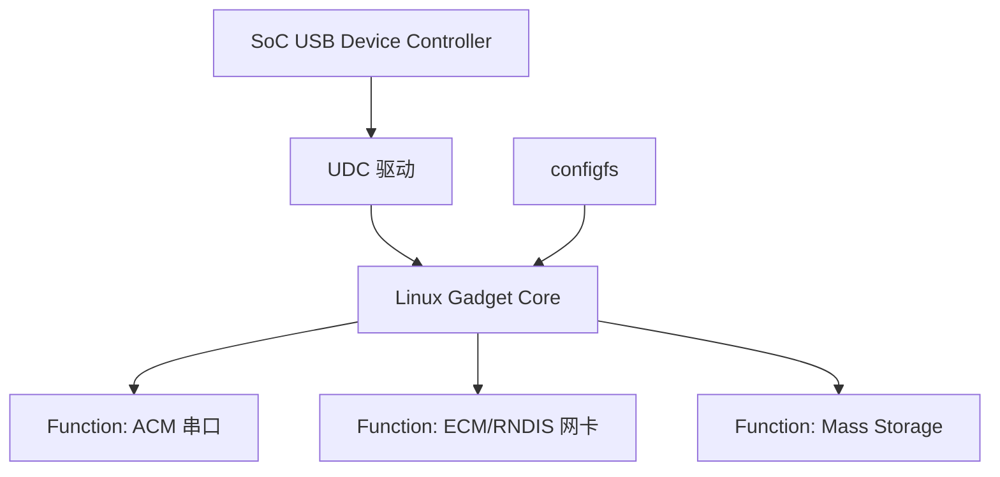

前面几篇主要站在 USB Host 视角看设备：PC 或 Linux 主机发现外设、枚举外设、绑定驱动、完成数据传输。这一篇换一个方向：**让我们的开发板变成 USB 设备**。

这就是 Linux USB Gadget 子系统要解决的问题。

在嵌入式开发中，Gadget 非常实用。它可以让一块 Linux 开发板通过 USB 伪装成串口、网卡、U 盘，甚至自定义设备，直接和 PC 建立通信链路。

## 一、什么是 USB Gadget

USB Gadget 指 Linux 设备侧 USB 功能框架。它运行在支持 USB Device/OTG 模式的 SoC 上，用来实现 USB 外设功能。

例如开发板可以被 PC 识别为：

- USB 串口
- USB 网卡
- USB 大容量存储设备
- HID 设备
- 自定义 USB 设备

这和 Host 驱动刚好相反：

- Host 驱动：Linux 主机接外设
- Gadget 驱动：Linux 设备伪装成外设

## 二、Gadget 为什么重要

在嵌入式工程中，Gadget 有很多实际价值：

1. **调试通信**：没有网口时，用 USB 串口输出日志
2. **网络连接**：用 USB 网卡让 PC 和板子互通
3. **产测下载**：设备进入 USB 模式完成烧录或测试
4. **产品功能**：让设备作为 USB 外设提供服务
5. **自定义协议**：实现厂商私有 USB 通信

很多开发板调试、量产工具和固件升级工具，背后都有 Gadget 的影子。

## 三、Gadget 的整体结构

Linux Gadget 通常涉及三层：

- UDC：USB Device Controller，具体硬件控制器
- Gadget Function：具体功能，例如串口、网卡、存储
- ConfigFS：用户态配置 gadget 的接口

可以这样理解：



## 四、确认硬件是否支持 Device 模式

不是所有 USB 口都能做 gadget。需要确认：

- SoC 是否支持 USB Device 或 OTG
- 板级 USB 口是否接到对应控制器
- 设备树里 `dr_mode` 是否为 `peripheral` 或 `otg`
- UDC 驱动是否加载

查看 UDC：

```bash
ls /sys/class/udc
```

如果这里没有任何控制器，说明 gadget 还没有可用的设备侧控制器。

## 五、ConfigFS 创建一个 USB 串口 Gadget

挂载 configfs：

```bash
mount -t configfs none /sys/kernel/config
cd /sys/kernel/config/usb_gadget
mkdir g1
cd g1
```

设置 VID/PID：

```bash
echo 0x1d6b > idVendor
echo 0x0104 > idProduct
```

创建字符串：

```bash
mkdir -p strings/0x409
echo "0123456789" > strings/0x409/serialnumber
echo "LongWay" > strings/0x409/manufacturer
echo "USB ACM Gadget" > strings/0x409/product
```

创建配置：

```bash
mkdir -p configs/c.1/strings/0x409
echo "ACM config" > configs/c.1/strings/0x409/configuration
echo 120 > configs/c.1/MaxPower
```

创建 ACM function：

```bash
mkdir functions/acm.usb0
ln -s functions/acm.usb0 configs/c.1/
```

绑定 UDC：

```bash
ls /sys/class/udc
echo <udc_name> > UDC
```

PC 端会看到一个 USB 串口设备。

## 六、USB 网卡 Gadget

常见 USB 网卡 gadget 有 ECM、RNDIS、NCM 等。

ECM 在 Linux 上比较自然，RNDIS 对 Windows 兼容性较好。

创建 ECM function：

```bash
mkdir functions/ecm.usb0
ln -s functions/ecm.usb0 configs/c.1/
```

配置网络：

```bash
ip link set usb0 up
ip addr add 192.168.7.2/24 dev usb0
```

PC 端配置同网段地址后，即可互 ping。

## 七、Mass Storage Gadget

Mass Storage Gadget 可以把板子上的一个文件或块设备模拟成 U 盘。

示例：

```bash
dd if=/dev/zero of=/tmp/disk.img bs=1M count=64
mkfs.vfat /tmp/disk.img
mkdir functions/mass_storage.0
echo /tmp/disk.img > functions/mass_storage.0/lun.0/file
ln -s functions/mass_storage.0 configs/c.1/
```

注意不要同时让 Linux 本地和 USB Host 端同时写同一个文件系统，否则容易损坏数据。

## 八、Gadget 和设备树的关系

在嵌入式 SoC 上，Gadget 能不能用，经常取决于设备树：

```dts
&usbdrd3_0 {
    status = "okay";
    dr_mode = "peripheral";
};

&usbdrd_dwc3_0 {
    status = "okay";
};
```

不同平台写法不同，但核心是：控制器、PHY、时钟、复位、电源、模式必须都正确。

## 九、常见问题排查

### 1. `/sys/class/udc` 为空

检查：

- UDC 驱动是否启用
- 设备树是否打开控制器
- USB 口是否支持 Device 模式
- PHY 是否正常

### 2. 绑定 UDC 后 PC 没反应

检查：

- USB 线是否支持数据
- dr_mode 是否正确
- VBUS 检测是否正常
- PC 端 dmesg 是否有枚举日志

### 3. 串口 gadget 没节点

检查 PC 端驱动是否加载，例如 Linux 下是否出现 `/dev/ttyACM0`。

### 4. 网卡 gadget ping 不通

检查 IP 地址、路由、防火墙和 host 端驱动。

## 十、Gadget 开发的工程价值

Gadget 不只是实验功能，它在产品里常用于：

- 出厂产测
- USB 升级
- 调试串口
- 网络调试
- 私有工具通信
- 设备模式功能交付

所以掌握 Gadget，可以让你更完整地理解 USB 的 Host 和 Device 两面。

## 十一、验证清单

- `/sys/class/udc` 能看到控制器
- configfs 已挂载
- gadget VID/PID 和字符串配置正确
- function 已链接到 config
- UDC 绑定成功
- PC 端能看到新 USB 设备
- 串口/网卡/存储功能可正常访问
- 解绑 gadget 不导致内核异常

## 十二、小结

USB Gadget 让 Linux 开发板从“主机”变成“设备”。它是嵌入式调试、产测和产品功能里非常实用的一块能力。

掌握 Gadget 后，你对 USB 的理解会更完整：Host 侧负责识别和驱动外设，Device 侧则负责模拟和暴露功能。

> 🏷️ USB Gadget / configfs / UDC / ACM / ECM / Mass Storage / 嵌入式Linux

---

## 初学者扩展讲解


## Gadget 与 Host 的思维切换

USB Gadget 学习最大的难点，是要把视角从 Host 切到 Device。平时在 PC 上插 U 盘、摄像头、串口线，Linux 主机扮演的是 Host；而 Gadget 场景下，开发板自己要伪装成一个 USB 设备，让另一台主机来枚举它。

这意味着开发板端要提供描述符、接口和端点，而不是读取别人的描述符。Linux Gadget 框架提供了 configfs，让用户可以通过文件系统方式组合设备功能。例如可以让开发板表现成 USB 串口、USB 网卡、U 盘或复合设备。背后真正负责硬件的是 UDC，也就是 USB Device Controller。

调试 Gadget 时，要同时看两端：开发板端看 UDC、configfs、gadget 绑定状态；主机端看 `lsusb`、`dmesg` 和驱动绑定。只看一端经常会误判。


## USB 学习中的关键主线

USB 的核心主线可以概括为：Host 控制总线，Device 提供描述符，Interface 表示功能，Endpoint 承担数据通道，URB 表示一次传输请求。初学者只要把这五个词连成一条线，就能理解大多数 USB 驱动问题。

设备插入以后，Host 先检测到连接状态变化，然后复位端口，再读取设备描述符。设备描述符告诉系统这个设备的 VID、PID、USB 版本和最大包长等基本信息。接着系统继续读取配置描述符、接口描述符和端点描述符。配置描述符说明设备有几组配置；接口描述符说明设备暴露了哪些功能；端点描述符说明每个功能如何传输数据。

为什么很多 USB 驱动是按 interface 绑定，而不是按 device 绑定？因为一个 USB 设备可能是复合设备。例如一个 USB 摄像头可能同时包含视频接口、音频接口和控制接口；一个手机接到电脑上，可能同时提供 MTP、ADB、网络共享等功能。Linux 需要让不同接口绑定到不同驱动，所以 USB 驱动开发时经常看到的是 `struct usb_interface`，而不是只操作整个设备。

## 端点和传输类型要一步步理解

USB 端点有方向，IN 表示设备到主机，OUT 表示主机到设备。这个方向是从 Host 视角定义的，初学者很容易反过来理解。端点还有类型：control 用于控制传输，bulk 用于大块可靠数据，interrupt 用于小数据低延迟轮询，isochronous 用于音视频这类实时数据。

这里要特别注意：USB 的 interrupt transfer 不是 CPU 中断。它只是 USB 协议里的一种传输类型，由 Host 周期性查询设备端点。比如 USB 键盘鼠标常用 interrupt endpoint，是因为数据量小但希望延迟低；这和 PCIe 设备通过 MSI/MSI-X 触发 CPU 中断完全不是一回事。

## USB 排错的顺序

USB 排错建议按下面顺序走：

```bash
lsusb
lsusb -t
lsusb -v
dmesg -w
modprobe usbmon
```

`lsusb` 看设备是否枚举；`lsusb -t` 看拓扑、速率和驱动绑定；`lsusb -v` 看描述符是否符合预期；`dmesg` 看内核报错；`usbmon` 看传输细节。如果 `lsusb` 都看不到设备，优先查线材、供电、VBUS、OTG 模式和控制器驱动；如果 `lsusb` 能看到但驱动没绑定，再查 VID/PID、class/subclass/protocol 和模块是否加载；如果驱动绑定但传输失败，再看 URB 状态码、端点地址、包长、超时和设备协议。

## USB 驱动代码阅读建议

阅读 USB 驱动时，可以按函数调用顺序看。先看 `usb_device_id` 匹配表，确认它匹配的是 VID/PID 还是 class。再看 `usb_driver` 结构体，找到 `probe` 和 `disconnect`。进入 `probe` 后，重点看驱动如何解析 interface、如何找到 endpoint、如何分配私有结构体、如何注册字符设备或输入设备、如何提交 URB。最后看完成回调函数，因为真正的数据处理通常发生在 URB complete callback 里。

一个合格的 USB 驱动，不只是能提交 URB，还必须处理断开、超时、错误码、并发访问和资源释放。设备拔掉时如果还有 URB 在飞，驱动必须取消并等待完成，否则很容易出现 use-after-free 或内核崩溃。


## 面向初学者的阅读方法

刚开始学习这类驱动文章时，最容易犯的错误，是把每一个名词都当成孤立知识点去背。实际工程里，驱动不是由名词堆起来的，而是一条从硬件连接、总线枚举、内核匹配、资源申请、数据传输到用户态验证的完整链路。读这一篇时，建议先抓住三件事：第一，这个机制解决什么问题；第二，Linux 内核用什么对象表达它；第三，出现故障时应该从哪一层开始查。

例如看到“枚举”，不要只记住它叫 enumeration，而要理解为：系统需要先发现设备、识别设备能力、给设备分配地址或资源，然后才可能让具体驱动接管。看到“驱动匹配”，也不要只背 `probe()`，而要继续追问：是谁触发 `probe()`？匹配表里放了什么？设备还没有出现时驱动会不会执行？驱动执行以后第一步应该申请什么资源？这些问题连起来，才是真正能在板子上排错的知识。

## 从硬件到软件的完整路径

一条外设链路通常可以分成五层。第一层是硬件层，包括供电、时钟、复位、信号线、连接器和外设本身。第二层是总线层，也就是 USB、PCIe、I2C、SPI 这类协议如何发现设备、传输数据。第三层是内核框架层，Linux 会把设备抽象成 `struct device`、总线对象、驱动对象和资源对象。第四层是具体驱动层，驱动负责把通用框架和具体芯片寄存器、端点、队列、描述符连接起来。第五层是用户态验证层，包括命令行工具、测试程序、日志和性能统计。

初学者排错时不要一上来就怀疑驱动代码。设备没有被系统看到时，驱动代码通常还没有执行；驱动没有绑定时，可能是匹配表或描述符问题；驱动绑定了但不能传输时，才更可能进入 buffer、DMA、中断、同步和协议细节。按照这个顺序排查，可以避免在错误层面浪费时间。

## 建议准备的实验环境

学习 USB/PCIe 驱动，最好准备一台 Linux 主机、一块支持外设扩展的开发板，以及至少一个真实设备。USB 方向可以从 U 盘、USB 串口、USB 摄像头、USB 网卡开始；PCIe 方向可以从 NVMe、PCIe 网卡、PCIe 转串口卡、FPGA PCIe Endpoint 或开发板自带 PCIe 插槽开始。没有 PCIe 硬件时，也可以先通过 `lspci` 观察 PC 上已有设备，理解配置空间、BAR 和驱动绑定。

每次实验都建议记录四类信息：硬件连接照片或说明、内核版本和设备树/配置、关键命令输出、问题现象和解决过程。驱动学习的进步往往不是来自“看懂一段代码”，而是来自反复把现象、日志、源码和硬件状态对应起来。

## 常用观察命令

无论是 USB 还是 PCIe，都建议养成先看系统状态的习惯：

```bash
uname -a
dmesg -w
lsmod
cat /proc/interrupts
cat /proc/iomem
```

`uname -a` 用来确认内核版本；`dmesg -w` 用来实时观察设备插拔、枚举和驱动 probe 日志；`lsmod` 用来看模块是否加载；`/proc/interrupts` 用来看中断是否触发；`/proc/iomem` 可以帮助理解 MMIO 资源分配。不要小看这些基础命令，很多现场问题并不是复杂 bug，而是设备没枚举、驱动没加载、资源没分配或中断没到。

## 初学者最容易混淆的点

第一，不要把“用户态能看到设备节点”等同于“驱动完全正常”。设备节点只说明某个驱动创建了接口，真正的数据通路还要看读写、ioctl、mmap、poll、DMA 和中断是否正常。

第二，不要把“驱动 probe 成功”等同于“硬件已经工作”。probe 成功通常只代表资源申请和初始化基本完成，后续传输仍可能因为时钟、复位、buffer、协议状态或固件问题失败。

第三，不要把“命令没有报错”等同于“性能达标”。高速设备还要统计吞吐、延迟、CPU 占用、内存拷贝次数、DMA 是否真正生效，以及异常恢复是否可靠。

## 推荐的验证闭环

一篇驱动文章学完以后，不建议只停留在阅读层面。至少做一个小闭环：先用命令确认设备存在，再找到它绑定的驱动，然后观察内核日志，再做一次最小读写或传输测试，最后故意制造一个小错误，例如拔掉设备、改错匹配 ID、禁用模块或调整 buffer 数量，观察系统如何报错。只有经历过“正常路径”和“异常路径”，才能真正理解驱动框架为什么这样设计。
