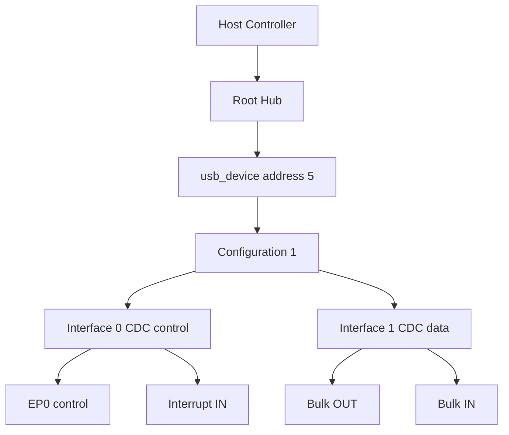
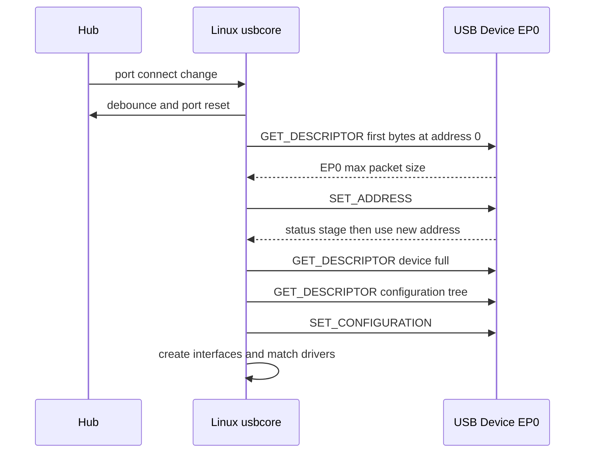

USB 驱动开发的第一道门槛不是某个 API，而是理解一个事实：**USB 总线上的每一次事务都由 Host 安排，Device 只能在被询问或被调度时响应。** Linux 能自动识别 U 盘、摄像头和串口，并不是设备“主动上报了自己”，而是 Host 控制器、hub 驱动和 usbcore 共同完成了一套严格的枚举状态机。

本篇从设备插入开始，沿 EP0 控制传输追到 Linux 创建 `usb_device`、解析描述符、选择配置并注册 `usb_interface`。后续文章中的驱动匹配、URB 和类驱动都建立在这条链路之上。

## Host、Device 与 Hub 组成一棵被轮询的树

USB 拓扑是一棵树。Root Hub 位于 Host 控制器之上，外部 Hub 继续扩展下游端口，普通 Device 处在叶子节点。Host 维护总线时间、设备地址和传输调度；Hub 负责端口供电、连接变化、复位与速率协商；Device 暴露描述符和 endpoint，并响应 Host 发起的 token。

这与“设备拉一根中断线通知 CPU”的总线不同。USB 所谓 interrupt transfer 仍由 Host 周期轮询 endpoint，只是调度延迟有上界。设备插入时，Hub 通过端口状态变化让 Host 知道连接发生，后续所有描述符读取和地址分配仍由 Host 发起。

低速、全速、高速设备使用不同的电气检测与时序，高速设备还会在复位阶段进行 chirp 握手。Linux 驱动通常不直接处理这些位级细节，但 `lsusb -t` 显示的速率和父端口关系，正是 Host 控制器枚举结果的可见投影。

## Device、Configuration、Interface 与 Endpoint 各自回答不同问题

USB 设备不是一个扁平对象。Device 表示一台物理设备和它的地址；Configuration 表示一整套可选工作配置；Interface 表示一个可独立绑定驱动的功能；Endpoint 才是实际数据通道。

复合设备最能说明这层关系。一台摄像头可能包含 VideoControl、VideoStreaming 和 AudioStreaming 等 interface。Linux 为整台设备创建一个 `struct usb_device`，再为每个 interface 创建 `struct usb_interface`。不同 interface 可以分别绑定 `uvcvideo`、音频或厂商驱动，而设备地址和 EP0 仍由同一个 `usb_device` 共享。

Endpoint 地址由方向位和端点号组成。IN/OUT 永远从 Host 视角命名：IN 是 Device 到 Host，OUT 是 Host 到 Device。Endpoint 0 双向存在并承担控制传输；其他 endpoint 的类型、最大包长和轮询间隔来自描述符。



## EP0 控制传输是枚举的语言

控制传输由 Setup、可选 Data、Status 三个阶段组成。Setup packet 固定 8 字节，包含 `bmRequestType`、`bRequest`、`wValue`、`wIndex` 和 `wLength`。方向、请求类型和接收者都编码在 `bmRequestType` 中。

标准请求 `GET_DESCRIPTOR` 用 `wValue` 的高字节指定描述符类型、低字节指定索引；`SET_ADDRESS` 把新地址放在 `wValue`；`SET_CONFIGURATION` 选择配置值。Status 阶段方向与 Data 阶段相反，用零长度包确认请求已经完成。

地址 0 是默认地址。新设备复位后只能在地址 0 响应 EP0，因此 Host 必须串行完成地址分配。Device 在收到 `SET_ADDRESS` 的 Setup 后不能立刻切换地址，而要等 Status 阶段成功结束；否则 Host 发出的状态包和 Device 使用的地址会错开。

## 枚举不是一组命令，而是一条状态迁移

典型枚举主线如下：



第一次只读取 Device Descriptor 前几个字节，是为了先得到 EP0 最大包长。Host 控制器必须用正确包长继续控制传输。分配地址后，usbcore 读取完整 Device Descriptor、配置头和 `wTotalLength` 指定的整棵配置描述符，再决定配置。

在 Linux 中，Hub 线程处理端口变化并分配 `usb_device`。`usb_new_device()` 继续完成设备级描述符读取、字符串和配置解析、授权与设备注册。选定配置后，`usb_set_configuration()` 为各 interface 建立对象并注册到 driver core，USB interface driver 才有机会匹配并进入 `probe()`。

因此 `lsusb` 已能看到 VID/PID，但功能驱动没有绑定，说明设备级枚举已经完成，问题更可能位于 interface 描述符、匹配表或模块；如果连 Device Descriptor 都读不稳，驱动 `probe()` 根本不会执行。

## 枚举失败要按最后一个成功状态定位

反复出现 `device descriptor read/64, error -71`，通常说明控制传输协议或信号完整性失败；地址分配后消失可能涉及电气、EP0 包长或 Device 固件切址时机；配置读取失败则应检查 `wTotalLength`、各 `bLength` 和实际返回字节数。

建议同时观察：

```bash
dmesg -w
lsusb -t
lsusb -v -d vid:pid
cat /sys/kernel/debug/usb/devices
```

`dmesg` 给出失败阶段和 errno；`lsusb -t` 给出拓扑、速度与驱动；`lsusb -v` 让描述符层次可见；debugfs 设备表可以核对设备地址、配置和 interface。需要包级证据时再进入 usbmon，而不是在设备尚未获得地址时先分析类协议。

## 小结

USB 枚举的核心是 Host 通过 EP0 逐步把一个“地址 0 的未知响应者”变成 Linux 中已配置、可匹配 interface 驱动的对象。Device/Configuration/Interface/Endpoint 是不同层次，`GET_DESCRIPTOR`、`SET_ADDRESS` 和 `SET_CONFIGURATION` 是状态迁移的关键请求，`usb_new_device()` 则连接了总线枚举与 Linux driver core。下一篇将继续追踪 interface driver 如何匹配、probe，以及设备拔出时为何必须先阻止新的异步 I/O。
