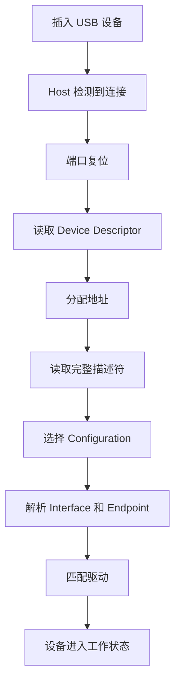

USB 是嵌入式 Linux 中最常见、也最值得系统学习的一类外设总线。U 盘、摄像头、USB 转串口、网卡、键盘、鼠标、采集卡，很多工程现场都会遇到它。对驱动开发来说，USB 不是“插上能用”这么简单，而是一套完整的体系：总线拓扑、角色分工、描述符、枚举、传输类型、驱动匹配、热插拔，缺一块都容易出问题。

这篇先把 USB 的底层地图搭起来。只要把架构和枚举流程吃透，后面再学 Linux USB 驱动框架、URB、描述符、gadget 和问题排查，就会顺很多。

## 一、USB 到底是什么

USB 的全称是 Universal Serial Bus，中文常叫“通用串行总线”。它表面上是一根线，实际上是一整套协议体系：

- 规定谁来发起通信
- 规定设备如何被识别
- 规定数据怎么收发
- 规定设备如何描述自己
- 规定驱动如何接管设备

USB 的最大特点有三个：

1. **主机主导**：所有通信都由 Host 发起
2. **即插即用**：设备插上后会自动被发现和识别
3. **层次清晰**：Device / Configuration / Interface / Endpoint 层次分明

这也是 USB 和串口、I2C、SPI 这些总线最不同的地方。USB 不是“打开设备文件就直接传数据”，它先要完成一整套枚举流程。

## 二、USB 系统里的四个核心角色

### 1. Host

Host 是主机，通常是 PC、工控机，或者带 USB Host 控制器的 Linux 开发板。

Host 的职责包括：

- 检测设备插入和拔出
- 复位端口
- 发起枚举
- 读取描述符
- 分配地址
- 绑定驱动
- 调度传输

可以把 Host 理解成 USB 世界里的“总指挥”。

### 2. Device

Device 是外设，例如：

- U 盘
- USB 摄像头
- USB 转串口芯片
- USB 网卡
- 采集卡

Device 的任务是：

- 响应 Host 的请求
- 提供自己的描述信息
- 提供端点
- 接收和发送数据

### 3. Hub

Hub 是 USB 集线器，把一个上游端口扩展成多个下游端口。

它不只是“接口扩展器”，还负责端口供电、连接状态检测和复位协同。

### 4. Gadget

Gadget 是 USB 设备侧功能的统称。Linux 开发板可以通过 gadget 伪装成：

- 串口
- 网卡
- 存储设备
- 自定义 USB 功能设备

这条线在嵌入式工程里非常实用，因为它能让板子直接通过 USB 和 PC 建立通信，不依赖额外外设。

## 三、USB 设备为什么不是一个“扁平对象”

USB 设备的组织结构是分层的，而不是一个简单的“插入一个设备就完事”。这套分层决定了驱动的设计方式。

### 1. Device

最外层实体。一个 USB 外设插上以后，Host 先把它看成一个设备。

### 2. Configuration

一个设备可以有一个或多个配置。配置描述了设备在某种工作模式下有哪些功能组合。

例如一个复合设备，可能既有串口功能，也有网络功能，不同配置可以暴露不同能力。

### 3. Interface

接口是功能单元。很多 USB 驱动实际接管的就是接口，而不是整个设备。

例如：

- 摄像头可能有视频接口和控制接口
- 复合设备可能有多个功能接口
- 一个设备可能包含多个逻辑子功能

### 4. Endpoint

端点是真正的数据通道。Host 和 Device 的数据交换，就是通过端点完成的。

常见方向：

- **IN**：设备向主机发数据
- **OUT**：主机向设备发数据
- **Control Endpoint**：控制端点，所有设备都必须有，默认是 0 号端点

你可以把端点理解成“设备内部开出来的几个通信窗口”。

## 四、USB 的四种传输方式

USB 之所以适合各种外设，是因为它支持不同特性的传输方式。

### 1. Control Transfer

控制传输用于初始化、配置和管理。

特点：

- 所有设备都必须支持
- 用于读取描述符、设置地址、设置配置
- 数据量小，但语义清晰、可靠

### 2. Bulk Transfer

批量传输适合大数据量场景，例如 U 盘。

特点：

- 适合高吞吐
- 保证数据正确性
- 不保证固定时延

### 3. Interrupt Transfer

中断传输适合小数据、低延迟、周期性的场景。

常见设备：

- 键盘
- 鼠标
- 部分控制类外设

### 4. Isochronous Transfer

等时传输适合音视频这类对实时性要求高、但允许少量丢包的场景。

常见设备：

- USB 摄像头
- USB 声卡

它更强调持续性和时序，而不是重传可靠性。

## 五、USB 插上后发生了什么

这是 USB 最关键的过程：**枚举**。

枚举的作用是：让 Host 认识设备、了解设备能力、分配地址、选择配置，并最终决定由哪个驱动接管。

### 枚举的大致步骤

1. 设备插入，Host 检测到电气连接
2. Host 复位端口
3. 设备进入默认地址状态
4. Host 读取设备描述符的一部分
5. Host 分配一个唯一地址
6. Host 读取完整设备描述符
7. Host 读取配置描述符
8. Host 选择一个配置
9. Host 绑定合适的驱动
10. 设备进入正常工作状态

### 为什么这一步重要

因为 USB 驱动不是靠你手工指定设备类型，而是靠描述符和 ID 匹配。

也就是说：

- 设备先告诉系统“我是什么”
- 系统再决定“谁来驱动我”

这就是 USB 高度标准化的地方。

### EP0 上真正发生的是三阶段控制传输

枚举步骤背后都是 Endpoint 0 控制传输。每次请求先发送 8 字节 Setup packet，其中 `bmRequestType` 编码方向、请求类型和接收者，随后是 `bRequest`、`wValue`、`wIndex` 和 `wLength`；随后是可选 Data 阶段，最后用反方向零长度 Status 阶段确认完成。

`GET_DESCRIPTOR` 用 `wValue` 高字节表示描述符类型、低字节表示索引。Host 首次只取 Device Descriptor 前 8 字节，是为了先得到 `bMaxPacketSize0`，再用正确 EP0 最大包长完成后续控制传输。`SET_ADDRESS` 的特殊点是 Device 必须等 Status 阶段结束后再切换到新地址，否则 Host 的状态包仍发往地址 0，而设备已经不再响应。

Linux hub 线程从 `hub_port_connect_change()` 进入 `hub_port_connect()`，完成端口去抖、reset、速度识别和 `usb_device` 分配。`usb_new_device()` 继续读取设备/配置描述符、建立字符串和配置对象并注册整台设备；`usb_set_configuration()` 选择配置并创建各 `usb_interface`，driver core 随后才匹配 interface driver。于是可以按状态区分问题：

```text
没有 connect 日志        -> VBUS / role / PHY / port
GET_DESCRIPTOR 失败       -> EP0 / 信号 / 固件描述符
SET_ADDRESS 后消失        -> 地址切换或状态阶段
lsusb 有设备但无驱动      -> interface / id_table / class
驱动已绑定但功能失败      -> endpoint / URB / class 协议
```

这条 Linux 对象链说明“枚举成功”不是一个模糊结果，而是从地址 0 到 `usb_device`、再到已配置 `usb_interface` 的连续发布过程。

## 六、枚举过程中最重要的几类描述符

这一篇先不逐字段展开，只建立整体理解。

### 1. Device Descriptor

描述设备的基础身份信息，例如：

- USB 版本
- Vendor ID
- Product ID
- 设备类信息
- 最大包长

### 2. Configuration Descriptor

描述设备的配置模式，包括：

- 有多少接口
- 总功耗
- 配置值

### 3. Interface Descriptor

描述某个功能接口，例如视频接口、存储接口、串口接口。

### 4. Endpoint Descriptor

描述某个接口下的端点，以及端点方向、类型、最大包长等。

### 5. String Descriptor

描述字符串信息，例如厂商名、产品名、序列号。

## 七、Linux 里怎么看 USB 枚举

学 USB 不能只看概念，必须能在系统里把它“看见”。

### 常用命令

```bash
lsusb
lsusb -v
lsusb -t
dmesg -w
usb-devices
cat /sys/kernel/debug/usb/devices
```

### 重点观察什么

- 设备是否被识别
- Vendor ID / Product ID 是否正确
- 接口和端点是否正常出现
- 驱动是否绑定成功
- 有没有超时、枚举失败、端点错误等日志

### 一个常见现象

插入 USB 设备后，`dmesg` 可能会看到类似：

```text
usb 1-1: new high-speed USB device number 4 using xhci_hcd
usb 1-1: New USB device found, idVendor=xxxx, idProduct=yyyy
usb 1-1: New USB device strings: Mfr=1, Product=2, SerialNumber=3
usb 1-1: Product: xxx
usb 1-1: Manufacturer: yyy
```

这说明设备完成了基本枚举。

## 八、一个最小化的枚举理解模型

可以把 USB 枚举理解成下面这个流程：



这张图虽然简单，但它是后面所有 USB 驱动理解的基础。

## 九、实际硬件上怎么验证

USB 不能只在纸面上学，必须在硬件上看见它。

### 实验 1：插一个 U 盘

观察：

```bash
lsusb
lsblk
dmesg -w
```

你会看到设备被识别成存储设备，并出现块设备节点。

### 实验 2：插一个 USB 转串口芯片

观察：

```bash
ls /dev/ttyUSB*
dmesg -w
```

你会看到系统加载串口驱动，并生成字符设备节点。

### 实验 3：插一个 USB 摄像头

观察：

```bash
lsusb
v4l2-ctl --list-devices
dmesg -w
```

你会看到视频设备节点出现，后续可以进一步做采集测试。

### 实验 4：让开发板做 gadget

如果你的板子支持 USB Device 模式，可以尝试：

- USB 串口 gadget
- USB 网卡 gadget

这一步特别适合嵌入式开发，因为它能让板子不依赖复杂外设就和 PC 建立稳定通信。

## 十、USB 枚举失败通常看什么

常见故障一般集中在以下几类：

### 1. 供电问题

设备根本没上电，或者电流不足。

现象：

- 插入后无反应
- `dmesg` 没有新设备日志

### 2. 线材或接口问题

USB 线只接通了供电，数据线没通，或者接触不良。

现象：

- 能亮灯，但不能识别
- 时好时坏

### 3. 描述符异常

设备返回的描述符不符合规范。

现象：

- 枚举到一半失败
- `lsusb -v` 报错
- 驱动无法绑定

### 4. 驱动不匹配

设备已经枚举成功，但没有合适驱动接管。

现象：

- 能看到设备 ID
- 但功能不可用

### 5. 带宽或传输问题

比如摄像头、声卡这类高数据量设备，如果总线带宽不够，可能出现掉帧、卡顿、超时。

### 从 errno 和 usbmon 判断枚举停在哪一步

`-EPROTO` 常见于 PID/CRC/握手等协议错误或信号问题，`-ETIMEDOUT` 表示预期响应未到，`-EPIPE` 表示 STALL。它们只有结合请求阶段才有意义：Device Descriptor 第一次读取失败与 `SET_CONFIGURATION` 后类请求 STALL 不是同一问题。

```bash
sudo modprobe usbmon
sudo cat /sys/kernel/debug/usb/usbmon/0u
```

usbmon 能看到 EP0 submit/complete、setup 字段、返回长度和 status。Wireshark 打开 usbmon 接口后可直接解码 `GET_DESCRIPTOR`、`SET_ADDRESS` 和 `SET_CONFIGURATION`。先找到最后一个成功请求，再检查 Device 固件对应 handler，比反复插拔更能定位地址切换和描述符问题。

## 十一、应该如何建立 USB 的学习脑图

建议记住这条主线：

**设备插入 → Host 检测 → 端口复位 → 读取描述符 → 分配地址 → 选择配置 → 绑定驱动 → 开始传输**

这条链路就是 USB 的骨架。

只要骨架清楚了，后面再学：

- Linux USB 驱动框架
- URB
- endpoint
- gadget
- 类驱动
- 调试排查

都会顺很多。

## 十二、小结

这一讲先把 USB 的整体地图搭起来。

你现在应该已经知道：

- USB 是 Host 主导的总线
- USB 设备有 Device / Configuration / Interface / Endpoint 的层次
- 枚举是 USB 驱动世界的第一件大事
- 描述符是系统认识设备的依据
- Linux 里可以通过 `lsusb`、`dmesg`、`usb-devices` 观察枚举过程
- 实际硬件实验对理解 USB 非常重要

下一讲我们会进入 Linux USB 驱动框架，看看 `struct usb_driver`、`probe()`、`disconnect()`、`id_table` 这些核心接口到底怎么工作。

> 🏷️ USB驱动 / 枚举 / 描述符 / 接口 / 端点 / Host / Gadget / Linux驱动

---
