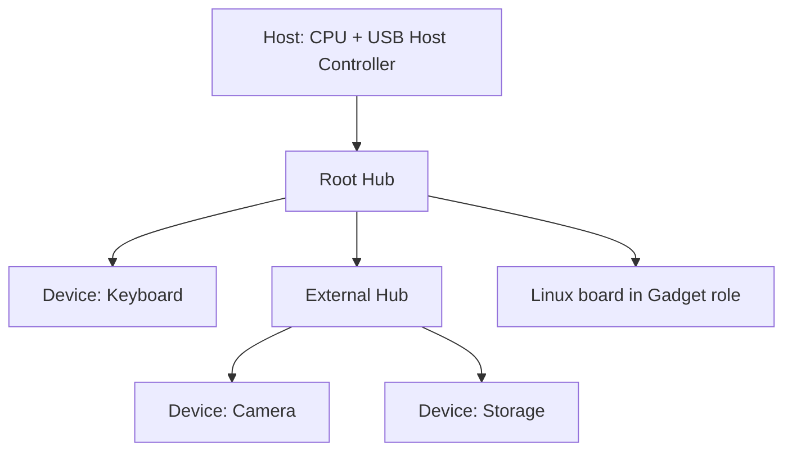
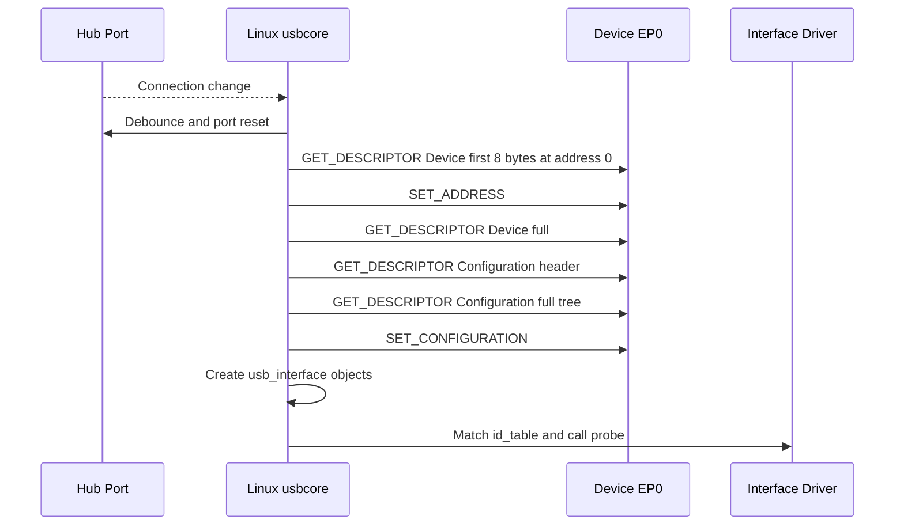

Universal Serial Bus，简称 USB，中文通常译为通用串行总线。它要解决的并不只是“用一根线传输数据”，而是让不同厂商、不同功能的外设在接入后能够被自动识别、分配资源，并通过统一协议长期工作。

在 USB 出现之前，键盘、鼠标、打印机和存储设备往往使用不同连接器与驱动模型。USB 把连接检测、设备身份、功能描述、带宽调度、供电和热插拔放进同一套体系。理解这套体系后，才能解释为什么插入设备时先出现总线日志，随后才出现 `/dev/ttyUSB0`、`/dev/video0` 或块设备节点。

本文从零建立 USB 模型。先认识总线上谁拥有控制权，再说明物理连接、设备层次、数据通道和传输类型，最后沿设备接入到 Linux 驱动绑定走完一次完整过程。

## 一、USB 是一条由 Host 主导的分层总线

USB 通信的第一条规则是：**Host 发起所有总线事务，Device 只响应 Host 安排的事务**。这里的 Host 可以是 PC，也可以是带 USB 主控制器的嵌入式 SoC；Device 则是 U 盘、摄像头、USB 网卡、键盘或自定义采集设备。

Device 不能像共享内存设备那样随时主动把数据推到线上。即使键盘产生了按键事件，也要等 Host 周期性查询它的 Interrupt Endpoint，数据才会离开设备。所谓“设备主动上报”描述的是业务语义，而不是总线仲裁权。

Hub 用于扩展端口。它有一个上行端口和多个下行端口，负责报告连接变化、控制端口供电并转发事务。Hub 不改变 Host 主导的规则，所有下游设备仍由同一个 Host 调度。

在嵌入式系统中还会遇到 Gadget。Gadget 不是新的总线角色，而是 Linux 对 Device 侧软件框架的称呼：同一块开发板可以通过 Gadget 模拟串口、网卡、存储设备或复合设备。



图中的树形结构很重要。USB 不是任意设备彼此通信的网络，数据路径总是从 Host 出发，穿过零个或多个 Hub 到达目标 Device。Linux 也会按照这棵树创建 `usb_device` 层次。

## 二、物理连接、速度与总线时间

USB 2.0 使用 D+、D- 差分线传输 Low-Speed、Full-Speed 和 High-Speed 数据，标称速率分别为 1.5 Mbit/s、12 Mbit/s 和 480 Mbit/s。USB 3.x 增加独立的 SuperSpeed 收发差分对，USB 2.0 与 SuperSpeed 链路可以在同一连接器中并存。Type-A、Type-B、Micro-B 和 Type-C 描述连接器形态，并不单独决定协议速度。

USB Type-C 还引入 CC 引脚，用于连接方向、角色和电流能力检测；USB Power Delivery 则在 CC 上进行更复杂的供电协商。它们与后文的 USB 数据协议相关但不等价：Type-C 线缆存在，不代表链路一定工作在 SuperSpeed，也不代表当前端口一定承担 Host 角色。

Host Controller 把总线时间切分并调度传输。USB 2.0 Full-Speed 以 1 ms frame 为基本周期，High-Speed 进一步使用 125 us microframe。Interrupt 和 Isochronous 端点会预留周期性服务机会，Bulk 传输使用剩余带宽，因此 Bulk 吞吐会随同一总线上周期性设备的占用而变化。

标称 480 Mbit/s 不是应用可用吞吐。同步字段、PID、地址、端点号、CRC、握手、帧边界和调度空隙都会产生开销。链路速度回答“每秒可以发送多少符号”，Endpoint 类型和 Host 调度才决定某个业务能获得多少服务机会。

## 三、Device、Configuration、Interface 与 Endpoint

Host 不能仅凭一根线知道设备能做什么。USB 因此把设备能力组织成四层：

- **Device**：表示物理设备，包含 USB 版本、VID/PID、默认控制端点能力等全局信息。
- **Configuration**：表示一种完整工作配置，包含供电属性以及若干 Interface。
- **Interface**：表示一个可由驱动接管的逻辑功能，例如摄像头控制、视频流或串口数据功能。
- **Endpoint**：表示单向数据通道，包含编号、方向、传输类型、最大包长和服务周期。

一个复合设备可以只有一个 Device，却暴露多个 Interface。Linux USB 驱动通常绑定 `usb_interface`，而不是独占整个 `usb_device`。这解释了为什么同一个复合设备可以同时出现声卡、摄像头和 HID 节点，并分别由不同驱动管理。

Endpoint 地址由方向位和端点号组成。IN 表示 Device 到 Host，OUT 表示 Host 到 Device，方向始终站在 Host 视角。端点 0 是双向控制通道，其余端点根据功能选择 Bulk、Interrupt 或 Isochronous。

USB 定义四种 Transfer：

| Transfer | 主要目标 | 是否重试 | 典型设备 |
| --- | --- | --- | --- |
| Control Transfer | 配置和管理设备 | 是 | 所有设备的 EP0 |
| Bulk Transfer | 可靠搬运大量数据 | 是 | U 盘、打印机、自定义数据设备 |
| Interrupt Transfer | 有上限的轮询延迟 | 是 | 键盘、鼠标、状态上报 |
| Isochronous Transfer | 固定周期和带宽 | 否 | 摄像头、USB 音频 |

Control Transfer 在 Endpoint 0 上完成设备管理。它由 Setup、可选 Data 和 Status 三个阶段组成。Setup packet 固定 8 字节，其中 `bmRequestType` 表示方向、请求类型和接收者，`bRequest` 表示命令，`wValue`、`wIndex` 和 `wLength` 携带参数与期望数据长度。

```mermaid
sequenceDiagram
    participant H as Host
    participant E as Device EP0
    H->>E: SETUP: bmRequestType, bRequest, wValue, wIndex, wLength
    alt Request has data stage
        H->>E: OUT data packets
        or Device returns data
        E-->>H: IN data packets
    end
    H->>E: Status stage in opposite direction
```

三阶段方向不能混淆。若 Data 阶段是 Device 到 Host，Status 阶段通常由 Host 发送零长度 OUT packet；若 Data 阶段是 Host 到 Device，Status 阶段通常是 Device 返回零长度 IN packet。

## 四、连接检测到地址分配：枚举前半程

现在才进入枚举。枚举是 Host 发现新连接、读取设备身份、分配地址、选择配置并创建可绑定功能对象的过程。

在 USB 2.0 中，Device 通过 D+ 或 D- 上拉表示连接及初始速度。Hub 检测端口状态变化后通知 Host Controller。Linux Hub 驱动的工作线程读取端口状态，在 `hub_port_connect_change()` / `hub_port_connect()` 一带处理连接变化、端口 debounce、供电和 reset。

端口 reset 后，设备位于默认地址 0。Host 先向 EP0 发出 `GET_DESCRIPTOR(Device)`，常见做法是先读取前 8 字节。这样可以取得 `bMaxPacketSize0`，Host 才知道默认控制端点一次 packet 能承载多少数据。随后 Host 更新 EP0 参数并继续读取完整 Device Descriptor。

地址 0 是共享的临时地址，不能让多个新设备长期使用。Host 发送 `SET_ADDRESS` 后为设备分配 1～127 范围内的地址。规范要求设备在该控制请求的 Status 阶段完成后才开始响应新地址，因此控制器和 Device 固件都必须正确处理这个切换点。

## 五、读取配置到驱动绑定：枚举后半程

获得地址后，Host 重新读取完整 Device Descriptor，接着读取 Configuration Descriptor 的固定头部，从 `wTotalLength` 得到整组配置描述符长度，再一次性读取 Configuration、Interface、Endpoint 和 Class-specific descriptor 字节流。

Host 选择一个 Configuration 并发送 `SET_CONFIGURATION`。从协议视角看，设备此时进入 Configured 状态，非零端点才可以按所选配置工作。从 Linux 视角看，usbcore 已经拥有足够信息来创建 interface 对象、生成 modalias 并匹配 class driver 或 vendor driver。



Linux 中，`usb_new_device()` 驱动新设备经过读取描述符、选择配置和注册 device model 对象的主流程；`usb_set_configuration()` 负责设置配置并建立 interface/endpoint 相关状态。具体内核版本中的函数拆分会变化，但“端口状态 -> EP0 识别 -> 地址 -> 配置 -> interface driver”是稳定主线。

驱动 `probe()` 没有进入，并不等于设备未连接。必须先判断枚举停在哪一层：若连 Device Descriptor 都未读出，问题仍在供电、PHY、线缆、EP0 或 Device 固件；只有 interface 已创建且 modalias 可见后，才应该检查 `id_table` 和驱动绑定。

## 六、如何观察枚举并定位失败

最基础的观察组合是 `dmesg -w`、`lsusb`、`lsusb -t` 和 sysfs：

```bash
dmesg -w
lsusb
lsusb -t
lsusb -v -d vid:pid
find /sys/bus/usb/devices -maxdepth 2 -type f -name modalias -print
```

`dmesg` 用来观察连接、reset、地址和错误码；`lsusb -t` 展示端口树、速度、interface 和已绑定驱动；`lsusb -v` 解码描述符；sysfs 用来确认内核是否已经创建 interface 及 modalias。

若需要看到控制请求本身，使用 usbmon：

```bash
sudo modprobe usbmon
sudo cat /sys/kernel/debug/usb/usbmon/0u
```

usbmon 记录 URB 提交与完成，可以确认 `GET_DESCRIPTOR`、`SET_ADDRESS` 和 `SET_CONFIGURATION` 是否发出、返回长度和 status 是什么。Wireshark 可以读取 usbmon 数据并按 Setup packet 字段解码。

常见错误需要放回阶段解释：

- `-EPROTO` 往往表示 packet/handshake/bit-stuff 等协议层异常，也可能由信号质量、错误速度或 Device 控制端点实现问题触发。
- `-ETIMEDOUT` 表示在规定时间内未得到完成，不自动等于线缆损坏；需要结合请求类型和前序响应判断。
- 反复出现 device descriptor read error，说明问题早于 interface driver。
- 已出现多个 interface 但某个功能没有节点，重点检查该 interface 的 class descriptor、altsetting 和 driver match。

排错时一次只回答一个问题：端口是否检测连接、reset 是否成功、EP0 是否能交换 Setup/Data/Status、地址是否切换、配置树是否完整、interface 是否创建、驱动是否绑定。这样才能避免跨层猜测。

**参考资料**

- [USB 2.0 Specification - USB-IF](https://www.usb.org/document-library/usb-20-specification)
- [The Linux-USB Host Side API](https://docs.kernel.org/driver-api/usb/usb.html)
- [Linux USB Power Management](https://docs.kernel.org/driver-api/usb/power-management.html)

## 七、小结

USB 是由 Host 统一调度的分层总线。Device 通过描述符说明自身能力，通过 Endpoint 暴露单向数据通道，通过四种 Transfer 获得不同的可靠性、时延和带宽语义。设备接入后，Linux 从 Hub 端口变化开始，经 EP0 控制传输、地址分配、配置读取和 interface 创建，最终才调用功能驱动的 `probe()`。

后续文章会建立在这条主线上：第二篇分析 Linux Host 驱动对象和生命周期，第三篇把配置描述符字节流逐项解码，第四篇再进入 URB 和真实数据传输。
