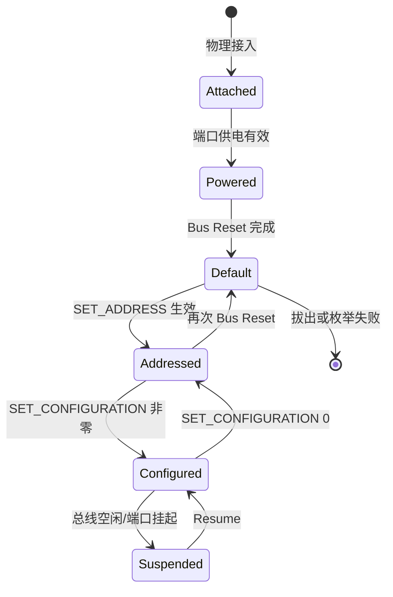
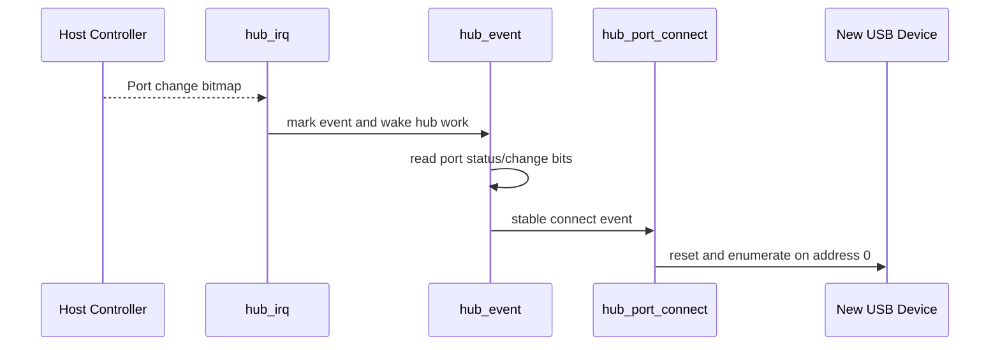
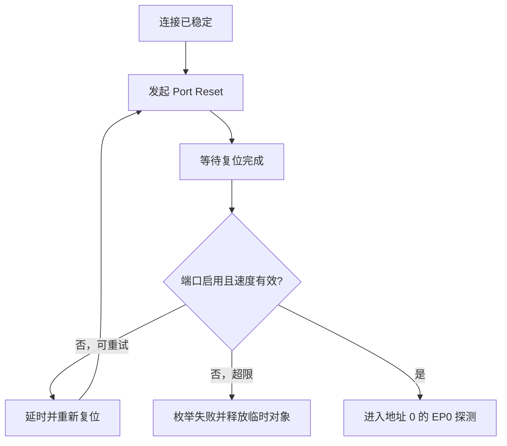
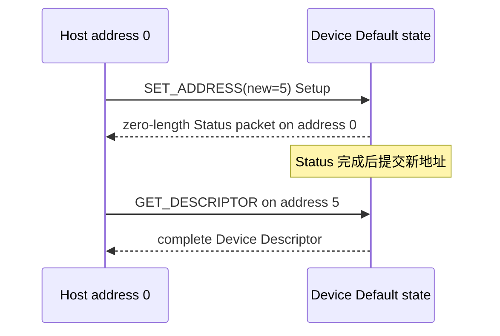

USB 设备插入端口后，并不会立刻变成 `/dev` 节点。

连接检测只说明电气状态发生变化。

Host 还必须确认连接稳定、复位端口、建立默认控制通道、读取设备身份、分配地址、解析全部配置，并为每个 Interface 创建 Linux 设备。

只有这些阶段都成功，驱动模型才有足够信息执行匹配。

本文以 Linux 6.12 为唯一代码基线。

重点不是背诵请求顺序，而是建立三种视角：

- USB 规范定义的设备状态。
- Hub 与 EP0 上可观察的协议事务。
- Linux USB Core 中对象创建、发布和回滚的调用链。

枚举问题之所以难，是因为三个视角的失败表现不同。

示波器看到复位脉冲，不代表描述符已经正确返回。

usbmon 看到 `SET_ADDRESS`，不代表后续 Configuration 可解析。

sysfs 出现 `usb_device`，也不代表某个 `usb_interface` 已经绑定驱动。

## 一、先把枚举理解成有回滚边界的状态机

USB 2.0 设备状态通常分为 Attached、Powered、Default、Addressed、Configured 和 Suspended。

这些状态不是 Linux 自己发明的抽象。

它们约束设备在每一阶段能够接受哪些标准请求，以及 Endpoint 0 应使用什么地址响应。



Default 状态有一个关键约束：设备地址仍是 0。

同一总线上的新设备都从地址 0 开始，因此 Host 必须串行处理会访问默认地址的关键阶段。

Addressed 状态表示 Host 已经给设备分配唯一地址，但还没有选择工作配置。

Configured 状态才表示 Interface 和非零 Endpoint 可以按所选 Configuration 工作。

Linux 内部还需要更多软件状态，例如端口是否正在去抖、`usb_device` 是否已经初始化、配置描述符是否完整解析、设备模型对象是否已经发布。

软件状态不能与规范状态简单画等号。

例如 `struct usb_device` 可以在设备仍使用地址 0 时已经分配，但它还不能被普通 Interface Driver 使用。

## 二、连接变化首先由 Hub 状态机处理

物理 Root Hub 与外部 Hub 都通过 Hub Class 语义报告端口变化。

主控制器驱动把 Root Hub 模拟成一个 USB Hub，usbcore 因而能够复用端口管理流程。

Linux 6.12 的关键实现位于：

- `drivers/usb/core/hub.c`
- `drivers/usb/core/message.c`
- `drivers/usb/core/config.c`
- `drivers/usb/core/driver.c`

`hub_irq()` 处理 Hub Interrupt Endpoint 或 Root Hub 状态位。

它只记录哪些端口发生变化并唤醒 Hub 工作线程，不在中断上下文中执行完整枚举。

`hub_event()` 在可睡眠上下文读取 Hub/Port 状态，处理过流、复位、连接、挂起和恢复事件。

对于连接变化，它最终进入端口连接处理路径。

不同 6.x 小版本中的内部辅助函数可能调整，但 Linux 6.12 的主线仍围绕 `hub_event()`、`hub_port_connect_change()` 与 `hub_port_connect()` 展开。



为什么不在第一次检测到连接后立即读描述符？

因为机械触点、Type-C 角色切换、VBUS 建立和 PHY 状态都可能产生短暂抖动。

若连接位反复变化，Host 会在错误的电气窗口发起复位，表现为间歇性 `-ENODEV`、`-EPROTO` 或设备反复出现/消失。

## 三、端口去抖决定“连接”是否可信

`hub_port_debounce()` 会在一段时间内重复读取端口状态。

它关注的不是一次采样值，而是连接位能否连续保持稳定。

去抖期间若连接状态变化，稳定计时重新开始。

超过总超时仍无法稳定，就不会进入正常枚举。

这一阶段可以区分三类问题：

| 现象 | 可能原因 | 首要证据 |
| --- | --- | --- |
| 连接位持续翻转 | 接触、VBUS、Type-C 角色、PHY | Hub port status、示波器 |
| 连接稳定但复位失败 | 信号质量、设备固件、速度检测 | reset 日志、协议分析仪 |
| 复位成功后请求失败 | EP0、描述符、时序 | usbmon Control Transfer |

去抖不是“随便 sleep 一会儿”。

它是带稳定窗口与总超时的采样算法。

驱动开发者不应在设备驱动 `probe()` 中再做一套端口去抖，因为 Interface Driver 获得控制权时 usbcore 已完成这一步。

若日志在 `new high-speed USB device` 前后循环，应先调查端口与枚举，而不是修改功能驱动。

## 四、Bus Reset 建立 Default 状态和速度信息

连接稳定后，Host 对目标端口发起 Bus Reset。

USB 2.0 的复位通过总线电气状态实现；SuperSpeed 使用其链路管理过程。

复位的结果至少包括：

- 设备回到 Default 状态。
- 设备地址恢复为 0。
- Endpoint 0 回到缺省状态。
- Hub/Host 确认设备速度。
- 旧的事务、Toggle 和部分协议状态被清理。

Linux 使用 `hub_port_reset()` 及相关辅助流程控制端口复位、等待恢复并读取端口状态。

复位可能重试，因为某些设备在供电刚稳定时需要更长启动时间。

重试不是无限的。

超过策略允许次数后，usbcore 会放弃本轮连接并清理尚未发布的设备对象。



这里的速度会影响 EP0 最大包长解释与后续总线调度。

Low/Full/High-Speed 的 `bMaxPacketSize0` 直接表示字节数。

SuperSpeed 设备的相关规则由 USB 3.x 描述符语义定义。

如果设备错误报告速度能力，后续 Control Transfer 可能在数据阶段发生 packet 长度或握手异常。

## 五、为什么先只读取设备描述符的前 8 字节

Host 尚不知道 EP0 的最大包长，却必须通过 EP0 读取描述符。

这形成一个自举问题。

USB 的解决方式是先按速度规定的初始假设发起短读取，取得 Device Descriptor 前 8 字节。

第 8 字节是 `bMaxPacketSize0`。

Linux 随后更新 Endpoint 0 的最大包长，再读取完整 18 字节 Device Descriptor。

这一步涉及 `usb_get_descriptor()` 和控制消息辅助路径。

Setup Packet 的典型字段为：

| 字段 | 读取 Device Descriptor 时的含义 |
| --- | --- |
| `bmRequestType` | Device-to-Host、Standard、Device |
| `bRequest` | `GET_DESCRIPTOR` |
| `wValue` | 高字节为 `USB_DT_DEVICE`，低字节为索引 0 |
| `wIndex` | 0 |
| `wLength` | 首次短读或完整 18 字节 |

如果首次 8 字节读取失败，Linux 根本没有可靠包长继续通信。

常见证据包括：

- `device descriptor read/8, error -71`
- `device descriptor read/64, error -110`
- usbmon 中 Setup 成功但 Data/Status 阶段失败

`-71` 通常对应 `-EPROTO`，只能说明协议层观察到错误，不能仅凭错误号断言是线材、CRC、固件还是包长。

`-110` 通常是 `-ETIMEDOUT`，表示事务在时限内没有完成。

## 六、SET_ADDRESS 的完成点不能搞错

Host 通过 `SET_ADDRESS` 给设备分配 1 到 127 之间的地址。

地址分配由 usbcore 统一管理，设备驱动不能自行挑选。

协议上，设备必须先在地址 0 完成该 Control Transfer 的 Status 阶段，然后才开始响应新地址。

如果设备在 Setup 后立即切地址，Host 发出的 Status IN 就会无人响应。

如果设备在 Status 完成后仍继续响应地址 0，后续完整描述符读取会失败。

Linux 用地址位图避免同一总线重复分配，并在失败或断开时回收地址。

地址属于当前枚举实例，而不是设备永久身份。

同一物理设备拔插后可能得到另一个地址。

稳定识别应使用 VID/PID、序列号、端口拓扑或业务协议身份，而不是把 `Bus 001 Device 005` 写死。



Linux 内部常以 `usb_set_address()` 完成请求与对象字段更新。

函数成功返回并不意味着枚举完成，只表示后续控制请求可以使用唯一地址。

## 七、完整 Device Descriptor 决定身份与后续策略

进入 Addressed 状态后，Host 读取完整 Device Descriptor。

关键字段包括：

- `bcdUSB`：设备遵循的 USB 版本。
- `bDeviceClass/SubClass/Protocol`：设备级类信息。
- `idVendor/idProduct`：VID/PID。
- `bcdDevice`：设备版本。
- `iManufacturer/iProduct/iSerialNumber`：字符串索引。
- `bNumConfigurations`：Configuration 数量。

VID/PID 是驱动匹配的重要输入，但不是唯一输入。

Class Driver 经常按 Interface Class 匹配。

某些设备使用 Device Class，某些复合设备通过 IAD 表达功能组合。

usbcore 还会根据授权、quirk、设备版本与平台策略调整行为。

字符串描述符通常稍后按需要读取。

读取字符串失败不一定阻止设备工作，但会影响日志、sysfs 可读性、稳定命名或用户空间规则。

序列号是设备提供的数据，驱动与 udev 不能假设它必然存在、唯一或格式正确。

## 八、Configuration 读取是两阶段长度发现

Configuration Descriptor 不是一个固定大小结构。

它后面串联 Interface、Endpoint、IAD 和 Class-specific Descriptor。

Host 首先读取 Configuration Descriptor 头部，得到 `wTotalLength`，再申请足够缓冲区读取整个描述符集合。

`wTotalLength` 来自不可信设备。

Linux 6.12 的 `config.c` 会检查最小长度、单个 `bLength`、描述符边界、数量上限和截断情况。

设备报告的长度不能直接作为无条件内存分配和指针步进依据。

解析结果形成：

- `struct usb_host_config`
- `struct usb_interface_cache`
- `struct usb_host_interface`
- `struct usb_host_endpoint`

原始字节流与 Linux 对象不是一一简单复制。

usbcore 会修正部分异常、记录 extra descriptor 区域，并为后续匹配准备对象关系。

如果 `wTotalLength` 小于实际描述符链，后面的 Interface/Endpoint 会被截断。

如果某个 `bLength` 为 0，朴素 TLV 解析器会死循环；usbcore 必须中止或跳过非法内容。

## 九、usb_enumerate_device 还会补充 BOS、字符串和策略信息

`usb_new_device()` 是新设备初始化的重要入口。

在 Linux 6.12 调用链中，`usb_enumerate_device()` 负责完成仅靠早期 Device/Configuration 读取尚未覆盖的信息。

根据速度和版本，可能读取 BOS Descriptor、设备能力以及字符串。

BOS 可承载 USB 2.0 Extension、SuperSpeed Capability、Container ID 和 Platform Capability。

Container ID 可帮助系统识别跨多个功能或模式呈现的同一物理设备。

USB 3.x 能力还影响 LPM 与链路电源管理策略。

这些读取失败的严重程度不同。

核心 Device/Configuration 无法解析通常会终止枚举。

某些可选能力读取失败可能只禁用相应优化。

工程日志应区分“设备不可用”和“某个能力被降级”。

## 十、选择 Configuration 不是简单取第一个

设备可能提供多个 Configuration，但同一时刻只能激活一个。

Linux 常由 `usb_choose_configuration()` 根据驱动可用性、类信息、电源需求与既有 quirk 选择配置。

随后 `usb_set_configuration()`：

1. 取消旧配置中的 Interface。
2. 发送 `SET_CONFIGURATION`。
3. 更新 `usb_device` 的 active configuration。
4. 为每个 Interface 创建并初始化 `struct usb_interface`。
5. 为默认 Alternate Setting 建立 Endpoint 状态。
6. 把 Interface Device 发布到 Linux Driver Model。

Configuration 的 `bMaxPower` 与供电属性可能影响选择。

总线供电设备不能无视上游端口可提供的电流。

自供电设备也必须正确报告属性，否则系统的挂起与远程唤醒策略可能错误。

发送 `SET_CONFIGURATION(0)` 会退回 Addressed 状态。

这不是拔出设备，但非 EP0 端点应停止工作，Interface Driver 也不能继续提交普通数据传输。

## 十一、Interface 发布后驱动模型才开始匹配

Linux USB Function Driver 通常绑定 Interface。

每个 `usb_interface` 都嵌入 `struct device`，其 bus 指向 `usb_bus_type`。

发布后，驱动核心根据 `usb_device_id` 表、modalias 与动态 ID 尝试匹配。

典型匹配维度包括：

- VID/PID。
- Device Class/SubClass/Protocol。
- Interface Class/SubClass/Protocol。
- 设备版本范围。
- Vendor-specific 组合。


一个复合设备的不同 Interface 可以绑定不同驱动。

例如 UVC 摄像头可能同时包含 VideoControl、VideoStreaming 和 Audio Interface。

`uvcvideo`、`snd-usb-audio` 可以在同一个 `usb_device` 下分别工作。

因此某个 Interface `probe()` 失败，不一定意味着整个 Device 枚举失败。

`lsusb` 能看到设备，而 `/dev/video0` 不存在，常常说明枚举完成但 Interface 匹配、probe 或用户接口发布失败。

## 十二、modalias、uevent 与模块自动加载

Interface 发布时，内核通过 uevent 向用户空间报告设备属性。

其中 `MODALIAS` 编码 VID/PID、版本和类信息。

模块工具根据 `modules.alias` 查找匹配驱动并加载模块。

自动加载链条为：

```text
usb_interface 发布
  -> uevent / MODALIAS
  -> 用户空间模块管理器
  -> modprobe 对应模块
  -> usb_register_driver
  -> 已存在 Interface 重新匹配
  -> probe
```

排查自动加载时应分层：

- `cat /sys/.../modalias` 是否存在且内容合理。
- `modprobe --show-depends` 是否找到模块。
- 模块是否成功加载。
- 驱动 ID 表是否真的匹配该 Interface。
- `probe()` 是否返回错误。

不要把“模块未自动加载”和“驱动 probe 失败”混为一个问题。

## 十三、usb_new_device 的发布边界与错误回滚

`usb_new_device()` 不只是读取描述符。

它还设置设备名称、授权状态、电源管理参数、配置、sysfs 属性，并把 `usb_device` 加入设备模型。

只有走到相应发布点，用户空间才稳定观察到对象。

失败路径必须撤销已经获得的资源：

- 释放地址号。
- 释放解析出的 Configuration。
- 释放临时缓冲区。
- 撤销已添加的设备对象。
- 关闭或复位端口状态。
- 避免遗留可被其他线程访问的半初始化指针。

枚举与断开可能并发。

用户在描述符读取期间拔出设备时，HCD 会以 `-ENODEV`、`-ESHUTDOWN` 等状态结束请求。

usbcore 的对象引用和端口锁保证清理路径不会把仍在使用的对象提前释放。

设备驱动无权修复 usbcore 内部枚举回滚；它应在自己的 `probe()` 失败路径遵守同样的逆序原则。

## 十四、从日志判断失败发生在哪一层

一条高质量故障记录至少包含：

- 内核版本与控制器驱动。
- 端口拓扑与设备速度。
- 从插入前开始的完整 dmesg 时间线。
- usbmon 的 Control Transfer。
- sysfs 中最后出现的对象层级。
- 供电、线缆和相同设备交叉验证。

可以按下表定位：

| 最后成功事件 | 尚未证明的内容 | 下一步 |
| --- | --- | --- |
| Port connect change | 连接稳定、复位 | 读 port status，测 VBUS/信号 |
| Reset success | EP0 工作 | 抓首次 GET_DESCRIPTOR |
| Device Descriptor success | Configuration 合法 | 检查 `wTotalLength` 与 TLV |
| SET_ADDRESS success | 新地址后通信 | 看完整描述符请求 |
| Configuration parsed | SET_CONFIGURATION 成功 | 看 Status 与端点启用 |
| Interface 出现在 sysfs | 驱动匹配/probe 成功 | 查 modalias、driver、probe 日志 |
| 驱动已绑定 | 用户接口发布/业务协议 | 查子系统节点与数据传输 |

usbmon 的 `S` 表示 submit，`C` 表示 complete。

同一 URB 的提交与完成记录必须配对观察。

只截取失败完成行，会丢失 Setup Packet、方向、期望长度和端点信息。

## 十五、复位、重新枚举和逻辑断开的区别

设备运行期间发生 Port Reset，不一定总是创建全新 `usb_device`。

usbcore 可以通过 reset 路径重新建立设备状态，并调用 Interface Driver 的 `pre_reset`、`post_reset` 或 `reset_resume`。

但若设备身份变化、端口真正断开或重置后无法恢复，系统会执行 disconnect，再按新连接重新枚举。

驱动不能假设地址、Configuration 或 Endpoint Toggle 永远不变。

在 reset 回调中，驱动应：

1. 阻止新 I/O。
2. 等待或取消在途 URB。
3. 保存需要的软件状态。
4. 让 usbcore 完成设备复位。
5. 重新下发设备私有配置。
6. 恢复队列并唤醒等待者。

这与首次 probe 不同，也与物理 disconnect 不同。

disconnect 后不能再访问接口对应端点；reset 成功后则允许重建业务状态。

## 十六、阅读 Linux 6.12 源码的具体路线

建议按调用目的阅读，而不是从 `hub.c` 第一行顺序读到最后：

1. 从 `hub_event()` 找端口变化分派。
2. 跟进 `hub_port_connect()` 看新设备尝试和重试。
3. 阅读 `hub_port_init()` 理解复位、速度与 EP0 自举。
4. 跟进 `usb_new_device()` 看设备枚举和发布。
5. 阅读 `usb_enumerate_device()` 看补充描述符与策略。
6. 阅读 `usb_get_configuration()` 和 `usb_parse_configuration()` 看不可信 TLV 解析。
7. 阅读 `usb_set_configuration()` 看 Interface 创建和发布。
8. 转到 `driver.c` 看 `usb_device_match()` 与 probe 包装。

阅读时为每个函数记录四项：

- 进入时对象处于什么状态。
- 函数获得了哪些资源或引用。
- 成功后发布了什么可见状态。
- 每个 `goto` 标签撤销哪些动作。

这样得到的是可用于驱动设计的生命周期模型，而不是一串函数名。

## 十七、与 USB 规范和 Linux 文档对照

USB 规范给出设备状态、标准请求、描述符和时序的协议真值。

Linux 文档解释内核对象和 API，但内部调用链仍应以 Linux 6.12 源码为准。

本文参考的一手资料：

- [USB 2.0 Specification](https://www.usb.org/document-library/usb-20-specification)
- [Linux 6.12 USB API documentation](https://www.kernel.org/doc/html/v6.12/driver-api/usb/usb.html)
- [Linux stable usbcore hub.c](https://git.kernel.org/pub/scm/linux/kernel/git/stable/linux.git/tree/drivers/usb/core/hub.c?h=linux-6.12.y)
- [Linux stable usbcore config.c](https://git.kernel.org/pub/scm/linux/kernel/git/stable/linux.git/tree/drivers/usb/core/config.c?h=linux-6.12.y)

野火文档提供了从概念到实验逐层展开的教学框架参考。

本文的叙述、图示、Linux 6.12 调用链和错误分析均按当前系列重新组织。

## 十八、小结

USB 枚举不是一次“读取 VID/PID”的动作，而是受设备状态约束、可重试且可回滚的完整事务链。

Hub 先把电气连接转化为稳定端口事件。

Bus Reset 让设备进入 Default 状态并确认速度。

EP0 前 8 字节读取解决最大包长自举问题。

`SET_ADDRESS` 在 Status 阶段结束后才提交新地址。

Configuration 解析把不可信描述符字节流转换成 `usb_host_config`、Interface、Alternate Setting 和 Endpoint 对象。

`usb_set_configuration()` 激活配置并发布 Interface。

驱动匹配发生在 Interface 发布之后，modalias、模块加载、ID 表和 `probe()` 是四个不同检查点。

排障时必须说清“最后证明到哪一层”，再选择 Hub 状态、usbmon、sysfs、驱动日志或电气测量。

掌握这条状态机后，后续描述符、usbcore 对象、URB 和 Interface Driver 生命周期才能放在正确的时间轴上。
