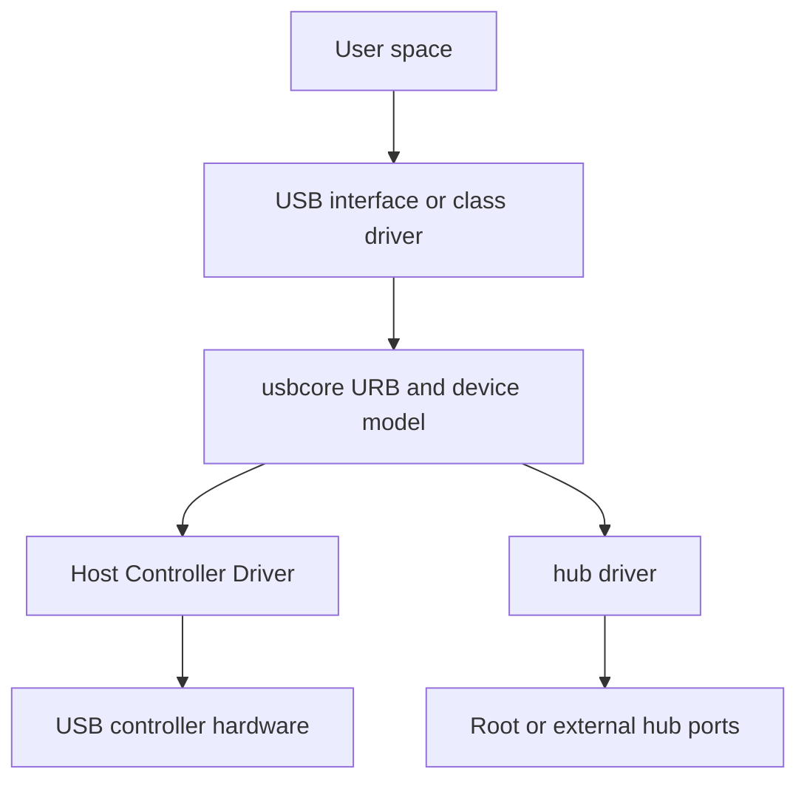

设备完成枚举后，Linux 还需要决定由哪个驱动管理每个 interface，并把 Host 控制器提供的传输能力转换成驱动可使用的 API。理解这条路径需要同时看四层：Host Controller Driver、usbcore、hub 驱动和 USB interface driver。

本篇不把 `probe()` 当作孤立入口，而是沿对象注册、匹配、私有状态和 disconnect 回收解释一个 Linux USB 驱动的完整生命周期。

## HCD、usbcore 与 hub 驱动分别负责什么

Host Controller Driver 把 xHCI、EHCI、DWC2 等硬件队列和寄存器适配为通用 HCD 接口。它向 usbcore 注册 root hub，并负责把 URB 转成控制器可执行的传输描述符。usbcore 管理 `usb_device`、`usb_interface`、配置、URB 和通用 API；hub 驱动监控端口状态、执行复位和枚举。

具体 USB interface driver 位于最上层。它不直接访问 Host 控制器寄存器，只取得已经解析好的 interface 和 endpoint，通过 URB 请求传输。这个分层让同一个 USB 串口驱动可以运行在 xHCI PC、EHCI SoC 或 DWC2 开发板上。



## `struct usb_driver` 描述的是 interface driver

典型驱动注册对象如下：

```c
static const struct usb_device_id demo_ids[] = {
    { USB_DEVICE(0x1234, 0x5678) },
    { }
};
MODULE_DEVICE_TABLE(usb, demo_ids);

static struct usb_driver demo_driver = {
    .name       = "demo_usb",
    .id_table   = demo_ids,
    .probe      = demo_probe,
    .disconnect = demo_disconnect,
};

module_usb_driver(demo_driver);
```

`module_usb_driver()` 最终使用 `usb_register_driver()` 把 `struct usb_driver` 注册到 USB bus。driver core 对已存在和后续出现的 `usb_interface` 执行匹配。`USB_DEVICE()` 匹配设备 VID/PID，但传给 `probe()` 的对象仍是命中的 interface；使用 class/subclass/protocol 匹配时更能看出 interface 粒度。

一个复合设备可能有多个 interface，其中只有一个命中当前 `id_table`。驱动不能假设 `interface 0` 或整台设备都归自己管理，应从 `intf->cur_altsetting` 取得当前 alternate setting 和 endpoint 描述符。

## 从匹配到 probe 的对象关系

`probe(struct usb_interface *intf, const struct usb_device_id *id)` 被调用时，设备已经配置，interface 已注册，但驱动资源尚未建立。常见顺序是：

1. 通过 `interface_to_usbdev(intf)` 取得共享的 `usb_device`；
2. 解析当前 alternate setting 和 endpoint；
3. 分配私有对象、缓冲区和 URB；
4. 必要时增加 `usb_device` 或 interface 引用；
5. 注册字符设备、input、netdev 或其他上层接口；
6. 用 `usb_set_intfdata()` 把私有对象绑定到 interface。

失败必须按相反顺序撤销。没有注册成功的资源不能交给 disconnect 重复释放，已增加的引用必须 `usb_put_dev()`。使用 managed API 可以减少部分回滚代码，但异步 URB 和用户打开引用仍需要驱动明确管理。

## disconnect 与 I/O 并发才是生命周期难点

拔出设备后，usbcore 先阻止新的 driver binding，再调用 `disconnect()`。但是用户线程、workqueue 和 URB completion 可能仍持有私有对象。安全顺序通常是：

```c
static void demo_disconnect(struct usb_interface *intf)
{
    struct demo *dev = usb_get_intfdata(intf);

    usb_set_intfdata(intf, NULL);
    mutex_lock(&dev->io_lock);
    dev->disconnected = true;
    mutex_unlock(&dev->io_lock);

    usb_kill_anchored_urbs(&dev->submitted);
    usb_deregister_dev(intf, &demo_class);
    kref_put(&dev->kref, demo_delete);
}
```

`usb_kill_anchored_urbs()` 等待 completion 不再执行，避免回调访问已经释放的私有对象。`kref` 让设备拔出与最后一个文件描述符关闭可以任意先后发生：disconnect 撤销硬件能力，最后一个引用才释放内存。

仅在 disconnect 中 `kfree(dev)` 是典型 use-after-free。反过来，只设置 disconnected 而不取消 URB，会让控制器继续完成已提交请求。生命周期必须同时封住新入口、终止在途异步工作并等待外部引用归零。

## 回调上下文与锁的选择

URB completion 通常运行在不能睡眠的上下文，不能直接获取会阻塞的 mutex 或调用用户拷贝。回调应更新短状态、唤醒 waitqueue、补充异步请求，耗时操作交给 workqueue 或用户线程。

`probe()` 和 `disconnect()` 可以睡眠，但它们与 file operation、completion、runtime PM 仍会并发。一个实用划分是：mutex 保护用户态控制路径与断开状态，自旋锁保护 completion 可访问的短队列，`kref` 保护对象寿命，anchor 管理在途 URB 集合。锁的选择来自调用上下文，而不是数据结构名字。

## 如何确认驱动为何没有绑定

先观察 interface，而不是只看整台设备：

```bash
lsusb -t
readlink /sys/bus/usb/devices/1-2:1.0/driver
cat /sys/bus/usb/devices/1-2:1.0/modalias
modinfo demo_usb
```

modalias 与模块别名不匹配，问题在 `id_table`；模块已加载但 driver symlink 不存在，需要看其他驱动是否抢先绑定、interface 是否授权、probe 是否返回错误。启用 dynamic debug 后，给 probe 的每个资源步骤记录错误码，比只打印“probe failed”更容易定位回滚位置。

Linux 官方 USB driver API 说明见 [USB support](https://docs.kernel.org/driver-api/usb/usb.html) 和 [Writing USB Device Drivers](https://docs.kernel.org/driver-api/usb/writing_usb_driver.html)。阅读实际驱动时，建议从 `struct usb_driver` 进入 probe，再沿 URB completion 和 disconnect 闭合对象寿命。

## 小结

Linux USB Host 栈通过 HCD 适配控制器、usbcore 管理设备与 URB、hub 驱动负责端口和枚举、interface driver 实现具体功能。`struct usb_driver` 注册的是 interface 驱动，`usb_register_driver()` 让 driver core 执行匹配，真正的工程难点则是 probe 成功后的异步 I/O 与 disconnect 并发。下一篇将深入描述符，解释匹配和 endpoint 发现所依赖的字节结构。
