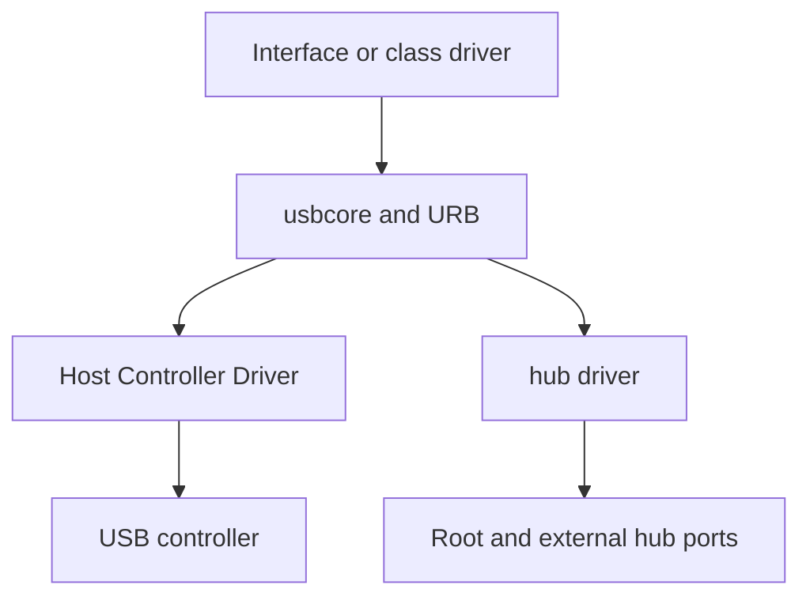

上一讲我们把 USB 的整体架构和枚举流程搭起来了。这一讲进入真正的驱动开发核心：**Linux USB 驱动框架**。

如果说上一讲解决的是“系统怎么认识一个 USB 设备”，这一讲解决的就是“内核怎么把这个设备交给正确的驱动，以及驱动怎么接管它”。USB 驱动不是简单的字符设备包装，也不是 platform 驱动那种“设备树节点对上就行”的模型，它的关键在于：**先匹配，再探测，再建立端点和传输通路**。

## 一、USB 驱动的核心思路

USB 设备插入后，Linux 内核会先完成枚举，解析出设备的 Vendor ID、Product ID、类信息和接口信息，然后在已注册驱动中寻找匹配项。匹配成功后，内核才会调用驱动的 `probe()`。

所以 USB 驱动最核心的两个回调是：

- `probe()`：设备绑定成功时调用
- `disconnect()`：设备拔出或解绑时调用

这两个回调构成了 USB 驱动最重要的生命周期。

## 二、USB 驱动为什么和其他驱动不一样

和 platform 驱动相比，USB 驱动的对象不是固定物理地址，而是一个被枚举出来的接口对象。和字符设备相比，USB 驱动不是天然就有 `open/read/write` 入口，它往往先通过内核 USB core 完成匹配，再决定如何把数据通路暴露给用户态。

换句话说，USB 驱动开发要同时理解三层逻辑：

1. **总线匹配**：怎么找到正确设备
2. **接口解析**：怎么找到正确接口和端点
3. **传输实现**：怎么把数据稳定传起来

## 三、Linux USB 驱动的基本结构

一个最小 USB 驱动通常围绕 `struct usb_driver` 定义：

```c
static const struct usb_device_id xxx_table[] = {
    { USB_DEVICE(0x1234, 0x5678) },
    { }
};
MODULE_DEVICE_TABLE(usb, xxx_table);

static int xxx_probe(struct usb_interface *interface,
                     const struct usb_device_id *id)
{
    return 0;
}

static void xxx_disconnect(struct usb_interface *interface)
{
}

static struct usb_driver xxx_driver = {
    .name       = "xxx_driver",
    .probe      = xxx_probe,
    .disconnect = xxx_disconnect,
    .id_table   = xxx_table,
};

module_usb_driver(xxx_driver);
```

这段骨架背后有几个关键点：

- `id_table` 负责告诉内核“我能匹配谁”
- `probe()` 负责“设备来了以后我怎么接管”
- `disconnect()` 负责“设备走了以后我怎么收尾”

## 四、id_table 是什么

`id_table` 可以理解为 USB 驱动的身份证匹配表。

### 1. 按 Vendor / Product 匹配

最常见的写法是：

```c
{ USB_DEVICE(0x1234, 0x5678) }
```

这表示这个驱动只接管某个厂商的某个产品。

这种方式适合：

- 厂商专用设备
- 调试板
- 自定义 USB 外设
- 私有协议设备

### 2. 按类匹配

USB 还有很多标准类驱动，例如 HID、Mass Storage、CDC、UVC。对于这类设备，驱动可以按类信息匹配，而不必只看某个固定 VID/PID。

### 3. 为什么有些设备不用你自己写 id_table

因为 Linux 内核已经提供了很多成熟的通用类驱动。比如 U 盘、键盘、鼠标、标准串口类设备，很多时候插上就能用，背后就是标准类规范和通用驱动在工作。

## 五、probe() 里应该做什么

`probe()` 是 USB 驱动真正的起点。设备被匹配成功后，内核会把控制权交给它。

典型工作包括：

1. 获取 `usb_device`
2. 保存驱动私有数据
3. 读取当前接口和 altsetting
4. 遍历端点
5. 判断端点类型和方向
6. 初始化 URB 或其他传输资源
7. 建立字符设备、netdev 或其他上层接口

一个常见的起步模板如下：

```c
static int xxx_probe(struct usb_interface *interface,
                     const struct usb_device_id *id)
{
    struct usb_device *udev = interface_to_usbdev(interface);
    struct usb_host_interface *cur_altsetting = interface->cur_altsetting;
    int i;

    for (i = 0; i < cur_altsetting->desc.bNumEndpoints; i++) {
        struct usb_endpoint_descriptor *ep;

        ep = &cur_altsetting->endpoint[i].desc;
        if (usb_endpoint_is_bulk_in(ep)) {
            /* 记录 bulk in 端点 */
        } else if (usb_endpoint_is_bulk_out(ep)) {
            /* 记录 bulk out 端点 */
        }
    }

    return 0;
}
```

### probe() 最重要的原则

`probe()` 不是“打印一下设备名”就结束的地方，而是驱动生命周期里最关键的资源接管点。你在这里要决定：

- 这个设备是否真的可用
- 端点是否符合预期
- 资源是否能正确分配
- 后续是否能稳定传输

如果 `probe()` 出错，应该及时返回错误码，不要强行让设备进入半初始化状态。

## 六、disconnect() 里应该做什么

`disconnect()` 是设备拔出时的回调。这个阶段最重要的不是“再做点什么功能”，而是**彻底释放资源**。

通常要处理：

- 取消未完成的 URB
- 停止异步传输
- 释放内存和私有结构体
- 注销字符设备或其他上层接口
- 清理引用计数

### 为什么热插拔特别危险

USB 设备是可以随时拔掉的。如果驱动里还有后台线程、workqueue、URB 完成回调或用户态引用没处理好，就很容易出现：

- 野指针
- 内核告警
- 内存泄漏
- 设备拔出后还继续访问旧对象

所以 USB 驱动必须非常重视生命周期管理。

## 七、接口 Interface 的意义

很多初学者会把 USB 设备理解成“一个设备一个驱动”，但实际情况往往是：**USB 驱动绑定的是接口，不一定是整个设备**。

这是因为很多设备本来就是复合设备：

- 一个接口负责控制
- 一个接口负责数据
- 一个接口负责音频
- 一个接口负责视频

因此，在 `probe()` 中你接收到的通常是 `struct usb_interface *interface`，而不是一个“裸设备”。

## 八、端点怎么找

真正的数据收发靠端点。你需要在 `probe()` 中遍历接口里的端点，判断它们是什么类型。

### 常见判断方法

```c
if (usb_endpoint_is_bulk_in(ep)) { }
if (usb_endpoint_is_bulk_out(ep)) { }
if (usb_endpoint_is_int_in(ep)) { }
if (usb_endpoint_is_isoc_in(ep)) { }
```

### 你要关注的几个维度

- 方向：IN 还是 OUT
- 类型：bulk / interrupt / isochronous / control
- 最大包长：影响吞吐和缓冲区设计
- 端点个数：决定是否能满足业务需求

很多 USB 驱动问题，根本原因不是代码逻辑错了，而是端点类型理解错了。

## 九、USB core 和驱动是怎么配合的

Linux 的 USB 子系统里，USB core 负责底层总线管理和驱动匹配，具体驱动负责设备行为。

USB core 做的事情包括：

- 枚举
- 解析设备对象
- 组织 interface
- 在驱动表中做匹配
- 调用 `probe()` / `disconnect()`

驱动做的事情包括：

- 初始化设备逻辑
- 选择端点
- 提交 URB
- 处理数据传输
- 暴露上层接口

可以把 USB core 理解成“交通规则”，驱动理解成“具体开车的人”。

### 从 Host Controller 到 interface driver 的分层

Host Controller Driver（xHCI/EHCI/DWC2 等）把硬件队列和寄存器适配为 `struct usb_hcd` 与通用 HCD 操作，向 usbcore 注册 root hub，并把 URB 转成控制器描述符；hub 驱动处理端口、复位和枚举；usbcore 管理 `usb_device`、`usb_interface` 与 URB；具体 `struct usb_driver` 只实现某个 interface 功能。



`module_usb_driver()` 最终调用 `usb_register_driver()`。注册后 driver core 对现有和后来出现的 interface 执行匹配。复合设备中，不同 interface 可以分别绑定 `uvcvideo`、`snd-usb-audio` 或厂商驱动，不能因为 VID/PID 相同就假设整台设备都属于一个 probe。

### disconnect 必须与 completion 和用户引用一起设计

拔出时 usbcore 调用 `disconnect()`，但已提交 URB completion、workqueue、阻塞 read 和已打开文件仍可能引用私有对象。可靠顺序是先清 `usb_set_intfdata()`、设置 disconnected 阻止新 I/O、撤销用户节点，再用 `usb_kill_anchored_urbs()` 等待在途请求退出，最后通过 `kref` 在最后一个 open 引用释放后销毁内存。

仅在 disconnect 中 `kfree()` 会让 completion 或 file operation 访问已释放对象；只设置标志却不 kill URB，则 HCD 仍可能 DMA 和回调。`usb_get_dev()/usb_put_dev()` 保护 `usb_device` 引用，但不自动保护驱动自有 buffer 和状态。

## 十、一个最小 USB 驱动的生命周期


这条主线一定要背下来。后面不管是 bulk 设备、HID、UVC，还是 gadget，核心生命周期都绕不开它。

## 十一、实际硬件上怎么验证

### 实验 1：观察现有 USB 设备

```bash
lsusb
lsusb -t
dmesg -w
```

重点看设备层级、驱动绑定和速率协商情况。

### 实验 2：插 USB 转串口

```bash
ls /dev/ttyUSB*
dmesg -w
```

观察系统是否加载串口驱动并创建设备节点。

### 实验 3：插 USB 摄像头

```bash
v4l2-ctl --list-devices
dmesg -w
```

观察视频类驱动是否接管成功。

### 实验 4：在支持 gadget 的板子上测试

尝试让开发板作为 USB Device 工作，验证：

- 串口 gadget
- 网卡 gadget
- 自定义 gadget

## 十二、调试 USB 驱动时看什么

### 1. dmesg

先看内核日志，确认 `probe()` 是否触发、端点是否正确、传输是否超时。

### 2. lsusb -v

看描述符细节，确认设备声明的能力是否与驱动预期一致。

### 3. usbmon

需要深入抓传输包时，用 usbmon 看控制请求、bulk 包和完成状态。

### 4. /sys 和 debugfs

很多 USB 总线信息都能从 sysfs 和 debugfs 进一步挖出来。

## 十三、几个最容易踩的坑

### 坑 1：只看 VID/PID，不看接口

复合设备经常不是整个设备绑定，而是某个接口绑定。

### 坑 2：端点类型判断错

把 bulk 当 interrupt，或者 IN/OUT 弄反，后面必然出问题。

### 坑 3：probe() 没做错误回滚

前面申请了资源，后面失败了却没释放，容易泄漏。

### 坑 4：热插拔没处理好

设备拔出后还访问旧对象，这是 USB 驱动最常见的稳定性问题之一。

### 坑 5：把 USB 当普通字符设备写

USB 驱动不是简单的 `open/read/write`，它先要走匹配和传输模型。

### 一个驱动需要占用伙伴 Interface 时怎么办

某些复合功能由多个 interface 组成，例如 CDC control/data。主 interface 的 probe 可通过描述符找到伙伴，再用 `usb_driver_claim_interface()` 让同一 driver 显式占用它；disconnect/unwind 时必须 `usb_driver_release_interface()`。不能只保存伙伴指针却让另一个驱动同时绑定，也不能假设 interface 编号固定为 0/1。

Claim 成功后两个 interface 仍有独立 intfdata 和 PM 状态。驱动要定义哪个对象拥有共享私有结构、哪个 disconnect 执行最终停止，避免两个 disconnect 重复释放。

### runtime PM 让“设备还插着但暂时不可传输”成为常态

USB autosuspend 会在空闲时让 interface/device进入低功耗，远程唤醒或下一次 I/O 再恢复。File operation 启动控制/数据传输前，可按驱动模型使用 `usb_autopm_get_interface()`，完成后 `usb_autopm_put_interface()`；失败与断开路径必须配对。

Runtime PM 回调应停止/恢复 URB 与设备 class 状态。仅因物理未拔出就假设 endpoint 永远可用，会在 suspend 窗口得到 `-EHOSTUNREACH/-ESHUTDOWN` 或丢失设备配置。

## 十四、把这一讲记成一句话

USB 驱动的核心不是“写一个会收发的程序”，而是：

**让 Linux 在设备插入后正确匹配它、接管它、找到端点、建立传输，并在拔出时安全释放。**

## 十五、小结

这一讲你应该掌握了：

- `struct usb_driver` 的作用
- `probe()` 和 `disconnect()` 的职责
- `id_table` 的匹配逻辑
- 接口和端点在驱动中的位置
- USB core 和驱动的协作方式
- 如何结合 `lsusb`、`dmesg`、`usb-devices` 做硬件验证

下一讲我们会继续深入 USB 描述符，把 Device Descriptor、Configuration Descriptor、Interface Descriptor 和 Endpoint Descriptor 逐个讲清楚。

---
