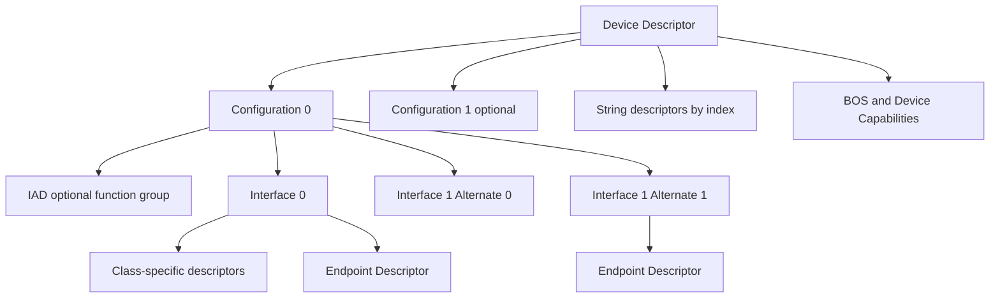
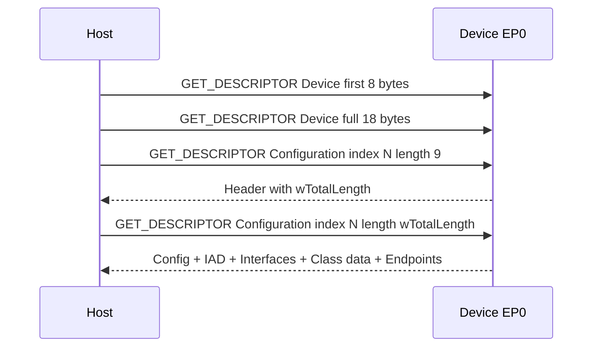
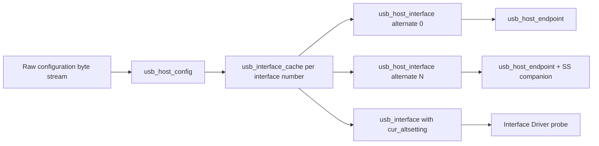

USB Host 在设备接入时面对的最初事实只有电气连接和 EP0。它不知道对面是键盘、摄像头还是复合设备，也不知道有哪些数据端点。描述符就是 Device 通过控制传输返回的自描述字节流，Host 据此创建软件对象并选择驱动。

描述符不是供人阅读的配置文件，而是有严格长度、类型、字节序和包含关系的二进制协议。一个字段错误可能让后续所有字节失去边界，因此“设备能返回一些数据”不代表描述符合法。本文从原始字节开始，逐层映射到 Linux 内核对象和真实排错证据。

## 一、描述符是一串可跳过、可扩展的 TLV 记录

大多数标准描述符都以两个字节开头：`bLength` 表示当前记录总长度，`bDescriptorType` 表示记录类型。解析器先检查剩余长度是否至少包含这两个字节，再用 `bLength` 跳到下一条记录。未知类型可以跳过，这让新 Class 或新 Capability 能与旧 Host 共存。

```text
offset +0: bLength
offset +1: bDescriptorType
offset +2: type-specific fields ...
```

`bLength` 不能小于该描述符的最小长度，也不能超过当前 buffer 剩余长度；等于 0 会让遍历停在原地。Device 固件中最危险的错误之一，是修改结构体字段却忘记同步总长度，导致 Host 把下一条记录中间的某个字节误认为 `bLength`。

USB 多字节整数采用 little-endian。Linux 头文件将 `idVendor`、`idProduct`、`bcdUSB`、`wTotalLength`、`wMaxPacketSize` 等声明为 `__le16`，驱动读取时使用 `le16_to_cpu()` 或已有 helper，而不是假设 CPU 一定是小端。

配置描述符集合形成如下树：



树中只有一个层次关系，但在线上传输时它们仍是连续字节。Configuration 的 `wTotalLength` 给出从 Configuration 头开始到该配置最后一条 subordinate descriptor 的总长度。

## 二、Device Descriptor 定义设备级身份和 EP0 能力

Device Descriptor 固定 18 字节。Linux 对应结构是 `struct usb_device_descriptor`：

```c
struct usb_device_descriptor {
    __u8  bLength;
    __u8  bDescriptorType;
    __le16 bcdUSB;
    __u8  bDeviceClass;
    __u8  bDeviceSubClass;
    __u8  bDeviceProtocol;
    __u8  bMaxPacketSize0;
    __le16 idVendor;
    __le16 idProduct;
    __le16 bcdDevice;
    __u8  iManufacturer;
    __u8  iProduct;
    __u8  iSerialNumber;
    __u8  bNumConfigurations;
} __attribute__((packed));
```

`bcdUSB` 表示设备遵循的 USB 规范版本，采用 BCD 编码，例如 `0x0200` 表示 USB 2.00。它不是当前链路协商速度；一个声明 USB 2.0 的设备仍可能只支持 Full-Speed。

`bMaxPacketSize0` 描述默认控制端点。在 USB 2.0 Low/Full/High-Speed 设备中，它直接给出 EP0 最大 packet size；SuperSpeed 使用编码值表达固定集合。Host 枚举早期先取 Device Descriptor 前 8 字节，核心目的就是获得这个字段。

VID/PID 是常见匹配条件，但不是功能协议。相同芯片在不同产品中可能使用不同 PID；同一 VID/PID 的固件版本也可能暴露不同 Interface。驱动即使按 `USB_DEVICE()` 匹配，仍应检查实际描述符和 endpoint 组合。

Class 字段可以位于 Device 层，也可以位于 Interface 层。`bDeviceClass == 0` 表示每个 Interface 自己声明 class，这在复合设备中很常见。若 Device 层声明 Miscellaneous/IAD 等 class，仍需继续解析 Interface 才能知道具体功能。

三个 `i*` 字段不是字符串，而是 String Descriptor 索引；0 表示没有对应字符串。`bNumConfigurations` 表示设备提供多少套 Configuration，Host 最终只激活其中一套。

## 三、Configuration Descriptor 划定一套完整工作方案

Configuration Descriptor 固定头部为 9 字节，但 `wTotalLength` 覆盖完整配置树。Host 通常先读取 9 字节，再按 `wTotalLength` 申请 buffer 并读取全部内容：



头部关键字段包括：

- `bNumInterfaces`：Interface 编号的数量，不是 Descriptor 记录数量。多个 Alternate Setting 共用一个 Interface 编号。
- `bConfigurationValue`：`SET_CONFIGURATION` 使用的值，不一定等于描述符索引加一。
- `bmAttributes`：bit7 必须为 1，另有 self-powered 与 remote wakeup 属性。
- `bMaxPower`：USB 2.0 单位为 2 mA，SuperSpeed 的解释不同，不能直接把原始数值当 mA。

`wTotalLength` 小于实际记录长度会截断后续 Interface/Endpoint；大于设备实际返回长度会导致 short response 或解析失败。`bNumInterfaces` 与实际不同也会造成 Interface 缺失。Device 固件应在生成描述符后进行静态长度校验，而不是手工维护多处常量。

Linux 将每个已读取配置保存为 `struct usb_host_config`。其中 `desc` 是标准 Configuration 头，`interface[]` 指向按 Interface 编号组织的 `usb_interface_cache`，还保存 IAD 和配置级 extra descriptor。选择配置后，`usb_device->actconfig` 指向当前激活的 `usb_host_config`。

多 Configuration 不等同于 Alternate Setting。Configuration 改变整个设备功能组合和供电方案，通过 `SET_CONFIGURATION` 切换；Alternate Setting 只改变一个 Interface 的端点布局，通过 `SET_INTERFACE` 切换。

### 从一段十六进制字节手算配置树

假设 usbmon 或固件数组中出现下面这段简化数据：

```text
09 02 20 00 01 01 00 80 32
09 04 00 00 02 ff 01 01 00
07 05 81 02 00 02 00
07 05 02 02 00 02 00
```

第一条记录的 `09 02` 表示长度 9、类型 Configuration。紧随其后的 `20 00` 是 little-endian `wTotalLength = 0x0020 = 32`，表示从第一个 `09` 起一共 32 字节。`bNumInterfaces = 1`、`bConfigurationValue = 1`、`bmAttributes = 0x80`，`bMaxPower = 0x32`，在 USB 2.0 语义下表示 100 mA。

第二条 `09 04` 是 Interface Descriptor：Interface 0、Alternate 0、两个 Endpoint，class `0xff` 表示 vendor-specific。第三、四条 `07 05` 是 Endpoint Descriptor。`0x81` 表示 Endpoint 1 IN，`0x02` 表示 Endpoint 2 OUT；两者 `bmAttributes = 0x02`，因此都是 Bulk；`00 02` 按小端解释为 `wMaxPacketSize = 512`。

这个例子可以做四项一致性检查：四条记录长度相加必须等于 32；Interface 声明的 Endpoint 数必须等于后续归属它的两条 Endpoint；Endpoint 地址在当前 Alternate 内不能重复；High-Speed Bulk 的 512 字节最大包长与设备速度相符。任一项不成立，都应在提交 URB 前拒绝该布局。

下面的边界检查展示 Host 或测试工具如何安全遍历 TLV。真实内核 parser 还会处理重复 Endpoint、无效 Alternate、extra descriptor 和分配失败：

```c
static int walk_descriptors(const u8 *buf, size_t len)
{
    size_t off = 0;

    while (off < len) {
        u8 bLength;
        u8 bDescriptorType;

        if (len - off < 2)
            return -EINVAL;

        bLength = buf[off];
        bDescriptorType = buf[off + 1];
        if (bLength < 2 || bLength > len - off)
            return -EINVAL;

        pr_debug("descriptor type=%u offset=%zu length=%u\n",
                 bDescriptorType, off, bLength);
        off += bLength;
    }

    return off == len ? 0 : -EINVAL;
}
```

这段代码故意不把 `buf + off` 直接转换为任意长结构体：只有确认当前类型和最小长度后才能读取类型字段；多字节值还要用 unaligned/little-endian helper，避免未对齐访问和越界。

### Linux usbcore 如何取得并解析配置

内核主线源码把配置读取和解析放在 `drivers/usb/core/config.c` 一带。`usb_get_configuration()` 根据 Device Descriptor 的 `bNumConfigurations` 循环获取配置，先请求固定头，再根据 `wTotalLength` 读取完整字节流。解析过程由配置、Interface、Endpoint 等函数分层完成，并把无法识别的标准外记录保留为 `extra`。

可以把稳定逻辑概括为：

```text
usb_get_configuration
  -> GET_DESCRIPTOR(Configuration, header)
  -> validate wTotalLength and allocate buffer
  -> GET_DESCRIPTOR(Configuration, full length)
  -> usb_parse_configuration
       -> discover interface numbers and alternates
       -> parse each usb_host_interface
       -> parse endpoint descriptors and companions
       -> preserve class/vendor extra descriptors
```

解析阶段只建立 Host 侧对象，不会自动激活所有 Alternate。`SET_CONFIGURATION` 后每个 Interface 通常处于 Alternate 0；class driver 根据业务协商结果再调用 `usb_set_interface()`。因此 sysfs 中“能看到 Alternate 1”与“当前正在使用 Alternate 1”是两件事。

usbcore 会容忍部分可跳过扩展，但不能容忍破坏边界的长度。驱动也不能因为内核已经解析成功就跳过协议级校验：内核保证结构安全，class driver 仍负责验证 subtype、版本、Endpoint 组合以及厂商协议约束。

## 四、Interface、Alternate Setting 与 IAD 组织功能

Interface Descriptor 固定 9 字节，包含 `bInterfaceNumber`、`bAlternateSetting`、`bNumEndpoints` 和 class/subclass/protocol。Linux Interface Driver 的匹配通常发生在这一层。

同一个 `bInterfaceNumber` 可以有多个 Alternate Setting。Alternate 0 通常是默认状态，可能没有数据 Endpoint；高带宽 Alternate 则提供 Isochronous Endpoint。UVC/UAC 驱动先在控制面协商参数，再用 `usb_set_interface()` 选择合适 Alternate，设备才开始占用周期带宽。

Linux 使用 `struct usb_host_interface` 保存一个 Alternate Setting：

```c
struct usb_host_interface {
    struct usb_interface_descriptor desc;
    int extralen;
    unsigned char *extra;
    struct usb_host_endpoint *endpoint;
    char *string;
};
```

`usb_interface->altsetting[]` 包含所有 Alternate，`cur_altsetting` 指向当前选择。驱动不能假设 `altsetting[0]` 的 `bAlternateSetting` 一定为 0，也不能把数组下标当协议中的 Alternate 值，应读取 `desc.bAlternateSetting`。

Interface Association Descriptor，简称 IAD，用于说明多个连续 Interface 属于同一个功能。CDC ACM 的 Communication/Data Interface、UVC 的 VideoControl/VideoStreaming Interface 都可能通过 IAD 组合。IAD 包含 `bFirstInterface`、`bInterfaceCount` 和 function class 信息，但它不替驱动自动 claim 伙伴 Interface；Linux 驱动仍需按框架规则管理绑定关系。

复合设备排错时，先画出 Interface 编号、Alternate 和 IAD 范围，再看驱动绑定。只盯 VID/PID 很容易把“某个功能 Interface 没有匹配”误判成“整个 Device 驱动失败”。

### CDC ACM 如何用多个 Interface 表示一个串口功能

一个典型 CDC ACM 功能不是“一个 Interface 加两个 Bulk Endpoint”这么简单。描述符常按以下顺序排列：

```text
IAD: first interface 0, count 2, CDC function
  Interface 0: Communication Class
    Header Functional Descriptor
    Call Management Functional Descriptor
    ACM Functional Descriptor
    Union Functional Descriptor: master 0, slave 1
    Interrupt IN Endpoint: serial-state notification
  Interface 1: CDC Data Class
    Bulk OUT Endpoint
    Bulk IN Endpoint
```

IAD 从功能层说明 Interface 0 和 1 属于一组；Union Functional Descriptor 从 CDC 协议层说明 master/slave 关系。Linux `cdc_acm` 需要同时理解两者以及实际 Endpoint。如果固件只修改 Interface 编号却未更新 Union descriptor，Device 仍可能完成标准枚举，但驱动无法正确找到 Data Interface。

控制请求如 `SET_LINE_CODING` 发往 Communication Interface，实际串口 payload 走 Data Interface 的 Bulk Endpoint，状态变化则通过 Interrupt IN 上报。描述符把控制面和数据面拆开，驱动也必须分别建立对象和错误处理路径。

### UVC/UAC 为什么依赖 Alternate Setting

视频和音频流需要周期带宽。设备无法在尚未协商格式时长期占用最大带宽，因此 Streaming Interface 的 Alternate 0 常常不含数据 Endpoint，表示停止流；Alternate 1、2、3 等提供不同 `wMaxPacketSize`、burst 或 service interval。

UVC Host 先在 VideoControl/VideoStreaming class descriptor 中获得格式、frame 和 endpoint 能力，通过 Probe/Commit 控制请求确定参数，再选择能够容纳 payload 的 Alternate。若应用关闭视频，驱动切回 Alternate 0 释放带宽。

UAC 也会用 Alternate 区分采样格式和通道数，并通过 Clock Source、Format Type 与 feedback endpoint 描述同步关系。只打印当前 `cur_altsetting` 会遗漏设备支持的其他流模式，排错时必须遍历整个 `altsetting[]`。

Interface 数组下标、`bInterfaceNumber` 和 `bAlternateSetting` 是三个不同概念。驱动应按 descriptor 字段查找目标，而不是假定它们连续且等于数组下标。

## 五、Endpoint Descriptor 决定实际数据通道

Endpoint Descriptor 对应 `struct usb_endpoint_descriptor`，关键字段如下：

- `bEndpointAddress`：bit7 是方向，低 4 bit 是端点号。
- `bmAttributes`：低 2 bit 表示 Control、Isochronous、Bulk 或 Interrupt；高位对 Isochronous 同步/用途有额外含义。
- `wMaxPacketSize`：低 11 bit 是最大 packet payload；High-Speed 周期端点还使用高位编码每个 microframe 的附加 transaction 数。
- `bInterval`：服务周期，解释取决于速度和 transfer 类型，不能统一按毫秒读取。

Linux 将标准 Endpoint Descriptor 包装在 `struct usb_host_endpoint` 中，并附加 SuperSpeed companion、HCD 状态和 endpoint-specific extra 数据。驱动通常使用 helper 判断类型和方向：

```c
struct usb_host_interface *alt = intf->cur_altsetting;

for (int i = 0; i < alt->desc.bNumEndpoints; i++) {
    struct usb_endpoint_descriptor *ep = &alt->endpoint[i].desc;

    if (usb_endpoint_is_bulk_in(ep))
        dev->bulk_in = ep->bEndpointAddress;
    else if (usb_endpoint_is_bulk_out(ep))
        dev->bulk_out = ep->bEndpointAddress;
}
```

`bNumEndpoints` 不包括 EP0。Direction 站在 Host 视角：Bulk IN 是设备到 Host，Bulk OUT 是 Host 到设备。`wMaxPacketSize` 是 packet 上限，不是一次 URB 的最大长度；一个大 URB 会被 HCD 分解为多个 packet。

SuperSpeed Endpoint 后通常跟随 SuperSpeed Endpoint Companion Descriptor。`bMaxBurst`、mult 和 `wBytesPerInterval` 进一步描述 burst 与周期服务能力。只读取传统 Endpoint Descriptor 会低估 SuperSpeed 周期端点需求。

### wMaxPacketSize 与 bInterval 必须结合速度解释

最大 packet size 的合法范围由速度和 transfer 类型共同决定。常见值可以作为排错基线，但最终应以对应版本规范为准：

| Speed / Transfer | 常见或最大 packet 语义 |
| --- | --- |
| Full-Speed Bulk | 最大 64 字节 |
| High-Speed Bulk | 固定最大 512 字节 |
| SuperSpeed Bulk | 最大 1024 字节，并结合 `bMaxBurst` |
| Full-Speed Isochronous | 每 frame 最大 1023 字节 |
| High-Speed Isochronous | 每 microframe 可编码最多 3 次 transaction |
| Interrupt | 上限和周期编码随速度变化 |

看到 High-Speed Bulk Endpoint 声明 64 字节并不一定违反规范，但会降低每次 transaction 的利用率；看到 1024 字节则明显不符合 High-Speed Bulk。驱动通常不应擅自“修正”描述符，而应拒绝无法支持的布局并给出字段证据。

`bInterval` 最容易被误读。在 Full-Speed Interrupt 中它接近以 frame 为单位的轮询间隔；High-Speed/SuperSpeed 周期端点采用指数编码，服务间隔是若干个 125 us microframe。直接把原始值打印成“毫秒”会得出错误结论。

Host 根据 Endpoint 能力和总线预算决定能否启用某个 Alternate。`usb_set_interface()` 返回 `-ENOSPC` 时，可能是周期带宽不足，而不是控制请求无法到达。此时需要同时观察整个拓扑中其他周期 Endpoint 的占用。

### Endpoint 地址、halt 与 toggle 属于运行时状态

Descriptor 只定义 Endpoint 静态能力。运行时还存在 halt/stall、data toggle、stream ID、队列和 HCD 私有状态。Control Endpoint 可以通过 `CLEAR_FEATURE(ENDPOINT_HALT)` 清除 halt，usbcore/HCD 还要同步重置软件 toggle；只让 Device 清状态而 Host 继续使用旧 toggle，会造成后续 packet 无法正确确认。

Interface 切换 Alternate 时，旧 Alternate 的 Endpoint 会被禁用，正在排队的 URB 必须完成或取消，新 Alternate 的 Endpoint 才进入可用状态。驱动不能缓存一个 Endpoint 指针后跨 `usb_set_interface()` 永久使用而不重新核对当前布局。



## 六、String、BOS 与 Class-specific Descriptor 扩展标准模型

String Descriptor 使用 UTF-16LE。Host 先读取 string index 0 得到支持的语言 ID，再以语言 ID 读取 Manufacturer、Product、Serial Number 等字符串。字符串便于人类识别和设备稳定命名，但驱动不应把可变产品字符串当唯一协议标识。

Binary Object Store，简称 BOS，是 USB 2.01 及以后用于承载 Device Capability 的容器。USB 2.0 Extension、SuperSpeed Capability、Container ID、Platform Capability 等都通过 BOS 扩展。BOS 不属于某个 Configuration，Host 在设备级读取它。

BOS 头中的 `wTotalLength` 和 `bNumDeviceCaps` 与 Configuration 的总长度/子记录数量起类似作用。常见 Capability 包括：

- **USB 2.0 Extension**：例如 Link Power Management 能力。
- **SuperSpeed USB Device Capability**：支持的速度、U1/U2 exit latency 等。
- **SuperSpeedPlus Capability**：更细的 sublink speed attribute。
- **Container ID**：把多个功能或多种连接方式标识为同一个物理设备容器。
- **Platform Capability**：由 UUID 区分平台扩展，例如 WebUSB 或 Microsoft OS 2.0 descriptor set 的入口。

Platform Capability 只提供发现入口，具体平台描述符可能需要 vendor request 读取。Host 看到 BOS 并不表示自动理解所有 UUID；未知 Capability 应按 `bLength` 安全跳过。

String Descriptor 的语言表也需要边界处理。index 0 返回一个或多个 16-bit LANGID，后续请求同时携带 string index 和 language ID。设备若只支持某个语言却对任意 LANGID 返回数据，会掩盖固件错误；Host 工具应按语言表发请求。

Class-specific Descriptor 没有统一结构，具体格式由 HID、CDC、UVC、UAC 等 Class 规范定义。Linux parser 会把无法归入标准结构的字节保存在 `extra/extralen`。驱动可以使用 `usb_get_extra_descriptor()` 按类型寻找记录，但仍要校验 class subtype 和最小长度：

```c
const void *raw;
int ret;

ret = usb_get_extra_descriptor(intf->cur_altsetting,
                               USB_DT_CS_INTERFACE, &raw);
if (ret)
    return ret;

/* Cast only after validating class-specific length and subtype. */
```

HID Report Descriptor 是通过控制请求单独读取的，不一定直接嵌在 Configuration 字节流中；UVC/UAC 则会在 Interface extra 中放置多种 class descriptor。不能因为它们都叫“Class Descriptor”就使用同一个解析方式。

Class parser 还要处理“同一类型、不同 subtype”的情况。CDC 的 Header、Union、ACM 都使用 `CS_INTERFACE` 类型；UVC 的 Input Terminal、Processing Unit、Format、Frame 也共享 class-specific 类型。只用 `usb_get_extra_descriptor(..., USB_DT_CS_INTERFACE, ...)` 只能找到第一条，完整解析需要在 extra buffer 中继续遍历并检查 subtype。

安全解析通常保留两个层次：通用 walker 只负责长度和边界，class parser 在确认 subtype 后检查对应最小结构长度、版本和交叉引用。例如 UVC Frame Descriptor 引用的 format index、CDC Union 引用的 Interface 编号，都必须落在当前配置实际对象内。

## 七、从 lsusb 字节到驱动匹配和故障证据

先用 `lsusb -v` 观察层次，再回到原始字节或 usbmon：

```bash
lsusb -d 1234:5678 -v
lsusb -t
sudo cat /sys/kernel/debug/usb/usbmon/0u
```

阅读顺序应是 Device -> Configuration -> IAD -> Interface/Alternate -> Endpoint -> Class-specific。每次看到 `bNumEndpoints`，确认后面属于该 Alternate 的 Endpoint 数量；看到 `wTotalLength`，确认整组记录没有越界或截断；看到 driver bind，确认它绑定的是哪个 `bus-port:config.interface`。

驱动匹配后仍要二次校验。以下 ID 表只表达“可能支持”：

```c
static const struct usb_device_id ids[] = {
    { USB_DEVICE(0x1234, 0x5678) },
    { USB_INTERFACE_INFO(USB_CLASS_VENDOR_SPEC, 0x01, 0x01) },
    { }
};
```

`probe()` 中还应验证 Interface 数量、所需 Endpoint、最大包长和 class-specific version。固件升级后描述符变化时，驱动应明确拒绝不兼容布局，而不是在第一个 URB 超时后才暴露问题。

常见故障可以直接对应到描述符边界：

- `probe()` 不进入：检查目标 Interface 的 class/modalias、ID 表和竞争驱动。
- 找不到 Endpoint：检查当前 Alternate、`bNumEndpoints`、方向和 transfer 类型。
- UVC 能识别但无法出图：检查 Probe/Commit、VideoStreaming Alternate 和周期带宽。
- CDC 只有控制接口：检查 IAD、Union Functional Descriptor 和伙伴 Data Interface。
- 配置读取 short packet：检查 `wTotalLength` 与设备实际返回长度。
- Linux 报 malformed descriptor：检查 `bLength`、记录顺序和 buffer 边界。

**参考资料**

- [USB 2.0 Specification - USB-IF](https://www.usb.org/document-library/usb-20-specification)
- [The Linux-USB Host Side API](https://docs.kernel.org/driver-api/usb/usb.html)
- [USB Descriptor APIs in Linux](https://docs.kernel.org/driver-api/usb/usb.html#usb-standard-devices)

## 八、小结

USB 描述符是一棵通过线性 TLV 字节流编码的能力树。Device Descriptor 建立全局身份和 EP0 参数，Configuration 用 `wTotalLength` 划定完整方案，Interface/Alternate 组织功能和带宽模式，Endpoint 定义数据通道，IAD/BOS/Class-specific Descriptor 负责跨 Interface 或新能力扩展。

Linux 把这串字节解析为 `usb_host_config`、`usb_host_interface`、`usb_host_endpoint` 和 `usb_interface`，然后才进行驱动匹配。下一篇会在这些 Endpoint 之上构造 URB，解释实际 packet 如何由 HCD 调度、完成和取消。
