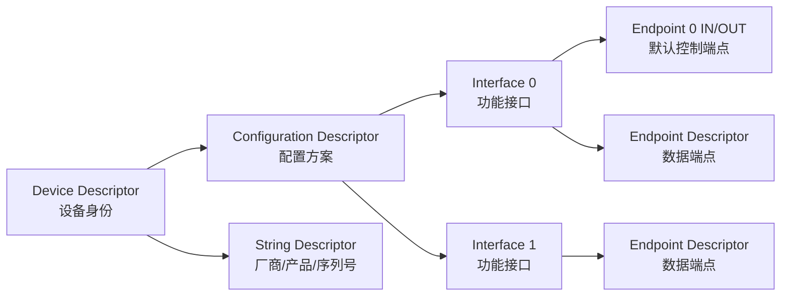
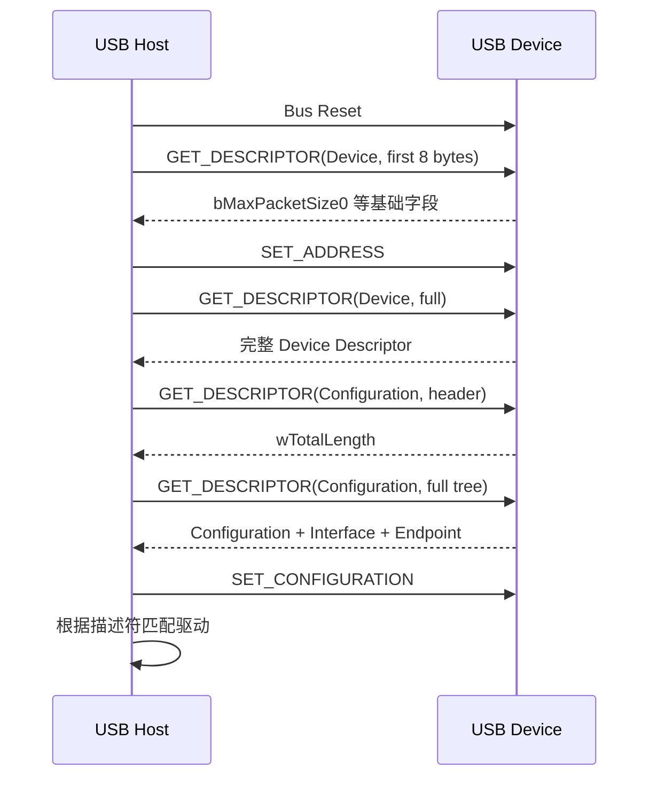
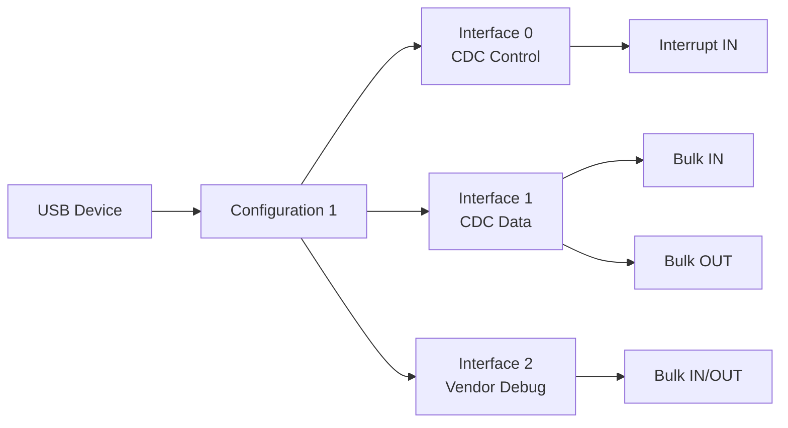

做 USB 驱动时，很多问题表面看是 `probe()` 没进、端点找不到、bulk 传输超时、摄像头没有 `/dev/videoX`，但往根上追，往往都能回到同一个基础问题：**描述符没有看懂**。

USB 设备不是通过设备树描述能力，也不是像片上外设那样固定挂在某个寄存器地址上。USB 的特点是即插即用，Host 端必须在设备插入以后，主动向设备询问：你是谁？你支持什么配置？有几个接口？每个接口有哪些端点？端点方向是什么？传输类型是什么？最大包长是多少？

这些答案全部来自 USB 描述符。

如果把 USB 设备理解成一个“可插拔外设模块”，那么描述符就是它交给 Host 的硬件说明书、驱动匹配表和数据通道地图。驱动开发者只有把这张地图看清楚，后面写 `usb_driver`、找 endpoint、提交 URB、处理热插拔才不会迷路。

## 一、描述符解决的核心问题

USB Host 面对一个刚插入的设备时，不能提前假设设备类型。它看到的只是 D+ / D- 或 SuperSpeed 差分线上的电气连接变化。至于这是鼠标、U 盘、USB 转串口、摄像头、声卡还是厂商自定义设备，都需要通过标准请求读取描述符来确认。

描述符主要解决四类问题。

第一，**身份识别**。

设备需要告诉系统自己的厂商 ID、产品 ID、USB 协议版本、设备类、字符串信息等。Linux 里的 `lsusb`、`dmesg`、驱动 `id_table` 匹配，都依赖这些信息。

第二，**功能组织**。

一个 USB 设备不一定只有一个功能。例如一个开发板通过 USB 接到 PC 后，可能同时暴露虚拟串口、USB 网卡、Mass Storage、ADB 调试接口。每个功能通常对应一个或多个 Interface，Host 必须知道这些 Interface 如何组织。

第三，**数据通道描述**。

真正传输数据的是 Endpoint。描述符会告诉 Host：哪个端点是 IN，哪个端点是 OUT；是 bulk、interrupt 还是 isochronous；最大包长是多少；轮询间隔是多少。

第四，**驱动匹配依据**。

Linux USB 驱动可以按 VID/PID 匹配，也可以按 class/subclass/protocol 匹配。匹配所需的信息，本质上也来自描述符。

可以把 USB 描述符的作用总结成一句话：

> USB 描述符不是附属信息，而是 Host 认识设备、配置设备、绑定驱动、建立传输通道的唯一标准入口。

## 二、USB 描述符的层次结构

常见 USB 描述符不是平铺的一堆字段，而是有清晰层次关系。



这张图里有几个重点。

Device Descriptor 位于最顶层，描述整个设备的基本身份。一个 USB Device 只有一个 Device Descriptor。

Configuration Descriptor 描述设备的一种工作配置。很多简单设备只有一个配置，但 USB 规范允许设备提供多个配置。

Interface Descriptor 描述具体功能。Linux USB 驱动很多时候绑定的是 Interface，而不是整个 USB Device。

Endpoint Descriptor 描述除默认控制端点 0 以外的数据通道。bulk、interrupt、isochronous 等传输类型都在这里体现。

String Descriptor 提供可读字符串，例如厂商名、产品名、序列号。它不是驱动正常工作的必要条件，但对调试非常有用。

## 三、从枚举流程看描述符读取顺序

USB 设备插入后，Host 并不是一次性读取所有描述符，而是按枚举流程逐步读取。



这里有一个细节很重要：Host 会先读取 Device Descriptor 的前 8 字节，因为其中包含 `bMaxPacketSize0`。这个字段决定默认控制端点 0 的最大包长，后续控制传输需要用到它。

完整配置描述符也不是只读一个固定结构体。Host 通常先读 Configuration Descriptor 头部，拿到 `wTotalLength`，然后再按这个总长度读取完整的配置树。这个完整配置树里会连续包含 Interface Descriptor、Endpoint Descriptor 以及各种 class-specific descriptor。

所以使用 `lsusb -v` 时看到的一大段输出，本质上就是 Host 在枚举阶段读取到的结构化结果。

## 四、Device Descriptor：设备身份首页

Device Descriptor 是 USB 设备的身份首页。它说明这个设备遵循哪个 USB 版本、属于什么设备类、厂商和产品 ID 是什么、有多少个配置。

Linux 内核中对应结构体是 `struct usb_device_descriptor`，定义在 `include/uapi/linux/usb/ch9.h`。

典型字段如下：

| 字段 | 含义 | 驱动开发关注点 |
|---|---|---|
| `bLength` | 描述符长度 | Device Descriptor 固定为 18 字节 |
| `bDescriptorType` | 描述符类型 | Device Descriptor 类型值为 1 |
| `bcdUSB` | USB 规范版本 | 判断 USB 2.0 / 3.x 能力时有参考意义 |
| `bDeviceClass` | 设备类 | 可能为 0，表示类信息在接口级描述 |
| `bDeviceSubClass` | 设备子类 | 与 class 一起用于类驱动匹配 |
| `bDeviceProtocol` | 协议号 | 与 class/subclass 组合使用 |
| `bMaxPacketSize0` | 端点 0 最大包长 | 控制传输基础参数 |
| `idVendor` | 厂商 ID | 专用驱动匹配常用字段 |
| `idProduct` | 产品 ID | 专用驱动匹配常用字段 |
| `bcdDevice` | 设备版本 | 区分硬件或固件版本 |
| `iManufacturer` | 厂商字符串索引 | 调试辅助 |
| `iProduct` | 产品字符串索引 | 调试辅助 |
| `iSerialNumber` | 序列号字符串索引 | 区分同型号多个设备 |
| `bNumConfigurations` | 配置数量 | 多配置设备需要关注 |

在 Linux 驱动里可以这样读取 Device Descriptor：

```c
static int demo_probe(struct usb_interface *intf,
                      const struct usb_device_id *id)
{
    struct usb_device *udev = interface_to_usbdev(intf);
    struct usb_device_descriptor *desc = &udev->descriptor;

    dev_info(&intf->dev, "VID:PID = %04x:%04x\n",
             le16_to_cpu(desc->idVendor),
             le16_to_cpu(desc->idProduct));

    dev_info(&intf->dev, "USB version = %x.%02x, configs = %u\n",
             desc->bcdUSB >> 8,
             desc->bcdUSB & 0xff,
             desc->bNumConfigurations);

    return 0;
}
```

注意 `idVendor`、`idProduct`、`bcdUSB` 等多字节字段是 little-endian，内核代码中应使用 `le16_to_cpu()` 转换。很多示例为了简洁直接打印，在跨平台或严谨驱动里不建议省略。

### 1. bDeviceClass 为什么经常是 0

初学者看 `lsusb -v` 时经常会疑惑：为什么有些设备的 `bDeviceClass` 是 `0x00`？这是不是说明设备没有类型？

不是。

`bDeviceClass = 0` 常见含义是：**设备级不声明统一 class，每个 Interface 自己声明 class**。

这在复合设备里非常常见。例如一个 USB 设备同时包含虚拟串口和厂商自定义调试接口，那么整个 Device 很难用一个 class 概括，因此 class 信息下放到 Interface Descriptor。

驱动匹配时也要注意这一点。不能只看 Device Descriptor 的 class 字段，还要看 Interface Descriptor 的 `bInterfaceClass`、`bInterfaceSubClass`、`bInterfaceProtocol`。

### 2. VID/PID 匹配与 class 匹配

专用设备驱动常使用 VID/PID 匹配：

```c
static const struct usb_device_id demo_table[] = {
    { USB_DEVICE(0x1234, 0x5678) },
    { }
};
MODULE_DEVICE_TABLE(usb, demo_table);
```

通用类驱动则可能使用 interface class 匹配，例如 HID、CDC ACM、Mass Storage、UVC 等。这样同一类设备即使来自不同厂商，也能被通用驱动接管。

## 五、Configuration Descriptor：设备工作方案

Configuration Descriptor 描述设备的一种工作配置。大部分常见 USB 设备只有一个配置，但规范允许一个设备提供多个配置，由 Host 选择其中一个。

对应结构体是 `struct usb_config_descriptor`。

| 字段 | 含义 | 驱动开发关注点 |
|---|---|---|
| `bLength` | 描述符长度 | Configuration Descriptor 自身长度 |
| `bDescriptorType` | 描述符类型 | 类型值为 2 |
| `wTotalLength` | 该配置完整描述符总长度 | 包括接口、端点、类特定描述符 |
| `bNumInterfaces` | 接口数量 | 判断该配置下有几个功能接口 |
| `bConfigurationValue` | 配置编号 | `SET_CONFIGURATION` 使用 |
| `iConfiguration` | 配置字符串索引 | 调试辅助 |
| `bmAttributes` | 属性 | 自供电、远程唤醒等 |
| `bMaxPower` | 最大功耗 | 单位通常是 2mA |

`wTotalLength` 是非常关键的字段。Host 读取完整配置树时，就是根据它决定要读多少字节。

在 `lsusb -v` 中经常可以看到类似输出：

```text
Configuration Descriptor:
  wTotalLength       85
  bNumInterfaces      2
  bConfigurationValue 1
  bmAttributes     0x80
  MaxPower          500mA
```

这里说明该配置包含 2 个接口，最大申请电流为 500mA。

### 1. bmAttributes 与供电问题

`bmAttributes` 里会体现设备是否 self-powered、是否支持 remote wakeup。虽然驱动开发时很少直接处理这个字段，但在板级调试时它有参考意义。

例如某些设备枚举不稳定，看起来像协议问题，实际可能是 VBus 供电不足。`bMaxPower` 能帮助判断设备声明的功耗需求。嵌入式板卡 USB Host bring-up 时，VBus regulator、电流限制、USB Hub 供电能力都要一起看。

### 2. 多配置设备怎么处理

多配置设备不算最常见，但不能假设永远只有一个配置。Linux USB core 通常会选择合适配置并设置当前 configuration。普通接口驱动多数情况下只需要处理已经选好的 interface，但在做 Gadget、厂商自定义设备或调试异常枚举时，要知道 configuration 是更高一层的组织单位。

## 六、Interface Descriptor：Linux USB 驱动最常绑定的对象

Interface Descriptor 描述设备里的一个功能接口。Linux USB 驱动的 `probe()` 参数是：

```c
static int demo_probe(struct usb_interface *intf,
                      const struct usb_device_id *id)
```

这里传进来的就是一个 `struct usb_interface`，而不是单纯的 `struct usb_device`。这说明 Linux USB 驱动框架的核心设计是：**驱动通常绑定到接口，而不是整个设备**。

对应描述符结构体是 `struct usb_interface_descriptor`。

| 字段 | 含义 | 驱动开发关注点 |
|---|---|---|
| `bInterfaceNumber` | 接口编号 | 复合设备中定位具体接口 |
| `bAlternateSetting` | alternate setting 编号 | UVC、USB Audio 等高带宽设备常用 |
| `bNumEndpoints` | 端点数量 | 遍历 endpoint 的边界 |
| `bInterfaceClass` | 接口类 | 类驱动匹配关键字段 |
| `bInterfaceSubClass` | 接口子类 | 与 class/protocol 组合判断 |
| `bInterfaceProtocol` | 协议 | 区分同类下具体协议 |
| `iInterface` | 接口字符串索引 | 调试辅助 |

在驱动中读取当前接口描述符：

```c
static int demo_probe(struct usb_interface *intf,
                      const struct usb_device_id *id)
{
    struct usb_host_interface *alt = intf->cur_altsetting;
    struct usb_interface_descriptor *idesc = &alt->desc;

    dev_info(&intf->dev,
             "interface=%u alt=%u class=%02x subclass=%02x protocol=%02x endpoints=%u\n",
             idesc->bInterfaceNumber,
             idesc->bAlternateSetting,
             idesc->bInterfaceClass,
             idesc->bInterfaceSubClass,
             idesc->bInterfaceProtocol,
             idesc->bNumEndpoints);

    return 0;
}
```

### 1. 为什么复合设备容易让人看错

一个复合设备可能长这样：



如果驱动只按 VID/PID 匹配，但没有检查当前传入的是哪个 Interface，就可能把 CDC Control 接口误当成数据接口，然后发现找不到 bulk IN/OUT 端点。

所以 `probe()` 中不能只打印 VID/PID 后就开始收发，必须确认当前 interface 的 class、number、endpoint 结构符合预期。

### 2. Alternate Setting 是高带宽设备的关键

Alternate Setting 可以理解为同一个接口的不同工作档位。它常见于 USB Audio、UVC 摄像头等设备。

例如一个 UVC 摄像头的视频流接口可能有多个 altsetting：

- alt 0：不传输数据，端点数量为 0
- alt 1：低带宽视频流
- alt 2：中等带宽视频流
- alt 3：高带宽视频流

如果驱动或类框架没有选择正确 altsetting，就可能出现接口存在但没有可用数据端点的现象。

切换 altsetting 通常使用：

```c
int usb_set_interface(struct usb_device *dev,
                      int interface_number,
                      int alternate_setting);
```

对普通厂商自定义 bulk 设备，很多时候只有 alt 0。但写驱动时仍然不要忽略这个概念，尤其是分析摄像头、声卡这类设备时。

## 七、Endpoint Descriptor：真正的数据通道地图

Endpoint 是 USB 数据传输的通道。除了默认控制端点 0 以外，普通数据端点都通过 Endpoint Descriptor 描述。

对应结构体是 `struct usb_endpoint_descriptor`。

| 字段 | 含义 | 驱动开发关注点 |
|---|---|---|
| `bEndpointAddress` | 端点地址和方向 | 判断 IN/OUT 与端点号 |
| `bmAttributes` | 端点属性 | 判断 bulk/interrupt/isochronous |
| `wMaxPacketSize` | 最大包长 | 影响一次事务的数据大小 |
| `bInterval` | 轮询间隔 | interrupt/isochronous 重点关注 |

### 1. 端点方向：IN/OUT 是站在 Host 视角

USB 里的 IN/OUT 方向一定要站在 Host 角度理解：

- IN：设备到 Host
- OUT：Host 到设备

这点非常容易弄反。比如 USB 鼠标把按键数据发给电脑，它使用的是 Interrupt IN 端点；USB bulk 设备把采集数据上传给主机，也使用 Bulk IN 端点。

判断方向可以看 `bEndpointAddress` 的最高位：

- bit7 = 1：IN
- bit7 = 0：OUT

端点号是低 4 位。

### 2. 端点类型：决定传输语义

`bmAttributes` 的低两位表示传输类型：

| 类型 | 含义 | 典型设备 |
|---|---|---|
| Control | 控制传输 | 端点 0，标准请求 |
| Isochronous | 等时传输 | 摄像头、音频 |
| Bulk | 批量传输 | U 盘、自定义高速数据设备 |
| Interrupt | 中断传输 | 鼠标、键盘、状态通知 |

驱动中不要手动解析 bit，优先使用内核提供的辅助函数：

```c
if (usb_endpoint_is_bulk_in(ep)) {
    /* device -> host bulk endpoint */
}

if (usb_endpoint_is_bulk_out(ep)) {
    /* host -> device bulk endpoint */
}

if (usb_endpoint_is_int_in(ep)) {
    /* interrupt input endpoint */
}

if (usb_endpoint_xfer_isoc(ep)) {
    /* isochronous endpoint */
}
```

### 3. probe 中遍历端点的标准写法

一个厂商自定义 bulk 设备通常至少需要一个 bulk IN 和一个 bulk OUT。驱动可以在 `probe()` 中这样查找：

```c
struct demo_usb_dev {
    struct usb_device *udev;
    struct usb_interface *intf;
    unsigned char bulk_in_ep;
    unsigned char bulk_out_ep;
    size_t bulk_in_size;
};

static int demo_find_endpoints(struct usb_interface *intf,
                               struct demo_usb_dev *dev)
{
    struct usb_host_interface *alt = intf->cur_altsetting;
    struct usb_endpoint_descriptor *ep;
    int i;

    for (i = 0; i < alt->desc.bNumEndpoints; i++) {
        ep = &alt->endpoint[i].desc;

        if (!dev->bulk_in_ep && usb_endpoint_is_bulk_in(ep)) {
            dev->bulk_in_ep = ep->bEndpointAddress;
            dev->bulk_in_size = usb_endpoint_maxp(ep);
            continue;
        }

        if (!dev->bulk_out_ep && usb_endpoint_is_bulk_out(ep)) {
            dev->bulk_out_ep = ep->bEndpointAddress;
            continue;
        }
    }

    if (!dev->bulk_in_ep || !dev->bulk_out_ep)
        return -ENODEV;

    return 0;
}
```

这段代码体现了几个工程习惯：

- 不假设 endpoint 顺序固定。
- 不通过端点号硬编码判断功能。
- 使用 `usb_endpoint_is_bulk_in()` 等辅助函数。
- 找不到必要端点时返回错误，避免后续空指针或错误 pipe。

## 八、String Descriptor：调试时很有用的可读信息

String Descriptor 用于保存厂商名、产品名、序列号等字符串。Device Descriptor 和 Interface Descriptor 中的 `iManufacturer`、`iProduct`、`iSerialNumber`、`iInterface` 都不是字符串本身，而是字符串索引。

在 Linux 里，很多字符串已经被 USB core 读取并放进 `struct usb_device`：

```c
struct usb_device *udev = interface_to_usbdev(intf);

dev_info(&intf->dev, "manufacturer: %s\n",
         udev->manufacturer ? udev->manufacturer : "unknown");
dev_info(&intf->dev, "product: %s\n",
         udev->product ? udev->product : "unknown");
dev_info(&intf->dev, "serial: %s\n",
         udev->serial ? udev->serial : "unknown");
```

序列号在工程现场尤其重要。假设一台设备上接了 4 个同型号 USB 模块，它们 VID/PID 完全一样，只有序列号不同。如果用户态需要稳定区分每一个模块，就不能只依赖 `/dev` 枚举顺序，而要结合序列号或物理端口路径做规则绑定。

可以通过 udev 规则按序列号生成稳定设备名，这是 Linux 产品化中很常见的做法。

## 九、Class-Specific Descriptor：类驱动背后的关键扩展

除了标准描述符，很多 USB 类协议还定义了自己的 class-specific descriptor。它们仍然混在 Configuration Descriptor 的完整树里，只是 `bDescriptorType` 和字段格式由具体类规范定义。

常见例子包括：

- HID Descriptor
- UVC VideoControl Descriptor
- UVC VideoStreaming Descriptor
- USB Audio Descriptor
- CDC Functional Descriptor

以 UVC 摄像头为例，普通 Endpoint Descriptor 只能说明某个端点用于视频流传输，但摄像头支持哪些分辨率、帧率、格式、控制单元、处理单元，这些需要 UVC class-specific descriptor 描述。

所以分析 USB 摄像头时，不能只看 endpoint，还要看 VideoControl 和 VideoStreaming 相关描述符。`uvcvideo` 驱动正是根据这些描述符构建 V4L2 设备能力。

### IAD 说明多个 Interface 属于同一个功能

Interface Association Descriptor（IAD）用 first interface 和 count 把连续 interface 组合为一个 function。CDC ACM 常由 Communication interface 与 Data interface 组成，UVC 也把 VideoControl 与 VideoStreaming 组织在同一功能中。IAD 应出现在关联的第一个 Interface Descriptor 之前，范围必须连续且真实存在。

IAD 不会让 Linux 只创建一个 interface；usbcore 仍创建多个 `usb_interface`，类驱动再根据 IAD、CDC Union 等关系找到伙伴。IAD 缺失或编号错误时，单个 interface 可能出现，却无法形成完整 class 功能。

### BOS 承载固定 Device Descriptor 放不下的能力

BOS（Binary Object Store）由 BOS header 与多个 Device Capability 组成，可描述 USB 2.0 Extension、SuperSpeed、Container ID 和 Platform Capability。WebUSB、Microsoft OS 2.0 等常借助 Platform Capability 给出 UUID、vendor code 或 descriptor set 信息。

Host 是否读取 BOS 与设备 USB 版本、平台能力有关。排查 SuperSpeed 或平台 descriptor 时，不能只检查 Configuration tree；还要核对 BOS 的总长度、每个 capability 的 `bLength` 和后续 vendor request 是否一致。

## 十、使用 lsusb -v 读懂真实设备

学习描述符最有效的方法不是背字段，而是拿真实设备分析。

常用命令：

```bash
lsusb
lsusb -v -d 1234:5678
usb-devices
dmesg -w
```

如果没有权限读取完整描述符，可以加 `sudo`：

```bash
sudo lsusb -v -d 1234:5678
```

一个典型分析顺序是：

```text
1. 先看 idVendor / idProduct，确认设备身份
2. 看 bDeviceClass，判断类信息在设备级还是接口级
3. 看 bNumConfigurations，确认配置数量
4. 进入 Configuration Descriptor，看 bNumInterfaces
5. 逐个 Interface 看 class/subclass/protocol
6. 在目标 Interface 下找 Endpoint
7. 确认 endpoint 方向、类型、wMaxPacketSize、bInterval
8. 对 UVC/HID/Audio/CDC 等设备继续看 class-specific descriptor
```

可以把 `lsusb -v` 输出保存下来，便于分析：

```bash
sudo lsusb -v -d 1234:5678 > usb-desc.txt
```

如果正在写驱动，建议把驱动里打印出的 interface 和 endpoint 信息与 `lsusb -v` 对照。两边一致，说明你找对了接口和端点；如果不一致，优先怀疑当前驱动绑定的 interface 不是你以为的那个。

## 十一、驱动中打印描述符的完整示例

下面给一个更完整的 `probe()` 调试模板，适合在写 USB 驱动早期使用。

```c
static int demo_probe(struct usb_interface *intf,
                      const struct usb_device_id *id)
{
    struct usb_device *udev = interface_to_usbdev(intf);
    struct usb_host_interface *alt = intf->cur_altsetting;
    struct usb_device_descriptor *ddesc = &udev->descriptor;
    struct usb_interface_descriptor *idesc = &alt->desc;
    struct usb_endpoint_descriptor *ep;
    int i;

    dev_info(&intf->dev, "USB device matched\n");
    dev_info(&intf->dev, "VID:PID = %04x:%04x\n",
             le16_to_cpu(ddesc->idVendor),
             le16_to_cpu(ddesc->idProduct));

    dev_info(&intf->dev, "manufacturer=%s product=%s serial=%s\n",
             udev->manufacturer ? udev->manufacturer : "unknown",
             udev->product ? udev->product : "unknown",
             udev->serial ? udev->serial : "unknown");

    dev_info(&intf->dev,
             "interface=%u alt=%u class=%02x subclass=%02x protocol=%02x endpoints=%u\n",
             idesc->bInterfaceNumber,
             idesc->bAlternateSetting,
             idesc->bInterfaceClass,
             idesc->bInterfaceSubClass,
             idesc->bInterfaceProtocol,
             idesc->bNumEndpoints);

    for (i = 0; i < idesc->bNumEndpoints; i++) {
        ep = &alt->endpoint[i].desc;

        dev_info(&intf->dev,
                 "ep[%d] addr=0x%02x attr=0x%02x maxp=%u interval=%u\n",
                 i,
                 ep->bEndpointAddress,
                 ep->bmAttributes,
                 usb_endpoint_maxp(ep),
                 ep->bInterval);

        if (usb_endpoint_is_bulk_in(ep))
            dev_info(&intf->dev, "  -> bulk IN\n");
        else if (usb_endpoint_is_bulk_out(ep))
            dev_info(&intf->dev, "  -> bulk OUT\n");
        else if (usb_endpoint_is_int_in(ep))
            dev_info(&intf->dev, "  -> interrupt IN\n");
        else if (usb_endpoint_xfer_isoc(ep))
            dev_info(&intf->dev, "  -> isochronous\n");
    }

    return 0;
}
```

这个模板不直接做业务逻辑，只做描述符观察。实际项目里，早期先把这些信息打印清楚，比一上来写复杂读写逻辑更稳。

## 十二、描述符与驱动匹配的关系

Linux USB 驱动匹配依赖 `struct usb_device_id` 表。它可以表达多种匹配方式。

### 1. 匹配指定设备

```c
static const struct usb_device_id demo_table[] = {
    { USB_DEVICE(0x1234, 0x5678) },
    { }
};
MODULE_DEVICE_TABLE(usb, demo_table);
```

这种方式适合厂商自定义设备。只要 VID/PID 匹配，USB core 就可能调用驱动的 `probe()`。

### 2. 匹配接口类

```c
static const struct usb_device_id demo_table[] = {
    { USB_INTERFACE_INFO(USB_CLASS_VENDOR_SPEC, 0xff, 0xff) },
    { }
};
MODULE_DEVICE_TABLE(usb, demo_table);
```

这种方式更关注 interface class/subclass/protocol。很多标准类驱动就是按接口类匹配的。

### 3. 匹配后仍要二次校验

即使 `id_table` 匹配成功，`probe()` 里也应该再次检查 endpoint 是否符合预期。原因很简单：匹配成功只说明“这个接口大概率属于我”，不代表硬件固件版本、altsetting、endpoint 数量完全满足当前驱动假设。

可靠驱动应该在 `probe()` 中做完整校验：

```text
VID/PID 或 class 匹配
    ↓
确认 interface number / class / subclass / protocol
    ↓
确认 endpoint 数量和类型
    ↓
确认 max packet size、方向、interval
    ↓
分配资源并进入工作状态
```

## 十三、常见问题排查

### 1. probe 没有进入

优先检查：

```bash
lsusb
lsusb -v -d VID:PID
dmesg | grep -i usb
modinfo your_driver.ko
```

重点看：

- VID/PID 是否写错。
- 驱动是否正确加载。
- `MODULE_DEVICE_TABLE(usb, xxx_table)` 是否存在。
- 设备是否已被其他驱动绑定。
- 匹配方式是 device 级还是 interface 级。

查看当前绑定驱动：

```bash
ls -l /sys/bus/usb/devices/*/driver
```

如果设备已经被通用类驱动绑定，专用驱动可能不会接管。可以临时解绑再绑定：

```bash
echo '1-1:1.0' | sudo tee /sys/bus/usb/drivers/usbhid/unbind
echo '1-1:1.0' | sudo tee /sys/bus/usb/drivers/your_driver/bind
```

实际路径要以 `/sys/bus/usb/devices/` 下看到的接口名为准。

### 2. probe 进了但找不到端点

常见原因：

- 驱动绑定到了错误 interface。
- 当前 altsetting 没有数据端点。
- 端点类型不是你以为的 bulk，而是 interrupt 或 isochronous。
- 端点方向看反了。
- 固件版本变更导致端点布局变化。

排查方法：

```bash
sudo lsusb -v -d VID:PID
```

同时在驱动里打印 `bInterfaceNumber`、`bAlternateSetting`、`bNumEndpoints` 和每个 endpoint 的 `bEndpointAddress`、`bmAttributes`。

### 3. bulk 传输超时

描述符层面重点看：

- 是否选择了正确 bulk IN/OUT endpoint。
- endpoint 地址是否传给了正确 pipe。
- IN/OUT 方向是否反了。
- 最大包长是否符合设备固件设计。

Linux 中构造 pipe 常用：

```c
usb_rcvbulkpipe(udev, endpoint_address);
usb_sndbulkpipe(udev, endpoint_address);
```

不要把 OUT endpoint 用到 `usb_rcvbulkpipe()`，也不要把 IN endpoint 用到 `usb_sndbulkpipe()`。

### 4. UVC 摄像头能识别但不能出图

描述符层面需要看：

- VideoControl Interface 是否正常。
- VideoStreaming Interface 是否存在。
- 是否有合适的 format/frame descriptor。
- 选择的分辨率和帧率是否超过 USB 带宽。
- isochronous endpoint 的 altsetting 是否正确。

常用命令：

```bash
v4l2-ctl --list-devices
v4l2-ctl -d /dev/video0 --list-formats-ext
v4l2-ctl -d /dev/video0 --stream-mmap --stream-count=100
```

如果是 USB 2.0 摄像头，高分辨率未压缩 YUYV 很容易超过带宽，此时需要选择 MJPEG 或降低分辨率/帧率。

## 十四、工程验证清单

写 USB 驱动或调试 USB 设备时，可以按下面清单确认描述符相关问题。

| 检查项 | 命令/方法 | 预期结果 |
|---|---|---|
| 设备是否枚举 | `lsusb` | 能看到 VID/PID |
| 设备描述符是否完整 | `sudo lsusb -v -d VID:PID` | Device Descriptor 可读 |
| 配置数量是否正常 | `bNumConfigurations` | 至少一个配置 |
| 接口数量是否符合预期 | `bNumInterfaces` | 与设备功能一致 |
| 驱动绑定对象是否正确 | `/sys/bus/usb/devices/*/driver` | 绑定到目标 interface |
| endpoint 类型是否正确 | `lsusb -v` + 驱动打印 | bulk/int/isoc 与设计一致 |
| endpoint 方向是否正确 | `bEndpointAddress` bit7 | IN/OUT 不反 |
| altsetting 是否正确 | `bAlternateSetting` | 高带宽设备选择合适档位 |
| 字符串是否可读 | `udev->product` 等 | 便于区分设备 |
| 热插拔是否稳定 | 反复插拔测试 | 无崩溃、无泄漏、无野指针 |

## 十五、小结

读完并完成实验后，你应该能做到：

- 解释 Device / Configuration / Interface / Endpoint / String Descriptor 的层次关系。
- 看懂 `lsusb -v` 中最关键的描述符字段。
- 明确 Linux USB 驱动为什么经常绑定到 Interface。
- 在 `probe()` 中打印当前 interface 和 endpoint 信息。
- 判断 bulk IN、bulk OUT、interrupt IN、isochronous endpoint。
- 排查 `probe()` 不进、端点找不到、方向看反、altsetting 选择错误等问题。

USB 描述符是后续 URB、数据传输、Gadget、UVC 摄像头和 USB Host bring-up 的共同基础。把这部分打牢，后面看到任何 USB 设备时，就不会只停留在“插上能不能识别”，而是能进一步判断它为什么这样枚举、驱动为什么这样匹配、数据应该从哪个端点走。

> 🏷️ USB驱动 / USB描述符 / Linux内核 / Endpoint / Interface / 枚举流程 / 嵌入式Linux
