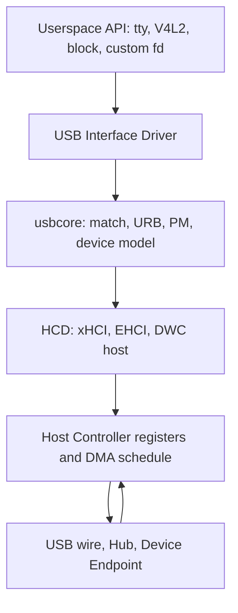
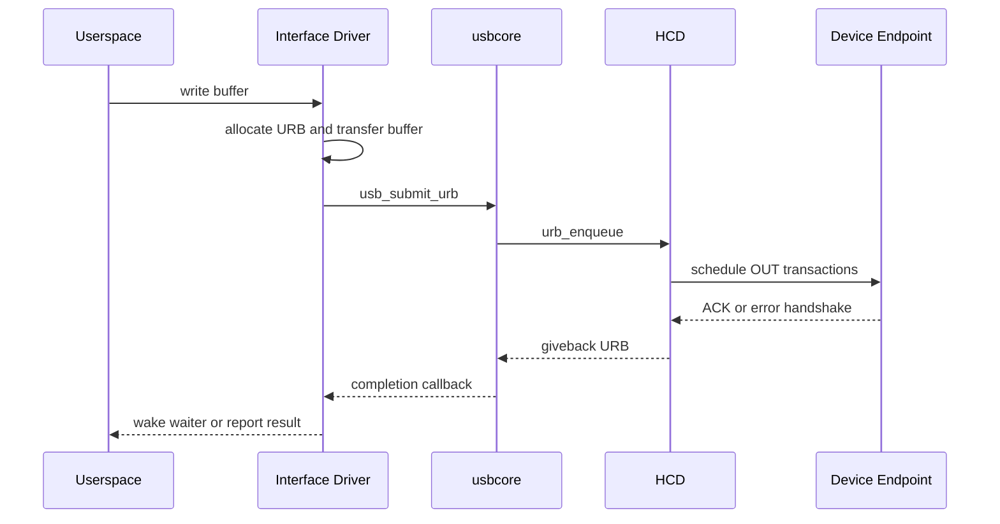
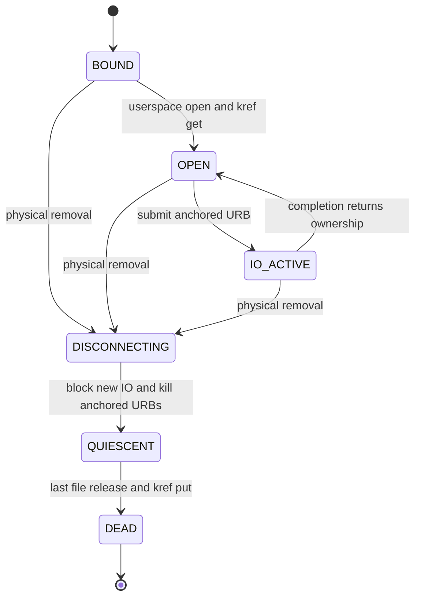
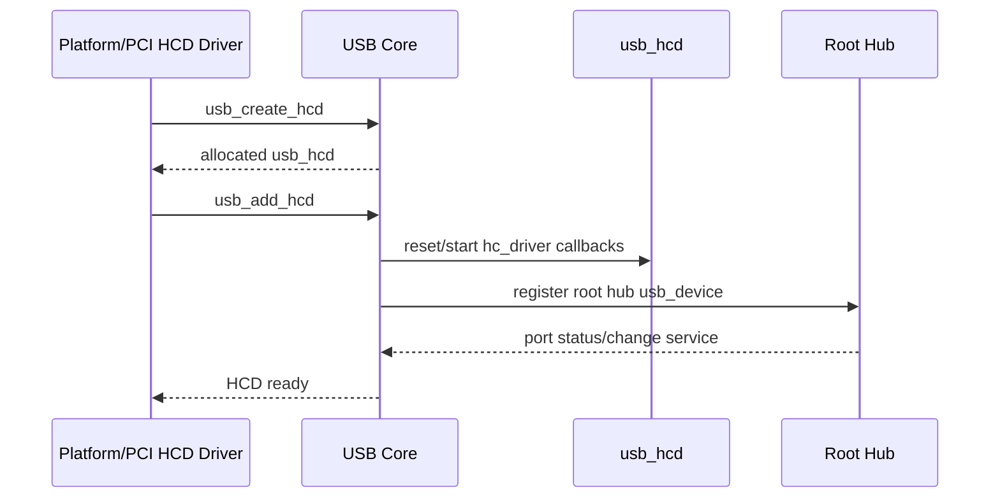
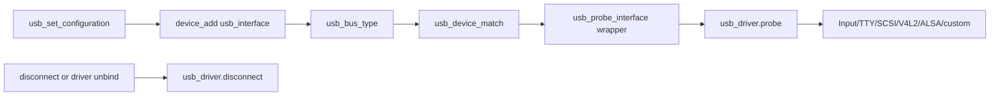

上一讲已经说明：Host 通过 EP0 识别 Device，读取配置树并创建 Interface。Linux USB 驱动框架要解决的下一个问题是，如何把这棵协议对象树交给不同驱动管理，同时允许控制器、设备、用户进程和热插拔并发发生。

本文所有对象与内部调用路径以 Linux 6.12 为基线。

理解框架不能只背 `probe()` 和 `disconnect()`。需要先分清硬件控制器、HCD、usbcore、USB Device、Interface Driver 各自拥有的对象和责任，再沿一次绑定、数据提交、拔出与释放过程观察所有权如何变化。

## 一、从 Host Controller 到 Interface Driver 的软件栈

最底层是 Host Controller IP，例如 xHCI、EHCI 或某个 SoC 内置控制器。它负责在总线上发送 token/packet、维护 schedule、执行 DMA，并把端口变化和传输完成报告给 CPU。

Host Controller Driver，简称 HCD，把具体寄存器和 DMA 描述符适配成 Linux USB Core 能理解的接口。内核中的 `struct usb_hcd` 表示一个已注册的 Host Controller 实例，它关联 root hub、IRQ、寄存器资源和一组 `hc_driver` 操作。usbcore 提交 URB 时，最终会进入 HCD 的 `urb_enqueue`；取消时则进入 `urb_dequeue`。

usbcore 位于中间层，负责通用协议工作：Hub 管理、地址与配置、描述符解析、设备模型注册、Interface 匹配、URB 公共生命周期、runtime PM 和 sysfs。它屏蔽控制器差异，使 Interface Driver 不必知道 xHCI TRB 或 EHCI qTD 的格式。

最上层是 USB Interface Driver。HID、UVC、CDC ACM、Mass Storage 以及自定义 vendor driver 都属于这一层。它们面向具体功能解释描述符，选择 Endpoint，构造 URB，并向 input、V4L2、TTY、block 或自定义字符设备发布用户接口。



这张图同时给出错误边界：没有 root hub 时先查 HCD；Device 已完成枚举但没有功能驱动时查 Interface match；`probe()` 成功但数据不动时才沿 URB、HCD 和 Endpoint 向下追。

## 二、Linux 为什么把驱动绑定到 usb_interface

`struct usb_device` 表示一台物理 USB Device，保存地址、速度、EP0、配置、父 Hub 和设备级状态。`struct usb_interface` 表示当前 Configuration 中的一个 Interface，并包含多个 Alternate Setting。Interface Driver 的 `probe()` 接收 `usb_interface *`，这是复合设备能够被多个驱动分别接管的基础。

例如 CDC ACM 常由一个 Communication Interface 和一个 Data Interface 共同组成；摄像头可能包含 VideoControl 与 VideoStreaming Interface；USB 声卡可能包含 AudioControl 和若干 AudioStreaming Interface。若驱动确实需要伙伴 Interface，可以通过描述符关系找到它，再调用 `usb_driver_claim_interface()` 显式声明所有权。未经声明就访问伙伴 Interface，会与其他驱动绑定产生竞争。

驱动由 `struct usb_driver` 描述：

```c
static struct usb_driver demo_driver = {
    .name = "demo_usb",
    .probe = demo_probe,
    .disconnect = demo_disconnect,
    .suspend = demo_suspend,
    .resume = demo_resume,
    .id_table = demo_id_table,
    .supports_autosuspend = 1,
};
```

`id_table` 可以按 VID/PID、device class 或 interface class/subclass/protocol 匹配。匹配 Interface 时，class 字段通常来自 Interface Descriptor，而不是 Device Descriptor。复合设备经常在 Device Descriptor 中把 `bDeviceClass` 设为 0，把真实 class 放在各 Interface 中。

```c
static const struct usb_device_id demo_id_table[] = {
    { USB_DEVICE(0x1234, 0x5678) },
    { USB_INTERFACE_INFO(USB_CLASS_VENDOR_SPEC, 0x01, 0x01) },
    { }
};
MODULE_DEVICE_TABLE(usb, demo_id_table);
```

`module_usb_driver(demo_driver)` 是常用注册宏，模块加载时最终调用 `usb_register_driver()`，卸载时注销。注册只把驱动加入匹配体系，不会主动初始化某个未匹配设备；已经存在的 Interface 和后续新建的 Interface 都会经过 driver core 匹配。

## 三、probe 必须按依赖顺序建立可调度对象

进入 `probe()` 时可以依赖以下事实：Device 已获得地址并设置 Configuration；目标 Interface 已创建；`intf->cur_altsetting` 指向当前 Alternate Setting；usbcore 正在尝试把该 Interface 交给当前驱动。不能依赖的事实是“所有 Endpoint 都符合预期”或“设备固件一定可用”，这些仍需驱动验证。

典型 probe 顺序是：

1. 取得并持有 `usb_device`。
2. 校验 Interface/Class-specific descriptor。
3. 找到需要的 Endpoint，并记录地址、最大包长和 interval。
4. 分配私有状态、锁、队列、URB 和 buffer。
5. 查询/初始化设备协议状态。
6. 用 `usb_set_intfdata()` 关联私有状态。
7. 最后发布字符设备、netdev、video node 等用户入口。

```c
static int demo_probe(struct usb_interface *intf,
                      const struct usb_device_id *id)
{
    struct usb_device *udev = interface_to_usbdev(intf);
    struct usb_endpoint_descriptor *bulk_in;
    struct usb_endpoint_descriptor *bulk_out;
    struct demo_dev *dev;
    int ret;

    ret = usb_find_common_endpoints(intf->cur_altsetting,
                                    &bulk_in, &bulk_out, NULL, NULL);
    if (ret)
        return dev_err_probe(&intf->dev, ret,
                             "bulk endpoints are missing\n");

    dev = kzalloc(sizeof(*dev), GFP_KERNEL);
    if (!dev)
        return -ENOMEM;

    dev->udev = usb_get_dev(udev);
    dev->intf = usb_get_intf(intf);
    dev->bulk_in = bulk_in->bEndpointAddress;
    dev->bulk_out = bulk_out->bEndpointAddress;
    kref_init(&dev->kref);
    init_usb_anchor(&dev->submitted);
    mutex_init(&dev->io_mutex);

    ret = demo_protocol_init(dev);
    if (ret)
        goto err_put;

    usb_set_intfdata(intf, dev);
    ret = demo_publish_userspace(dev);
    if (ret)
        goto err_clear;

    return 0;

err_clear:
    usb_set_intfdata(intf, NULL);
err_put:
    usb_put_intf(dev->intf);
    usb_put_dev(dev->udev);
    kfree(dev);
    return ret;
}
```

示例的重点是顺序，不是某个虚构协议。用户接口最后发布，保证一旦用户能够 `open()`，底层对象已经完整；错误路径按资源获取的逆序回滚；`usb_set_intfdata()` 只是保存指针，不增加引用，也不自动管理私有对象寿命。

## 四、Endpoint、URB 与 HCD 构成真实数据路径

Interface 匹配完成并不产生业务数据。驱动还需要解析 Endpoint Descriptor，把 Endpoint 地址交给 pipe helper，再构造 URB。以下路径以 Bulk OUT 为例：



`usb_submit_urb()` 成功只表示 usbcore/HCD 接受了异步请求，不表示数据已经到达设备。提交后 transfer buffer、URB 和私有状态必须保持有效，直到 completion 或同步取消完成。completion 可能运行在不能睡眠的上下文，因此通常只更新状态、移动队列和唤醒 wait queue，把复杂处理交给工作线程或进程上下文。

Endpoint 类型决定 HCD 如何调度，但 Interface Driver 仍使用统一 URB。HCD 把 URB 翻译成控制器专用描述符；控制器 DMA 完成后，HCD 调用 usbcore giveback，再由 usbcore 调用驱动 completion。第五篇会把这条路径扩展为可用的字符设备驱动。

## 五、disconnect 是“硬件消失”，不是普通 close

拔出发生时，用户进程可能仍持有文件描述符，URB 可能正在 HCD 队列中，completion 可能即将运行，另一个线程也可能正在提交请求。`disconnect()` 的目标不是立即 `kfree()`，而是阻止新 I/O、停止硬件访问，并让所有异步引用最终收敛。

推荐顺序是：

1. 从 `usb_get_intfdata()` 取得私有对象并立刻清空关联。
2. 在锁保护下设置 `disconnected`，使新 read/write/ioctl 返回 `-ENODEV`。
3. 撤销用户可见入口，阻止新的 open。
4. 调用 `usb_kill_anchored_urbs()` 等待所有 anchored URB completion 结束。
5. 释放只由 Interface 生命周期拥有的资源。
6. 用 `kref` 延迟释放仍被 open file 持有的私有对象。



`usb_kill_urb()` 与 `usb_unlink_urb()` 语义不同：kill 是同步等待，适合 teardown；unlink 请求异步取消，completion 仍会执行。Anchor 让驱动能够批量跟踪动态提交的 URB，避免只保存“最后一个 URB”而遗漏并发请求。

`usb_put_dev()` 或 `usb_put_intf()` 只释放软件对象引用，不会使已拔出的硬件重新可用。引用计数保护的是内存，不是设备连通性；所有 I/O 入口仍必须检查 disconnected 状态。

## 六、runtime PM、调试与阅读源码的方法

runtime PM 让设备在仍连接时进入低功耗状态。驱动在需要访问硬件前通过 `usb_autopm_get_interface()` 获取活动引用，完成后用 `usb_autopm_put_interface()` 释放。若忘记 get，设备可能在传输前被 suspend；若忘记 put，则 autosuspend 永远不会发生。

`.supports_autosuspend = 1` 表示驱动声明能够参与自动挂起，不等于框架会自动停止私有 URB。`suspend()` 中需要停止或冻结数据流，`resume()` 恢复设备协议状态并重新提交接收 URB。reset_resume 还要考虑设备是否丢失配置。

调试绑定问题时按对象层次观察：

```bash
lsusb -t
readlink /sys/bus/usb/devices/1-1:1.0/driver
cat /sys/bus/usb/devices/1-1:1.0/modalias
cat /sys/kernel/debug/usb/devices
```

有 Interface 和 modalias 但没有 driver，检查 ID 表、模块加载和竞争驱动；`probe()` 失败则检查返回码和逆序回滚；数据超时则进入 URB/HCD/Endpoint 路径；拔出崩溃重点检查 completion、work、timer 和 open file 是否仍引用已释放对象。

阅读源码可以沿稳定边界进入：

- `drivers/usb/core/driver.c`：USB driver/interface 匹配、claim 和 PM 协调。
- `drivers/usb/core/urb.c`：URB 分配、提交、unlink、kill 和 anchor。
- `drivers/usb/core/hub.c`：Hub 端口变化和新设备发现。
- `drivers/usb/host/`：不同 HCD 如何实现 enqueue/dequeue 和 root hub。

**参考资料**

- [The Linux-USB Host Side API](https://docs.kernel.org/driver-api/usb/usb.html)
- [Linux USB Power Management](https://docs.kernel.org/driver-api/usb/power-management.html)
- [Writing USB Device Drivers](https://docs.kernel.org/driver-api/usb/writing_usb_driver.html)

## 七、HCD 注册如何产生 Root Hub

Host Controller 平台或 PCI 驱动先取得寄存器、IRQ、DMA、clock、reset 与 PHY 等资源。

随后通过 `usb_create_hcd()` 创建 `struct usb_hcd`，填入控制器专用 `hc_driver` 操作，再调用 `usb_add_hcd()`。

`usb_add_hcd()` 不只是注册一个中断。

它把 HCD 加入 USB Core、初始化总线号与带宽信息、建立 Root Hub，并启动控制器。



Root Hub 没有通过外部 USB 线连接。

HCD 用 hub status/control 回调模拟其 Class Request 与端口变化。

usbcore 因而可以用近似统一的 Hub 状态机处理 Root Port 和外部 Hub。

控制器驱动卸载时使用 `usb_remove_hcd()` 停止 Root Hub 与所有下游设备，再释放 `usb_hcd`。

顺序错误会让下游 URB 在寄存器或 IRQ 已释放后仍到达 HCD。

## 八、usb_bus_type 把 Interface 接入驱动模型

枚举和 Configuration 激活后，每个 `usb_interface` 作为 `struct device` 发布到 `usb_bus_type`。

`usb_device_match()` 根据 `usb_device_id`、动态 ID、授权与 Interface 条件判断匹配。

匹配成功后，USB Core 的 probe 包装负责 PM 与序列化，再调用具体 `usb_driver.probe()`。



Class Driver 与 Vendor Driver 都通过这一框架绑定。

区别在于 ID 表和上层协议，不在于是否绕过 usbcore。

同一 `usb_device` 下的多个 Interface 可以同时绑定不同驱动，HCD 对它们的 URB 统一调度。

## 九、每层负责什么、不能负责什么

| 层 | 拥有的事实 | 不应越界承担 |
| --- | --- | --- |
| HCD | 控制器队列、IRQ、DMA、Root Hub 端口 | HID/UVC 等业务解析 |
| usbcore | 枚举、对象、匹配、URB 公共生命周期 | Vendor 消息语义 |
| Interface Driver | 当前功能的端点、协议与用户接口 | 整条总线地址分配 |
| Class Subsystem | Input/TTY/SCSI/V4L2/ALSA 抽象 | 控制器寄存器与 PHY |
| 用户空间 | 策略、格式选择、业务数据 | 修复内核取消竞态 |

分层不是为了画图。

它直接决定故障应在哪一层修复。

如果 Root Hub 没注册，修改 UVC Driver 没有意义。

如果 usbmon 能看到正确 Report 而 Input Event 错误，PHY 与 HCD 已经不是首要怀疑对象。

## 十、小结

Linux USB Host 软件栈由 Host Controller、HCD、usbcore 和 Interface Driver 分层组成。驱动绑定的是功能 Interface，数据通过 URB 异步进入 HCD，热插拔则要求驱动把“软件对象仍被引用”和“硬件仍可访问”严格分开。

一个可靠驱动必须在 probe 中按依赖顺序建立资源，在用户入口发布前完成初始化，在 disconnect 中先阻止新 I/O、同步取消异步工作，再由引用计数完成最终释放。下一篇将深入描述符字节流，解释 Interface 与 Endpoint 信息究竟从哪里来。
