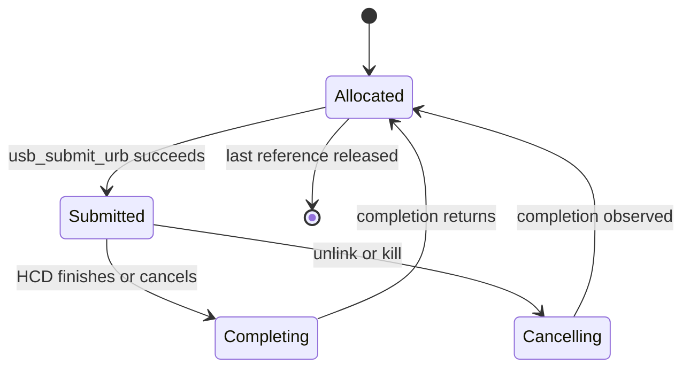

枚举和驱动匹配解决“设备是谁”，URB 解决“Host 如何请求一次传输”。URB（USB Request Block）不是数据包本身，而是一份异步请求：目标设备和 endpoint、传输类型、缓冲区、长度、完成回调及状态都记录在其中，HCD 再把它拆成控制器可执行的事务。

本篇沿 URB 从构造、提交、完成到取消的生命周期，解释短包、zero packet、control setup、isochronous frame 和设备拔出并发。

## Pipe 把设备、方向、端点和类型编码成目标

Linux 使用 `usb_sndbulkpipe()`、`usb_rcvintpipe()` 等 helper 构造 pipe。Pipe 编码设备地址、endpoint 号、方向和传输类型，驱动不应手工拼位。

Endpoint Descriptor 是静态能力，pipe 是针对某个 `usb_device` 的传输目标。相同 endpoint 地址在不同设备上没有冲突，因为设备地址也参与 Host 控制器调度。

Control transfer 总是使用 EP0 pipe；bulk/interrupt/isochronous 必须与 endpoint 描述符类型一致。错误类型可能被 HCD 拒绝，也可能在总线上产生 STALL 或 transaction error。

## URB 生命周期从“驱动拥有”切换到“USB core 拥有”

常见 bulk 请求如下：

```c
struct urb *urb = usb_alloc_urb(0, GFP_KERNEL);
usb_fill_bulk_urb(urb, udev,
                  usb_sndbulkpipe(udev, ep),
                  buf, len, demo_complete, dev);
usb_anchor_urb(urb, &dev->submitted);
ret = usb_submit_urb(urb, GFP_KERNEL);
if (ret) {
    usb_unanchor_urb(urb);
    usb_free_urb(urb);
}
```

提交成功后，驱动不能再随意修改 URB 和 transfer buffer，直到 completion 或同步取消确认请求不在 HCD 中。`usb_free_urb()` 只是减少引用，不能替代取消。Anchor 让驱动按集合管理在途请求，disconnect 时可以统一 kill。

Completion 收到 `urb->status` 和 `urb->actual_length`。它可能运行在原提交线程之外、且通常不能睡眠。回调应先判断 disconnect/cancel 状态，再处理有效数据，必要时重新提交持续接收 URB。



## Bulk 的短包和 zero packet 都有协议含义

Bulk IN 请求长度 4096，不代表设备必须返回 4096。设备返回小于 max packet 的包，Host 将其视为传输结束，`actual_length` 可以小于请求值且 status 为 0。设置 `URB_SHORT_NOT_OK` 后，短包会被报告为错误；只有上层协议明确要求固定长度时才应使用。

Bulk OUT 当总长度恰好是 max packet 的整数倍时，接收方可能不知道消息是否结束。若协议用短包表示边界，可设置 `URB_ZERO_PACKET`，让 HCD 在数据后追加 zero-length packet。是否需要 ZLP 由设备协议决定，不是所有 bulk OUT 都应打开。

STALL 表示 endpoint halt，驱动通常需要 `usb_clear_halt()` 并恢复协议状态。transaction error、timeout 和 overflow 则需要结合总线抓包与设备状态判断，不能统一重试。

## Control URB 的 setup packet 必须活到 completion

Control URB 除数据缓冲外还需要 8 字节 `struct usb_ctrlrequest`。Setup、Data、Status 三阶段由 HCD 执行，但 setup packet 与 data buffer 都必须在请求完成前有效，不能放在提交函数的栈上后立即返回。

同步 helper `usb_control_msg()` 适合 probe 或配置路径，但不能在 atomic context 使用。持续或并行控制操作更适合显式 URB，并由驱动串行化会改变设备状态的请求。

`wValue/wIndex/wLength` 使用 little-endian，方向必须与 pipe 和 `bmRequestType` 一致。错误方向常表现为 timeout 或 STALL，而不是编译错误。

## Interrupt 与 isochronous 不是“换一个 pipe”这么简单

Interrupt endpoint 按 `bInterval` 周期调度，适合小数据、可预测轮询延迟。驱动通常在 completion 中处理输入并重新提交 URB，形成持续轮询。

Isochronous URB 包含多个 `iso_frame_desc`，每帧有 offset、length、actual_length 和 status。整条 URB status 为 0 不代表每个 packet 都成功，音视频驱动必须逐帧检查。Isochronous 不重传，带宽预留和 altsetting 选择比单次错误恢复更重要。

## unlink、kill 与 poison 的等待语义不同

`usb_unlink_urb()` 异步请求取消，返回后 completion 可能尚未执行；`usb_kill_urb()` 会等待 URB 完全退出 HCD 和 completion，适合 disconnect 或关闭路径，但不能从会与 completion 死锁的上下文调用。`usb_poison_urb()` 还阻止后续重新提交，适合永久停用。

驱动若维护多条请求，`usb_kill_anchored_urbs()` 比逐个遍历自建链表更安全。正确 disconnect 顺序是先设置停止标志、阻止 completion 重提，再 kill anchor，最后释放 buffer 和对象。

典型状态码包括 `-ENOENT/-ECONNRESET`（主动取消）、`-ESHUTDOWN`（设备或控制器关闭）、`-EPIPE`（STALL）、`-EPROTO/-EILSEQ`（协议/CRC）和 `-EOVERFLOW`。回调要区分预期取消与真实总线故障，避免拔出时打印大量误导错误。

## 小结

URB 是 USB Host 异步传输的所有权边界。Pipe 指定目标，描述符决定合法能力，提交成功后 core/HCD 暂时拥有请求，completion 或 kill 才把修改和释放权交还驱动。短包、ZLP、setup 生命周期、iso packet 状态和取消同步都直接影响正确性。下一篇会把这些机制放进一个完整 interface driver，连接 file operation、URB、拔出和资源回滚。
