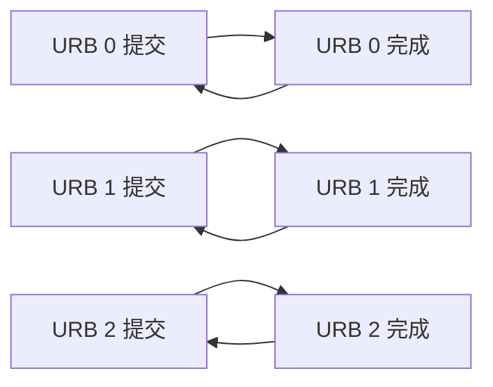
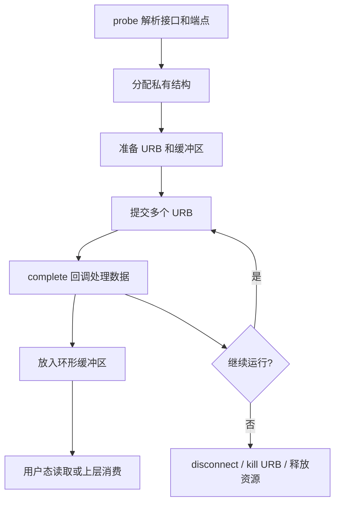

上一讲我们把 USB 描述符讲清楚了。这一讲继续往下，进入 USB 驱动开发里最关键的传输对象：**URB**。

如果说描述符回答的是“这个设备长什么样、有哪些功能、有哪些端点”，那么 URB 回答的是“**数据如何真正在线路上跑起来**”。

对 USB 驱动来说，描述符是地图，URB 是车票。你看懂了地图，还得知道车怎么发、往哪儿发、发多少、发完谁来收尾。写 USB 驱动时，真正决定数据吞吐、时延、稳定性的，往往不是 `probe()` 里那几行匹配代码，而是 URB 的提交、完成、重提交和缓冲管理。

## 一、URB 是什么

URB 全称是 **USB Request Block**。它是 Linux USB 子系统中描述一次 USB 传输请求的核心结构。

可以把 URB 理解成：

- 一张传输任务单
- 一次异步提交的请求对象
- Host 交给 USB core 和 HCD 执行的工作单元
- 一次传输完成后的状态载体

URB 不是“某个函数名字”，而是 Linux USB 架构里非常重要的一层抽象。用户态调用读写接口，最终会落到内核中的 URB；类驱动、通用驱动、厂商自定义驱动，只要涉及数据收发，几乎都绕不开它。

## 二、为什么 USB 需要 URB

USB 传输的一个核心特点是：**很多场景更适合异步而不是同步**。

比如下面这些典型场景：

- 摄像头视频流持续采集
- 麦克风音频流持续上报
- USB 转串口持续收发
- 厂商自定义 bulk 数据设备
- 中断型状态上报设备

这类设备通常不是“一次读完就结束”，而是持续不断地产生数据。若每次数据都用阻塞式同步调用等待完成，吞吐会差，延迟会高，还容易让驱动卡在等待状态里。

URB 的设计就是为了支持：

1. 先把请求提交给 USB core
2. 由控制器硬件异步执行
3. 完成后回调通知驱动
4. 驱动根据需要再次提交下一次 URB

这样就可以形成连续的数据管线。

## 三、URB 的生命周期

一个典型 URB 生命周期大致如下：


这个流程里最重要的几个环节是：

- **分配**：`usb_alloc_urb()`
- **填充**：`usb_fill_bulk_urb()`、`usb_fill_int_urb()`、`usb_fill_control_urb()`、`usb_fill_iso_urb()`
- **提交**：`usb_submit_urb()`
- **完成回调**：`urb->complete`
- **取消或杀死**：`usb_kill_urb()`、`usb_unlink_urb()`

如果你只记住一句话，那就是：

> URB 是 USB 驱动里一次传输的最小调度单元。

## 四、四种传输类型和 URB 的关系

USB 一共有四种基础传输类型：

- Control
- Bulk
- Interrupt
- Isochronous

URB 正是这四类传输在 Linux 里的统一承载方式。

### 1. Control 传输

控制传输一般用于：

- 枚举阶段标准请求
- 配置设备参数
- 读写厂商控制命令
- 设备管理命令

控制传输通常走端点 0，是最基础的 USB 请求类型。

### 2. Bulk 传输

Bulk 传输适合：

- U 盘
- USB 网卡
- USB 转串口
- 厂商自定义高速数据通道

它追求的是可靠传输和较高吞吐，不保证固定时延。

### 3. Interrupt 传输

Interrupt 传输适合：

- 键盘
- 鼠标
- 按键状态
- 设备状态上报

它的特征是短数据、固定轮询、低时延。

### 4. Isochronous 传输

Isochronous 传输适合：

- 摄像头视频流
- 音频流
- 对实时性敏感、允许少量丢包的场景

它更关注稳定时序，而不是强重传。

## 五、URB 的核心 API

Linux USB 子系统提供了几个最常用的 URB 相关接口：

```c
struct urb *usb_alloc_urb(int iso_packets, gfp_t mem_flags);
void usb_free_urb(struct urb *urb);
int usb_submit_urb(struct urb *urb, gfp_t mem_flags);
void usb_kill_urb(struct urb *urb);
void usb_unlink_urb(struct urb *urb);
```

### 1. usb_alloc_urb()

用于分配 URB 对象。

```c
struct urb *urb;
urb = usb_alloc_urb(0, GFP_KERNEL);
if (!urb)
    return -ENOMEM;
```

第二个参数 `iso_packets` 只在 isochronous 传输里有意义，普通 bulk/interrupt/control 通常传 0。

### 2. usb_free_urb()

释放 URB 内存。

注意：如果 URB 还在传输中，不能直接 free，必须先取消或杀掉它。

### 3. usb_submit_urb()

提交 URB 给 USB core。

```c
ret = usb_submit_urb(urb, GFP_KERNEL);
if (ret)
    dev_err(&intf->dev, "submit urb failed: %d\n", ret);
```

提交之后，URB 可能立刻返回，也可能异步完成。驱动不应假设提交和完成是同步的。

### 4. usb_kill_urb() / usb_unlink_urb()

用于取消正在进行或等待完成的 URB。

- `usb_unlink_urb()`：发起取消，可能异步结束
- `usb_kill_urb()`：更强硬，会等待 URB 彻底停下来

在 `disconnect()` 或驱动卸载时，通常更倾向于用 `usb_kill_urb()`，避免拔出后还有回调在跑。

## 六、URB 里的关键字段

URB 结构体 `struct urb` 很大，但对驱动开发最关键的字段不算多。

| 字段 | 含义 | 作用 |
|---|---|---|
| `dev` | 所属 USB 设备 | 知道要发给谁 |
| `pipe` | 目标 pipe | 指定端点、方向、类型 |
| `transfer_buffer` | 数据缓冲区 | 存放发送或接收的数据 |
| `transfer_buffer_length` | 缓冲区长度 | 指定本次传输大小 |
| `complete` | 完成回调 | 传输结束后通知驱动 |
| `context` | 驱动私有上下文 | 回调里找回驱动对象 |
| `status` | 传输状态 | 成功还是失败 |
| `actual_length` | 实际传输字节数 | 判断收了多少数据 |
| `interval` | 轮询间隔 | interrupt/isochronous 常用 |
| `transfer_flags` | 传输标志 | 控制 DMA、一致性等行为 |

其中最常看的就是：

- `status`
- `actual_length`

因为它们直接反映这次数据有没有成功，以及真实搬运了多少字节。

### 短包与 zero packet 是协议边界，不只是长度差

Bulk IN 请求 4096 字节时，设备可以用一个短于 max packet 的包正常结束传输，completion 仍可能 `status == 0`、`actual_length < transfer_buffer_length`。只有上层协议要求固定长度时才设置 `URB_SHORT_NOT_OK`；盲目循环补读可能跨越下一条消息。

Bulk OUT 的长度恰好是 max packet 整数倍时，某些协议用短包表示消息结束，可设置 `URB_ZERO_PACKET` 让 HCD 追加 ZLP。是否需要由设备协议决定，不是所有 bulk OUT 的通用优化。

STALL 返回 `-EPIPE`，通常要按协议 clear halt/reset；主动取消常见 `-ENOENT/-ECONNRESET`，拔出/控制器关闭常见 `-ESHUTDOWN`。Completion 应区分预期停止与真实传输错误。

## 七、pipe 是什么

pipe 可以理解成“这次传输到底走哪条管道”。

它包含了：

- 端点号
- 方向
- 传输类型

Linux 提供了便捷宏来构造 pipe：

```c
usb_rcvbulkpipe(udev, ep_addr);
usb_sndbulkpipe(udev, ep_addr);
usb_rcvintpipe(udev, ep_addr);
usb_sndintpipe(udev, ep_addr);
usb_sndctrlpipe(udev, 0);
usb_rcvctrlpipe(udev, 0);
```

要注意，pipe 的方向是站在 Host 视角定义的：

- `rcv` = Host 接收，也就是设备发给主机
- `snd` = Host 发送，也就是主机发给设备

这点和 `bEndpointAddress` 的 IN/OUT 概念是一致的，但初学者很容易反着理解。

## 八、同步和异步传输

### 1. 同步传输

同步传输就是“发出请求后等待返回”。这类方式更直观，但不适合高频连续数据。

USB 控制请求常常会用同步接口包装，例如：

```c
usb_control_msg()
```

它背后最终也会构造并提交 URB，只是对驱动开发者屏蔽了更多细节。

### 2. 异步传输

异步传输提交后立即返回，真正的数据完成在回调里处理。大多数性能敏感场景都会走异步。

典型流程：

```c
static void bulk_in_complete(struct urb *urb)
{
    struct demo_dev *dev = urb->context;

    if (urb->status == 0) {
        /* 处理数据 */
        /* 可继续重提 URB，形成循环接收 */
    } else {
        /* 记录错误 */
    }
}
```

异步方式最大的好处是：

- CPU 不会一直阻塞等待
- 可以提前准备下一次传输
- 可以配合多 URB 轮转提升吞吐
- 更适合流式数据

## 九、URB 的填充方式

Linux 提供了几个常用 helper，用于快速填充不同类型的 URB。

### 1. bulk URB

```c
usb_fill_bulk_urb(urb,
                  udev,
                  usb_rcvbulkpipe(udev, ep),
                  buf,
                  len,
                  bulk_in_complete,
                  dev);
```

### 2. interrupt URB

```c
usb_fill_int_urb(urb,
                 udev,
                 usb_rcvintpipe(udev, ep),
                 buf,
                 len,
                 int_complete,
                 dev,
                 interval);
```

### 3. control URB

控制 URB 更复杂，因为它通常包含 setup packet、data stage 和 status stage。

### 4. isochronous URB

等时传输的 URB 更复杂，通常还涉及每个 frame 的 packet 数组和状态统计。视频、音频相关驱动要特别注意这一点。

## 十、一个最小 bulk IN 收数流程

下面给一个简化版思路，适合理解 bulk IN 设备如何工作。

```c
struct demo_dev {
    struct usb_device *udev;
    struct usb_interface *intf;
    struct urb *bulk_in_urb;
    u8 *bulk_in_buffer;
    size_t bulk_in_size;
    unsigned char bulk_in_ep;
};

static void bulk_in_complete(struct urb *urb)
{
    struct demo_dev *dev = urb->context;

    if (urb->status == 0) {
        /* 数据有效，长度为 urb->actual_length */
        /* 在这里处理接收到的数据 */

        /* 如果这是持续采集场景，可在这里重新提交 */
        usb_submit_urb(urb, GFP_ATOMIC);
        return;
    }

    /* 记录错误状态 */
}

static int start_bulk_in(struct demo_dev *dev)
{
    int ret;

    dev->bulk_in_urb = usb_alloc_urb(0, GFP_KERNEL);
    if (!dev->bulk_in_urb)
        return -ENOMEM;

    dev->bulk_in_buffer = kmalloc(dev->bulk_in_size, GFP_KERNEL);
    if (!dev->bulk_in_buffer) {
        usb_free_urb(dev->bulk_in_urb);
        return -ENOMEM;
    }

    usb_fill_bulk_urb(dev->bulk_in_urb,
                      dev->udev,
                      usb_rcvbulkpipe(dev->udev, dev->bulk_in_ep),
                      dev->bulk_in_buffer,
                      dev->bulk_in_size,
                      bulk_in_complete,
                      dev);

    ret = usb_submit_urb(dev->bulk_in_urb, GFP_KERNEL);
    if (ret) {
        kfree(dev->bulk_in_buffer);
        usb_free_urb(dev->bulk_in_urb);
    }

    return ret;
}
```

这个例子里最重要的不是代码长短，而是思路：

- 先分配 URB
- 再分配缓冲区
- 再填充 pipe 和回调
- 最后提交
- 回调里根据需要重提

这就是很多 USB 设备持续收数的基本结构。

## 十一、URB 回调里应该做什么

完成回调是 URB 机制的核心。很多初学者只盯着 `usb_submit_urb()`，却忽略了真正的数据处理都在回调里完成。

回调里常见任务有：

1. 判断 `urb->status`
2. 读取 `urb->actual_length`
3. 处理缓冲区数据
4. 重提下一个 URB
5. 统计错误和吞吐
6. 唤醒等待队列或通知上层

### 常见状态含义

| 状态 | 含义 |
|---|---|
| `0` | 成功 |
| `-EPIPE` | 管道错误，常见于端点 STALL |
| `-ETIMEDOUT` | 超时 |
| `-ENODEV` | 设备不存在 |
| `-ECONNRESET` | URB 被取消 |
| `-ESHUTDOWN` | 控制器关闭或设备被移除 |

### 回调里不要做太重的事

回调通常运行在软中断或相关上下文中，不适合做过重的阻塞操作。比较合适的做法是：

- 快速拷贝或记录数据
- 放入环形缓冲区
- 唤醒工作队列或上层线程
- 让更上层去做复杂处理

如果你在回调里直接做长时间阻塞，就容易影响后续 URB 调度，导致吞吐下降或积压。

### unlink、kill、poison 的同步语义不同

`usb_unlink_urb()` 异步请求取消，返回后 completion 可能尚未执行；`usb_kill_urb()` 等待请求彻底退出 HCD 与 completion，适合 close/disconnect，但不能在会与回调互锁的上下文中调用；`usb_poison_urb()` 还阻止后续重新提交。

持续数据流建议用 `usb_anchor` 管理整组请求。停止时先设置标志阻止 completion 重提，再 `usb_kill_anchored_urbs()`，确认全部退出后释放 buffer。顺序反过来会形成 use-after-free，或者 kill 一条 URB 后回调立即又提交新请求。

## 十二、多 URB 轮转：吞吐提升的关键

对于高速数据设备，单个 URB 循环往往不够。更常见的做法是：**同时准备多个 URB 轮流提交**。

### 为什么需要多个 URB

如果只有一个 URB，传输完成后才开始下一次提交，中间会有空档。对于高速设备来说，这个空档可能导致：

- 带宽利用率下降
- 设备侧缓冲积压
- 视频帧丢失
- 音频抖动

### 多缓冲轮转思路



更常见的是先准备一组 URB，在初始化阶段一次性提交多个。每个 URB 完成后立即重新提交自己，这样 Host 控制器就能始终保持管线里有请求在跑。

### 在工程上怎么选数量

没有固定答案，要看：

- 设备带宽
- 单包大小
- 延迟要求
- CPU 负载
- 驱动和用户态处理速度

对 bulk 设备，2~8 个 URB 轮转很常见。对等时视频设备，通常要结合 frame 大小和带宽做更细规划。

## 十三、同步、异步和队列设计的关系

URB 只是一次传输请求，真正要跑好一个设备，还得考虑队列和缓冲管理。

### 1. 单缓冲

最简单：一个 URB 对应一个缓冲区。处理完再提交下一次。

优点：简单

缺点：吞吐有限，容易出现空档

### 2. 双缓冲

准备两个缓冲区，A 收数时 B 待命，A 完成后切换到 B。

优点：比单缓冲更稳

缺点：高速场景下可能仍不够

### 3. 环形缓冲

多个缓冲区形成 ring，完成一个就补一个，适合持续流式场景。

优点：吞吐高，连续性好

缺点：实现更复杂，要处理好读写指针和溢出

### 4. 与用户态队列配合

如果 USB 驱动上面还要挂字符设备、V4L2、网络层或厂商 SDK，那么 URB 完成后的数据通常不会直接“吃掉”，而是先放入驱动内部队列，再由用户态读取。

这时就涉及：

- 锁
- 等待队列
- 环形队列
- 丢帧策略
- 背压处理

URB 只是第一层，后面整条链路是否稳定，还取决于你有没有把队列设计好。

## 十四、控制传输与 URB 的关系

很多人一说 URB，只想到 bulk 或 interrupt，其实控制传输同样是通过 URB 承载的。

控制传输常用于：

- `GET_DESCRIPTOR`
- `SET_ADDRESS`
- `SET_CONFIGURATION`
- 厂商自定义控制命令
- 类驱动控制请求

Linux 中常见封装是：

```c
usb_control_msg()
```

它底层会帮你构造控制 URB。

如果你要做更底层的控制请求，可以直接理解它的三段结构：

1. Setup Stage
2. Data Stage
3. Status Stage

控制传输虽然不如 bulk 那样体现“流式数据”，但它是设备初始化、配置和控制命令的基础。

## 十五、Isochronous 传输为什么更特殊

音视频设备很重视 isochronous 传输。它和 bulk 的思路不同：

- bulk 强调可靠
- isochronous 强调时序

对视频流或音频流来说，丢一两个包不一定比延迟更糟。很多实时场景宁愿允许轻微丢包，也不愿意让数据堆积导致播放延迟越来越大。

等时 URB 的处理更复杂，驱动需要关注：

- 每帧 packet 状态
- packet offset
- 带宽预留
- 采样率 / 帧率匹配

如果你将来要看 USB 摄像头或音频驱动，这一块非常重要。

## 十六、常见错误与排查方法

### 1. `usb_submit_urb()` 返回失败

常见原因：

- pipe 构造错了
- endpoint 方向反了
- 缓冲区长度不合理
- URB 或设备状态异常
- 设备已经断开

### 2. 回调不进

排查：

- 确认 URB 是否真的提交成功
- 确认设备是否响应
- 看 `status` 是否已经错误返回
- 看控制器日志和 `dmesg`
- 看是否被提前 kill/unlink

### 3. `actual_length` 为 0

可能是：

- 设备侧没有数据
- 轮询间隔或时序配置异常
- 端点类型不匹配
- 协议层没有进入数据状态

### 4. 热插拔后崩溃

最常见的根因是：

- 回调里访问了已经释放的私有数据
- disconnect 时没有 kill URB
- 设备对象生命周期管理不完整

这类问题在 USB 驱动里非常常见，必须把 `disconnect()` 和 URB 生命周期绑在一起考虑。

## 十七、一个更完整的驱动思路

一个健壮的 USB 数据驱动通常会分成几层：



这才是工程里常见的数据路径，而不是“submit 一次就结束”。

## 十八、写 URB 驱动时的几个原则

### 1. 先把接口和端点确认清楚

不要默认某个端点一定是 bulk IN，也不要默认顺序不会变。必须先从描述符中确认清楚。

### 2. 回调里尽量短平快

复杂逻辑放到工作队列或用户态。回调里只做最必要的处理。

### 3. 多 URB 轮转比单 URB 更适合流式设备

如果你的设备不断出数据，轮转模式通常更稳。

### 4. 热插拔和资源释放要成对设计

`probe()` 分配了什么，`disconnect()` 就要负责释放什么。

### 5. 先做可观测性，再做性能

一开始就要打印：

- endpoint 地址
- 传输类型
- `urb->status`
- `urb->actual_length`
- 设备名和序列号

把问题看清楚，再谈优化。

## 十九、学习 URB 最好的实践方式

最好的方法不是只看理论，而是结合一个真实 USB bulk 设备或虚拟 USB gadget 设备来观察。

建议你按这个顺序做：

1. 先用 `lsusb -v` 看设备描述符和 endpoint
2. 在驱动里打印 `probe()` 中的 interface 和 endpoint 信息
3. 用 bulk IN 做一次最小收数
4. 打印 `urb->status` 和 `urb->actual_length`
5. 做一个重提 URB 的循环
6. 观察吞吐和错误码
7. 再扩展到多 URB 轮转

这样你对 URB 的理解会从“结构体”变成“完整的数据链路”。

## 二十、小结

学完这一篇，你应该能做到：

- 解释 URB 是什么、为什么存在
- 说清四种 USB 传输类型和 URB 的关系
- 看懂 `usb_alloc_urb()`、`usb_submit_urb()`、`usb_kill_urb()` 的作用
- 理解 `pipe`、`status`、`actual_length`、`complete` 这些关键字段
- 写出一个最小 bulk IN 轮转收数框架
- 知道单缓冲、双缓冲、环形缓冲、多 URB 轮转的差别
- 在设备热插拔、端点超时、回调不进时知道从哪里排查

URB 是 USB 数据面的核心。只要你把 URB、描述符、接口、端点这几块串起来，USB 驱动的主骨架就已经建立起来了。

下一步，我们会继续把 USB 设备驱动真正写起来，看看一个完整的 `probe()`、端点提取、URB 初始化和 `disconnect()` 清理到底该怎么做。

> 🏷️ USB驱动 / URB / 数据传输 / Bulk / Interrupt / Isochronous / Linux内核 / 嵌入式Linux
