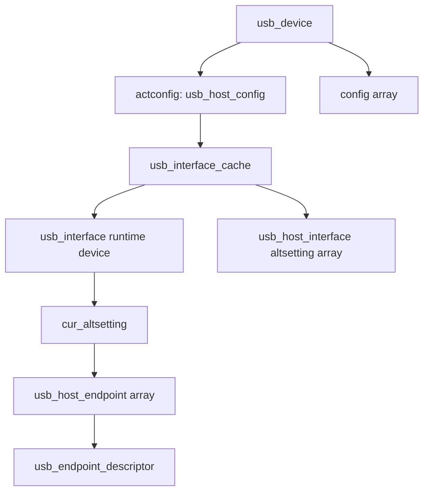
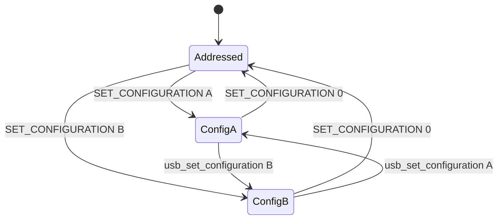
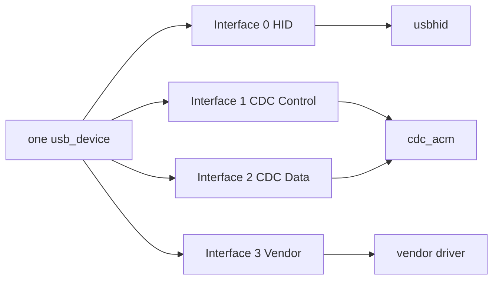
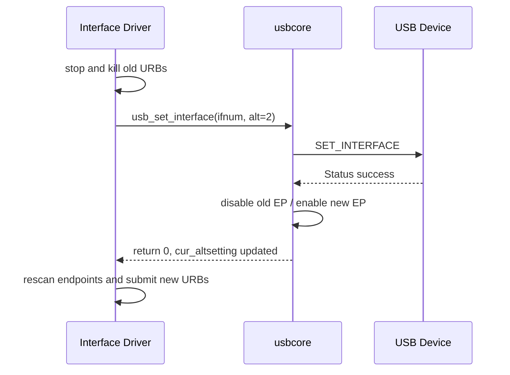
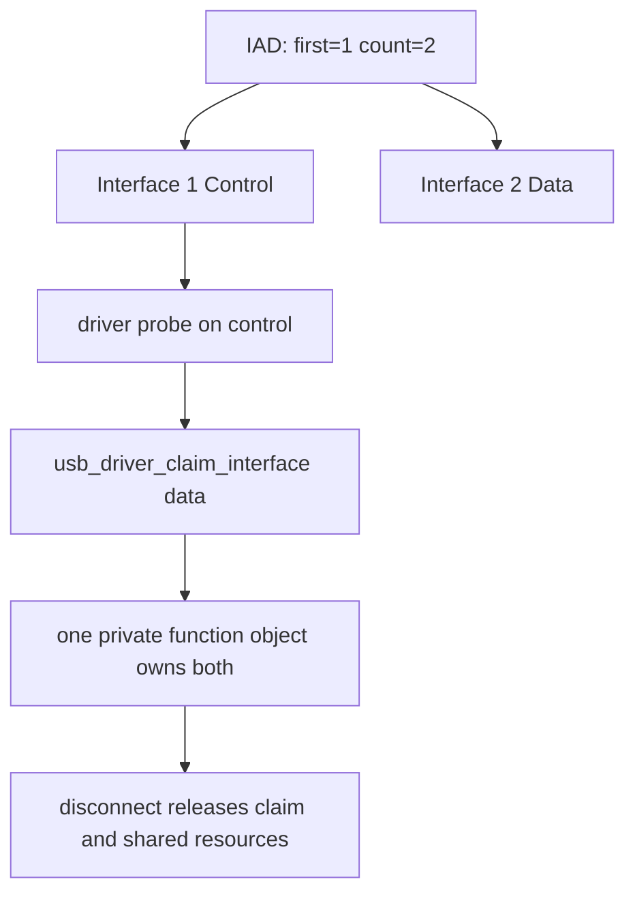
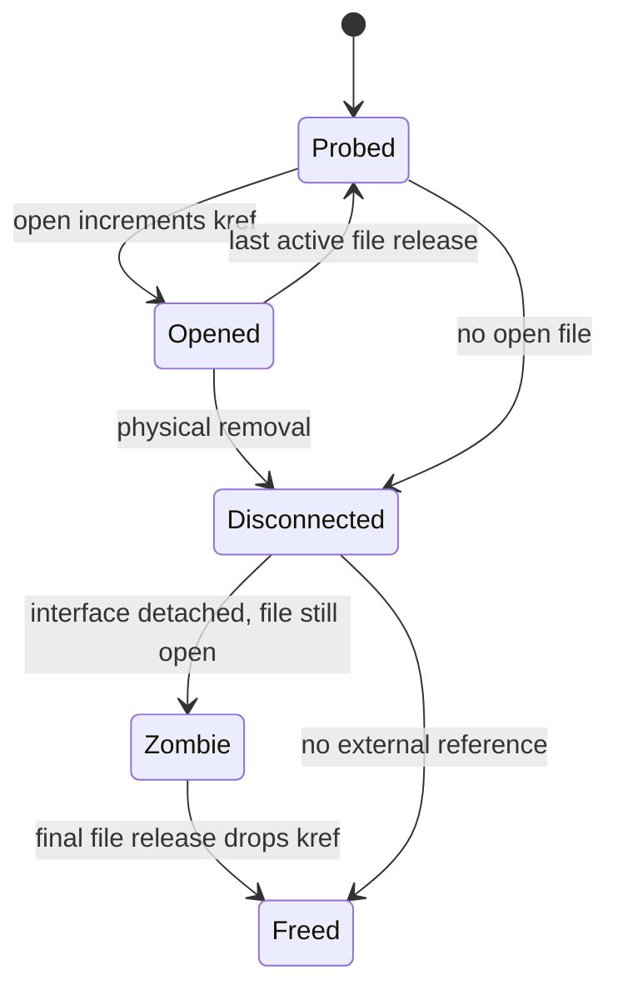

USB 驱动最常见的设计错误，不是函数不会调用，而是对象边界判断错误。

把 `usb_device` 当成一个功能，会导致复合设备被错误独占。

把 `usb_interface` 与 `usb_host_interface` 混为一谈，会在 Alternate Setting 切换后继续使用失效的 Endpoint 指针。

把描述符结构体当成运行时端点对象，会忽略 usbcore 维护的队列、带宽和 Toggle 状态。

本文以 Linux 6.12 为基线，围绕六个核心对象建立可用于写驱动的知识图谱：

- `struct usb_device`
- `struct usb_host_config`
- `struct usb_interface`
- `struct usb_host_interface`
- `struct usb_host_endpoint`
- `struct usb_device_id`

重点是对象关系、创建者、所有者、发布时刻和销毁边界。

## 一、从协议层级映射到 Linux 对象

USB 描述符定义 Device、Configuration、Interface、Alternate Setting 和 Endpoint。

Linux 不直接让驱动在原始 TLV 字节流上工作。

usbcore 在枚举期间解析描述符，为协议层级建立带运行时状态的内核对象。



`usb_device` 表示一个被枚举的物理 USB Device。

它拥有地址、速度、设备描述符、Configuration 集合、当前活动配置、EP0 状态、电源管理信息和拓扑关系。

`usb_host_config` 表示解析后的一个 Configuration。

`usb_interface` 是 Linux Driver Model 中可匹配、可绑定驱动的运行时设备。

`usb_host_interface` 表示某个 Interface Number 的一个 Alternate Setting。

`usb_host_endpoint` 表示 usbcore 维护的端点运行时对象。

对象名称相近，但生命周期和用途不同。

## 二、usb_device 表示枚举实例而不是永久硬件身份

`struct usb_device` 通常由 usbcore 在 Hub 连接处理中分配。

它嵌入 `struct device dev`，因此参加 Linux 设备模型、引用计数、sysfs 和电源管理。

重要字段可按职责分类：

| 类别 | 典型字段 | 含义 |
| --- | --- | --- |
| 拓扑 | `parent`、`bus`、`portnum` | 位于哪条总线、哪个 Hub 端口 |
| 协议 | `descriptor`、`speed`、`devnum` | 设备描述符、速度、当前地址 |
| 配置 | `config`、`actconfig` | 全部配置与活动配置 |
| 端点 | `ep0`、`ep_in[]`、`ep_out[]` | EP0 和当前可用端点索引 |
| 状态 | `state`、`authorized` | 规范状态与授权状态 |
| 电源 | `do_remote_wakeup`、LPM 字段 | 挂起、唤醒和链路电源策略 |

`devnum` 由当前 Host Bus 动态分配。

拔插后同一设备可能得到不同地址，因此不能把它当成业务 ID。

`descriptor.idVendor` 和 `idProduct` 也不能单独证明是同一台设备，因为同型号设备会共享 VID/PID。

若业务要求稳定识别，应组合序列号、物理端口路径与上层协议身份。

`usb_device` 的引用通过 `usb_get_dev()` 和 `usb_put_dev()` 管理。

获得引用只能保证内存对象还存在，不能保证物理设备仍连接，也不能保证 Endpoint 仍可提交 I/O。

驱动必须把“对象内存存活”和“设备在线可用”分成两个状态判断。

## 三、Configuration 数组与 actconfig 的区别

设备描述符的 `bNumConfigurations` 决定可能存在多少配置。

usbcore 解析后把它们保存在 `udev->config` 数组中。

`udev->actconfig` 只指向当前通过 `SET_CONFIGURATION` 激活的配置。

未激活 Configuration 的描述信息可以存在于内存，但其中端点不能用于数据传输。



`struct usb_host_config` 中常见内容包括：

- `desc`：Configuration Descriptor。
- `intf_cache[]`：每个 Interface Number 的解析缓存。
- `interface[]`：活动配置对应的运行时 `usb_interface`。
- `extra`/`extralen`：Configuration 级额外描述符。

配置切换会解绑旧 Interface Driver、禁用旧 Endpoint、发送控制请求并创建/发布新 Interface 状态。

驱动不能持有旧配置内对象并假设切换后仍有效。

普通 Interface Driver 很少主动切换整个 Configuration。

若确实需要，必须理解该操作会影响同一物理设备上的全部功能，而不是当前 Interface 一家。

## 四、为什么 Linux 驱动通常绑定 usb_interface

一个 USB Device 可以承载多个独立功能。

复合设备可能同时提供：

- HID 按键。
- CDC ACM 串口。
- UVC 视频。
- UAC 音频。
- Vendor-specific 控制功能。

Linux 把每个可独立绑定的 Interface 暴露为一个 `usb_interface` 设备。

`struct usb_driver` 的 `probe()` 参数正是 `struct usb_interface *`。

这样不同驱动可以共享同一个 `usb_device`，各自只管理自己声明的 Interface 与 Endpoint。



`usb_interface` 嵌入 `struct device dev`。

它可以有自己的 driver、sysfs 目录、runtime PM 状态和 driver data。

`usb_set_intfdata(intf, private)` 最终把私有指针放进设备 driver data。

`usb_get_intfdata()` 取回它。

disconnect 开始时通常先把该指针置空，阻止新入口获得正在销毁的私有对象。

`usb_interface` 还记录当前 Alternate Setting、需要远程唤醒与 autosuspend 等运行时信息。

## 五、Interface Number 与数组下标不是同一概念

Interface Descriptor 的 `bInterfaceNumber` 是协议编号。

Configuration 中的 Interface 缓存数组下标是解析后的存储位置。

设备描述符异常、编号不连续或 IAD 组合都可能让“编号等于数组位置”的假设失效。

驱动应通过 usbcore 提供的对象关系工作，而不是自己用 `bInterfaceNumber` 盲算指针。

获取所属设备可使用：

```c
struct usb_device *udev = interface_to_usbdev(intf);
```

该宏表达的是 `usb_interface` 到父 `usb_device` 的设备模型关系。

若私有对象需要在文件句柄中跨越 disconnect，应单独持有 `usb_device` 或私有对象引用，并同时维护 online/disconnected 标志。

仅保存 `intf` 裸指针到长期异步任务中会让生命周期难以证明。

## 六、usb_host_interface 才是 Alternate Setting

USB Interface 可以有多个 Alternate Setting。

它们共享相同 `bInterfaceNumber`，但 `bAlternateSetting` 不同。

每个 Alternate Setting 可以定义不同数量、类型、最大包长和周期的 Endpoint。

`struct usb_host_interface` 保存：

- `desc`：当前 Alternate Setting 的 Interface Descriptor。
- `endpoint`：对应的 `usb_host_endpoint` 数组。
- `extra`/`extralen`：Interface 级类描述符。

`intf->altsetting` 指向可用 Alternate Setting 数组。

`intf->cur_altsetting` 指向当前激活项。

驱动查找 Endpoint 时必须从 `cur_altsetting` 开始。

```c
struct usb_host_interface *alts = intf->cur_altsetting;

for (int i = 0; i < alts->desc.bNumEndpoints; ++i) {
    const struct usb_endpoint_descriptor *epd =
        &alts->endpoint[i].desc;
    /* classify endpoint */
}
```

把 `altsetting[0]` 当成当前设置是错误的。

数组顺序不必等于 `bAlternateSetting` 数值，当前项也可能在 probe 后被驱动切换。

## 七、Alternate Setting 解决带宽与工作模式切换

`usb_set_interface(udev, interface_number, alternate)` 发送 `SET_INTERFACE` 并更新 usbcore 状态。

典型用途包括：

- UVC 在零带宽 Alternate Setting 与流式 Endpoint 之间切换。
- UAC 在不同声道数、采样宽度或同步方式之间选择。
- Vendor 设备在命令模式与高速采集模式之间切换。

切换前必须停止旧端点上的所有 URB。

usbcore 会禁用旧 Endpoint 并启用新 Endpoint，但不会替业务驱动自动重建全部队列。

驱动应重新扫描 `cur_altsetting`，重新计算包长，并按新端点重建 URB。



切换失败时不能继续用预期的新 Endpoint。

应保留明确的软件状态：旧模式是否仍可用、是否需要 reset、用户 I/O 返回什么错误。

## 八、usb_host_endpoint 比 Endpoint Descriptor 多了什么

`struct usb_endpoint_descriptor` 只描述协议字段：地址、属性、最大包长和服务周期。

`struct usb_host_endpoint` 则是 Host 侧运行时对象。

它通常包含：

- `desc`：标准 Endpoint Descriptor。
- SuperSpeed companion 描述信息。
- 端点对应的 URB 队列。
- HCD 私有状态。
- sysfs/设备模型辅助信息。

usbcore 还在 `usb_device` 中维护 `ep_in[]` 和 `ep_out[]` 快速索引。

索引只反映当前启用 Endpoint。

Alternate Setting 或 Configuration 改变后，这些入口会更新。

驱动最好保存 Endpoint Address 或描述符值，并在模式切换后重新解析，而不是永久保存 `usb_host_endpoint *`。

对于一次 probe 到 disconnect 都不切 Alternate Setting 的简单设备，保存描述符指针通常可行；但必须在设计文档中明确这个前提。

## 九、Endpoint Address、方向和类型的判定

Endpoint Address 的 bit 7 表示方向，低 4 bit 表示 Endpoint Number。

方向始终从 Host 视角命名：

- IN：Device 到 Host。
- OUT：Host 到 Device。

类型来自 `bmAttributes & USB_ENDPOINT_XFERTYPE_MASK`。

Linux 提供的判定辅助函数比手写位运算更清楚：

```c
usb_endpoint_dir_in(epd);
usb_endpoint_dir_out(epd);
usb_endpoint_xfer_control(epd);
usb_endpoint_xfer_bulk(epd);
usb_endpoint_xfer_int(epd);
usb_endpoint_xfer_isoc(epd);
usb_endpoint_is_bulk_in(epd);
```

`usb_find_common_endpoints()` 可以寻找常见 Bulk/Interrupt IN/OUT 组合。

辅助函数找不到 Endpoint 时，驱动应返回清楚的 `-ENODEV`，并记录实际枚举到的描述符，而不是使用未初始化地址。

端点数量来自当前 Alternate Setting 的 `bNumEndpoints`。

EP0 不在该数组中，它由 `usb_device.ep0` 单独管理。

## 十、wMaxPacketSize 不是永远等于字节数

`wMaxPacketSize` 的解释依赖速度和 Endpoint 类型。

在 High-Speed Interrupt/Isochronous Endpoint 中，高位还编码每个 microframe 的额外事务数。

SuperSpeed 使用 Endpoint Companion Descriptor 提供 `bMaxBurst`、`bmAttributes` 和 `wBytesPerInterval` 等信息。

因此驱动不应总是直接 `le16_to_cpu(epd->wMaxPacketSize)` 后当作每周期总字节数。

usbcore 提供 `usb_endpoint_maxp()`、`usb_endpoint_maxp_mult()` 与 `usb_maxpacket()` 等辅助接口。

选择哪个接口取决于是在解析描述符能力，还是查询某条 pipe 的有效最大包长。

周期性传输还受到带宽调度约束。

描述符声明的能力不等于 HCD 一定能为所有设备同时保留足够带宽。

## 十一、usb_device_id 描述匹配合同

`struct usb_device_id` 是驱动与设备模型之间的匹配合同。

常用宏包括：

- `USB_DEVICE(vendor, product)`
- `USB_DEVICE_VER(vendor, product, lo, hi)`
- `USB_INTERFACE_INFO(class, subclass, protocol)`
- `USB_DEVICE_INTERFACE_CLASS(vendor, product, class)`

每个表项的 `match_flags` 决定哪些字段参与比较。

未设置 flag 的字段即使填了值也不一定生效。

表尾必须是全零终止项。

```c
static const struct usb_device_id demo_ids[] = {
    { USB_DEVICE(0x1d6b, 0x0104) },
    { USB_INTERFACE_INFO(USB_CLASS_HID, 1, 1) },
    { }
};
MODULE_DEVICE_TABLE(usb, demo_ids);
```

上例仅用于说明匹配语法。

真实驱动不应把 Linux Foundation Gadget VID/PID 当成自己的产品 ID。

`MODULE_DEVICE_TABLE` 让构建系统生成模块 alias，支持用户空间自动加载。

动态 ID 可以通过 sysfs 添加，但不会改变模块原始支持边界，也不能让不兼容协议 magically 可用。

## 十二、IAD 与多 Interface 功能如何表达

Interface Association Descriptor（IAD）把多个连续 Interface 声明为一个功能集合。

CDC、UVC 和复合功能经常使用 IAD。

IAD 不会自动让一个 `usb_driver` 同时拥有全部 Interface。

驱动仍可能需要：

- 在主 Interface 的 probe 中定位关联 Interface。
- 使用 `usb_driver_claim_interface()` 显式声明第二 Interface。
- 在失败路径调用 `usb_driver_release_interface()`。
- 处理任意一个 Interface 先触发 disconnect 的情况。



Claim 不是引用计数的替代品。

两个 Interface 共享的私有对象仍需要自己的生命周期规则，避免双重释放和一侧断开后另一侧继续 I/O。

## 十三、对象引用、驱动私有对象与 open 文件句柄

自定义字符驱动常出现三种寿命：

1. `usb_interface` 从配置发布到 disconnect。
2. 私有 driver object 从 probe 分配到最后一个引用释放。
3. file object 从 open 到 release，可能跨越物理拔出。



典型做法是私有对象持有 `kref`。

probe 拥有初始引用。

open 成功增加引用。

disconnect 先标记 offline、撤销设备节点、杀死 URB，再丢掉 probe 引用。

release 丢掉 file 引用。

最后一个引用触发内存和 `usb_device` 引用释放。

关键点是 disconnect 后 file object 仍可能调用 read/write/poll。

这些入口必须检查 offline 标志并返回 `-ENODEV` 或 `POLLHUP`，不能仅依靠指针还没释放。

## 十四、sysfs 中如何观察对象关系

USB 设备常出现在 `/sys/bus/usb/devices/`。

设备目录名可能类似 `1-2`，Interface 目录名类似 `1-2:1.0`。

其中：

- `1` 表示总线号。
- `2` 表示端口路径的一部分。
- `1.0` 表示 Configuration 1、Interface 0 的命名信息。

常用属性：

```text
idVendor
idProduct
busnum
devnum
speed
bConfigurationValue
bNumInterfaces
bInterfaceNumber
bAlternateSetting
bInterfaceClass
modalias
driver -> ...
```

sysfs 是 usbcore 当前对象状态的投影。

它不能替代原始描述符抓取，也不能证明业务数据正确。

如果 Interface 目录存在但 `driver` 链接缺失，应调查匹配与 probe。

如果 `bAlternateSetting` 与预期不符，应调查是谁执行了 `SET_INTERFACE`。

## 十五、切换、挂起、复位时哪些指针会失效

以下事件会改变对象可用性：

- `usb_set_interface()`：当前 Alternate Setting 与 Endpoint 集合改变。
- `usb_set_configuration()`：全部 Interface 可能销毁并重建。
- disconnect：Interface 从驱动解绑，Endpoint 不可再提交。
- reset：设备协议状态清空，驱动私有配置可能需要重放。
- runtime suspend：对象仍在，但 I/O 需要 PM 引用或恢复。

对象设计应区分：

| 保存内容 | 稳定范围 | 注意事项 |
| --- | --- | --- |
| VID/PID 数值 | 当前对象寿命 | 不能证明物理唯一性 |
| Endpoint Address | 当前模式定义 | 切 alt 后需重新验证 |
| `usb_host_endpoint *` | 仅在对象不重配时 | 不宜跨配置切换 |
| `usb_device *` + ref | 引用存活期 | 不代表设备在线 |
| 私有对象 + kref | 自定义 | 必须有 offline 状态 |
| `usb_interface *` 裸指针 | 驱动绑定期 | 不应交给长期外部对象 |

## 十六、probe 中建立对象关系的推荐顺序

一个可审计的 Interface Driver probe 通常按以下顺序：

1. 取得 `usb_device` 并增加需要的引用。
2. 检查 `cur_altsetting->desc` 是否为支持的协议。
3. 使用辅助函数发现 Endpoint。
4. 验证最大包长、周期和 companion descriptor。
5. 分配私有对象并初始化锁、引用与状态。
6. 分配传输缓冲和 URB。
7. 初始化子系统对象或字符设备。
8. `usb_set_intfdata()` 发布私有对象。
9. 最后发布用户可见节点或启动异步 I/O。

失败回滚按逆序进行。

在私有对象尚未完全初始化时，不要让 open、completion 或 workqueue 能找到它。

发布点应尽可能靠后。

如果异步 URB 在用户节点发布前就提交，也要保证 completion 看见完整状态并能安全处理 probe 后续失败。

## 十七、常见对象模型错误

### 把 Device 级锁当作 Interface 私有锁

同一 Device 的多个功能会被无关驱动使用。

不必要地锁住 Device 会扩大竞争域，甚至造成跨驱动死锁。

### 在 probe 保存 `altsetting[0]`

当前 Alternate Setting 不保证是数组 0。

后续切换后该指针更不代表当前 Endpoint。

### disconnect 只释放内存

若还有 open file、URB completion、workqueue 或 timer，直接释放会产生 UAF。

必须先阻止入口、取消异步工作，再通过引用计数延迟最终释放。

### 用 usb_get_dev 判断在线

引用只保护内存。

在线状态必须由 disconnect 路径维护。

### 强占复合设备所有 Interface

只有协议确实需要多个 Interface 协作时才 claim。

否则会阻止标准类驱动绑定其他功能。

## 十八、Linux 6.12 源码阅读入口

对象定义主要位于：

- `include/linux/usb.h`
- `include/uapi/linux/usb/ch9.h`
- `drivers/usb/core/config.c`
- `drivers/usb/core/driver.c`
- `drivers/usb/core/usb.c`

阅读 `include/linux/usb.h` 时，不要只看字段注释。

用交叉引用追踪：

- 谁分配对象。
- 哪个函数把它加入设备模型。
- 哪个锁保护字段。
- 哪些字段在 Alternate Setting 切换时更新。
- release 回调最终释放什么。

本文参考的一手资料：

- [Linux 6.12 USB host-side API](https://www.kernel.org/doc/html/v6.12/driver-api/usb/usb.html)
- [Linux USB data types](https://docs.kernel.org/driver-api/usb/usb.html#data-types)
- [Linux stable include/linux/usb.h](https://git.kernel.org/pub/scm/linux/kernel/git/stable/linux.git/tree/include/linux/usb.h?h=linux-6.12.y)
- [USB 2.0 Specification](https://www.usb.org/document-library/usb-20-specification)

## 十九、小结

Linux USB 对象模型的核心边界可以概括为：

`usb_device` 表示一次物理设备枚举实例。

`usb_host_config` 表示已解析的 Configuration，`actconfig` 只指向当前激活项。

`usb_interface` 是驱动模型中的绑定单位。

`usb_host_interface` 表示一个 Alternate Setting，`cur_altsetting` 才是当前设置。

`usb_host_endpoint` 在描述符之上承载 Host 运行时状态。

`usb_device_id` 明确驱动匹配合同。

引用计数只能保护内存寿命，online 标志才表达物理设备是否还能 I/O。

Configuration、Alternate Setting、reset、suspend 和 disconnect 都可能改变 Endpoint 的有效性。

驱动只有先画清这些对象和状态的边界，URB、字符设备、PM 与热插拔代码才可能写对。
