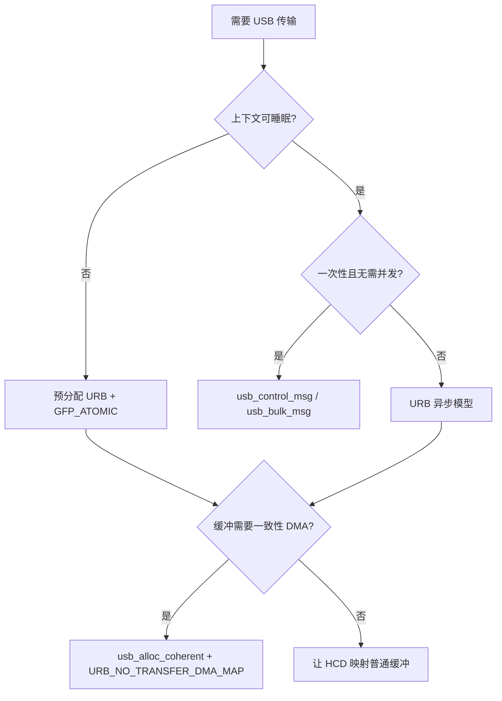
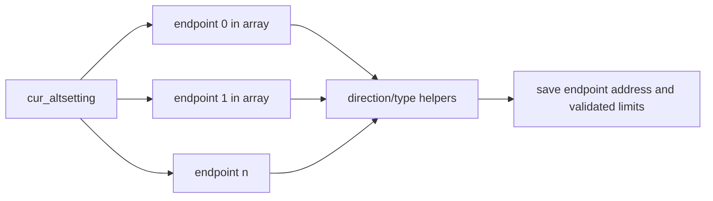
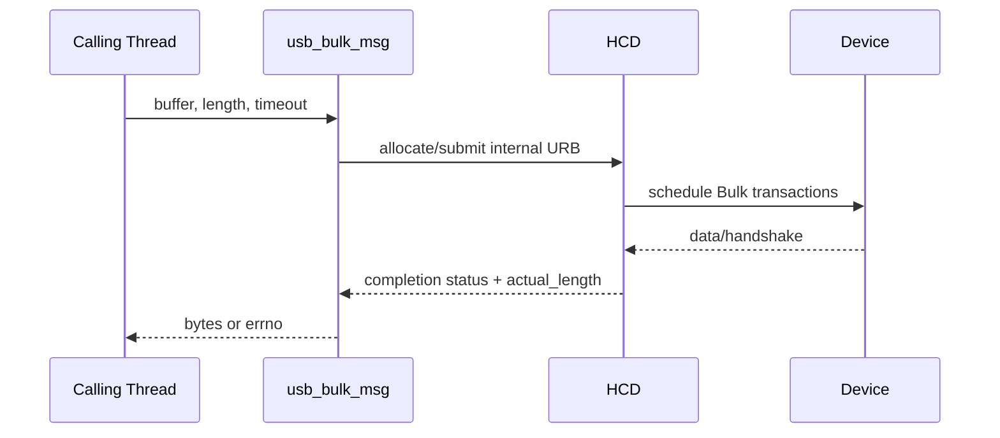
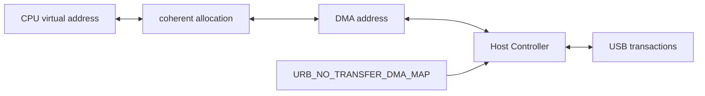
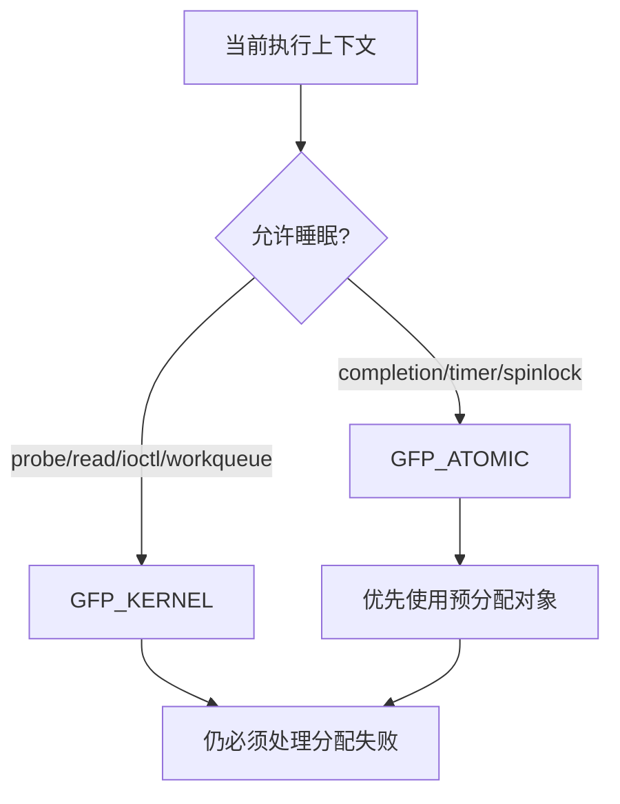

USB 驱动 API 看起来很多，但真正困难的是选择。

同一个 Bulk Endpoint 可以用 `usb_bulk_msg()`，也可以自己分配 URB。

同一个缓冲区可以由普通内存分配器提供，也可以用 `usb_alloc_coherent()` 建立一致性 DMA 映射。

同一个请求在 probe 线程中可以睡眠，在 completion 回调中却不能调用会阻塞的同步辅助函数。

本文以 Linux 6.12 为基线，建立一套按执行上下文、传输寿命、并发需求和 DMA 所有权选择 API 的方法。

## 一、API 选择先回答四个问题

写代码前先回答：

1. 当前调用者能否睡眠？
2. 请求是一次性同步命令，还是长期异步数据流？
3. 缓冲区在 CPU 与设备之间如何转移所有权？
4. disconnect、reset 或 suspend 时由谁取消请求？



如果这四个问题没有答案，API 选型通常只是“示例代码里这样写”。

示例能编译，不代表适合你的生命周期。

## 二、驱动注册 API 建立匹配入口

USB Interface Driver 使用 `struct usb_driver` 描述生命周期回调。

典型字段包括：

```c
static struct usb_driver demo_driver = {
    .name = "usb_demo",
    .probe = demo_probe,
    .disconnect = demo_disconnect,
    .suspend = demo_suspend,
    .resume = demo_resume,
    .pre_reset = demo_pre_reset,
    .post_reset = demo_post_reset,
    .id_table = demo_ids,
    .supports_autosuspend = 1,
};
```

模块通常使用 `module_usb_driver(demo_driver)`。

该宏展开为模块初始化和退出函数，内部调用 `usb_register_driver()` 与 `usb_deregister()`。

若驱动还要先注册其他子系统对象，可以显式编写 init/exit，以便严格控制顺序。

注册成功后，驱动核心会尝试匹配已经存在的 Interface，也会处理以后热插拔的 Interface。

注销会先阻止新绑定，并对现有绑定执行断开流程。

注销前模块必须确保自己的字符设备、workqueue 和全局状态不会继续产生新 I/O。

## 三、接口私有数据是发布点，不只是方便存指针

`usb_set_intfdata(intf, private)` 与 `usb_get_intfdata(intf)` 用于关联 Interface 与驱动私有对象。

把指针写入之前，私有对象应已经完成：

- 锁与 wait queue 初始化。
- online/stop 状态初始化。
- Endpoint 解析。
- 必需缓冲和 URB 分配。
- 引用计数初始化。

disconnect 的常见第一步是：

```c
struct demo *d = usb_get_intfdata(intf);

usb_set_intfdata(intf, NULL);
if (!d)
    return;
```

先清空关联可以阻止后续管理入口重新取得对象。

但已经持有引用的 completion、file 或 workqueue 仍可能运行，因此还要执行 stop/cancel 与引用释放。

## 四、端点发现优先使用语义辅助函数

不要假设 Endpoint 数组顺序。

不要假设 Bulk IN 一定是地址 `0x81`。

不要假设 Vendor Device 的第一个 Interface 就是数据功能。

Linux 6.12 提供：

```c
int usb_find_common_endpoints(
    struct usb_host_interface *alt,
    struct usb_endpoint_descriptor **bulk_in,
    struct usb_endpoint_descriptor **bulk_out,
    struct usb_endpoint_descriptor **int_in,
    struct usb_endpoint_descriptor **int_out);
```

不需要的输出参数传 `NULL`。

若需要多个同类型 Endpoint 或 Isochronous Companion 信息，应遍历 `cur_altsetting->endpoint[]` 并使用判定 helper。

常用 helper：

| API | 判定内容 |
| --- | --- |
| `usb_endpoint_dir_in()` | IN 方向 |
| `usb_endpoint_dir_out()` | OUT 方向 |
| `usb_endpoint_xfer_bulk()` | Bulk 类型 |
| `usb_endpoint_xfer_int()` | Interrupt 类型 |
| `usb_endpoint_xfer_isoc()` | Isochronous 类型 |
| `usb_endpoint_is_bulk_in()` | Bulk + IN 组合 |



发现后还要验证：

- 最大包长是否满足协议最小值。
- Interrupt `bInterval` 是否可接受。
- SuperSpeed companion descriptor 是否存在且合理。
- 同一功能需要的 Endpoint 是否完整。

## 五、Pipe 是 Host 侧传输路由编码

Linux USB API 使用 unsigned int pipe 编码目标设备、Endpoint、方向与传输类型信息。

驱动不应手工拼位。

使用以下 helper：

```c
usb_sndctrlpipe(udev, 0);
usb_rcvctrlpipe(udev, 0);
usb_sndbulkpipe(udev, epnum);
usb_rcvbulkpipe(udev, epnum);
usb_sndintpipe(udev, epnum);
usb_rcvintpipe(udev, epnum);
usb_sndisocpipe(udev, epnum);
usb_rcvisocpipe(udev, epnum);
```

参数 `epnum` 是 Endpoint Number，不是含方向位的完整 `bEndpointAddress`。

常见写法：

```c
u8 address = bulk_in->bEndpointAddress;
unsigned int pipe = usb_rcvbulkpipe(udev,
                                    usb_endpoint_num(bulk_in));
```

方向由选择的 `usb_rcv*pipe` 或 `usb_snd*pipe` 表达。

Endpoint Descriptor 的方向应与 pipe helper 一致。

## 六、usb_maxpacket 与描述符包长的区别

`usb_maxpacket(udev, pipe)` 查询当前设备和 pipe 的有效最大包长。

它通过 `usb_device` 当前端点索引工作，因此依赖当前 Configuration 和 Alternate Setting。

直接读取 `wMaxPacketSize` 则是在解释一个描述符。

两者使用场景不同：

- 描述符解析阶段：使用 `usb_endpoint_maxp()` 等 helper 检查声明能力。
- 已建立 pipe 后：使用 `usb_maxpacket()` 检查 usbcore 当前路由对应的最大包长。

切换 Alternate Setting 后，应重建 pipe 相关假设。

旧 Endpoint Address 即使数值相同，其最大包长或周期也可能改变。

High-Speed Isochronous/Interrupt Endpoint 还需要考虑 transaction multiplier。

SuperSpeed 则要结合 companion descriptor 的 burst 与 interval 字节数。

## 七、同步 Control Message 适合短命令

`usb_control_msg()` 在调用线程中提交控制请求并等待完成或超时。

典型签名参数包含 pipe、request、requesttype、value、index、data、size 和 timeout。

它适合：

- probe 中读取设备私有版本。
- 可睡眠 ioctl 中发送短配置命令。
- reset/resume 后重放少量寄存器状态。

它不适合：

- 中断或 completion 上下文。
- 需要多个并发控制请求。
- 需要精确取消和异步完成通知。
- 长期高频数据路径。

`usb_control_msg_recv()` 和 `usb_control_msg_send()` 提供方向更明确的包装，并处理部分缓冲细节。

无论使用哪种同步 helper，都要检查实际返回长度。

返回非负值表示完成字节数，不总是等于请求长度。

设备返回短数据可能是协议允许，也可能代表固件版本不兼容。

## 八、同步 Bulk Message 适合串行管理路径

`usb_bulk_msg()` 提交一个 Bulk 传输并等待结束。

它通过 `actual_length` 返回实际字节数。

适合固件下载中的低并发阶段、一次性查询或简单测试工具。

不适合持续吞吐路径，因为调用线程会阻塞且难以保持多个请求在途。



短包结束 Bulk IN 是 USB 的正常机制。

如果业务协议要求固定长度，调用者必须循环读取或明确把短包视为错误。

同步 helper 的 timeout 到期后会处理内部 URB，但调用者仍应把设备状态视为可能不同步，并根据协议决定 clear halt、reset 或放弃本轮命令。

## 九、何时必须使用 URB

URB 是 USB Request Block。

出现以下需求时应直接使用 URB：

- 多个请求并发在途。
- completion 回调驱动下一次提交。
- Interrupt/Isochronous 长期流。
- disconnect 时按组取消。
- 需要 DMA 地址、Isochronous packet 描述或特定 transfer flags。
- 需要非阻塞 read/write 和 poll。

URB 的基本生命周期：

```text
usb_alloc_urb
  -> fill fields/helper
  -> usb_anchor_urb (optional but recommended)
  -> usb_submit_urb
  -> HCD owns request while in flight
  -> completion callback
  -> resubmit or release
  -> usb_free_urb after no submission can use it
```

后续 URB 专篇会详细讨论 unlink、kill、poison 和 completion 并发。

本篇只强调：同步 helper 不能替代需要明确生命周期的异步模型。

## 十、普通缓冲区与 HCD DMA 映射

对常见 URB，驱动可以把普通 kmalloc 缓冲放入 `transfer_buffer`。

提交时 usbcore/HCD 根据平台 DMA 规则建立映射，完成后解除映射。

这种方式简单，适合：

- 请求频率不高。
- 缓冲寿命与单个 URB 一致。
- 映射开销不是瓶颈。

缓冲区必须满足 DMA API 和 HCD 要求。

不要把栈地址作为异步 URB 缓冲。

栈在函数返回后失效，也不保证适合 DMA 映射。

不要在 URB 在途时让 CPU 修改 OUT 缓冲或读取 IN 缓冲。

提交到完成之间，缓冲区所有权属于设备/HCD 数据路径。

## 十一、usb_alloc_coherent 建立一致性 DMA 缓冲

`usb_alloc_coherent()` 为指定 `usb_device` 分配一致性 DMA 缓冲，并返回 CPU 地址与 DMA 地址。

典型写法：

```c
d->buf = usb_alloc_coherent(d->udev, d->buf_len,
                            GFP_KERNEL, &d->dma);
if (!d->buf)
    return -ENOMEM;

usb_fill_int_urb(d->urb, d->udev, d->pipe,
                 d->buf, d->buf_len,
                 demo_complete, d, d->interval);
d->urb->transfer_dma = d->dma;
d->urb->transfer_flags |= URB_NO_TRANSFER_DMA_MAP;
```

`URB_NO_TRANSFER_DMA_MAP` 告诉 usbcore：驱动已经提供有效 DMA 地址，不要重复映射。

释放必须配对：

```c
usb_free_coherent(d->udev, d->buf_len, d->buf, d->dma);
```

一致性表示 CPU 和设备对内存可见性的基本保证，不表示无需同步并发访问。

驱动仍要用状态、锁和所有权规则避免 CPU 与设备同时改写同一描述符。



## 十二、Setup Packet 也有独立 DMA 语义

Control URB 使用 8 字节 Setup Packet。

普通情况下 `setup_packet` 指向可映射内存，由 usbcore 处理映射。

若驱动自行提供 Setup DMA 地址，需要设置 `setup_dma` 和 `URB_NO_SETUP_DMA_MAP`。

不要把 transfer buffer 的 DMA 地址误用于 Setup Packet。

两者方向、长度和生命周期不同。

对一次性控制命令，使用同步 helper 通常比手工管理 Control URB 更可靠。

只有需要异步、取消或并发控制请求时，才值得承担 Setup 与 Data 两套缓冲生命周期。

## 十三、GFP_KERNEL 与 GFP_ATOMIC 由上下文决定

内存分配和 `usb_submit_urb()` 都接收 GFP flags。

基本规则：

- 进程上下文且允许睡眠：`GFP_KERNEL`。
- completion、timer、softirq 或持有 spinlock：`GFP_ATOMIC`。

`GFP_ATOMIC` 不是“更安全的通用选择”。

它使用更受限的内存储备，滥用会增加分配失败概率。

长期流式驱动应在 probe/open/start 阶段预分配 URB 和缓冲，completion 中只做状态更新与重提交。

这样可以减少原子上下文分配。



判断上下文不能只看函数名。

同一个 helper 可能从不同路径调用，应由调用链和持锁状态证明是否可睡眠。

## 十四、同步 API 为什么不能在 completion 中调用

URB completion 通常在 HCD 的原子上下文执行。

`usb_control_msg()` 与 `usb_bulk_msg()` 会等待请求完成，需要睡眠。

在 completion 中调用会触发 `sleeping function called from invalid context`，也可能形成递归等待同一控制器事件的死锁。

需要在完成后执行可睡眠控制命令时，应：

1. completion 记录状态。
2. 把 work 投递到 workqueue。
3. workqueue 持有对象引用并检查 online/PM 状态。
4. 在进程上下文调用同步 helper。
5. 完成后再次检查是否已 disconnect。

workqueue 也必须在 disconnect 中同步取消。

否则 work 可能在 Interface 私有对象释放后运行。

## 十五、Stall、clear halt 与 Toggle 重建

Bulk/Interrupt Endpoint 返回 STALL 时，URB 常以 `-EPIPE` 完成。

协议允许恢复时，可在可睡眠上下文调用 `usb_clear_halt(udev, pipe)`。

该操作发送 Clear Feature，并重置 Host 侧 data toggle。

不能在 completion 里直接调用同步 clear halt。

应投递恢复工作，并在恢复期间阻止新 I/O。

不是所有 `-EPIPE` 都应自动无限重试。

有些设备用 STALL 表示不支持命令或业务错误。

恢复策略必须由设备协议定义：

- 可恢复传输错误：clear halt 后有限重试。
- 命令语义错误：返回上层，不重试。
- 状态机失步：执行设备私有 reset。
- 反复 STALL：停止队列并报告故障。

## 十六、Runtime PM API 必须包围真实 I/O 寿命

允许 autosuspend 的 Interface Driver 在发起需要设备唤醒的操作前，应取得 runtime PM 使用计数。

常用接口：

```c
usb_autopm_get_interface(intf);
usb_autopm_put_interface(intf);
usb_autopm_get_interface_async(intf);
usb_autopm_put_interface_async(intf);
```

同步版本可能睡眠。

异步版本适合受限上下文，但返回与恢复语义需要仔细处理。

PM 引用应覆盖从设备必须处于活动态开始，到最后一个相关 URB 或命令不再依赖活动态为止。

只在 submit 前 get、submit 后立刻 put，可能让设备在请求仍在途时进入 suspend。

长期 Interrupt URB 的 PM 策略要结合远程唤醒与驱动 suspend 回调设计。

## 十七、错误返回值必须按层解释

USB API 常见返回：

| 返回值 | 常见含义 | 驱动动作 |
| --- | --- | --- |
| `-ENODEV` | 设备/接口已离线 | 停止新 I/O，唤醒等待者 |
| `-ESHUTDOWN` | HCD/Endpoint 正在关闭 | 不重提交 |
| `-ENOENT` | URB 被 unlink | 根据 stop 状态静默结束 |
| `-ECONNRESET` | URB 被取消 | 通常不重提交 |
| `-EPIPE` | Endpoint STALL | 按协议决定 clear halt |
| `-EPROTO` | 协议/链路错误 | 有限重试并收集证据 |
| `-ETIMEDOUT` | 超时 | 判断设备状态是否失步 |
| `-EOVERFLOW` | 收到的数据超出缓冲 | 修正协议长度或设备固件 |

completion 中的 status 与 submit 的返回值属于不同时间点。

`usb_submit_urb()` 返回 0 只表示请求被接受，不代表传输成功。

最终结果在 completion 的 `urb->status` 和 `actual_length` 中。

## 十八、API 决策矩阵

| 场景 | 推荐 API | 原因 |
| --- | --- | --- |
| probe 读取 16 字节版本 | `usb_control_msg_recv()` | 可睡眠、一次性、方向明确 |
| ioctl 发送短配置 | `usb_control_msg_send()` | 串行管理路径 |
| 简单固件块下载 | `usb_bulk_msg()` + 分块 | 实现简单，需检查 actual length |
| 持续 Bulk IN | 多 URB + anchor | 保持并发与可取消性 |
| HID Interrupt IN | 预分配 URB + coherent buffer | 周期重提交、低抖动 |
| Isochronous 音视频 | Iso URB 队列 | 每 packet 状态与带宽周期 |
| completion 后恢复 STALL | workqueue + `usb_clear_halt()` | clear halt 会睡眠 |
| disconnect 取消一组请求 | `usb_kill_anchored_urbs()` | 同步等待 completion 结束 |

决策矩阵不是 API 黑名单。

它把请求性质与生命周期对应起来。

## 十九、Linux 6.12 一手资料与源码入口

建议对照以下定义与实现：

- `include/linux/usb.h`
- `drivers/usb/core/urb.c`
- `drivers/usb/core/message.c`
- `drivers/usb/core/driver.c`
- `drivers/usb/core/hcd.c`

一手资料：

- [Linux 6.12 USB API](https://www.kernel.org/doc/html/v6.12/driver-api/usb/usb.html)
- [Linux USB URB documentation](https://docs.kernel.org/driver-api/usb/URB.html)
- [Linux stable usb.h](https://git.kernel.org/pub/scm/linux/kernel/git/stable/linux.git/tree/include/linux/usb.h?h=linux-6.12.y)
- [USB 2.0 Specification](https://www.usb.org/document-library/usb-20-specification)

API 原型以 Linux 6.12 头文件为准。

较新内核若增加 managed helper 或调整内部映射实现，不应反向写进本系列的 6.12 示例。

## 二十、小结

usbcore API 的选择由上下文和生命周期决定。

Endpoint 必须从当前 `cur_altsetting` 按方向与类型发现。

Pipe 应由 `usb_rcv*pipe()`、`usb_snd*pipe()` helper 构造，`usb_maxpacket()` 查询当前有效路由。

同步 Control/Bulk helper 适合可睡眠、一次性、低并发命令。

长期流和并发 I/O 必须使用 URB。

普通缓冲可由 usbcore/HCD 映射；`usb_alloc_coherent()` 配合 `URB_NO_TRANSFER_DMA_MAP` 适合稳定复用的一致性 DMA 缓冲。

`GFP_KERNEL` 与 `GFP_ATOMIC` 由真实执行上下文决定，completion 中不能调用同步 USB 消息。

PM 引用、STALL 恢复、取消和错误解释都必须覆盖请求的完整寿命。

API 能否调用只是第一步；能否证明 submit、completion、disconnect 和释放之间不存在竞态，才是驱动是否可靠的判断标准。
