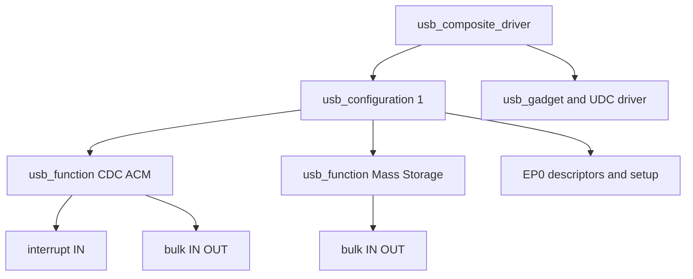

Linux USB Host 驱动管理外接设备；Gadget 子系统让 Linux 自己成为 USB Device。开发板上的 Device Controller 由 UDC 驱动管理，上层 Gadget/Composite 框架组织描述符、Configuration、Function 和 endpoint，再响应 PC Host 的枚举和传输。

本篇从 EP0 setup 请求进入，解释 UDC、`usb_gadget`、`usb_composite_driver`、`usb_configuration` 与 `usb_function` 的关系，并分别说明 ConfigFS 和 FunctionFS 的工程位置。

## UDC 是 Device Controller 的硬件适配层

UDC 驱动把 DWC2、DWC3、ChipIdea 等 Device Controller 的寄存器、FIFO、DMA 和中断适配为 `usb_gadget_ops` 与 endpoint operations。它注册一个 `usb_gadget`，包含 EP0、可用 endpoint 列表、速度能力和控制器状态。

上层 Gadget driver 不直接写控制器寄存器，而是通过 `usb_ep_enable()`、`usb_ep_queue()` 等操作 endpoint request。这个分层与 Host 侧 HCD/URB 类似，但总线角色相反：Gadget 等待 Host 发起 token 和 setup。

## EP0 setup 把枚举请求分发给 composite 和 function

Host 发来的 8 字节 Setup packet 先由 UDC 中断接收，再交给 Gadget driver 的 setup 回调。Composite framework 处理标准 Device/Configuration 请求、描述符拼装和配置切换；class/vendor 请求再分发到命中的 `usb_function`。

`SET_CONFIGURATION` 成功后，framework 调用各 function 的 `set_alt()`，function 选择 endpoint descriptor、enable endpoint 并准备 request。Host 取消配置或拔出时调用 `disable()`，必须停止 endpoint request 并撤销上层状态。

EP0 Data/Status 阶段仍使用 `usb_request`。Setup 回调不能返回后让临时 buffer 失效，也不能在 atomic 中断路径执行长时间阻塞操作。

## Composite 框架把复合设备拆成可组合 Function



`usb_composite_probe()` 注册 composite driver。Driver 的 bind 回调创建 configuration、字符串和 function instance；`usb_add_config()` 把配置加入设备；`usb_add_function()` 让 function 分配 interface ID、自动选择 endpoint 并贡献描述符。

Function 的 bind/set_alt/disable/unbind 构成自身生命周期。Endpoint 资源不是固定名字：`usb_ep_autoconfig()` 根据描述符需求从 UDC 可用 endpoint 中选择，实际硬件数量和方向能力可能限制可组合功能。

## ConfigFS 把复合设备组装移到用户态配置

ConfigFS Gadget 允许不写新的内核 composite driver 就组装标准 function：

```bash
mount -t configfs none /sys/kernel/config
cd /sys/kernel/config/usb_gadget
mkdir g1 && cd g1
echo 0x1d6b > idVendor
echo 0x0104 > idProduct
mkdir -p strings/0x409 configs/c.1/strings/0x409
mkdir -p functions/acm.usb0 functions/mass_storage.0
ln -s functions/acm.usb0 configs/c.1/
ln -s functions/mass_storage.0 configs/c.1/
ls /sys/class/udc > UDC
```

写入 UDC 名称才真正 bind 控制器并连接 Host。修改 descriptors 或 function 组合前应先清空 UDC 解绑，再撤销 symlink 和 function；直接删除正在使用的目录会失败或留下繁忙资源。

ConfigFS 适合标准 CDC/ECM/RNDIS/MSC/HID 等组合。不同 Host OS 对 VID/PID、字符串、IAD、OS descriptor 和 function 顺序有兼容性要求，Linux 上枚举成功不代表 Windows/macOS 必然使用期望驱动。

## FunctionFS 让用户态实现自定义 USB Function

FunctionFS 由内核处理 EP0 基础和 endpoint 文件接口，用户进程提供 descriptors/strings、接收 setup 事件并通过 endpoint fd 收发数据。ADB 等场景可借此把协议逻辑留在用户态。

FunctionFS 不是绕过 Gadget 生命周期。用户进程退出、descriptor 写入失败或 UDC unbind 都会影响整个 function；daemon 需要处理 ENABLE、DISABLE、SETUP、SUSPEND、RESUME 等事件，并确保 endpoint I/O 在 disable 后停止。

## 数据路径围绕 `usb_request` 和 endpoint queue

Function 为 endpoint 分配 `usb_request`，设置 buffer、length、complete，再调用 `usb_ep_queue()`。请求提交后 buffer 归 UDC 使用，completion 才能重用或释放。持续发送/接收通常维护 request pool，避免在中断完成路径频繁分配。

IN request 是 Device 向 Host 提供数据，但只有 Host 发起 IN token 才真正发送；OUT request 必须预先排队，否则 Host 发送时可能 NAK。高速吞吐依赖 endpoint FIFO/DMA、request 深度和 function 协议，不是单纯扩大一个 buffer。

## Gadget bring-up 从 UDC 状态开始

```bash
ls /sys/class/udc
cat /sys/kernel/debug/usb/udc/*/state 2>/dev/null
find /sys/kernel/config/usb_gadget -maxdepth 3 -type f
```

没有 UDC 节点时先查 Device Controller、PHY、clock/reset、`dr_mode` 和 role switch；UDC 存在但 Host 无枚举，查 pull-up/VBUS 检测、EP0 setup 与描述符；已配置但功能不可用，再查 function set_alt、endpoint enable、request completion 和 Host class driver。

官方 Gadget API 见 [Linux USB Gadget API](https://docs.kernel.org/driver-api/usb/gadget.html)。调试时打开 UDC/composite/function 的 dynamic debug，可把一次 setup 从硬件中断追到具体 function。

## 小结

Linux Gadget 由 UDC 硬件适配、Composite 设备模型和 Function 协议实现组成。`usb_composite_probe` 注册设备，`usb_function` 贡献 interface/endpoint 与 class setup，ConfigFS 负责动态组装，FunctionFS 允许用户态实现功能。正确实现必须处理 EP0、set_alt/disable、request 所有权和 Host 兼容性。下一篇将比较常见 USB Class 在 Host 侧如何绑定和传输。
