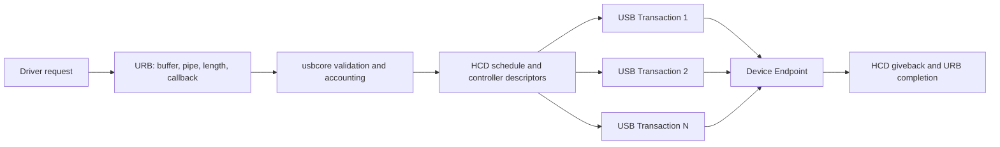
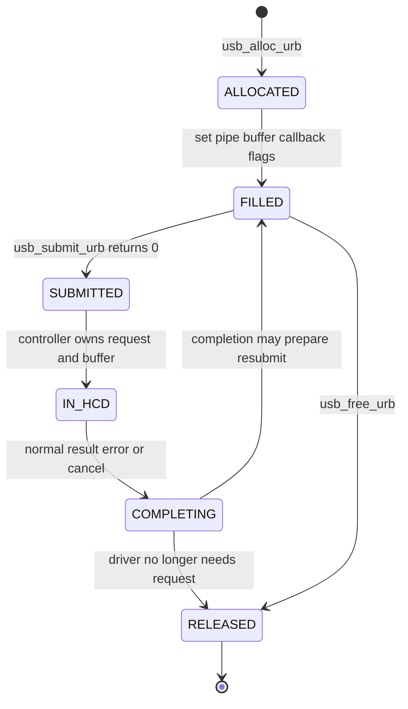
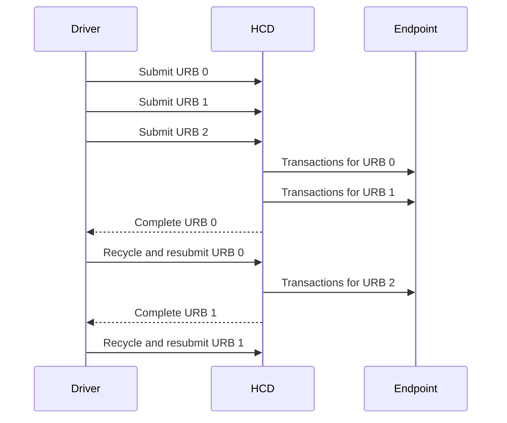
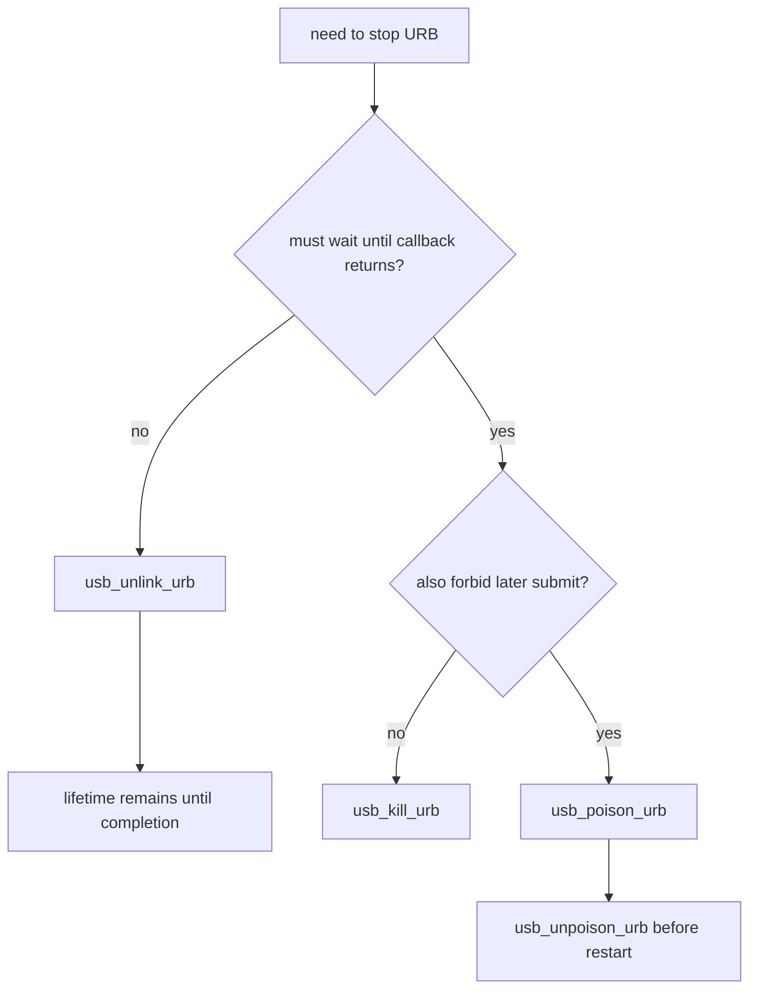
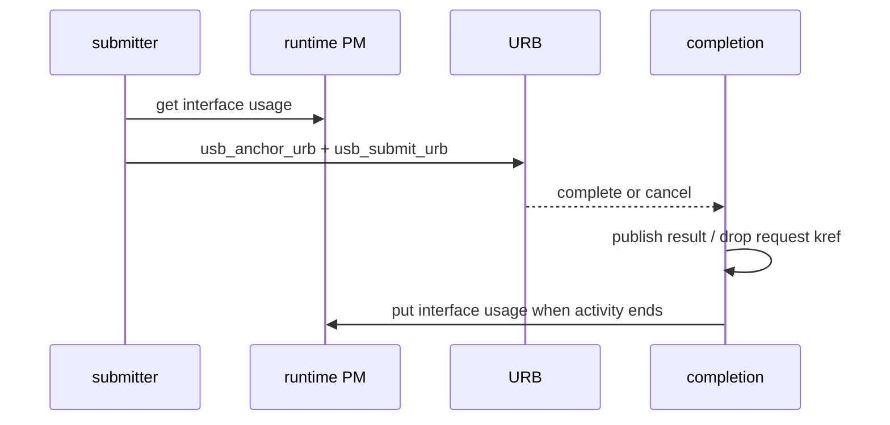

描述符只说明设备“有哪些通道”，真正的数据收发还需要 Host 按总线时间调度 transaction。Linux 不让 Interface Driver 直接构造 token/data/handshake packet，而是用 URB 描述一次异步 I/O 请求，再由 usbcore 和 HCD 转换成控制器 schedule。

本文对 URB 字段、API 与取消语义的讨论固定以 Linux 6.12 为基线。

这篇最重要的不是记 API，而是建立四个层次：packet 是线上的最小协议单元，transaction 完成一次方向明确的交换，transfer 表达 Control/Bulk/Interrupt/Isochronous 语义，URB 则是 Linux 提交给 USB 栈的异步软件对象。混淆这些层次会直接造成长度、完成和取消语义错误。

## 一、从 Packet、Transaction 到 Transfer 和 URB

USB 2.0 transaction 通常由 token、可选 data 和 handshake 组成。Token 指定设备地址、Endpoint 和方向；Data packet 携带 payload 与 CRC；ACK/NAK/STALL 等 handshake 表示接收结果。不同 transfer 类型组合 transaction 的方式不同。

NAK 不是传输失败。Device 用 NAK 表示“当前没有数据或 buffer”，Host Controller 会按调度策略稍后重试。STALL 表示 Endpoint 停止或请求不受支持，需要软件处理 halt；CRC/timeout 等则属于真正错误。

Linux URB（USB Request Block）描述驱动希望完成的 transfer：目标 Device 和 pipe、buffer、长度、完成回调、flags 及类型相关字段。一个 URB 可能被 HCD 拆成多个 transaction；一个大 Bulk URB 也不是一个“大 packet”。



`struct urb` 的生命周期属于提交者与 USB 栈共同管理：提交前由驱动独占；`usb_submit_urb()` 成功后，HCD 可以随时访问 URB 和 transfer buffer；giveback 进入 completion 后，驱动重新获得本次请求的处理权。驱动不能在提交成功后立即修改或释放 buffer。

## 二、四种 Transfer 的调度和完成语义

Control Transfer 使用 EP0 或其他 Control Endpoint，由 Setup、可选 Data、Status 三阶段组成。它用于标准请求、Class 请求和 Vendor 请求。Linux 提供同步 `usb_control_msg()`，也允许驱动自行构造 Control URB。

Bulk Transfer 使用剩余总线带宽，依靠 CRC、ACK 和重试保证可靠交付，但不承诺完成时间。Mass Storage、自定义高速数据和打印机常用 Bulk。大 buffer 会被拆包，IN 方向的 short packet 通常表示本次 transfer 提前结束。

Interrupt Transfer 仍由 Host 周期性轮询，不是 CPU 中断。Endpoint Descriptor 的 interval 决定服务机会；每次服务数据量通常较小，适合键盘、鼠标和状态通知。

Isochronous Transfer 预留周期带宽，强调按时交付，不对错误 packet 重试。音视频驱动必须接受“本 URB 完成，但其中某些 packet 失败”的结果，并按 packet 级 status/actual_length 处理。

| 类型 | Linux pipe helper | 主要完成边界 |
| --- | --- | --- |
| Control | `usb_sndctrlpipe()` / `usb_rcvctrlpipe()` | 完整三阶段 |
| Bulk | `usb_sndbulkpipe()` / `usb_rcvbulkpipe()` | 指定长度或 short packet |
| Interrupt | `usb_sndintpipe()` / `usb_rcvintpipe()` | 一次周期服务请求 |
| Isochronous | `usb_sndisocpipe()` / `usb_rcvisocpipe()` | 多个独立 iso packet |

Pipe 是 Linux 将 Device、Endpoint、方向和 transfer type 编码到一个整数中的历史抽象。驱动通过 helper 创建，不能手工猜位域。Pipe 不拥有 Endpoint，也不保存当前 Alternate；Interface 切换后应重新确认 Endpoint 仍然存在。

## 三、struct urb 的字段和完整生命周期

驱动通常用 `usb_alloc_urb()` 分配 URB。参数 `iso_packets` 对普通 Control/Bulk/Interrupt 为 0；Isochronous URB 需要为每个 packet 分配 `iso_frame_desc` 数组空间。

核心字段可以按责任分组：

- 目标：`dev`、`pipe`、Control 的 `setup_packet`。
- 数据：`transfer_buffer`、`transfer_dma`、`transfer_buffer_length`。
- 完成：`complete`、`context`、`status`、`actual_length`。
- 行为：`transfer_flags`、Interrupt 的 `interval`。
- Isochronous：`number_of_packets`、`start_frame`、`iso_frame_desc[]`。

典型异步生命周期如下：



URB 有自己的引用计数。`usb_free_urb()` 实际是 put 操作，但这不允许驱动提前释放 transfer buffer 或私有 context；HCD 访问的是这些外部对象，必须由驱动按 completion/cancel 边界管理。

### transfer buffer 如何进入 DMA 地址空间

普通驱动给 `transfer_buffer` 提供 CPU 可访问地址，usbcore/HCD 在 submit 过程中按控制器需要建立 DMA mapping，并在 giveback 后解除。驱动不应把 `virt_to_phys()` 结果塞给控制器，也不应假设 USB DMA address 等于 CPU physical address。

连续高频传输可以预先使用 `usb_alloc_coherent()` 分配适合该 Device/HCD 的一致性 buffer，保存返回的 DMA address，并设置 `URB_NO_TRANSFER_DMA_MAP`，告诉 usbcore 不要重复 map：

```c
buf = usb_alloc_coherent(udev, len, GFP_KERNEL, &dma);
if (!buf)
    return -ENOMEM;

urb->transfer_buffer = buf;
urb->transfer_dma = dma;
urb->transfer_buffer_length = len;
urb->transfer_flags |= URB_NO_TRANSFER_DMA_MAP;
```

释放时用配对的 `usb_free_coherent()`，并保证 URB 已同步停止。预映射减少 map/unmap，但增加长期 pinned DMA 内存；是否值得取决于 buffer 重用频率和平台 DMA/IOMMU 成本。

`URB_NO_SETUP_DMA_MAP` 对 Control URB 的 setup packet 有类似含义。除非驱动明确管理 coherent setup buffer，否则不要设置这些 flag。错误使用会让 HCD 把普通虚拟地址当作有效 DMA address。

`URB_FREE_BUFFER` 让 URB 最终释放时 `kfree(transfer_buffer)`，适合每次异步 write 独立分配 buffer；它不能用于 `usb_alloc_coherent()` 返回的内存，因为释放 API 不同。

`status` 在 completion 中表示整体完成原因，常见值包括 0、`-ENOENT`（unlink）、`-ECONNRESET`、`-ESHUTDOWN`（设备/控制器停止）、`-EPIPE`（stall）和协议/超时错误。驱动应区分正常 teardown 与业务错误，拔出时不要把预期的 `-ESHUTDOWN` 打成持续告警。

## 四、构造并提交 Control、Bulk 与 Interrupt URB

同步 helper 适合 probe 中少量配置操作：

```c
int actual;
int ret = usb_control_msg_recv(udev, 0,
                               DEMO_GET_STATUS,
                               USB_DIR_IN | USB_TYPE_VENDOR | USB_RECIP_DEVICE,
                               0, 0, status, sizeof(status),
                               1000, GFP_KERNEL);
```

旧代码常使用 `usb_control_msg()`。它在调用线程中等待，不能用于 atomic/IRQ context，也不适合持续数据流。同步返回时 buffer 可重新使用；异步 URB 则必须等待 completion。

### 手工构造 Control URB

当控制请求需要异步执行或和其他 URB 统一管理时，驱动分配 8 字节 `usb_ctrlrequest`，再调用 `usb_fill_control_urb()`：

```c
struct usb_ctrlrequest *setup;

setup = kmalloc(sizeof(*setup), GFP_KERNEL);
if (!setup)
    return -ENOMEM;

setup->bRequestType = USB_DIR_IN | USB_TYPE_VENDOR |
                      USB_RECIP_INTERFACE;
setup->bRequest = DEMO_GET_STATS;
setup->wValue = cpu_to_le16(0);
setup->wIndex = cpu_to_le16(intf->cur_altsetting->desc.bInterfaceNumber);
setup->wLength = cpu_to_le16(sizeof(*stats));

usb_fill_control_urb(urb, udev, usb_rcvctrlpipe(udev, 0),
                     (unsigned char *)setup, stats,
                     sizeof(*stats), demo_ctrl_complete, ctx);
```

`setup_packet` 与 data buffer 都必须活到 completion。Setup 的方向决定 data pipe 和 Status 方向；`wLength` 必须与 buffer 容量一致。Host 允许 Device 返回小于 `wLength` 的数据，驱动仍要检查 `actual_length` 是否达到协议最小结构长度。

Control URB completion 只报告整个 transfer 结果，不分别回调 Setup/Data/Status。若 Device 在 Setup 阶段 stall，最终通常表现为 `-EPIPE`；要定位具体阶段需要 usbmon 或协议分析仪。

Bulk URB 可以用 `usb_fill_bulk_urb()`：

```c
urb = usb_alloc_urb(0, GFP_KERNEL);
if (!urb)
    return -ENOMEM;

buf = kmalloc(len, GFP_KERNEL);
if (!buf) {
    usb_free_urb(urb);
    return -ENOMEM;
}

memcpy(buf, src, len);
usb_fill_bulk_urb(urb, udev,
                  usb_sndbulkpipe(udev, bulk_out_ep),
                  buf, len, demo_write_complete, ctx);
urb->transfer_flags |= URB_ZERO_PACKET;
ret = usb_submit_urb(urb, GFP_KERNEL);
```

`URB_ZERO_PACKET` 只在 OUT 长度恰好是 Endpoint max packet size 的整数倍、且设备协议以 short/ZLP 表示消息结束时需要。不能对所有 Bulk OUT 盲目设置；很多协议已经有长度字段，额外 ZLP 可能改变设备状态机。

Bulk IN 默认允许 short packet，并用 `actual_length` 返回实际数据。若上层协议要求必须收到固定长度，可以设置 `URB_SHORT_NOT_OK`，short 会转为错误。是否允许 short 是业务协议决定，不是“Bulk 一定收满”。

Interrupt URB 用 `usb_fill_int_urb()` 并设置 interval。持续状态监听通常在 completion 中重新提交同一个 URB，但重新提交前必须检查 disconnected/suspended 状态，避免 teardown 与 resubmit 竞争。

## 五、Completion、取消与 usb_anchor 共同关闭并发窗口

Completion 回调运行时，本次 URB 已离开 HCD 队列，但回调可能与 process context、disconnect、suspend 和用户 close 并发。回调应尽量短：读取 `status/actual_length`，更新队列，唤醒 wait queue，决定是否重新提交，不执行可能长时间睡眠的协议流程。

```c
static void demo_rx_complete(struct urb *urb)
{
    struct demo_dev *dev = urb->context;
    unsigned long flags;

    if (urb->status == 0 && urb->actual_length) {
        spin_lock_irqsave(&dev->rx_lock, flags);
        demo_queue_bytes(dev, urb->transfer_buffer,
                         urb->actual_length);
        spin_unlock_irqrestore(&dev->rx_lock, flags);
        wake_up_interruptible(&dev->read_wait);
    }

    if (!READ_ONCE(dev->disconnected) &&
        urb->status != -ENOENT &&
        urb->status != -ESHUTDOWN)
        usb_submit_urb(urb, GFP_ATOMIC);
}
```

取消 API 的同步语义不同：

- `usb_unlink_urb()` 发出异步取消请求，返回后 completion 可能尚未执行。
- `usb_kill_urb()` 同步等待 URB 不再被 HCD 或 completion 使用，适合 disconnect/teardown，不能在该 URB 自己的 completion 中调用。
- `usb_poison_urb()` 除了 kill，还阻止后续 submit，直到 unpoison，适合更强的生命周期门禁。

动态并发 URB 不应只保存在一个指针中。`struct usb_anchor` 是 usbcore 提供的跟踪集合：

```c
usb_anchor_urb(urb, &dev->submitted);
ret = usb_submit_urb(urb, GFP_KERNEL);
if (ret)
    usb_unanchor_urb(urb);

/* disconnect */
usb_kill_anchored_urbs(&dev->submitted);
```

URB 在正常完成时会从 anchor 脱离；提交失败必须显式 unanchor。disconnect 先阻止新提交，再 kill anchor，才能保证集合最终为空。

## 六、多 URB 流水和 Isochronous packet 结果

单个 Bulk IN URB 的流程是“提交 -> 等待总线和设备 -> completion -> 再提交”。completion 到下次提交之间 Endpoint 没有可用 buffer，会形成气泡。高速流设备通常准备多个 URB，使 HCD 始终有请求可调度。



URB 数量取决于链路延迟、Endpoint 服务周期、每个 buffer 大小、用户消费抖动和可接受内存。不是越多越好：过深队列增加停止延迟和缓存压力。驱动应记录 in-flight、队列空闲、用户 backlog 和 completion latency，再决定深度。

### 从带宽时延积推导初始队列深度

可以用带宽时延积给出起始估计。假设设备持续输出 40 MiB/s，从某个 URB 完成到驱动重新提交的最坏调度间隔为 2 ms，则仅覆盖这段间隔就需要约 80 KiB 已排队 buffer。选择 4 个 32 KiB URB 提供 128 KiB，通常比 128 个 1 KiB URB 更少消耗调度与 completion 开销。

这只是起点。USB packet size、HCD schedule、Device 内部 FIFO、IOMMU mapping 和用户处理都会改变结果。测量时至少记录：

- HCD 队列是否曾为空；
- 每个 URB 的 `actual_length` 分布和 completion 间隔；
- FIFO high watermark 与丢弃计数；
- disconnect/kill 收敛需要多长时间；
- 吞吐提升是否以不可接受的端到端延迟为代价。

双缓冲适合较低速设备，固定 URB pool 适合持续流，环形共享 buffer 适合减少复制但会增加 ownership 与 mmap 约束。数据结构应由协议边界决定，不要为了“零拷贝”让用户态直接覆盖 HCD 正在使用的区域。

Isochronous URB 通过多个 `iso_frame_desc` 描述 packet offset/length，完成后每项都有独立 `status/actual_length`：

```c
urb = usb_alloc_urb(packet_count, GFP_KERNEL);
urb->dev = udev;
urb->pipe = usb_rcvisocpipe(udev, iso_in_ep);
urb->transfer_buffer = buf;
urb->transfer_buffer_length = packet_count * packet_size;
urb->complete = demo_iso_complete;
urb->number_of_packets = packet_count;
urb->transfer_flags = URB_ISO_ASAP;

for (i = 0; i < packet_count; i++) {
    urb->iso_frame_desc[i].offset = i * packet_size;
    urb->iso_frame_desc[i].length = packet_size;
}
```

整体 `urb->status == 0` 不保证每个 packet 成功。音视频驱动要遍历 `iso_frame_desc[i].status`，只消费成功部分，并把丢包、空包和时间戳交给上层策略。Isochronous 不重传，错误恢复通常依赖后续帧，而不是重发过去的数据。

## 七、用分层证据调试提交与完成问题

`usb_submit_urb()` 同步失败说明请求尚未进入正常异步生命周期。检查 Device 状态、pipe/Endpoint、buffer、length、GFP flags 和 URB 是否已提交。返回 0 后没有 completion，则需要确认 HCD 队列、设备响应和取消/PM 状态。

推荐同时记录：

```bash
sudo modprobe usbmon
sudo cat /sys/kernel/debug/usb/usbmon/0u
cat /proc/interrupts
cat /sys/kernel/debug/usb/devices
```

usbmon 中只有 submit 没有 complete，可能是设备长期 NAK、链路无响应或 HCD 停滞；complete 为 `-EPIPE` 时检查 Endpoint halt 与协议命令；`actual_length == 0` 可能是合法 ZLP，也可能是设备没有业务数据，必须结合上层协议。

常见 status 可以按来源分组：

| status | 常见含义 | 下一步证据 |
| --- | --- | --- |
| `-EPIPE` | Endpoint stall | 读取 halt、检查命令与 `CLEAR_FEATURE` |
| `-EPROTO` / `-EILSEQ` | packet/CRC/bitstuff 等协议异常 | usbmon、线材/PHY、设备固件 |
| `-ETIMEDOUT` | 同步 helper 超时或请求长期无完成 | 请求阶段、NAK/响应、HCD 状态 |
| `-ENOENT` / `-ECONNRESET` | 主动 unlink/kill | 判断是否为正常 teardown |
| `-ESHUTDOWN` | Device/HCD 已停止 | disconnect、reset、controller remove |
| `-ENOSPC` | 周期带宽或 schedule 资源不足 | 当前拓扑 Endpoint 预算 |

清除 Bulk/Interrupt halt 后还要恢复协议同步。`usb_clear_halt()` 会发送标准请求并重置 Host 侧 toggle，但设备上层命令状态是否恢复由 Class/Vendor 协议决定；某些设备需要额外 reset command。

热插拔后崩溃通常不是“USB 不稳定”，而是对象寿命错误：completion 访问已释放 context、work/timer 未同步、open file 未持有 kref、disconnect 后又 resubmit。用 KASAN、lockdep、dynamic debug 和 tracepoint 可以把内存错误与协议错误分开。

**参考资料**

- [The Linux-USB Host Side API - URBs](https://docs.kernel.org/driver-api/usb/usb.html#urb)
- [USB 2.0 Specification - USB-IF](https://www.usb.org/document-library/usb-20-specification)
- [Writing USB Device Drivers](https://docs.kernel.org/driver-api/usb/writing_usb_driver.html)

## 八、unlink、kill 与 poison 的同步语义不同

`usb_unlink_urb()` 请求异步取消并立即返回。

URB completion 仍会在之后运行，常见 status 为 `-ECONNRESET`。

调用者在 unlink 后不能立刻释放 URB、缓冲或 context。

`usb_kill_urb()` 会请求取消并同步等待 completion 结束。

它适合 disconnect、suspend 和确定性 stop，但调用上下文必须允许睡眠。

`usb_poison_urb()` 在同步停止基础上阻止后续提交，直到 `usb_unpoison_urb()`。

它适合明确的长期停用边界，不能被当作普通一次取消。



无论使用哪种 API，都要先设置 running/online 状态，阻止 completion 重提交。

否则取消只解决当前提交，回调会马上创建下一次提交。

## 九、URB、PM 引用与对象引用必须闭合

在途 URB 的 context 指向驱动私有对象。

驱动要证明从 submit 到 completion 返回期间，该对象始终存活。

常见方式是 URB 与私有对象具有同一绑定寿命，并在 disconnect 中先 kill 再释放。

动态 write URB 则可让每个请求持有 kref，completion 最后 `kref_put()`。

Runtime PM 引用也要覆盖设备必须保持活动的阶段。



若 submit 失败，anchor、kref 和 PM 引用都要在同步错误路径撤销。

若 disconnect 先发生，kill 等待 completion 完成后才能释放 coherent buffer。

这三类引用分别保护请求分组、内存对象和设备电源，不能互相替代。

## 十、小结

URB 是 Linux 对 USB transfer 的异步描述，不是线上的 packet。提交成功后，HCD 与设备拥有请求和 buffer 的访问权；只有 completion 或同步取消完成后，驱动才能安全复用或释放资源。Transfer 类型决定调度与完成语义，short packet、ZLP、NAK、STALL 和 Isochronous packet status 都必须结合协议解释。

第五篇会把这些规则放进一个完整 vendor Bulk 驱动：不仅展示 submit API，还会解决用户接口、并发队列、背压、disconnect 和错误回滚。
