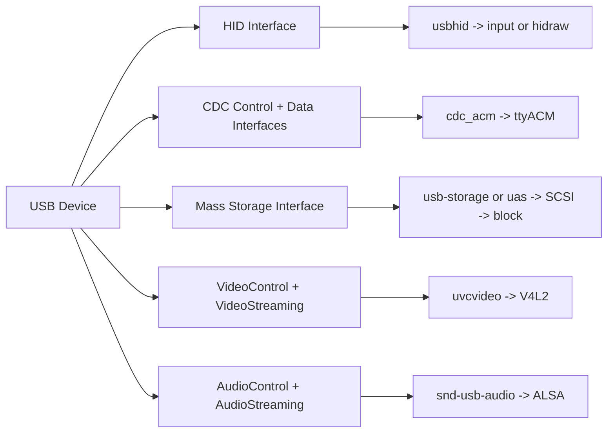
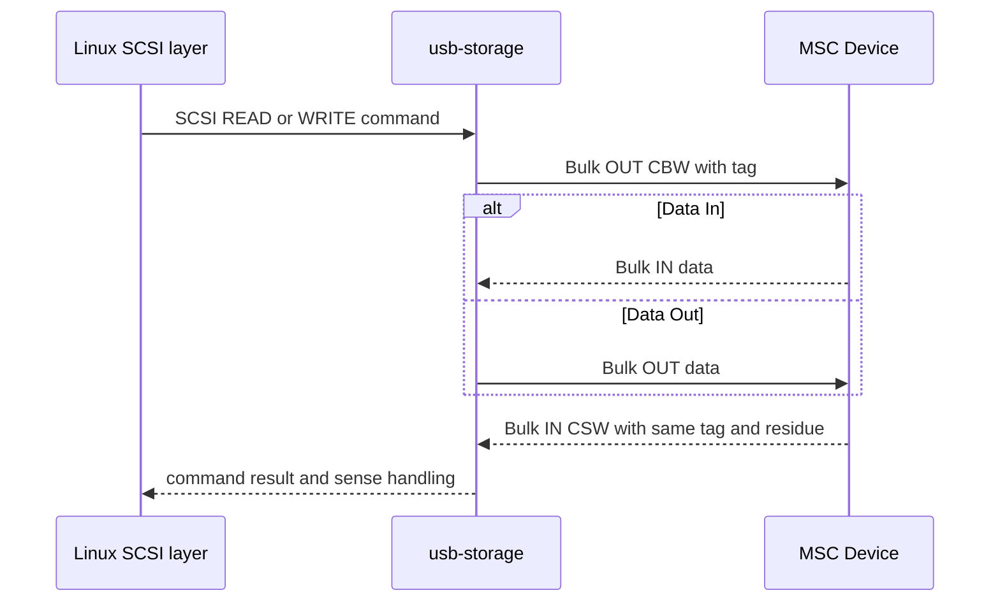
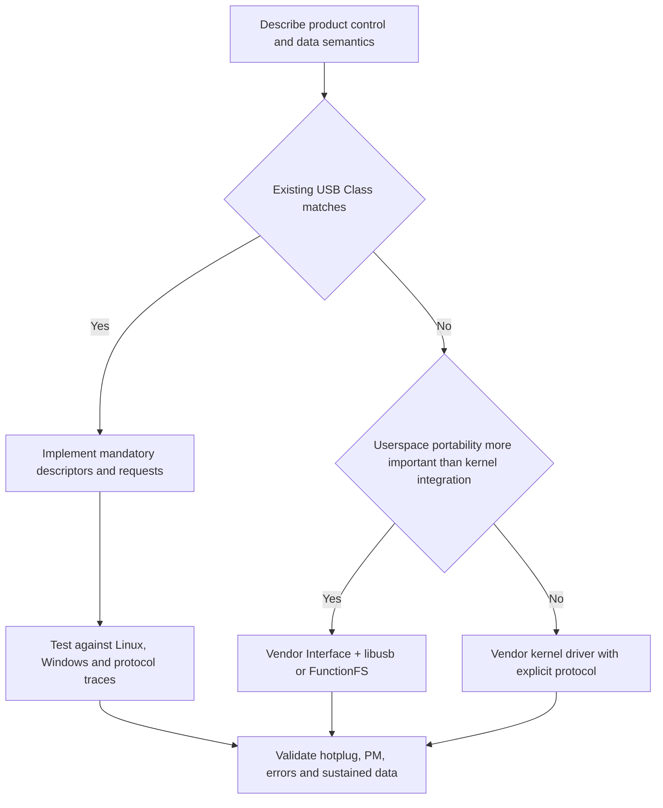

同一套 USB 总线能够承载键盘、串口、磁盘、摄像头和声卡，是因为 USB-IF 为常见功能定义了 Class 规范。Class 规范不仅分配 `bInterfaceClass`，还规定描述符、控制请求、数据格式、Endpoint 组合和错误恢复。

Linux Class Driver 的价值是把这些通用协议映射为成熟子系统：HID 进入 input/hidraw，CDC ACM 进入 TTY，Mass Storage 进入 SCSI/block，UVC 进入 V4L2，UAC 进入 ALSA。理解 Class 时不能只看 `/dev` 节点，要沿控制面和数据面同时追踪。

## 一、所有 Class 都回答同一组问题

分析一个 Class 可以固定问五个问题：

1. 功能由哪些 Interface/IAD/Alternate 组成？
2. 标准或 Class-specific Descriptor 描述了什么能力？
3. Host 用哪些 Control Request 协商状态？
4. 业务数据走哪些 Endpoint，消息边界如何确定？
5. Linux 由哪个驱动绑定，最终发布什么用户 API？

Class code相同不代表实现一定兼容。subclass/protocol、Class version、mandatory descriptor、quirk 和设备固件质量都会影响绑定。Linux Class Driver 在匹配后仍会解析并验证协议结构。

## 二、HID：Report Descriptor 定义每一位数据的含义

Human Interface Device 适合低延迟、小数据量的人机输入和控制。HID Interface 通常包含一个 Interrupt IN Endpoint，可选 Interrupt OUT；但真正定义 payload 语义的是 Report Descriptor，而不是 Endpoint Descriptor。

HID Descriptor 位于 Interface 后，声明 HID 版本和 Report Descriptor 长度。Host 再用 `GET_DESCRIPTOR(Report)` 控制请求读取 Report Descriptor。它由 Item 组成：Usage Page/Usage 定义语义，Logical Min/Max 定义数值范围，Report Size/Count 定义位布局，Input/Output/Feature 定义报告方向。

一个鼠标报告可能是：Report ID 1，3 个 button bit，5 bit padding，随后 X/Y 各 8 bit。Host 不能把三个字节固定解释为鼠标；必须执行 Report Descriptor 才知道字段位置、符号和单位。

HID 有三类报告：Input 由 Device 上报，Output 由 Host 发送，例如键盘 LED，Feature 用于非周期配置。报告可以走 Interrupt Endpoint，也可通过 EP0 的 `GET_REPORT/SET_REPORT`。`SET_IDLE` 控制重复上报策略，`SET_PROTOCOL` 在 Boot/Report Protocol 间切换。

Linux `usbhid` 解析 Report Descriptor，创建 HID device，再由 HID parser/driver 映射 input event。`/dev/hidrawN` 保留原始 report，适合用户态私有协议。排错时比较 `usbhid` 解析日志、`hid-recorder` 原始 report 和 input event：原始字节正确但 key code 错，通常是 Report Descriptor usage/bit layout 问题。

## 三、Mass Storage：Bulk 之上仍有命令和状态协议

USB Mass Storage 并不是“向 Bulk OUT 写扇区”。最常见的 Bulk-Only Transport，简称 BOT，在两个 Bulk Endpoint 上封装 SCSI command。

一次 BOT 命令由三个阶段组成：

1. Host 发送 31 字节 Command Block Wrapper（CBW），包含 signature、tag、期望传输长度、方向和 SCSI CDB。
2. 按命令方向执行可选 Data IN/OUT。
3. Device 返回 13 字节 Command Status Wrapper（CSW），包含相同 tag、residue 和 status。

CBW/CSW signature、tag 和 residue 必须校验。Data 阶段 short packet 不等于命令成功，最终以 CSW 和必要的 REQUEST SENSE 为准。Phase Error 或 Endpoint stall 需要按 BOT reset recovery：发送 Mass Storage Reset、清除两个 Bulk Endpoint halt，再恢复命令队列。

Linux `usb-storage` 将 BOT 适配到 SCSI mid-layer，最终出现 `/dev/sdX`。UAS（USB Attached SCSI）使用 USB 3.x stream 和多个 Endpoint/command IU，支持多个并发命令，Linux 由 `uas` 驱动绑定。设备若 UAS 固件有问题，可能通过 quirk 退回 BOT。

排错要分层：USB Bulk 是否完成、BOT tag/CSW 是否匹配、SCSI sense 是什么、block layer 是否重试。只看 `dd` 失败无法定位是链路、传输还是介质错误。

## 四、CDC ACM：控制 Interface 与数据 Interface 共同组成串口

Communication Device Class 覆盖多种通信模型。Abstract Control Model（ACM）是常见 USB 虚拟串口。它通常由 IAD 包含两个 Interface：Communication Interface 处理控制和通知，Data Interface 使用 Bulk IN/OUT 传输字节流。

Communication Interface 的 Functional Descriptor 至少包括 Header、ACM、Union，可能还有 Call Management。Union Functional Descriptor 指明 master Communication Interface 和 slave Data Interface。编号错误会让 Device 完成通用枚举，却无法被 `cdc_acm` 正确组合。

Host 通过 Class request 设置串口抽象状态：

- `SET_LINE_CODING`：baud rate、stop bit、parity、data bits。
- `GET_LINE_CODING`：读取当前设置。
- `SET_CONTROL_LINE_STATE`：DTR/RTS。
- `SEND_BREAK`：发送 break 语义。

这些参数对纯 USB 固件可能只是上层提示，不一定改变真实 UART；若设备内部桥接 UART，固件应明确支持范围和错误策略。

Data Interface 的 Bulk Endpoint 提供字节流，Communication Interface 的 Interrupt IN 可发送 `SERIAL_STATE` 通知，例如 carrier、break、overrun。Linux `cdc_acm` 绑定后创建 `/dev/ttyACM*`，TTY line discipline 再提供 termios、阻塞 I/O 和 poll。

“能看到 ttyACM 但收不到数据”需要同时检查：Host 是否选择正确 Data Alternate、OUT request 是否排队、Bulk IN 是否有数据、DTR 是否影响 Device 发送、ZLP/short 是否符合协议。仅重复打开串口无法证明哪一层失效。

## 五、UVC：控制面先协商格式，数据面再选择带宽

USB Video Class 通常包含 VideoControl（VC）和 VideoStreaming（VS）Interface。VC 描述 Camera Terminal、Processing Unit、Extension Unit 和 Output Terminal 的实体图；VS 描述 Format、Frame、Endpoint 和 Alternate Setting。

应用选择像素格式、分辨率和帧率时，`uvcvideo` 不会立即启动 Isochronous URB。它先通过 VS Probe/Commit 控制流程协商 `dwFrameInterval`、最大 video frame size、最大 payload transfer size 等参数：

1. Host 提交 Probe 候选。
2. Device 返回实际可支持值。
3. Host 检查并发送 Commit。
4. 驱动选择能容纳 payload 的 Alternate Setting。
5. 提交多个 Isochronous 或 Bulk URB，开始流。

UVC payload 不是一整个图像。每个 USB packet 前有 UVC payload header，包含 frame ID、end-of-frame、error、PTS/SCR 等 flag。驱动按 FID/EOF 组装 frame，并将时间戳和错误交给 V4L2 buffer。

Linux `uvcvideo` 创建 `/dev/videoX` 和 media entities。`v4l2-ctl --list-formats-ext` 展示描述符解析出的格式；`--stream-mmap` 进入真实流路径。能列出格式却 stream `-ENOSPC`，多半是周期带宽或 Alternate 选择；能收到 URB 但 frame 破碎，则检查 payload header、packet status 和 Device frame boundary。

## 六、UAC：时钟和同步决定音频是否长期稳定

USB Audio Class 同样分 AudioControl 与 AudioStreaming。AudioControl 描述 Clock Source、Input/Output Terminal、Feature Unit 等实体；AudioStreaming Alternate 描述 channel、sample format、sample rate 能力和 Isochronous Endpoint。

音频难点不是“每 packet 放多少 sample”，而是 Host clock 与 Device audio clock 不完全相同。同步类型决定如何消化频差：

- Synchronous Endpoint 直接跟随 USB SOF 时钟。
- Adaptive Endpoint 调整 Device 采样过程以适应 Host 数据率。
- Asynchronous Endpoint 由 Device 自己的稳定 clock 产生/消费 sample，并通过 feedback endpoint 告诉 Host 下一周期应发送多少数据。

feedback endpoint 返回的不是简单整数 sample count，而是带小数的固定点速率编码，具体格式随 USB 速度/Class 版本变化。Host 根据 feedback 平滑调整 packet sample 数。feedback 抖动、单位错误或符号溢出会导致长期 underrun/overrun，即使短时间播放正常。

Linux `snd-usb-audio` 把 descriptor entity 和 streaming endpoint 映射到 ALSA card/PCM/control。`aplay -l` 只证明设备和 PCM 已注册；`aplay --dump-hw-params`、`/proc/asound/cardX/stream0` 和 xrun 计数才能证明格式、Alternate 和同步长期有效。

UAC 排错同时观察 USB packet status、feedback、ALSA hw_ptr/appl_ptr 和 codec/I2S clock。音频失真并不总在 USB 层，也可能是 Device 侧 sample format、channel interleave 或时钟树配置。

## 七、Class 选择与分层验证

能使用标准 Class 时，应优先复用标准 Host 驱动和用户 API；但前提是产品语义真的符合规范。为了“免驱”把私有高速协议伪装成 HID，会受 report size、轮询和语义限制；把消息协议伪装成 CDC 字节流，则要自行处理 framing、重连和流控。

验证任何 Class 都应保留四层证据：描述符树是否正确、控制请求是否完成、数据 Endpoint 是否按协议传输、Linux 子系统状态是否推进。Class Driver 绑定成功只是第二层与第三层之间的入口，不是最终验收。

**参考资料**

- [USB-IF Defined Class Codes](https://www.usb.org/defined-class-codes)
- [The Linux-USB Host Side API](https://docs.kernel.org/driver-api/usb/usb.html)
- [USB 2.0 Specification - USB-IF](https://www.usb.org/document-library/usb-20-specification)

## 八、小结

HID、CDC ACM、MSC、UVC 和 UAC 共用 USB Interface/Endpoint 框架，但各自通过 Class Descriptor 和 Control Request 定义业务协议。HID 的核心是 Report Descriptor，MSC 是 CBW/Data/CSW 或 UAS 命令队列，CDC ACM 是控制与数据 Interface 配对，UVC 是 Probe/Commit 后的帧 payload，UAC 则依赖 clock 与 feedback 长期同步。

读 Class Driver 时始终把描述符、控制面、数据面和 Linux 用户 API 放在一起。下一篇将沿这四层建立统一故障证据链。
