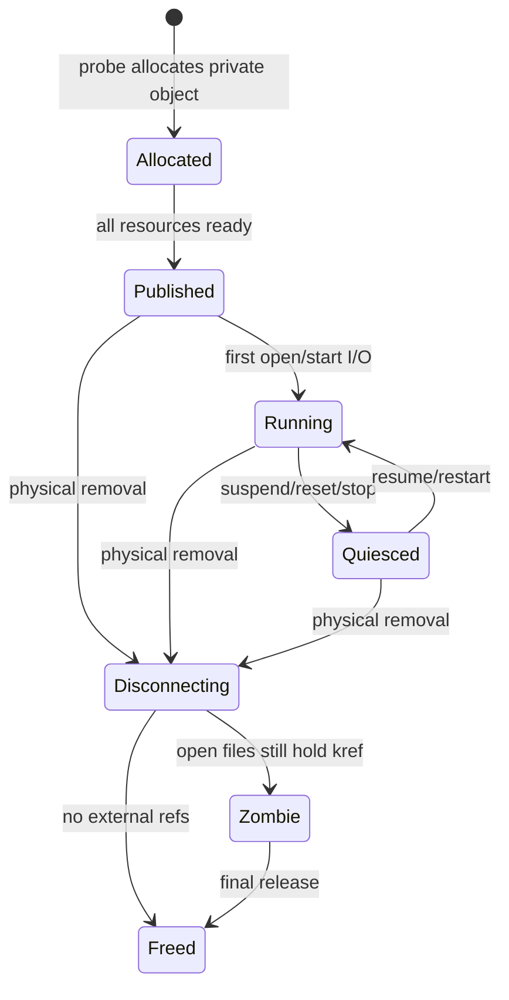
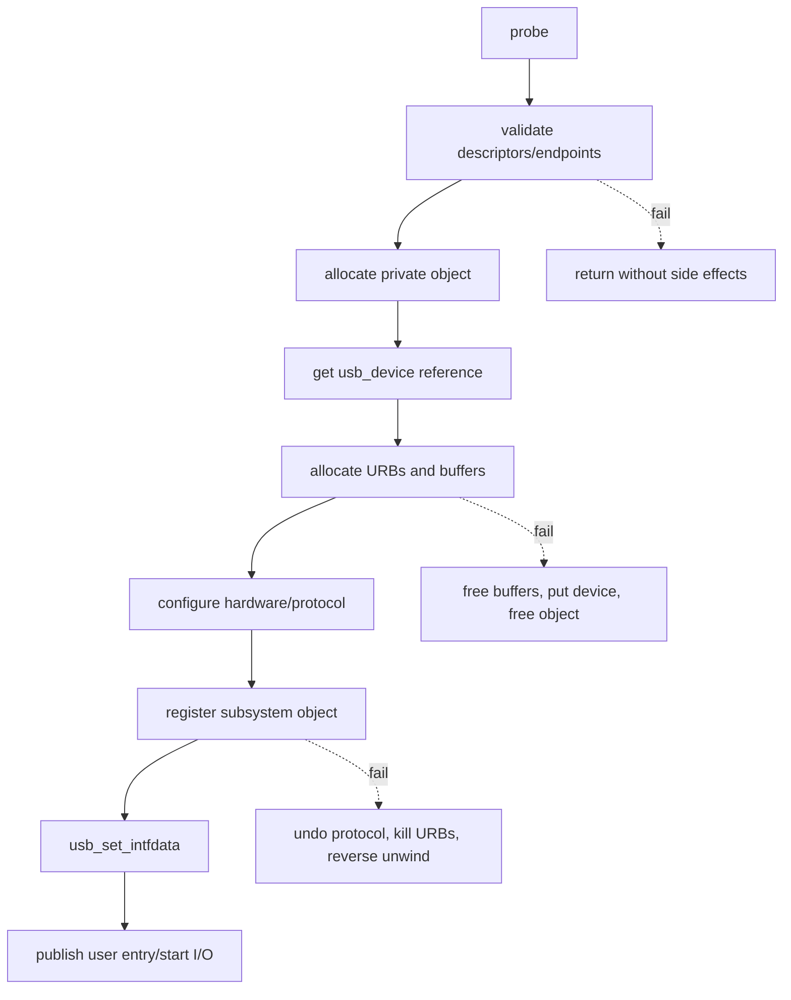
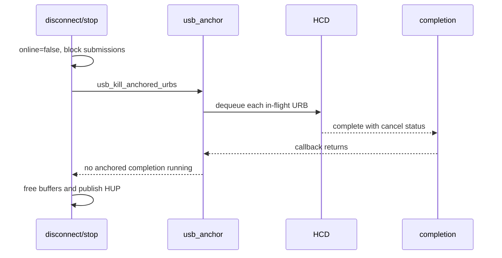
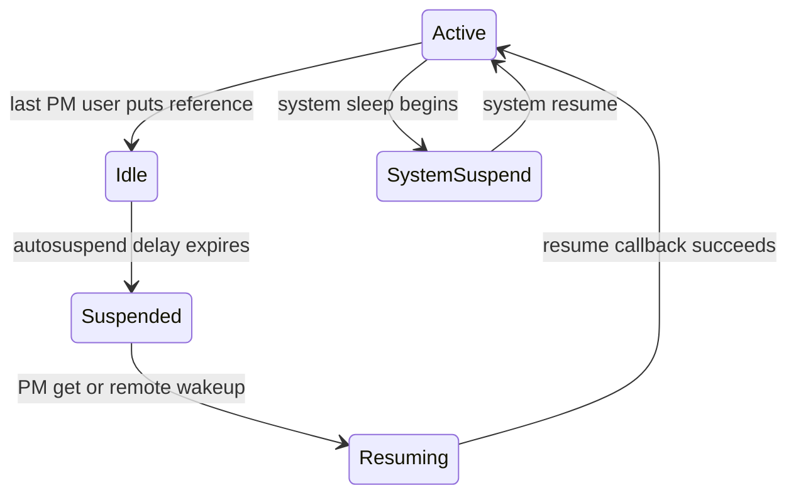
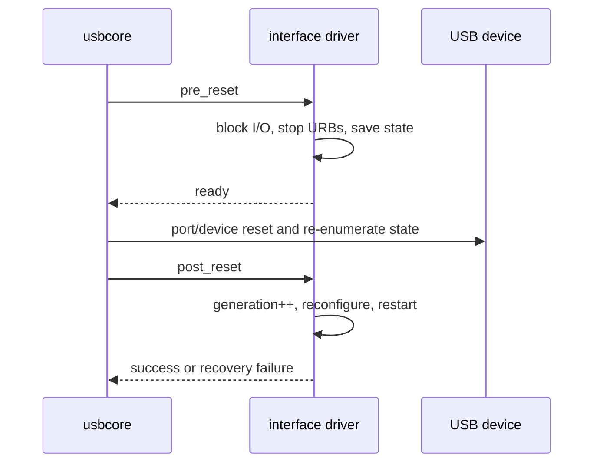

USB 驱动能在设备插入时工作，并不代表它能正确处理拔出、挂起和复位。

真正的生命周期会同时出现四条时间线：

- usbcore 对 Interface 的绑定与解绑。
- 用户空间对字符设备或子系统节点的 open/close。
- URB completion、workqueue、timer 等异步执行。
- runtime PM、system suspend 与 reset 回调。

任何一条时间线都可能在另三条尚未结束时到来。

本文以 Linux 6.12 为基线，给出一套能逐项审计的 Interface Driver 生命周期模型。

## 一、先定义五个不同的状态事实

可靠驱动至少要区分：

1. Interface 是否仍绑定当前 driver。
2. 物理设备是否在线。
3. 用户接口是否仍允许新 open。
4. 数据队列是否处于 running。
5. 私有对象内存是否仍被引用。

这五项不能压成一个 `bool connected`。



`Zombie` 在这里不是内核通用状态名，而是帮助理解的私有对象阶段：

Interface 已解绑、硬件不能访问，但 open file 仍需要对象返回 `-ENODEV`、`POLLHUP` 并安全 close。

## 二、匹配只证明 ID 表接受该 Interface

驱动核心根据 `usb_device_id` 与 Interface/Device 描述信息执行匹配。

匹配成功只代表“值得调用 probe”。

它不证明：

- 设备私有描述符版本受支持。
- 必需 Endpoint 都存在。
- Alternate Setting 能成功切换。
- 内存可以分配。
- 用户子系统注册会成功。

因此 `probe()` 必须完整验证运行前提。

不要因为 ID 表按 VID/PID 匹配，就跳过 Interface Class、协议版本和端点布局检查。

同一 VID/PID 的固件不同版本可能使用不同数据协议。

## 三、probe 的目标是建立一个可发布的完整对象

一个典型私有对象：

```c
struct usb_demo {
    struct usb_device *udev;
    struct usb_interface *intf;
    struct kref kref;
    struct mutex io_lock;
    spinlock_t state_lock;
    wait_queue_head_t read_wait;
    struct usb_anchor submitted;
    struct work_struct recovery_work;
    bool online;
    bool running;
    bool suspended;
    unsigned int generation;
};
```

字段的保护规则必须写清：

- `io_lock` 保护可睡眠管理路径与用户 I/O 序列化。
- `state_lock` 保护 completion 可访问的短状态。
- `kref` 保护私有对象内存。
- `online` 表示物理 I/O 是否允许。
- `generation` 区分 reset 前后的旧 completion。

锁的存在不等于规则成立。

必须明确每个字段由哪个锁保护，以及哪些回调根本不能取得 mutex。

## 四、probe 资源获取顺序决定错误回滚顺序

推荐按依赖关系获取：

1. 校验 Interface/Alternate Setting。
2. 发现并验证 Endpoint。
3. 分配私有对象。
4. 取得 `usb_device` 引用。
5. 初始化锁、wait queue、anchor、work 和 kref。
6. 分配缓冲与 URB。
7. 设置设备私有协议状态。
8. 注册 Input/TTY/字符设备等子系统对象。
9. `usb_set_intfdata()` 关联 Interface。
10. 最后发布用户可见入口或启动 I/O。



每个失败标签只撤销此前已成功的步骤。

不要让多个标签重复释放同一对象。

managed API 可以简化部分 probe 失败与解绑清理，但它不会自动解决 open file、异步 URB 和用户节点发布竞态。

## 五、发布点必须晚于对象完整初始化

一旦字符节点、Input Device 或网络接口对用户可见，open 或数据路径可能立刻并发进入。

因此发布之前必须满足：

- 私有指针可安全取得。
- 所有锁和队列已初始化。
- offline/running 初值正确。
- 失败回滚不会与新入口并发。
- 必需 URB 和缓冲已经就绪。

以字符驱动为例，`usb_register_dev()` 成功后设备节点可能被 udev 创建并立即打开。

如果代码在注册后才初始化 `kref` 或 wait queue，就存在真实竞态。

反向拆卸时先撤销用户入口，再停止硬件 I/O。

这样可以阻止新 open，同时让已经 open 的文件走 offline 处理。

## 六、usb_set_intfdata 何时写入和清空

常见做法是在私有对象基本完成后调用：

```c
usb_set_intfdata(intf, d);
```

如果后续发布步骤仍可能失败，失败路径必须清空它。

disconnect 开头通常：

```c
struct usb_demo *d = usb_get_intfdata(intf);

usb_set_intfdata(intf, NULL);
if (!d)
    return;
```

清空不能代替引用计数。

其他路径可能已在清空前取得 `d`。

它们必须持有明确引用或受更高层同步保证。

管理 sysfs 回调、reset 回调和 disconnect 的并发时，要了解设备核心对回调序列化提供了什么，不要自行假定所有回调绝不重叠。

## 七、open 文件句柄建立第二条生命周期

字符设备 open 通常通过 minor 找到 Interface，再取得私有对象引用。

一个安全顺序：

1. 找到 Interface。
2. `usb_get_intfdata()` 取得私有对象。
3. 在锁内检查 online 与发布状态。
4. `kref_get()`。
5. 需要时取得 runtime PM 引用。
6. 把私有对象保存到 `file->private_data`。

open 与 disconnect 可能并发。

如果 disconnect 已撤销节点但 open 正在进行，锁和 online 检查必须让 open 明确成功或失败，不能得到半拆对象。

release 负责：

- 停止该 file 专属 I/O。
- 释放 runtime PM 引用。
- 从订阅/队列移除。
- `kref_put()`。

最后一个 file release 可能发生在物理拔出几分钟后。

## 八、kref 保护内存，不保护硬件

`kref` 的唯一承诺是：引用非零时私有对象内存不被最终释放。

它不保证：

- `usb_interface` 仍绑定。
- Endpoint 仍启用。
- HCD 仍接受提交。
- 设备仍有电。

因此 I/O 入口的检查通常是：

```c
mutex_lock(&d->io_lock);
if (!d->online) {
    ret = -ENODEV;
    goto out_unlock;
}
if (d->suspended) {
    ret = -EHOSTUNREACH;
    goto out_unlock;
}
/* submit or perform I/O */
```

实际驱动可以通过 PM helper 自动恢复，而不是直接返回 suspended 错误。

关键是检查语义明确，不把“指针非空”当作在线。

## 九、URB anchor 是批量取消边界

驱动提交的异步 URB 应按功能加入 `usb_anchor`。

```c
usb_anchor_urb(urb, &d->submitted);
ret = usb_submit_urb(urb, GFP_KERNEL);
if (ret)
    usb_unanchor_urb(urb);
```

completion 后 usbcore 会处理已完成 URB 的 anchor 状态，驱动也应按其重提交策略维护归属。

disconnect、suspend 或 reset 前可调用 `usb_kill_anchored_urbs()`。

该函数会取消并同步等待组内 URB completion 结束。



必须先阻止 completion 重提交，再 kill。

否则 completion 可能在 kill 过程中把 URB 再次加入队列，形成永远杀不干净的循环。

## 十、设计一个幂等 stop 例程

suspend、pre_reset、disconnect、open 失败和模块退出都可能需要停止 I/O。

把逻辑集中到幂等 stop：

```c
static void demo_stop(struct usb_demo *d)
{
    unsigned long flags;

    spin_lock_irqsave(&d->state_lock, flags);
    if (!d->running) {
        spin_unlock_irqrestore(&d->state_lock, flags);
        return;
    }
    d->running = false;
    d->generation++;
    spin_unlock_irqrestore(&d->state_lock, flags);

    usb_kill_anchored_urbs(&d->submitted);
    cancel_work_sync(&d->recovery_work);
    wake_up_interruptible_all(&d->read_wait);
}
```

真实实现要避免 `cancel_work_sync()` 与 work 自身调用 stop 造成自等待。

幂等意味着重复调用不会双重释放、重复 decrement 或重新唤醒已销毁对象。

## 十一、completion 只能做原子上下文允许的工作

URB completion 通常不能睡眠。

适合执行：

- 读取 `urb->status` 和 `actual_length`。
- 在 spinlock 下更新短状态。
- 将数据放入预分配 ring/FIFO。
- 唤醒 wait queue。
- 在满足状态时用 `GFP_ATOMIC` 重提交。
- 投递 workqueue 处理可睡眠恢复。

不适合执行：

- 取得 mutex。
- `usb_control_msg()`。
- `usb_clear_halt()`。
- 大块 `GFP_KERNEL` 分配。
- 等待另一个 completion。

completion 重提交前必须检查 online、running、suspended 和 generation。

取消类 status 如 `-ENOENT`、`-ECONNRESET`、`-ESHUTDOWN` 不应重提交。

## 十二、Runtime PM 的引用属于活动需求

Runtime PM 允许空闲 Interface autosuspend。

驱动声明 `.supports_autosuspend = 1` 后，需要正确使用 PM 引用。

`usb_autopm_get_interface()` 增加使用计数并在需要时恢复设备。

`usb_autopm_put_interface()` 表示本路径不再要求活动态。

PM 引用不应简单等同 open 次数。

不同设备可选择：

- open 到 release 全程持有 PM 引用。
- 仅在每次 I/O 前后持有。
- 流开始到流停止持有。
- 允许 Interrupt Endpoint 作为远程唤醒源。



策略取决于恢复延迟、设备功耗、协议保持能力和用户体验。

## 十三、suspend 回调必须让数据面静止

`suspend(intf, message)` 可能由 runtime PM 或 system sleep 触发。

驱动需要：

1. 阻止新提交。
2. 记录是 runtime 还是 system suspend。
3. 停止或取消在途 URB。
4. 保存设备私有状态。
5. 配置远程唤醒需求。
6. 保持对象和用户句柄一致。

若仍有不能挂起的活动 I/O，可以返回错误拒绝 runtime suspend。

system suspend 的策略受更高层电源管理约束，不能随意长期拒绝。

回调成功后，completion 不应继续重提交普通数据 URB。

挂起期间 read/poll 的行为要定义：阻塞等待恢复、返回临时错误，或在已有缓存上继续消费。

## 十四、resume 与 reset_resume 的语义不同

普通 `resume()` 假设设备协议状态在挂起后仍可恢复。

`reset_resume()` 表示恢复过程中设备经历 reset，许多私有寄存器和 Endpoint 状态已经丢失。

reset_resume 通常需要执行 probe 后的设备初始化子集：

- 重新选择 Alternate Setting。
- 重发设备私有配置。
- 清理 stale FIFO/sequence。
- 增加 generation。
- 重新提交 URB。

不要直接调用完整 probe。

probe 还负责对象分配与用户接口注册，重复执行会造成双重注册。

应抽取 `demo_hw_init()`、`demo_start_io()` 等职责明确且可重复的函数。

## 十五、pre_reset 与 post_reset 形成复位事务

USB Core 在 reset Interface 相关设备时可调用：

- `pre_reset()`：复位前 quiesce。
- `post_reset()`：复位后重建。

`pre_reset` 应阻止新 I/O、杀死 URB并取得必要序列化。

`post_reset` 重新验证设备状态、重建设定并释放序列化。



若 post_reset 无法恢复，应让用户 I/O 看到明确错误，并考虑让更高层重新绑定或断开设备。

## 十六、disconnect 的正确顺序

disconnect 表示该 Interface 不再可用于新 I/O。

推荐顺序：

1. 从 `usb_interface` 清空私有指针。
2. 撤销用户可见入口，阻止新 open。
3. 在状态锁内设置 `online = false`、`running = false`，增加 generation。
4. 唤醒所有阻塞 read/write/poll。
5. kill anchored URB。
6. 同步取消 work、timer 和 tasklet。
7. 注销仍绑定私有对象的子系统对象。
8. 释放 Interface 生命周期内资源。
9. 丢掉 probe 的 kref。

已 open file 继续持有私有对象。

其后 read/write 返回 `-ENODEV`，poll 返回 `POLLHUP|POLLERR`，release 最终释放。

不要在 disconnect 中等待所有用户进程 close。

恶意或失控进程可以永远不 close，内核解绑不能被它无限阻塞。

## 十七、generation 防止旧完成污染新状态

reset、stop/start 或重新打开后，旧请求可能延迟完成。

仅检查指针和 online 不足以区分它属于哪一轮队列。

可以给队列或请求记录 generation：

```c
struct demo_request {
    struct urb *urb;
    struct usb_demo *owner;
    unsigned int generation;
};
```

提交时复制当前 generation。

completion 若发现不一致，只做释放/回收，不把数据发布给当前队列。

每次 reset、stop 或会使旧请求语义失效的状态切换都递增 generation。

generation 不能替代取消。

它是取消竞态后的最后一道语义隔离。

## 十八、锁顺序必须跨回调统一

驱动常有 mutex、spinlock、PM core 锁、USB device lock 和子系统锁。

应定义全局锁顺序，例如：

```text
user operation mutex
  -> runtime PM get (outside spinlock)
  -> state spinlock for short update
  -> submit URB without holding unrelated locks
```

不要在持 spinlock 时调用可能睡眠的 PM 或 USB 同步 API。

不要在 disconnect 持有一个 completion 需要的锁时调用 `usb_kill_urb()`，否则 kill 等待 completion，completion 等待锁，形成死锁。

正确做法通常是先在锁内设置 stop 状态，释放锁，再同步 kill。

## 十九、错误回滚和 disconnect 不应共享错误假设

probe 失败时用户接口通常尚未完整发布，也没有 open file。

disconnect 时用户入口曾经存在，异步活动和外部引用都可能存在。

可以共享底层 `stop_io()`、`free_urbs()`，但不能把整个 probe error label 当作 disconnect。

两条路径的前置条件不同：

| 路径 | 用户节点 | open file | URB | Interface 关联 |
| --- | --- | --- | --- | --- |
| early probe failure | 未发布 | 不存在 | 可能部分分配 | 可能未设置 |
| late probe failure | 可能短暂发布，应立即撤销 | 理论上可能竞态 | 可能在途 | 可能已设置 |
| disconnect | 曾发布 | 可能存在 | 可能在途 | 已设置，需清空 |

清楚写出前置条件，才能证明每个释放只执行一次。

## 二十、验证生命周期而不是只验证数据正确

建议覆盖以下压力序列：

- open/read 期间反复拔插。
- 多进程同时 open、read、poll、close。
- 在 Bulk/Interrupt 压力下执行 runtime suspend/resume。
- 在 I/O 期间触发 USB reset。
- 模块卸载与设备拔出并发。
- 注入分配失败和 URB submit 失败。
- 设备 STALL/超时后立即拔出。

观察：

- KASAN/KCSAN/lockdep 是否报告问题。
- 所有阻塞线程是否被唤醒。
- disconnect 是否有有界完成时间。
- `/sys/kernel/debug/usb/usbmon` 是否仍出现拔出后的新提交。
- kref、URB 和 workqueue 是否泄漏。

功能测试“收到了正确数据”覆盖不了这些问题。

## 二十一、Linux 6.12 一手资料与源码入口

重点阅读：

- `include/linux/usb.h` 中 `struct usb_driver`。
- `drivers/usb/core/driver.c` 中匹配、probe、unbind 与 PM 包装。
- `drivers/usb/core/urb.c` 中 URB kill/unlink/anchor。
- `drivers/usb/core/message.c` 中 reset 与接口切换。

一手资料：

- [Linux 6.12 Writing USB Device Drivers](https://www.kernel.org/doc/html/v6.12/driver-api/usb/writing_usb_driver.html)
- [Linux USB power management](https://docs.kernel.org/driver-api/usb/power-management.html)
- [Linux stable usbcore driver.c](https://git.kernel.org/pub/scm/linux/kernel/git/stable/linux.git/tree/drivers/usb/core/driver.c?h=linux-6.12.y)
- [USB 2.0 Specification](https://www.usb.org/document-library/usb-20-specification)

## 二十二、小结

USB Interface Driver 的完整生命周期不是 probe/disconnect 两个函数。

匹配只决定是否尝试 probe。

probe 必须按依赖顺序获取资源，并在所有状态完整后才发布用户入口。

open file、URB completion、workqueue 与 PM 回调形成独立时间线。

`kref` 保护私有对象内存，online/running/suspended/generation 表达硬件和队列状态。

disconnect 应先阻止新入口，再标记离线、取消异步活动、唤醒等待者，最后丢掉 probe 引用。

Runtime PM、system suspend、reset_resume、pre_reset 和 post_reset 各有不同恢复合同。

幂等 stop、统一锁顺序、anchor 与 generation 共同解决取消和旧完成竞态。

只要能够逐条证明发布、停止、取消和最终释放顺序，驱动才算真正支持热插拔，而不是只在正常路径上碰巧工作。
