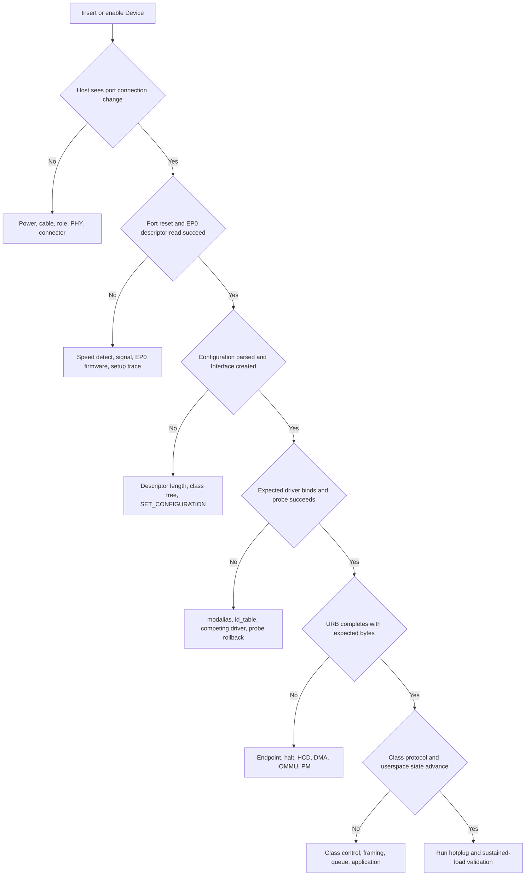
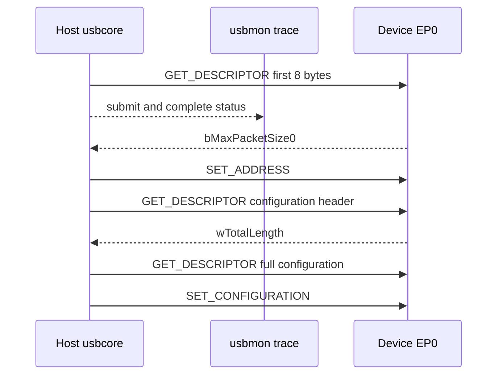

USB 故障难排，不是因为某个 API 隐蔽，而是一次业务操作会跨越多层：连接器与供电、角色和 PHY、Host Controller、EP0、描述符、Interface Driver、URB、Class 协议、用户 API。跳过前层直接修改后层，只会让现象变化，不能证明根因。

本篇不罗列“试试换线、重载驱动”之类经验，而是为每一层定义入口证据、检查手段、可能结果和进入下一层的条件。

## 一、先冻结环境并建立故障证据树

在比较之前记录：Host 硬件、内核版本、Device 固件、端口/Hub、线缆、供电方式、目标速度、是否经过 Type-C/role switch、复现步骤和最后一个正常版本。否则两次实验可能根本不是同一系统。



每个菱形都是停止点。没有连接变化时，不应检查 `id_table`；Device Descriptor 读取失败时，不应修改 UVC 应用；URB 已正确完成而应用无数据时，才进入 Class/用户态。

日志要带时间关联。保存 `dmesg -w`、usbmon、应用日志和必要的示波/协议分析结果，使用同一复现时间窗对齐，而不是从长日志中挑几个看似相关的错误。

## 二、第一层：供电、角色、连接器和 PHY

插入 Device 后完全没有日志，先判断 VBUS 和角色。Host port 应提供规范允许的 VBUS，Device 应在检测到 VBUS 后连接 pull-up/termination。Dual-role Type-C 端口还需要 CC/TCPC 正确确定 Data Role；`dr_mode = "host"`、`"peripheral"` 或 `"otg"` 必须与硬件和 role switch 一致。

检查项包括：

- VBUS 电压、限流开关、过流信号和 regulator enable。
- D+/D- 或 SuperSpeed lane 是否接反、短路、ESD 器件/共模电感是否适配。
- Device pull-up/termination 是否在正确时机出现。
- PHY reference clock、reset、power domain 和 calibration 是否完成。
- Type-C CC 方向与 mux 是否把 SuperSpeed lane 接到当前插入方向。

USB 2.0 设备被识别成错误速度，会在最早 packet 就出现错误。High-Speed chirp/handshake 失败可能退回 Full-Speed；SuperSpeed link 失败则可能只剩 USB 2.0 companion device。`lsusb -t` 的速度是重要证据，不能只看连接器标有“USB 3.0”。

反复 connect/disconnect 可能是 VBUS 压降、接触不良、PHY margin、Device watchdog reset 或 Host 主动 reset。观察端口状态和 Device reset pin/电源，区分物理断开与协议层 reset。

## 三、第二层：EP0、枚举和描述符

出现连接日志但没有 VID/PID，问题集中在 port reset、地址 0 和 EP0。使用 usbmon/Wireshark 查看 Setup packet：Host 是否发 `GET_DESCRIPTOR(Device)`，Device 是否返回 8 字节，`bMaxPacketSize0` 是否合理，随后 `SET_ADDRESS` 和完整配置读取是否发生。

错误码要结合请求阶段：

- `-EPROTO` / `-EILSEQ`：协议/CRC/bitstuff/handshake 异常，可能来自信号、错误速度或 Device EP0 状态机。
- `-ETIMEDOUT`：请求长期没有完成，需要判断 Device 是持续 NAK、完全无响应还是 HCD 停止。
- `-EPIPE`：Device stall，标准请求不受支持或状态机错误。
- `device descriptor read/64, error -71`：通常仍早于 Interface Driver。

Configuration 能读取但解析失败，检查每条 `bLength`、`wTotalLength`、Interface/Endpoint 数、Alternate 和 companion。用 `lsusb -v` 解码后仍应回看原始字节，因为工具可能在损坏边界后停止。



usbmon 中 submit 有但 complete 没有，说明请求仍未返回；complete 有负 status，按错误分类；complete 为 0 但长度/数据错误，则进入 Device 固件和描述符内容。

## 四、第三层：驱动绑定、URB 和 Class 协议

Interface 已创建后，用 `lsusb -t`、sysfs `modalias` 和 driver symlink 判断绑定：

```bash
lsusb -t
cat /sys/bus/usb/devices/1-1:1.0/modalias
readlink /sys/bus/usb/devices/1-1:1.0/driver
```

没有绑定时检查 ID 表、module alias、driver_override、黑名单和竞争驱动。手工 unbind/bind 只能用于验证匹配，不应作为产品启动流程。`probe()` 被调用但返回失败，必须保留第一处错误码；后续“设备节点不存在”只是结果。

进入 URB 层后记录 Endpoint 地址、pipe、length、status、actual_length、提交/完成时间和 in-flight。`usb_submit_urb()` 返回 0 只表示排队成功。Bulk IN 长期 NAK 可能是 Device 尚未收到启动命令；`-EPIPE` 可能是协议状态不允许当前操作；short packet 可能是合法消息边界。

Class 层需要专用证据：

- HID：Report Descriptor 与原始 report 是否一致。
- CDC ACM：DTR/RTS、line coding、Data Interface Bulk Endpoint 和 SerialState。
- MSC：CBW/CSW tag、residue、status 与 SCSI sense。
- UVC：Probe/Commit、Alternate、UVC payload FID/EOF、Iso packet status。
- UAC：Clock/format/Alternate、feedback endpoint 和 ALSA xrun。

用户 API 也可能形成背压。V4L2 应用未及时 queue buffer、ALSA hw params 不匹配、TTY line discipline 或自定义 read FIFO 满，都能使 USB 层看似“没有新数据”。因此 URB 已完成后要继续检查数据是否被上层消费。

## 五、第四层：HCD DMA、IOMMU、cache 与电源管理

Interface Driver 的 URB 会被 HCD 转换为控制器描述符并通过 DMA 访问内存。IOMMU fault 中的 requester/IOVA 可证明控制器访问了未映射地址，常见根因包括 transfer buffer 已释放、长度越界、控制器 reset 后继续使用旧 ring 或 DMA mask/映射错误。

在非 coherent 架构中，HCD 和 DMA API 负责 cache ownership。厂商 HCD 若漏做 sync，可能只在压力下出现旧数据或 descriptor 未更新。不要在 Interface Driver 中随意 `dma_sync_*` 修补 HCD bug；先确认 buffer API 和 ownership 边界。

dynamic_debug 和 tracepoint 可以建立软件时间线：

```bash
echo 'file drivers/usb/core/* +p' | \
  sudo tee /sys/kernel/debug/dynamic_debug/control
sudo trace-cmd record -e usb -e irq -e workqueue sleep 10
```

KASAN 发现 use-after-free/越界，lockdep 发现锁顺序，kmemleak 辅助发现泄漏。它们与 usbmon 互补：usbmon 证明总线请求，sanitizer 证明内核内存/并发错误。

runtime autosuspend 会让“设备仍插着但暂时不可访问”成为正常状态。低负载偶发首包超时，应记录 runtime status、autosuspend delay、suspend/resume callback 和远程唤醒，而不是永久关闭 PM 后宣称问题解决。

热插拔/复位压力是独立场景。disconnect 必须阻止 resubmit、kill URB、取消 work/timer，并让 open file 安全失败。只有正常数据流压力不能覆盖 teardown 竞态。

## 六、工具分别能证明什么

| 工具 | 主要证据 | 不能单独证明 |
| --- | --- | --- |
| `dmesg` | 内核阶段、错误码、bind/reset | 线上的精确 packet |
| `lsusb -v/-t` | 描述符解析、拓扑、速度、driver | 运行时每次 transfer |
| usbmon | URB submit/complete、Setup、长度/status | PHY 波形与 Device 内部状态 |
| Wireshark | 协议字段、Class transaction 解码 | 内核锁和对象寿命 |
| dynamic_debug/tracepoint | 内核调用和时间线 | 电气质量 |
| KASAN/lockdep | 内存安全与锁问题 | USB 协议正确性 |
| IOMMU fault | DMA 地址、方向、requester | 上层协议是否正确 |
| 协议分析仪 | 总线 packet、时序、握手 | Linux 内部软件状态 |
| 示波器 | 电压、眼图、reset/clock | 描述符与驱动绑定 |

协议分析仪成本较高，适合 Host 与 Device 软件证据矛盾、需要看到重试/握手/时序或 SuperSpeed training 的情况。使用前先通过 usbmon 确认问题确实在 Host 软件证据之外。

## 七、三个典型问题的闭环推导

**设备只能 Full-Speed。** 先确认 Device Descriptor 与 Endpoint 是否只支持 FS，再检查 High-Speed chirp、PHY mode 和线材。若同一硬件在另一 Host 为 High-Speed，比较 Host PHY/port；若所有 Host 都为 FS，检查 Device PHY/固件。不要用 Bulk 吞吐反推速度，直接看拓扑和握手证据。

**UVC 能列格式但开流失败。** 枚举和描述符层已基本通过，继续看 Probe/Commit 返回、所选 Alternate、`usb_set_interface()` 是否 `-ENOSPC`、Iso URB status 和 payload header。若 URB 完成但无 frame，检查 FID/EOF 和 V4L2 buffer；若 URB 不完成，回到 Endpoint/HCD。

**压力下拔出偶发崩溃。** 记录 disconnect、URB completion、work/timer 和 file release 顺序，启用 KASAN。确认 disconnect 先置 disconnected 再阻止新提交，`usb_kill_anchored_urbs()` 后才释放 buffer，私有对象由 kref 延迟。单纯增加 sleep 只改变竞态概率。

**参考资料**

- [The Linux-USB Host Side API](https://docs.kernel.org/driver-api/usb/usb.html)
- [Linux USB Power Management](https://docs.kernel.org/driver-api/usb/power-management.html)
- [USB 2.0 Specification - USB-IF](https://www.usb.org/document-library/usb-20-specification)

## 八、小结

USB 排错的核心是证据分层：先证明连接和角色，再证明 EP0 与描述符，再证明 Interface 绑定、URB、Class 协议和用户消费，最后处理 PM、热插拔和持续压力。每种工具只覆盖部分边界，错误码也必须放回请求阶段解释。

下一篇将把 Host 侧最底层展开，从 VBUS、PHY、设备树、Host Controller IP 和 HCD 一路走到 root hub。
