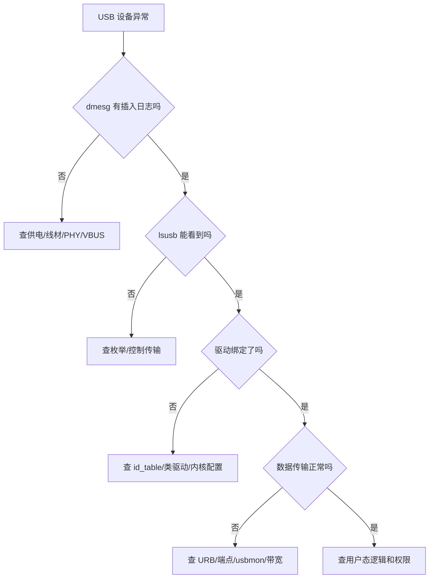

USB 设备插上没反应、枚举到一半失败、驱动不绑定、bulk 传输超时、摄像头掉帧，这些问题在嵌入式 Linux 工程里非常常见。

这一篇专门讲 USB 问题排查。目标不是罗列命令，而是建立一套从硬件到内核、从枚举到传输、从驱动到用户态的系统排查路径。

## 一、USB 排查要先分层

USB 问题不能一上来就怀疑驱动代码。正确的分层应该是：

1. 供电和线材
2. 控制器和 PHY
3. 设备枚举
4. 描述符解析
5. 驱动匹配
6. 数据传输
7. 用户态访问

每一层都有自己的现象和工具。

## 二、第一层：供电和线材

最基础也最容易被忽略。

常见问题：

- 线只支持充电，不支持数据
- OTG 线方向不匹配
- 设备电流不足
- Hub 供电不稳
- 板级 VBUS 没打开

现象通常是：

- `dmesg` 完全没有新日志
- 设备灯亮但无法识别
- 插拔时偶尔识别、偶尔失败

## 三、第二层：控制器和 PHY

在嵌入式 SoC 上，USB 不只是一个口，还涉及控制器、PHY、时钟、复位、模式选择和设备树。

需要检查：

- Host / Device 模式是否正确
- PHY 是否上电
- clock/reset 是否配置
- VBUS GPIO 是否有效
- dr_mode 是否正确

常见设备树字段包括：

```dts
&usbdrd3_0 {
    status = "okay";
    dr_mode = "host";
};

&usbdrd_dwc3_0 {
    status = "okay";
};
```

不同平台字段不同，但思路相同：先让控制器和 PHY 正常工作。

## 四、第三层：枚举是否成功

执行：

```bash
dmesg -w
lsusb
lsusb -t
```

如果设备能被 `lsusb` 看到，说明至少枚举到了基本设备层。如果看不到，就要回到供电、线材、PHY、控制器层面排查。

## 五、第四层：描述符是否正常

执行：

```bash
lsusb -v -d xxxx:yyyy
```

重点看：

- Device Descriptor 是否完整
- Configuration Descriptor 是否能读出
- Interface 是否符合预期
- Endpoint 方向和类型是否正确

如果描述符读到一半失败，可能是设备固件、线材、信号质量或控制传输异常。

## 六、第五层：驱动是否绑定

执行：

```bash
usb-devices
lsusb -t
```

重点看 Driver 字段。

如果设备枚举成功但驱动没绑定，可能原因是：

- VID/PID 不在驱动 id_table 中
- 类信息不符合通用类驱动
- 设备被其他驱动抢占
- 内核没有开启对应驱动配置

## 七、第六层：数据传输异常

常见现象：

- bulk 超时
- interrupt 没数据
- isochronous 掉帧
- URB status 报错

排查方法：

```bash
cat /sys/kernel/debug/usb/devices
modprobe usbmon
cat /sys/kernel/debug/usb/usbmon/0u
```

如果需要图形化分析，也可以结合 Wireshark 抓 usbmon。

## 八、URB 状态怎么看

驱动里一定要打印关键错误码。常见状态包括：

- `-ENOENT`：URB 被取消
- `-ECONNRESET`：URB 被 unlink
- `-ESHUTDOWN`：设备断开或控制器关闭
- `-ETIMEDOUT`：传输超时
- `-EPIPE`：端点 stall

不要把所有失败都简单打印成“transfer failed”，否则现场无法定位。

## 九、端点 stall 怎么处理

如果端点进入 stall，可能需要清除 halt：

```c
usb_clear_halt(udev, pipe);
```

但这不是万能药。你要先判断 stall 是协议错误、数据格式错误，还是设备固件异常导致的。

## 十、摄像头类设备掉帧怎么查

USB 摄像头常见问题是带宽和实时性。

重点检查：

- 分辨率和帧率是否过高
- USB 速率是否达到 high-speed/super-speed
- 是否经过低质量 Hub
- isochronous 包是否持续失败
- 用户态读取是否太慢

工具：

```bash
v4l2-ctl --list-formats-ext
v4l2-ctl --stream-mmap --stream-count=100 -d /dev/video0
```

## 十一、一个系统化排查流程



## 十二、常用命令清单

```bash
dmesg -w
lsusb
lsusb -v
lsusb -t
usb-devices
cat /sys/kernel/debug/usb/devices
modprobe usbmon
cat /sys/kernel/debug/usb/usbmon/0u
```

## 十三、工程排错建议

### 1. 先确认设备有没有被系统看见

没有枚举，就不要先改应用层。

### 2. 先看描述符，再看驱动

描述符异常，驱动很可能根本不会绑定。

### 3. 传输异常要看 URB 状态

不要只看应用层超时。

### 4. 嵌入式板子一定要查设备树和 PHY

PC 上正常，不代表板子上一定正常。

## 十四、验证清单

- 插拔有内核日志
- `lsusb` 能看到设备
- `lsusb -v` 能完整读取描述符
- `lsusb -t` 能看到驱动绑定
- URB 错误码明确
- 长时间传输无异常
- 拔出设备系统不崩溃

## 十五、小结

USB 排查的关键不是背命令，而是分层定位。供电、PHY、枚举、描述符、驱动、URB、用户态，每一层都有对应现象。

只要按照层次一步步查，USB 问题就不会变成“玄学插拔”。

> 🏷️ USB调试 / 枚举失败 / usbmon / URB / 描述符 / Linux驱动

---

## 初学者扩展讲解


## USB 故障要分层定位

USB 故障不要直接归结为“驱动问题”。第一类是物理和电气问题，例如线材质量、供电不足、VBUS 没有输出、OTG ID 脚状态异常、ESD 器件或连接器焊接问题。第二类是控制器和 PHY 问题，例如设备树 dr_mode 配错、PHY 时钟没开、复位没有释放。第三类是协议枚举问题，例如描述符读取失败、地址分配失败、配置设置失败。第四类才是驱动绑定和数据传输问题。

排错时可以先看 `dmesg -w`，插拔设备观察是否有 connect/disconnect 日志。如果完全没有日志，优先查硬件和控制器；如果有 reset 但读取描述符失败，查信号质量、供电和设备固件；如果描述符完整但无驱动，查 class 或 VID/PID；如果驱动绑定后传输失败，再看 URB 状态码和端点配置。


## USB 学习中的关键主线

USB 的核心主线可以概括为：Host 控制总线，Device 提供描述符，Interface 表示功能，Endpoint 承担数据通道，URB 表示一次传输请求。初学者只要把这五个词连成一条线，就能理解大多数 USB 驱动问题。

设备插入以后，Host 先检测到连接状态变化，然后复位端口，再读取设备描述符。设备描述符告诉系统这个设备的 VID、PID、USB 版本和最大包长等基本信息。接着系统继续读取配置描述符、接口描述符和端点描述符。配置描述符说明设备有几组配置；接口描述符说明设备暴露了哪些功能；端点描述符说明每个功能如何传输数据。

为什么很多 USB 驱动是按 interface 绑定，而不是按 device 绑定？因为一个 USB 设备可能是复合设备。例如一个 USB 摄像头可能同时包含视频接口、音频接口和控制接口；一个手机接到电脑上，可能同时提供 MTP、ADB、网络共享等功能。Linux 需要让不同接口绑定到不同驱动，所以 USB 驱动开发时经常看到的是 `struct usb_interface`，而不是只操作整个设备。

## 端点和传输类型要一步步理解

USB 端点有方向，IN 表示设备到主机，OUT 表示主机到设备。这个方向是从 Host 视角定义的，初学者很容易反过来理解。端点还有类型：control 用于控制传输，bulk 用于大块可靠数据，interrupt 用于小数据低延迟轮询，isochronous 用于音视频这类实时数据。

这里要特别注意：USB 的 interrupt transfer 不是 CPU 中断。它只是 USB 协议里的一种传输类型，由 Host 周期性查询设备端点。比如 USB 键盘鼠标常用 interrupt endpoint，是因为数据量小但希望延迟低；这和 PCIe 设备通过 MSI/MSI-X 触发 CPU 中断完全不是一回事。

## USB 排错的顺序

USB 排错建议按下面顺序走：

```bash
lsusb
lsusb -t
lsusb -v
dmesg -w
modprobe usbmon
```

`lsusb` 看设备是否枚举；`lsusb -t` 看拓扑、速率和驱动绑定；`lsusb -v` 看描述符是否符合预期；`dmesg` 看内核报错；`usbmon` 看传输细节。如果 `lsusb` 都看不到设备，优先查线材、供电、VBUS、OTG 模式和控制器驱动；如果 `lsusb` 能看到但驱动没绑定，再查 VID/PID、class/subclass/protocol 和模块是否加载；如果驱动绑定但传输失败，再看 URB 状态码、端点地址、包长、超时和设备协议。

## USB 驱动代码阅读建议

阅读 USB 驱动时，可以按函数调用顺序看。先看 `usb_device_id` 匹配表，确认它匹配的是 VID/PID 还是 class。再看 `usb_driver` 结构体，找到 `probe` 和 `disconnect`。进入 `probe` 后，重点看驱动如何解析 interface、如何找到 endpoint、如何分配私有结构体、如何注册字符设备或输入设备、如何提交 URB。最后看完成回调函数，因为真正的数据处理通常发生在 URB complete callback 里。

一个合格的 USB 驱动，不只是能提交 URB，还必须处理断开、超时、错误码、并发访问和资源释放。设备拔掉时如果还有 URB 在飞，驱动必须取消并等待完成，否则很容易出现 use-after-free 或内核崩溃。


## 面向初学者的阅读方法

刚开始学习这类驱动文章时，最容易犯的错误，是把每一个名词都当成孤立知识点去背。实际工程里，驱动不是由名词堆起来的，而是一条从硬件连接、总线枚举、内核匹配、资源申请、数据传输到用户态验证的完整链路。读这一篇时，建议先抓住三件事：第一，这个机制解决什么问题；第二，Linux 内核用什么对象表达它；第三，出现故障时应该从哪一层开始查。

例如看到“枚举”，不要只记住它叫 enumeration，而要理解为：系统需要先发现设备、识别设备能力、给设备分配地址或资源，然后才可能让具体驱动接管。看到“驱动匹配”，也不要只背 `probe()`，而要继续追问：是谁触发 `probe()`？匹配表里放了什么？设备还没有出现时驱动会不会执行？驱动执行以后第一步应该申请什么资源？这些问题连起来，才是真正能在板子上排错的知识。

## 从硬件到软件的完整路径

一条外设链路通常可以分成五层。第一层是硬件层，包括供电、时钟、复位、信号线、连接器和外设本身。第二层是总线层，也就是 USB、PCIe、I2C、SPI 这类协议如何发现设备、传输数据。第三层是内核框架层，Linux 会把设备抽象成 `struct device`、总线对象、驱动对象和资源对象。第四层是具体驱动层，驱动负责把通用框架和具体芯片寄存器、端点、队列、描述符连接起来。第五层是用户态验证层，包括命令行工具、测试程序、日志和性能统计。

初学者排错时不要一上来就怀疑驱动代码。设备没有被系统看到时，驱动代码通常还没有执行；驱动没有绑定时，可能是匹配表或描述符问题；驱动绑定了但不能传输时，才更可能进入 buffer、DMA、中断、同步和协议细节。按照这个顺序排查，可以避免在错误层面浪费时间。

## 建议准备的实验环境

学习 USB/PCIe 驱动，最好准备一台 Linux 主机、一块支持外设扩展的开发板，以及至少一个真实设备。USB 方向可以从 U 盘、USB 串口、USB 摄像头、USB 网卡开始；PCIe 方向可以从 NVMe、PCIe 网卡、PCIe 转串口卡、FPGA PCIe Endpoint 或开发板自带 PCIe 插槽开始。没有 PCIe 硬件时，也可以先通过 `lspci` 观察 PC 上已有设备，理解配置空间、BAR 和驱动绑定。

每次实验都建议记录四类信息：硬件连接照片或说明、内核版本和设备树/配置、关键命令输出、问题现象和解决过程。驱动学习的进步往往不是来自“看懂一段代码”，而是来自反复把现象、日志、源码和硬件状态对应起来。

## 常用观察命令

无论是 USB 还是 PCIe，都建议养成先看系统状态的习惯：

```bash
uname -a
dmesg -w
lsmod
cat /proc/interrupts
cat /proc/iomem
```

`uname -a` 用来确认内核版本；`dmesg -w` 用来实时观察设备插拔、枚举和驱动 probe 日志；`lsmod` 用来看模块是否加载；`/proc/interrupts` 用来看中断是否触发；`/proc/iomem` 可以帮助理解 MMIO 资源分配。不要小看这些基础命令，很多现场问题并不是复杂 bug，而是设备没枚举、驱动没加载、资源没分配或中断没到。

## 初学者最容易混淆的点

第一，不要把“用户态能看到设备节点”等同于“驱动完全正常”。设备节点只说明某个驱动创建了接口，真正的数据通路还要看读写、ioctl、mmap、poll、DMA 和中断是否正常。

第二，不要把“驱动 probe 成功”等同于“硬件已经工作”。probe 成功通常只代表资源申请和初始化基本完成，后续传输仍可能因为时钟、复位、buffer、协议状态或固件问题失败。

第三，不要把“命令没有报错”等同于“性能达标”。高速设备还要统计吞吐、延迟、CPU 占用、内存拷贝次数、DMA 是否真正生效，以及异常恢复是否可靠。

## 推荐的验证闭环

一篇驱动文章学完以后，不建议只停留在阅读层面。至少做一个小闭环：先用命令确认设备存在，再找到它绑定的驱动，然后观察内核日志，再做一次最小读写或传输测试，最后故意制造一个小错误，例如拔掉设备、改错匹配 ID、禁用模块或调整 buffer 数量，观察系统如何报错。只有经历过“正常路径”和“异常路径”，才能真正理解驱动框架为什么这样设计。
