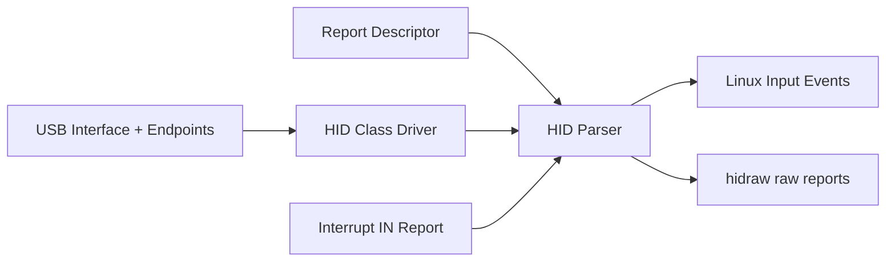
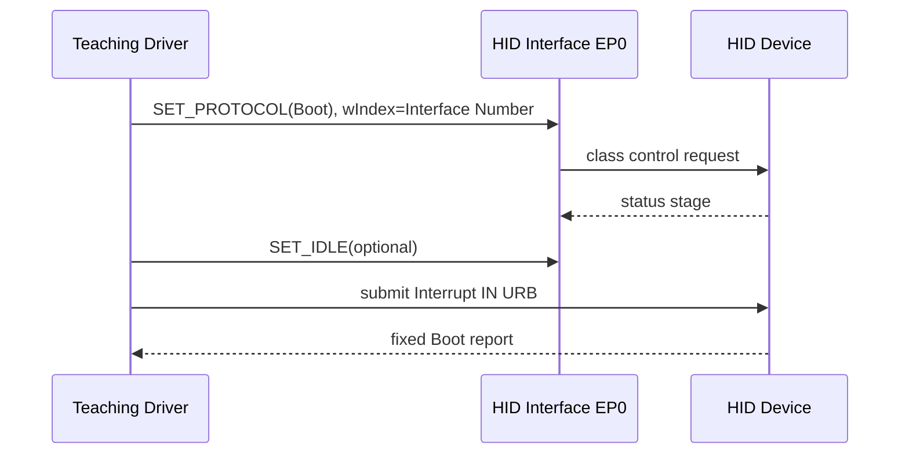
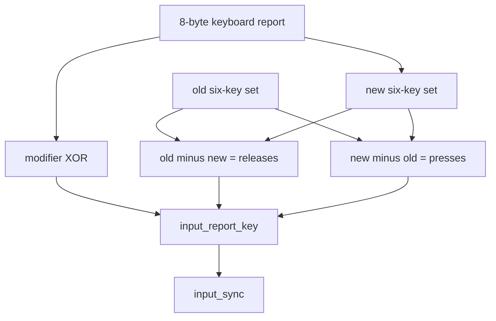
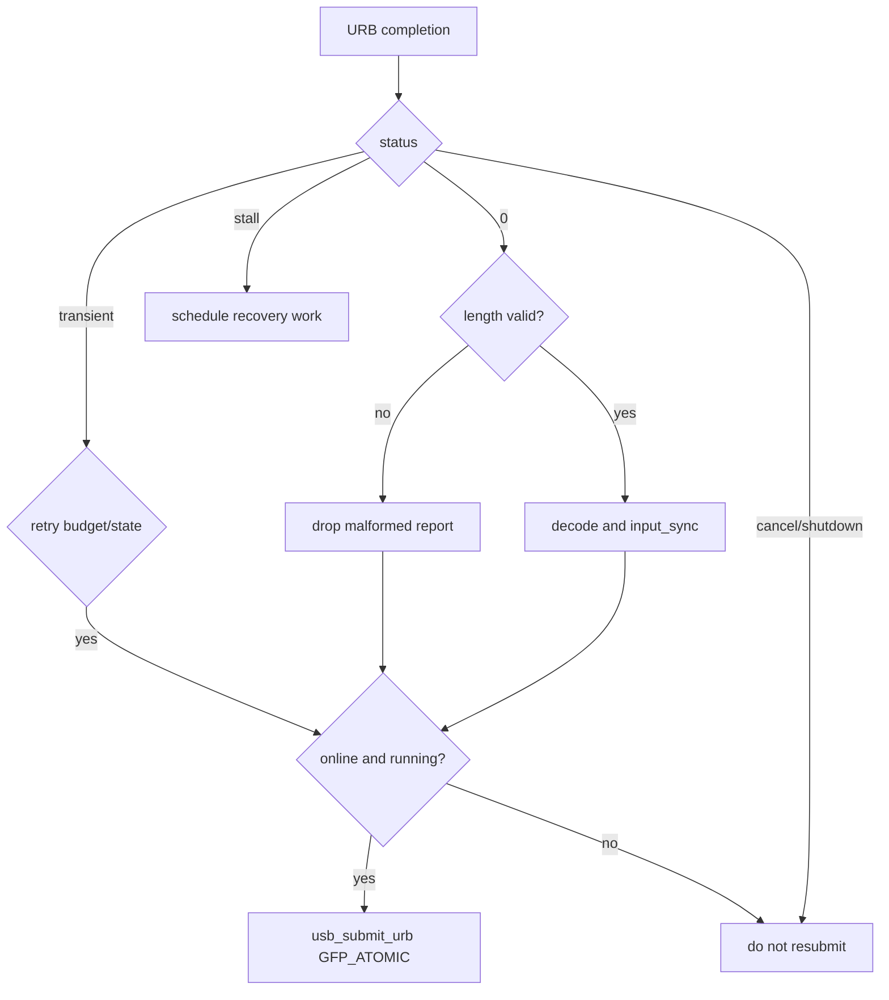

HID 是 USB 中最经典的类协议之一。

键盘和鼠标看似简单，却同时连接了四套模型：

- USB Interface、Descriptor 和 Interrupt Endpoint。
- HID Class、Report Descriptor 与 Report Protocol。
- Boot Keyboard/Mouse 的固定兼容格式。
- Linux Input Device、Event Code 和同步帧。

如果只会从 Interrupt IN 读几个字节，很容易漏掉按键释放、修饰键、重复报告、热插拔和 Input 事件边界。

本文以 Linux 6.12 为基线，解释 Boot Protocol 驱动所需的完整概念。

配套 `usb_hid_boot.c` 是教学驱动，不替代内核成熟的 `usbhid`。

## 一、HID 是描述“人机输入报告”的类协议

HID 全称 Human Interface Device。

它不仅包含键盘和鼠标，还可以表达游戏控制器、按钮面板、旋钮、UPS 状态和厂商自定义控制面。

HID 的核心不是固定包格式，而是 Report Descriptor 描述的数据项模型。

设备通过 Usage Page、Usage、Logical Range、Report Size、Report Count 和 Input/Output/Feature Item 声明每个 bit 的意义。

Host 的通用 HID Parser 读取 Report Descriptor，建立字段布局，再把 Input Report 转换为上层事件。



Linux 通用路径主要由 HID Core 与 `usbhid` 组成。

本篇教学驱动只处理 Boot Interface 固定子集，用于观察 USB 到 Input 的映射。

## 二、Interface Class、Subclass 与 Protocol 的匹配

HID Interface Descriptor 常见字段：

- `bInterfaceClass = USB_CLASS_HID (0x03)`。
- `bInterfaceSubClass = 1` 表示 Boot Interface Subclass。
- `bInterfaceProtocol = 1` 表示 Keyboard。
- `bInterfaceProtocol = 2` 表示 Mouse。

Boot Subclass 的目的，是让固件或简化 Host 在没有完整 Report Parser 时也能使用基本键盘鼠标。

非 Boot HID 仍可以是标准 HID，只是不能假设固定报告格式。

驱动 ID 表若使用：

```c
USB_INTERFACE_INFO(USB_CLASS_HID, 1, 1)
USB_INTERFACE_INFO(USB_CLASS_HID, 1, 2)
```

就只会匹配 Boot Keyboard 与 Boot Mouse。

匹配后仍要在 probe 再次验证当前 Interface Descriptor，防止动态 ID 或异常设备进入不支持路径。

## 三、HID Descriptor 位于 Interface 描述符之后

HID Descriptor 是 Class-specific Descriptor。

它通常包含：

- HID 规范版本 `bcdHID`。
- 国家代码 `bCountryCode`。
- 下级描述符数量。
- Report Descriptor 类型与长度。

usbcore 不会把所有 Class-specific 字节解释成统一结构。

通用 HID 驱动会从 Interface 的 extra descriptor 或 Endpoint 前的 extra 区域中寻找 HID Descriptor，再发起 `GET_DESCRIPTOR(Report)`。

Boot 教学驱动若完全不解析 Report Descriptor，必须明确限制：

- 只支持协议声明为 Boot Keyboard/Mouse 的接口。
- 主动切到 Boot Protocol。
- 只解码规范定义的基本报告。
- 不支持带 Report ID 的任意布局。

这种限制是有意的协议子集，不是通用 HID 实现。

## 四、Boot Protocol 与 Report Protocol

HID 设备可以处于两种协议模式：

- Report Protocol：按 Report Descriptor 定义布局。
- Boot Protocol：按 Boot Keyboard/Mouse 固定布局。

Host 使用 Class Request `SET_PROTOCOL` 选择。

`wValue = 0` 选择 Boot Protocol，`wValue = 1` 选择 Report Protocol。

请求接收者是 Interface，因此 `wIndex` 必须填 `bInterfaceNumber`。



不要假设设备上电后一定处于 Boot Protocol。

HID 规范允许 Host 选择，操作系统通用驱动通常使用 Report Protocol。

教学驱动必须显式 `SET_PROTOCOL`，否则复杂设备可能返回与固定布局不同的报告。

## 五、Boot Keyboard 的 8 字节报告

经典 Boot Keyboard Input Report 长度为 8 字节：

| Byte | 含义 |
| --- | --- |
| 0 | 8 个 Modifier bit |
| 1 | Reserved |
| 2..7 | 最多 6 个普通 Key Usage ID |

Modifier bit 通常依次表示 Left Ctrl、Left Shift、Left Alt、Left GUI、Right Ctrl、Right Shift、Right Alt、Right GUI。

普通按键槽不是事件列表，而是“当前按下集合”的快照。

例如先收到：

```text
00 00 04 00 00 00 00 00
```

表示 Usage ID `0x04` 当前按下，通常对应字母 A 的物理键。

随后收到全零报告，才表示释放。

驱动必须比较上一帧与当前帧，生成 press/release 差分。

## 六、Modifier 与普通键的差分算法不同

Modifier 是 bitset，可以逐位异或：

```c
changed = old_mod ^ new_mod;
for (i = 0; i < 8; ++i) {
    if (changed & BIT(i))
        input_report_key(input, modifier_keycode[i],
                         !!(new_mod & BIT(i)));
}
```

六个普通键槽是无序集合，不能按数组同一位置比较。

需要：

1. 对旧集合中每个非零 Usage，若新集合不存在则报告 release。
2. 对新集合中每个非零 Usage，若旧集合不存在则报告 press。
3. 忽略重复 Usage 和保留值。



如果只上报新报告里的按键而不做旧集合差分，按键会永久卡在 pressed 状态。

## 七、6-Key Rollover 与错误码 Usage

Boot Keyboard 只有六个普通按键槽，通常称 6KRO。

同时按下更多普通键时，设备可能填入 HID Usage：

- `0x01` ErrorRollOver。
- `0x02` POSTFail。
- `0x03` ErrorUndefined。

这些不是普通键码。

驱动遇到错误报告时，不应把它们映射成 Linux key event。

保守策略是丢弃本帧普通键变化，保留上一稳定集合，并记录 rate-limited 调试信息。

若直接把错误帧当作全释放，会在用户同时按多键时产生抖动。

通用 HID Parser 可以支持 NKRO 位图等更丰富格式，Boot 教学驱动则明确受 6KRO 限制。

## 八、Usage ID 到 Linux KEY_* 的映射

HID Keyboard/Keypad Usage Page 的 Usage ID 与 Linux `KEY_*` 数值不是同一命名空间。

驱动需要映射表。

例如：

| HID Usage | 物理键 | Linux Event Code |
| --- | --- | --- |
| `0x04` | A | `KEY_A` |
| `0x1e` | 1 | `KEY_1` |
| `0x28` | Enter | `KEY_ENTER` |
| `0x29` | Escape | `KEY_ESC` |
| `0x2c` | Space | `KEY_SPACE` |

Input 层上报的是物理键语义，不负责根据 Shift、CapsLock 和键盘布局生成字符。

字符转换属于用户空间 keymap/输入法。

因此 Shift+A 由 `KEY_LEFTSHIFT=1` 与 `KEY_A=1` 两个事件表达，不直接生成大写字符 `A`。

## 九、Boot Mouse 报告的基本布局

经典 Boot Mouse 至少包含三个字节：

- Byte 0：Button bit。
- Byte 1：X 相对位移，8-bit signed。
- Byte 2：Y 相对位移，8-bit signed。

某些设备增加滚轮第四字节，但 Boot 最小保证并不覆盖任意扩展。

驱动应根据实际 Interrupt Endpoint 最大包长和收到的 `actual_length` 决定是否读取扩展字段。

Button 映射：

- bit 0 -> `BTN_LEFT`
- bit 1 -> `BTN_RIGHT`
- bit 2 -> `BTN_MIDDLE`

位移使用：

```c
input_report_rel(input, REL_X, (s8)report[1]);
input_report_rel(input, REL_Y, (s8)report[2]);
```

Y 方向是否需要取反，取决于协议定义与 Input 坐标约定；Boot Mouse 定义应按规范实现，不凭视觉感觉随意改符号。

## 十、input_dev 表达设备能力

驱动使用 `input_allocate_device()` 或 managed 版本分配 `struct input_dev`。

在注册前设置：

- `name`：可读名称。
- `phys`：物理拓扑路径。
- `id`：总线、VID、PID、版本。
- `dev.parent`：Interface Device。
- `evbit`、`keybit`、`relbit`：能力位。

`usb_to_input_id(udev, &input->id)` 把 USB 身份转换到 Input ID。

键盘至少声明 `EV_KEY` 与支持的 `KEY_*`。

鼠标声明 `EV_KEY`、按钮位、`EV_REL`、`REL_X` 和 `REL_Y`。

```mermaid
flowchart LR
    UDEV[usb_device] --> ID[usb_to_input_id]
    INTF[usb_interface] --> PARENT[input_dev.dev.parent]
    CAPS[protocol capabilities] --> BITS[evbit/keybit/relbit]
    ID --> REG[input_register_device]
    PARENT --> REG
    BITS --> REG
    REG --> EVDEV[/dev/input/eventX]
```

能力位是用户空间发现合同。

如果驱动可能上报某事件却没有声明对应 bit，Input Core 或用户空间行为会不一致。

## 十一、Input Event 以 SYN_REPORT 结束一帧

`input_report_key()` 与 `input_report_rel()` 只是累积事件。

完成一个 USB Report 的映射后，应调用 `input_sync()`。

它产生 `EV_SYN/SYN_REPORT`，告诉用户空间本帧结束。

键盘一帧可能同时包含多个 press/release 与 Modifier 变化。

把每个按键后都单独 `input_sync()` 会人为拆帧。

鼠标 Button 与 X/Y 位移也应属于同一同步帧。

Input Core 会过滤部分重复 key state，但驱动仍应正确维护自己的旧报告，因为集合差分和 rollover 处理依赖它。

## 十二、Interrupt IN Endpoint 的发现

Boot Keyboard/Mouse 通常通过 Interrupt IN 上报。

probe 从 `intf->cur_altsetting` 寻找 `usb_endpoint_is_int_in()`。

验证：

- Endpoint 存在且唯一策略明确。
- `usb_endpoint_maxp()` 足以容纳最小 Boot 报告。
- `bInterval` 合理。
- 设备速度下的 interval 解释正确。

构造 pipe：

```c
pipe = usb_rcvintpipe(udev, usb_endpoint_num(epd));
```

URB interval 可使用描述符 `bInterval`，HCD 会按速度规则处理。

Interrupt 名称描述“周期性服务保证”，不是 CPU 硬件中断。

设备仍然等待 Host 调度 IN transaction。

## 十三、报告缓冲与 URB 的所有权

长期 Interrupt IN 适合：

- 一个预分配 URB。
- 一个 `usb_alloc_coherent()` 报告缓冲。
- completion 中解析并重提交。

提交到 completion 之间，设备数据路径拥有缓冲。

completion 进入后，CPU 可以读取 `actual_length` 范围内数据。

重提交之前应完成解析或复制。

不要在重提交后继续读取同一缓冲，因为 HCD 可能已经开始下一次 DMA。

如果解析工作复杂，应在 completion 快速复制到另一个 ring，再重提交并投递 work。

Boot 报告很小，直接在 completion 中做有限映射通常可接受。

## 十四、completion 的状态分类

completion 先看 `urb->status`：

| status | 处理 |
| --- | --- |
| 0 | 校验长度、解析、上报、按状态重提交 |
| `-ENOENT` | 被 unlink/kill，结束 |
| `-ECONNRESET` | 被取消，结束 |
| `-ESHUTDOWN` | 端点关闭/设备移除，结束 |
| `-EPIPE` | STALL，投递可睡眠恢复工作 |
| `-EPROTO` 等 | 记录并按有限策略重提交或停止 |

completion 不能调用 `usb_control_msg()` 重新设置协议，也不能调用会睡眠的 `usb_clear_halt()`。

需要恢复时投递 workqueue。

重提交前检查 `online`、`running` 与 generation。



## 十五、短报告与恶意长度处理

永远以 `urb->actual_length` 为界访问。

Keyboard 报告少于 8 字节时，不应读取缺失槽位。

Mouse 少于 3 字节时，不应读取 X/Y。

收到超长报告时，HCD 只会写入提交缓冲允许范围；驱动要决定是否接受已知前缀，还是因协议不匹配停止设备。

对教学 Boot 驱动，严格要求固定最小长度更容易证明正确。

Malformed Report 应计数并 rate-limit 日志，避免异常设备每毫秒刷屏。

反复异常可停止队列，并要求用户重新绑定通用 `usbhid` 或检查设备固件。

## 十六、LED Output Report 不属于最小输入路径

键盘 Num Lock、Caps Lock 和 Scroll Lock LED 通常通过 Output Report 控制。

Boot Protocol 可以使用 `SET_REPORT` Control Request 或 Interrupt OUT（若存在）。

完整实现需要注册 Input LED 回调，将 Linux LED 状态转换为 HID bitset，并处理异步控制请求。

教学驱动若不实现 LED，必须明确说明限制。

不能在 Input event callback 的原子上下文直接调用同步 Control Message。

应缓存目标 LED 状态并投递 workqueue，处理多次快速变化的合并与 disconnect 取消。

## 十七、为什么不能与 usbhid 同时绑定

一个 `usb_interface` 同一时刻只能绑定一个 driver。

标准 HID Interface 通常已被 `usbhid` 占用。

加载教学模块不会自动抢占。

实验时只解绑目标 Interface，例如：

```text
echo -n '1-2:1.0' > /sys/bus/usb/drivers/usbhid/unbind
echo -n '1-2:1.0' > /sys/bus/usb/drivers/usb_hid_boot/bind
```

Interface 名必须从实际 sysfs 拓扑确认。

不要卸载 `usbhid` 模块来影响系统全部键盘鼠标。

若目标是当前唯一输入设备，解绑前要准备串口、SSH 或第二键盘，避免失去控制。

恢复时先从教学 driver unbind，再 bind 回 `usbhid`。

## 十八、disconnect 如何释放“所有键已按下”状态

设备拔出时，Input Device 会注销，用户空间通常能处理设备消失。

驱动仍要按正确顺序：

1. 清空 `usb_set_intfdata()`。
2. 设置 online/running false。
3. kill Interrupt URB。
4. 取消恢复 work。
5. 注销或释放 `input_dev`。
6. 释放 coherent buffer 和 URB。
7. 释放 `usb_device` 引用与私有对象。

如果 input device 使用 `input_register_device()` 注册，成功后由 Input Core 的注销/释放规则接管部分寿命。

错误路径必须区分注册前与注册后，避免 `input_free_device()` 和 `input_unregister_device()` 双重使用。

## 十九、suspend、remote wakeup 与键盘唤醒

键盘经常被期望作为系统唤醒源。

USB 远程唤醒涉及：

- Configuration 是否声明 Remote Wakeup。
- 系统是否允许该设备 wakeup。
- 驱动 `needs_remote_wakeup`/PM 策略。
- Host Controller 与平台电源域是否支持。
- 设备固件在 suspend 中是否保持按键检测。

Runtime suspend 与 system suspend 目标不同。

如果驱动在 suspend 中 kill URB，resume 后必须重新提交。

若 reset_resume 发生，还要重新执行 `SET_PROTOCOL(Boot)`，因为设备可能回到默认协议状态。

不要把“键盘可输入”和“键盘可唤醒 SoC”视为同一个验证项。

## 二十、与通用 HID 栈的边界

Linux 通用 HID 栈还处理：

- 任意 Report Descriptor Parser。
- Report ID。
- 多 Input/Output/Feature Report。
- HID quirk。
- hidraw。
- transport 与 HID Core 解耦。
- 多种总线上的 HID。

Boot 教学驱动不复制这些能力。

它的价值是把固定报告一路映射到 Input Event，暴露 Endpoint、URB、DMA、状态差分和热插拔的基本机制。

产品开发应优先复用 HID Core，只有协议确实特殊且无法通过 quirk/现有驱动表达时，才评估自定义驱动。

## 二十一、验证报告和事件的工具链

分层观察：

1. `lsusb -v`：Interface Class/Subclass/Protocol、Endpoint 与 HID Descriptor。
2. usbmon/Wireshark：Interrupt IN 的原始报告。
3. `/proc/bus/input/devices`：Input Device 身份与能力。
4. `evtest`：`EV_KEY`、`EV_REL` 和 `SYN_REPORT`。
5. dynamic debug：completion 状态、短报告、重提交。

若 usbmon 数据正确而 evtest 缺按键释放，问题在报告差分或 Input 映射。

若 Input Device 存在但 usbmon 没有 Interrupt IN，检查 URB 是否提交、Endpoint 与 PM 状态。

若 Interface 仍绑定 `usbhid`，教学 driver 的 probe 根本不会运行。

## 二十二、Linux 6.12 一手资料与源码入口

重点源码：

- `drivers/hid/usbhid/hid-core.c`
- `drivers/hid/hid-core.c`
- `drivers/input/input.c`
- `include/linux/hid.h`
- `include/linux/input.h`

一手资料：

- [Linux 6.12 HID transport documentation](https://www.kernel.org/doc/html/v6.12/hid/hid-transport.html)
- [Linux Input programming documentation](https://docs.kernel.org/input/input-programming.html)
- [Linux stable usbhid source](https://git.kernel.org/pub/scm/linux/kernel/git/stable/linux.git/tree/drivers/hid/usbhid/hid-core.c?h=linux-6.12.y)
- [USB HID specification documents](https://www.usb.org/hid)

## 二十三、小结

HID 的通用能力来自 Report Descriptor，Boot Protocol 只是键盘鼠标的固定兼容子集。

Boot Driver 必须按 Interface Class/Subclass/Protocol 限定支持范围，并显式 `SET_PROTOCOL(Boot)`。

键盘 8 字节报告是当前按键集合快照，Modifier 用 bit 差分，普通键用集合差分，释放事件与按下事件同样重要。

Mouse 把 Button 与有符号相对位移映射为 `EV_KEY`、`EV_REL`，整份报告以 `input_sync()` 结束。

`usb_to_input_id()`、能力 bit 和 parent 关系共同构成 `input_dev` 的发现合同。

Interrupt IN URB 在 completion 中解析并按状态重提交，所有访问受 `actual_length` 限制。

教学驱动只能绑定从 `usbhid` 单独解绑的目标 Interface，不能影响系统其他 HID。

掌握这条数据路径后，读者既能理解通用 HID 栈为何复杂，也能把 USB Endpoint、URB 与 Linux Input 事件连接起来。
