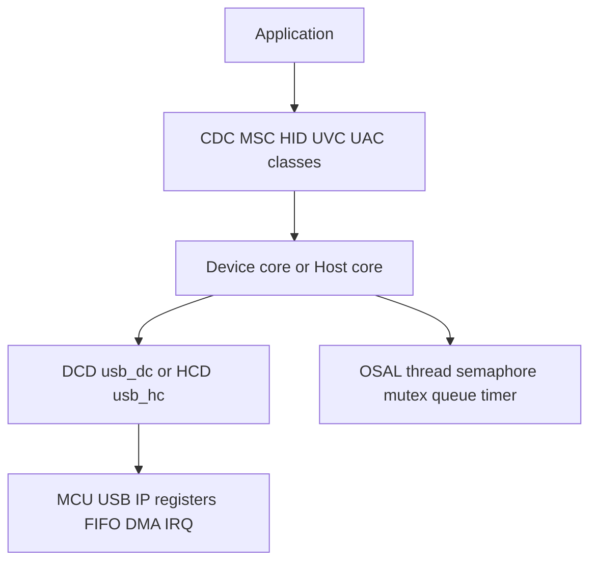

MCU 上的 USB 与 Linux 使用同一套线缆、描述符和传输协议，但软件边界不同。没有 usbcore、driver core 和通用 HCD 帮你管理设备时，固件必须直接处理 USB IP 中断、endpoint/FIFO、DMA、枚举状态和 Class 协议。开源协议栈的价值，就是把“USB 规范公共逻辑”与“某个 MCU 的控制器寄存器”分开。

本篇固定使用 [CherryUSB v1.6.1](https://github.com/cherry-embedded/CherryUSB/tree/v1.6.1)，commit `c9625ffa773ad10b8824d1b5361bca2ccc1f3d1e`。内容同时覆盖 Device 与 Host，重点解释 core、class、port 和 OSAL 的契约，不绑定某块开发板。

## MCU USB IP 先决定角色、endpoint 和数据搬运能力

MCU USB 外设通常提供 Device、Host 或 OTG/dual-role 能力。Device 模式响应 Host 调度，管理 EP0 和若干 IN/OUT endpoint；Host 模式产生 SOF、端口 reset、地址和 token，并管理 channel/pipe；OTG 还要根据 ID/VBUS/Type-C 状态切换角色。

控制器实现可能是专用 USB FS device、DWC2、MUSB、ChipIdea 等。差异包括 endpoint 数量、FIFO 是否共享、是否有独立 DMA、setup packet 存放位置、Host channel 数、isochronous 支持和 cache 一致性要求。协议栈不能用一个寄存器驱动覆盖这些差异，因此需要 Device Controller Driver（DCD）和 Host Controller Driver（HCD）层。

Endpoint buffer 的生命周期尤其重要。DMA 读取 IN buffer 前要完成 CPU 写入和必要 cache clean；DMA 写 OUT buffer 后 CPU 读取前要 invalidate。Buffer 不能放在函数局部栈上后异步返回，也不能在 completion 前复用。

## CherryUSB 用四层把协议和硬件分开



官方目录中，`core` 实现标准请求、枚举和总线对象；`class` 实现 CDC ACM、MSC、HID 等 Device/Host class；`port` 适配 DWC2、MUSB、EHCI、OHCI、ChipIdea 等 USB IP；`common` 提供描述符、错误码和公共 DCD/HCD/OSAL 接口；`osal` 适配 FreeRTOS、RT-Thread、NuttX 等环境；`demo` 提供组合示例。

Device core 可以裸机运行，Host 枚举、Hub 和阻塞/异步传输通常需要 OSAL 提供线程、信号量、mutex、消息队列、timer、临界区和内存。使用 FreeRTOS 时应检查 `osal/usb_osal_freertos.c` 对 stack size、priority 和 ISR API 的映射，而不是假设任意 OSAL 都有相同单位。

## DCD 移植把 Device core 接到 USB 中断

公共 DCD 接口位于 [`common/usb_dc.h`](https://github.com/cherry-embedded/CherryUSB/blob/v1.6.1/common/usb_dc.h)。移植层实现 `usb_dc_init/deinit`、地址设置、endpoint open/close/stall，以及异步 `usbd_ep_start_write()`、`usbd_ep_start_read()`。

硬件 ISR 解析 controller 状态后必须调用 core 事件入口，例如：

- reset：`usbd_event_reset_handler()`；
- setup：`usbd_event_ep0_setup_complete_handler()`；
- IN 完成：`usbd_event_ep_in_complete_handler()`；
- OUT 完成：`usbd_event_ep_out_complete_handler()`；
- suspend/resume/connect/disconnect 对应事件 handler。

DCD 负责 packetization、FIFO/DMA 和硬件错误，core 负责 EP0 标准请求、描述符和 class 分发。若 setup bytes 或完成长度传错，表现会出现在枚举/class 层，但根因仍在 DCD。

## Device 最小 CDC ACM 由描述符、interface 和 endpoint 组成

v1.6.1 的 CDC template 使用如下初始化顺序：

```c
usbd_desc_register(busid, &cdc_descriptor);
usbd_add_interface(busid,
    usbd_cdc_acm_init_intf(busid, &intf0));
usbd_add_interface(busid,
    usbd_cdc_acm_init_intf(busid, &intf1));
usbd_add_endpoint(busid, &cdc_out_ep);
usbd_add_endpoint(busid, &cdc_in_ep);
ret = usbd_initialize(busid, reg_base, usbd_event_handler);
```

描述符必须与注册的 interface/endpoint 对应。CDC ACM 需要控制和数据 interface；Host 发来的 line coding、control line state 由 class 回调处理。OUT endpoint 应预先调用 `usbd_ep_start_read()` 提供 buffer，IN 使用 `usbd_ep_start_write()` 异步发送，完成后才能复用。

把 CDC 换成 MSC 或 HID，core/DCD 不变，变化集中在描述符、class interface 和数据回调。MSC 还要实现 block read/write/capacity；HID 要提供 report descriptor；复合设备按描述符顺序注册多个 interface 和 endpoint。

## HCD 移植为 Host core 提供 root hub 和 URB

公共 HCD 接口位于 [`common/usb_hc.h`](https://github.com/cherry-embedded/CherryUSB/blob/v1.6.1/common/usb_hc.h)。移植层实现 `usb_hc_init/deinit`、frame number、root hub control、`usbh_submit_urb()` 和 `usbh_kill_urb()`。

`struct usbh_urb` 包含 hubport、endpoint descriptor、setup、buffer、length、timeout、iso frame 和 completion。HCD 把它映射到 Host channel/descriptor；timeout 为 0 时可走异步 completion，非零时由实现/上层提供等待语义。

Host 初始化入口是：

```c
int ret = usbh_initialize(busid, reg_base, usbh_event_handler);
```

它建立 bus、root hub、Hub 事件线程/队列并启动 HCD。端口连接后 Host core 执行 reset、读取描述符、分配地址、解析 interface，再从 `struct usbh_class_info` 中匹配 class driver，调用 connect/disconnect。应用不应在设备尚未枚举完成时直接猜 endpoint。

## Host CDC、MSC、HID 示例从 class connect 取得对象

CherryUSB Host class driver通过 `CLASS_INFO_DEFINE` 注册匹配信息。CDC serial、MSC 和 HID 连接后，demo 的 event handler 可获得 class 对象并创建业务线程：串口线程执行收发，MSC 访问 block/filesystem，HID 解析 report。

Host 侧必须为每个设备和 interface区分对象，Hub 拔出时停止业务线程/URB再释放 class。OSAL message queue 和 semaphore 负责把 ISR/HCD completion 交给线程，不能在中断里执行文件系统或长时间 class 处理。

## 移植时按硬件、core、class 三层验证

第一步只验证 USB IP 和 DCD/HCD：时钟、PHY、IRQ、FIFO、reset、SOF/port status 是否正确。Device 可先确认 EP0 reset/setup；Host 可先确认 root port connect/reset。

第二步验证 core：Device 抓取 `GET_DESCRIPTOR/SET_ADDRESS/SET_CONFIGURATION`，Host 打印枚举状态和原始描述符。第三步才验证 CDC/MSC/HID class 和业务数据。

常见问题包括：

- `usb_config.h` 的 endpoint/channel/buffer 数量小于描述符或设备需求；
- DMA buffer 未对齐或 cache 维护缺失；
- endpoint 地址与 DCD FIFO 配置不一致；
- ISR 没有调用对应 core event handler；
- OSAL stack size/priority 单位映射错误；
- Host class 已 disconnect，业务线程仍使用旧对象。

官方配置模板见 [`cherryusb_config_template.h`](https://github.com/cherry-embedded/CherryUSB/blob/v1.6.1/cherryusb_config_template.h)，STM32 与 ESP32 示例分别见 [cherryusb_stm32](https://github.com/CherryUSB/cherryusb_stm32) 和 [cherryusb_esp32](https://github.com/CherryUSB/cherryusb_esp32)。移植应从与 USB IP 相同的 port 开始，而不是只按 MCU 品牌选择文件。

## 小结

MCU USB 开发的关键是把协议状态、Class 逻辑和 USB IP 分层。CherryUSB v1.6.1 用 Device/Host core 实现公共协议，用 class 实现 CDC/MSC/HID 等功能，用 DCD/HCD 适配寄存器、FIFO、DMA 和 IRQ，用 OSAL 适配线程同步。`usbd_initialize` 和 `usbh_initialize` 是两条角色主线，可靠移植则必须从控制器事件一路验证到 core，再进入 class。
