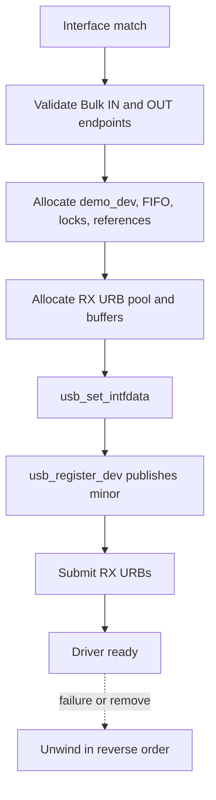
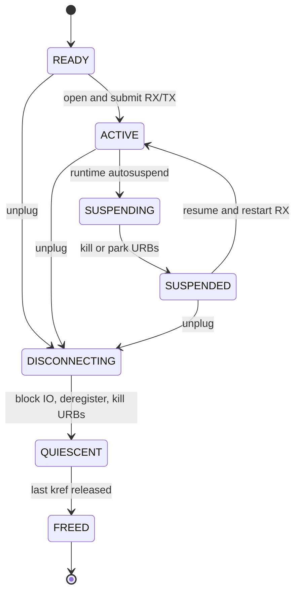
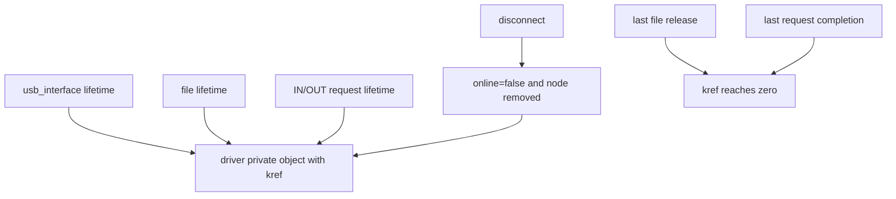
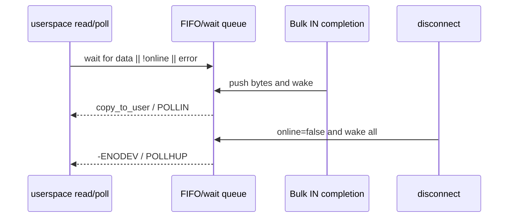
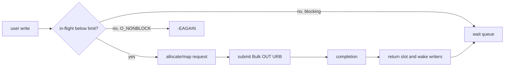

前四篇已经分别说明 USB 如何识别设备、Linux 如何绑定 Interface、描述符如何定义 Endpoint，以及 URB 如何异步完成。本篇把这些机制组合成一个可工作的驱动模型。

本文的 API、并发与错误回滚以 Linux 6.12 为基线，配套源码使用重新编写的教学协议和实现。

示例设备只有一个 vendor-specific Interface，包含一个 Bulk OUT 和一个 Bulk IN Endpoint。上层协议使用消息头 `{type, sequence, length}`，Host 发送命令，Device 异步返回响应或采样数据。明确协议很重要：驱动才能判断 short packet、消息边界、超时和背压，而不是把任意字节流都当成功。

## 一、先定义对象、协议和停止条件

驱动私有对象必须同时回答三个问题：硬件是否仍连接、软件对象被谁引用、异步请求是否仍在飞行。只保存 `usb_device *` 和两个 Endpoint 地址远远不够。

```c
struct demo_dev {
    struct usb_device *udev;
    struct usb_interface *intf;
    struct kref kref;

    u8 bulk_in_ep;
    u8 bulk_out_ep;
    size_t bulk_in_mps;

    struct usb_anchor submitted;
    struct urb *rx_urb[4];
    u8 *rx_buf[4];

    spinlock_t rx_lock;
    struct kfifo rx_fifo;
    wait_queue_head_t read_wait;

    struct semaphore tx_slots;
    struct mutex io_mutex;
    bool disconnected;
    bool suspended;
};
```

`kref` 保护私有对象内存；`disconnected` 表示硬件可访问性；`usb_anchor` 跟踪动态发送 URB；固定 RX URB 数组维持持续接收；wait queue 把 completion 与阻塞 read/poll 连接起来；semaphore 限制并发 TX 数，形成最基本的背压。

协议停止条件也要明确：disconnect 后所有新文件操作返回 `-ENODEV`；suspend 期间不提交新 URB；某个消息长度超过上限返回 `-EMSGSIZE`；RX FIFO 满时记录丢弃或让设备停发，不能默默覆盖旧数据。

## 二、probe 按依赖顺序建立资源

驱动用 VID/PID 或 Interface class 匹配后，先验证当前 Alternate 的 Endpoint。`usb_find_common_endpoints()` 能寻找常见 Bulk/Interrupt 组合，但结果仍需检查最大包长和厂商协议约束。

```c
static int demo_probe(struct usb_interface *intf,
                      const struct usb_device_id *id)
{
    struct usb_endpoint_descriptor *ep_in;
    struct usb_endpoint_descriptor *ep_out;
    struct demo_dev *dev;
    int ret;

    ret = usb_find_common_endpoints(intf->cur_altsetting,
                                    &ep_in, &ep_out, NULL, NULL);
    if (ret)
        return dev_err_probe(&intf->dev, ret,
                             "bulk IN/OUT endpoints required\n");

    dev = kzalloc(sizeof(*dev), GFP_KERNEL);
    if (!dev)
        return -ENOMEM;

    dev->udev = usb_get_dev(interface_to_usbdev(intf));
    dev->intf = usb_get_intf(intf);
    dev->bulk_in_ep = ep_in->bEndpointAddress;
    dev->bulk_out_ep = ep_out->bEndpointAddress;
    dev->bulk_in_mps = usb_endpoint_maxp(ep_in);
    kref_init(&dev->kref);
    init_usb_anchor(&dev->submitted);
    spin_lock_init(&dev->rx_lock);
    init_waitqueue_head(&dev->read_wait);
    mutex_init(&dev->io_mutex);
    sema_init(&dev->tx_slots, 8);

    ret = kfifo_alloc(&dev->rx_fifo, 64 * 1024, GFP_KERNEL);
    if (ret)
        goto err_put;

    ret = demo_alloc_rx_pool(dev);
    if (ret)
        goto err_fifo;

    usb_set_intfdata(intf, dev);
    ret = usb_register_dev(intf, &demo_class);
    if (ret)
        goto err_data;

    ret = demo_start_rx(dev, GFP_KERNEL);
    if (ret)
        goto err_minor;

    return 0;

err_minor:
    usb_deregister_dev(intf, &demo_class);
err_data:
    usb_set_intfdata(intf, NULL);
    demo_free_rx_pool(dev);
err_fifo:
    kfifo_free(&dev->rx_fifo);
err_put:
    usb_put_intf(dev->intf);
    usb_put_dev(dev->udev);
    kfree(dev);
    return ret;
}
```

`usb_register_dev()` 为 Interface 分配 minor，并通过 `usb_class_driver` 创建字符设备入口。它应在私有状态和基础协议已经就绪后调用；若先发布 `/dev/demo_usb0`，用户可能在 probe 尚未完成时进入 `open()`。



错误回滚必须与获取顺序镜像。特别是已提交 RX URB 后失败，需要先 kill URB，再释放 buffer；单纯 `usb_free_urb()` 不能取消正在 HCD 中的请求。

## 三、持续 Bulk IN：completion、FIFO、read 和 poll

持续接收不能每次用户 `read()` 才临时提交一个 URB，否则用户调度延迟会在总线上产生空档。probe 启动 4 个 RX URB，completion 把有效字节放入 FIFO，并立即重新提交空闲 URB。

```c
static void demo_rx_complete(struct urb *urb)
{
    struct demo_dev *dev = urb->context;
    unsigned long flags;
    bool resubmit;

    if (urb->status == 0 && urb->actual_length) {
        spin_lock_irqsave(&dev->rx_lock, flags);
        if (kfifo_avail(&dev->rx_fifo) >= urb->actual_length)
            kfifo_in(&dev->rx_fifo, urb->transfer_buffer,
                     urb->actual_length);
        else
            dev->rx_dropped += urb->actual_length;
        spin_unlock_irqrestore(&dev->rx_lock, flags);
        wake_up_interruptible(&dev->read_wait);
    }

    resubmit = !READ_ONCE(dev->disconnected) &&
               !READ_ONCE(dev->suspended) &&
               urb->status != -ENOENT &&
               urb->status != -ESHUTDOWN;
    if (resubmit) {
        int ret = usb_submit_urb(urb, GFP_ATOMIC);
        if (ret)
            dev->rx_submit_errors++;
    }
}
```

FIFO 是 completion 与进程上下文之间的所有权边界。completion 在 spinlock 下复制字节后即可归还 URB buffer；read 在同一锁下把 FIFO 数据复制到临时内核 buffer，再调用 `copy_to_user()`，避免持有 spinlock 访问用户内存。

```c
static ssize_t demo_read(struct file *file, char __user *buf,
                         size_t count, loff_t *ppos)
{
    struct demo_dev *dev = file->private_data;
    u8 *tmp;
    unsigned int copied;
    int ret;

    if (!count)
        return 0;

    if (file->f_flags & O_NONBLOCK) {
        if (kfifo_is_empty(&dev->rx_fifo))
            return READ_ONCE(dev->disconnected) ? -ENODEV : -EAGAIN;
    } else {
        ret = wait_event_interruptible(dev->read_wait,
                !kfifo_is_empty(&dev->rx_fifo) ||
                READ_ONCE(dev->disconnected));
        if (ret)
            return ret;
    }

    if (kfifo_is_empty(&dev->rx_fifo) &&
        READ_ONCE(dev->disconnected))
        return -ENODEV;

    tmp = kmalloc(min_t(size_t, count, 4096), GFP_KERNEL);
    if (!tmp)
        return -ENOMEM;

    spin_lock_irq(&dev->rx_lock);
    copied = kfifo_out(&dev->rx_fifo, tmp,
                       min_t(size_t, count, 4096));
    spin_unlock_irq(&dev->rx_lock);

    if (copy_to_user(buf, tmp, copied))
        ret = -EFAULT;
    else
        ret = copied;
    kfree(tmp);
    return ret;
}
```

`poll()` 必须与 read 使用同一状态条件，否则用户会收到“可读”通知却读不到数据：

```c
static __poll_t demo_poll(struct file *file, poll_table *wait)
{
    struct demo_dev *dev = file->private_data;
    __poll_t mask = 0;

    poll_wait(file, &dev->read_wait, wait);
    if (!kfifo_is_empty(&dev->rx_fifo))
        mask |= EPOLLIN | EPOLLRDNORM;
    if (READ_ONCE(dev->disconnected))
        mask |= EPOLLHUP | EPOLLERR;
    if (down_trylock(&dev->tx_slots) == 0) {
        up(&dev->tx_slots);
        mask |= EPOLLOUT | EPOLLWRNORM;
    }
    return mask;
}
```

生产驱动通常不用 `down_trylock()` 探测可写性，而维护原子计数或 wait queue；示例强调的是 poll 与 TX slot 状态必须一致。

## 四、异步 Bulk OUT 与发送背压

`write()` 不能把用户指针直接交给 USB。驱动先限制消息长度和并发数量，再分配内核 buffer/URB，`copy_from_user()`，anchor，submit；completion 释放 buffer、URB，并归还 TX slot。

```c
static ssize_t demo_write(struct file *file,
                          const char __user *buf,
                          size_t count, loff_t *ppos)
{
    struct demo_dev *dev = file->private_data;
    struct urb *urb;
    u8 *kbuf;
    int ret;

    if (count > DEMO_MAX_MESSAGE)
        return -EMSGSIZE;
    if (READ_ONCE(dev->disconnected))
        return -ENODEV;

    if (file->f_flags & O_NONBLOCK) {
        if (down_trylock(&dev->tx_slots))
            return -EAGAIN;
    } else if (down_interruptible(&dev->tx_slots)) {
        return -ERESTARTSYS;
    }

    urb = usb_alloc_urb(0, GFP_KERNEL);
    kbuf = kmalloc(count, GFP_KERNEL);
    if (!urb || !kbuf) {
        ret = -ENOMEM;
        goto err_alloc;
    }
    if (copy_from_user(kbuf, buf, count)) {
        ret = -EFAULT;
        goto err_alloc;
    }

    usb_fill_bulk_urb(urb, dev->udev,
                      usb_sndbulkpipe(dev->udev, dev->bulk_out_ep),
                      kbuf, count, demo_tx_complete, dev);
    urb->transfer_flags |= URB_FREE_BUFFER;
    usb_anchor_urb(urb, &dev->submitted);
    ret = usb_submit_urb(urb, GFP_KERNEL);
    if (ret) {
        usb_unanchor_urb(urb);
        goto err_submit;
    }

    usb_free_urb(urb); /* Drop submitter reference. */
    return count;

err_submit:
    urb->transfer_flags &= ~URB_FREE_BUFFER;
err_alloc:
    kfree(kbuf);
    usb_free_urb(urb);
    up(&dev->tx_slots);
    return ret;
}
```

```c
static void demo_tx_complete(struct urb *urb)
{
    struct demo_dev *dev = urb->context;

    usb_unanchor_urb(urb);
    if (urb->status && urb->status != -ENOENT &&
        urb->status != -ESHUTDOWN)
        dev->tx_errors++;
    up(&dev->tx_slots);
    wake_up_interruptible(&dev->write_wait);
}
```

此处 `URB_FREE_BUFFER` 让 usbcore 在 URB 最终释放时释放 transfer buffer。提交成功后立即 `usb_free_urb()` 只放弃调用者引用，HCD 引用仍保持 URB 有效。提交失败路径必须撤销 `URB_FREE_BUFFER` 或避免再次手工 `kfree()`，否则会 double free。

发送 slot 既限制内存，也限制 disconnect 的停止成本。无限接收用户 write 并堆积 URB 不是高吞吐，而是把背压隐藏在内核内存中。协议若支持 flow-control，还应把设备 credit 与本地 slot 联动。

## 五、open、release 与字符设备引用关系

`usb_class_driver` 通过 minor 把 `/dev/demo_usbN` 连接到 Interface。`open()` 使用 `usb_find_interface()` 找到 Interface，再从 `usb_get_intfdata()` 取得私有对象。取得指针和增加 `kref` 必须与 disconnect 串行，通常使用全局/对象锁或框架提供的稳定查找窗口。

```c
static int demo_open(struct inode *inode, struct file *file)
{
    struct usb_interface *intf;
    struct demo_dev *dev;
    int subminor = iminor(inode);

    intf = usb_find_interface(&demo_driver, subminor);
    if (!intf)
        return -ENODEV;

    dev = usb_get_intfdata(intf);
    if (!dev || READ_ONCE(dev->disconnected))
        return -ENODEV;

    kref_get(&dev->kref);
    file->private_data = dev;
    return 0;
}

static int demo_release(struct inode *inode, struct file *file)
{
    struct demo_dev *dev = file->private_data;
    kref_put(&dev->kref, demo_delete);
    return 0;
}
```

真实驱动应使用 mutex 保护“检查 disconnected + kref_get”的原子性。若 disconnect 在两步之间释放最后引用，open 会取得悬空指针。`demo_delete()` 只在 Interface 引用和所有 open file 引用都释放后执行，负责 `usb_put_intf()`、`usb_put_dev()`、FIFO 和最终对象内存。

用户接口语义也要明确：Device 拔出后，FIFO 中已收到的数据是否允许继续读完；poll 返回 HUP 还是 ERR；阻塞 read 是返回 `-ENODEV` 还是 0。选择必须一致并写进 API 契约。

## 六、disconnect、autosuspend 与 reset 统一停止数据路径

disconnect 的顺序是整个驱动最容易出错的部分：

```c
static void demo_disconnect(struct usb_interface *intf)
{
    struct demo_dev *dev = usb_get_intfdata(intf);

    usb_set_intfdata(intf, NULL);
    usb_deregister_dev(intf, &demo_class);

    mutex_lock(&dev->io_mutex);
    dev->disconnected = true;
    mutex_unlock(&dev->io_mutex);

    wake_up_interruptible_all(&dev->read_wait);
    wake_up_interruptible_all(&dev->write_wait);
    usb_kill_anchored_urbs(&dev->submitted);
    demo_kill_rx_pool(dev);

    kref_put(&dev->kref, demo_delete); /* Interface ownership. */
}
```



runtime autosuspend 与 disconnect 的共同点是停止 I/O，不同点是 suspend 后硬件仍存在并可能恢复。驱动访问设备前用 `usb_autopm_get_interface()`，完成后 `usb_autopm_put_interface()`；suspend callback 阻止 resubmit 并等待当前 URB，resume 恢复协议状态和 RX pool。

reset 还要考虑设备内部状态丢失。USB reset 可能保留软件对象却清空设备配置或厂商协议状态；pre_reset/post_reset 或 reset_resume 应与同一停止状态机协作，不能在旧 URB 未收敛时重新初始化。

## 七、从最小功能到压力测试的验证顺序

不要一开始就跑多线程吞吐。按以下顺序建立证据：

1. `lsusb -v` 验证 Interface 和 Bulk Endpoint。
2. 加载驱动，确认 probe、minor 和 RX pool 数量。
3. 单线程发送一个有 sequence 的命令，usbmon 中确认 OUT/IN 和长度。
4. 验证阻塞 read、`O_NONBLOCK`、poll timeout 和 HUP。
5. 并发 write 超过 slot，确认阻塞或 `-EAGAIN`，内存不增长。
6. I/O 过程中反复拔插，确认 completion、work 和 kref 收敛。
7. 打开 autosuspend，测试 idle、resume 和 Device reset。
8. 运行长时间校验，比较 submitted/completed/dropped/error 计数守恒。

配合工具：

```bash
dmesg -w
lsusb -t
cat /proc/interrupts
sudo cat /sys/kernel/debug/usb/usbmon/0u
stress-ng --class io --timeout 60s
```

KASAN 用于发现 use-after-free，lockdep 用于锁顺序，dynamic debug/tracepoint 用于时序，usbmon 用于协议证据。它们回答不同问题，不能用大量 `printk()` 代替分层观测。

**参考资料**

- [Writing USB Device Drivers](https://docs.kernel.org/driver-api/usb/writing_usb_driver.html)
- [The Linux-USB Host Side API](https://docs.kernel.org/driver-api/usb/usb.html)
- [Linux USB Power Management](https://docs.kernel.org/driver-api/usb/power-management.html)

## 八、三个对象域决定字符驱动能否热插拔

字符驱动同时存在 Interface、file 与 request 三个对象域。

Interface 域在 probe 到 disconnect 之间有效。

file 域从 open 到 release，可能越过 disconnect。

request 域从 URB 分配/提交到 completion 回收。



disconnect 不能直接释放仍被 file 或 request 引用的私有对象。

open file 也不能因为 kref 仍在，就继续向已关闭 Endpoint 提交 I/O。

## 九、read 与 poll 共享同一个状态谓词

阻塞 read 的等待条件应包含“FIFO 有数据或设备离线或发生不可恢复错误”。

poll 必须基于同一组事实返回 `POLLIN`、`POLLOUT`、`POLLHUP` 和 `POLLERR`。



若 read 与 poll 使用不同条件，会出现 poll 宣称可读而 read 永久阻塞，或拔出后 epoll 无法退出。

## 十、发送背压从 URB 配额传播到用户空间

异步 write 不能无限分配 URB。

驱动应限制在途请求数或总字节数。

达到上限时，阻塞 write 等待完成，`O_NONBLOCK` 返回 `-EAGAIN`，poll 暂时不报告 `POLLOUT`。



这一链条把设备/HCD 的有限队列容量稳定地传递到用户空间。

如果 completion 因 disconnect 返回，仍要归还配额并唤醒等待者，否则最后一次 close 会卡住。

## 十一、小结

完整 USB Interface Driver 是一套并发所有权系统：probe 建立 Endpoint、私有对象和用户入口；RX completion 与 read/poll 通过 FIFO 协作；TX slot 把用户速度转换为有限 in-flight URB；disconnect、autosuspend 和 reset 通过统一停止顺序收敛异步请求；kref 让软件对象寿命独立于物理连接。

驱动能够“传一次数据”只是起点。只有阻塞/非阻塞语义一致、背压有效、错误回滚完整、热插拔不泄漏不崩溃，才算真正可用。
