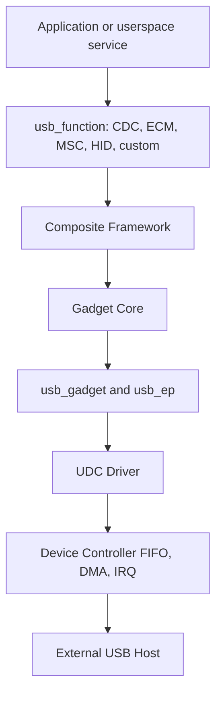
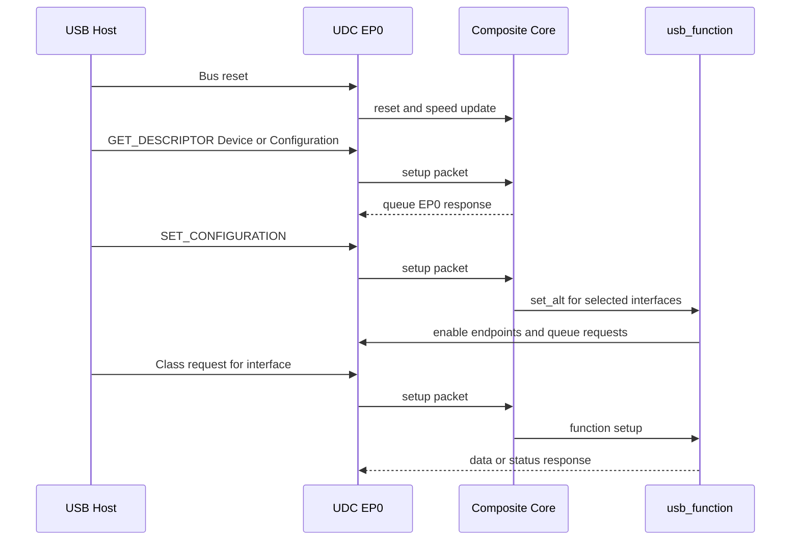
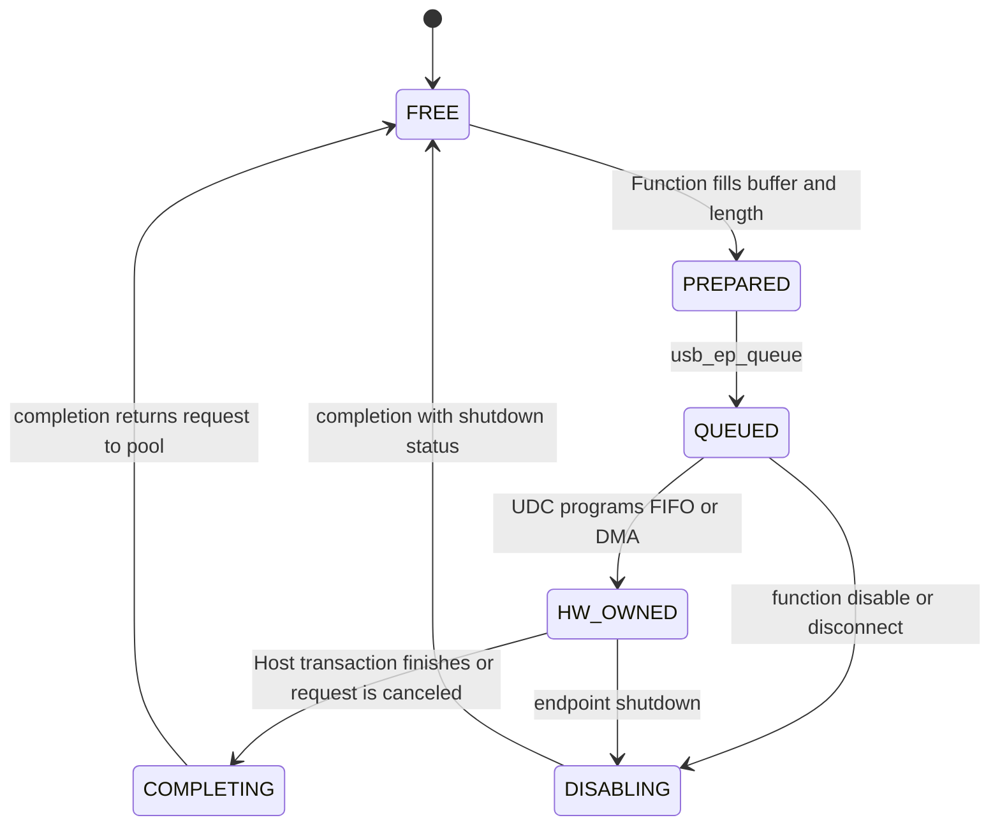
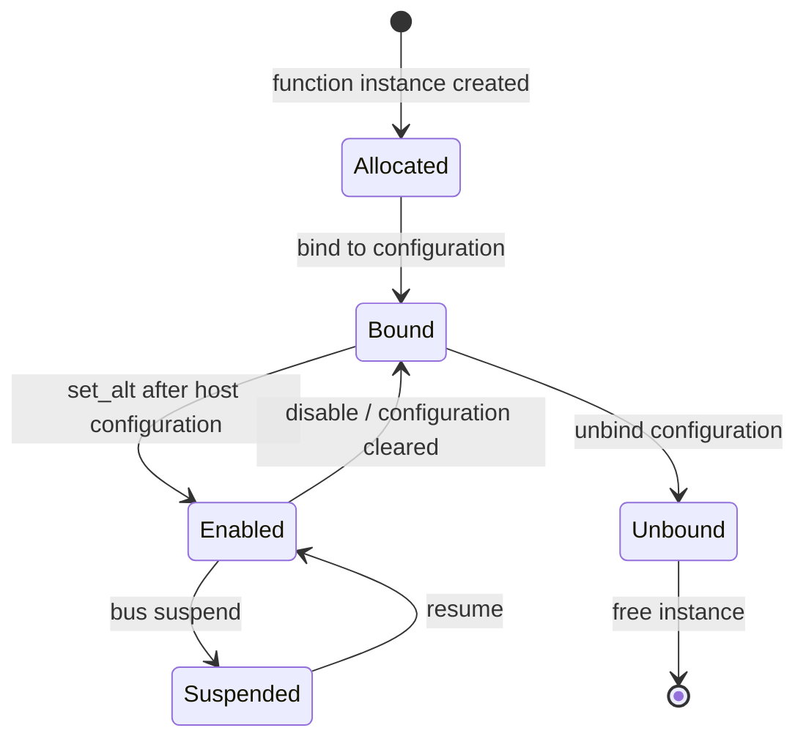
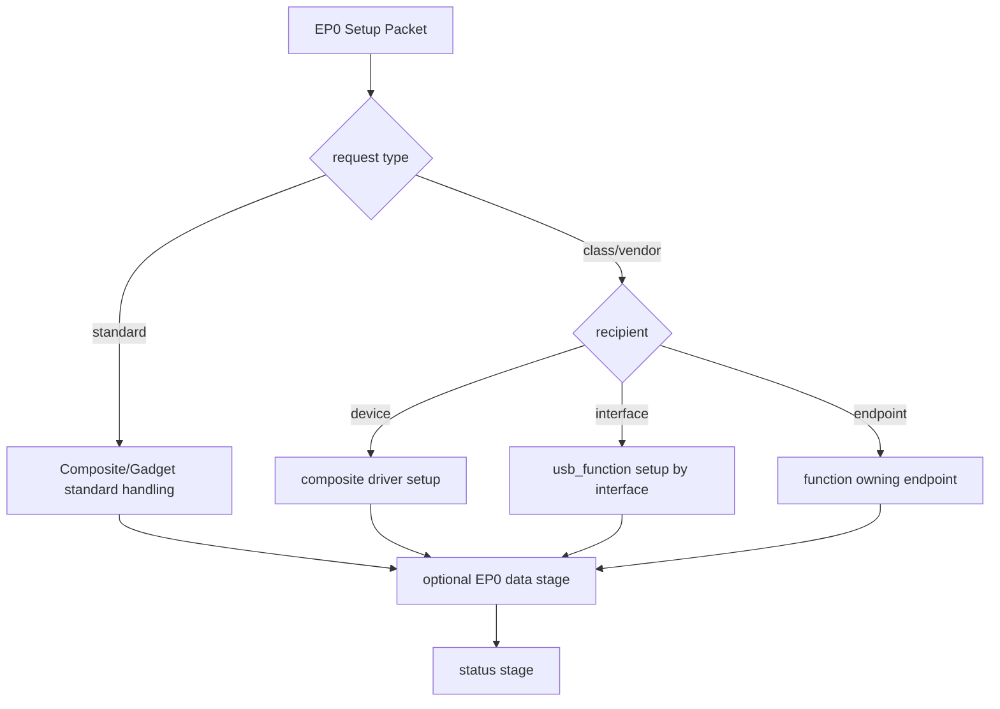

前五篇都站在 Host 一侧：Linux 发现外设、绑定 Interface Driver 并提交 URB。本篇把视角翻转，让开发板成为 USB Device。此时 PC 才是 Host，开发板上的 USB Device Controller 响应 reset、Setup packet 和数据 token。

本文以 Linux 6.12 Gadget Core、Composite Framework 和 ConfigFS 实现为基线。

Linux 把 Device 侧框架称为 Gadget。Gadget 不是“把 Host 驱动反过来写”：Host 主动调度，Device 被动响应；Host 用 URB 描述请求，Device 侧用 `usb_request` 把 buffer 排入 Endpoint；Device 的描述符和控制请求处理决定 Host 最终会绑定什么驱动。

## 一、UDC 把 Device Controller IP 接入 Gadget Core

USB Device Controller，简称 UDC，是 SoC 中工作在 Device 角色的控制器。它负责 EP0 状态机、非零 Endpoint FIFO/DMA、Device 地址、连接/断开、reset、suspend/resume 和中断。

UDC driver 把具体硬件封装成 `struct usb_gadget` 和一组 `usb_ep`。`usb_gadget` 描述速度、Endpoint 列表、控制器能力和当前状态；每个 `usb_ep` 表示 Device 侧 Endpoint 队列。Gadget Core 通过 `usb_ep_enable()`、`usb_ep_queue()`、`usb_ep_dequeue()` 等操作驱动硬件。

设备树通常需要表达 controller、PHY、clock、reset、role 和 VBUS 检测。只有 UDC driver probe 成功并向 Gadget Core 注册后，`/sys/class/udc/` 才出现名字。这个目录存在只证明控制器已注册，不证明 pull-up 已连接、描述符有效或 Host 已完成配置。



这条栈的错误边界与 Host 侧不同：没有 `/sys/class/udc` 先查平台驱动/PHY/clock；UDC 存在但 Host 没有 connect 事件，查 VBUS、pull-up 和 bind；Host 能读取 Device Descriptor 但配置失败，查 EP0/composite/function 描述符；配置成功后无数据，才查 `usb_request` 队列和 Endpoint DMA。

## 二、Composite Framework 组织 Configuration 和 Function

实际 Device 往往同时提供多个功能，例如串口 + 网卡 + HID。Composite Framework 用以下对象组织描述符与生命周期：

- `struct usb_composite_driver`：整个复合 Gadget 的入口，定义 device-level 信息和 `bind()`。
- `struct usb_composite_dev`：一次绑定后的运行实例，拥有 EP0 request、Device Descriptor 和字符串管理。
- `struct usb_configuration`：一套 Configuration，包含供电属性、配置值和 Function 列表。
- `struct usb_function`：一个可组合功能，负责 Interface、Endpoint、Class request 和数据路径。

内核 Gadget driver 可以调用 `usb_composite_probe()` 注册 composite driver。`bind()` 中分配字符串 ID、创建 Configuration，再加入 Function。Function 的 `bind()` 使用 `usb_interface_id()` 分配 Interface 编号，用 `usb_ep_autoconfig()` 按描述符需求选择 UDC 实际 Endpoint。

```c
static struct usb_composite_driver demo_comp_driver = {
    .name = "demo_gadget",
    .dev = &demo_device_desc,
    .strings = demo_strings,
    .max_speed = USB_SPEED_SUPER,
    .bind = demo_comp_bind,
    .unbind = demo_comp_unbind,
};

static int __init demo_init(void)
{
    return usb_composite_probe(&demo_comp_driver);
}
```

Endpoint address不能在源代码中假设固定。不同 UDC 可用 Endpoint 数量、方向和类型不同，autoconfig 根据 Function Descriptor 模板选择匹配 `usb_ep`，再回填 `bEndpointAddress`。High-Speed/SuperSpeed 还需要分别提供 descriptor 与 companion，Composite Framework 会按协商速度选择。

Function 的 `set_alt()` 在 Host 选择 Configuration 或 Alternate 时启用 Endpoint 并启动数据路径；`disable()` 在取消配置、切换或断开时停止队列。若 Function 只在 `bind()` 启用 Endpoint，就会把“描述对象创建”和“Host 已选择该功能”混为一谈。

## 三、EP0 把标准、Class 和 Vendor 请求分发到正确对象

Host reset Device 后，UDC 把 Setup packet 上报 Gadget Core。`bmRequestType` 决定方向、类型和 recipient：Device recipient 的标准请求通常由 composite 处理；Interface/Endpoint recipient 会按 `wIndex` 找到 Function 或 Endpoint；Class/Vendor request 可交给 Function 的 `setup()`。



标准请求有严格状态转换。例如 `SET_ADDRESS` 通常由 UDC hardware/core 协同，在 Status 阶段后生效；`SET_CONFIGURATION` 触发所选 Configuration 的 Function `set_alt()`；Configuration 设为 0 或 disconnect 则调用 `disable()`。

EP0 response 也使用 `usb_request`。Function `setup()` 返回非负长度表示准备了 IN 数据，或为 OUT Data 阶段安排 buffer；返回负错误会让 EP0 stall。请求中的 `wValue/wIndex/wLength` 是 little-endian，必须先转换并校验长度，不能按 struct 强转任意 Host 数据。

Vendor request 的 recipient 应尽量明确。Device recipient 会交给整个 Gadget，Interface recipient 可以路由到 Function。把所有 vendor command 都做成 Device request，会增加复合功能之间的命令冲突。

## 四、ConfigFS 与 FunctionFS 把组装和协议实现移出固定模块

内核内置 composite driver 适合固定产品；ConfigFS 允许用户态通过目录结构组装 Gadget，而底层 Function 实现仍在内核。典型过程是创建 gadget、设置 VID/PID/字符串、创建 Configuration、实例化 Function、建立符号链接，最后写入 UDC 名称完成 bind：

```bash
cd /sys/kernel/config/usb_gadget
mkdir g1 && cd g1
echo 0x1234 > idVendor
echo 0x5678 > idProduct

mkdir -p strings/0x409
echo 0001 > strings/0x409/serialnumber
echo LongWay > strings/0x409/manufacturer
echo "CDC ACM Demo" > strings/0x409/product

mkdir -p configs/c.1/strings/0x409
echo "CDC configuration" > configs/c.1/strings/0x409/configuration
mkdir functions/acm.usb0
ln -s functions/acm.usb0 configs/c.1/
echo "$(ls /sys/class/udc | head -n1)" > UDC
```

写 UDC 是发布边界：在此之前只是构造对象，Host 看不到连接；解绑时先向 UDC 写空字符串，等待 Endpoint 停止，再删除链接和 Function。直接删除仍绑定对象会失败或留下用户进程状态。

FunctionFS 用于用户态实现自定义 Function。内核仍管理 EP0、描述符验证和 Endpoint 文件，用户进程通过 FunctionFS 提交 descriptors/strings、处理 setup event，并对 Endpoint fd 读写。它适合快速迭代私有协议，但进程退出会影响 Function 可用性，产品必须设计 supervisor 和重连策略。

ConfigFS 回答“如何组合已有 Function”，FunctionFS 回答“如何让用户态实现一个 Function”。二者经常一起使用，但不是同一个层次。

## 五、usb_request 是 Device 侧的数据所有权对象

Host 侧驱动提交 URB，Device Function 则从 `usb_ep_alloc_request()` 取得 `usb_request`，设置 buffer、length、complete/context，再用 `usb_ep_queue()` 排入 Endpoint。

```c
req = usb_ep_alloc_request(dev->in_ep, GFP_KERNEL);
if (!req)
    return -ENOMEM;

req->buf = kmalloc(DEMO_BUF_SIZE, GFP_KERNEL);
if (!req->buf) {
    usb_ep_free_request(dev->in_ep, req);
    return -ENOMEM;
}
req->complete = demo_in_complete;
req->context = dev;
```

IN Endpoint 的 buffer 由 Device 准备，Host 发 IN token 时 UDC 发送；OUT Endpoint 的 buffer 必须提前排队，Host 发来的数据才有落点。OUT 没有 request 时，UDC 通常 NAK；若软件长期补充不及时，吞吐会出现明显空洞。



高吞吐 Function 应预分配 request pool，而不是每个 completion 里 `kmalloc()`。IN/OUT pool 深度根据 UDC DMA、Endpoint burst、Host 调度和应用处理抖动确定。request 在 QUEUED/HW_OWNED 时 buffer 不能被应用修改或释放。

某些非 coherent MCU/SoC UDC 需要处理 cache clean/invalidate，Linux DMA API 通常由 UDC driver 负责；Function 不应绕过 `usb_ep_queue()` 直接操作 DMA 地址。若 Function 使用预映射 buffer 或特定 flags，必须遵守 UDC API 的 DMA ownership 约束。

ZLP/short packet 同样是协议边界。IN 消息长度恰为 max packet size 整数倍且协议用 short 表示结束时，Function 可能需要 `req->zero = 1`；OUT completion 的 `actual` 可能小于 `length`，应用必须按消息协议解析。

## 六、suspend、remote wakeup、role switch 与解绑

Host suspend 总线时，Gadget/Function 收到 suspend 通知。Function 应停止不必要生产，保留可恢复状态。若描述符声明 remote wakeup 且 Host 已启用，Gadget 可以在允许条件下请求唤醒；不能因为设备有事件就无条件拉起链路。

Dual-role controller 在 Host/Device 间切换时，UDC 可能被注销，现有 Gadget 必须完整解绑。Type-C role、`usb-role-switch`、extcon/TCPC 和 controller `dr_mode` 共同决定角色；应用不应仅通过“写 UDC 名字”强行与硬件角色冲突。

安全停止顺序是：阻止 Function 产生新 request，disable Endpoint，等待/处理所有 shutdown completion，释放 request pool，最后 unbind composite。completion 仍可能在 disable 期间到达，因此 Function 私有对象必须活到所有 request 返回。

描述符也会影响电源行为。`bmAttributes` 声明 remote wakeup capability，`bMaxPower` 声明配置功耗；Host 是否允许、实际电源路径是否满足，则由平台和策略决定。

## 七、从 UDC 到 Class 数据的分层 Bring-up

Gadget 调试按以下阶梯进行：

1. `/sys/class/udc` 存在，确认 controller/PHY/clock/reset probe。
2. bind 后 Host 出现 connect/reset，确认 VBUS、role、pull-up 和线材。
3. Host 能读取 Device Descriptor，确认 EP0 IN response。
4. Configuration 全量读取成功，确认 `wTotalLength`、Interface/Endpoint 和速度 descriptor。
5. `SET_CONFIGURATION` 后 Function `set_alt()` 被调用，Endpoint enable 成功。
6. Class/Vendor control request 正确路由，Status 阶段完成。
7. IN/OUT request pool 持续运行，disconnect/disable 后全部收敛。

Device 侧可以同时观察 UDC debug、Function 日志和 Host usbmon/Wireshark。Host 报 “device descriptor read/64 error” 时，问题仍在 EP0 或链路；Host 已绑定 `cdc_acm` 但无数据，转向 Function Endpoint queue；`SET_CONFIGURATION` stall 则检查 `set_alt()` 和 Endpoint autoconfig。

```bash
ls /sys/class/udc
ls -l /sys/kernel/config/usb_gadget/g1
dmesg -w
lsusb -v -d 1234:5678
```

**参考资料**

- [USB Gadget API for Linux](https://docs.kernel.org/driver-api/usb/gadget.html)
- [Linux USB Gadget ConfigFS](https://docs.kernel.org/usb/gadget_configfs.html)
- [USB 2.0 Specification - USB-IF](https://www.usb.org/document-library/usb-20-specification)

## 八、Composite Function 的 bind、set_alt 与 disable

`usb_function` 不是一组静态描述符。

它还定义 Function 在 Configuration 中分配 Interface/Endpoint、响应模式切换和停止数据面的生命周期。

`bind()` 在组装阶段取得 Interface ID、自动配置 Endpoint 并准备描述符。

Host 选择 Configuration/Alternate Setting 后，`set_alt()` 启用对应 Endpoint 并开始排队 `usb_request`。

`disable()` 必须停止排队、使 completion 收敛并让 Function 回到可再次 set_alt 的状态。



Function 不能假设 `set_alt()` 只调用一次。

Host 可以重设 Configuration、切换 Alternate Setting 或在 reset 后重新配置。

## 九、EP0 setup 的接收者决定分发边界

Setup Packet 的 `bmRequestType` 同时编码方向、类型和接收者。

Gadget Core/Composite 层先处理标准 Device/Configuration 请求。

Interface Recipient 的 Class/Vendor Request 再按 `wIndex` 的 Interface Number 分发给 Function。

Endpoint Recipient 则需要定位 Endpoint 所属 Function。



setup 回调必须验证 `wLength`、方向与接收者。

Host 提供的长度不可信，不能让它越过 EP0 缓冲。

延迟状态阶段需要使用 Composite Framework 规定的返回语义，不能让 Host 无限等待。

## 十、usb_request 的所有权转移

Device 侧使用 `usb_ep_alloc_request()` 分配 Request。

Function 填充 `buf`、`length`、`complete`、`context` 后调用 `usb_ep_queue()`。

queue 成功到 completion 返回期间，UDC 数据路径拥有 Request 与缓冲。

Function 不能修改在途缓冲，也不能释放 Request。

disable/unbind 时使用 `usb_ep_dequeue()` 或 Endpoint disable 让在途 Request 以取消状态完成。

completion 依据 enabled/online 状态决定重新排队还是回收。

这与 Host 侧 URB 所有权模型对称，但 API 和角色不同。

## 十一、ConfigFS 改变组装策略而非协议责任

ConfigFS 可以创建 Gadget、填写 VID/PID/字符串、创建 Configuration、实例化 Function，并通过符号链接组合。

最后把 Gadget 名写入 `UDC` 属性才真正绑定控制器。

ConfigFS 解决的是运行时组装，不会替 Function 实现协议状态机。

FunctionFS 进一步允许用户空间处理自定义 Function 的描述符、setup 与数据 Endpoint。

内核仍管理 UDC、EP0 公共状态与 Endpoint 文件，用户进程必须正确处理断开、重新绑定和短 I/O。

FunctionFS 进程退出会影响该 Function 可用性，产品设计要定义守护、重启和 Host 已连接时的恢复策略。

## 十二、角色切换和解绑的停止顺序

Dual-role 控制器从 Device 切到 Host 前，必须先让 Gadget 与 UDC 解绑定。

推荐顺序：

1. 阻止 Function 新 queue。
2. disable 所有活动 Function/Endpoint。
3. 等待 completion 与用户空间 FunctionFS I/O 收敛。
4. 断开 pull-up，让 Host 观察 disconnect。
5. 解除 Gadget 与 UDC 绑定。
6. 停止 Device Controller。
7. 切换 PHY、VBUS 与控制器角色。

跳过前几步会让旧 Device Request 在控制器已进入 Host 模式后访问寄存器或 DMA。

## 十三、Linux 6.12 一手资料与源码入口

重点源码：

- `drivers/usb/gadget/udc/core.c`
- `drivers/usb/gadget/composite.c`
- `drivers/usb/gadget/configfs.c`
- `drivers/usb/gadget/function/f_fs.c`
- `include/linux/usb/gadget.h`

一手资料：

- [Linux 6.12 Gadget API](https://www.kernel.org/doc/html/v6.12/driver-api/usb/gadget.html)
- [Linux Gadget ConfigFS](https://docs.kernel.org/usb/gadget_configfs.html)
- [Linux stable composite.c](https://git.kernel.org/pub/scm/linux/kernel/git/stable/linux.git/tree/drivers/usb/gadget/composite.c?h=linux-6.12.y)
- [USB 2.0 Specification](https://www.usb.org/document-library/usb-20-specification)

## 十四、小结

Gadget 框架把 Device 侧分为 UDC hardware adapter、Gadget Core、Composite Configuration/Function 和应用。EP0 负责 Host 对设备的控制，非零 Endpoint 通过 `usb_request` 队列搬运数据；`set_alt()`、`disable()`、suspend 和 unbind 则定义 Function 生命周期。

只有描述符、控制请求和数据 request 三条路径同时正确，Host 才会看到一个可用设备。下一篇将以 HID、CDC、MSC、UVC 和 UAC 为例，比较不同 USB Class 如何在相同框架上组织控制面和数据面。
