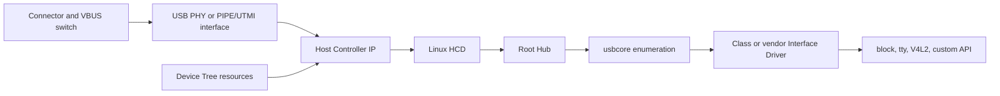
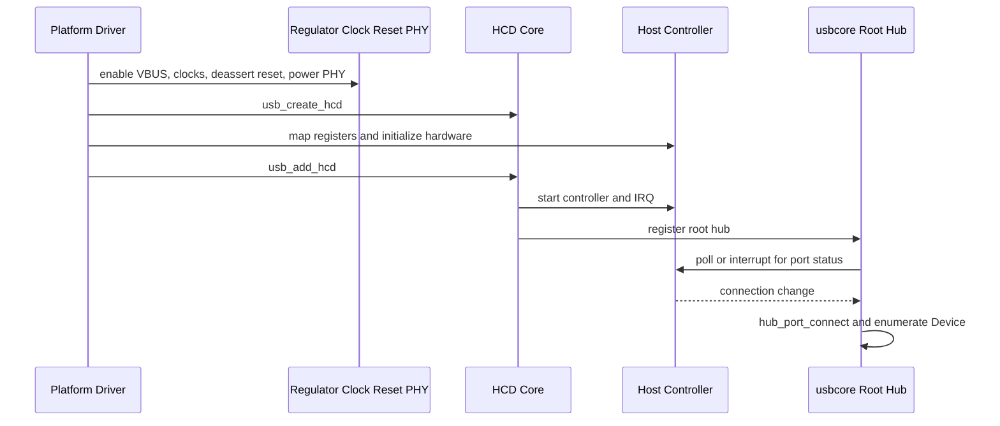
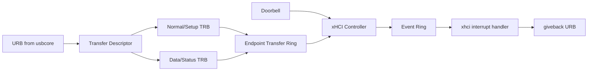
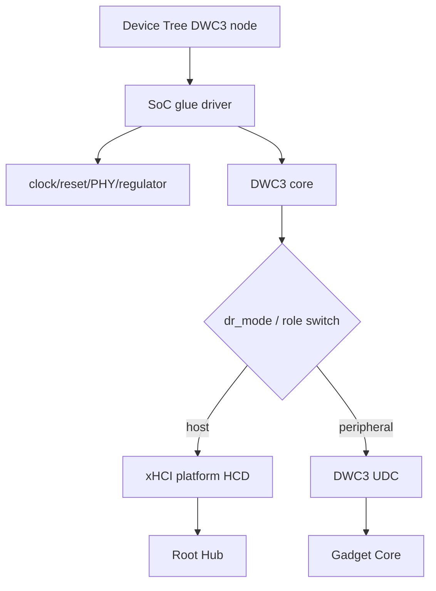
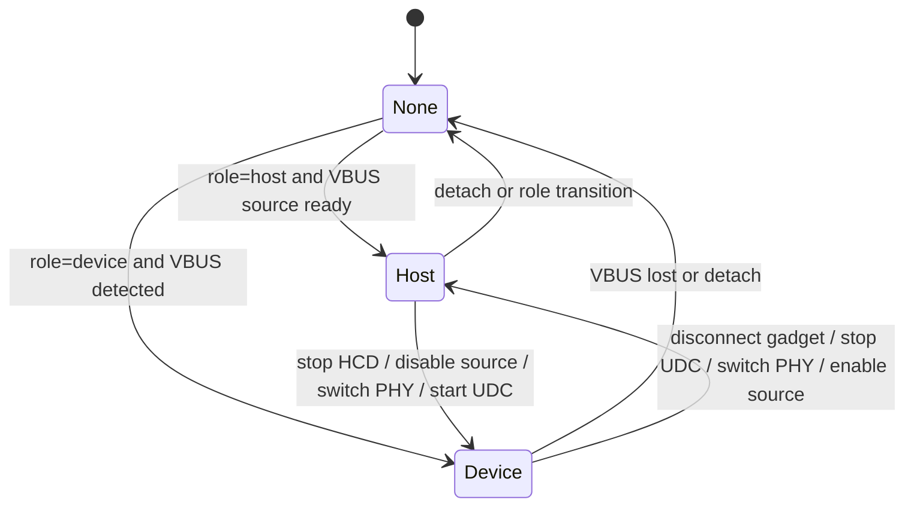

前面的文章默认 Host Controller 已经工作。本篇处理更靠近 BSP 的问题：新板第一次插入 U 盘时没有任何反应，应该从哪里开始？答案不是先改 USB Class Driver，而是证明从连接器到 root hub 的每一层都已建立。

本文的 HCD、DWC3 与设备树语义固定以 Linux 6.12 为基线。

Host Bring-up 横跨原理图、供电、PHY、clock/reset、控制器 Device Tree、平台驱动和 HCD。只要其中一层未初始化，usbcore 就收不到端口变化，也不会创建 `usb_device`。

## 一、从连接器到 Class Driver 的完整链路

一条可用 Host 通路包含：连接器和 VBUS power switch、USB PHY、Host Controller IP、clock/reset/power domain、平台驱动、HCD、root hub、usbcore、Interface Driver 和用户 API。



连接器形态必须与角色一致。Type-A 通常用于固定 Host；Type-B/Micro-B 常用于 Device；Type-C 通过 CC 协商角色并可能需要 mux。OTG/Micro-AB 还涉及 ID pin。原理图中把 D+/D- 接上并不等于 Host 角色已经成立。

VBUS 由 regulator 或 load switch 提供，常带 enable 与 over-current。设备树 `vbus-supply` 将控制器/PHY 与 regulator 关联。没有 VBUS，Device 不会正常连接；一直强开 VBUS 又可能在 Device 角色或 Type-C 冲突时造成双向供电风险。

PHY 负责模拟收发、速度检测和电气状态，可能是 SoC 内置 USB2 PHY、独立 USB3 PHY 或组合 PHY。需要 reference clock、reset、power supply、校准和 mode。USB3 还要确认 TX/RX lane、polarity、Type-C orientation mux 和 PIPE interface。

## 二、EHCI、xHCI、DWC2 与 DWC3 的软件边界

EHCI 是 USB 2.0 High-Speed Host Controller 规范。很多控制器还需要 companion controller 管理 Low/Full-Speed；嵌入式平台也可能通过内部 transaction translator 统一处理。Linux 通用 EHCI 核心位于 `ehci-hcd`，平台 glue 负责 clock、PHY 和寄存器差异，设备树 compatible 有时使用 `generic-ehci`。

xHCI 统一管理 USB 2.0 与 SuperSpeed root hub 逻辑，使用 command ring、event ring、transfer ring 和 TRB。Linux 常会为一个 xHCI controller 注册两个 roothub：一个面向 USB2 端口，一个面向 USB3 端口。只看到 USB2 root hub 并不能证明 SuperSpeed PHY/port 已工作。

DWC2 是常见 USB2 Dual-Role Controller，可在 Host 与 Device 模式工作；DWC3 面向 USB3 Dual-Role，常与 xHCI Host core 和 Gadget Device core 组合。厂商 glue driver 负责 mode、PHY、clock/reset、quirk，再创建/驱动子设备。把 DWC3 与 xHCI 当成互斥概念会误读日志：DWC3 是 IP 集成，Host 模式可能由 xHCI HCD 驱动。

控制器 IP 决定 HCD 数据结构和 debug register，但 usbcore 以上保持统一。Bring-up 先验证 HCD/root hub，再讨论 Class Driver。

## 三、设备树必须完整描述依赖资源

不同 SoC binding 不同，以下示例只展示常见关系，不能直接复制 compatible 和寄存器：

```dts
usb_host0: usb@fe800000 {
    compatible = "vendor,soc-usb-host";
    reg = <0x0 0xfe800000 0x0 0x10000>;
    interrupts = <GIC_SPI 120 IRQ_TYPE_LEVEL_HIGH>;
    clocks = <&cru ACLK_USB>, <&cru HCLK_USB>;
    clock-names = "aclk", "hclk";
    resets = <&cru SRST_USB>;
    reset-names = "usb";
    phys = <&usb2phy0>;
    phy-names = "usb2-phy";
    vbus-supply = <&vcc5v0_usb>;
    dr_mode = "host";
    status = "okay";
};
```

`reg` 和 IRQ 错误会让平台 probe 失败或中断不增长；clock/reset 缺失可能导致寄存器读写为固定值；`phys/phy-names` 错误会让 controller 初始化成功但端口永远没有 connect；`dr_mode` 错误会启动 Gadget 或 role-switch 路径；`status = "disabled"` 会让节点根本不创建设备。

PHY 节点可能包含 port child、clock output、VBUS detection 和 orientation switch。`usb-role-switch` 属性表示角色由外部 role-switch consumer/provider 控制，常与 Type-C controller、extcon 或 connector graph 关联。固定 Host 板不应无意义地引入动态角色状态机。

设备树修改后必须确认运行内核实际加载的新 DTB：

```bash
tr -d '\0' < /sys/firmware/fdt | strings | grep -A4 usb@fe800000
ls -l /sys/bus/platform/devices | grep fe800000
```

只检查源码 DTS 不足以证明 bootloader 选择了该 DTB。

## 四、平台 probe 如何创建 HCD 和 root hub

典型 Host 平台驱动先启用 regulator/clock、释放 reset、初始化 PHY，再申请 HCD：

```c
hcd = usb_create_hcd(&demo_hc_driver, &pdev->dev,
                     dev_name(&pdev->dev));
if (!hcd)
    return -ENOMEM;

hcd->regs = devm_platform_ioremap_resource(pdev, 0);
if (IS_ERR(hcd->regs)) {
    ret = PTR_ERR(hcd->regs);
    goto err_put;
}

ret = usb_add_hcd(hcd, irq, IRQF_SHARED);
if (ret)
    goto err_put;
```

`usb_create_hcd()` 分配并初始化 `struct usb_hcd` 软件对象，还没有让控制器开始服务。驱动设置寄存器、资源和私有字段后调用 `usb_add_hcd()`；后者请求/启用控制器、注册 bus 和 root hub，使 usbcore 能通过虚拟 Hub Control 请求读取端口状态。



root hub 不是外部芯片，而是 HCD 对 controller root ports 的软件表示。`lsusb -t` 先看到 root hub，才能期待下游 Device。remove 时顺序相反：`usb_remove_hcd()` 停止 root hub 和调度，再释放 HCD，最后关闭 PHY/clock/VBUS。

平台 devm 资源可以减少错误路径代码，但不能决定停机顺序。必须先停止 HCD 对寄存器和 DMA 的访问，再让 devm unmap/clock disable。

## 五、角色、电源与 PHY 状态必须一致

Dual-role 系统中，`dr_mode`、role switch、Type-C Data Role、VBUS source/sink 和 controller mode 必须形成一致状态。例如角色切到 Host 时，应先确认端口成为 source、打开 VBUS、设置 PHY Host mode，再启动 HCD；切到 Device 时先停止 HCD/断开下游，再关闭 source，启动 UDC 并等待外部 VBUS。

不一致会产生典型现象：

- HCD/root hub 存在，但 VBUS 关闭，插入无 connect。
- VBUS 打开，controller 仍在 Device mode，没有 Host transaction。
- USB2 正常，SuperSpeed lane mux 方向错误，只能 High-Speed。
- role 在抖动，HCD 与 UDC 反复注册，日志不断 connect/disconnect。

runtime PM 也会关闭 PHY/clock。wake capability 和 port power 策略应允许连接变化唤醒 Host；否则 suspend 后插入 Device 没有 IRQ。Bring-up 初期可以固定电源定位，但最终必须恢复 PM 测试。

## 六、用日志和寄存器证明每一层

第一轮检查：

```bash
dmesg | grep -Ei 'usb|xhci|ehci|dwc|phy|vbus|regulator'
lsusb -t
ls -l /sys/bus/platform/drivers/*usb* 2>/dev/null
cat /proc/interrupts | grep -Ei 'xhci|ehci|dwc|usb'
```

正常顺序通常是平台/PHY probe、HCD 注册、root hub 出现、端口连接、Device 速度和地址、Interface Driver。没有平台设备说明 DT/driver match；probe defer 说明 regulator/clock/PHY provider 未就绪；HCD 注册失败看 IRQ、寄存器和 reset；root hub 存在但无连接回到 VBUS/PHY/port。

控制器 debug register 提供更底层证据：xHCI 看 USBCMD/USBSTS、PORTSC、ring/event；EHCI 看 USBCMD/USBSTS/PORTSC 和 async/periodic schedule；DWC 看 mode、interrupt、port 和 PHY status。寄存器位随 IP 版本变化，必须对照对应 TRM，不在通用驱动中硬编码猜测。

中断计数不增长时确认 controller IRQ 是否正确路由、触发类型是否匹配、硬件 interrupt enable 是否设置。计数增长但 usbcore 无事件，检查 HCD handler 是否清错状态或 event ring/port change 处理。

## 七、典型故障与验收阶梯

**插入没有任何日志。** 先测 VBUS，再看 PHY line state/port status，确认 HCD/root hub 已存在。若 port status 有 connect 但内核无日志，查 HCD IRQ；port status 也没有，查 connector/PHY。

**root hub 正常但所有设备 `-71`。** `-EPROTO` 对所有设备同时出现，更可能是 PHY mode、clock、信号或 controller 初始化，而不是每个 Device 固件。比较另一端口/速度和示波证据。

**USB2 正常但 USB3 不出现。** 检查 USB3 PHY、PIPE clock/reset、TX/RX lane、Type-C orientation mux 和 xHCI USB3 roothub/port。不要因为同一连接器的 USB2 companion 正常就排除 SuperSpeed 硬件问题。

**冷启动失败，热重启成功。** 重点查 power/reset/clock/PHY 时序、regulator ramp、firmware calibration 和 probe defer。增加固定 sleep 只能验证时序敏感，最终应由 reset/clock ready 条件或 binding 依赖解决。

验收从低到高：root hub 注册；Low/Full/High-Speed Device；SuperSpeed Device；外部 Hub 多设备；大流量；runtime suspend/wakeup；角色切换；冷热启动；过流/拔插；长时间错误计数。每级失败都保留当前层证据。

**参考资料**

- [Host Controller APIs in Linux USB documentation](https://docs.kernel.org/driver-api/usb/usb.html#host-controller-apis)
- [Linux USB Power Management](https://docs.kernel.org/driver-api/usb/power-management.html)
- [USB 2.0 Specification - USB-IF](https://www.usb.org/document-library/usb-20-specification)

## 八、xHCI 用 Ring、TRB 与 Event Ring 承载请求

xHCI Driver 不把一个 URB 直接对应成单个硬件描述符。

它把 Transfer 分解为 Transfer Request Block（TRB），放入每个 Endpoint 的 Transfer Ring。

控制器消费 TRB，通过 Event Ring 报告命令、传输与端口状态事件。



Command Ring 用于配置 Slot、Endpoint、Address Device 等控制器命令。

DCBAA、Device Context 与 Endpoint Context 保存控制器可见状态。

驱动调试时要区分 USB 协议错误与 xHCI ring/context 错误。

Host Controller 停止、Event Ring 不前进或 Doorbell 未生效，会让所有上层 Class 都表现超时。

## 九、DWC3 是 Controller Core，角色 glue 负责平台集成

DWC3 IP 可以工作在 Host、Device 或 OTG/dual-role 模式。

Host 模式通常创建/连接 xHCI 平台设备，让 xHCI HCD 管理 Host 数据面。

Device 模式注册 DWC3 UDC，进入 Gadget Core。

平台 glue 驱动负责 SoC 特有 clock、reset、PHY、syscon、电源域与 role switch。



`dr_mode = "host"` 只表达期望角色，不会自动修复缺失 VBUS regulator 或 PHY。

`dr_mode = "peripheral"` 时也要保证 Device 侧能检测 VBUS/session，并正确控制 pull-up。

dual-role 系统还需要 Type-C Port Controller、extcon 或 `usb-role-switch` 提供角色事实。

## 十、设备树资源具有依赖和时序

常见属性/资源：

- `reg` 与中断。
- `clocks`、`clock-names`。
- `resets`、`reset-names`。
- `phys`、`phy-names`。
- `power-domains`。
- `vbus-supply`。
- `dr_mode`。
- `maximum-speed`。
- `usb-role-switch`。

资源 provider 尚未 probe 时，consumer 应返回 `-EPROBE_DEFER`。

把 defer 当成永久错误会让控制器在启动顺序变化时偶发缺失。

反之，无限 defer 表示依赖 phandle、provider 驱动或配置缺失，需要检查 deferred probe 列表。

设备树描述硬件连接，不应包含 Linux 私有“先 sleep 100 ms”式补丁来掩盖电源时序。

真正需要的上电/复位延迟应由 binding、regulator、PHY 或硬件数据手册表达。

## 十一、VBUS、PHY 和角色必须形成闭环

Host 角色应驱动 VBUS 并监测过流。

Device 角色不应与外部 Host 同时驱动 VBUS。

Type-C 角色还受 CC/PD 协商结果约束。



角色切换不是只改一个寄存器。

旧角色的 HCD/UDC、Endpoint、DMA 和用户接口必须先停止，再切 PHY 与电源，最后启动新角色。

## 十二、Runtime PM 不能让端口事件消失

控制器 runtime suspend 前要保证没有活动请求，或硬件能保留必要唤醒检测。

Root Hub/port wakeup、远程唤醒与平台电源域必须协同。

若电源域关闭后连接检测也消失，插入设备无法唤醒控制器。

resume 顺序通常是电源域、clock、reset/PHY、Controller State、IRQ/Event Ring、Root Hub 状态。

顺序错误会出现恢复后第一次传输超时、端口假断开或 xHCI context state error。

## 十三、Bring-up 的验收证据

按以下顺序验收：

1. 原理图确认 VBUS 开关、过流、差分线、Type-C/ID/CC 连接。
2. regulator、clock、reset、PHY provider 均成功 probe。
3. Controller 平台驱动成功，`usb_add_hcd()` 完成。
4. `/sys/bus/usb/devices/usbN` Root Hub 出现。
5. Port status 能响应插拔。
6. Low/Full/High/SuperSpeed 已知设备分别枚举。
7. suspend/resume 与冷启动重复通过。
8. 压力 I/O 无 xHCI、IOMMU 或 AER 类错误。

每一步都有可观察证据，后一步不能替代前一步。

## 十四、Linux 6.12 一手资料与源码入口

重点源码：

- `drivers/usb/core/hcd.c`
- `drivers/usb/host/xhci*.c`
- `drivers/usb/dwc3/core.c`
- `drivers/usb/dwc3/host.c`
- 对应 SoC glue 与 PHY Driver

一手资料：

- [Linux 6.12 USB HCD API](https://www.kernel.org/doc/html/v6.12/driver-api/usb/usb.html#host-side-api-for-usb)
- [Linux Devicetree DWC3 binding](https://docs.kernel.org/devicetree/bindings/usb/snps,dwc3.yaml)
- [Linux stable xHCI source](https://git.kernel.org/pub/scm/linux/kernel/git/stable/linux.git/tree/drivers/usb/host/xhci.c?h=linux-6.12.y)
- [USB 3.2 Specification](https://www.usb.org/document-library/usb-32-revision-11-june-2022)

## 十五、小结

USB Host Bring-up 是一条从 VBUS/connector、PHY、clock/reset、Controller IP、Device Tree、平台驱动、HCD 和 root hub 到 usbcore 的依赖链。`usb_create_hcd()` 建立软件对象，`usb_add_hcd()` 才把控制器和 root hub 交给 USB Core。

只有 root hub、端口状态、速度、枚举和 Interface Driver 逐层通过，才能把问题交给上层协议。下一篇将把视角移到 MCU，分析资源受限环境如何用 CherryUSB 实现 Device 与 Host 栈。
