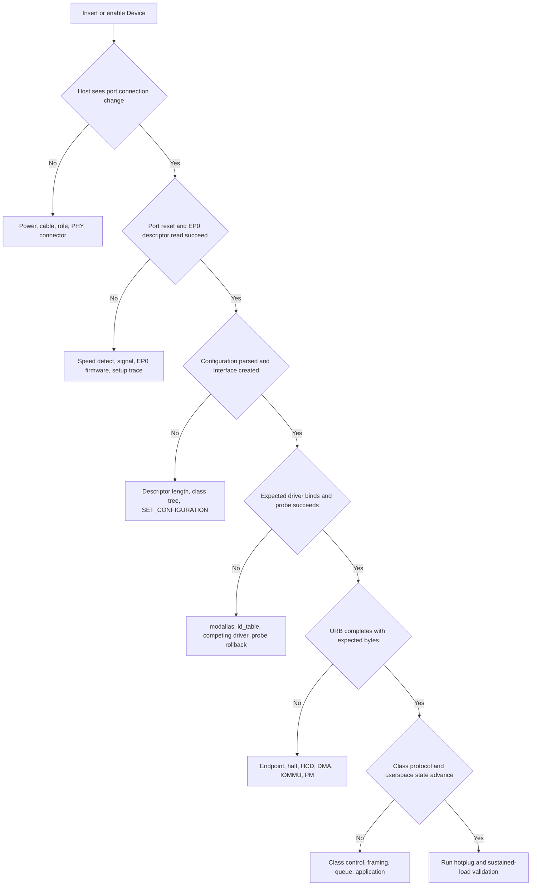
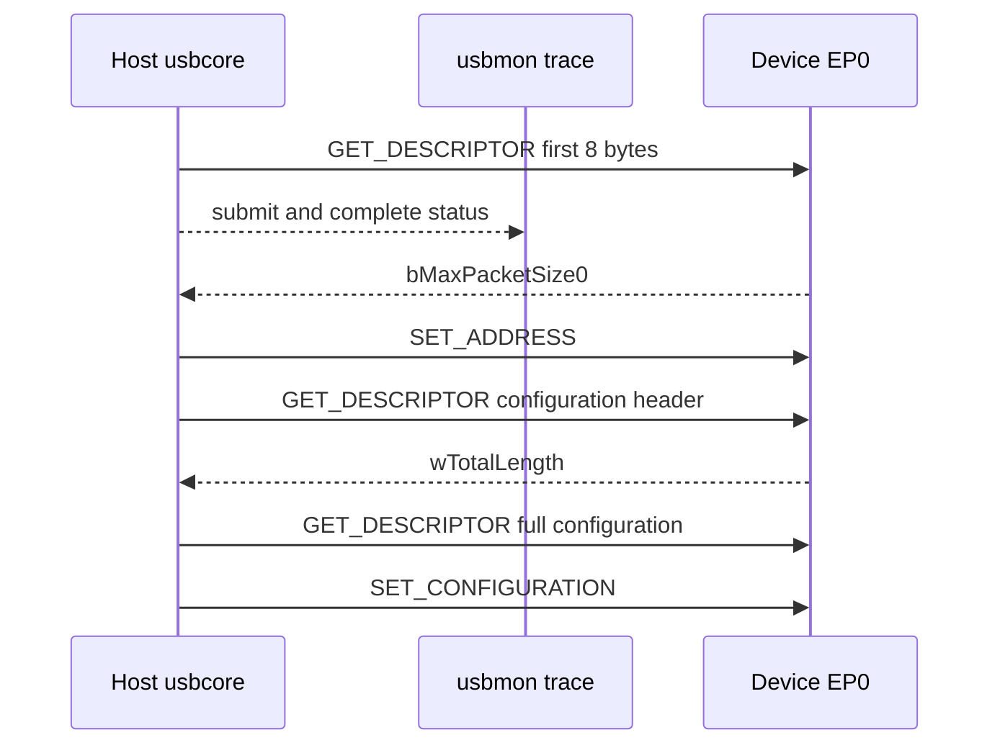
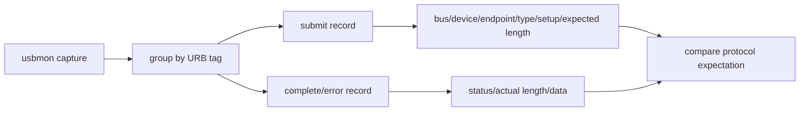
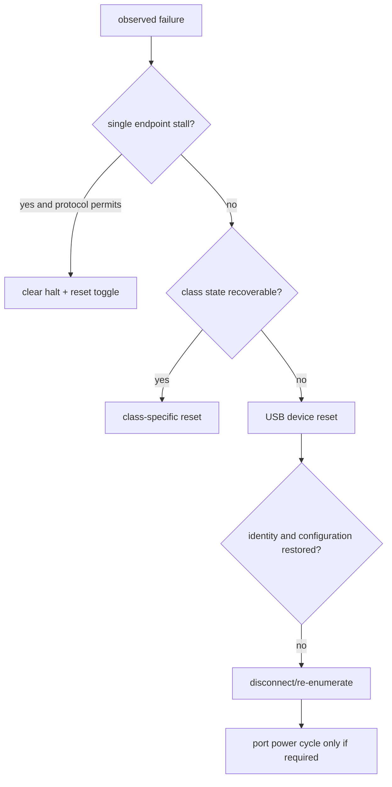
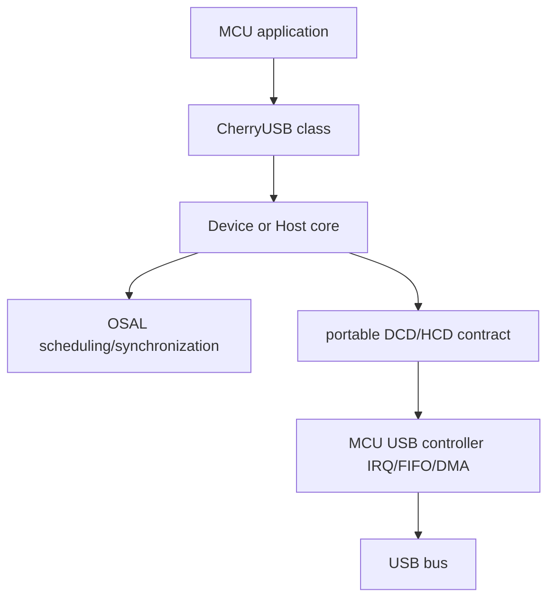

USB 故障难排，不是因为某个 API 隐蔽，而是一次业务操作会跨越多层：连接器与供电、角色和 PHY、Host Controller、EP0、描述符、Interface Driver、URB、Class 协议、用户 API。跳过前层直接修改后层，只会让现象变化，不能证明根因。

本文的 Linux 工具、路径和错误语义固定以 Linux 6.12 为基线；文末再与固定版本 CherryUSB 的 MCU 架构对照。

本篇不罗列“试试换线、重载驱动”之类经验，而是为每一层定义入口证据、检查手段、可能结果和进入下一层的条件。

## 一、先冻结环境并建立故障证据树

在比较之前记录：Host 硬件、内核版本、Device 固件、端口/Hub、线缆、供电方式、目标速度、是否经过 Type-C/role switch、复现步骤和最后一个正常版本。否则两次实验可能根本不是同一系统。



每个菱形都是停止点。没有连接变化时，不应检查 `id_table`；Device Descriptor 读取失败时，不应修改 UVC 应用；URB 已正确完成而应用无数据时，才进入 Class/用户态。

日志要带时间关联。保存 `dmesg -w`、usbmon、应用日志和必要的示波/协议分析结果，使用同一复现时间窗对齐，而不是从长日志中挑几个看似相关的错误。

## 二、第一层：供电、角色、连接器和 PHY

插入 Device 后完全没有日志，先判断 VBUS 和角色。Host port 应提供规范允许的 VBUS，Device 应在检测到 VBUS 后连接 pull-up/termination。Dual-role Type-C 端口还需要 CC/TCPC 正确确定 Data Role；`dr_mode = "host"`、`"peripheral"` 或 `"otg"` 必须与硬件和 role switch 一致。

检查项包括：

- VBUS 电压、限流开关、过流信号和 regulator enable。
- D+/D- 或 SuperSpeed lane 是否接反、短路、ESD 器件/共模电感是否适配。
- Device pull-up/termination 是否在正确时机出现。
- PHY reference clock、reset、power domain 和 calibration 是否完成。
- Type-C CC 方向与 mux 是否把 SuperSpeed lane 接到当前插入方向。

USB 2.0 设备被识别成错误速度，会在最早 packet 就出现错误。High-Speed chirp/handshake 失败可能退回 Full-Speed；SuperSpeed link 失败则可能只剩 USB 2.0 companion device。`lsusb -t` 的速度是重要证据，不能只看连接器标有“USB 3.0”。

反复 connect/disconnect 可能是 VBUS 压降、接触不良、PHY margin、Device watchdog reset 或 Host 主动 reset。观察端口状态和 Device reset pin/电源，区分物理断开与协议层 reset。

## 三、第二层：EP0、枚举和描述符

出现连接日志但没有 VID/PID，问题集中在 port reset、地址 0 和 EP0。使用 usbmon/Wireshark 查看 Setup packet：Host 是否发 `GET_DESCRIPTOR(Device)`，Device 是否返回 8 字节，`bMaxPacketSize0` 是否合理，随后 `SET_ADDRESS` 和完整配置读取是否发生。

错误码要结合请求阶段：

- `-EPROTO` / `-EILSEQ`：协议/CRC/bitstuff/handshake 异常，可能来自信号、错误速度或 Device EP0 状态机。
- `-ETIMEDOUT`：请求长期没有完成，需要判断 Device 是持续 NAK、完全无响应还是 HCD 停止。
- `-EPIPE`：Device stall，标准请求不受支持或状态机错误。
- `device descriptor read/64, error -71`：通常仍早于 Interface Driver。

Configuration 能读取但解析失败，检查每条 `bLength`、`wTotalLength`、Interface/Endpoint 数、Alternate 和 companion。用 `lsusb -v` 解码后仍应回看原始字节，因为工具可能在损坏边界后停止。



usbmon 中 submit 有但 complete 没有，说明请求仍未返回；complete 有负 status，按错误分类；complete 为 0 但长度/数据错误，则进入 Device 固件和描述符内容。

## 四、第三层：驱动绑定、URB 和 Class 协议

Interface 已创建后，用 `lsusb -t`、sysfs `modalias` 和 driver symlink 判断绑定：

```bash
lsusb -t
cat /sys/bus/usb/devices/1-1:1.0/modalias
readlink /sys/bus/usb/devices/1-1:1.0/driver
```

没有绑定时检查 ID 表、module alias、driver_override、黑名单和竞争驱动。手工 unbind/bind 只能用于验证匹配，不应作为产品启动流程。`probe()` 被调用但返回失败，必须保留第一处错误码；后续“设备节点不存在”只是结果。

进入 URB 层后记录 Endpoint 地址、pipe、length、status、actual_length、提交/完成时间和 in-flight。`usb_submit_urb()` 返回 0 只表示排队成功。Bulk IN 长期 NAK 可能是 Device 尚未收到启动命令；`-EPIPE` 可能是协议状态不允许当前操作；short packet 可能是合法消息边界。

Class 层需要专用证据：

- HID：Report Descriptor 与原始 report 是否一致。
- CDC ACM：DTR/RTS、line coding、Data Interface Bulk Endpoint 和 SerialState。
- MSC：CBW/CSW tag、residue、status 与 SCSI sense。
- UVC：Probe/Commit、Alternate、UVC payload FID/EOF、Iso packet status。
- UAC：Clock/format/Alternate、feedback endpoint 和 ALSA xrun。

用户 API 也可能形成背压。V4L2 应用未及时 queue buffer、ALSA hw params 不匹配、TTY line discipline 或自定义 read FIFO 满，都能使 USB 层看似“没有新数据”。因此 URB 已完成后要继续检查数据是否被上层消费。

## 五、第四层：HCD DMA、IOMMU、cache 与电源管理

Interface Driver 的 URB 会被 HCD 转换为控制器描述符并通过 DMA 访问内存。IOMMU fault 中的 requester/IOVA 可证明控制器访问了未映射地址，常见根因包括 transfer buffer 已释放、长度越界、控制器 reset 后继续使用旧 ring 或 DMA mask/映射错误。

在非 coherent 架构中，HCD 和 DMA API 负责 cache ownership。厂商 HCD 若漏做 sync，可能只在压力下出现旧数据或 descriptor 未更新。不要在 Interface Driver 中随意 `dma_sync_*` 修补 HCD bug；先确认 buffer API 和 ownership 边界。

dynamic_debug 和 tracepoint 可以建立软件时间线：

```bash
echo 'file drivers/usb/core/* +p' | \
  sudo tee /sys/kernel/debug/dynamic_debug/control
sudo trace-cmd record -e usb -e irq -e workqueue sleep 10
```

KASAN 发现 use-after-free/越界，lockdep 发现锁顺序，kmemleak 辅助发现泄漏。它们与 usbmon 互补：usbmon 证明总线请求，sanitizer 证明内核内存/并发错误。

runtime autosuspend 会让“设备仍插着但暂时不可访问”成为正常状态。低负载偶发首包超时，应记录 runtime status、autosuspend delay、suspend/resume callback 和远程唤醒，而不是永久关闭 PM 后宣称问题解决。

热插拔/复位压力是独立场景。disconnect 必须阻止 resubmit、kill URB、取消 work/timer，并让 open file 安全失败。只有正常数据流压力不能覆盖 teardown 竞态。

## 六、工具分别能证明什么

| 工具 | 主要证据 | 不能单独证明 |
| --- | --- | --- |
| `dmesg` | 内核阶段、错误码、bind/reset | 线上的精确 packet |
| `lsusb -v/-t` | 描述符解析、拓扑、速度、driver | 运行时每次 transfer |
| usbmon | URB submit/complete、Setup、长度/status | PHY 波形与 Device 内部状态 |
| Wireshark | 协议字段、Class transaction 解码 | 内核锁和对象寿命 |
| dynamic_debug/tracepoint | 内核调用和时间线 | 电气质量 |
| KASAN/lockdep | 内存安全与锁问题 | USB 协议正确性 |
| IOMMU fault | DMA 地址、方向、requester | 上层协议是否正确 |
| 协议分析仪 | 总线 packet、时序、握手 | Linux 内部软件状态 |
| 示波器 | 电压、眼图、reset/clock | 描述符与驱动绑定 |

协议分析仪成本较高，适合 Host 与 Device 软件证据矛盾、需要看到重试/握手/时序或 SuperSpeed training 的情况。使用前先通过 usbmon 确认问题确实在 Host 软件证据之外。

## 七、三个典型问题的闭环推导

**设备只能 Full-Speed。** 先确认 Device Descriptor 与 Endpoint 是否只支持 FS，再检查 High-Speed chirp、PHY mode 和线材。若同一硬件在另一 Host 为 High-Speed，比较 Host PHY/port；若所有 Host 都为 FS，检查 Device PHY/固件。不要用 Bulk 吞吐反推速度，直接看拓扑和握手证据。

**UVC 能列格式但开流失败。** 枚举和描述符层已基本通过，继续看 Probe/Commit 返回、所选 Alternate、`usb_set_interface()` 是否 `-ENOSPC`、Iso URB status 和 payload header。若 URB 完成但无 frame，检查 FID/EOF 和 V4L2 buffer；若 URB 不完成，回到 Endpoint/HCD。

**压力下拔出偶发崩溃。** 记录 disconnect、URB completion、work/timer 和 file release 顺序，启用 KASAN。确认 disconnect 先置 disconnected 再阻止新提交，`usb_kill_anchored_urbs()` 后才释放 buffer，私有对象由 kref 延迟。单纯增加 sleep 只改变竞态概率。

**参考资料**

- [The Linux-USB Host Side API](https://docs.kernel.org/driver-api/usb/usb.html)
- [Linux USB Power Management](https://docs.kernel.org/driver-api/usb/power-management.html)
- [USB 2.0 Specification - USB-IF](https://www.usb.org/document-library/usb-20-specification)

## 八、usbmon 记录要按 URB 提交与完成配对

usbmon 文本记录中的 `S` 表示 submit，`C` 表示 complete，`E` 表示 submit error。

分析时先按 URB 标识配对，再解释 type、地址、Endpoint、Setup Packet、status 与实际长度。

只截取 completion 行会丢失请求方向、期望长度和控制请求字段。



Control Transfer 要同时解析 `bmRequestType`、`bRequest`、`wValue`、`wIndex` 与 `wLength`。

Bulk/Interrupt 要结合 Endpoint Descriptor 和上层消息边界。

Isochronous 的文本聚合信息可能不足以说明每个 packet，必要时使用二进制接口、tracepoint 或 HCD 级证据。

Wireshark 能改善解码与过滤，但它看到的仍是 Host 软件路径记录，不等同于物理线上每个 Packet。

要证明信号、重试和线级时序，仍需协议分析仪或示波器。

## 九、错误码只能定位层级，不能单独宣布根因

| 错误 | 可确认事实 | 不能单独确认 |
| --- | --- | --- |
| `-EPROTO` | 协议/链路层观察到异常 | 一定是线材或一定是固件 |
| `-ETIMEDOUT` | 请求未在时限内完成 | 设备完全掉电 |
| `-EPIPE` | Endpoint STALL/halt | 必然应该 clear halt |
| `-EOVERFLOW` | 数据超过提交缓冲/协议预期 | 一定是 HCD bug |
| `-ENODEV` | 当前对象不能继续 I/O | 设备从未枚举成功 |
| `-ESHUTDOWN` | Endpoint/HCD 正在关闭 | 原始业务请求有错 |

错误码需要放回时间线。

枚举首个 8 字节描述符时的 `-EPROTO` 与稳定运行几小时后 Bulk URB 的 `-EPROTO`，调查范围完全不同。

同一错误在所有端口复现更像设备/驱动问题，只在某个板端口复现更像供电、PHY 或布局问题，但这仍是待验证假设。

## 十、动态调试、tracepoint 与内存检查各自证明什么

dynamic_debug 可以按文件/函数打开 `pr_debug()`，适合观察 usbcore、HCD 与 Class Driver 内部分支。

tracepoint 适合构建带时间戳的 submit/complete、PM、IRQ 或调度时间线。

KASAN 发现越界与 use-after-free。

KCSAN 发现部分数据竞争。

lockdep 检查锁依赖和原子上下文睡眠。

IOMMU fault 指出设备 DMA 访问了没有映射的 IOVA 或越权范围。

这些工具回答的问题不同。

KASAN 无报告不能证明协议正确；usbmon 数据正确也不能证明没有 completion UAF。

## 十一、恢复动作也必须留下前后证据

clear halt、Interface reset、Device reset、Port power cycle 和重新绑定驱动的影响范围逐级扩大。



每次恢复前记录最后成功事务、队列状态和错误计数。

恢复后验证 Endpoint、generation、PM 与用户子系统状态是否重建。

若“重载驱动后好了”却没有恢复前后证据，只能说明重载改变了状态，不能证明根因。

## 十二、CherryUSB v1.6.1 的边界与目录

MCU 侧对照固定使用 CherryUSB `v1.6.1`，提交 `c9625ffa773ad10b8824d1b5361bca2ccc1f3d1e`。

该版本官方 Release 标记为冻结版本。

CherryUSB 将实现拆成：

- `core`：Device/Host 协议状态与对象。
- `class`：CDC、MSC、HID、UVC/UAC 等类协议。
- `port`：DCD/HCD 与具体 USB IP。
- `osal`：线程、消息、信号量和临界区抽象。



Linux 的 usbcore/HCD/Class Driver 与 CherryUSB 的层次可以对照，但不能逐函数等价。

Linux 依赖设备模型、引用计数、DMA API 和通用 PM；MCU 栈通常由静态配置、RTOS 任务与芯片 port 承担更多边界。

## 十三、DCD 把 Device Core 接到硬件事件

Device Controller Driver 需要完成：

- 控制器与 PHY 初始化。
- EP0 Setup 接收。
- Endpoint 配置、stall/clear 与启停。
- FIFO/DMA 传输启动。
- IRQ 中识别 reset、setup、transfer complete、suspend/resume。
- 把事件上报 Device Core。

`usb_dc_init()`、Endpoint start read/write 等接口体现 Core 与 Port 的合同。

`usbd_initialize()` 启动 Device 栈后，描述符、Interface 与 Class 仍要按 EP0 状态机协作。

DCD 调试首先证明硬件事件是否准确上报，再检查 Class 回调。

如果 Bus Reset IRQ 都没有出现，修改 CDC ACM 描述符没有意义。

## 十四、HCD 把 Host Core 接到 Root Hub 与 Pipe

Host Controller Driver 需要提供：

- Root Hub 端口状态、复位、供电与速度检测。
- Control/Bulk/Interrupt/Isochronous Pipe 调度。
- URB/请求提交、取消与完成。
- 设备断开后的资源回收。
- Split transaction、DMA/cache 等控制器特性。

Host Core 通过 `usbh_initialize()` 建立枚举环境，通过 `usbh_submit_urb()` 等路径把请求交给 HCD。

`CLASS_INFO_DEFINE` 等注册机制让枚举后的 Interface 匹配 Class Driver。

MCU Host 常见问题是枚举任务、HCD IRQ 与 Class 线程之间的消息寿命不闭合。

断开时若只释放设备对象、不先终止 HCD channel，延迟 IRQ 会访问已释放 context。

## 十五、DMA、cache 与 IRQ 是 MCU 移植的高风险区

无 cache MCU 上正常，不代表开启 D-cache 后仍正确。

DMA OUT 前 CPU 写入的数据需要按平台规则 clean。

DMA IN 后 CPU 读取前需要 invalidate，并考虑 cache line 对齐和相邻数据污染。

描述符、buffer 与 DMA 地址必须满足控制器对齐要求。

IRQ 与任务之间共享的完成标志、队列和对象需要临界区/OSAL 同步。

不能用 `volatile` 代替所有权、内存屏障和缓存维护。

调试时记录：

- Buffer CPU 地址、DMA 地址、长度与对齐。
- 提交前后 cache 操作。
- IRQ 原始状态与清除顺序。
- Core 收到的事件与请求 ID。
- disconnect 后是否仍有完成事件。

## 十六、Linux 与 CherryUSB 的证据对照

| 问题 | Linux 6.12 | CherryUSB MCU |
| --- | --- | --- |
| 端口连接 | Root Hub sysfs、HCD trace | HCD root hub status/IRQ |
| EP0 枚举 | usbmon、hub/config 日志 | Core log、Setup/Control event |
| Interface 匹配 | modalias、driver link | Class registry/`CLASS_INFO_DEFINE` |
| 数据请求 | URB submit/complete | `usbh_submit_urb` 或 DCD request |
| DMA 错误 | IOMMU fault、DMA debug | cache log、控制器 DMA status |
| 生命周期 | kref、KASAN、lockdep | OSAL queue、静态池、断开事件 |

对照的价值是复用“分层证明”的方法，而不是把 Linux 命令照搬到 MCU。

## 十七、一手资料与版本固定

- [Linux 6.12 USB monitoring](https://www.kernel.org/doc/html/v6.12/usb/usbmon.html)
- [Linux dynamic debug](https://docs.kernel.org/admin-guide/dynamic-debug-howto.html)
- [Linux stable usbmon source](https://git.kernel.org/pub/scm/linux/kernel/git/stable/linux.git/tree/drivers/usb/mon?h=linux-6.12.y)
- [CherryUSB v1.6.1 source](https://github.com/cherry-embedded/CherryUSB/tree/v1.6.1)
- [CherryUSB v1.6.1 release](https://github.com/cherry-embedded/CherryUSB/releases/tag/v1.6.1)

后续若升级 CherryUSB，应重新核对 Core/Port API、cache 规则和 release note，不能只修改版本字符串。

## 十八、小结

USB 排错的核心是证据分层：先证明连接和角色，再证明 EP0 与描述符，再证明 Interface 绑定、URB、Class 协议和用户消费，最后处理 PM、热插拔和持续压力。每种工具只覆盖部分边界，错误码也必须放回请求阶段解释。

下一篇将把 Host 侧最底层展开，从 VBUS、PHY、设备树、Host Controller IP 和 HCD 一路走到 root hub。
