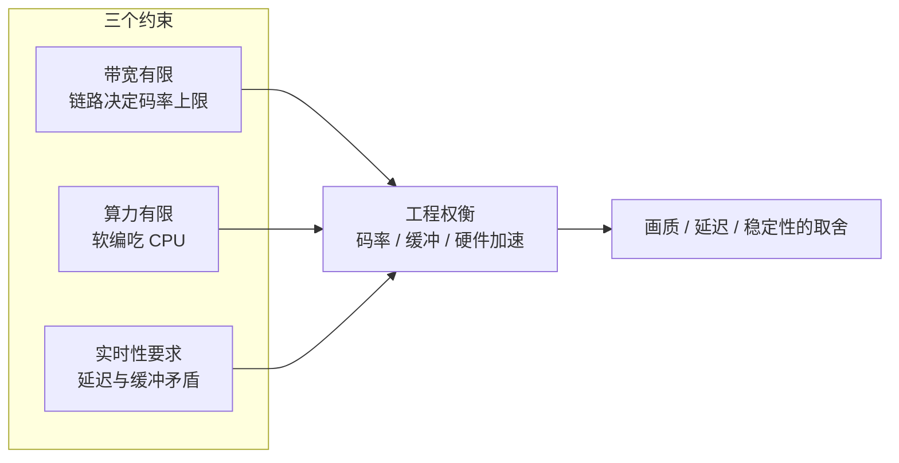

打开手机上的监控画面，你看到的是一个摄像头在几百米外拍下的实时视频；按下门铃对讲，你听到的是对方麦克风采集、压缩、跨越网络送来的声音。这些习以为常的场景背后，是一条完整的音视频数据链路：传感器把光变成数字图像，编码器把图像压成码流，网络协议把码流送到对端，解码器再把码流还原成屏幕上的画面。

本系列将沿着这条链路逐段拆解：从像素与声波的基本原理，到采集、处理、编码、传输，再到一个可产品化的完整管线。平台选用 **RV1126 + IMX415**——一块板集齐了采集、图像处理、硬件编解码、网络传输与 NPU 推理，恰好能与在 RV1126 上做模型部署的已有系列形成闭环：摄像头负责"看"，AI 负责"想"，编码与推流负责"说"。

这一篇是**开篇实操**，完成两个目标：

1. **建立全景认知**：采样 → 量化 → 编码 → 传输，整条链路每一环在做什么
2. **把 PC 工具链装好、跑通第一条命令**：FFmpeg 合成一段 5 秒测试音视频，用 ffprobe 读出参数，验证第二节算的带宽账

动手部分每步给你：命令 → 预期输出 → 不对怎么办。照做一遍，后面每一篇都在这套环境上继续。

【图1：一段音视频数据的一生】


## 〇、开始之前：准备环境

动手之前先建一个统一的工作目录，本系列所有测试文件都放这里，避免后面文件散落找不到：

```bash
mkdir -p ~/av-lab
cd ~/av-lab
```

**预期结果**：创建成功（无输出）。确认一下：

```bash
pwd
```

**预期输出（示例）**：

```text
/home/你的用户名/av-lab
```

再确认系统是什么、有没有基础工具：

```bash
uname -a
which ffmpeg ffprobe ffplay gst-launch-1.0 2>/dev/null
```

**预期输出（示例）**：第一行是系统信息；第二行如果全都没输出，说明工具链还没装（下一节装）。**现在工具链没装是正常的**，先确认系统是 Debian/Ubuntu 系（`apt` 可用），因为后面安装命令依赖它：

```bash
which apt
```

**预期输出（示例）**：

```text
/usr/bin/apt
```


## 一、数字化的三步：采样、量化、编码

一切音视频数据，都源于把模拟世界变成数字的三个动作：

1. **采样**——在时间或空间上取"瞬间值"。视频是空间采样：把画面切成一个个像素网格；音频是时间采样：每秒对声波取 44100 次或 48000 次瞬时值。
2. **量化**——把连续变化的取值归入有限档位。视频用 8bit / 10bit 表示一个像素分量的亮度等级；音频用 16bit / 24bit 表示一个样本的幅度。
3. **编码**——用算法去掉冗余，把数据量压下来。

打个比方：采样像在地图上打网格，网格越密越精细；量化像只保留到小数点后两位，位数越多越接近真实值；编码像把一篇文章里重复出现的句子改成"同上"，篇幅大幅缩短。

### 1.1 视频的数字化参数

| 参数 | 含义 | 常见取值 |
|:---|:---|:---|
| 分辨率 | 空间采样密度（宽×高像素数） | 1920×1080（1080p）、3840×2160（4K） |
| 位深 | 每个分量用多少 bit 量化 | 8bit（256 级）、10bit（1024 级） |
| 帧率 | 时间采样密度（每秒多少帧） | 25 / 30 / 60 fps |
| 像素格式 | 每个像素由哪些分量表示 | RGB、YUV420（NV12/NV21）等 |

### 1.2 音频的数字化参数

| 参数 | 含义 | 常见取值 |
|:---|:---|:---|
| 采样率 | 每秒采样次数 | 44.1kHz（CD）、48kHz（视频/通话） |
| 位深 | 每样本的量化位数 | 16bit、24bit |
| 声道 | 同时采集的通道数 | 单声道、双声道（立体声）、多声道 |

## 二、带宽：一帧 1080p30 有多大

做音视频，第一项基本功是**会算数据量**。不把账算清，后面的编码选型、缓冲设计、网络规划都无从谈起。

**一：1080p 一帧有多少个像素。**

```text
1920 × 1080 = 2,073,600 个像素
```

**二：最常见的 YUV420（NV12）格式下，每个像素平均占多少字节。**

YUV420 里，亮度 Y 每个像素都有（1 字节），色度 U/V 每 2×2 个像素才各有一个（共 0.5 字节），所以平均每个像素占 1 + 0.5 = **1.5 字节**。（为什么要牺牲色度？人眼对亮度敏感、对色度不敏感，这是"视觉冗余"的典型应用，第三节会展开。）

**三：一帧多少字节。**

```text
2,073,600 × 1.5 ≈ 3.11 MB
```

**四：30fps 一秒多少。**

```text
3.11 MB × 30 ≈ 93.3 MB/s ≈ 746 Mbps
```

**五：对照音频账（CD 质量）。**

```text
44,100 次采样 × 2 字节 × 2 声道 ≈ 172 KB/s ≈ 1.4 Mbps
```

**结论很直接：** 一秒钟 1080p30 的裸视频约 93MB，而百兆以太网的理论上限只有 12.5MB/s，Wi-Fi 实际更不稳。**不压缩，视频在嵌入式设备上寸步难行。**

| 内容 | 裸数据量 | 编码后典型码率 | 压缩比 |
|:---|:---:|:---:|:---:|
| 1080p30 视频 | ≈ 93.3 MB/s | 2 ~ 8 Mbps（0.25 ~ 1 MB/s） | 约 100 ~ 300 倍 |
| CD 质量音频 | ≈ 1.4 Mbps | 128 ~ 320 kbps | 约 5 ~ 10 倍 |

**记忆锚点**：1080p30 NV12 裸流 ≈ **93 MB/s**，这一篇后面生成的文件、后面抓帧看到的大小（3110400 字节 = 1920×1080×1.5），都从这笔账来。

## 三、编码压缩的本质：去冗余

编码器能把 93MB/s 压到几 Mbps，靠的是去掉三类冗余：

1. **空间冗余**：一帧画面里，天空、墙壁、桌面有大量相似像素。帧内预测（I 帧）用"已知像素推测相邻像素"来压缩。
2. **时间冗余**：相邻两帧内容几乎一样，只有少量运动。帧间预测（P/B 帧）用"参考前一帧 + 运动补偿"来描述变化，这是压缩率的最大来源。
3. **视觉冗余**：人眼对亮度敏感、对色度不敏感，所以视频普遍用 4:2:0 色度子采样；对人眼不易察觉的高频细节也可以少分配码率。

最后再叠加熵编码（出现频率高的符号用短码）进一步压缩。H.264 / H.265 里的 I/P/B 帧、GOP（关键帧间隔）、码率控制，都是围绕"去冗余 + 控码率"这两个目标展开的。

## 四、嵌入式音视频的三难：带宽、算力、实时性

在嵌入式设备上做音视频，本质上是在三个互相牵制的约束里找平衡：

- **带宽难**：链路带宽是有限的。以太网、Wi-Fi、移动网络的可用带宽各不相同，编码码率必须迁就链路，码率过高就卡顿、丢包。
- **算力难**：编码解码非常吃 CPU。1080p30 的 H.264 软编码需要 GHz 级多核持续运转，所以中高端方案普遍用**硬件编解码器**（如 RV1126 的 VENC / VDEC），把 CPU 留给业务与 AI。
- **实时性难**：监控要求端到端延迟尽量低（可视对讲、语音通话甚至要求几百毫秒以内），但抗网络抖动又需要更大的缓冲——缓冲越大越流畅、延迟越高，两者天然矛盾。

【图2：三难与工程权衡】



## 五、平台：为什么是 RV1126 + IMX415

选这套组合，是因为它恰好覆盖了全链路，且每一环都有真实可练的接口：

- **RV1126**：四核 Cortex-A7 @ 1.5GHz，内置 **14M ISP**（3 帧 HDR 合成、降噪、3A 自动曝光/白平衡）、**4K/30fps H.264/H.265 硬编解码**、MIPI-CSI ×2 视频输入、MIPI-DSI/RGB/LVDS 视频输出、**2 TOPS NPU**（INT8）、千兆以太网、I2S / PDM 音频接口。
- **IMX415**：索尼 Starvis 背照式 CMOS，约 **8.3MP（3840×2160）**，支持 HDR 与 MIPI CSI-2 输出，是当前 IPC 方案中常见的 4K 传感器（具体参数以 Sony 官方规格书为准）。

| RV1126 模块 | 职责 |
|:---|:---|
| VI | 摄像头采集（MIPI-CSI / DVP 输入） |
| ISP | 画质处理：降噪、HDR、3A |
| VPSS | 缩放、裁剪、旋转、多路分流 |
| VENC / VDEC | H.264 / H.265 硬件编解码 |
| VO | 显示输出 |
| I2S / PDM | 音频采集与播放 |

这块板子的意义在于：**从 IMX415 出图，到编码、推流，再到 NPU 推理，全程在一块板上闭环**——这正是 IPC、智能门铃、可视对讲等产品最典型的技术栈。

## 六、本系列主线

整个系列沿五段主线推进：

1. **基础与平台**——音视频本质、像素格式、平台盘点、工具链上手
2. **采集与像素处理**——IMX415 出图、VPSS、手写像素算子、音频采集
3. **编码与封装**——H.264/H.265 原理、硬件编码、FFmpeg 双轨、封装与同步
4. **流媒体传输**——RTP/RTSP、推流实战、GStreamer 管线
5. **系统与工程化**——音视频同步、多线程零拷贝管线、综合项目

板端用 RKMedia C 接口跑真实硬件，PC 端用 FFmpeg / GStreamer 跑同样的概念。

## 七、装好 PC 工具链

先把 PC 端的两把"瑞士军刀"装好。**目标是装完能确认版本号**——版本号是本系列的"环境坐标"，写作、排障、查资料都要用到。

### 7.1 安装 FFmpeg

```bash
sudo apt update
```

**预期输出（示例，截取关键部分）**：

```text
Hit:1 http://archive.ubuntu.com/ubuntu noble InRelease
...
Reading package lists... Done
Building dependency tree... Done
```

```bash
sudo apt install -y ffmpeg
```

**预期输出（示例）**：

```text
Setting up ffmpeg (7:6.1.1-3ubuntu5) ...
```

**验证**：

```bash
ffmpeg -version | head -3
```

**预期输出（示例）**：

```text
ffmpeg version 6.1.1-3ubuntu5 Copyright (c) 2000-2023 the FFmpeg developers
built with gcc 13.2.0 (Ubuntu 13.2.0-23ubuntu2)
configuration: --enable-gpl ...
```

版本不是 6.x 而是 7.x：正常，不同系统版本自带版本不同，**记下你自己的版本号**即可，本系列命令不依赖特定小版本

### 7.2 安装 GStreamer

```bash
sudo apt install -y gstreamer1.0-tools \
    gstreamer1.0-plugins-base gstreamer1.0-plugins-good \
    gstreamer1.0-plugins-bad gstreamer1.0-plugins-ugly \
    gstreamer1.0-libav
```

**预期输出（示例）**：末尾出现一行行 `Setting up gstreamer1.0-...`。

**验证**：

```bash
gst-launch-1.0 --version
```

**预期输出（示例）**：

```text
gst-launch-1.0 version 1.24.2
GStreamer 1.24.2
```

### 7.3 确认四把工具齐了

```bash
ffmpeg -version | head -1
ffprobe -version | head -1
ffplay -version | head -1
gst-launch-1.0 --version
```

## 八、工具测试

生成一段 5 秒的测试音视频（彩条 + 1kHz 正弦波），存为 `~/av-lab/test.mp4`。**这个文件是后面所有实验的"标准素材"**。

### 8.1 合成命令逐参数拆解

```bash
cd ~/av-lab
ffmpeg -f lavfi -i testsrc=size=1920x1080:rate=30 \
       -f lavfi -i sine=frequency=1000:sample_rate=48000 \
       -t 5 -c:v libx264 -c:a aac test.mp4
```

逐参数解释（**每条命令先看懂再敲，是手把手的前提**）：

| 参数 | 含义 |
|:---|:---|
| `-f lavfi` | 用 FFmpeg 的虚拟输入源（不读真实文件） |
| `-i testsrc=size=1920x1080:rate=30` | 第一个输入：1080p30 彩条测试画面 |
| `-i sine=frequency=1000:sample_rate=48000` | 第二个输入：1kHz、48kHz 采样率正弦波 |
| `-t 5` | 时长 5 秒 |
| `-c:v libx264` | 视频编码器：H.264（软编） |
| `-c:a aac` | 音频编码器：AAC |
| `test.mp4` | 输出文件名（容器 MP4） |

**执行后预期输出（示例，截取关键部分）**：

```text
Input #0, lavfi, from 'testsrc=size=1920x1080:rate=30':
  Duration: N/A, start: 0.000000, bitrate: N/A
  Stream #0:0: Video: rawvideo, rgb24, 1920x1080 [SAR 1:1 DAR 16:9], 30 fps
...
Stream mapping:
  Stream #0:0 -> #0:0 (rawvideo (native) -> h264 (libx264))
  Stream #1:0 -> #0:1 (pcm_s16le (native) -> aac (native))
...
frame=  150 fps= 40 q=-1.0 Lsize=     250kB time=00:00:05.00 bitrate= 406.9kbits/s
```

**预期结果要点**：

- 出现 `Stream #0:0 -> #0:0 (rawvideo ... -> h264 (libx264))`：视频编码器生效
- 末尾 `frame= 150`：5 秒 × 30fps = 150 帧，**帧数对 = 时间轴对**
- 生成文件大小约 250KB（彩条画面简单，编码后码率低，正常）

**验证文件存在**：

```bash
ls -l ~/av-lab/test.mp4
```

**错误分析**：

- `Unknown encoder 'libx264'`：FFmpeg 编译时没带 x264。换软编 `-c:v mpeg4` 临时替代，或安装 `sudo apt install -y libx264-dev` 后重装 ffmpeg（一般 apt 的 ffmpeg 都带 x264）
- `Option not found` / 参数写错：检查拼写，`testsrc=size=1920x1080:rate=30` 的冒号别写成中文冒号
- 生成很快但文件是 0 字节：磁盘满或输出路径无权限，`df -h ~` 看剩余空间

### 8.2 用 ffprobe 读出参数，验证带宽账

```bash
# 看视频流参数
ffprobe -v error -select_streams v:0 \
        -show_entries stream=width,height,pix_fmt,avg_frame_rate,bit_rate test.mp4
```

**预期输出（示例）**：

```text
[STREAM]
width=1920
height=1080
pix_fmt=yuv420p
avg_frame_rate=30/1
bit_rate=167122
[/STREAM]
```

**逐行对照第二节的账**：

- `width=1920 height=1080`：分辨率，像素数 = 2,073,600
- `pix_fmt=yuv420p`：YUV420，每像素 1.5 字节——编码时从 rgb24（testsrc 原始格式）转成了 yuv420p
- `avg_frame_rate=30/1`：30fps
- `bit_rate=167122`：编码后约 163 kbps（彩条画面静态、冗余大，压得很低）——**对比裸流 746 Mbps，这就是编码的威力**

```bash
# 看音频流参数
ffprobe -v error -select_streams a:0 \
        -show_entries stream=sample_rate,channels,bit_rate test.mp4
```

**预期输出（示例）**：

```text
[STREAM]
sample_rate=48000
channels=2
bit_rate=129186
[/STREAM]
```

**对照**：48kHz / 双声道——和合成命令里的 `sample_rate=48000` 对上；AAC 编码后约 126 kbps（正弦波单一频率，AAC 压得极狠）。

**不对怎么办**：

- `ffprobe: command not found`：ffprobe 没装上，`sudo apt install -y ffmpeg` 会连带安装；单独装 `sudo apt install -y ffprobe`（Debian 系包名可能不同，优先重装 ffmpeg）
- `Invalid data found when processing input`：test.mp4 损坏或不完整，回到 8.1 重新生成
- 显示 `bit_rate=N/A`：容器里没写码率字段（正常现象），用 `-show_entries stream=duration` 看时长确认文件完好

## 九、播放验证 + 认识你的板子

### 9.1 PC 端播放验证

```bash
cd ~/av-lab
ffplay test.mp4
```

**预期结果**：弹出一个窗口，显示彩条画面（5 秒），同时播放 1kHz 正弦波声音。播放完自动关闭。

**不对怎么办**：

- `ffplay: command not found`：装 ffplay，`sudo apt install -y ffmpeg` 应已连带；单独装包名 `ffplay` 在 Debian 系可能需要 `sudo apt install -y ffmpeg` 重装
- 窗口弹出但黑屏/无声音：显卡/声卡驱动问题，先确认系统本身能放其他视频；本实验的合成文件已在 8.2 验证参数正确，**数据没问题，问题在播放环境**
- 没装图形界面的服务器（无显示器）：跳过 ffplay，用 `ffmpeg -i test.mp4 -f null -` 验证解码不报错（预期输出结尾 `frame= 150` 即 OK）

### 9.2 认识你的板子（RV1126 初识）

按正点原子资料《开发板使用手册》连接电源、调试串口，上电后在 PC 串口终端登录：

```bash
uname -a
```

**预期输出（示例）**：

```text
Linux rv1126 4.19.111 #4 SMP PREEMPT ... armv7l GNU/Linux
```

**要点**：`armv7l` = 32 位 ARM 内核（Cortex-A7），`4.19.111` 是 SDK 内核版本，记下来。

```bash
cat /proc/cpuinfo | grep -E "Processor|model name" | head -4
```

**预期输出（示例）**：

```text
Processor	: ARMv7 Processor rev 5 (v7l)
processor	: 0
processor	: 1
processor	: 2
processor	: 3
```

**要点**：`processor : 0~3` = 四核 Cortex-A7，与概念对上了。

```bash
ls /dev/video* /dev/v4l-subdev* 2>/dev/null
```

**预期输出（示例）**：

```text
/dev/video0
/dev/video1
/dev/v4l-subdev0
```

**要点**：video 节点 = 采集/处理通道，v4l-subdev = sensor 等子设备。**你的板子上已经有这套东西**，只是还没人教你怎么用——这正是后续篇章要展开的。

**不对怎么办**：

- 登录不上：对照正点原子资料串口章节，检查串口线/TTL 电平/波特率；登录后不是 root：按资料默认账号密码（一般 root 或 root/root）
- `ls` 没有输出（没有 video 设备）：**正常**——如果出厂固件没使能摄像头或没接模组，节点可能不存在。后续点亮篇章会手把手把它弄出来，现在先不纠结
- 板子还没到货：完全不影响本篇，PC 端实操已全部完成

## 十、动手练习

**练习 1：手算 + 实测对照（巩固带宽账）**

用 8.2 的方法，把 test.mp4 换成 720p 重新合成并查码率：

```bash
cd ~/av-lab
ffmpeg -f lavfi -i testsrc=size=1280x720:rate=30 -t 5 -c:v libx264 720p.mp4
ffprobe -v error -select_streams v:0 -show_entries stream=width,height,bit_rate 720p.mp4
```

**预期结果**：`width=1280 height=720`；720p 一帧像素 = 921,600（= 1080p 的 9/16，注意 1920×1080 的一半尺寸不是一半像素，是 1/4）。

**练习 2：压缩率对比**

```bash
# 转一个高码率的版本
ffmpeg -i test.mp4 -c:v libx264 -b:v 8M -c:a copy test_8M.mp4
ls -l test.mp4 test_8M.mp4
```

**预期结果**：`test_8M.mp4` 明显更大（约 5MB）。体会：**同样的画面，码率上限越高文件越大**——这就是第四节"带宽 vs 画质"权衡的直接体现。

**练习 3：参数错了会怎样**

```bash
# 故意把音频采样率写错（44.1k 的文件按 48k 播）
ffmpeg -f lavfi -i sine=frequency=1000:sample_rate=44100 -t 2 -ar 48000 -c:a pcm_s16le wrong_rate.wav
ffplay wrong_rate.wav
```

**预期结果**：音调变高（1kHz 变成约 1.09kHz）。**体会：音频参数是"约定"，写错就变调**——后面采集音频时，采样率配置错了就是这种后果。

**练习 4：gst 最小管线**

```bash
gst-launch-1.0 videotestsrc num-buffers=60 ! autovideosink
```

**预期结果**：弹出窗口显示测试画面（2 秒），自动结束。跑通 = GStreamer 工具链 OK。

## 里程碑

- [ ] 能说出 1080p30 NV12 一帧多少字节、每秒多少带宽（3.11MB / 93MB/s）
- [ ] 能解释采样、量化、编码三者的区别
- [ ] FFmpeg / GStreamer 装好，能跑通合成、查看、播放命令
- [ ] 能在板子上登录并确认四核 Cortex-A7 与 video 节点存在
- [ ] 手头有 `~/av-lab/test.mp4` 标准测试资产

## 小结

音视频的本质，是把物理世界的光与声，经过采样、量化、编码变成可以存储和传输的数字；而嵌入式音视频工程师的工作，是在带宽、算力、实时性三个约束之间做工程权衡。RV1126 + IMX415 提供了完整链路，FFmpeg / GStreamer 提供了 PC 侧验证手段。把带宽账算清、把工具链跑通、把板子认上，后面的每一环——采集、处理、编码、传输——就可以逐个击破了。

> 🏷️ 音视频 · 采样量化编码 · 带宽计算 · H.264/H.265 · FFmpeg · GStreamer · RV1126 · IMX415
