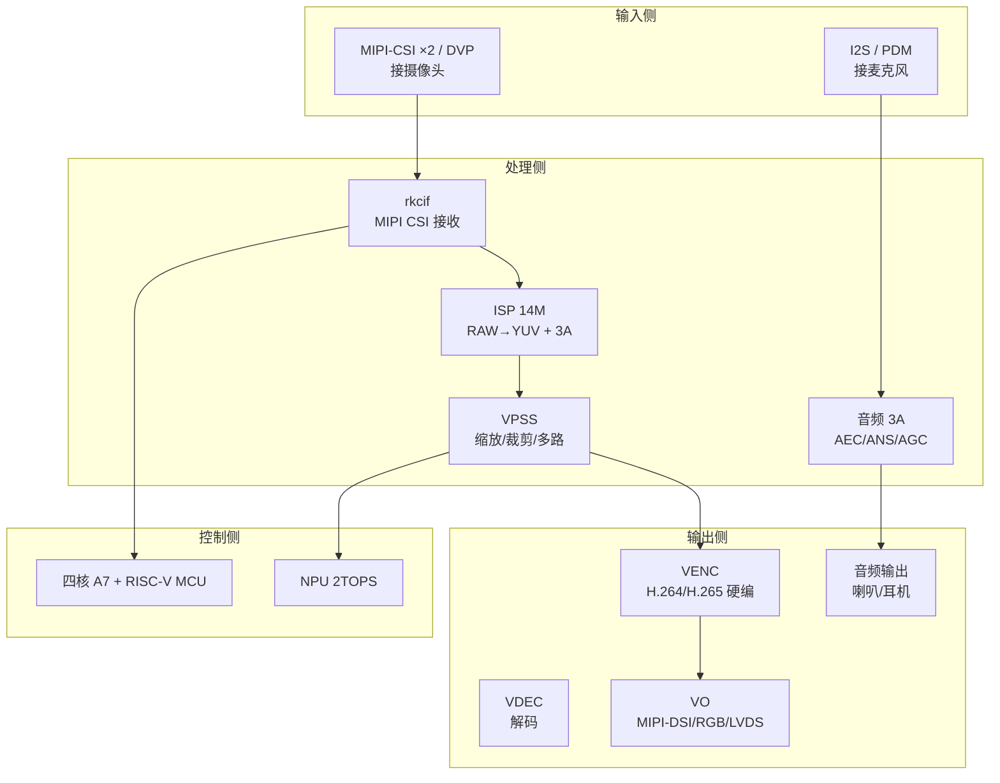
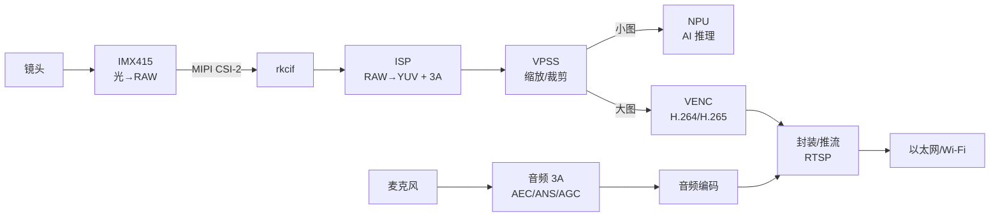

做音视频开发，第一步不是写代码，而是**看清你手里的芯片**：数据从镜头进来之后，经过了哪些硬件单元，每个单元管什么、能做什么、瓶颈在哪。这一篇把 RV1126 的多媒体子系统完整拆开——视频输入、图像处理、视频编码、视频输出、音频处理五条主线，再把摄像头 IMX415 接上去，画出"从镜头到内存"的第一张全链路图。

但"看清芯片"不能只靠读文档——**要上板验证**。所以这一篇有两个实操任务：

1. **上板盘点**：登录你的 RV1126 板卡，用命令把文档里的"四核 A7、ISP、video 节点、I2C 总线、sensor"逐个对上号
2. **PC 端最小链路**：在 PC 上用 FFmpeg 生成并解析一个 H.264 文件，先跑通"采集→编码→封装"的概念版

动手部分同样按"命令 → 预期输出 → 不对怎么办"来组织。

## 〇、开始之前：本篇的实物准备

| 需要 | 用途 | 没有怎么办 |
|:---|:---|:---|
| RV1126 板卡 + 电源 + 调试串口 | 上板盘点（实操一） | 先做实操二（PC 端），板端部分留到有板时补 |
| IMX415 摄像头模组（可选） | 确认 sensor 型号 | 本篇只是"对上号"，不点亮，可后补 |
| PC（Debian/Ubuntu） | PC 端最小链路（实操二） | — |

## 一、RV1126 是谁：一块为视觉而生的 SoC

RV1126 是瑞芯微面向 IPC（网络摄像机）、行车记录仪、智能门铃、视觉 AI 盒子等场景设计的多媒体 SoC，可以理解成"**一台自带 ISP、硬件编解码器与 NPU 的小型计算机**"。它的三大块：

1. **CPU**：四核 Cortex-A7 @ 1.5GHz（跑 Linux 应用与算法调度）+ 400MHz RISC-V MCU（低功耗待机与辅助任务）
2. **NPU**：2 TOPS INT8 算力，跑神经网络推理
3. **多媒体子系统**：视频采集（VI/ISP/VPSS）、视频编解码（VENC/VDEC）、视频输出（VO）、音频（I2S/PDM + 3A 算法）

类比：CPU 是"大脑"，负责思考与调度；多媒体子系统是"眼耳口鼻"，负责看、听、说；NPU 是"直觉回路"，负责快速识别。你写的应用代码主要跑在 CPU 上，而重活（ISP 处理、编码、AI 推理）全部交给专用硬件，这正是它能用几百毫瓦级功耗跑 4K 视频的原因。

【图1：RV1126 多媒体子系统全景】



## 二、视频输入侧：从镜头到内存

### 2.1 三条物理通路：MIPI-CSI 与 DVP

摄像头的数据进 SoC，走的是专用接口。RV1126 提供：

- **MIPI-CSI ×2**：差分串行接口，速度高、抗干扰强，是主流 sensor 的标准输出（IMX415 就走这里）。每个 CSI 接口由若干 **lane**（数据通道）组成，lane 数越多带宽越大，常见 2-lane / 4-lane。
- **DVP**：并口传输，历史悠久、占用引脚多，一般只用于老 sensor。

类比：MIPI-CSI 像高铁（串行、高速、专用轨道），DVP 像普通公路（并排多车道、占地方）。现代方案首选 MIPI-CSI。

### 2.2 rkcif：MIPI CSI 接收控制器

sensor 通过 MIPI 链路把像素"打"过来，第一站是 **rkcif**（Rockchip Camera Interface）——它负责：

- 解析 MIPI CSI-2 协议（数据包、帧起始/结束标记）
- 把串行像素流还原成内存里的帧
- 与 sensor 建立 **media link**（sensor 子设备与 rkcif 实体通过 v4l2 media-controller 绑定，后面点亮摄像头时会实际用到这套机制）

rkcif 之上是 **VI**（Video Input）单元，它对外提供统一的采集接口：在板端 SDK（RKMedia）里对应 `VI` 通道，在 Linux 标准框架里对应 `/dev/video*` 设备节点。**同一份像素流，两套软件视角都能看到**——这是后面调试的重要入口。

### 2.3 ISP：画质的中枢

从 sensor 出来的原始数据叫 **RAW**（拜耳阵列，像素格式在图像基础篇细说），它不能直接给人看：颜色不完整、有噪声、亮度可能过曝或欠曝。**ISP（Image Signal Processor，图像信号处理器）** 就是把 RAW"加工"成可看图像的核心硬件。RV1126 的 ISP 能力：

- **14M 像素**处理能力，支持 4K@30fps
- **3 帧 HDR**：同一场景快速拍三帧不同曝光（短/中/长），合成高动态范围图像，逆光场景靠它
- **3A 算法**：AE（自动曝光）、AWB（自动白平衡）、AF（自动对焦）由 Rockchip 的 **rkaiq**（AIQ，AI Quality）库驱动——它像"画质管家"，根据场景自动调曝光、白平衡、对焦，也能手动干预

### 2.4 VPSS：画面分配器

ISP 输出一帧干净图像后，往往**不够用**：AI 推理要一张小图、编码要一张大图、本地预览又要一张。VPSS（Video Post-Processing Subsystem）负责**一进多出**：

- 缩放（1080p → 640×360 给 NPU）
- 裁剪、旋转、镜像
- 多路通道同时输出不同分辨率

类比：VPSS 像复印机，一份原稿复印成多种规格，互不干扰。

## 三、视频输出侧：编码与显示

### 3.1 VENC / VDEC：硬件编解码器

编码是最吃算力的环节。RV1126 内置 **VENC**（Video Encoder）硬件模块：

- **H.264 / H.265 硬编码，最高 4K@30fps**
- 支持 CBR/VBR 码率控制、GOP 配置（后续专门篇章展开）

为什么必须硬件编码？上一篇的账：1080p30 裸流约 93MB/s，即使降到 8Mbps 码率，软编码也需持续占用 GHz 级 CPU 核。**把编码交给 VENC，CPU 就能专心跑应用与 AI**。
配套的 **VDEC** 做硬解码（如回放、双向语音的对端解码）。

### 3.2 VO：显示输出

需要接屏幕时走 VO 单元：MIPI-DSI（手机屏）、RGB 并口屏、LVDS（工控屏）。IPC 产品通常不需要屏幕，但调试时接一块屏直接看效果非常直观。

## 四、音频侧：听与说

双向语音（对讲）是 IPC 的核心功能，RV1126 的音频通路：

- **输入**：I2S（接 Codec 芯片/数字麦克风）或 PDM（接 PDM 数字麦克风，多用于阵列麦克风）
- **处理**：内置 **音频 3A 算法**——AEC（回声消除）、ANS（噪声抑制）、AGC（自动增益）。对讲时扬声器声音会传回麦克风，没有 AEC 对方会听到自己的回声，这是双向语音能用的关键（后续专门篇章）
- **输出**：I2S 接功放/喇叭

## 五、IMX415：这颗摄像头是什么来头

**IMX415** 是索尼的 CMOS 图像传感器（Starvis 系列背照式工艺）：

- **约 8.3MP** 有效像素，输出 **4K（3840×2160）@30fps**
- **Starvis 背照式**：感光层在电路层上方，暗光灵敏度更好
- 支持 **HDR**（与 RV1126 的 3 帧 HDR 配合，逆光可用）
- 输出接口：**MIPI CSI-2**（多 lane，具体 lane 数以数据手册为准）
- 控制接口：**I2C**（主机通过 I2C 读写 sensor 寄存器，配置曝光、增益、输出格式等）
- 输出格式：**RAW**（拜耳原始数据，RAW10/RAW12 常见）

> 具体参数（有效像素数、lane 数、支持的分辨率列表、寄存器映射）以 Sony IMX415 数据手册与板卡原理图为准；不同开发板对 IMX415 的接线方式（lane 数、供电、MCLK 频率）可能不同，上板前先核对板卡资料。

类比：传感器像胶片相机的"胶片+快门"，但它不是把光变成照片，而是把每个像素的光强度变成数字；I2C 是它的"遥控器"，MIPI 是它"送照片的通道"。

## 六、一条数据的旅程：从镜头到推流

把上面的单元串起来，就是本系列反复要用的全链路图——**记住这张图，后面的每一篇都是它的某个局部**：

【图2：从镜头到推流的数据流】



几个关键观察：

1. **数据只往一个方向流**（除了控制用的 I2C），链路是"管道式"的——这是所有多媒体系统的基本形态
2. **每个单元都有明确的输入输出格式**：RAW 进 ISP、YUV 出 VPSS、码流出 VENC。搞清楚每个接口的格式约定，就是后面每篇的核心任务
3. **NPU 与 VENC 并行消费 VPSS 的输出**，互不阻塞——多路分流能力是这类 SoC 的立身之本

## 七、实操一：上板盘点——把文档对上号

### 7.1 登录板卡

按正点原子资料《开发板使用手册》连接电源与调试串口（USB 转 TTL），PC 上打开串口终端（波特率 1500000，以资料为准，正点原子 RV1126 常用 1.5M 波特率；资料里没写就试 115200/921600/1500000）。

上电后应看到内核启动日志，登录提示符：

```text
rk1126 login: root
```

输入默认密码（资料为准，常见 root / 空密码）。登录成功：

```bash
whoami
```

**预期输出（示例）**：

```text
root
```

**不对怎么办**：

- 串口无输出：检查波特率是否与资料一致、USB 转 TTL 驱动是否装好、接线 TX/RX 是否交叉
- 上电后不断重启：电源电流不够（IPC 板常需要 5V/3A 以上），换电源
- 密码不对：看资料"默认账号密码"一节，常见 `root/root`、`root/123456`、空密码

### 7.2 确认 CPU：四核 Cortex-A7

```bash
cat /proc/cpuinfo | grep -E "Processor|model name" | head -4
```

**预期输出（示例）**：

```text
Processor	: ARMv7 Processor rev 5 (v7l)
processor	: 0
processor	: 1
processor	: 2
processor	: 3
```

**要点**：`processor : 0~3` = 四核，`ARMv7` = Cortex-A7 架构。这与文档"四核 A7"对上。

```bash
free -h
```

**预期输出（示例）**：

```text
              total        used        free
Mem:           480M        180M        300M
```

**要点**：DDR 大小（正点原子 RV1126 常见 512MB，`free` 显示约 480M 是内核保留后剩余）。这决定了后面缓冲池设计的上限。

### 7.3 确认多媒体节点：/dev/video* 与子设备

```bash
ls -l /dev/video* /dev/v4l-subdev* 2>/dev/null
```

**预期输出（示例，不同 SDK 略有差异）**：

```text
crw-rw---- 1 root video 81, 0 Jan  1  1970 /dev/video0
crw-rw---- 1 root video 81, 1 Jan  1  1970 /dev/video1
crw-rw---- 1 root video 81, 2 Jan  1  1970 /dev/video2
crw-rw---- 1 root video 81, 4 Jan  1  1970 /dev/v4l-subdev0
crw-rw---- 1 root video 81, 5 Jan  1  1970 /dev/v4l-subdev1
```

**每个节点是什么设备**，用系统属性查（不用猜）：

```bash
for v in /dev/video*; do echo "$v -> $(cat /sys/class/video4linux/$(basename $v)/name 2>/dev/null)"; done
```

**预期输出（示例，Rockchip SDK 常见）**：

```text
/dev/video0 -> rkisp_mainpath
/dev/video1 -> rkisp_selfpath
/dev/video2 -> rkcif-mipi-lvds
```

**要点**：`rkisp_*` = ISP 输出通道（主通路/自通路），`rkcif-*` = MIPI 采集接收。**这些节点就是全链路图里 ISP/VI 的对外出口**，后续采集篇章就是从这里取数据的。

**不对怎么办**：

- 只有 video0 没有 video2：不同 SDK 使能的节点数不同，正常；把能看到的记下来即可
- 完全没有 video 节点：出厂固件可能没加载摄像头相关驱动，**这是正常现象**，点亮篇章会手把手解决

### 7.4 确认 I2C 总线（sensor 的"遥控器"通道）

```bash
ls /dev/i2c-* 2>/dev/null
```

**预期输出（示例）**：

```text
/dev/i2c-0  /dev/i2c-1  /dev/i2c-2  /dev/i2c-3
```

**要点**：I2C 总线是 CPU 控制 sensor（配置曝光/增益/输出格式）的通道。IMX415 挂在其中一条总线上，I2C 地址常见 `0x1a`（以板卡资料为准）。

**看看总线上挂了什么设备**（需要 i2c-tools，SDK 一般自带）：

```bash
which i2cdetect && i2cdetect -l
```

**预期输出（示例）**：

```text
i2c-0  i2c-1  i2c-2  i2c-3  ...
```

**不对怎么办**：`i2cdetect: command not found`——SDK 没带 i2c-tools。不影响本篇，先记下"有 4 条总线"即可；后面点亮摄像头时会用 `i2cdetect -y <bus>` 扫描 sensor 地址（扫描前先看资料确认总线号，避免误扫）。

### 7.5 在 SDK 源码里定位 IMX415（板上没有 SDK 就跳过这步）

板端只跑固件，源码在 PC 上的 SDK 目录。如果你手头有 SDK（正点原子资料里的 Linux SDK 压缩包解压后），用 `find` 定位 sensor 驱动与设备树：

```bash
# 在 SDK 根目录执行（路径按你的解压位置）
cd ~/rv1126_sdk
find . -iname "*imx415*" -type f 2>/dev/null
```

**预期输出（示例）**：

```text
./kernel/drivers/media/i2c/imx415.c
./kernel/arch/arm/boot/dts/rv1126-imx415.dtsi
```

**要点**：`imx415.c` 是 sensor 驱动源码；`rv1126-imx415.dtsi` 是设备树——**点亮摄像头要改的就是这类 dtsi**，先知道它在哪。

再看 sensor 的 I2C 地址定义（驱动源码里）：

```bash
grep -n "I2C_ADDR\|0x1a" kernel/drivers/media/i2c/imx415.c | head -10
```

**预期输出（示例）**：

```text
#define IMX415_I2C_ADDR	0x1a
```

**要点**：这个地址要和板卡原理图对得上。**以你自己的 SDK 输出为准**，不同版本可能不同。

**不对怎么办**：

- `find` 无结果：SDK 路径不对，或 SDK 里 sensor 驱动叫别的名字（`grep -rn "IMX415" kernel/drivers/media/i2c/` 再找）
- 没有 SDK：先在 PC 完成实操二，SDK 到手后补这步

### 7.6 看内核日志有没有 sensor 的影子

```bash
dmesg | grep -iE "imx415|rkisp|rkcif" | head -20
```

**预期输出（示例，SDK 已使能时）**：

```text
rkcif-mipi-lvds: no sensor connected
rkisp: ....
```

**要点**：如果显示 `no sensor connected`，说明驱动在等 sensor 上电/初始化——**这正是后面点亮章节要解决的问题**。如果完全没输出，说明驱动可能没编译进内核。

**不对怎么办**：`dmesg: Operation not permitted`——加 `sudo dmesg` 或确认你是 root。

## 八、实操二：PC 端最小链路——生成并解析一个 H.264 文件

**目标**：在 PC 上把"采集→编码→封装"跑一遍概念版。FFmpeg 的 `testsrc2` 虚拟源扮演"摄像头"，`libx264` 扮演"编码器"，`mp4` 扮演"封装"。

### 8.1 生成 5 秒测试视频

```bash
cd ~/av-lab
ffmpeg -f lavfi -i testsrc2=size=1920x1080:rate=30 -t 5 \
       -c:v libx264 -pix_fmt yuv420p test.mp4
```

逐参数解释：

| 参数 | 含义 |
|:---|:---|
| `-f lavfi -i testsrc2=size=1920x1080:rate=30` | 虚拟视频源：1080p30 测试图（带滚动条和刻度，比 testsrc 更能看出压缩痕迹） |
| `-t 5` | 时长 5 秒 |
| `-c:v libx264` | H.264 编码器 |
| `-pix_fmt yuv420p` | 输出像素格式强制为 YUV420（H.264 的常见约定） |

**预期输出（示例，截取关键部分）**：

```text
Input #0, lavfi, from 'testsrc2=size=1920x1080:rate=30':
  Duration: N/A, start: 0.000000, bitrate: N/A
  Stream #0:0: Video: rawvideo, rgb24, 1920x1080 ...
Stream mapping:
  Stream #0:0 -> #0:0 (rawvideo (native) -> h264 (libx264))
...
frame=  150 fps= 60 q=-1.0 Lsize=     320kB time=00:00:05.00 bitrate= 523.9kbits/s
```

**要点**：`frame= 150`（5 秒 × 30fps），输出约 320KB——**裸流 5 秒要 466MB，编码后 320KB，这就是 VENC 存在的意义**。

**不对怎么办**：参考上一篇 8.1 的排障表（`Unknown encoder 'libx264'`、参数拼写、磁盘满）。

### 8.2 用 ffprobe 解析文件，看容器/编码/像素格式

```bash
ffprobe -v error -show_streams test.mp4 | grep -E "codec_name|width|height|pix_fmt|profile"
```

**预期输出（示例）**：

```text
codec_name=h264
profile=High
width=1920
height=1080
pix_fmt=yuv420p
```

**逐项对照本篇概念**：

- `codec_name=h264`：编码器是 H.264（对应板端 VENC 的 H.264 模式）
- `profile=High`：H.264 档次（High = 常见高阶档）
- `pix_fmt=yuv420p`：像素格式 YUV420——**图像基础篇要展开讲的格式之一**

**不对怎么办**：

- 没有输出：文件不是 H.264（确认上一步 `-c:v libx264` 生效），或 ffprobe 报错 `Invalid data`（文件损坏，重新生成）
- 显示 `pix_fmt=yuv444p`：说明 8.1 命令里 `-pix_fmt yuv420p` 没生效（检查拼写），但文件仍可播放，重跑一次即可

### 8.3 对比：如果不指定 yuv420p 会怎样

```bash
ffmpeg -f lavfi -i testsrc2=size=1920x1080:rate=30 -t 5 \
       -c:v libx264 test_no_pixfmt.mp4
ffprobe -v error -show_streams test_no_pixfmt.mp4 | grep -E "pix_fmt"
```

**预期输出（示例）**：

```text
pix_fmt=yuv420p
```

**要点**：libx264 默认也会转成 yuv420p（H.264 最通用的 profile 约束），所以结果一样。**但不要依赖默认**——板端采集的格式由硬件决定，显式指定是工程习惯。

**不对怎么办**：无异常，正常现象。

## 九、板端与PC端对应表

板端（RV1126）跑真实硬件链路，PC 端用 FFmpeg/GStreamer 跑同概念。两者的对应关系：

| 环节 | 板端（RV1126） | PC 端（FFmpeg/GStreamer） |
|:---|:---|:---|
| 采集 | RKMedia VI / V4L2 | `v4l2src`、`testsrc2` 等虚拟源 |
| 图像处理 | ISP / VPSS | `scale`、`format` 滤镜 |
| 编码 | VENC（H.264/H.265 硬编） | `libx264`、`h264_nvenc` 等软/硬编 |
| 推流 | RTSP 服务 | `rtmpsink`、`flvmux`、FFmpeg 推流命令 |
| 分析 | dmesg / rkaiq 工具 | `ffprobe`、Wireshark |

**先在 PC 上把概念跑通，再上板验证**，能省掉大量"硬件还没点亮就怀疑算法"的排查时间。

## 十、动手练习

**练习 1：板上确认 sensor 驱动是否编译进内核**

```bash
# 在内核里搜 imx415 驱动模块名（模块加载后会出现）
lsmod | grep -i imx
```

**预期结果**：有输出 = 驱动已加载（如 `imx415 32768 0`）；无输出 = 驱动是 built-in（编译进内核）或未使能，用 7.6 的 `dmesg | grep -i imx415` 进一步确认。

**练习 2：PC 转码对比（720p vs 1080p）**

```bash
cd ~/av-lab
ffmpeg -f lavfi -i testsrc2=size=1280x720:rate=30 -t 5 -c:v libx264 720p.mp4
ls -l test.mp4 720p.mp4
```

**预期结果**：720p 文件明显更小。用 `ffprobe` 看两个文件的 `width/height/bit_rate`，记录 720p 和 1080p 的码率差距。

**练习 3：用 ffprobe 把文件里的"全链路信息"拉全**

```bash
ffprobe -v error -show_format -show_streams test.mp4 | grep -E "filename|duration|bit_rate|codec_name|width|height|r_frame_rate"
```

**预期结果**：能一次看到容器层（时长/总码率）与流层（编码/分辨率/帧率）信息。**养成"拿到陌生媒体先 ffprobe 全查一遍"的习惯**，后面排障全靠它。

**练习 4：板上画一张"我的板子"清单**

用本篇命令，把你板子上的真实信息填进这个模板（存成 `~/board-info.txt`）：

```text
CPU:          （cat /proc/cpuinfo | grep Processor）
内存:         （free -h 的 total）
内核版本:     （uname -r）
video 节点:   （for v in /dev/video*; do ... done）
I2C 总线:     （ls /dev/i2c-*）
sensor 驱动:  （find SDK 里的 imx415.c 路径）
sensor I2C 地址:（grep 驱动源码）
```

**预期结果**：一张属于你的板子的硬件清单。**后续每一篇的板端操作都基于这份清单**，先有它，后面才不慌。

## 里程碑

- [ ] 能画出 RV1126 多媒体子系统的五条主线（输入/ISP/VPSS/编解码/音频）并说明每个单元职责
- [ ] 能说清 IMX415 与 RV1126 之间走的两种接口（MIPI 传数据、I2C 传控制）
- [ ] 能默写"镜头 → RAW → ISP → YUV → VPSS → VENC → 推流"全链路
- [ ] 在板子上完成盘点：四核 A7、video 节点、I2C 总线、sensor 驱动位置全部对上号
- [ ] PC 工具链装好，`ffmpeg` 能生成并解析一个 H.264 mp4 文件，能说出它的像素格式

> 🏷️ 标签：RV1126 · IMX415 · MIPI-CSI · ISP · VPSS · VENC · 多媒体子系统 · 音视频
