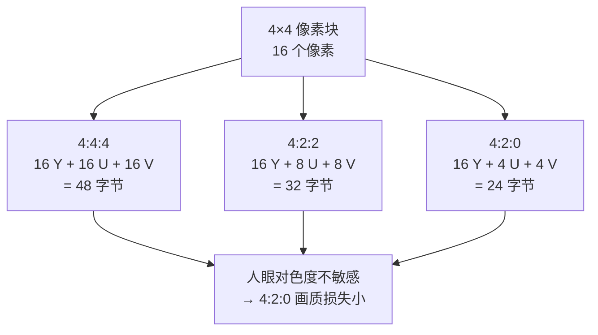
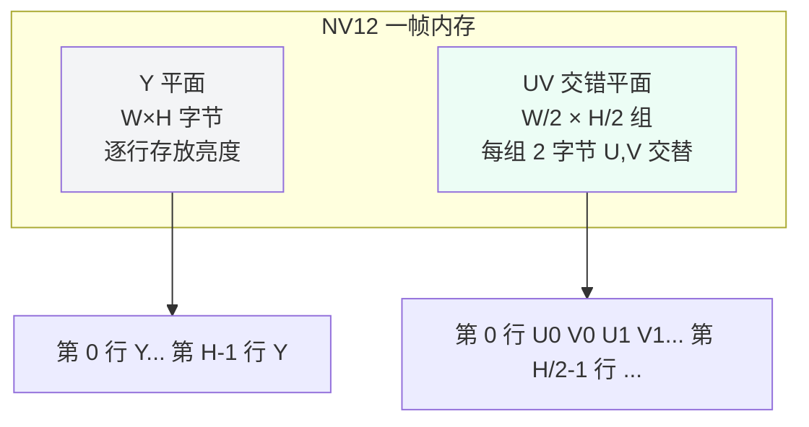

摄像头采集到的"图像"，在内存里其实只是一堆字节。同样的 1080p 画面，用不同的格式存放，字节数、排列方式、颜色效果完全不同；选错格式，轻则带宽翻倍，重则画面偏色、花屏。这一篇把像素格式彻底讲透：RGB 与 YUV 的关系、色度子采样、常见 YUV 内存布局（NV12/NV21/I420/YUYV）、RAW 与拜耳阵列、色彩空间，以及贯穿全系列的**带宽与内存计算**。

概念之外，这一篇安排三个实操：

1. **用 FFmpeg 亲手生成 4:4:4 / 4:2:0 两个文件**，对比大小，看懂 `pix_fmt`
2. **导出 NV12 裸流，用 Python 解析成图片**——亲手"把字节变成画面"，并演示两个经典坑：UV 顺序错了红蓝互换、stride 忘了用画面斜切
3. **在板端 SDK 里定位 `RK_FORMAT_*` 宏**，把 PC 端概念和板端宏对上号

## 〇、开始之前：环境要求

- 上一篇装好的 FFmpeg 工具链（`ffmpeg`/`ffprobe`/`ffplay`）
- Python 3（Debian/Ubuntu 自带：`python3 --version` 确认；没有则 `sudo apt install -y python3`）
- 工作目录 `~/av-lab`

## 一、一个像素是什么：RGB 起步

电脑屏幕上的每个点由红、绿、蓝三色光混合而成，这就是 **RGB** 模型：一个像素 = R（红）+ G（绿）+ B（蓝）三个分量。8bit 下每个分量取值 0~255，组合出约 1677 万种颜色。

内存里最常见的是 **RGB888**：一个像素 3 字节，按 R、G、B 顺序存放（也有 BGR 顺序，注意区分）。一块 1920×1080 的 RGB888 帧 = 1920 × 1080 × 3 ≈ 6.2MB。

类比：RGB 像调色盘——三管颜料直接兑出目标色，直观但"贵"（每像素都要存三份完整信息）。

## 二、为什么视频普遍用 YUV：亮度与色度分离

视频几乎不用 RGB 直接存储和编码，而是用 **YUV**（分量名 Y、U、V；在数字视频标准中也写作 YCbCr）：

- **Y**：亮度（luma），画面的明暗信息
- **U / V（Cb / Cr）**：色度（chroma），画面的颜色信息

这么做有两个历史与现实原因：

1. **兼容黑白**：黑白时代只需要 Y，彩色电视在 Y 上叠加色度即可，黑白电视收彩色信号也能正常显示
2. **人眼特性**：人眼对亮度变化敏感、对色度变化迟钝。**把色度信息减少一半甚至四分之三，人眼几乎察觉不到**——这就是色度子采样的理论基础，也是视频压缩的第一道"免费午餐"

RGB→YUV 不是随便拍的，它是一套线性变换（系数由色彩空间标准决定，后文详述）。你不需要背公式，但要记住：**YUV 与 RGB 可以互相转换，转换有固定系数，系数的选择影响颜色准确度**。

## 三、色度子采样：4:4:4 / 4:2:2 / 4:2:0 到底在说什么

子采样用"X:X:X"三个数字描述一行内**亮度与色度的采样比例**，含义：

- 第一个数：一行像素（通常按 4 个一组）中亮度 Y 的采样数，永远是 4
- 第二个数：第一行中色度（U/V 合计）的采样数
- 第三个数：第二行中色度的采样数

| 格式 | 亮度采样 | 色度采样 | 平均每像素字节数 | 典型用途 |
|:---|:---|:---|:---:|:---|
| 4:4:4 | 每像素都有 | 每像素都有 | 3 字节（YUV 各 8bit） | 专业调色、字幕合成 |
| 4:2:2 | 每像素都有 | 每 2 像素采 1 组 | 2 字节 | 广播级、高质量采集 |
| 4:2:0 | 每像素都有 | 每 2×2 像素采 1 组 | 1.5 字节 | 消费级视频、H.264/H.265 默认 |

**4:2:0 的含义**：每 2×2 的像素块中，4 个 Y 全保留，但 U、V 各只保留 1 个（即 4 个亮度 + 1 组色度）。这样色度信息降为 1/4，总数据量 = Y 全量 + UV 各 1/4 = 1.5 字节/像素。

【图1：色度子采样示意——同一 4×4 像素块在不同采样下的数据量】



## 四、常见 YUV 内存布局：NV12 / NV21 / I420 / YUYV

子采样决定了"采多少"，**内存布局**决定"怎么排"。同样都是 4:2:0，排列方式不同就是不同的格式。名称记忆法：**字母代表分量存放顺序，数字代表位深**。

### 4.1 平面（planar）与半平面（semi-planar）

- **平面格式**：Y 一块、U 一块、V 一块，各占独立平面
- **半平面格式**：Y 一块，UV 交错放一块

### 4.2 主流格式逐个看（以 W×H 帧为例）

| 格式 | 类别 | 内存排列 | 一帧字节数 |
|:---|:---|:---|:---:|
| I420（YUV420p） | 平面 | Y 平面 + U 平面 + V 平面 | W×H×1.5 |
| YV12 | 平面 | Y 平面 + V 平面 + U 平面 | W×H×1.5 |
| NV12 | 半平面 | Y 平面 + 交错 UV（U 在前） | W×H×1.5 |
| NV21 | 半平面 | Y 平面 + 交错 VU（V 在前） | W×H×1.5 |
| YUYV（YUY2） | 打包 | 每 2 像素一组 Y0 U0 Y1 V0 | W×H×2 |

- **I420**：FFmpeg 里写作 `yuv420p`，PC 端软编码最常见。排列：先整块 Y，再整块 U，再整块 V
- **NV12**：嵌入式硬件（包括 Rockchip、很多 GPU）最常用，因为 UV 交错对硬件取数友好。排列：Y 平面，接着 UV 交错平面（U、V、U、V……）
- **NV21**：与 NV12 只是 UV 顺序互换（V、U、V、U……），Android 摄像头默认输出之一
- **YUYV**：4:2:2 打包格式，每 2 个像素用 4 字节，Y 重复利用。UVC（USB 摄像头）常见

**最容易搞混的坑**：NV12 和 NV21 只差 U/V 顺序；I420 和 YV12 只差 U/V 平面顺序。写代码时一个字母错，画面就变"红蓝互换"的花屏。

【图2：NV12 内存布局——Y 平面 + 交错 UV 平面】



### 4.3 行对齐 stride / pitch：真实硬件里的第一个坑

理论上一行 1920 像素的 Y = 1920 字节，但**很多硬件要求行起始地址按 16/32/64 字节对齐**，于是每行末尾会有 padding（填充字节）。一行实际的字节数叫 **stride（或 pitch）**：

```text
stride ≥ width（像素数）
实际一帧大小 = stride × height（Y 平面）+ stride/2 × height/2（UV 平面，4:2:0）
```

**拿到帧后必须用 stride 计算行偏移，不能假设 stride == width**，否则图像会斜切（每行错位几个字节）。这也是为什么很多采集 API 都要先 `getStride()` 再取数据。

## 五、RAW 与拜耳阵列：sensor 输出的原始样子

前面说的 YUV/RGB 都是"处理后的图像"。**sensor 直接输出的不是 RGB，而是 RAW**：

- sensor 每个像素位置只有一块滤色片，只感知一种颜色，这叫 **CFA（Color Filter Array，颜色滤波阵列）**，最常见的排列是拜耳（Bayer）模式：**RGGB**（或 BGGR、GRBG 等变体）
- 一个像素只存一个通道，所以 RAW 每像素通常 1 字节（RAW8）或 1.25 字节（RAW10）/1.5 字节（RAW12）
- 缺的颜色靠 **demosaic（去马赛克）** 算法从邻居像素插值出来——这是 ISP 的第一步（后面 ISP 篇展开）

| 格式 | 谁在用 | 每像素位数 | 特点 |
|:---|:---|:---:|:---|
| RAW8 / RAW10 / RAW12 | 图像传感器输出 | 8 / 10 / 12 | 未经过 ISP，信息最原始 |
| YUV420（NV12 等） | 编码/存储/传输 | 12 | 视频的事实标准 |
| RGB888 | 显示/算法 | 24 | 屏幕原生格式 |

类比：RAW 是"底片"，YUV 是"冲印好的照片"，RGB 是"直接贴在相框里的照片"。底片信息最全但不能直接看；照片能看但经过了加工（有损）。

## 六、色彩空间与量化范围：BT.601/709/2020、limited/full

"YUV"是一个抽象概念，具体用哪套转换系数要看**色彩空间标准**：

| 标准 | 适用 | 备注 |
|:---|:---|:---|
| BT.601 | 标清（SD，720×576 等） | 老标准 |
| BT.709 | 高清（HD，1080p 等） | 目前视频主流 |
| BT.2020 | 超高清（4K/8K、HDR） | 广色域 |

**量化范围（range）** 同样重要：

- **full range（0~255）**：Y 用满 0~255
- **limited range（16~235）**：Y 只用到 16~235，两端留作信号保护（模拟时代的遗产），Cb/Cr 为 16~240

**转换公式不匹配、range 不匹配，是偏色/发灰的第一大来源**。比如把 limited 的视频当 full 显示，黑不够黑、白不够白，画面"发雾"。FFmpeg 里用 `-color_range`、`-colorspace` 显式控制，板端则要确认 ISP 输出与 VENC 输入约定一致。

## 七、带宽与内存账：每次动手前先算

做音视频，**先算账再写代码**。给出万能公式：

```text
帧大小（字节）= 分辨率宽 × 分辨率高 × 每像素字节数（含对齐）
带宽（MB/s）= 帧大小 × 帧率
```

以 1080p30 为例：

| 格式 | 每像素字节 | 一帧 | 30fps 带宽 |
|:---|:---:|:---:|:---:|
| RGB888 | 3 | ≈ 6.22 MB | ≈ 186.6 MB/s |
| YUV444 | 3 | ≈ 6.22 MB | ≈ 186.6 MB/s |
| YUV422（YUYV） | 2 | ≈ 4.15 MB | ≈ 124.4 MB/s |
| YUV420（NV12） | 1.5 | ≈ 3.11 MB | ≈ 93.3 MB/s |
| RAW10 | 1.25 | ≈ 2.59 MB | ≈ 77.8 MB/s |

几个工程结论：

1. **4:2:0 比 4:4:4 省一半**，画质损失人眼难察觉——视频全链路默认 4:2:0 是有道理的
2. **一帧 NV12 1080p ≈ 3.11MB**：DDR 带宽宽裕，但 MIPI 链路、编码器输入、NPU 输入都吃这个量，多路时（如 4 路摄像头）要重新算
3. **内存缓冲池设计**：3 帧缓冲 × 3.11MB ≈ 9.3MB，对 512MB DDR 的板子是小开销，但 4K 多路时需精打细算——后面工程化篇章会讲缓冲池
4. **MIPI 链路带宽**：4-lane MIPI 在 1Gbps/lane 时约 4Gbps ≈ 500MB/s 理论，实际有效带宽打折，够 4K30 RAW10（约 78MB/s）但余量要算清楚

## 八、实操一：用 FFmpeg 亲手看格式

### 8.1 查看 FFmpeg 支持哪些像素格式

```bash
ffmpeg -pix_fmts | head -20
```

**预期输出（示例）**：

```text
Pixel formats:
I.... = Supported Input  format for conversion
.O... = Supported Output format for conversion
..H.. = Hardware accelerated format
...P. = Supported for planar (multi-plane)
....B = Supported for packed (single plane)
FLAGS NAME            NB_COMPONENTS BITS_PER_PIXEL
IO... yuv420p                3            12
IO... yuv422p                3            16
IO... yuv444p                3            24
IO... yuvj420p               3            12
IO.P. nv12                   3            12
IO.P. nv21                   3            12
```

**要点**：`NAME` 列就是 FFmpeg 里的格式名——`nv12`、`yuv420p`（=I420）、`yuv444p`。**FLAGS 里的 `.P.` 表示 planar（多平面）**，注意 nv12 显示 `IO.P.`，表示半平面也归在 planar 类。

只关心 4:2:0 家族的：

```bash
ffmpeg -pix_fmts | grep -E "nv12|nv21|yuv420p"
```

**预期输出（示例）**：

```text
IO.P. nv12                   3            12
IO.P. nv21                   3            12
IO... yuv420p                3            12
```

**不对怎么办**：`ffmpeg: command not found`——回到上一篇 7.1 重装 FFmpeg。

### 8.2 生成 4:4:4 与 4:2:0 两个文件并对比大小

```bash
cd ~/av-lab
ffmpeg -f lavfi -i testsrc2=size=640x360:rate=30 -t 5 \
       -c:v libx264 -pix_fmt yuv444p yuv444.mp4
ffmpeg -f lavfi -i testsrc2=size=640x360:rate=30 -t 5 \
       -c:v libx264 -pix_fmt yuv420p yuv420.mp4
```

逐参数解释：`-pix_fmt yuv444p / yuv420p` 强制编码器输入像素格式；其余参数与上一篇 8.1 相同（`testsrc2` 虚拟源、5 秒、H.264）。

**预期输出**：两条命令末尾都出现 `frame= 150`。然后：

```bash
ls -l yuv444.mp4 yuv420.mp4
```

**预期输出（示例）**：

```text
-rw-r--r-- 1 user user  94253 8月  13 12:00 yuv420.mp4
-rw-r--r-- 1 user user 155521 8月  13 12:00 yuv444.mp4
```

**要点**：同样的画面、同样的编码器，**444 比 420 大约大 60%**——这就是"色度信息省 3/4"的代价体现（编码器对色度也有压缩，所以不是精确 2 倍，但趋势非常明显）。

**不对怎么办**：

- `Unrecognized option 'pix_fmt'`：`-pix_fmt` 必须放在输出文件参数位置（`-c:v` 附近），检查命令顺序
- 两个文件大小几乎一样：检查输出里 `pix_fmt` 是否真的生效（见下一步 ffprobe）

### 8.3 用 ffprobe 验证像素格式与色彩信息

```bash
ffprobe -v error -select_streams v:0 \
        -show_entries stream=pix_fmt,color_space,color_range \
        -of default=noprint_wrappers=1 yuv420.mp4
```

**预期输出（示例）**：

```text
pix_fmt=yuv420p
color_space=bt709
color_range=tv
```

**逐项对照第六节概念**：

- `pix_fmt=yuv420p`：像素格式是 4:2:0 平面（I420）
- `color_space=bt709`：色彩空间 BT.709（1080p 高清标准）
- `color_range=tv`：`tv` = limited range（16~235），`pc` = full range。**看到 tv 别慌，这是视频行业默认**

同样查一下 444 文件确认格式确实不同：

```bash
ffprobe -v error -select_streams v:0 -show_entries stream=pix_fmt yuv444.mp4
```

**预期输出（示例）**：

```text
pix_fmt=yuv444p
```

**不对怎么办**：`color_space=N/A`——部分编码器不写这个字段，正常；只要 `pix_fmt` 有值就行。

## 九、实操二：导出 NV12 裸流，用 Python 把字节变成画面

**目标**：生成一段 320×240 NV12 裸流，用 Python（零第三方库）解析成图片文件，亲眼看到"字节如何变成画面"，并复现两个经典坑。

### 9.1 导出 1 秒 NV12 裸流

```bash
cd ~/av-lab
ffmpeg -f lavfi -i testsrc2=size=320x240:rate=30 -t 1 \
       -pix_fmt nv12 -f rawvideo yuv.nv12
```

**预期输出**：末尾出现 `frame= 30`。文件大小验证（对照第七节公式）：

```bash
ls -l yuv.nv12
```

**预期输出（示例）**：

```text
-rw-r--r-- 1 user user 3456000 8月  13 12:00 yuv.nv12
```

**手算核对**：320 × 240 × 1.5 = 115,200 字节/帧 × 30 帧 = 3,456,000 字节 ≈ 3.4MB。**对上 = 格式理解正确**。

**不对怎么办**：

- 文件大小不是 3456000：检查 `-pix_fmt nv12` 是否生效（漏写会默认用 rgb24，大小 = 320×240×3×30 = 6,912,000）；确认 `-f rawvideo` 没被省略
- `-f rawvideo` 报错：参数顺序问题，把 `-f rawvideo` 放在输出文件名前即可

### 9.2 写解析脚本（零第三方依赖，纯 Python 标准库）

把下面的脚本保存为 `~/av-lab/yuv_parse.py`（直接照抄）：

```python
#!/usr/bin/env python3
# yuv_parse.py —— 解析 NV12 裸流第一帧，输出 3 张 PPM 图片
# 用法: python3 yuv_parse.py <文件> <宽> <高>
import sys

def read_nv12_frame(path, w, h):
    """读文件，截取第一帧 NV12 数据。返回 (Y平面, U交错序列, V交错序列, 剩余字节)。"""
    data = open(path, 'rb').read()
    y_size = w * h
    frame_size = y_size + y_size // 2   # NV12 一帧 = Y 全量 + UV 半量
    if len(data) < frame_size:
        print(f"文件太小: {len(data)} < {frame_size}")
        print("请检查: 宽度/高度是否正确？文件是否真的是 NV12？")
        sys.exit(1)
    frame = data[:frame_size]
    y = frame[:y_size]
    uv = frame[y_size:]
    u = uv[0::2]   # NV12: UV 交错且 U 在前 → 偶数位是 U
    v = uv[1::2]   #                    → 奇数位是 V
    return y, u, v, data[frame_size:]

def save_ppm(path, w, h, rgb):
    """把 RGB 字节流写成 PPM P6 文件（FFmpeg 可直接查看/转换）。"""
    with open(path, 'wb') as f:
        f.write(b"P6\n%d %d\n255\n" % (w, h))
        f.write(rgb)

def gray_ppm(y, w, h):
    """Y 平面直接转灰度 RGB。"""
    rgb = bytearray()
    for yy in y:
        rgb += bytes((yy, yy, yy))
    return bytes(rgb)

def yuv_to_rgb(y, u, v, w, h, swap_uv=False):
    """NV12 → RGB888。swap_uv=True 模拟 NV21 解析（UV 读反）。"""
    rgb = bytearray()
    for j in range(h):
        for i in range(w):
            yy = y[j * w + i]
            uu = u[(j // 2) * (w // 2) + (i // 2)]
            vv = v[(j // 2) * (w // 2) + (i // 2)]
            if swap_uv:
                uu, vv = vv, uu
            r = int(yy + 1.402 * (vv - 128))
            g = int(yy - 0.344 * (uu - 128) - 0.714 * (vv - 128))
            b = int(yy + 1.772 * (uu - 128))
            rgb += bytes((max(0, min(255, r)),
                          max(0, min(255, g)),
                          max(0, min(255, b))))
    return bytes(rgb)

if __name__ == "__main__":
    if len(sys.argv) != 4:
        print("用法: python3 yuv_parse.py <文件> <宽> <高>")
        sys.exit(1)
    path, w, h = sys.argv[1], int(sys.argv[2]), int(sys.argv[3])
    y, u, v, rest = read_nv12_frame(path, w, h)

    save_ppm("gray.ppm",  w, h, gray_ppm(y, w, h))
    save_ppm("nv12.ppm",  w, h, yuv_to_rgb(y, u, v, w, h))
    save_ppm("nv21.ppm",  w, h, yuv_to_rgb(y, u, v, w, h, swap_uv=True))

    print(f"已生成: gray.ppm（Y 灰度）/ nv12.ppm（正常）/ nv21.ppm（UV 读反）")
    print(f"剩余未解析字节: {len(rest)}（应为 0 或 2304000 的整数倍）")
```

**脚本干什么**：读入第一帧 NV12 → 输出三张 PPM：

- `gray.ppm`：只取 Y 平面，转灰度——看到的是"明暗"信息
- `nv12.ppm`：Y + UV 完整转 RGB——正常彩色画面
- `nv21.ppm`：故意把 U/V 读反（`swap_uv=True`）——**复现"NV12 当 NV21 解析"的经典偏色**

> PPM 是极简图像格式（`P6` + 宽高 + RGB 数据），任何工具都能读；这里用它避免装 Pillow 等依赖。

### 9.3 运行并查看结果

```bash
cd ~/av-lab
python3 yuv_parse.py yuv.nv12 320 240
```

**预期输出**：

```text
已生成: gray.ppm（Y 灰度）/ nv12.ppm（正常）/ nv21.ppm（UV 读反）
剩余未解析字节: 2304000（应为 0 或 2304000 的整数倍）
```

**说明**：`剩余未解析字节 = 2304000` = 后面 29 帧（115200 × 29），脚本只解析了第一帧，正常。

把 PPM 转成 PNG（手机上也能看）：

```bash
ffmpeg -y -i gray.ppm  gray.png
ffmpeg -y -i nv12.ppm nv12.png
ffmpeg -y -i nv21.ppm nv21.png
ffplay nv12.png
```

**预期现象**：

- `gray.png`：灰度的彩条测试图（有明暗、有刻度）
- `nv12.png`：彩色测试图——**正常**
- `nv21.png`：同一张图但颜色明显错乱（红蓝区域互换）——**这就是"NV12 当 NV21 解析"的后果**

**不对怎么办**：

- `python3: command not found`：`sudo apt install -y python3`
- 脚本报 `IndexError` / 文件太小：宽度/高度参数写错（`320 240` 别写反）
- `ffplay` 无显示：服务器无图形界面，用 `ffmpeg -i nv12.png -f null -` 验证文件可解码，或把 PNG 传到有显示器的机器看

### 9.4 复现 stride 坑：忽略行对齐导致斜切

**背景**：假设某 API 告诉你"宽 320，stride 336"（每行 16 字节 padding），但你偷懒按 320 解析——每行都会从下一行"借"16 字节，画面逐步斜切。

```bash
cd ~/av-lab
ffmpeg -f lavfi -i testsrc2=size=320x240:rate=30 -t 1 \
       -pix_fmt nv12 -f rawvideo stride_demo.nv12
```

用下面的脚本按"错误 stride = 336"提取第一帧（先不管 UV，只看 Y 灰度就足够看出斜切）：

```python
#!/usr/bin/env python3
# stride_demo.py —— 演示忽略 stride 导致画面斜切
# 用法: python3 stride_demo.py <文件> <实际宽> <错误宽> <高>
import sys

def extract_wrong_stride(path, w_actual, w_wrong, h):
    """按错误行宽 w_wrong 切行，只取每行前 w_actual 字节 → 模拟忘了用 stride。"""
    data = open(path, 'rb').read()
    y = bytearray()
    for row in range(h):
        start = row * w_wrong
        y += data[start:start + w_actual]
    return bytes(y)

def save_ppm(path, w, h, gray):
    with open(path, 'wb') as f:
        f.write(b"P6\n%d %d\n255\n" % (w, h))
        for yy in gray:
            f.write(bytes((yy, yy, yy)))

if __name__ == "__main__":
    path, wa, ww, h = sys.argv[1], int(sys.argv[2]), int(sys.argv[3]), int(sys.argv[4])
    gray = extract_wrong_stride(path, wa, ww, h)
    save_ppm("stride_wrong.ppm", wa, h, gray)
    print("已生成 stride_wrong.ppm（忽略 stride 的斜切效果）")
```

运行：

```bash
cd ~/av-lab
python3 stride_demo.py stride_demo.nv12 320 336 240
ffmpeg -y -i stride_wrong.ppm stride_wrong.png
ffplay stride_wrong.png
```

**预期现象**：画面明显**斜切**——每行比上一行错位 16 字节，越往下错得越多。

**对照理解**：这就是 4.3 节说的"**必须用 stride 计算行偏移**"。真实板端采集时，ISP 输出行宽常按 64 字节对齐，**不读 stride 直接按 width 解析，看到的正是这种斜切画面**。

**不对怎么办**：

- `stride_wrong.png` 看不出斜切：320×240 小图错位 16 字节已很明显；如果还是正常画面，检查脚本参数（`320 336 240` 顺序）
- 想再看更明显的效果：把错误宽改成 352（padding 32）再跑一次

## 十、实操三：板端 SDK 定位 RK_FORMAT 宏

**目标**：在 RV1126 SDK 源码里找到 `rk_comm_video.h`，把 PC 端学的 NV12/NV21 和板端宏对上。

```bash
# 在 SDK 根目录找头文件
find ~/rv1126_sdk -name "rk_comm_video.h" 2>/dev/null
```

**预期输出（示例）**：

```text
~/rv1126_sdk/external/rkmedia/include/rk_comm_video.h
```

**不对怎么办**：找不到就全盘搜 `find ~/rv1126_sdk -name "rk_comm_video.h" 2>/dev/null`；SDK 还没解压就先跳过，有 SDK 时补做。

```bash
grep -n "RK_FORMAT_YCbCr_420_SP\|RK_FORMAT_YCrCb_420_SP\|RK_FORMAT_YCbCr_422_PP" \
     ~/rv1126_sdk/external/rkmedia/include/rk_comm_video.h
```

**预期输出（示例，具体数值以你的 SDK 为准）**：

```text
RK_FORMAT_YCbCr_420_SP = 0x0,   // NV12: Y + 交错CbCr（U在前）
RK_FORMAT_YCrCb_420_SP = 0x1,   // NV21: Y + 交错CrCb（V在前）
RK_FORMAT_YCbCr_422_PP = 0x2,   // YUYV: 打包
```

**逐项对照本篇第四节**：

- `RK_FORMAT_YCbCr_420_SP` = NV12（SP = Semi-Planar 半平面，Cb 在前 = U 在前）
- `RK_FORMAT_YCrCb_420_SP` = NV21（Cr 在前 = V 在前）
- `RK_FORMAT_YCbCr_422_PP` = YUYV（PP = Packed 打包）

**记忆技巧**：`Cb`=U、`Cr`=V，宏名里谁在前就是交错顺序谁在前——**和 PC 端 NV12/NV21 的定义完全一致**。以后写板端代码，看到 `RK_FORMAT_YCbCr_420_SP` 就知道是 NV12，不会混。

## 十一、动手练习

**练习 1：手算三张表，再实测对照**

手算：①720p（1280×720）NV12 一帧大小与 30fps 带宽 ②4K（3840×2160）NV12 一帧大小 ③1080p YUYV 一帧大小。

实测对照：

```bash
cd ~/av-lab
# 生成 720p NV12 裸流 1 秒，验证手算值
ffmpeg -f lavfi -i testsrc2=size=1280x720:rate=30 -t 1 -pix_fmt nv12 -f rawvideo yuv_720p.nv12
ls -l yuv_720p.nv12
```

**预期结果**：720p NV12 一帧 = 1280×720×1.5 = 1,382,400 字节；30 帧 = 41,472,000 字节 ≈ 41.5MB。**文件大小对上 = 手算对**。

**练习 2：肉眼对比 444 与 420**

把 8.2 的两个文件逐帧看边缘和细纹理：

```bash
cd ~/av-lab
ffplay yuv444.mp4
ffplay yuv420.mp4
```

**预期结果**：彩条测试图本身色块大，444/420 差异不明显——**这正是"人眼对色度不敏感"的直观证据**。想放大差异，可以换成 `testsrc`（细斜线更多）或真实照片源（真实图片源在图像采集相关章节会用到）。

**练习 3：把 NV12 当 I420 解析（平面格式的坑）**

修改 `yuv_parse.py` 里的 `read_nv12_frame`：把 UV 交错解析改成"U 平面整块 + V 平面整块"（I420 布局），重新跑 9.2。

**预期结果**：画面出现"彩色噪点/条带"——交错和平面布局混用的后果。**体会：同样的 4:2:0，布局错了画面就废**。

**练习 4：把板端宏名背下来**

在 `rk_comm_video.h` 里继续 grep 其他格式：

```bash
grep -n "RK_FORMAT_.*420\|RK_FORMAT_.*422" ~/rv1126_sdk/external/rkmedia/include/rk_comm_video.h
```

**预期结果**：看到一长串宏。**目标不是背完，而是记住规律**：`SP`=半平面、`PP`=打包、`Cb/Cr`顺序=交错顺序。后续采集篇配置 `VI` 通道像素格式时，这些宏直接可用。

## 里程碑

- [ ] 能解释 4:4:4 / 4:2:2 / 4:2:0 三个数字的含义并说出典型字节数（3 / 2 / 1.5 字节每像素）
- [ ] 能默写 NV12 / NV21 / I420 / YUYV 的内存排列差异
- [ ] 能亲手把 NV12 裸流解析成图片，并复现"UV 读反 → 红蓝互换"和"忽略 stride → 斜切"
- [ ] 知道 stride 与 width 的区别及为什么必须用 stride
- [ ] 能解释 RAW/拜耳阵列与 YUV 的关系，以及 limited/full range 对画面明暗的影响
- [ ] 能 30 秒内算出一路 1080p30 NV12 的带宽（≈93MB/s）并说明 4K 时的量级
- [ ] 能在 SDK 里定位 `rk_comm_video.h`，说出 NV12/NV21 对应的宏名

> 🏷️ 标签：YUV · NV12 · 色度子采样 · RAW · 拜耳阵列 · 色彩空间 · stride · 带宽计算 · 音视频
