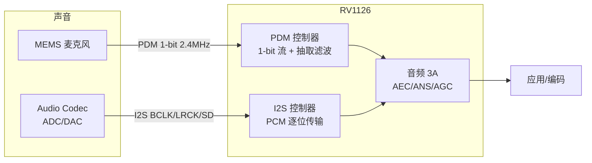

视频有像素格式，音频也有自己的"像素格式"——**PCM**。同一段声音，用不同的采样率、位深、声道存放，字节数、音质、兼容性完全不同；参数搞错，轻则文件变大数倍，重则声音变成刺耳噪声。这一篇把音频数字化基础讲透：声音如何变成字节、PCM 三要素（采样率/位深/声道）、I2S 与 PDM 两条硬件通路、WAV 与裸 PCM 的区别，然后在 PC 上装好 FFmpeg 与 GStreamer，跑通第一条命令：生成、查看、转码、播放一段音频。

## 一、声音怎么变成字节：PCM 三要素

自然界的声音是连续的空气振动，也就是模拟信号。计算机要处理它，必须**采样 + 量化**：每隔固定时间取一个电压值，再把电压值圆整成整数。这套"取样—量化—编码"的过程叫 **PCM（Pulse Code Modulation，脉冲编码调制）**。

类比：模拟信号是一条连续曲线，采样是"每隔 1 毫米在曲线上点一个点"，量化是"把每个点的位置圆整到毫米刻度上"。点得越密、刻度越细，还原的曲线越接近原样，代价是数据越多。

PCM 有三个决定数据量与音质的参数，也就是"音频三要素"：

| 参数 | 含义 | 常见取值 | 决定什么 |
|:---|:---|:---|:---|
| **采样率** | 每秒采样多少次（Hz） | 8k / 16k / 44.1k / 48k | 能还原的最高频率 |
| **位深** | 每个样本用多少 bit 表示 | 16bit / 24bit / 32bit | 动态范围（音量精度） |
| **声道数** | 同时录/放几路声音 | 1（单声道）/ 2（立体声） | 空间感与数据量 |

### 1.1 采样率：每秒拍多少"照片"

根据奈奎斯特采样定理，采样率至少要达到信号最高频率的 2 倍，才能无失真还原。人耳能听到的最高频率约 20kHz，所以高质量音频用 44.1kHz（CD 标准）或 48kHz（视频标准），刚好留出余量；电话只有 8kHz，因为人说话的主要能量集中在几百到 3kHz，够用即可。

工程上记几个档位：

- **8kHz**：电话音质，窄带语音，对讲/语音识别省带宽场景
- **16kHz**：宽带语音，VoIP 常见
- **44.1kHz**：音乐 CD 标准
- **48kHz**：视频行业事实标准（RV1126 的音频通路、HDMI、蓝光都用它）

### 1.2 位深：音量精度

每个样本用多少 bit，决定了能表示的音量级别数。16bit 有 65536 个级别，动态范围约 96dB，人耳感知"足够安静到足够响"的范围大约就这么多，所以 16bit 是主流；24bit 约 144dB，用于录音棚等需要大动态余量的场景。对嵌入式对讲来说 16bit 足够，位深翻倍数据量也翻倍，不必盲目追高。

### 1.3 声道数：一路还是两路

单声道只有一路信号（数据量最小）；立体声左右各一路，人耳能感知方位。麦克风采集通常单声道，播放给用户听常常要立体声（或至少双声道副本）。

### 1.4 音频数据量公式（背下来）

```
字节率（B/s）= 采样率 × 位深 ÷ 8 × 声道数
```

例：48kHz / 16bit / 立体声 = 48000 × 2 × 2 = 192000 B/s ≈ 187.5 KB/s ≈ 1.5 Mbps。和视频对比：1080p30 NV12 是 93MB/s，编码后 2~4Mbps——**音频在总码流里占比极小，但它是"最后一公里"的体验担当**：视频卡顿可以忍，声音断断续续或回声刺耳，用户立刻卸载。

【图1：PCM 采样与量化示意】


## 二、音频的"像素格式"：交错、字节序与裸流

和视频一样，音频也有"内存布局"问题。最常见的 PCM 布局：

- **交错（interleaved）**：左右声道样本按帧交替存放，如 `L R L R L R ...`。**这是绝大多数场景的默认格式**（WAV、ALSA 默认、FFmpeg 默认输入输出都是交错）
- **平面（planar）**：每个声道一整块，如 `LLLL... RRRR...`。某些音频框架（如 FFmpeg 内部、FFmpeg `-f s16le` 之外的 planar 格式）会用到

字节序同样关键：x86/ARM 小端平台上，16bit 样本按 **S16LE（signed 16-bit little-endian）** 存放，即低字节在前。FFmpeg 里裸 PCM 描述写法就是 `s16le`，例如：

```bash
# 把裸 PCM（48kHz/16bit/双声道）包装成 WAV
ffmpeg -f s16le -ar 48000 -ac 2 -i audio.raw audio.wav
```

类比视频：交错 PCM 相当于 NV12 的 UV 交错，平面 PCM 相当于 I420 的分平面；S16LE 相当于 RGB888 的字节序约定。**拿到一段裸音频，必须同时知道采样率、位深、声道数、字节序四个参数**，否则无法正确解析——这正是"参数错了，声音就是噪声"的原因。

## 三、硬件通路：I2S 与 PDM

CPU 与音频外设（codec、MEMS 麦克风）之间怎么传 PCM 数据？RV1126 上有两条典型通路：

### 3.1 I2S：数字音频的"标准总线"

**I2S（Inter-IC Sound）** 是传输 PCM 数据的串行总线，一般 4 根线：

- **BCLK**：位时钟，一个 bit 一个脉冲
- **LRCK/WS**：左右声道选择（帧同步），高电平右声道、低电平左声道（约定因实现而异）
- **SDI/SDO**：数据线（输入/输出各一根）
- **MCLK**：主时钟，供 codec 做内部时钟基准（部分方案需要）

I2S 适合接高质量 audio codec（ADC/DAC 芯片），支持 16/24/32bit、各种采样率，RV1126 提供多组 I2S（设备树节点名如 `i2s0~i2s3`，以 SDK 为准）。

类比：I2S 像"逐位传输的管道"，BCLK 是节拍器，LRCK 是左右分拣员，数据按节拍顺序流过。

### 3.2 PDM：MEMS 麦克风的"1-bit 密度流"

**PDM（Pulse Density Modulation，脉冲密度调制）** 不直接传 PCM，而是以极高采样率（如 2.4MHz~3.2MHz）输出 1-bit 流：**脉冲密度代表模拟幅度**。MEMS 麦克风内置调制器，可以直接输出 PDM，省掉 codec 芯片。SoC 侧需要**抽取滤波（decimation）**，把 1-bit 高采样率流降采样成标准 PCM（如 48kHz/16bit）。

类比：I2S 像"每拍报一个精确数字"（PCM），PDM 像"每秒狂点头/摇头表示大小"（1-bit 密度），后者要靠"数点头密度"（抽取滤波）还原数值。

工程判断：**板载麦克风阵列/语音唤醒常用 PDM（便宜、可多路）**，需要高保真录音/播放用 I2S + codec。RV1126 两者都有，具体哪组引脚可用、怎么配，以板卡原理图与 SDK 设备树为准。

【图2：I2S 与 PDM 两条音频通路】



> 注：音频 3A（回声消除/降噪/自动增益）是本系列后续的重点内容，这里先记住它的位置——在音频通路进入应用之前。

## 四、WAV 与裸 PCM：文件头是"说明书"

**WAV（RIFF/WAVE）** 是最简单的音频容器：头部加一段说明，后面跟 PCM 裸数据。头里记录采样率、位深、声道、数据长度，所以播放器拿到 WAV 就能正确解析。裸 PCM 没有头，解析全靠外部约定。

```text
WAV 文件 = RIFF 头（"RIFF" + 大小 + "WAVE"）
         + fmt 块（音频格式、声道数、采样率、位深...）
         + data 块（PCM 样本数据）
```

用 FFmpeg 生成一段 1kHz 正弦波 WAV（工具链装好后第一步）：

```bash
# 生成 5 秒 1kHz 正弦波，PCM 16bit
ffmpeg -f lavfi -i "sine=frequency=1000:duration=5" -c:a pcm_s16le tone_1k.wav

# 用 ffprobe 查看"说明书"
ffprobe tone_1k.wav
```

`ffprobe` 输出里的 `Sample rate`、`Channels`、`Sample format` 就是 WAV 头里记录的参数——这就是"音频三要素"落地的样子。

## 五、PC 工具链安装（双轨零成本）

本系列约定"PC 先跑通概念，再上板验证"。音频相关的 PC 工具链只需要两个：

### 5.1 FFmpeg

```bash
# Debian/Ubuntu
sudo apt update
sudo apt install -y ffmpeg
ffmpeg -version   # 记录你的版本，写作/排障时要用
```

Ubuntu 24.04 自带 FFmpeg 6.1.x；如果你需要更新的版本（7.x），可以从 ffmpeg 官方静态构建或第三方 PPA 安装，但 6.x 足够完成本系列所有练习。

### 5.2 GStreamer

```bash
sudo apt install -y gstreamer1.0-tools \
    gstreamer1.0-plugins-base gstreamer1.0-plugins-good \
    gstreamer1.0-plugins-bad gstreamer1.0-plugins-ugly \
    gstreamer1.0-libav
gst-launch-1.0 --version   # 记录版本（Ubuntu 24.04 为 1.24.x）
```

GStreamer 是一个插件化多媒体框架，后面流媒体篇章会大量用到，现在先装上并跑通播放。

## 六、第一条命令：生成 / 查看 / 转码 / 播放

### 6.1 FFmpeg 四连

```bash
# ① 生成：1kHz 正弦波 5 秒 → WAV
ffmpeg -f lavfi -i "sine=frequency=1000:duration=5" -c:a pcm_s16le tone_1k.wav

# ② 查看：参数一览（采样率/声道/位深/时长）
ffprobe tone_1k.wav

# ③ 转码：WAV → MP3（有损压缩，128kbps）
ffmpeg -i tone_1k.wav -c:a libmp3lame -b:a 128k tone_1k.mp3

# ④ 播放（带可视化窗口）
ffplay tone_1k.wav
```

对照第一节的公式：`tone_1k.wav` 是 48kHz / 16bit / 立体声（lavfi sine 默认输出），数据率 = 48000 × 2 × 2 = 192KB/s，5 秒 ≈ 960KB。用 `ls -l tone_1k.wav` 核对，误差只在头部几十字节。

### 6.2 双音混音：理解"多路声音叠加"

```bash
# 两个不同频率的正弦波混音，时长取较长的
ffmpeg -f lavfi -i "sine=frequency=440:duration=3" \
       -f lavfi -i "sine=frequency=660:duration=3" \
       -filter_complex "amix=inputs=2:duration=first" mix.wav
ffplay mix.wav
```

听感：440Hz（A4）与 660Hz（E5）叠加成"和弦"。**混音在数字域就是逐样本相加**——这是后面音频 3A（回声消除）的基础概念之一。

### 6.3 GStreamer 三连

```bash
# ① 直接听：合成 1kHz 正弦波 5 秒
gst-launch-1.0 audiotestsrc wave=sine freq=1000 num-buffers=250 ! autoaudiosink

# ② 播放 WAV 文件
gst-launch-1.0 filesrc location=tone_1k.wav ! wavparse ! autoaudiosink

# ③ 查看插件信息
gst-inspect-1.0 audiotestsrc
```

GStreamer 用 `!` 把元素串成管线：`audiotestsrc`（音源）→ `autoautosink`（自动选择输出设备）。不用写代码就搭起一条音频管线，后面流媒体章节会扩展成真正的采集→编码→推流管线。

## 七、动手练习

1. **手算 + 实测**：生成 48kHz/16bit/立体声 10 秒 WAV，手算字节数，再用 `ffprobe` 和 `ls -l` 核对；换 8kHz/单声道重来一遍，对比文件大小与听感（电话音质 vs 立体声）
2. **参数错了会怎样**：把 `tone_1k.wav` 当裸 PCM 用错误参数解析（如 `-ar 8000`），听一听"噪声"，体会参数约定的重要性
3. **转码对比**：同一段 WAV 分别转 64kbps 与 320kbps MP3，对比文件大小和音质（耳机听高音区差异）
4. **板卡盘点**：在 RV1126 板卡上执行 `cat /proc/asound/cards` 与 `aplay -l`，列出有哪些声卡、I2S/PDM 设备；对照 SDK 设备树找到对应节点（`i2s0`/`pdm` 等，以 SDK 为准）

## 里程碑

- [ ] 能说出 PCM 三要素并默写数据量公式（48k/16bit/双声道 = 192KB/s）
- [ ] 能区分交错/平面 PCM、S16LE 的含义，知道裸 PCM 解析必须带齐四个参数
- [ ] 能解释 I2S 与 PDM 的区别（PCM 逐位传输 vs 1-bit 密度流 + 抽取滤波）
- [ ] 能独立跑通 FFmpeg 生成/查看/转码/播放与 GStreamer 播放管线
- [ ] 能在板卡上找到声卡设备并说出 RV1126 的音频通路位置（3A 在采集之后）

> 🏷️ 标签：PCM · 采样率 · 位深 · 声道 · I2S · PDM · WAV · FFmpeg · GStreamer · 音频
