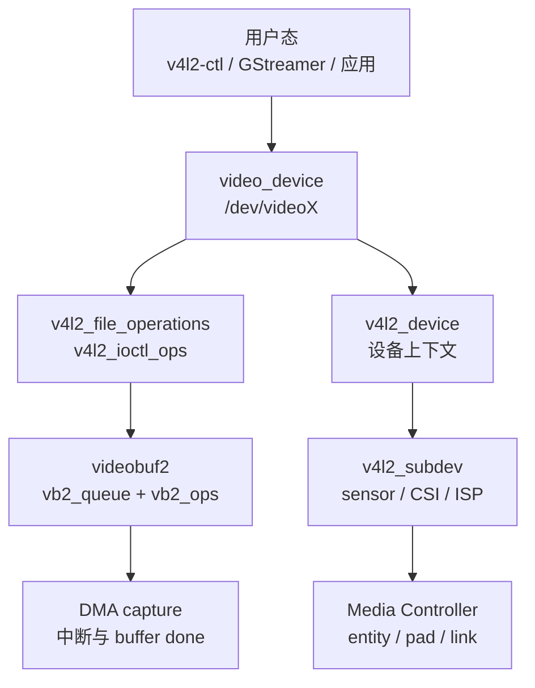
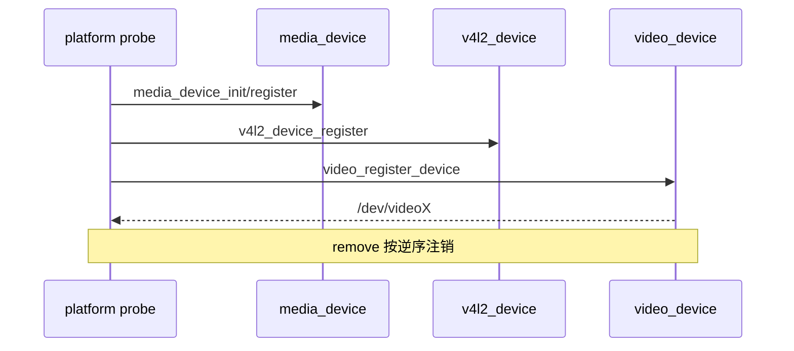
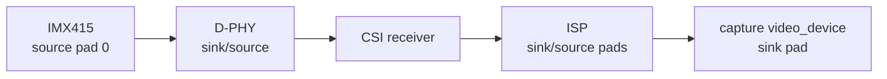
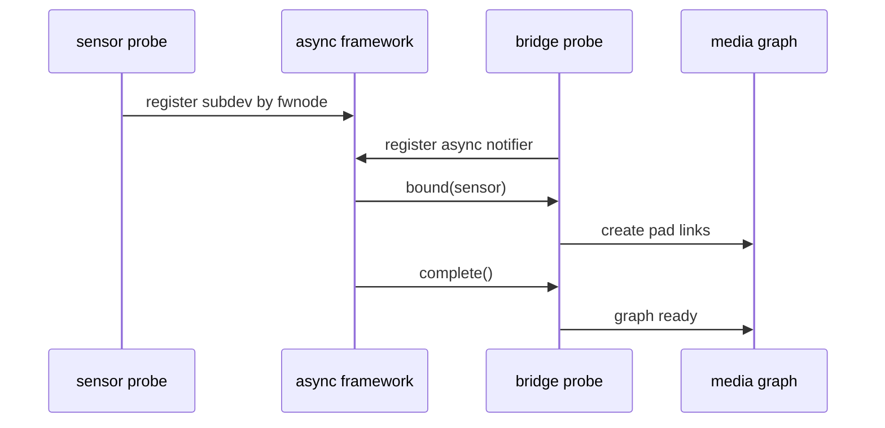
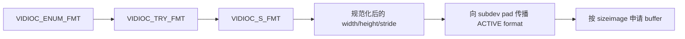
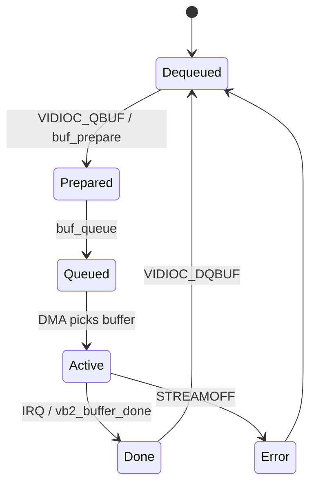
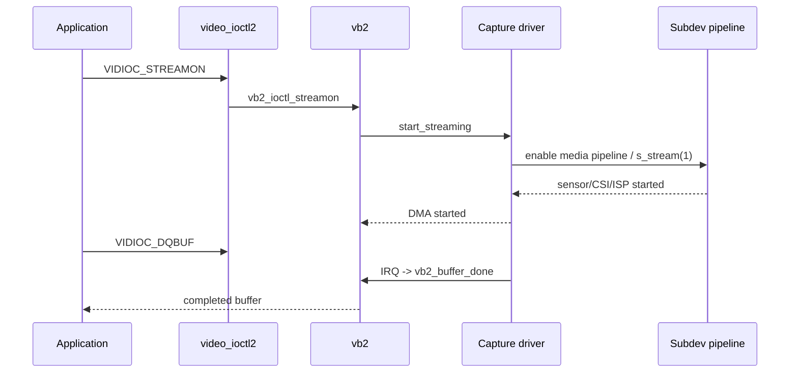

# V4L2 与 Media Controller：Linux 视频驱动框架

应用看到的是 `/dev/videoX` 和一组 ioctl，SoC 内部却是一条由 sensor、MIPI D-PHY、CSI receiver、ISP、scaler 与 DMA capture 组成的硬件管线。V4L2 负责用户态视频 API，Media Controller 负责描述实体、端口和连接，V4L2 subdev 负责控制没有独立数据节点的硬件子模块，videobuf2 负责流式 buffer 状态机。

只有把这四层合在一起，才能解释三个关键问题：`/dev/video0` 是谁注册的、`VIDIOC_S_FMT` 怎样传播到 sensor、`VIDIOC_DQBUF` 为什么会阻塞或返回一帧。

## 一、驱动框架全景：四套 API 各管一层



| 框架 | 核心对象 | 解决的问题 |
|:---|:---|:---|
| V4L2 core | `v4l2_device`、`video_device`、`v4l2_fh` | 设备注册、文件句柄、ioctl 分发 |
| V4L2 subdev | `v4l2_subdev`、`v4l2_subdev_ops` | sensor、bridge、ISP 等子设备控制 |
| Media Controller | `media_device`、entity、pad、link | 描述并配置媒体拓扑 |
| videobuf2 | `vb2_queue`、`vb2_buffer`、`vb2_ops` | buffer 分配、排队、流状态与内存模型 |
| V4L2 controls | `v4l2_ctrl_handler`、`v4l2_ctrl_ops` | 曝光、增益、link frequency 等标准控制项 |

这几套 API 不是互相替代。一个 capture 驱动通常同时注册 `video_device`、初始化 `vb2_queue`，并通过 Media link 连接上游 subdev。

## 二、`v4l2_device`：把多个视频对象组织到同一上下文

`struct v4l2_device` 是 V4L2 框架的顶层容器，保存设备名、subdev 链表、通知回调和 media_device 指针。平台驱动通常在 probe 中注册：

```c
struct capture_dev {
    struct device *dev;
    struct v4l2_device v4l2_dev;
    struct media_device media_dev;
    struct video_device video_dev;
    struct vb2_queue queue;
};

static int capture_probe(struct platform_device *pdev)
{
    struct capture_dev *cap;
    int ret;

    cap = devm_kzalloc(&pdev->dev, sizeof(*cap), GFP_KERNEL);
    if (!cap)
        return -ENOMEM;

    cap->dev = &pdev->dev;
    strscpy(cap->media_dev.model, "demo-capture",
            sizeof(cap->media_dev.model));
    cap->media_dev.dev = &pdev->dev;
    media_device_init(&cap->media_dev);

    cap->v4l2_dev.mdev = &cap->media_dev;
    ret = v4l2_device_register(&pdev->dev, &cap->v4l2_dev);
    if (ret)
        goto err_media_cleanup;

    ret = media_device_register(&cap->media_dev);
    if (ret)
        goto err_v4l2_unregister;

    platform_set_drvdata(pdev, cap);
    return 0;

err_v4l2_unregister:
    v4l2_device_unregister(&cap->v4l2_dev);
err_media_cleanup:
    media_device_cleanup(&cap->media_dev);
    return ret;
}
```

`v4l2_device_register()` 不会自动产生 `/dev/videoX`。它只注册框架上下文；真正的字符设备节点由 `video_register_device()` 创建。

删除路径必须按注册的逆序释放：停止硬件和异步匹配、注销 video_device、注销 media_device、注销 v4l2_device，最后 cleanup media_device。



## 三、`video_device`：`/dev/videoX` 的内核对象

`video_device` 描述一个面向用户态的节点。它需要绑定 file operations、ioctl operations、release 回调、锁、queue 与 capabilities。

```c
static const struct v4l2_file_operations capture_fops = {
    .owner          = THIS_MODULE,
    .open           = v4l2_fh_open,
    .release        = vb2_fop_release,
    .poll           = vb2_fop_poll,
    .unlocked_ioctl = video_ioctl2,
    .mmap           = vb2_fop_mmap,
    .read           = vb2_fop_read,
};

static const struct v4l2_ioctl_ops capture_ioctl_ops = {
    .vidioc_querycap                = capture_querycap,
    .vidioc_enum_fmt_vid_cap        = capture_enum_fmt,
    .vidioc_g_fmt_vid_cap_mplane    = capture_g_fmt,
    .vidioc_try_fmt_vid_cap_mplane  = capture_try_fmt,
    .vidioc_s_fmt_vid_cap_mplane    = capture_s_fmt,
    .vidioc_reqbufs                 = vb2_ioctl_reqbufs,
    .vidioc_querybuf                = vb2_ioctl_querybuf,
    .vidioc_qbuf                    = vb2_ioctl_qbuf,
    .vidioc_dqbuf                   = vb2_ioctl_dqbuf,
    .vidioc_streamon                = vb2_ioctl_streamon,
    .vidioc_streamoff               = vb2_ioctl_streamoff,
};
```

这里的 `video_ioctl2` 是通用 ioctl 分发器。它根据 ioctl 编号调用 `v4l2_ioctl_ops`，并处理结构体复制、优先级和部分框架检查。

注册节点时设置 queue 和 lock：

```c
cap->video_dev.v4l2_dev = &cap->v4l2_dev;
cap->video_dev.fops = &capture_fops;
cap->video_dev.ioctl_ops = &capture_ioctl_ops;
cap->video_dev.release = video_device_release_empty;
cap->video_dev.lock = &cap->mutex;
cap->video_dev.queue = &cap->queue;
cap->video_dev.device_caps = V4L2_CAP_VIDEO_CAPTURE_MPLANE |
                             V4L2_CAP_STREAMING;
video_set_drvdata(&cap->video_dev, cap);

ret = video_register_device(&cap->video_dev, VFL_TYPE_VIDEO, -1);
```

`video_register_device()` 成功后才能从 `video_device_node_name()` 或系统日志确认具体 `/dev/videoX`。设备编号是动态分配的，不能在驱动逻辑中假定永远是 video0。

## 四、`v4l2_fh`：每次 open 的文件句柄状态

一个 video_device 可以被多个进程或多个 fd 打开。每次 open 的私有状态应放在 `v4l2_fh` 派生对象中，而不是全局变量。

```c
struct capture_fh {
    struct v4l2_fh fh;
    struct capture_dev *cap;
};

static int capture_open(struct file *file)
{
    struct video_device *vdev = video_devdata(file);
    struct capture_dev *cap = video_get_drvdata(vdev);
    struct capture_fh *ctx;

    ctx = kzalloc(sizeof(*ctx), GFP_KERNEL);
    if (!ctx)
        return -ENOMEM;

    v4l2_fh_init(&ctx->fh, vdev);
    ctx->cap = cap;
    file->private_data = &ctx->fh;
    v4l2_fh_add(&ctx->fh);
    return 0;
}
```

释放时执行 `v4l2_fh_del()`、`v4l2_fh_exit()` 和 kfree。若使用 `vb2_fop_release`，queue owner 与 fh 的组合需要按 vb2 框架约定初始化。

`v4l2_fh` 还承担 event subscription、controls ownership 和优先级状态。应用订阅 source change 或 control event 时，事件最终进入对应 fh 的队列。

## 五、Media Controller：实体、Pad 与 Link

Media Controller 把硬件表示为有向图：entity 是处理单元，pad 是端口，link 是端口间连接。pad 标记为 sink 或 source。

```c
cap->pad.flags = MEDIA_PAD_FL_SINK;
cap->video_dev.entity.function = MEDIA_ENT_F_IO_V4L;
ret = media_entity_pads_init(&cap->video_dev.entity, 1, &cap->pad);
```

sensor 驱动中的 source pad：

```c
sensor->pad.flags = MEDIA_PAD_FL_SOURCE;
sensor->sd.entity.function = MEDIA_ENT_F_CAM_SENSOR;
ret = media_entity_pads_init(&sensor->sd.entity, 1, &sensor->pad);
```

bridge 或 pipeline 管理者建立 link：

```c
ret = media_create_pad_link(&sensor->sd.entity, 0,
                            &cap->video_dev.entity, 0,
                            MEDIA_LNK_FL_ENABLED |
                            MEDIA_LNK_FL_IMMUTABLE);
```

真实 SoC 链路常为 sensor → D-PHY → CSI → ISP → DMA capture。Device Tree 的 endpoint/remote-endpoint 描述固有连接，驱动解析 fwnode 后创建 graph。



### link validate 与 link setup

Media pipeline 启动前可执行 link validation，检查相邻 pad 的 media bus code、尺寸和 field 是否兼容。可变 link 的 enable/disable 则通过 entity operations 管理。

如果 graph 能枚举但 streamon 报 pipeline validation 错误，应检查每个 pad 的 ACTIVE format，而不是只检查 `/dev/videoX` 的 pixel format。

## 六、异步匹配：为什么 sensor 与 bridge 能任意 probe

I2C sensor、CSI bridge 和 capture platform driver 的 probe 顺序不固定。async notifier 让 bridge 根据 Device Tree fwnode 描述等待远端 subdev；匹配完成后再建立 media link。

内核版本不同，API 名称从较早的 `v4l2_async_notifier_*` 演进到较新的 `v4l2_async_nf_*`。文章所配 IMX415 源码调用：

```c
v4l2_async_register_subdev_sensor_common(sd);
```

现代驱动还可使用 async notifier 的 bound、complete、unbind 回调。阅读代码时应先确认目标 kernel 版本，不要把最新文档函数名机械替换到旧 BSP。

典型时序：



## 七、subdev：控制没有直接数据节点的硬件

sensor、decoder、CSI、ISP 通常注册 `v4l2_subdev`。subdev ops 分为 core、video、pad 等组：

```c
static const struct v4l2_subdev_core_ops imx415_core_ops = {
    .s_power = imx415_s_power,
    .ioctl = imx415_ioctl,
};

static const struct v4l2_subdev_video_ops imx415_video_ops = {
    .s_stream = imx415_s_stream,
    .g_frame_interval = imx415_g_frame_interval,
};

static const struct v4l2_subdev_pad_ops imx415_pad_ops = {
    .enum_mbus_code = imx415_enum_mbus_code,
    .enum_frame_size = imx415_enum_frame_sizes,
    .get_fmt = imx415_get_fmt,
    .set_fmt = imx415_set_fmt,
};
```

仓库源码在 probe 中执行：

```c
v4l2_i2c_subdev_init(sd, client, &imx415_subdev_ops);
v4l2_ctrl_handler_init(handler, 8);
media_entity_pads_init(&sd->entity, 1, &imx415->pad);
v4l2_async_register_subdev_sensor_common(sd);
```

这四步分别建立 subdev 身份、controls、Media pad 和异步注册。

## 八、TRY 与 ACTIVE：格式协商不能直接改硬件

subdev format 包含 width、height、media bus code、field 与 colorspace。`V4L2_SUBDEV_FORMAT_TRY` 是每个 file handle 的协商草稿；`V4L2_SUBDEV_FORMAT_ACTIVE` 是设备当前配置。

```c
static int sensor_set_fmt(struct v4l2_subdev *sd,
                          struct v4l2_subdev_state *state,
                          struct v4l2_subdev_format *fmt)
{
    const struct sensor_mode *mode = find_best_fit(&fmt->format);

    fmt->format.width = mode->width;
    fmt->format.height = mode->height;
    fmt->format.code = MEDIA_BUS_FMT_SRGGB10_1X10;

    if (fmt->which == V4L2_SUBDEV_FORMAT_TRY) {
        *v4l2_subdev_state_get_format(state, fmt->pad) = fmt->format;
        return 0;
    }

    sensor->cur_mode = mode;
    return 0;
}
```

旧内核使用 `v4l2_subdev_pad_config` 和 `v4l2_subdev_get_try_format()`；新内核使用 `v4l2_subdev_state`。语义相同：TRY 不能修改全局 ACTIVE 状态。

## 九、三种格式：mbus、pixel 与内存 plane

sensor pad 使用 media bus format，例如 `MEDIA_BUS_FMT_SRGGB10_1X10`；capture 节点使用 pixel format，例如 `V4L2_PIX_FMT_NV12`；多平面 API 使用 `struct v4l2_pix_format_mplane`。

```text
Sensor RAW10 mbus code
  -> ISP 输入 pad RAW10
  -> ISP 输出 pad NV12/RGB
  -> video node V4L2_PIX_FMT_NV12
  -> memory planes / bytesperline / sizeimage
```

`V4L2_BUF_TYPE_VIDEO_CAPTURE_MPLANE` 表示 multi-planar capture API。NV12 可以在一个 plane 中连续存 Y+UV，也可以按驱动约定用多个 memory plane；应用必须读取 `num_planes`、`bytesperline` 和 `sizeimage`，不能只按 width×height 猜 buffer 大小。

格式 ioctl 顺序：



crop/compose 使用 selection API。sensor crop、ISP crop 和 scaler compose 是不同阶段，不能只修改最终 video node 尺寸就假定上游 sensor 也改变读取窗口。

## 十、V4L2 controls：标准参数与一致性

`v4l2_ctrl_handler` 管理标准 controls。sensor probe 中创建 link frequency、pixel rate、exposure、analogue gain、test pattern 等：

```c
v4l2_ctrl_handler_init(&sensor->ctrl_handler, 8);
v4l2_ctrl_new_std(&sensor->ctrl_handler, &sensor_ctrl_ops,
                  V4L2_CID_EXPOSURE, min, max, step, def);
v4l2_ctrl_new_std_menu_items(&sensor->ctrl_handler, &sensor_ctrl_ops,
                             V4L2_CID_TEST_PATTERN,
                             ARRAY_SIZE(patterns) - 1, 0, 0, patterns);
sd->ctrl_handler = &sensor->ctrl_handler;
```

易变 control 用 volatile 标记并实现 `g_volatile_ctrl`。互相依赖的 controls 可组成 cluster；streaming 时不能改变的 control 可 grab。controls framework 还处理范围检查、event 和并发锁。

私有 ioctl 只适合标准框架无法表达的厂商扩展。曝光、增益、flip 等已有标准 CID 时应优先标准 control，才能被 `v4l2-ctl`、GStreamer 和通用应用识别。

## 十一、videobuf2：queue 初始化

`vb2_queue` 连接用户态 buffer API 和驱动 DMA 队列。初始化时至少设置 type、io_modes、ops、mem_ops、buffer struct 大小、timestamp flags、锁和 device：

```c
cap->queue.type = V4L2_BUF_TYPE_VIDEO_CAPTURE_MPLANE;
cap->queue.io_modes = VB2_MMAP | VB2_DMABUF | VB2_READ;
cap->queue.drv_priv = cap;
cap->queue.buf_struct_size = sizeof(struct capture_buffer);
cap->queue.ops = &capture_vb2_ops;
cap->queue.mem_ops = &vb2_dma_contig_memops;
cap->queue.timestamp_flags = V4L2_BUF_FLAG_TIMESTAMP_MONOTONIC;
cap->queue.lock = &cap->mutex;
cap->queue.dev = cap->dev;
ret = vb2_queue_init(&cap->queue);
```

`vb2_dma_contig_memops` 适合需要连续 DMA 地址的平台；IOMMU、scatter-gather 或 vmalloc 场景可能使用其它 memops。memops 决定内存分配与映射方式，vb2_ops 决定驱动状态机。

## 十二、vb2_ops：五个关键回调

```c
static const struct vb2_ops capture_vb2_ops = {
    .queue_setup     = capture_queue_setup,
    .buf_prepare     = capture_buf_prepare,
    .buf_queue       = capture_buf_queue,
    .start_streaming = capture_start_streaming,
    .stop_streaming  = capture_stop_streaming,
    .wait_prepare    = vb2_ops_wait_prepare,
    .wait_finish     = vb2_ops_wait_finish,
};
```

### `queue_setup`

根据当前 pixel format 返回 plane 数量和每 plane 最小长度。应用请求 buffer 数量只是建议，驱动可以依据硬件 ring 限制调整。

### `buf_prepare`

在每次 QBUF 前校验 plane 大小，并设置 payload。这里只做快速检查，不启动 DMA。

### `buf_queue`

把 prepared buffer 挂入驱动的待用链表；若硬件已 streaming，可立刻给 DMA 描述符。

### `start_streaming`

检查最小 buffer 数，启动上游 subdev、配置 DMA、打开中断。任何失败都必须把已排队 buffer 以 `VB2_BUF_STATE_QUEUED` 或 ERROR 归还。

### `stop_streaming`

停止 DMA 和中断，停止上游，遍历 active/queued 列表，调用 `vb2_buffer_done(..., VB2_BUF_STATE_ERROR)`。遗漏归还会让用户态永久等不到 DQBUF。



## 十三、DMA 中断：一帧如何到达 `VIDIOC_DQBUF`

硬件 frame-end 中断中，驱动找到当前 active buffer，写 sequence、timestamp 与 payload，然后：

```c
buffer->vb.sequence = cap->sequence++;
buffer->vb.vb2_buf.timestamp = ktime_get_ns();
vb2_set_plane_payload(&buffer->vb.vb2_buf, 0, cap->sizeimage);
vb2_buffer_done(&buffer->vb.vb2_buf, VB2_BUF_STATE_DONE);
```

`vb2_buffer_done` 将 buffer 从 active 转到 done queue，唤醒阻塞的 `VIDIOC_DQBUF`、poll 或 read。ISR 不应睡眠；复杂错误恢复放到 threaded IRQ 或 workqueue。

## 十四、用户态 ioctl 与内核调用链

典型用户态流程及其内核落点：

| 用户 ioctl | 内核主要动作 |
|:---|:---|
| `VIDIOC_QUERYCAP` | 返回 driver/card/bus_info/device_caps |
| `VIDIOC_ENUM_FMT` | 枚举 video node 支持格式 |
| `VIDIOC_S_FMT` | 规范化尺寸、stride、sizeimage，并传播格式 |
| `VIDIOC_REQBUFS` | vb2 分配/导入 buffer |
| `VIDIOC_QBUF` | prepare 后进入 driver queue |
| `VIDIOC_STREAMON` | vb2 调 `start_streaming`，启动 pipeline |
| `VIDIOC_DQBUF` | 等待 done queue，取完成 buffer |
| `VIDIOC_STREAMOFF` | vb2 调 `stop_streaming` 并归还所有 buffer |



## 十五、streamoff、错误与所有权

STREAMOFF 不是简单清空一个标志。正确顺序通常是：阻止新 DMA、等待或复位当前传输、关中断、停止上游 pipeline、归还所有 buffer、清理错误状态。

buffer 的所有权在应用、vb2 queue 与硬件之间转移。QBUF 后应用不能写 MMAP buffer；DQBUF 后应用重新拥有。DMABUF 还涉及 exporter/importer 的 attachment、map 与 cache 同步。

典型错误：

- `start_streaming` 失败却不归还 queued buffer；
- IRQ 与 streamoff 同时操作 active list，没有 spinlock；
- stop 先断 sensor，CSI/DMA 尚有尾帧导致超时；
- buffer error 未设置，应用把损坏帧当正常帧；
- sequence 与 timestamp 在不同锁域更新，产生跳号。

## 十六、runtime PM 与流生命周期

sensor 不应在 probe 后永远保持供电。runtime PM 让设备在无 open/stream 时关闭 regulator、clock 与 GPIO。

仓库 IMX415 驱动在 stream 前取得 runtime PM 引用，在 stop 后释放。概念调用链：

```text
open/stream request
  -> pm_runtime_resume_and_get
  -> regulator/clock/reset enable
  -> write mode registers
  -> s_stream(1)
stop
  -> s_stream(0)
  -> pm_runtime_put
  -> runtime_suspend powers down
```

controls 在设备 suspend 时可以只更新缓存；resume 或 stream start 时再 `v4l2_ctrl_handler_setup()` 应用到硬件。直接在每次 set_ctrl 都无条件访问 I2C，会在设备掉电时失败。

## 十七、用仓库 IMX415 源码串起框架

配套 `src/imx415.c` 的关键落点：

1. `imx415_probe()` 分配私有结构并解析设备树；
2. `v4l2_i2c_subdev_init()` 把 I2C client 与 subdev ops 关联；
3. `v4l2_ctrl_handler_init()` 注册曝光、增益、link frequency 等；
4. `media_entity_pads_init()` 创建 sensor source pad；
5. `v4l2_async_register_subdev_sensor_common()` 进入异步匹配；
6. `imx415_set_fmt()` 处理 TRY/ACTIVE 和 mode 选择；
7. `imx415_s_stream()` 处理 runtime PM、controls、寄存器表与 stream bit；
8. remove 中注销 subdev、cleanup entity/controls、关闭 PM。

sensor 驱动没有 `vb2_queue`，因为它不把图像 DMA 到内存；vb2 位于下游 RKCIF/ISP capture 驱动。把 vb2_ops 硬塞进 sensor 驱动是分层错误。

## 十八、调试方法：沿框架逐层缩小

### 注册层

```bash
dmesg | grep -Ei 'imx415|v4l2|rkcif|rkisp'
ls -l /dev/video* /dev/v4l-subdev*
v4l2-ctl --list-devices
```

### Media graph

```bash
media-ctl -p
media-ctl -d /dev/media0 --print-dot
```

检查 entity 是否存在、pad 方向是否正确、link 是否 enabled、每个 pad ACTIVE format 是否连续。

### video node 能力与格式

```bash
v4l2-ctl -d /dev/videoX --all
v4l2-ctl -d /dev/videoX --list-formats-ext
v4l2-ctl -d /dev/videoX --get-fmt-video
```

### buffer/stream

```bash
v4l2-ctl -d /dev/videoX \
  --set-fmt-video=width=1920,height=1080,pixelformat=NV12 \
  --stream-mmap=4 --stream-count=100 --stream-to=/tmp/out.nv12
```

DQBUF 超时重点看：上游 `s_stream` 是否成功、CSI 是否有帧中断、DMA active buffer 是否存在、IRQ 是否调用 `vb2_buffer_done`。

### 动态调试

```bash
mount -t debugfs none /sys/kernel/debug
cat /sys/kernel/debug/dynamic_debug/control | grep -Ei 'videobuf2|v4l2|imx415'
```

按目标内核开启对应模块 dynamic debug，避免全局 printk 淹没时序。

## 十九、常见故障定位表

| 现象 | 优先检查 |
|:---|:---|
| sensor probe 成功但无 video node | async notifier、bridge probe、media_device/video_device 注册 |
| media graph 缺 link | DT endpoint、fwnode 匹配、bound 回调 |
| S_FMT 成功但画面格式错 | mbus code 到 pixel format 映射、stride/plane |
| STREAMON 返回 EINVAL | 最小 buffer 数、pipeline validation、ACTIVE format |
| DQBUF 永久阻塞 | DMA IRQ、active list、`vb2_buffer_done` |
| STREAMOFF 卡住 | DMA 停止顺序、buffer error completion、锁竞争 |
| 曝光控制无效 | ctrl handler、runtime PM、handler_setup、寄存器 group hold |
| 第二次打开失败 | `v4l2_fh`/queue owner、资源未在 release 中归还 |

## 二十、框架边界总结

- `v4l2_device` 组织设备，`video_device` 暴露节点，`v4l2_fh` 保存每次 open 状态；
- `v4l2_subdev` 控制 sensor/CSI/ISP，Media Controller 表达它们的拓扑；
- mbus format 描述硬件总线，pixel/mplane format 描述内存布局；
- vb2 管 buffer 状态，驱动负责把排队 buffer 交给 DMA 并在中断中完成；
- controls、async notifier 与 runtime PM 分别解决标准参数、probe 顺序和功耗；
- sensor 驱动与 capture 驱动职责不同：前者配寄存器和输出格式，后者管理 DMA 与 vb2。

## 官方参考

- [Linux kernel: V4L2 device instance](https://docs.kernel.org/driver-api/media/v4l2-device.html)
- [Linux kernel: V4L2 sub-device userspace API](https://docs.kernel.org/driver-api/media/v4l2-subdev.html)
- [Linux kernel: Media Controller core](https://docs.kernel.org/driver-api/media/mc-core.html)
- [Linux kernel: videobuf2 framework](https://docs.kernel.org/driver-api/media/v4l2-videobuf2.html)

> 标签：V4L2 · Media Controller · v4l2_subdev · video_device · videobuf2 · DMA · runtime PM
