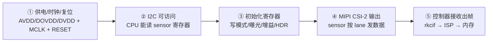
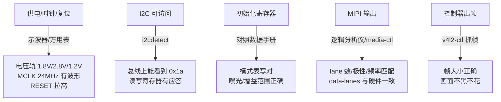
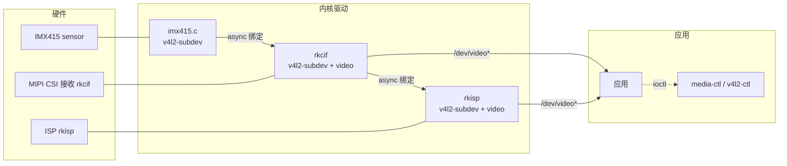
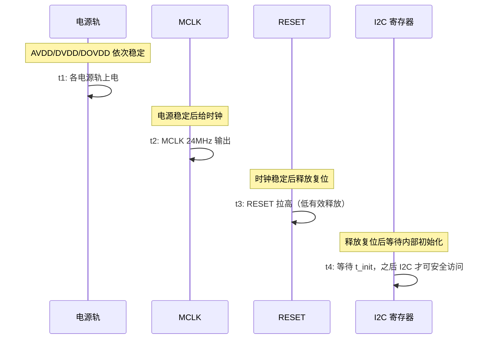

前面几篇把平台和格式讲清楚了，现在做整条视频管线里最"硬核"的一步：**把摄像头点亮**。点亮 = 电源、时钟、复位都正确 → CPU 能通过 I2C 读写 sensor → sensor 开始按 MIPI CSI-2 输出图像 → SoC 的控制器把数据收进内存。

这一篇是**实操手册**，不是泛泛讲原理。前提是你手上有一块正点原子 RV1126 开发板 + IMX415 模组，SDK 在 PC 上（`~/RV1126/atk-rv1126-sdk`）。整篇按"照着做"组织：

- 第一步：**先确认原厂固件已经点亮**（大概率你的板子出厂就能出图，先看到真实输出）
- 第二步：**定位并读懂原厂配置**（用 find/grep 找到 SDK 里真实的设备树和驱动）
- 第三步：**改一处配置、编译、烧录、验证**（把"看懂"变成"改懂"）

每步都有命令、预期输出、输出不对时的排查方向。凡是不同批次固件/资料可能不同的东西（文件名、总线号、波特率），一律教你怎么**动态定位**，不写死。

## 一、点亮全路径：从寄存器到内存

一颗摄像头模组，本质是"一个图像传感器 + 一块小 PCB"。要让它在 Linux 里出图，必须依次打通五关：



- **① 供电/时钟/复位**：sensor 有多个电源轨（模拟 AVDD、数字 DVDD、IO DOVDD），一颗主时钟 MCLK（常见 24MHz）驱动内部时序，一根复位脚控制启动。三者顺序错了，后面全免谈。
- **② I2C 可访问**：CPU 通过 I2C 总线读写 sensor 内部寄存器。I2C 有应答 = sensor 活着。
- **③ 初始化寄存器**：按数据手册的初始化表写入，配置输出模式（分辨率/帧率/数据格式）、曝光与增益范围、HDR 开关等。
- **④ MIPI CSI-2 输出**：sensor 把像素数据按 CSI-2 协议打包，通过 data lane（数据通道）串行发出。
- **⑤ 控制器接收出帧**：SoC 的 MIPI CSI 接收控制器（RV1126 上是 rkcif）解包，交给 ISP 处理，最终落到内存——应用就能拿到一帧图了。

类比：sensor 是一台"自带胶卷的相机"，I2C 是它的遥控器，MIPI 是传照片的数据线，rkcif 是接收照片的前台，ISP 是冲印房。点亮摄像头 = 电源插好、遥控器能按、相机开始连拍、前台把照片收进仓库。

【图1：点亮五关与对应排查点】



## 二、Linux 摄像头驱动框架：V4L2 / subdev / media-controller / async

Linux 里摄像头不是"一个大驱动"，而是**一组协同工作的驱动**，它们通过一套标准框架对接：

- **V4L2（Video4Linux2）**：用户空间看到的 API。采集设备是 `/dev/video*`，每个视频节点对应一个"能出图/进图"的通道；子设备是 `/dev/v4l-subdev*`，对应 sensor 等硬件单元。应用用 `open/ioctl/mmap` 就能抓帧。
- **v4l2-subdev**：把 sensor、MIPI 控制器、ISP 等硬件单元抽象成"子设备"。每个 subdev 有输入输出 **pad**（端点）、可查询/设置的 **format**（分辨率、像素格式）、可操作的 **control**（曝光、增益）。sensor 驱动本质上是一个 `v4l2_subdev` 的实例。
- **media-controller**：把各个子设备按"实体—pad—link"连成拓扑图，描述数据从 sensor 流到 ISP 的路径。用户空间用 `media-ctl` 查看/修改这张图。
- **v4l2-async**：解决"探测顺序不确定"的问题。sensor 驱动和 CSI/ISP 驱动是独立模块，谁先加载不一定；双方都用异步通知注册自己，等"我的数据源/我的接收者"都就绪后，框架自动完成绑定。



图里的每一条连线都对应设备树里的一个 endpoint 链接。**把设备树、驱动、用户空间三者的名字对上，是排障的第一步**。这一篇后面每一步实操，你都会看到这三层名字在真实系统里出现。

## 三、设备树适配：让内核认识摄像头

设备树（Device Tree）是 Linux 的"硬件描述文件"，告诉内核：这个 sensor 挂在哪条 I2C 上、用什么时钟、哪根 GPIO 是复位、数据走几根 lane。

### 3.0 实操先导：在你的 SDK 里定位真实文件

**先别急着抄下面的 dts 代码**——下面代码是"参考结构"，是为了让你读得懂；你要改的是你自己 SDK 里**真实存在**的那份。怎么找到它？三条命令，在你的 SDK 根目录执行：

```bash
cd ~/RV1126/atk-rv1126-sdk

# ① 找板级 dts：所有 rv1126 相关的 dts/dtsi 文件
find kernel/arch/arm/boot/dts -iname "*rv1126*" -name "*.dts*" | sort
```

预期输出（示例，不同 SDK 版本文件名可能不同，但结构一致）：

```text
kernel/arch/arm/boot/dts/rv1126-atk-rv1126.dts        ← 板级 dts，最顶层
kernel/arch/arm/boot/dts/rv1126-atk-rv1126-cam.dtsi   ← 摄像头 dtsi（重点）
kernel/arch/arm/boot/dts/rv1126-evb.dtsi
kernel/arch/arm/boot/dts/rv1126-cam.dtsi
kernel/arch/arm/boot/dts/rv1126-cam-av4l2.dtsi
```

```bash
# ② 在 dts 目录里搜 imx415，找出哪些文件配置了它
grep -rn "imx415" kernel/arch/arm/boot/dts/ | grep -v "imx415.c"
```

预期输出（示例）：

```text
kernel/arch/arm/boot/dts/rv1126-atk-rv1126-cam.dtsi:42: imx415: imx415@1a {
kernel/arch/arm/boot/dts/rv1126-atk-rv1126-cam.dtsi:80:  remote-endpoint = <&mipi_csi2_in>;
```

```bash
# ③ 确认驱动源码存在，并看 SDK 里驱动版本
ls -l kernel/drivers/media/i2c/imx415.c
grep -n "SONY_IMX415\|imx415" kernel/drivers/media/i2c/imx415.c | head -5
```

**这一节做完，你手上应该有**：一份真实的板级 dts 路径、一份包含 imx415 节点的 dtsi 路径、一份驱动源码路径。**把它们抄在笔记本上**，后面的操作都围绕这三个文件。如果某条命令没找到任何结果，先别继续——去 `find kernel/ -name "*imx415*"` 全内核搜，确认你的 SDK 里驱动是否被裁剪掉了。

### 3.1 sensor 节点：挂在 I2C 总线上

sensor 用 I2C 控制，所以它的节点是某条 I2C 控制器的子节点。参考结构（对照你刚找到的真实节点看）：

```dts
&i2c3 {
    status = "okay";
    clock-frequency = <100000>;          // I2C 速率

    imx415: imx415@1a {                   // reg = I2C 7bit 地址 0x1a
        compatible = "sony,imx415";       // 与驱动 match 表对应
        reg = <0x1a>;

        clocks = <&cru CLK_MIPICSI_OUT>;  // MCLK 时钟源
        clock-names = "xvclk";

        pinctrl-names = "default";        // 引脚复用
        pinctrl-0 = <&mipicsi_out_pins>;

        power-domains = <&power RV1126_PD_VI>;  // 视频输入电源域

        reset-gpios = <&gpio2 RK_PB6 GPIO_ACTIVE_LOW>;  // 复位脚

        rockchip,camera-module-index = <0>;
        rockchip,camera-module-facing = "back";
        rockchip,camera-module-name = "default";
        rockchip,camera-module-lens-name = "default";

        port {
            imx415_out: endpoint {
                remote-endpoint = <&mipi_csi2_in>;  // 指向 CSI 接收端
                data-lanes = <1 2 3 4>;             // 用了 4 根 lane
                link-frequencies = /bits/ 64
                    <891000000>;                    // MIPI 链路时钟
            };
        };
    };
};
```

**怎么验证"我 SDK 里的节点长这样"**：打开你刚定位到的 `*-cam.dtsi`，找到 `imx415:` 节点，逐字段对比。**你 SDK 里真实的节点才是标准答案**，上面这份是帮助你理解每一行的"注释版"。

各字段含义（**设备树字段 = 驱动代码里能查到的硬件事实**）：

| 字段 | 含义 | 排障对应 |
|:---|:---|:---|
| `compatible` | 驱动匹配的字符串 | 驱动没 probe 先查它是否匹配 |
| `reg` | I2C 从机地址 | i2cdetect 应看到同一地址 |
| `clocks/clock-names` | MCLK 时钟源 | 示波器量 MCLK 引脚是否有波形 |
| `pinctrl-0` | 引脚复用配置 | MCLK 复用错了就没有时钟输出 |
| `power-domains` | 电源域 | 漏配可能导致上电时序错乱 |
| `reset-gpios` | 复位 GPIO | 电平极性反了 sensor 一直复位 |
| `data-lanes` | 使用几根数据 lane | 与硬件接线、sensor 输出必须一致 |
| `link-frequencies` | MIPI 链路时钟 | 与 sensor 输出模式、控制器配置要匹配 |

**实战核对（手把手）**：读到你 SDK 里的真实 imx415 节点后，把 `reg`、`clocks`、`reset-gpios`、`data-lanes`、`remote-endpoint` 五个值抄下来，然后去原理图（正点原子资料里《RV1126 原理图.pdf》或摄像头模组接口部分）找到 IMX415 模组的 I2C 引脚、MCLK 引脚、复位引脚，确认设备树写的引脚号和原理图一致。**这一步能拦住 50% 的"点亮失败"**——很多问题不是驱动错，是 dts 引脚的 GPIO 号与原理图对不上。

### 3.2 接收侧：csi2 与 rkcif 节点

sensor 的 endpoint 要指向接收端。RV1126 上接收链路是 `csi2（MIPI D-PHY 控制器）→ rkcif_mipi_lvds（接收器）→ rkisp（ISP）`，设备树里对应节点都要使能并连上（参考结构，同样对照你 SDK 真实节点）：

```dts
&csi2 {
    status = "okay";
    port {
        mipi_csi2_in: endpoint {
            remote-endpoint = <&imx415_out>;   // 与 sensor 端互指
            data-lanes = <1 2 3 4>;
        };
    };
};

&rkcif_mipi_lvds {
    status = "okay";
    port {
        rkcif_mipi_lvds_in: endpoint {
            remote-endpoint = <&mipi_csi2_out>;  // 与 csi2 输出互指
            data-lanes = <1 2 3 4>;
        };
    };
};

&rkcif {
    status = "okay";
};
&rkcif_mmu {
    status = "okay";   // 接收器需要 IOMMU
};
&rkisp {
    status = "okay";
};
&rkisp_mmu {
    status = "okay";
};
```

**两条铁律**：

1. **`remote-endpoint` 必须成对互指**——sensor 输出指向 csi2 输入，csi2 输出指向 rkcif 输入。少一端，media 拓扑就断链，应用层连不上。
2. **`data-lanes` 三处一致**——sensor 端、csi2 端、接收端必须都写 `1 2 3 4`（或都写 `1 2`），并且与**板卡实际接线**一致。写成 4 lane 但硬件只接了 2 lane，或反之，都会"无数据"或花屏。

**实战核对**：在 SDK 里执行 `grep -rn "remote-endpoint" kernel/arch/arm/boot/dts/rv1126-atk-rv1126-cam.dtsi`，把成对出现的 `remote-endpoint` 画一条连线，确认 sensor → csi2 → rkcif 三段链路每一段都是"你指向我、我指向你"。

### 3.3 电源与上电：regulator 与 GPIO 控制

IMX415 通常需要三路电源（模拟 AVDD、数字 DVDD、IO DOVDD），板卡上可能由 PMIC/LDO 输出，也可能由 GPIO 控制的开关供电。SDK 的 sensor 驱动支持两种方式：

- **regulator 方式**：设备树里用 `avdd-supply`、`dovdd-supply`、`dvdd-supply` 指向电源节点，驱动里 `regulator_enable()` 控制；
- **GPIO 方式**：用 `pwdn-gpios` / `reset-gpios` 控制模组的供电/复位引脚。

具体你的板卡用哪种，**看原理图 + SDK 参考 dts**。点亮前务必确认：三路电压值正确（通常 1.8V/2.8V/1.2V 量级，以 IMX415 规格书为准）、MCLK 有 24MHz 波形、RESET 极性正确且处于释放状态。

**没有示波器怎么办**：先不测波形，用下面的方法间接验证——`i2cdetect` 能看到地址，基本说明电源和时钟是对的（sensor 内部已经跑起来才能响应 I2C）；看不到地址，优先怀疑电源/时钟/复位，再想办法借示波器确认。

## 四、sensor 驱动关键代码路径

设备树只是"描述"，真正干活的是驱动。以 SDK 里的 `imx415.c` 为例（**具体函数名与实现以你的 SDK 版本为准**），点亮相关的代码路径有四段。边读边对照你刚定位的驱动文件。

### 4.1 probe：上电 + 认芯片 + 注册

```c
// 参考结构，非 SDK 原文
static int imx415_probe(struct i2c_client *client)
{
    // 1. 解析设备树：时钟、复位 GPIO、电源
    imx415->xvclk = devm_clk_get(dev, "xvclk");
    imx415->reset_gpio = devm_gpiod_get(dev, "reset", GPIOD_OUT_HIGH);

    // 2. 上电：开时钟 → 供电 → 释放复位
    __imx415_power_on(imx415);

    // 3. 通过 I2C 读芯片 ID，确认真的连上了这颗 sensor
    ret = imx415_check_chip_id(imx415);
    if (ret) return -ENODEV;   // 读不到 ID = I2C/电源/时序有问题

    // 4. 注册为 v4l2 subdev，并注册异步通知
    v4l2_i2c_subdev_init(&imx415->sd, client, &imx415_subdev_ops);
    imx415->sd.flags |= V4L2_SUBDEV_FL_HAS_DEVNODE;
    ret = v4l2_async_register_subdev(&imx415->sd);
}
```

**probe 是排障第一现场**：如果 `dmesg` 里连 probe 都没执行（或 probe 失败），说明 `compatible` 没匹配或 `check_chip_id` 读不到——后者直接指向 I2C/电源/时序问题。

**实战**：打开你的 `imx415.c`，`grep -n "probe\|check_chip_id\|power_on"` 找到这些函数，把行号记下来。后面排障时，`dmesg` 报错就能直接跳到对应行看代码。

### 4.2 power_on：上电时序的代码实现

```c
// 参考结构
static void __imx415_power_on(struct imx415 *imx415)
{
    // 典型顺序：时钟 → 电源 → 复位释放 → 延时
    clk_set_rate(imx415->xvclk, 24000000);   // MCLK = 24MHz
    clk_prepare_enable(imx415->xvclk);
    usleep_range(1000, 2000);                 // 时钟稳定
    regulator_enable(imx415->avdd);           // 各电源轨按规格书顺序
    regulator_enable(imx415->dovdd);
    regulator_enable(imx415->dvdd);
    usleep_range(1000, 2000);                 // 电源稳定
    gpiod_set_value_cansleep(imx415->reset_gpio, 1);  // 释放复位（低有效）
    usleep_range(10000, 20000);               // 等 sensor 内部初始化
}
```

**顺序与延时以 IMX415 规格书的"上电时序"小节为准**：先哪路电源、时钟先还是复位先、释放复位后等多久，不同 sensor 不同。代码里每个 `usleep` 背后都是规格书里的时序参数。

### 4.3 初始化寄存器与 set_fmt：告诉 sensor"怎么输出"

```c
// 参考结构
static const struct regval imx415_linear_regs[] = {
    // 由 IMX415 数据手册 + 厂商参考驱动提供
    // 0xXXXX, 0xYYYY,   // 输出模式/帧率相关
    // 0xXXXX, 0xYYYY,   // HDR 开关
    // ...
    {0xFFFF, 0xFF},      // 表结束标记
};

static int imx415_set_fmt(struct v4l2_subdev *sd,
                          struct v4l2_subdev_state *state,
                          struct v4l2_subdev_format *fmt)
{
    // 根据 fmt->format.width/height 选对应的模式寄存器表
    // 写入 imx415_linear_regs 或对应分辨率表
    // 上报 media bus code（如 MEDIA_BUS_FMT_SRGGB10_1X10）
}
```

**寄存器表是"厂商资产"**：具体地址与数值来自 IMX415 数据手册与参考驱动，SDK 里以数组形式给出。你不需要背寄存器，但要能看懂表里几类关键项：**模式设置（分辨率/帧率）、曝光、增益、HDR 模式**——这正是后面调画质（AE/AWB）时驱动与 ISP 打交道的接口。

### 4.4 set_ctrl 与 s_stream：曝光/增益与"开始出图"

```c
// 参考结构
static int imx415_set_ctrl(struct v4l2_ctrl *ctrl)
{
    switch (ctrl->id) {
    case V4L2_CID_EXPOSURE:        // 曝光时间，单位由 step 决定
        // 写入曝光寄存器
        break;
    case V4L2_CID_ANALOGUE_GAIN:   // 模拟增益
        // 写入增益寄存器
        break;
    }
}

static int imx415_s_stream(struct v4l2_subdev *sd, int on)
{
    if (on) {
        // 写 streaming 相关寄存器，sensor 开始输出 MIPI 数据
    } else {
        // 停止输出
    }
}
```

**`s_stream(1)` 是"点亮"的最后一脚**：前面的初始化只是配置，这一脚让 sensor 真正开始沿 MIPI 发数据。应用侧 `STREAMON` 会触发整条链路（sensor → csi → isp）依次 `s_stream(1)`，任何一环没起来，画面就出不来。

## 五、上电时序：最常见的第一道坎

点亮失败的案例里，很大比例不是代码错，而是**上电时序不对**。sensor 是精密模拟器件，电源、时钟、复位必须按规格书的先后与间隔来：



- **t1~t4 的具体数值**：以 IMX415 规格书为准（通常毫秒级）
- **典型错误**：先释放复位再给时钟 → sensor 内部状态机跑飞；I2C 在 t4 之前就去读 → 无应答
- **验证手段**：示波器同时抓 RESET 与 MCLK，对照规格书时序图；或简单地在驱动 power_on 里把延时加大（如各 10ms）排除"延时不够"这类问题

## 六、点亮调试流程：四步定位（实操展开）

点亮不用靠猜，按下面四步走，每步都能定位到具体层面。**每一步我都会给你：命令 → 预期输出 → 输出不对怎么办**。

### 第 0 步：先登录板子

把板子接好电源、调试串口（正点原子资料《开发板使用手册》里有串口连接方法：USB 转串口接调试串口，波特率以资料为准），上电，在 PC 串口终端里回车，确认能进入 Linux shell：

```bash
# 在板子的串口终端里（不是 PC 上）
root@rv1126:/#
```

**预期输出**：出现 `root@rv1126:/#` 提示符。
**不对怎么办**：上电没打印 → 检查电源/串口线/TTL 电平；有打印但卡住 → 把完整启动 log 拍下来，对照正点原子资料常见问题章节；登不进 root → 查资料里默认账号密码（正点原子一般 root 无密码或 root/root）。

顺便确认板上能联网或能拷贝文件的方式（网口/串口传文件），后面改完配置要用。**最省事的方式**：SDK 编好的镜像直接烧录，或者用 nfs/ssh 把新内核传上去，方式以你资料手册为准。

### 第 1 步：看驱动有没有起来

在板子串口终端执行：

```bash
dmesg | grep -i imx415        # probe 日志、chip id 读取结果
```

**预期输出（示例，以你固件为准）**：

```text
imx415 3-001a: driver version: 0x01
imx415 3-001a: Detected imx415 sensor
imx415 3-001a: register imx415 3-001a
```

再看接收侧和子设备节点：

```bash
dmesg | grep -iE "rkcif|rkisp|v4l2"
ls /dev/v4l-subdev* /dev/video* 2>/dev/null
```

**预期输出（示例）**：

```text
rkcif: rkcif_plat_probe: ...
rkisp: ...
/dev/v4l-subdev0  /dev/video0  /dev/video1  ...
```

**不对怎么办**：

- `dmesg` 里**完全搜不到 imx415**：驱动没被编译进内核或 dts 没配。回到 3.0 确认 SDK 里有 `imx415.c`，并检查内核配置 `grep -rn "IMX415" kernel/arch/arm/configs/` 是否打开。
- 搜到了但提示 **probe failed / chip id mismatch**：说明 I2C 通信有问题，进第 2 步。
- 只有 imx415 没有 rkcif/rkisp：接收侧 dts 没使能，回到 3.2 核对 `status = "okay"`。

### 第 2 步：I2C 是否通

先**动态确定 sensor 挂在哪条总线**——不猜，看内核已经告诉你的信息：

```bash
# 看 imx415 驱动绑定了哪个 i2c 地址（总线号-地址 一目了然）
ls /sys/bus/i2c/drivers/imx415/
```

**预期输出（示例）**：

```text
3-001a
```

这个 `3-001a` 的含义：**总线 3、地址 0x1a**。所以你要扫的就是 i2c-3：

```bash
i2cdetect -y 3
```

**预期输出（示例）**：

```text
     0  1  2  3  4  5  6  7  8  9  a  b  c  d  e  f
00:
10:                         1a
...
```

**看到 `1a` = sensor 活着**，问题往下游走（进第 3 步）。**看不到 = 电源/时钟/复位/地址问题**，回到第五节，逐项排查：

- 地址对不对：`cat /sys/bus/i2c/devices/3-001a/name` 能显示说明绑定成功；地址不一定是 0x1a，以你 dts `reg` 为准
- 总线号对不对：如果你 dts 里 sensor 挂在 `&i2c3` 下，但板子上模组实际接的是另一路 I2C，那 `i2cdetect -y 3` 当然扫不到——`ls /sys/bus/i2c/devices/` 看有哪些总线，分别 `i2cdetect -y N` 试
- 如果 `i2cdetect -y 3` 报 `Could not open file /dev/i2c-3`：内核没开 i2c-dev 支持或总线没使能，检查 dts 里 i2c3 `status = "okay"`

**进阶验证**：`i2ctransfer` 直接读 sensor 的 chip id 寄存器：

```bash
# 以 IMX415 为例（寄存器地址以你 SDK 驱动 imx415_check_chip_id 为准）
i2ctransfer -y 3 w2@0x1a 0x00 0x00 r2
```

读出的值和驱动 `imx415_check_chip_id()` 里比较的常量一致，就完全确认 I2C 层 OK。

### 第 3 步：media 拓扑是否完整

```bash
media-ctl -p                  # 查看实体/pad/link 拓扑
v4l2-ctl --list-devices       # 查看视频节点
```

**预期输出（示例，截取关键部分）**：

```text
- entity 1: imx415 3-001a (1 pad, 1 link)
    type V4L2 subdev subtype Sensor
    pad0: Source [fmt:SRGGB10_1X10/3840x2160]  ← 分辨率是 sensor 实际输出
            -> "m00_b_mipi_csi2":0 [ENABLED]    ← link 状态是 ENABLED

- entity 2: m00_b_mipi_csi2 (2 pads, 2 links)
    pad0: Sink
        <- "imx415 3-001a":0 [ENABLED]
    pad1: Source
        -> "m00_b_rkcif_mipi_lvds":0 [ENABLED]
```

**预期输出要点**：拓扑里 `imx415 → csi2 → rkcif_mipi_lvds` 链路完整，每条 link 后都标 `[ENABLED]`；`v4l2-ctl --list-devices` 能看到 rkcif 的 `/dev/video0` 与 rkisp 的 `/dev/video1`（以 SDK 为准）。

**不对怎么办**：

- 少了 imx415 实体：驱动没 probe 成功，回第 1/2 步
- 实体在但 link 是 `[DISABLED]`：用 `media-ctl -l` 手动使能试试（例如 `media-ctl -l "'imx415 3-001a':0 -> 'm00_b_mipi_csi2':0[1]"`），能 enable 说明链路描述正确，只是默认没开；enable 不了说明 `remote-endpoint` 没配对，回 3.2 检查
- 完全没拓扑输出：`media-ctl` 工具没装或 media controller 没使能，`v4l2-ctl --list-devices` 也能看个大概

### 第 4 步：抓一帧验证

```bash
# 设置格式并抓一帧到文件（先列出这个节点支持的格式，别猜）
v4l2-ctl --device /dev/video0 --list-formats-ext
```

**预期输出（示例）**：

```text
ioctl: VIDIOC_ENUM_FMT
	Type: Video Capture
	[0]: 'NV12' (Y/CbCr 4:2:0)
		Size: Discrete 1920x1080
		Size: Discrete 3840x2160
```

选一个支持的分辨率抓一帧：

```bash
v4l2-ctl --device /dev/video0 \
         --set-fmt-video=width=1920,height=1080,pixelformat=NV12 \
         --stream-mmap --stream-count=1 --stream-to=frame.nv12
```

**预期输出（示例）**：

```text
<<<<<<<<<<<<<<<< 1.0 fps, 3110400 bytes
```

`3110400 = 1920 × 1080 × 1.5`（NV12 每像素 1.5 字节），**帧大小对 = 数据真的进来了**。

把裸数据拷回 PC 转成能看的图（PC 上装 FFmpeg）：

```bash
# PC 上执行
ffmpeg -f rawvideo -pix_fmt nv12 -s 1920x1080 -i frame.nv12 frame.png
```

**预期输出**：`frame.png` 是一张正常画面（哪怕偏暗/偏亮，但能看到内容）。
**不对怎么办**：

- 抓帧超时 / `Unable to start streaming`：s_stream 链路某环没起来。看 `dmesg | tail` 有没有 rkcif/rkisp 报错；确认 data-lanes 三处一致、link-frequencies 匹配（第七节排查清单）
- 抓到帧但**全黑**：曝光/增益为 0、ISP 3A 没工作、镜头盖没摘。`v4l2-ctl --device /dev/video1 --list-ctrls`（rkisp 通道）看曝光/增益值，试着 `v4l2-ctl -d /dev/video1 -c exposure=1000`（值范围以实际为准）
- 抓到帧但**花屏/斜切**：格式不匹配、stride 用错。确认 pixelformat 与 `--list-formats-ext` 一致；NV12 按 1.5 字节/像素算大小

**这一步通了，摄像头就是"点亮"了**；之后接 ISP、接编码、接 NPU 都是在这帧数据上做文章。

## 七、从改懂到改会：改一处配置并验证

前六节你已经**看懂**了原厂配置。这一节做一次完整的"改 → 编译 → 烧录 → 观察 → 改回"闭环，把知识变成手感。**用故意改错的方式验证你对配置的理解**——这是最快的学习路径。

### 7.1 改什么：把 data-lanes 从 4 改成 2

为什么要拿这个开刀：`data-lanes` 是"三处必须一致"的铁律，改错它的后果（无数据/花屏）在第六节第 3、4 步有明确的观察点，最适合做对照实验。

在 SDK 里打开你定位到的 `*-cam.dtsi`，找到 sensor 节点的 `port/endpoint`，把：

```dts
data-lanes = <1 2 3 4>;
```

改成：

```dts
data-lanes = <1 2>;
```

保存。**注意只改 sensor 端这一处**，csi2 和 rkcif 端保持 `<1 2 3 4>` 不动——故意制造"三处不一致"。

### 7.2 编译内核

回到 SDK 根目录：

```bash
cd ~/RV1126/atk-rv1126-sdk
./build.sh kernel
```

**预期输出（示例）**：

```text
...
  DTC     arch/arm/boot/dts/rv1126-atk-rv1126.dtb
  Kernel: arch/arm/boot/zImage is ready
  ...
  boot.img created
```

看到 `boot.img created`（或提示 boot 镜像路径）就是成功。产物一般在 `kernel/boot.img`，或执行 `./mkfirmware.sh` 后打包到 `rockdev/` 目录（以你 SDK 脚本输出为准）。

**不对怎么办**：

- dts 语法错误会在 DTC 阶段报 `Error: ... syntax error`，按行号回去改（多半是少分号/少括号）
- 编译报缺库/缺工具链：确认 SDK 环境初始化脚本执行过（正点原子资料里有 SDK 环境搭建章节，通常需要 `source envsetup.sh` 或安装交叉编译工具链）

### 7.3 烧录 boot 分区并重启

烧录方式以正点原子资料《开发板使用手册》烧录章节为准（常用 RKDevTool 或升级工具），**只需要烧 boot 分区**（因为只改了 dts，dts 编在 boot.img 里），不用重烧整个系统。

烧完重启，重新执行第六节第 4 步的抓帧命令。

**预期观察（这是本实验的核心）**：

- `i2cdetect -y 3` 应该还能看到 `1a`（I2C 层没受影响）
- `media-ctl -p` 里 imx415 实体的分辨率/格式可能还能显示（链路还能建立）
- **抓帧大概率失败或只有极少数帧**——因为 sensor 实际还在按 4 lane 输出，接收端按 2 lane 收，链路数据对不上

**结论**：你亲手验证了"data-lanes 三处不一致"的真实后果。现在把 `<1 2>` 改回 `<1 2 3 4>`，重复 7.2 + 7.3，确认恢复出图。

### 7.4 第二轮实验（可选）：改 i2c 地址故意失配

同样的套路：把 dts 里 `reg = <0x1a>` 改成 `reg = <0x1b>`，重新编译烧录。预期：`dmesg` 报 chip id 读取失败、`ls /sys/bus/i2c/drivers/imx415/` 为空、`i2cdetect -y 3` 在 0x1a 位置依然能看到（因为硬件没变，地址是硬件决定的）。改回来，恢复。

**做完这两个实验，你对设备树字段的理解就落地了**——知道每个字段改错了会有什么现象，排障时就能反推。

## 八、排查清单（贴墙上）

| 现象 | 定位命令 | 可能原因 | 排查动作 | 对应章节 |
|:---|:---|:---|:---|:---|
| dmesg 无 probe / probe 失败 | `dmesg \| grep -i imx415` | compatible 不匹配；chip id 读不到 | 核对 dts `compatible` 与驱动 match 表；查 I2C/电源 | 4.1 / 3.0 |
| i2cdetect 看不到 sensor | `ls /sys/bus/i2c/drivers/imx415/` + `i2cdetect -y N` | 电源没上、MCLK 无波形、RESET 极性反、地址错、上电时序不对 | 示波器量电压/时钟；核对 reg 地址；对照规格书时序 | 5 / 6.2 |
| I2C 能看到但读寄存器异常 | `i2ctransfer` | 供电不稳、时钟频率超 spec、I2C 速率过高 | 降 I2C 速率到 100kHz；量电压纹波 | 6.2 |
| media-ctl 拓扑断链 | `media-ctl -p` | endpoint 没互指、某节点 status 非 okay | 检查所有 `remote-endpoint` 成对；`status = "okay"` | 3.2 / 6.3 |
| 有节点但抓帧超时 | `dmesg \| tail` + 抓帧 | data-lanes 不一致、link-frequencies 不匹配、s_stream 没触发 | 三处 data-lanes 对比硬件接线；检查链路时钟 | 7 / 6.4 |
| 抓到帧但全黑 | `v4l2-ctl --list-ctrls` | 曝光/增益为 0、ISP 配置、镜头盖 | 设默认曝光/增益；接 ISP 后检查 3A 是否工作 | 6.4 |
| 抓到帧但花屏/斜切 | `--list-formats-ext` | 格式不匹配、lane 顺序、stride 用错 | 核对 pixelformat 与输出格式；用正确 stride 取数据 | 6.4 |

这张表比前面的章节更"压缩"，排障时从"现象"列找到自己，按"定位命令"先跑，再按"排查动作"逐条做，最后回到对应章节读细节。

## 九、动手练习

1. **跑通四步调试**：在 RV1126 板卡上依次执行 dmesg、i2cdetect、media-ctl、v4l2-ctl 抓帧，记录每一步的实际输出，与你板卡 SDK 的设备树节点一一对应——把第 6 节的"预期输出（示例）"替换成你自己的真实输出，写一份《我的板子点亮记录》
2. **读 SDK 驱动**：打开 SDK 里的 `imx415.c`，标出 probe、power_on、set_fmt、set_ctrl、s_stream 五个函数的行号，说出每段在做什么
3. **对照设备树**：在你的板卡 dts 里找到 sensor 节点，把 `reg`、`clocks`、`reset-gpios`、`data-lanes` 抄出来，并到原理图上找到对应引脚验证
4. **做完 7.3 的 data-lanes 实验**：亲手制造一次"三处不一致"，观察现象，再改回来，写出你观察到的三个现象
5. **PC 端对照**：用 USB 摄像头 + `v4l2-ctl --list-devices` / `v4l2-ctl --stream-mmap` 抓帧，体会"应用视角"与板端一致——同一套 V4L2 接口

## 里程碑

- [ ] 能画出点亮五关（供电/I2C/初始化/MIPI/出帧）并说出每关的排查点
- [ ] 能在自己的 SDK 里用 find/grep 定位到真实的板级 dts、imx415 节点、驱动源码三个文件
- [ ] 能在板卡上独立跑完 dmesg → i2cdetect → media-ctl → 抓帧四步，并会把预期输出与真实输出对照
- [ ] 能解释 v4l2-subdev、media-controller、v4l2-async 各解决什么问题
- [ ] 能读懂 sensor 设备树节点每个关键字段，并能检查 endpoint 是否成对、data-lanes 是否一致
- [ ] 能独立完成一次"改 dts → 编译 → 烧录 → 验证 → 改回"的完整闭环
- [ ] 会使用排查清单：从现象反推原因，用定位命令逐层缩小范围

> 🏷️ 标签：sensor 驱动 · 设备树 · v4l2-subdev · media-controller · v4l2-async · MIPI-CSI · IMX415 · 点亮调试 · 上电时序
