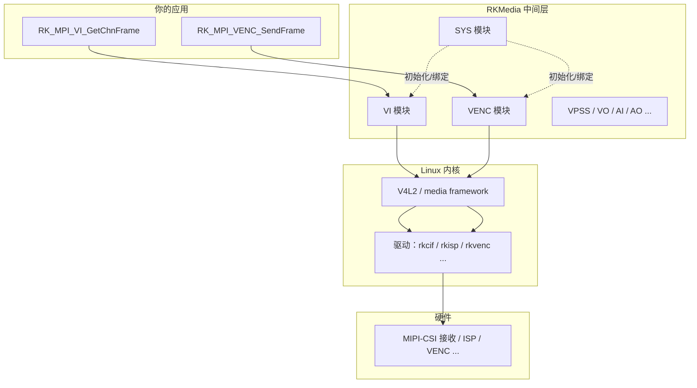
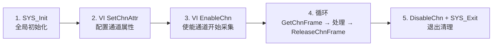
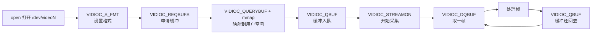

上一篇把摄像头点亮了：`i2cdetect` 能看到 sensor，`media-ctl` 拓扑完整，`v4l2-ctl` 能抓出一帧 NV12。但"能抓一帧"和"能在自己的程序里稳定取流"之间，还差一个环节——**用代码把帧拿进应用**。这一篇讲 RV1126 SDK 里最常用的一套采集接口：**RKMedia 的 VI（Video Input）模块**。

目标很明确：写一个 `vi_capture` 程序，从 IMX415 持续取流，把每一帧的地址、宽高、stride、格式拿到手，落盘一帧验证；同时讲清 RKMedia 与 Linux 原生 V4L2 的关系，并给出"回调取帧"和"多路绑定"两种进阶用法。

**双轨对照**：板端用 RKMedia C 接口跑真实硬件；PC 端用 V4L2（USB 摄像头）跑同一套"打开→设格式→取帧→处理"逻辑，两个 API 对照着学，理解更深。

## 〇、开始之前：本篇环境

- 板卡：正点原子 RV1126 + IMX415，已按上一篇完成点亮（能抓帧）
- PC：SDK 在 `~/RV1126/atk-rv1126-sdk`，交叉编译工具链可用（正点原子资料里有环境搭建章节）
- 本篇代码全部能在 SDK 示例基础上编译运行；代码里的 API 以你 SDK 头文件为准

**确认 RKMedia 头文件在位**（PC 上 SDK 目录执行）：

```bash
find ~/RV1126/atk-rv1126-sdk -name "rk_mpi_vi.h" 2>/dev/null
```

**预期输出（示例）**：

```text
~/RV1126/atk-rv1126-sdk/external/rkmedia/include/rk_mpi_vi.h
```

**不对怎么办**：找不到说明 SDK 里没带 rkmedia 源码/头文件。正点原子 SDK 一般自带；如果确实没有，看板子 `/usr/include/rkmedia/` 或 `/oem/usr/lib/` 下有没有运行时库，本篇代码结构仍然成立，编译链接时把头文件路径换成你实际的位置。

## 一、RKMedia 是什么：多媒体中间层

RV1126 的多媒体硬件（VI/ISP/VPSS/VENC/VDEC/VO/AI/AO）在 Linux 内核里都有对应驱动，但直接调 V4L2 写采集、编码、显示全流程，代码量非常大。**RKMedia（Rockchip Media）是瑞芯微提供的一套用户态中间层**，把内核驱动封装成一个个模块化的 C API，应用开发只需要"初始化 → 配通道 → 取帧 → 释放"几个函数。



类比：内核驱动是"操作系统提供的设备文件"，RKMedia 是"把常用操作打包好的类库"。V4L2 相当于直接读写寄存器，RKMedia 相当于调用现成的"读传感器一帧"函数——底层还是 V4L2，但接口更贴近业务。

**RKMedia 的模块**（本篇只用 VI，后面几篇会用 VPSS、VENC、AI/AO）：

| 模块 | 全称 | 干什么 |
|:---|:---|:---|
| SYS | System | 全局初始化、模块绑定、缓冲区管理 |
| VI | Video Input | 视频采集：从 sensor/CSI 取帧到内存 |
| VPSS | Video Post-Processing Subsystem | 缩放、裁剪、多路分流 |
| VENC / VDEC | Video Encode / Decode | H.264/H.265 硬编解码 |
| VO | Video Output | 显示输出 |
| AI / AO | Audio Input / Output | 音频采集与播放 |

所有模块的 API 统一前缀 `RK_MPI_`（Media Process Interface），比如 `RK_MPI_SYS_Init`、`RK_MPI_VI_GetChnFrame`。**前缀相同 = 调用风格一致**，学会一个模块，其他模块上手很快。

## 二、VI 模块：从"设备"到"通道"

VI 是 RKMedia 里最基础的模块，负责把视频数据从内核拿到用户态。先搞清三个概念：

- **DevId（设备号）**：一路"采集硬件"。RV1126 有多个视频输入通路（如接 IMX415 的 MIPI-CSI 通路），Dev 0 通常对应第一路
- **ChnId（通道号）**：一个设备下的逻辑通道。同一条 MIPI 链路可以开多个通道（不同分辨率），每个通道独立取流
- **VideoNode（视频节点）**：VI 通道背后对应的内核设备节点（如 `/dev/video0` = rkcif、`/dev/video1` = rkisp）。**配置属性时要告诉 VI 走哪个节点**

一句话：**VI 通道 = 内核 video 节点的用户态"遥控器"**。你在 `media-ctl` 里看到的拓扑，在这里变成了 `RK_MPI_VI_*` 函数的参数。

### 2.1 VI 通道属性结构

配置一个 VI 通道，核心是填一个 `VI_CHN_ATTR_S` 结构：

| 字段 | 含义 | 本示例取值 |
|:---|:---|:---|
| `pcVideoNode` | 内核视频节点路径 | `/dev/video0`（以你板子实际节点为准） |
| `enPixelFormat` | 输出像素格式 | `RK_FMT_YCbCr_420_SP`（NV12） |
| `u32Width / u32Height` | 输出分辨率 | 1920×1080 |
| `u32BufCnt` | 缓冲数量 | 3（越多越稳，占内存越多） |
| `enMemType` | 缓冲内存类型 | `VI_MEM_TYPE_MMAP`（mmap 映射） |
| `enCompressMode` | 压缩模式 | `COMPRESS_MODE_NONE`（不压缩） |
| `enWorkMode` | 工作模式 | `VI_WORK_MODE_NORMAL` |

**关键点**：`enPixelFormat` 用的是 RKMedia 自己的格式宏（`RK_FMT_*`），和上一篇在 `rk_comm_video.h` 里看到的完全一致——`RK_FMT_YCbCr_420_SP` = NV12。**格式宏名不用重新学，沿用即可**。

### 2.2 帧结构：拿到手的是什么

取帧拿到的是一个 `VIDEO_FRAME_INFO_S`，里面嵌套着 `VIDEO_FRAME_S`（`stVFrame`），它描述"这一帧数据在内存里的样子"：

| 字段 | 含义 | 本示例 |
|:---|:---|:---|
| `pVirAddr[0]` | Y 平面虚拟地址 | NV12 的亮度数据 |
| `pVirAddr[1]` | UV 平面虚拟地址 | NV12 的交错色度数据 |
| `u32Width / u32Height` | 帧宽高 | 1920×1080 |
| `u32HorStride / u32VerStride` | 水平/垂直步长（字节） | 行对齐后的实际值 |
| `enPixelFormat` | 实际像素格式 | 与配置一致 |

**stride 又出现了**——上一篇在 PC 端用 Python 复现过"忽略 stride 导致斜切"，这里就是真实场景：ISP 输出的行宽经常按 64 字节对齐，**取帧后必须用 `u32HorStride` 算行偏移，不能假设等于 width**。

## 三、编程模型：五步取流

RKMedia 采集的完整流程是五步，先看总图再逐段展开：



**为什么有 Enable/Disable**：配置属性和真正"开工"是两件事。`SetChnAttr` 只是告诉内核"我想这么干"，`EnableChn` 才让硬件真正跑起来；退出时 `DisableChn` 停流、释放资源。

**为什么 Get 之后必须 Release**：VI 内部用环形缓冲（数量 = `u32BufCnt`）。`GetChnFrame` 把一帧"借"给你，`ReleaseChnFrame` 还回去。**不还，缓冲区很快耗尽，取流卡死**——这是新手最常见的坑。

## 四、完整示例：vi_capture.c

下面是完整的采集程序（教学参考结构，API 以你 SDK 版本为准）。功能：NV12 1080p 取流，每 30 帧打印一次统计，按 `Ctrl+C` 退出并把最后一帧保存为 `frame.nv12`。

```c
/* vi_capture.c —— RKMedia VI 取流示例
 * 编译：见文末；运行：./vi_capture /dev/video0 1920 1080
 */
#include <stdio.h>
#include <stdlib.h>
#include <string.h>
#include <signal.h>
#include <unistd.h>

#include "rk_mpi_sys.h"
#include "rk_mpi_vi.h"

static volatile int g_running = 1;
static void sig_handler(int sig) { g_running = 0; }

int main(int argc, char *argv[])
{
    const char *node = (argc > 1) ? argv[1] : "/dev/video0";
    int width  = (argc > 2) ? atoi(argv[2]) : 1920;
    int height = (argc > 3) ? atoi(argv[3]) : 1080;

    VI_CHN_ATTR_S stAttr;
    VIDEO_FRAME_INFO_S stFrame;
    RK_S32 s32ViDev = 0;   /* DevId：第一路采集 */
    RK_S32 s32Chn   = 0;   /* ChnId：通道 0 */
    RK_U32 u32FrameCount = 0;
    RK_S32 s32Ret = RK_FAILURE;

    signal(SIGINT, sig_handler);

    /* 1. 全局初始化（只调一次） */
    s32Ret = RK_MPI_SYS_Init();
    if (s32Ret != RK_SUCCESS) {
        printf("RK_MPI_SYS_Init failed: 0x%x\n", s32Ret);
        return -1;
    }

    /* 2. 配置 VI 通道属性 */
    memset(&stAttr, 0, sizeof(stAttr));
    strncpy(stAttr.pcVideoNode, node, sizeof(stAttr.pcVideoNode) - 1);
    stAttr.enPixelFormat  = RK_FMT_YCbCr_420_SP;   /* NV12 */
    stAttr.u32Width       = width;
    stAttr.u32Height      = height;
    stAttr.u32BufCnt      = 3;                     /* 环形缓冲 3 帧 */
    stAttr.enMemType      = VI_MEM_TYPE_MMAP;
    stAttr.enCompressMode = COMPRESS_MODE_NONE;
    stAttr.enWorkMode     = VI_WORK_MODE_NORMAL;

    s32Ret = RK_MPI_VI_SetChnAttr(s32ViDev, s32Chn, &stAttr);
    if (s32Ret != RK_SUCCESS) {
        printf("RK_MPI_VI_SetChnAttr failed: 0x%x\n", s32Ret);
        goto exit_sys;
    }

    /* 3. 使能通道（硬件开始采集） */
    s32Ret = RK_MPI_VI_EnableChn(s32ViDev, s32Chn);
    if (s32Ret != RK_SUCCESS) {
        printf("RK_MPI_VI_EnableChn failed: 0x%x\n", s32Ret);
        goto exit_sys;
    }
    printf("VI capture started: %s %dx%d\n", node, width, height);

    /* 4. 取帧循环：Get → 处理 → Release */
    while (g_running) {
        /* 1000ms 超时；超时返回非成功，继续循环 */
        s32Ret = RK_MPI_VI_GetChnFrame(s32ViDev, s32Chn, &stFrame, 1000);
        if (s32Ret != RK_SUCCESS) {
            printf("GetChnFrame timeout/err: 0x%x\n", s32Ret);
            continue;
        }

        /* —— 在这里处理帧 —— */
        /* stFrame.stVFrame.pVirAddr[0] = Y 平面
         * stFrame.stVFrame.pVirAddr[1] = UV 平面
         * u32HorStride = 实际行步长（可能 > width） */
        if (u32FrameCount % 30 == 0) {
            printf("frame=%u  %ux%u  horStride=%u  size=%u\n",
                   u32FrameCount,
                   stFrame.stVFrame.u32Width,
                   stFrame.stVFrame.u32Height,
                   stFrame.stVFrame.u32HorStride,
                   stFrame.stVFrame.u32FrameSize);
        }

        /* 把最后一帧落盘（Y + UV 平面按 stride 拷贝） */
        if (!g_running) {
            FILE *fp = fopen("frame.nv12", "wb");
            if (fp) {
                const char *y  = (const char *)stFrame.stVFrame.pVirAddr[0];
                const char *uv = (const char *)stFrame.stVFrame.pVirAddr[1];
                RK_U32 ySize  = stFrame.stVFrame.u32HorStride *
                                stFrame.stVFrame.u32Height;
                RK_U32 uvSize = (stFrame.stVFrame.u32HorStride *
                                 stFrame.stVFrame.u32Height) / 2;
                fwrite(y, 1, ySize, fp);
                fwrite(uv, 1, uvSize, fp);
                fclose(fp);
                printf("saved frame.nv12 (%u + %u bytes)\n", ySize, uvSize);
            }
        }

        /* 必须释放，否则缓冲耗尽 */
        RK_MPI_VI_ReleaseChnFrame(s32ViDev, s32Chn, &stFrame);
        u32FrameCount++;
    }

    /* 5. 退出清理 */
    RK_MPI_VI_DisableChn(s32ViDev, s32Chn);

exit_sys:
    RK_MPI_SYS_Exit();
    printf("capture stopped, total frames=%u\n", u32FrameCount);
    return 0;
}
```

**代码要点**：

- **`GetChnFrame` 的超时参数**：最后一个参数是阻塞等待毫秒数。取 1000（1 秒）表示"最多等 1 秒，没有帧就返回超时"，适合轮询场景；改成 `-1` 表示无限等待，适合实时性要求高的场景
- **落盘用 stride 计算大小**：`ySize = horStride × height`，不是 `width × height`。如果硬件行对齐 64 字节，1920 宽的实际 stride 可能是 1920 或 1984，**按 stride 存，PC 端转换时才不会斜切**
- **`Ctrl+C` 落盘逻辑**：信号触发 `g_running = 0` 后，循环里的下一次 `GetChnFrame` 仍然会拿到帧，此时判断 `!g_running` 落盘，然后退出循环——保证落盘的是"最新一帧"

### 4.1 编译

在 SDK 的 rkmedia 示例目录（或你自己建的工程目录）执行，需要链接 rkmedia 库：

```bash
cd ~/RV1126/atk-rv1126-sdk/external/rkmedia/examples
# 用 SDK 的交叉编译器（路径以你环境为准）
arm-rockchip830-linux-uclibcgnueabihf-gcc \
    vi_capture.c \
    -I ../include -I ../../../../external/rkmedia/include \
    -L ../lib -lrkmedia -lpthread -lrt \
    -o vi_capture
```

**预期输出**：无报错，生成 `vi_capture` 可执行文件。
**不对怎么办**：

- `arm-rockchip830-...: command not found`：交叉编译器不在 PATH，用 SDK 的 `source envsetup.sh` 或按正点原子资料手动加入工具链路径
- `rk_mpi_vi.h: No such file or directory`：`-I` 路径不对，用 `find` 找到真实头文件路径
- 链接报 `undefined reference to RK_MPI_VI_...`：`-lrkmedia` 库路径不对或库名不同，`ls ../lib` 看真实库名（可能是 `librkmedia.so`）

### 4.2 拷贝到板子并运行

把可执行文件传到板子（nfs/scp/串口，方式以你资料为准）：

```bash
# 板子串口终端
chmod +x vi_capture
./vi_capture /dev/video0 1920 1080
```

**预期输出（示例）**：

```text
VI capture started: /dev/video0 1920x1080
frame=0   1920x1080  horStride=1920  size=3110400
frame=30  1920x1080  horStride=1920  size=3110400
frame=60  1920x1080  horStride=1920  size=3110400
...
^C
saved frame.nv12 (3110400 bytes)
capture stopped, total frames=74
```

**预期结果要点**：

- `horStride=1920`：如果你的 SDK 恰好行对齐 1920（无 padding），stride == width；**如果显示 1984 等更大值，别慌**，这说明硬件有 padding，你的代码已经用 stride 正确处理了
- `size=3110400` = 1920×1080×1.5，与上一篇的账完全一致
- 按 `Ctrl+C` 后落盘一帧，然后干净退出

**不对怎么办**：

- `RK_MPI_SYS_Init failed`：看看是否已有其他程序占用媒体模块，`ps` 查一下；或先 `RK_MPI_SYS_Exit` 再试
- `RK_MPI_VI_SetChnAttr failed`：节点路径错、分辨率不被支持，用 `v4l2-ctl --list-formats-ext` 确认节点与格式；或 `/dev/video0` 不是采集节点（换 `/dev/video1` 试试）
- `GetChnFrame timeout` 一直刷：通道没真正出流。回到上一篇的调试四步：`dmesg`、`media-ctl -p`、`i2cdetect` 确认链路还通着
- 落盘后 PC 端转出来是斜切：stride 和 width 不一致但你拷贝时用了 width（检查代码是否用 `u32HorStride`），或者转换命令参数错（见下一步）

### 4.3 PC 端验证落盘帧

把 `frame.nv12` 拷回 PC，用 FFmpeg 转成 PNG（PC 端执行）：

```bash
ffmpeg -f rawvideo -pix_fmt nv12 -s 1920x1080 \
       -i frame.nv12 frame.png
```

**预期输出**：`frame.png` 是一张正常画面（如果只有 1080p 是空场景，可能偏暗，但能看到内容）。
**不对怎么办**：

- 画面斜切/错位：板端落盘时用了错误的 stride（见 4.2 排障），重新落盘
- 全黑：曝光/增益为 0 或镜头盖，回上一篇第 6 步用 `v4l2-ctl --list-ctrls` 查曝光
- 颜色不对（红蓝互换）：格式不是 NV12 而是 NV21，检查 `enPixelFormat` 是否应为 `RK_FMT_YCrCb_420_SP`（NV21），按你板子实际输出改

## 五、对照：V4L2 应用视角的同一件事

RKMedia 把 V4L2 封装了，但**理解 V4L2 原生流程，才能真正看懂 RKMedia 在做什么**。同一件事"从摄像头取一帧"，V4L2 的完整流程是：



**和 RKMedia 五步逐行对照**：

| 步骤 | RKMedia | V4L2 原生 | 对应概念 |
|:---|:---|:---|:---|
| 打开设备 | `RK_MPI_SYS_Init` + `SetChnAttr(pcVideoNode)` | `open()` + `VIDIOC_S_FMT` | 指定用哪个设备、什么格式 |
| 申请缓冲 | `SetChnAttr(u32BufCnt=3)` | `VIDIOC_REQBUFS` | 内核准备 N 个帧缓冲 |
| 映射内存 | 框架内部完成（`enMemType=MMAP`） | `VIDIOC_QUERYBUF` + `mmap` | 用户态能看到帧地址 |
| 开始采集 | `RK_MPI_VI_EnableChn` | `VIDIOC_STREAMON` | 硬件开始出流 |
| 取一帧 | `RK_MPI_VI_GetChnFrame` | `VIDIOC_DQBUF` | 从缓冲队列拿一帧 |
| 处理完归还 | `RK_MPI_VI_ReleaseChnFrame` | `VIDIOC_QBUF` | 缓冲还回队列复用 |
| 停止退出 | `DisableChn` + `SYS_Exit` | `STREAMOFF` + `close` | 释放资源 |

**两条结论**：

1. **RKMedia 的每个函数都能在 V4L2 里找到对应物**——它不是新东西，是"帮你把 V4L2 繁琐的 ioctl 流程包好了"。懂 V4L2，RKMedia 学得快；懂 RKMedia，换任何平台（只要看它的采集 API）也学得快
2. **缓冲模型完全一致**：都是"环形缓冲 + 借出/归还"。V4L2 里 DQBUF/QBUF 必须成对，RKMedia 里 Get/Release 必须成对。**"借了要还"这条铁律，两个 API 一样**

**PC 端实操**（如果你有 USB 摄像头，在 PC 上跑一遍 V4L2 原生流程，体会"同一件事"）：

```bash
# 列出设备（PC 上）
v4l2-ctl --list-devices

# 抓一帧（PC 上，USB 摄像头）
v4l2-ctl --device /dev/video0 \
         --set-fmt-video=width=640,height=480,pixelformat=NV12 \
         --stream-mmap --stream-count=1 --stream-to=usb_frame.nv12
ffmpeg -f rawvideo -pix_fmt nv12 -s 640x480 -i usb_frame.nv12 usb_frame.png
```

**预期输出**：`usb_frame.png` 是 USB 摄像头画面。**注意**：`v4l2-ctl --stream-mmap` 背后的流程就是上面那张 mermaid 图——你已经在用 V4L2 取帧了，只是工具帮你做了。

## 六、进阶一：回调模式取帧

轮询模式（`GetChnFrame`）简单直观，但"等一下、拿一帧、处理、归还"的顺序是串行的。如果希望"帧一到就立刻通知我"，用**回调模式**：注册一个函数，RKMedia 每拿到一帧就调用它。

```c
/* 回调函数：帧到达时被调用，不能长时间阻塞 */
static void VI_CallBack(VI_CHN chn, const VIDEO_FRAME_INFO_S *pstFrame,
                        void *pUserData)
{
    /* 拿到帧，立刻做轻量处理（如计数、标记时间戳） */
    printf("[cb] frame: %ux%u stride=%u\n",
           pstFrame->stVFrame.u32Width,
           pstFrame->stVFrame.u32Height,
           pstFrame->stVFrame.u32HorStride);

    /* 处理完必须释放，否则缓冲耗尽 */
    RK_MPI_VI_ReleaseChnFrame(0, 0, (VIDEO_FRAME_INFO_S *)pstFrame);
}

/* 在 EnableChn 之后注册 */
RK_MPI_VI_RegisterChnCallback(0, 0, VI_CallBack, NULL);
```

**回调 vs 轮询怎么选**：

| 模式 | 优点 | 缺点 | 适合场景 |
|:---|:---|:---|:---|
| 轮询 GetChnFrame | 代码直观、可控性强 | 阻塞等待，延迟取决于轮询间隔 | 简单采集、学习入门 |
| 回调 RegisterChnCallback | 帧到即处理，延迟低 | 回调里不能干重活（不能 malloc/加锁久等） | 低延迟推流、实时 AI 检测 |

**回调里的铁律**：回调在 RKMedia 内部线程执行，**不要在里面做耗时操作**（编码、写文件、网络发送都不行）。正确姿势：回调里只做轻量处理，把帧地址放进你自己的队列，业务线程从队列取走再干活——这个"生产-消费"模型在后面工程化篇章会展开。

## 七、进阶二：多路绑定

RV1126 有 **MIPI-CSI ×2**，可以接两个 sensor（如一个 IMX415 广角 + 一个 IMX415 长焦）。RKMedia 里对应两个 DevId：Dev 0 绑定第一路，Dev 1 绑定第二路。

```c
/* 第一路：Dev 0 */
memset(&stAttr, 0, sizeof(stAttr));
strncpy(stAttr.pcVideoNode, "/dev/video0", sizeof(stAttr.pcVideoNode) - 1);
stAttr.enPixelFormat = RK_FMT_YCbCr_420_SP;
stAttr.u32Width  = 1920;
stAttr.u32Height = 1080;
stAttr.u32BufCnt = 3;
RK_MPI_VI_SetChnAttr(0, 0, &stAttr);
RK_MPI_VI_EnableChn(0, 0);

/* 第二路：Dev 1（节点、宽高按你第二路 sensor 的实际配置） */
memset(&stAttr, 0, sizeof(stAttr));
strncpy(stAttr.pcVideoNode, "/dev/video1", sizeof(stAttr.pcVideoNode) - 1);
stAttr.enPixelFormat = RK_FMT_YCbCr_420_SP;
stAttr.u32Width  = 1920;
stAttr.u32Height = 1080;
stAttr.u32BufCnt = 3;
RK_MPI_VI_SetChnAttr(1, 0, &stAttr);
RK_MPI_VI_EnableChn(1, 0);
```

**取帧时分别取**：

```c
RK_MPI_VI_GetChnFrame(0, 0, &frame0, 1000);   /* 第一路 */
RK_MPI_VI_ReleaseChnFrame(0, 0, &frame0);

RK_MPI_VI_GetChnFrame(1, 0, &frame1, 1000);   /* 第二路 */
RK_MPI_VI_ReleaseChnFrame(1, 0, &frame1);
```

**多路的关键点**：

1. **DevId 与节点一一对应**：Dev 0 用 `/dev/video0`、Dev 1 用 `/dev/video1`（具体以你 `media-ctl -p` 和 `/sys/class/video4linux/` 的节点名称为准）
2. **每路独立配置、独立使能**：一路配置失败不影响另一路
3. **缓冲内存翻倍**：两路 1080p NV12 × 3 帧缓冲 ≈ 2 × 9.3MB，512MB DDR 下没问题，但多路 4K 时要重新算账（还记得上一篇的带宽表吗？）

**注意事项**：多路同时取流时，如果两路都是 4K30，MIPI 带宽和 ISP 处理能力可能成为瓶颈。工程上常用"一路大图 + 一路小图"（第二路只取低分辨率做检测）来降负载——这正是后面 VPSS 多路分流的内容。

## 八、常见问题排查表

| 现象 | 可能原因 | 排查动作 |
|:---|:---|:---|
| `RK_MPI_SYS_Init` 失败 | 媒体模块被占用/驱动未就绪 | `ps` 查其他媒体进程；重启后先只跑本程序 |
| `SetChnAttr` 失败 | 节点路径错、分辨率不支持、格式不支持 | `v4l2-ctl --list-formats-ext` 核对节点支持列表 |
| `EnableChn` 失败 | 底层链路（sensor/CSI）没就绪 | 回上一篇调试四步：dmesg / media-ctl / i2cdetect |
| `GetChnFrame` 一直超时 | 链路断、buffer 未释放 | 查 dmesg；检查代码是否漏了 `ReleaseChnFrame` |
| 取到帧但全黑 | 曝光/增益为 0、镜头盖 | `v4l2-ctl --list-ctrls` 查曝光，调大重试 |
| 画面斜切 | 用了 width 而不是 stride | 检查落盘/处理代码是否用 `u32HorStride` |
| 颜色红蓝互换 | NV12/NV21 配反 | 确认 `enPixelFormat` 与 sensor 实际输出一致 |
| 跑一段时间卡死 | 缓冲耗尽（漏 Release） | 检查 Get/Release 是否严格成对；`u32BufCnt` 调大 |

## 九、动手练习

1. **跑通 vi_capture**：编译、拷贝、运行，记录你的板子上 `horStride` 的真实值——它是 1920 还是 1984/其他？把原因写清楚（看 ISP 对齐规则）
2. **改分辨率**：把 1920×1080 改成 1280×720 重新编译运行，观察 `size` 变化（应该 1280×720×1.5 = 1,382,400），并落盘验证
3. **改 NV21**：把 `enPixelFormat` 改成 `RK_FMT_YCrCb_420_SP`，落盘后 PC 端用 `-pix_fmt nv21` 转换，确认画面正常——亲手验证 NV12/NV21 的 U/V 顺序差异
4. **回调改造**：把轮询改成回调模式（注册回调 + 在回调里计数），比较两种模式在打印时间戳上的延迟差异（可以用 `clock_gettime` 打点）
5. **PC 端 V4L2 对照**：用 USB 摄像头 + `v4l2-ctl --stream-mmap` 抓帧，把 V4L2 流程图的每一步和 RKMedia 五步一一对应写出来

## 里程碑

- [ ] 能画出 RKMedia 软件栈分层（应用 → 中间层 → 内核驱动 → 硬件）并说出 VI 模块职责
- [ ] 能说清 DevId / ChnId / VideoNode 三个概念，并能在自己板子上指出 VI 通道对应的内核节点
- [ ] 能默写 RKMedia 五步（Init → SetChnAttr → EnableChn → Get/Release 循环 → Disable/Exit）并解释每一步作用
- [ ] 能解释"Get 之后必须 Release"的原因（环形缓冲模型）
- [ ] 能写出 NV12 1080p 取流代码，落盘帧在 PC 端正确转换（用 stride，不斜切）
- [ ] 能把 RKMedia 函数与 V4L2 原生 ioctl 流程一一对应（open/S_FMT/REQBUFS/QBUF/DQBUF/STREAMON...）
- [ ] 能说清回调模式与轮询模式的取舍，并实现一个简单的回调取帧
- [ ] 能配置多路 VI 通道并分别取流

> 🏷️ 标签：RKMedia · VI 通道 · RK_MPI_VI · 视频采集 · MIPI-CSI · NV12 · V4L2 · 多路绑定 · 回调取帧 · 音视频
