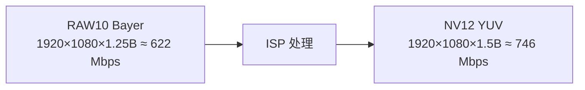
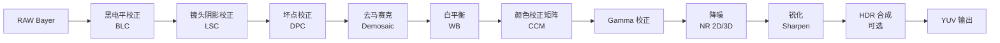
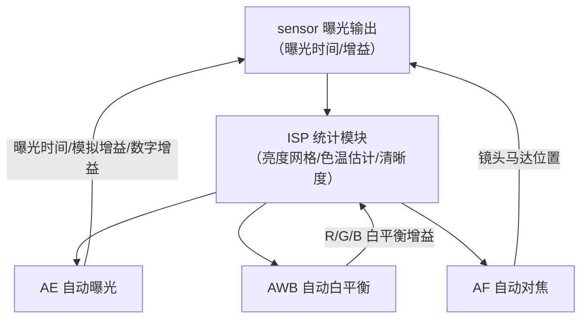
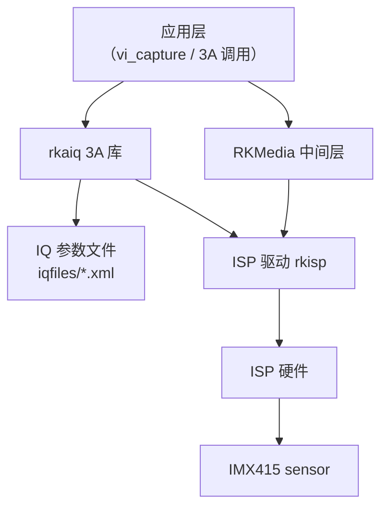

上一篇用 RKMedia VI 拿到了帧，在 PC 上也能正常显示。但你有没有想过：sensor 交出来的"原始帧"其实很丑——画面偏暗、发绿、噪点密布。之所以我们看到的是正常画质，是因为中间有一个"画质加工厂"在干活：**ISP（Image Signal Processor，图像信号处理器）**。而让它自动适应白天、黑夜、灯光、逆光各种场景的，是 **3A 算法**——AE 自动曝光、AWB 自动白平衡、AF 自动对焦。

这一篇把这两件事讲透：**ISP 管线把 RAW 变成 YUV 的每一步**，以及 **3A 是怎么闭环控制画质的**。最后在 RV1126 板子上实际操作：查看 3A 状态、开关 3A、切 HDR，并用 PC 端 FFmpeg 滤镜模拟 ISP 各模块做对照实验。

**双轨对照**：板端用 rkaiq 用户 API + 出图验证跑真实 3A；PC 端用 FFmpeg 滤镜模拟"白平衡/亮度/降噪/锐化"，理解每个 ISP 模块到底在做什么。

## 〇、开始之前：本篇环境

- 板卡：正点原子 RV1126 + IMX415，已能稳定取流（前面几篇完成）
- SDK：`~/RV1126/atk-rv1126-sdk`，交叉编译工具链可用
- PC：FFmpeg 6.x（`ffmpeg -version` 确认），带 `colorbalance`/`hqdn3d`/`unsharp` 滤镜
- 本篇新增依赖：**rkaiq 库 + IQ 参数文件**——RV1126 出厂系统一般自带，先做三个检查：

```bash
# 板子终端
# 1) IQ 参数文件（3A 与画质参数的"配方"）
ls /etc/iqfiles/ | grep -i imx415

# 2) 3A 服务进程是否在跑（有些镜像叫 rkaiq_3A_server / rkaiq_server）
ps aux | grep -i rkaiq

# 3) 当前取流是否正常（应能看到一帧）
v4l2-ctl --device /dev/video0 --stream-mmap --stream-count=1 --stream-to=/tmp/frame.raw && ls -l /tmp/frame.raw
```

三个命令都正常，说明这台板子的 ISP 管线已经在工作——接下来我们把它拆开看。

## 一、为什么画面是"生"的：RAW 与 sensor 输出

要理解 ISP，先要知道 ISP 的输入是什么。sensor 输出的原始帧叫 **RAW 图**：每个像素**只记录一个颜色分量**。

CMOS sensor 的感光面上贴着**拜耳滤镜（Bayer filter）**——一种 2×2 周期的马赛克滤色片，按 R/G/G/B 排列（不同 sensor 顺序略有差异，IMX415 为 RGGB 排列，以规格书为准）。每个感光像素只能透过一种颜色的光：

| 位置 | 第 1 列 | 第 2 列 |
|:---:|:---:|:---:|
| 第 1 行 | R（红） | Gr（绿） |
| 第 2 行 | Gb（绿） | B（蓝） |

所以 RAW 帧里，一个像素位置只有一个值：要么是红、要么是绿、要么是蓝。**人眼看到的彩色画面，需要靠 ISP 把缺失的两个颜色"猜"出来**——这一步叫去马赛克（demosaic），后面详讲。

除了"只有单色"，RAW 还有几个"生"的特质：

1. **黑电平不为零**：即使完全无光，感光单元也会因暗电流积累少量电荷，ADC 输出不是 0，而是一个偏移量（比如 RAW10 的 64/1023）。这就像录音时设备自带的底噪。
2. **响应近似线性**：sensor 的光电转换在暗部是线性的，但人眼和显示器都是非线性的（后面 gamma 会处理）。
3. **噪声叠加**：光子到达是随机的（散粒噪声），读出电路也有热噪声，增益越高噪声越明显。
4. **镜头有缺陷**：中心亮、四周暗（渐晕），边缘还会偏色（色彩阴影）。

一句话：**RAW 是"底片"，YUV 是"成片"**。底片必须进暗房冲洗——暗房就是 ISP 管线。

【图1：RAW10 与 NV12 的带宽对比（1080p@30fps）】



> 注：RAW 每像素 10bit（1.25 字节），NV12 每像素 12bit（1.5 字节：Y 8bit + UV 均摊 4bit）。带宽不降反升，是因为 ISP 把"单色马赛克"变成了"完整彩色"，信息量变大了；真正省带宽的是后面编码器的压缩（编码篇会展开）。

## 二、ISP 管线：从 RAW 到 YUV 的加工流水线

ISP 不是单一步骤，而是一条**固定顺序的流水线**。RV1126 的 ISP（14M ISP）在硬件上把这些阶段串成管线，每一级吃上一级的输出。核心顺序如下（具体顺序与模块名以 Rockchip ISP 文档与 SDK 为准，但下面的顺序是业界主流）：

【图2：ISP 管线全流程】



逐个看每一级做什么：

### 2.1 黑电平校正（BLC）

**定义**：把"无光时的偏移量"从每个像素里减掉，让真正的黑色回到 0。
**类比**：录音时先把静音的底噪电平归零，不然所有声音都叠了一层 DC 偏移。

校正值来自 sensor 规格书或标定（比如 RAW10 下黑电平 64）。RKAIQ 的 IQ 文件里有 `blc` 配置，通常不需要应用层干预。

### 2.2 镜头阴影校正（LSC）

**定义**：补偿镜头带来的"中心亮四周暗"（渐晕）和"四周偏色"（色彩阴影），按像素位置乘以不同的增益。
**类比**：老式投影仪画面中间亮四角暗，需要按区域补光。

LSC 需要一张均匀白板做标定，得到每个区域的增益网格，存进 IQ 文件。这也是为什么换镜头后画质会变——镜头不一样，阴影曲线就不一样。

### 2.3 坏点校正（DPC）

**定义**：sensor 制造时难免有几个"坏像素"（永远亮/永远暗/响应异常），用周围正常像素插值替换掉。
**类比**：屏幕上有个坏点，用旁边的颜色补上，人眼看不出来。

### 2.4 去马赛克（Demosaic）

**定义**：根据每个像素周围同色/异色邻居，把缺失的另外两个颜色分量插值出来，得到完整的 RGB 三通道。
**类比**：一张只有红绿蓝三色碎片的拼图，根据相邻碎片的颜色渐变规律，把整张图补全。

这是 ISP 里计算量较大的阶段之一，也是细节和伪彩色的来源：插值算法差，边缘会出现锯齿和彩色噪点（"紫边"的一部分来源）。

### 2.5 白平衡（WB）

**定义**：给 R/G/B 三个通道乘不同的增益，让"白色物体在任何光源下都显示为白色"。
**类比**：你在黄色灯光下看白纸，纸是黄的；AWB 就是帮你"脑补"回白色——暖光下多给蓝增益、少给红增益。

白平衡增益由 3A 里的 AWB 算法实时给出（第三节详讲），也可以手动固定。

### 2.6 颜色校正矩阵（CCM）

**定义**：用 3×3 矩阵对 RGB 做线性变换，校正 sensor 光谱响应与标准色彩空间（如 sRGB）的偏差，让红色更红、肤色更自然。
**类比**：耳机有"音效 EQ"，CCM 就是画面的"色彩 EQ"。

CCM 系数通常是标定值，存在 IQ 文件里。矩阵里经常有负系数（比如去掉某个通道的串扰），这也是为什么像素值可能短暂越界，需要后面 clamp。

### 2.7 Gamma 校正

**定义**：把线性亮度映射到非线性曲线（典型 2.2），匹配人眼对暗部更敏感的特性，也匹配显示器的响应。
**类比**：音频的压缩器/限幅器——把响度分布"压"到更符合听感的范围。

gamma 曲线直接决定画面的明暗观感，IQ 文件里是一张 lookup table（LUT）。

### 2.8 降噪（NR）

**定义**：去除亮度噪声和彩色噪声。2D 降噪在当前帧空间域做（去噪点），3D 降噪跨帧做（利用时间冗余，需要运动检测避免拖影）。
**类比**：2D 降噪是给单张照片磨皮，3D 降噪是拍视频时前后帧"平均"，静止区域更干净、运动区域自动降低强度。

降噪强度是噪点 vs 细节的平衡：太强画面"糊"，太弱画面"脏"。

### 2.9 锐化（Sharpen）

**定义**：增强边缘对比度，让画面看起来更清晰。常用 unsharp mask：原图减去模糊图得到边缘，再把边缘加回去。
**类比**：给图片描边，视觉上更"锐利"。

锐化过量会出现白边（halo），噪点也会被放大——降噪和锐化要配合调。

### 2.10 HDR 合成（可选）

**定义**：把同一场景**多帧不同曝光**（短曝光保高光、长曝光保暗部）合成为一帧，扩展动态范围。
**类比**：拍夜景时手机连拍三张（欠曝/正常/过曝）合成一张，亮部不白、暗部不黑。

RV1126 支持 2 帧/3 帧 HDR，IMX415 支持 HDR 输出。代价是运动物体会出现"鬼影"（多帧错位），HDR 合成要做运动补偿或限制。

### 2.11 输出

管线末尾输出 YUV（通常是 NV12），交给 VI 通道，应用拿到的就是可以直接显示/编码的彩色帧——这就是上一篇 `vi_capture` 落盘后 PC 能正常显示的原因：**ISP 已经在默默加工**。

## 三、视频 3A：让画质自动适应场景

ISP 管线是"固定的流水线"，但参数不能固定——白天和黑夜、室内灯光和室外阳光，最优参数完全不同。**3A 就是这条流水线的"自动挡"**：它读取画面统计信息，算出参数，再写回 ISP 和 sensor，形成闭环。

**闭环控制**是理解 3A 的关键词：**测量 → 比较目标 → 调整 → 再测量**，直到收敛。这和单片机上的 PID 温控是同一个套路，只是被控对象是曝光、白平衡、对焦。

【图3：3A 闭环控制回路】



三个算法各管一件事：

### 3.1 AE 自动曝光

**定义**：自动调节 sensor 的**曝光时间**、**模拟增益**（ISO）、**数字增益**，让画面亮度达到目标值。
**类比**：相机自动挡——光线暗就延长快门、提高 ISO；光线亮就反过来。

工作过程：

1. **测光**：ISP 把画面分成 M×N 网格（比如 15×15），统计每个格子的平均亮度/直方图。
2. **加权**：按测光模式（中央重点/平均/点测光）把网格亮度加权汇总，得到"当前亮度"。
3. **比较**：当前亮度与**目标亮度**（IQ 文件里的 AE 目标，比如 60/255）比较，算出误差。
4. **调整**：误差大就大步调曝光时间/增益，误差小就微调，防止画面突变（步进限制）。
5. **收敛**：几帧内误差趋近于 0，画面稳定。

三个工程细节必须知道：

- **曝光时间上限受帧率限制**：30fps 一帧约 33.3ms，扣除 blanking，曝光最长约 30ms 量级。暗光下想更亮，只能加增益（噪点变多）或降帧率（帧率控制后面篇章再展开）。
- **防闪烁（Anti-banding）**：50Hz 电网的灯光以 100Hz 闪烁，60Hz 电网以 120Hz 闪烁。如果曝光时间不是闪烁周期的整数倍，画面会出现明暗条纹。AE 在 50Hz 地区会把曝光时间限制为 10ms 的整数倍（1/100s 的倍数），60Hz 地区限制为 8.33ms（1/120s）的整数倍。这就是 IQ 文件里 `antiBanding` 选项的意义。
- **增益顺序**：AE 优先加曝光时间（不增加噪声），曝光到上限后才加模拟增益，最后才加数字增益（数字增益噪声最大）。

### 3.2 AWB 自动白平衡

**定义**：自动估计光源色温，调整 R/G/B 增益，让白色物体在画面里保持白色。
**类比**：色温 = 光的"冷暖"——烛光约 2000K（暖黄），正午日光约 6500K（中性），阴天 7000K+（冷蓝）。AWB 就是"无论光源多暖多冷，都把白色看成白色"。

经典算法是**灰世界假设**：认为场景里所有颜色的平均值是灰色（R≈G≈B）。统计整帧的平均 R/G/B，算出让三者相等的增益。更精细的做法是估计色温（根据 R/B 比值查表），再套用该色温下的标定增益。

工程细节：

- 大面积单色场景（纯红墙、夕阳）会骗过灰世界假设，导致偏色——所以高端方案会做"灰点检测"，只统计接近灰色的像素。
- AWB 收敛也需要时间，场景切换瞬间画面会"漂色"再收敛。
- 需要固定色温（比如拍产品图）时可以锁定 AWB 或手动设定色温。

### 3.3 AF 自动对焦

**定义**：自动调节镜头位置，让画面最清晰。
**原理**：对比度检测——清晰的图像边缘锐利、高频分量多；算法驱动镜头马达扫描，找"清晰度评分"（如拉普拉斯能量）最大的位置，再用爬山法微调收敛。

工程细节（和 IMX415 直接相关）：

- **IMX415 常用模组是定焦镜头**，没有 VCM 马达，AF 算法无法驱动镜头——这种板子上 AF 处于"不可用"状态，IQ 文件里 AF 模块配置也多为关闭。**这是正常的**，不要以为 3A 坏了。
- 如果你的模组带马达（VCM），RV1126 的 rkaiq 支持对比度 AF。
- 对焦 vs 景深：定焦镜头靠小光圈/合理安装距离保证景深内清晰，这就是为什么 IPC 摄像头大多定焦也能用。

## 四、RV1126 的实现：rkaiq 与 IQ 参数

RV1126 上，ISP 管线由硬件执行，但**参数由谁来算**？答案是 Rockchip 的 **rkaiq（AIQ，Auto IQ）3A 库**——它实现 AE/AWB/AF 算法，通过 ISP 驱动读写硬件统计和参数。

软件栈分层：

【图4：rkaiq 软件栈】



几个关键概念：

### 4.1 IQ 参数文件（iqfiles）

**定义**：一份 XML/JSON 配置文件，包含 ISP 每个模块的参数和 3A 算法的配置——黑电平、LSC 网格、CCM、gamma LUT、降噪强度、锐化强度、AE 目标亮度、AWB 色温表、HDR 参数等。**它是画质的"配方"**。

- 板子上一般在 `/etc/iqfiles/`，按 sensor 命名（`imx415_xxx.xml`）。
- 出厂时 Rockchip/方案商针对具体模组标定过，所以默认画质可用。
- 换镜头/换 sensor/换环境后画质不对，第一反应是 IQ 文件与模组不匹配。

### 4.2 rkaiq 库与 3A server

rkaiq 有两种使用方式：

1. **应用内初始化**：程序链接 librkaiq，自己调用 `rk_aiq_u_api_init` 初始化，直接获取 3A 能力。
2. **独立 3A server 进程**：系统里跑 `rkaiq_3A_server`，它持有 rkaiq 实例，应用只负责取流，server 负责算参数（通过共享内存/接口与 ISP 驱动通信）。

出厂镜像通常默认跑 3A server（前面 `ps aux | grep rkaiq` 就是查它）。自己写程序时两种方式都行，**二选一，不要同时开**。

### 4.3 数据流

每帧流程：

1. sensor 曝光输出一帧 → ISP 硬件做管线处理，同时统计模块生成**统计信息**（亮度网格、颜色统计、清晰度）。
2. rkaiq 库拿到统计信息，运行 AE/AWB/AF 算法，算出新的曝光时间/增益/白平衡增益/对焦位置。
3. rkaiq 通过 ISP 驱动把这些参数写回 ISP（白平衡增益等）和 sensor（曝光时间/增益通过 I2C）。
4. 下一帧用新参数输出——闭环。

**关键点：3A 是"逐帧闭环"的**，所以改参数后要等几帧才看到效果，AE/AWB 收敛都有延迟。

## 五、实操一：查看与开关 3A

现在动手。以下代码用 rkaiq 用户 API 查询和开关 AE/AWB。**API 名与结构体字段以你 SDK 头文件为准**（RV1126 SDK 一代平台的 rkaiq 常见接口如下，字段名可能不同，编译报错就查头文件）：

```c
// aiq_3a_demo.c —— rkaiq 查看/开关 3A 示例
#include <stdio.h>
#include <string.h>
#include <unistd.h>
#include "rk_aiq_user_api.h"
#include "rk_aiq_user_api_ae.h"
#include "rk_aiq_user_api_awb.h"
#include "rk_aiq_user_api_af.h"

int main(void)
{
    rk_aiq_ctx_t *ctx = NULL;
    rk_aiq_working_mode_t mode = RK_AIQ_WORKING_MODE_NORMAL;

    /* 1. 初始化 rkaiq：sensor 名 + IQ 文件目录 + 工作模式 */
    int ret = rk_aiq_u_api_init(&ctx, "imx415", "/etc/iqfiles/", mode);
    if (ret != 0) {
        printf("rkaiq init failed: %d\n", ret);
        return -1;
    }
    printf("rkaiq init ok\n");

    /* 2. 查询 AE 状态 */
    rk_aiq_ae_attrib_t ae_attr;
    memset(&ae_attr, 0, sizeof(ae_attr));
    rk_aiq_u_api_ae_getAttrib(ctx, &ae_attr);
    printf("AE enable: %d\n", ae_attr.eAeEnable);
    /* 字段名以头文件为准；常见为 eAeEnable / AntiBandMode 等 */

    /* 3. 查询 AWB 状态 */
    rk_aiq_awb_attrib_t awb_attr;
    memset(&awb_attr, 0, sizeof(awb_attr));
    rk_aiq_u_api_awb_getAttrib(ctx, &awb_attr);
    printf("AWB enable: %d\n", awb_attr.eAwbEnable);

    /* 4. 手动锁定曝光：关掉 AE，曝光固定（演示，数值以你环境为准） */
    rk_aiq_u_api_ae_setAeEnable(ctx, false);
    printf("AE disabled, exposure now fixed by previous value\n");
    sleep(2);

    /* 5. 重新开启 AE */
    rk_aiq_u_api_ae_setAeEnable(ctx, true);
    printf("AE re-enabled\n");

    /* 6. 锁定 AWB（固定白平衡增益） */
    rk_aiq_u_api_awb_setAwbEnable(ctx, false);
    printf("AWB disabled\n");
    sleep(2);
    rk_aiq_u_api_awb_setAwbEnable(ctx, true);

    /* 退出 */
    rk_aiq_u_api_deinit(ctx);
    return 0;
}
```

编译链接（以 SDK 实际库路径为准）：

```bash
# SDK 交叉编译（路径以你环境为准）
arm-rockchip830-linux-uclibcgnueabihf-gcc aiq_3a_demo.c \
    -I$SDK/external/rkaiq/include \
    -L$SDK/external/rkaiq/lib \
    -lrkaiq -o aiq_3a_demo
```

> 提示：如果 SDK 的 rkaiq 接口名不同（比如新版本用 `rk_aiq_user_api2_ae.h` 的 `rk_aiq_uapi2_ae_*`），以实际头文件为准。接口变化不影响理解：**都是"查状态 → 改使能 → 看效果"**。

**验证方法**：程序运行时，同时用一个取流程序（上一篇的 `vi_capture`）抓帧落盘：

```bash
# 终端 A：跑 3A 开关演示
./aiq_3a_demo

# 终端 B：AE 关闭瞬间抓一帧，过曝后重新打开，再抓一帧对比
./vi_capture --count 1 --out /tmp/ae_off.raw     # 趁 AE 关闭时
sleep 3
./vi_capture --count 1 --out /tmp/ae_on.raw      # AE 恢复后
```

把两帧拷到 PC 用 FFmpeg 转 PNG 对比：关闭 AE 时画面应该被固定（可能过曝或欠曝），重新打开后几帧内恢复正常亮度。

```bash
# PC 上：NV12 → PNG
ffmpeg -f rawvideo -pix_fmt nv12 -s 1920x1080 -i ae_off.raw ae_off.png
ffmpeg -f rawvideo -pix_fmt nv12 -s 1920x1080 -i ae_on.raw  ae_on.png
```

**观察点**：①AE 关闭后画面是否立刻固定？②重新打开后几帧收敛？③对着灯/暗处移动镜头，AE 是否跟随变化？这些都是"3A 在工作"的直接证据。

## 六、实操二：HDR 与特殊场景

### 6.1 开启 HDR

HDR 属于**工作模式**，通常初始化时指定（部分 SDK 也支持运行时切换）。rkaiq 的 working mode 常见枚举（以 SDK 为准）：

```c
rk_aiq_working_mode_t mode = RK_AIQ_WORKING_MODE_ISP_HDR3;  /* 3 帧 HDR */
```

初始化后，sensor 输出多帧不同曝光（IMX415 支持 HDR 输出），ISP 合成为宽动态范围的一帧。

```bash
# 验证：抓一帧看大小（HDR3 一帧是 3 帧 RAW 合成，链路数据量变大）
v4l2-ctl --device /dev/video0 --stream-mmap --stream-count=1 --stream-to=/tmp/hdr.raw
ls -l /tmp/hdr.raw
```

### 6.2 观察 HDR 效果

找一个"亮窗 + 暗室"场景：窗外天空和室内墙面同时出现在画面里。

- **关闭 HDR**：要么窗外过曝一片白，要么室内欠曝一片黑——动态范围不够。
- **开启 HDR**：窗外有云层细节，室内也有层次——多帧合成把动态范围撑开了。

### 6.3 注意鬼影

**鬼影（ghosting）**：画面里有运动物体（人走动、车经过）时，多帧合成位置错位，物体边缘出现半透明"重影"。这是多帧 HDR 的固有代价，RV1126 的 HDR 合成有运动补偿，但强运动场景仍可能残留。工程上：

- 高运动场景（运动相机）优先关 HDR；
- 静止监控场景（IPC）开 HDR 收益大；
- 可以按时间段/场景动态切换（应用层做策略）。

## 七、常见画质问题排查表

3A 和 ISP 调不好，表现就是各种画质问题。下面是最常见的八种现象、原因和排查方向（这也是 ISP/3A 调优岗位面试高频题）：

| 现象 | 可能原因 | 排查方向 |
|:---|:---|:---|
| 过曝（一片白） | AE 目标过高 / 测光权重被亮区带偏 / 曝光范围过大 | 调低 AE 目标亮度，改中央/点测光，限制最大曝光时间 |
| 欠曝（一片黑） | 暗光下增益上限不足 / 目标过低 | 提高增益上限，降帧率换曝光，开 HDR 或增强降噪 |
| 偏暖黄 | AWB 未收敛 / 色温估计偏低 | 等收敛，检查灰点检测，手动指定色温 |
| 偏冷蓝 | 色温估计偏高 | 同上，反向调 |
| 明暗条纹闪烁 | 灯光频闪与曝光时间不匹配 | 开 anti-banding：50Hz 地区选 50HZ，60Hz 地区选 60HZ |
| 紫边 | 镜头色差 + demosaic 伪彩色 | 换镜头，或调 CCM/降饱和，避免强反差边缘 |
| 噪点密布 | 暗光高增益 / 降噪不足 | 加强 2D/3D 降噪，优先加曝光时间而非增益 |
| 运动模糊 | 曝光时间过长 | 限制曝光时间上限，提高增益/开 HDR 补亮度 |
| HDR 鬼影 | 多帧合成运动错位 | 关 HDR 或换场景策略 |

**排查通用顺序**：先看 IQ 文件与模组是否匹配 → 再看 3A 是否收敛（日志）→ 再锁定 AE/AWB 做单变量实验 → 最后动降噪/锐化/CCM 等画质参数。

## 八、PC 端对照：用 FFmpeg 当"实验用 ISP"

板端 ISP 是实时硬件管线，PC 端没有 ISP 硬件，但 FFmpeg 滤镜可以**事后模拟每个模块**——把照片/视频当 RAW 处理，逐个滤镜对应 ISP 阶段，理解"每个模块对画面做了什么"。

模块对应关系：

| ISP 阶段 | FFmpeg 滤镜 | 作用 |
|:---|:---|:---|
| WB / CCM | `colorbalance` | 调 R/B 增益，模拟白平衡和颜色校正 |
| Gamma / AE 目标 | `eq` | 调亮度/对比度/gamma，模拟 gamma 与曝光效果 |
| 降噪 NR | `hqdn3d` | 空间+时间降噪，模拟 2D/3D NR |
| 锐化 Sharpen | `unsharp` | 边缘增强，模拟锐化 |
| HDR（模拟） | `exposure` 分档 + `blend` | 模拟多曝光合成（了解即可） |

逐模块看效果：

```bash
# 1) 模拟 AWB/CCM：画面偏暖则加蓝减红
ffmpeg -i in.mp4 -vf "colorbalance=rs=0.15:bs=-0.10" out_wb.mp4

# 2) 模拟 gamma/AE：提亮暗部、微调对比
ffmpeg -i in.mp4 -vf "eq=brightness=0.05:contrast=1.05:gamma=0.9" out_eq.mp4

# 3) 模拟降噪
ffmpeg -i in.mp4 -vf "hqdn3d=3:2:4:3" out_nr.mp4

# 4) 模拟锐化（注意：过量会出现白边，和板端一样）
ffmpeg -i in.mp4 -vf "unsharp=5:5:0.8:5:5:0.0" out_sharp.mp4
```

组合成一条"伪 ISP 管线"，顺序尽量贴近真实 ISP（白平衡 → 亮度/gamma → 降噪 → 锐化）：

```bash
ffmpeg -i in.mp4 -vf "colorbalance=rs=0.12:bs=-0.08,eq=brightness=0.03:contrast=1.05,hqdn3d=2:1.5:3:2,unsharp=5:5:0.6" out_isp_like.mp4
```

实时预览（ffplay 同样支持滤镜）：

```bash
ffplay -i in.mp4 -vf "unsharp=5:5:0.8"
```

**实验建议**：找一段暗光夜景视频，依次只开降噪、只开锐化、先降噪再锐化，对比三者的画质——你会直观理解"降噪和锐化是一对矛盾"：先降噪再锐化，噪点不被放大；只锐化不降噪，噪点全被描边放大。这个 trade-off 和板端 IQ 调参完全同构。

**注意边界**：PC 滤镜是"事后修图"，板端 ISP 是"实时管线 + 3A 闭环"，两者不是一回事；对照的价值在于理解每个模块的**视觉作用**，而不是把滤镜参数搬上板子。

## 九、动手练习

1. **确认 3A 在跑**：跑开头三个检查命令，把 IQ 文件列表、3A server 进程、抓帧结果记录下来；找不到 `imx415` 的 IQ 文件时，思考该去哪找（SDK 里 `external/` 下搜索 iqfiles）
2. **AE 开关实验**：编译运行 `aiq_3a_demo`，AE 关闭/开启各抓一帧，PC 端转 PNG 对比亮度，记录"重新打开后几帧收敛"
3. **AWB 实验**：在暖黄灯光下锁定 AWB，观察画面偏色；重新开启后观察收敛过程；再用手机手电筒（冷白）照射场景，观察 AWB 跟随
4. **防闪烁实验**：在 LED 灯下把 anti-banding 设为 OFF（IQ 或 API 修改），观察明暗条纹；恢复 50HZ，条纹消失
5. **HDR 对比**：开/关 HDR 各抓一帧"亮窗 + 暗室"场景，对比动态范围；画面里放一个晃动的手，观察鬼影
6. **FFmpeg 伪 ISP**：用一段夜景视频分别做降噪/锐化/先降噪后锐化，用 ffplay 对比，写一段话总结"降噪与锐化的平衡"
7. **画质排查演练**：故意制造过曝（AE 目标调高）和偏色（AWB 锁定在错误色温），用排查表定位并恢复

## 里程碑

- [ ] 能画出 ISP 管线全流程（BLC → LSC → DPC → Demosaic → WB → CCM → Gamma → NR → Sharpen → HDR），并说出每级的作用
- [ ] 能解释"为什么 RAW 画面是生的"（拜耳单色、黑电平、线性响应、噪声）
- [ ] 能说清 3A 闭环的四个环节（测量 → 比较 → 调整 → 再测量），并分别解释 AE/AWB/AF 的控制对象
- [ ] 能解释防闪烁原理（50Hz/60Hz 灯光频闪与曝光时间整数倍限制）
- [ ] 能说出 IMX415 定焦模组上 AF 为什么"不工作"（无 VCM 马达）
- [ ] 能在板子上确认 3A server 与 IQ 文件在位，并用 rkaiq 用户 API 查询/开关 AE、AWB
- [ ] 能开/关 HDR 并对比动态范围，能指出 HDR 鬼影的成因
- [ ] 能用 FFmpeg 滤镜模拟白平衡/亮度/降噪/锐化，并解释降噪与锐化的平衡关系
- [ ] 能根据排查表定位过曝、偏色、闪烁、紫边、噪点、鬼影等问题

> 🏷️ 标签：ISP · 3A · AE · AWB · AF · rkaiq · IQ 参数 · 黑电平 · 去马赛克 · 降噪 · 锐化 · HDR · 防闪烁 · RAW · YUV · 画质调优 · 音视频
