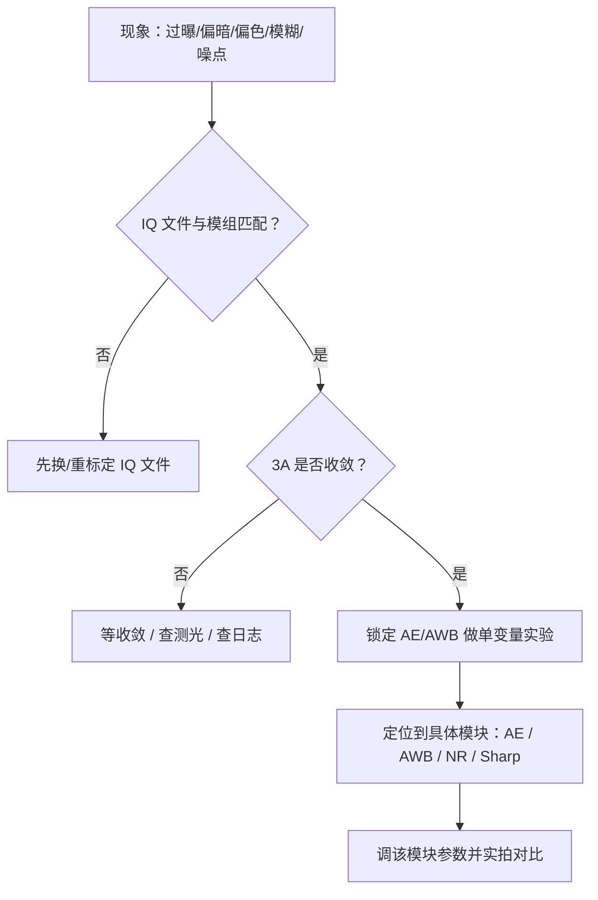
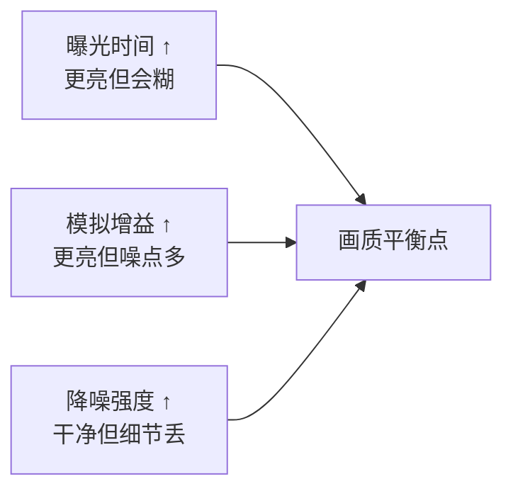
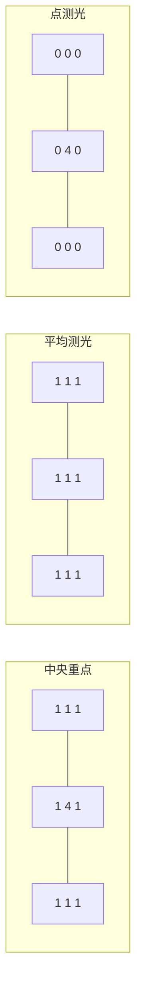

上一篇把 ISP 管线和 3A 闭环讲清楚了：AE 管亮度、AWB 管颜色、AF 管清晰，参数都写在 IQ 文件里。但"知道原理"和"把画质调好"之间还有一道坎——**场景不同，最优参数完全不同**：暗光下要跟噪点搏斗，逆光下要跟动态范围搏斗，运动场景要跟模糊搏斗，灯光下要跟偏色搏斗。

这一篇是纯实战：把最常见的四类画质问题拆成**场景 → 根因 → 参数 → 验证**四步，每个场景都给出可照抄的调优路径和实拍对比方法。最后讲 AE 精细参数（目标亮度/曝光补偿/区域权重）和 IQ 文件里降噪/锐化/饱和度的调法。

**双轨对照**：板端 rkaiq 调参实拍验证；PC 端 FFmpeg 滤镜模拟每个场景的调优效果，先在 PC 上建立"参数→画面"的直觉，再上板。

## 〇、开始之前：本篇环境

- 板卡：正点原子 RV1126 + IMX415，3A 正常运行（上一篇的三个检查命令都通过）
- SDK：`~/RV1126/atk-rv1126-sdk`，交叉编译工具链可用
- PC：FFmpeg 6.x
- 道具：暖黄台灯、手机手电筒（冷白光）、窗户/强光源（逆光用）、会动的东西（手/风扇/行人）

**本篇的纪律**：调优最忌讳"瞎试参数"。每个实验都按固定流程走：**固定条件 → 改一个参数 → 抓帧 → 对比 → 恢复**。一次只动一个变量，不然出了问题说不清是谁引起的。

## 一、调优的思维方式：先定位，再动手

拿到一个"画质问题"，不要直接改参数，先走一遍定位流程：

【图1：画质问题定位流程】



**核心原则**：

1. **先排除"配置错误"再谈"调优"**：IQ 文件与模组不匹配，怎么调都白搭（换镜头后必须重新标定或换对应 IQ 文件）。
2. **先确认 3A 在工作**：AE/AWB 没收敛时看到的过曝/偏色是"过程现象"，不是"参数问题"。
3. **单变量实验**：每次只改一个参数，抓帧留证，再改下一个。
4. **用数据说话**：抓帧 + PC 端转 PNG 对比，不要只凭眼睛在屏幕上猜。

下面四个场景，每一个都是这个流程的实例。

## 二、场景一：暗光——噪点与细节的拔河

### 2.1 根因

暗光下 sensor 进光量不足，AE 会一路往上加：先加曝光时间，再加模拟增益（ISO），最后加数字增益。**增益的本质是把信号和噪声一起放大**——增益越高，噪点越明显（暗部尤其）。同时曝光时间拉长又会引入运动模糊。于是出现经典的三角关系：

【图2：暗光三难】



**类比**：深夜收音机听广播，音量（增益）开大，电流声（噪声）也跟着大；想听清就要"信号够强、噪声够低、喇叭别失真"——三头堵。

### 2.2 参数与调优路径

| 参数（IQ 文件 / rkaiq） | 作用 | 暗光调法 |
|:---|:---|:---|
| 最大曝光时间 | 曝光上限 | 允许拉长（受帧率限制） |
| 最大模拟增益 | 增益上限 | 放宽到 sensor 规格允许值 |
| 数字增益上限 | 数字增益上限 | 尽量收紧（数字增益噪声最大） |
| 降噪强度（2D/3D） | 去噪点 | 适度加强 3D，保细节 |
| AE 目标亮度 | 期望亮度 | 暗光可略降目标（保信噪比） |

调优顺序（照抄）：**先允许更长曝光（上限以帧率和防模糊可接受为准）→ 再放宽模拟增益 → 收紧数字增益 → 最后补降噪**。顺序反了会得到"又糊又脏"的画面。

### 2.3 实操：暗光实拍对比

```bash
# 1) 暗光房间（关灯只留一盏小夜灯），机位固定
# 2) 抓默认参数一帧
./vi_capture --count 1 --out /tmp/dark_default.raw

# 3) 用 rkaiq 加强降噪（API 或改 IQ 后重载，见第七节），再抓一帧
./vi_capture --count 1 --out /tmp/dark_nr.raw

# 4) PC 端转 PNG 对比暗部区域
ffmpeg -f rawvideo -pix_fmt nv12 -s 1920x1080 -i dark_default.raw dark_default.png
ffmpeg -f rawvideo -pix_fmt nv12 -s 1920x1080 -i dark_nr.raw dark_nr.png
```

**看什么**：①暗部噪点（彩色噪点是否减少）；②边缘细节（文字/纹理是否变糊）；③两者对比，找到"噪点可接受且细节不糊"的中间档。**降噪不是越大越好**——找到一个肉眼舒适点即可。

### 2.4 PC 端对照

```bash
# 模拟"暗光提亮 + 降噪"：eq 提亮/gamma 拉暗部，hqdn3d 去噪
ffmpeg -i dark.mp4 -vf "eq=brightness=0.08:gamma=0.85,hqdn3d=4:3:6:4" dark_processed.mp4

# 只提亮不降噪 vs 提亮+降噪，对比暗部
ffmpeg -i dark.mp4 -vf "eq=brightness=0.08:gamma=0.85" dark_nr_off.mp4
ffplay dark_nr_off.mp4   # 看噪点
ffplay dark_processed.mp4 # 看降噪后
```

**要点**：PC 上先体会"提亮必带噪、降噪必损细节"，上板调参时就有直觉了。

## 三、场景二：逆光——HDR 与背光补偿

### 3.1 根因

**动态范围**：sensor 能同时记录的最亮与最暗亮度之比（dB）。逆光时，背景（窗户/天空/灯）亮度可能比前景（人脸）高几十倍，超出 sensor 单帧动态范围——AE 只能顾一头：顾背景前景全黑，顾前景背景全白。

**类比**：人在强光背光的房间里拍合影，人脸总是黑的——眼睛（HDR 的天然能力）能看清，相机单帧做不到。

### 3.2 两种解法

| 方案 | 原理 | 代价 |
|:---|:---|:---|
| **HDR 合成** | 多帧不同曝光合成，扩展动态范围 | 运动鬼影、帧率下降、算力增加 |
| **背光补偿（BLC）** | AE 对暗区加权（局部测光），优先保证前景亮度 | 背景会过曝 |

**HDR 适合**：静态/慢运动场景（监控、门禁）。**BLC 适合**：前景是主体且背景过曝可接受（人脸识别、会议）。

### 3.3 实操：逆光对比

```bash
# 窗户逆光场景，人脸朝向窗户
# 1) 默认 AE 抓一帧（人脸大概率欠曝）
./vi_capture --count 1 --out /tmp/back_default.raw

# 2) 开 HDR（工作模式切换，见上一篇实操二）抓一帧
./vi_capture --count 1 --out /tmp/back_hdr.raw

# 3) 开背光补偿（AE 区域权重偏向画面下方/中央）抓一帧
./vi_capture --count 1 --out /tmp/back_blc.raw
```

**看什么**：①默认：人脸黑、窗外正常；②HDR：人脸和窗外都有层次（注意窗框边缘有没有鬼影）；③BLC：人脸亮了但窗外白成一片。**结论**：监控场景选 HDR，人脸识别场景可考虑 BLC。

### 3.4 PC 端对照

```bash
# 模拟"提亮暗部"（近似 BLC 效果）：curves 把暗部拉起来
ffmpeg -i backlit.mp4 -vf "curves=preset=medium_contrast" tmp1.mp4
# 更直接：用 eq 提高亮度 + 暗部 gamma
ffmpeg -i backlit.mp4 -vf "eq=brightness=0.10:gamma=0.7" back_blc_like.mp4
```

**注意**：PC 端没有真正的多帧 HDR 合成滤镜链（`exposure`+`blend` 可以模拟但很繁琐），所以逆光场景以板端实拍为主，PC 只做"提亮暗部"的 BLC 直觉练习。

## 四、场景三：运动——曝光时间与模糊

### 4.1 根因

**运动模糊** = 曝光时间内物体在画面上的位移超过了 1~2 个像素。物体运动越快、曝光越长，越糊。但要缩短曝光，进光量就下降，画面变暗——AE 只能靠增益补，噪点又上来。

**类比**：拍奔跑的狗，快门 1/30s 拍出来是"残影狗"，快门 1/500s 才定格；但 1/500s 进光少，晚上就拍不到了。

### 4.2 参数与调优路径

| 参数 | 作用 | 运动场景调法 |
|:---|:---|:---|
| 最大曝光时间 | 模糊上限 | 收紧（如 1/60s ~ 1/120s） |
| 模拟增益 | 补偿亮度 | 放宽（噪点换清晰） |
| 帧率 | 时间采样密度 | 提高（30→60fps，运动更连贯） |
| HDR | 动态范围 | 运动场景建议关闭（防鬼影） |
| 3D 降噪 | 去噪 | 注意：跨帧降噪在运动区域要降权，否则拖影 |

**注意帧率与亮度的关系**：60fps 每帧只有 16.6ms，曝光上限更短，同样光照下更暗——高帧率不是免费的，暗光运动场景是"清晰度、亮度、噪点"三方博弈。

### 4.3 实操：运动对比

```bash
# 手在镜头前快速晃动（或让风扇转起来）
# 1) 默认参数（曝光可能较长）抓一帧
./vi_capture --count 1 --out /tmp/move_slow.raw

# 2) 收紧最大曝光时间到 1/120s 左右，抓一帧
./vi_capture --count 1 --out /tmp/move_fast.raw
```

**看什么**：①手/扇叶边缘是"糊的残影"还是"清晰的定格"；②亮度是否明显下降、噪点是否变多。**结论**：对清晰度要求高就锁短曝光，亮度/噪点要求高就放宽——按产品需求取舍。

## 五、场景四：色温——AWB 锁定与偏移

### 5.1 根因

光源色温不同（烛光 2000K / 白炽灯 2800K / 日光 6500K / 阴天 7000K+），场景颜色完全不同。AWB 会自动跟踪，但有两个场景 AWB 会"帮倒忙"：

1. **色温稳定且要求颜色恒定**：生产线、实验室、产品拍摄——AWB 的微小漂移导致颜色不稳，必须锁定。
2. **风格化**：夕阳要暖、冷色科技感要冷——AWB 会把风格"纠正"掉，需要手动偏移。

**类比**：AWB 是"自动白平衡"滤镜，好用的地方是随手拍；但你想让照片保持"黄昏的金色"，它反而会把金色抹掉。

### 5.2 实操：AWB 锁定与手动色温

```c
// awb_fixed.c —— 锁定 AWB / 手动色温（字段名以你 SDK 头文件为准）
#include <stdio.h>
#include "rk_aiq_user_api.h"
#include "rk_aiq_user_api_awb.h"

int main(void)
{
    rk_aiq_ctx_t *ctx = NULL;
    rk_aiq_u_api_init(&ctx, "imx415", "/etc/iqfiles/",
                      RK_AIQ_WORKING_MODE_NORMAL);

    /* 1. 手动色温：指定 6500K（日光）*/
    rk_aiq_awb_attrib_t awb_attr;
    memset(&awb_attr, 0, sizeof(awb_attr));
    rk_aiq_u_api_awb_getAttrib(ctx, &awb_attr);
    /* 设置手动色温：awb 模块有 manual 色温档位，字段名以 SDK 为准 */
    /* awb_attr.stAwbPara... = 6500; */
    rk_aiq_u_api_awb_setAttrib(ctx, &awb_attr);

    /* 2. 锁定当前 AWB（固定当前增益，不再跟踪）*/
    rk_aiq_u_api_awb_setAwbEnable(ctx, false);
    printf("AWB locked\n");
    sleep(5);

    /* 3. 恢复自动 */
    rk_aiq_u_api_awb_setAwbEnable(ctx, true);
    rk_aiq_u_api_deinit(ctx);
    return 0;
}
```

实验步骤（暖黄台灯下）：

```bash
# 1) 自动 AWB 抓一帧（白色纸应该接近白色）
./vi_capture --count 1 --out /tmp/wb_auto.raw
# 2) 锁定 AWB 后，把手电筒冷白光从侧面打进来，再抓一帧
#    —— 场景色温变了，但增益没变 → 画面偏冷蓝
./vi_capture --count 1 --out /tmp/wb_locked.raw
# 3) 恢复自动 AWB，等 2 秒再抓一帧（应该又回到白色）
./vi_capture --count 1 --out /tmp/wb_auto2.raw
```

**看什么**：①锁定后打冷光，白纸是否变蓝；②恢复自动后是否几帧内回到白色。这就是 AWB"跟踪"与"锁定"的直观区别。

### 5.3 PC 端对照

```bash
# 模拟"色温偏移"：colorbalance 让画面偏暖/偏冷
ffmpeg -i in.mp4 -vf "colorbalance=rs=0.15:bs=-0.10" warm_like.mp4   # 偏暖
ffmpeg -i in.mp4 -vf "colorbalance=rs=-0.10:bs=0.15" cool_like.mp4  # 偏冷
ffplay warm_like.mp4
```

**要点**：PC 端调 colorbalance 体会"偏暖/偏冷"的视觉差异，上板做 AWB 偏移实验时就知道往哪个方向调。

## 六、AE 精细调参：目标亮度、曝光补偿、区域权重

除了"开关 AE"，AE 还有三个常用精细参数：

### 6.1 目标亮度（Target Brightness）

**定义**：AE 想让画面达到的平均亮度（比如 0~255 里的 60~80）。
**调法**：场景整体偏亮（雪地、白墙）→ 目标略降；整体偏暗（深色场景）→ 目标略升。**不要为了"看起来亮"盲目拉高目标**——会过曝且噪点加重。

### 6.2 曝光补偿（EV Compensation）

**定义**：在 AE 自动计算的基础上，人为加减曝光档位（±EV）。**类比**：手机拍照的"亮度调节"滑杆。
**调法**：逆光人脸黑 → +1EV 让前景亮；强光下背景过曝 → -1EV。EV 补偿比改目标亮度更"直觉"，适合快速试。

### 6.3 区域权重（测光权重）

**定义**：AE 统计亮度时，不同画面区域给不同权重——中央重点、平均、点测光、自定义网格。
**类比**：测光表"对准哪里测"——对人脸测光，人脸就正常；对整个画面平均，人脸可能被背景带偏。

【图3：三种测光权重示意（3×3 网格，数字=权重）】



**调法**：人脸在画面中央 → 中央重点；人脸在固定位置（门禁）→ 自定义网格权重偏向该区域；画面均匀 → 平均。

**API 示意**（字段名以 SDK 为准）：

```c
rk_aiq_ae_attrib_t ae_attr;
rk_aiq_u_api_ae_getAttrib(ctx, &ae_attr);
/* ae_attr.stAePara...: target / evCompensation / gridWeights */
/* 改完写回 */
rk_aiq_u_api_ae_setAttrib(ctx, &ae_attr);
```

## 七、IQ 参数调整：降噪、锐化、饱和度

AE/AWB 是"自动控制"，而降噪/锐化/饱和度属于**画质风格参数**，直接决定"好不好看"。两个改法：

### 7.1 方法一：改 IQ 文件（离线、可固化）

1. 把板子上的 IQ 文件拷回 PC：`scp root@板子IP:/etc/iqfiles/imx415_xxx.xml ./`
2. 用编辑器找到 `anr`（降噪）、`asharp`（锐化）、`ccm`/`sat`（饱和度）相关段，调整数值。**字段含义以 SDK 文档为准**，先小步改（±10%~20%）。
3. 传回板子，重启 3A server（或按 SDK 方式热重载）：
```bash
# 重启 3A server（进程名以你镜像为准）
killall rkaiq_3A_server
rkaiq_3A_server &
```
4. 重新抓帧对比。

**优点**：参数固化到系统，重启不丢；**缺点**：改一次重启一次，调试慢。

### 7.2 方法二：rkaiq 调试工具（在线、快速试）

Rockchip SDK 提供 rkaiq 调试工具（`rkaiq_tool_server` 或类似，名称以你 SDK 为准），通过 socket/命令行在线改参数，**不用重启**。具体命令语法以你 SDK 的 README/脚本为准，工作流是：

```bash
# 启动调试服务（名称/端口以 SDK 为准）
rkaiq_tool_server &
# 用配套客户端/脚本下发参数：查模块、读参数、写参数
# 例：rkaiq_tool 下发降噪强度 / 锐化强度（命令格式以 SDK 为准）
```

**优点**：实时看效果，适合调试；**缺点**：重启后失效，需要同步回 IQ 文件固化。

### 7.3 实拍对比方法论

调 IQ 参数必须有对照实验，标准流程：

1. **固定机位、固定场景、固定光照**（三固定）；
2. **锁定 AE/AWB**（排除自动控制干扰，只比画质参数）——可以用第六节/第五节的方法把 AE、AWB 关掉；
3. 每个参数档位抓 3 帧，取中间值（消除帧间噪声波动）；
4. PC 端转 PNG，**放大到 100% 看局部**（边缘细节、暗部噪点、颜色过渡）；
5. 记录"参数值 → 画面表现"，形成自己的参数表。

**降噪/锐化/饱和度三个参数的经验关系**：

| 参数 | 调大效果 | 调大副作用 | 典型应用 |
|:---|:---|:---|:---|
| 降噪强度 | 画面干净、噪点少 | 细节糊、边缘软 | 暗光监控 |
| 锐化强度 | 边缘清晰、质感强 | 白边（halo）、噪点放大 | 白天场景 |
| 饱和度 | 颜色鲜艳 | 颜色失真、肤色偏 | 风景/展示 |

**黄金组合**：先降噪（压噪点）→ 再锐化（补细节）→ 最后调饱和度（定风格）。顺序反了，锐化会把噪点先放大。

### 7.4 PC 端对照

```bash
# 降噪 → 锐化 → 饱和度，完整模拟一遍（顺序很重要）
ffmpeg -i in.mp4 -vf "hqdn3d=4:3:6:4,unsharp=5:5:0.8,eq=saturation=1.15" out_style.mp4

# 对比：只锐化不降噪（噪点被放大）
ffmpeg -i in.mp4 -vf "unsharp=5:5:0.8" out_sharp_only.mp4
ffplay out_style.mp4
ffplay out_sharp_only.mp4
```

## 八、排查清单：从现象到参数

把四类场景 + 常见问题合成一张决策表，遇到画质问题直接查：

| 现象 | 根因 | 先查/先调 | 验证方法 |
|:---|:---|:---|:---|
| 暗光噪点多 | 增益过高 / 降噪不足 | 放宽曝光上限、收紧数字增益、加强 3D 降噪 | 100% 放大看暗部 |
| 暗光糊 | 降噪过强 / 曝光过长 | 降降噪强度、锁短曝光 | 看边缘细节 |
| 逆光人脸黑 | 动态范围不足 | 开 HDR 或背光补偿 | 看人脸与背景 |
| 逆光背景全白 | BLC 过度 / AE 目标高 | 换 HDR、降目标亮度 | 看高光细节 |
| 运动残影 | 曝光过长 | 锁短曝光（1/60s~1/120s） | 看运动边缘 |
| 运动场景有鬼影 | HDR 多帧错位 | 关 HDR | 看运动物体边缘 |
| 画面偏暖/偏冷 | AWB 跟踪异常 / 色温估计偏 | 锁定 AWB 试手动色温 | 看白纸 |
| 色温恒定场景颜色漂 | AWB 微漂移 | 锁定 AWB | 多帧颜色一致性 |
| 明暗条纹 | 灯光频闪 | 开 anti-banding（50/60Hz） | 看条纹是否消失 |
| 边缘白边 | 锐化过强 | 降锐化强度 | 看高反差边缘 |
| 颜色失真 | 饱和度/CCM 过强 | 降饱和度、查 CCM | 看肤色/红色 |

**通用收尾动作**：所有在线调试的参数，最终必须**固化回 IQ 文件**并重启验证——否则重启即丢，产品上会"时好时坏"。

## 九、动手练习

1. **暗光实验**：暗光房间按"延长曝光 → 放宽增益 → 收紧数字增益 → 补降噪"顺序调，记录每一步的画面变化，找出你的板子在"噪点可接受"下的最大增益值
2. **逆光实验**：窗户逆光，分别用默认 AE / HDR / 背光补偿抓帧对比，判断你的产品场景该选哪个方案
3. **运动实验**：风扇或晃手，把最大曝光时间从默认收紧到 1/60s、1/120s，对比清晰度与亮度，画出"曝光时间 → 模糊程度"的变化规律
4. **色温实验**：暖黄灯下锁定 AWB 后用冷光照射，验证偏色；再用手动色温 2800K 与 6500K 各抓一帧，说出差别
5. **AE 精细调参**：分别调目标亮度、EV 补偿、测光权重（中央/平均），用"人脸+背景"场景验证各自效果
6. **IQ 实调**：改 IQ 文件里的降噪/锐化/饱和度（三固定 + 锁定 AE/AWB 实拍对比），找到一组你认为"好看"的参数并固化
7. **PC 对照**：用一段夜景视频走完"降噪→锐化→饱和度"管线，和"只锐化不降噪"对比，写一段话总结降噪与锐化的关系

## 里程碑

- [ ] 能说出画质调优的四步流程（固定条件 → 改一个参数 → 抓帧 → 对比恢复）
- [ ] 能解释暗光下"曝光时间、增益、降噪"的三角关系，并按正确顺序调优
- [ ] 能区分 HDR 与背光补偿的适用场景，并在逆光下做出选择
- [ ] 能解释运动模糊的成因，并给出"清晰度 vs 亮度 vs 噪点"的取舍路径
- [ ] 能完成 AWB 锁定/手动色温实验，并说出锁定与自动的适用场景
- [ ] 能调 AE 目标亮度、EV 补偿、区域权重，并验证各自效果
- [ ] 能用两种方式（IQ 文件 + 调试工具）调整降噪/锐化/饱和度，并完成实拍对比
- [ ] 能根据排查清单定位过曝、偏色、闪烁、拖影、紫边、鬼影等问题
- [ ] 能把在线调试参数固化回 IQ 文件并验证重启不丢

> 🏷️ 标签：3A 调优 · AE · AWB · 暗光 · 逆光 · 运动场景 · 色温 · HDR · 背光补偿 · 降噪 · 锐化 · 饱和度 · IQ 参数 · 实拍对比 · 画质排查 · 音视频
