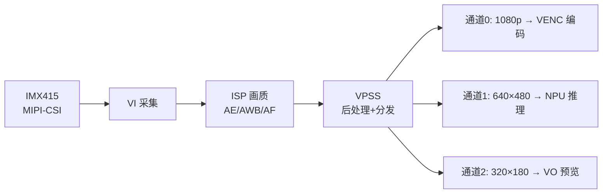
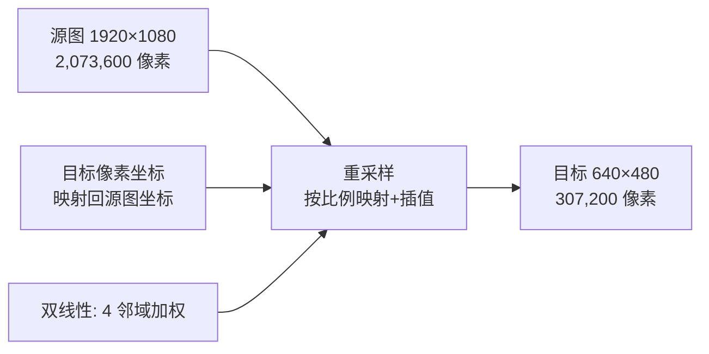

前面几篇把画面从 sensor 一路拿到了内存：MIPI-CSI 进 VI，ISP 出干净画质，3A 把亮度和颜色管住。但"拿到一帧"只是开始——真实产品里，**同一路画面往往要同时喂给好几个地方**：编码器要 1080p 的完整画面，NPU 推理只需要 640×480 的小图，预览窗口只要 320×180，抓拍又要单独一路高质量帧。总不能每个模块都自己从 1080p 原始帧做缩放吧？那 CPU 早被像素运算烧穿了。

这就是 VPSS 的活：**一个输入，多路输出**。这一篇把 VPSS 的定位、Group/通道模型、缩放、裁剪、旋转、帧率控制、多路分流全部讲透，并给出一份可照抄的 RKMedia 双通道工程代码（编码路 + NPU 路），最后附上常见问题排查清单。

**双轨对照**：板端 RKMedia VPSS 出多路；PC 端 FFmpeg `filter_complex` 做同样的"一进多出"缩放，先理解思路再上板。

## 一、VPSS 是什么：视频后处理子系统

**定义**：VPSS（Video Post-Processing Subsystem）是 SoC 内部的视频后处理硬件单元，负责对输入图像做**缩放、裁剪、旋转、镜像、格式转换和帧率控制**，并且能够**同时输出多路不同规格的画面**。

**类比**：快递分拣中心。一件大包裹（1080p 原帧）从传送带进来，分拣机器人按收件人（编码器、NPU、预览）分别打包成不同尺寸的包裹（720p、640×480、320×180）发出去——分拣、重新打包都是流水线设备做的，收件人拿到手就是自己想要的尺寸，不用自己拆开大包裹重新包装。

**在 RV1126 中的位置**：RV1126 的多媒体数据流是 **VI（采集）→ ISP（画质）→ VPSS（后处理分发）→ VENC/VDEC/VO/NPU（消费）**。VPSS 处在"处理"和"消费"之间，是数据流的中枢：

【图1：VPSS 在 RV1126 数据流中的位置】



**为什么不能只用软件缩放**：软件缩放每帧要遍历数百万像素做插值。1080p30 每秒要处理 6220 万像素，每个像素做几次乘加——纯 CPU 至少占用一个核以上，而且还要把内存数据反复搬运。VPSS 是专用硬件，几乎不占 CPU，而且能**同时**出多路，这是软件方案做不到的。

## 二、两个核心概念：Group 与通道

### 2.1 Group（组）：一路输入源

**定义**：Group 是 VPSS 的一个输入源。一个 group 绑定一个 VI 通道，接收一路图像流，然后由 group 内部的硬件流水线统一处理后分发到各个通道。

**工程含义**：一个 group 对应"一路摄像头画面"。如果你接两个摄像头，就要创建两个 group（group 0 管 camera0，group 1 管 camera1）。group 之间完全独立。

### 2.2 通道（Channel）：输出口

**定义**：通道是 group 的输出口。一个 group 可以开多个通道，每个通道独立配置目标尺寸、像素格式、输出帧率、裁剪区域，互不影响。

| 通道属性 | 说明 | 典型值 | 影响 |
|:---|:---|:---|:---|
| 目标宽高 | 输出分辨率 | 1920×1080 / 640×480 | 输出帧大小 |
| 像素格式 | 输出格式 | NV12 / RGB888 | NPU 常要 RGB |
| 输出帧率 | 降帧输出 | 30 / 15 / 10 fps | 省带宽省算力 |
| 裁剪区域 | 只输出源图一部分 | X/Y/W/H | 视野裁剪 |

**通道之间完全独立**：改通道 1 的尺寸不影响通道 2；关掉通道 1 不影响通道 2；每个通道可以单独注册回调、单独绑定下游模块。这就是"一进多出"的灵活性来源。

### 2.3 为什么需要多路：看一个真实产品的需求

一个 AI 智能摄像头（本系列综合项目的形态）同时需要：

| 消费者 | 需要什么 | 为什么 |
|:---|:---|:---|
| 编码器（VENC） | 1080p NV12 | 推流/存储要完整清晰画面 |
| NPU 推理 | 640×480 RGB | 检测人脸/人形不需要大图，小图省算力 |
| 预览（VO） | 320×180 | 本地屏显，越小越省 |
| 抓拍 | 一帧高质量原图 | 事件触发时单独取大图 |

**没有 VPSS 的笨办法**：每路消费者自己从 1080p 缩放 → 重复计算 + 重复搬运内存。**有 VPSS**：硬件一次缩放，多路各取所需。

## 三、缩放：VPSS 的核心技能

**定义**：缩放（Scale）是把图像从一种分辨率变换到另一种分辨率的过程。缩小（如 1080p→640×480）是主流需求，放大（如 320→1080）受硬件限制且画质损失大。

**缩放质量三档**（VPSS 硬件实现，应用层不可选，但理解它有助于判断画质）：

| 算法 | 原理 | 质量 | 开销 |
|:---|:---|:---|:---|
| 最近邻 | 取最近像素 | 差（锯齿） | 最小 |
| 双线性 | 4 邻域加权平均 | 中（平滑） | 中 |
| 高级插值 | 更多邻域加权/滤波 | 好（保留细节） | 最大 |

**缩放与画质的关系**：
- **缩小**：把 2×2 像素合成 1 个，天然有抗锯齿效果，画质损失小；
- **放大**：要把 1 个像素"变成"多个，必须插值，放大倍数越大越糊——**所以 VPSS 通常限制放大能力，放大超过输入尺寸可能失败或画质很差**；
- 缩放后锐度会略降，所以很多产品在缩放后加轻微锐化（这属于 ISP/后处理调优范畴）。

**缩放的成本**：VPSS 缩放虽然是硬件做的，但**输入一帧、输出一帧都要经过内存**。输出路数越多、输出尺寸越大，内存带宽占用越高。这就是为什么 NPU 路要缩到最小、还要降帧——**少搬数据，就是省钱**。

【图2：缩放本质——像素重采样】



## 四、裁剪（ROI）：只取画面中的一部分

**定义**：裁剪（Crop/ROI）是只从源图中取一个矩形区域作为输出，常用于数字变焦（电子放大）、局部特写、去除画面边缘干扰。

**裁剪配置**（在通道属性里打开）：

```c
/* 通道属性中裁剪区域的配置 */
ch1_attr.stCropRect.bEnable = RK_TRUE;        /* 使能裁剪 */
ch1_attr.stCropRect.enRect = VPSS_RECT_CROP;  /* 裁剪模式 */
ch1_attr.stCropRect.stRect.s32X = 640;        /* 区域左上角 X（相对源图） */
ch1_attr.stCropRect.stRect.s32Y = 300;        /* 区域左上角 Y */
ch1_attr.stCropRect.stRect.u32Width = 640;    /* 区域宽度 */
ch1_attr.stCropRect.stRect.u32Height = 480;   /* 区域高度 */
```

**注意**：
- 裁剪区域的 X/Y/W/H 是**源图坐标系**的，不能超出源图范围；
- 裁剪后可以再缩放：`裁剪 640×480 区域 → 缩小到 320×240`，这就是"先裁后缩"，适合数字变焦——**画面中心区域被放大且保持清晰**；
- 裁剪和缩放可以同时配置，VPSS 会按"先裁后缩"的流水线处理。

**典型场景**：
1. **电子 PTZ**：不转云台，用软件改裁剪区域实现上下左右移动 + 缩放；
2. **人脸抓拍特写**：检测到人脸后，把人脸区域裁出来放大；
3. **去黑边**：sensor 输出有边缘瑕疵时裁掉。

## 五、旋转与镜像

VPSS 通道属性里提供旋转/镜像配置（枚举以 SDK 头文件为准）：

| 操作 | 说明 | 场景 |
|:---|:---|:---|
| 90°/180°/270° 旋转 | 旋转输出画面 | 竖屏显示、传感器安装方向 |
| 水平/垂直镜像 | 左右/上下翻转 | 自拍镜像、车机倒车 |

**注意事项**：
- **旋转改变宽高对应关系**：90° 旋转后，输出宽度 = 输入高度，配置 `u32Width/u32Height` 时要按旋转后的宽高写；
- **旋转有硬件开销**：非必要不旋转；能用 sensor 侧（IMX415 支持镜像/翻转寄存器）或显示侧（VO 旋转）解决就不占 VPSS；
- **镜像与旋转可组合**（如 90° + 水平镜像），组合后方向要实测确认。

## 六、多通道分流：编码路 + NPU 路（核心用法）

### 6.1 为什么这是标配

AI 摄像头最典型的配置：**一路画面，两路输出**——通道 0 给编码器（1080p NV12 30fps），通道 1 给 NPU（640×480 RGB 15fps）。编码路保清晰，NPU 路保效率。

### 6.2 带宽账本

一帧 NV12 数据量 = 宽 × 高 × 1.5 字节（Y 平面 1 字节/像素 + UV 平面 0.5 字节/像素）：

| 通道 | 尺寸 | 每帧字节 | 帧率 | 每秒 |
|:---|:---|:---|:---|:---|
| 输入（源） | 1920×1080 | 3.1 MB | 30 | 93 MB |
| 通道0 编码 | 1920×1080 | 3.1 MB | 30 | 93 MB |
| 通道1 NPU | 640×480 | 0.92 MB（RGB888） | 15 | 13.8 MB |
| 通道2 预览 | 320×180 | 0.086 MB | 30 | 2.6 MB |

**算一算**：如果没有 VPSS，NPU 自己从 1080p 缩放——它要读 3.1MB 的大帧，再做软件缩放。有了 VPSS，NPU 只读 0.92MB 的小图，**单路就省了 70%+ 的读取带宽**；如果 NPU 路降到 15fps，省得更多。多路分流是嵌入式多媒体优化的第一课。

## 七、帧率控制：降帧与丢帧策略

**定义**：帧率控制是 VPSS 通道按需降低输出帧率的能力——输入 30fps，通道可以只输出 15fps 或 10fps。

**为什么降帧**：
- NPU 推理不需要 30fps（人脸检测 10~15fps 足够），降帧省算力省带宽；
- 多路输出共享 VPSS 硬件资源，降帧让资源分给更需要的路。

**降帧的实现：丢帧策略**（RKMedia 用 deadline 模式控制）：

| 模式 | 行为 | 适用 |
|:---|:---|:---|
| `BY_FRAME` | 每收到一帧处理一帧，逐帧输出 | 编码（要完整序列） |
| `BY_DEADLINE` | 截止时间内取最新帧，**丢老帧保新** | 预览/显示（追最新画面） |

**类比**：看直播（要最新画面，旧帧可以丢）vs 录节目（一帧都不能少）。预览通道用 BY_DEADLINE 追新，编码通道用 BY_FRAME 保完整。

## 八、RKMedia 完整实战：双通道工程代码

### 8.1 代码（可照抄，含 VI 采集到 VPSS 双通道）

```c
// vpss_dual_1080p_npu.c —— VI → VPSS 双通道完整框架
// 通道0: 1080p NV12 30fps（接编码）；通道1: 640×480 RGB888 15fps（接 NPU）
#include <stdio.h>
#include <string.h>
#include <pthread.h>
#include <unistd.h>
#include "rkmedia_api.h"
#include "rkmedia_vi.h"
#include "rkmedia_vpss.h"

#define VI_DEV_ID   0      /* 设备号：与设备树 sensor 绑定对应 */
#define VI_CHN_ID   0
#define VPSS_GRP_ID 0

/* ---------- 通道1 收帧线程：打印帧信息，模拟 NPU 消费 ---------- */
static void *npu_consumer(void *arg)
{
    VIDEO_FRAME_INFO_S frame;
    while (1) {
        /* 方式A：轮询取帧（简单直观） */
        if (RK_MPI_VPSS_GetChnFrame(VPSS_GRP_ID, 1, &frame, 1000) == RK_SUCCESS) {
            const VIDEO_FRAME_S *vf = &frame.stVFrame;
            printf("[NPU] %dx%d fmt=%d ts=%lld vir0=%p\n",
                   vf->u32Width, vf->u32Height, vf->enPixelFormat,
                   vf->u64PTS, vf->pVirAddr[0]);
            /* 这里把 vf->pVirAddr[0]（RGB 数据）交给 NPU 推理 */
            RK_MPI_VPSS_ReleaseChnFrame(VPSS_GRP_ID, 1, &frame); /* 必须释放 */
        }
    }
    return NULL;
}

int main(void)
{
    RK_MPI_SYS_Init();

    /* ========== 1. VI 采集初始化（参考前一篇采集篇，此处保持最小） ========== */
    VI_ATTR_S vi_attr;
    memset(&vi_attr, 0, sizeof(vi_attr));
    vi_attr.enPixelFormat = IMG_TYPE_NV12;   /* sensor 出图格式 */
    vi_attr.u32Width = 1920;
    vi_attr.u32Height = 1080;
    vi_attr.enCompressMode = COMPRESS_MODE_NONE;
    RK_MPI_VI_SetChnAttr(VI_DEV_ID, VI_CHN_ID, &vi_attr);
    RK_MPI_VI_EnableChn(VI_DEV_ID, VI_CHN_ID);

    /* ========== 2. 创建 VPSS group（输入最大 1080p） ========== */
    VPSS_GRP_ATTR_S grp_attr;
    memset(&grp_attr, 0, sizeof(grp_attr));
    grp_attr.u32MaxW = 1920;                  /* 输入最大宽 */
    grp_attr.u32MaxH = 1080;                  /* 输入最大高 */
    grp_attr.enPixelFormat = IMG_TYPE_NV12;
    grp_attr.enDinNum = 1;                    /* 1 路输入 */
    grp_attr.enDeadlineMode = VPSS_DEADLINE_MODE_BY_FRAME; /* 按帧出（编码需要完整序列） */
    RK_MPI_VPSS_CreateGrp(VPSS_GRP_ID, &grp_attr);

    /* ========== 3. 通道0：1080p NV12 30fps（编码路） ========== */
    VPSS_CHN_ATTR_S ch0;
    memset(&ch0, 0, sizeof(ch0));
    ch0.enPixelFormat = IMG_TYPE_NV12;
    ch0.u32Width = 1920;
    ch0.u32Height = 1080;
    ch0.enFrameRate = 30;                     /* 全帧率输出 */
    ch0.stCropRect.bEnable = RK_FALSE;
    RK_MPI_VPSS_SetChnAttr(VPSS_GRP_ID, 0, &ch0);
    RK_MPI_VPSS_EnableChn(VPSS_GRP_ID, 0);

    /* ========== 4. 通道1：640×480 RGB888 15fps（NPU 路） ========== */
    VPSS_CHN_ATTR_S ch1;
    memset(&ch1, 0, sizeof(ch1));
    ch1.enPixelFormat = IMG_TYPE_RGB888;      /* NPU 常需要 RGB */
    ch1.u32Width = 640;
    ch1.u32Height = 480;
    ch1.enFrameRate = 15;                     /* 降帧：推理不需要 30fps */
    ch1.stCropRect.bEnable = RK_FALSE;
    RK_MPI_VPSS_SetChnAttr(VPSS_GRP_ID, 1, &ch1);
    RK_MPI_VPSS_EnableChn(VPSS_GRP_ID, 1);

    /* ========== 5. 绑定 VI → VPSS（数据自动流转，零拷贝） ========== */
    MPP_CHN_S vi_chn  = {.enModId = RK_ID_VI,   .s32DevId = VI_DEV_ID, .s32ChnId = VI_CHN_ID};
    MPP_CHN_S vpss_chn = {.enModId = RK_ID_VPSS, .s32DevId = VPSS_GRP_ID, .s32ChnId = 0};
    RK_MPI_SYS_Bind(&vi_chn, &vpss_chn);

    /* ========== 6. 通道0 绑定 VENC（编码篇详述）；此处先收帧验证 ========== */
    /* 通道0 若绑 VENC：数据在硬件间直通，不经过 CPU，内存带宽最省 */
    /* 此处用线程轮询通道1，打印帧信息验证双通道工作 */

    pthread_t tid;
    pthread_create(&tid, NULL, npu_consumer, NULL);

    /* 运行 10 秒后退出（演示用；产品里是常驻循环） */
    sleep(10);

    pthread_cancel(tid);
    pthread_join(tid, NULL);

    /* ========== 7. 清理（顺序与创建相反） ========== */
    RK_MPI_SYS_UnBind(&vi_chn, &vpss_chn);
    RK_MPI_VPSS_DisableChn(VPSS_GRP_ID, 1);
    RK_MPI_VPSS_DisableChn(VPSS_GRP_ID, 0);
    RK_MPI_VPSS_DestroyGrp(VPSS_GRP_ID);
    RK_MPI_VI_DisableChn(VI_DEV_ID, VI_CHN_ID);
    RK_MPI_SYS_Exit();
    return 0;
}
```

### 8.2 代码要点逐条解释

1. **`VI_ATTR_S` 与采集配置**：VI 属性必须与 sensor 实际输出一致（1920×1080 NV12），否则 VPSS 输入尺寸对不上，画面会花或丢帧；
2. **`CreateGrp` 先定输入上限**：`u32MaxW/u32MaxH` 是 group 的输入天花板，之后通道只能在这个范围内缩放——**不能放大超过输入**；
3. **`enDeadlineMode` 选 BY_FRAME**：编码路要完整序列，逐帧处理；
4. **通道使能顺序**：先 `SetChnAttr`（配置）再 `EnableChn`（使能），顺序反了配置不生效；
5. **`SYS_Bind` 是关键**：绑定后 VI 的帧自动流进 VPSS，应用层**不需要手动搬运数据**——这是 RKMedia 的零拷贝数据流模型；
6. **收帧必须 `ReleaseChnFrame`**：拿到的帧是 VPSS 内部缓冲，**不释放会耗尽缓冲池**导致 VPSS 停摆——这是新手最常踩的坑；
7. **回调 vs 轮询**：代码用 `GetChnFrame` 轮询（简单、控制精细）；也可以 `RegisterChnCallback` 注册回调（实时性好，但回调里要做快处理/拷贝，别做重活）。

## 九、常见问题排查清单

| 现象 | 可能原因 | 排查方向 |
|:---|:---|:---|
| 通道使能失败 | 尺寸超过 group 最大输入 | 查 u32MaxW/H 是否 ≥ 输出尺寸 |
| 输出尺寸不对 | 属性配置后没使能/顺序反了 | 先 SetChnAttr 再 EnableChn |
| 回调/轮询拿不到帧 | VI→VPSS 未绑定/绑定错通道 | 查 SYS_Bind 的 DevId/ChnId |
| 拿一帧后不再出帧 | 没 ReleaseChnFrame，缓冲耗尽 | 每帧必须释放 |
| 画面花屏/错位 | VI 输出格式与 VPSS 输入不符 | 检查 enPixelFormat 一致性 |
| 帧率不对 | 输出帧率配置错/降帧策略不合适 | 查 enFrameRate 与 DeadlineMode |
| 多路互相干扰 | 通道号冲突/资源不足 | 通道从 0 起连续分配，查资源占用 |

## 十、PC 端对照：FFmpeg 一进多出

PC 上用 `filter_complex` 模拟"一个输入出多路不同尺寸"：

```bash
# 一进三出：1080p 原样 + 640×360 + 320×180
ffmpeg -i input_1080p.mp4 -filter_complex \
  "[0:v]split=3[in0][in1][in2]; \
   [in0]null[out0]; \
   [in1]scale=640:360[out1]; \
   [in2]scale=320:180[out2]" \
  -map "[out0]" -c:v libx264 out_1080p.mp4 \
  -map "[out1]" -c:v libx264 out_640.mp4 \
  -map "[out2]" -c:v libx264 out_320.mp4
```

**对照理解**：`split` 就是 VPSS 的"一进多出"，`scale` 就是 VPSS 的缩放硬件。PC 上先体会"多路输出各自独立配置"的模型，再上板写 RKMedia 代码就顺了。

再看裁剪 + 缩放组合：

```bash
# 先裁中央区域，再缩小（对应 VPSS 先裁后缩）
ffmpeg -i input.mp4 -vf "crop=640:480:640:300,scale=320:240" out_roi.mp4
```

## 十一、动手练习

1. 用 FFmpeg 对一段 1080p 视频做"一进三出"（1080p + 640×360 + 320×180），确认三个输出文件独立可用
2. 用 `crop` + `scale` 组合出"中央 ROI 缩放"效果，对比与直接 scale 的视野差异
3. 上板：把示例代码的通道 1 改成 640×480 RGB888 + 15fps，注册/轮询打印每帧宽高，验证收帧尺寸正确
4. 上板：故意不调 `ReleaseChnFrame`，观察 VPSS 多久停摆——亲眼体会释放的重要性
5. 上板：通道 1 改为裁剪中央 640×480 区域，对比全图缩放与裁剪的视野差异
6. 用带宽公式算一算：你的产品场景里，NPU 路从 1080p 降到 640×480 后每秒省多少 MB
7. 上板：把通道 1 帧率从 30 降到 10，观察收帧节奏变化，体会降帧

## 里程碑

- [ ] 能说出 VPSS 的定位：一进多出的硬件后处理单元（缩放/裁剪/旋转/降帧/格式转换）
- [ ] 能区分 group 与通道，并说明通道之间相互独立
- [ ] 能解释为什么 NPU 路要缩到最小并降帧（内存带宽账）
- [ ] 能照抄代码创建 VI → VPSS → 双通道，并让 NPU 路收到 640×480 RGB 帧
- [ ] 能配置裁剪区域，并说明"先裁后缩"的电子变焦原理
- [ ] 能解释 BY_FRAME 与 BY_DEADLINE 的区别和适用场景
- [ ] 能说出"收帧必须 Release"的原因，并完成一次"不释放导致停摆"的验证
- [ ] 能用 FFmpeg `filter_complex` 复现"一进多出"，并与板端行为对照

> 🏷️ 标签：VPSS · 视频后处理 · 缩放 · 裁剪 · 旋转 · 多通道 · 分流 · 降帧 · RKMedia · 带宽优化 · 音视频
