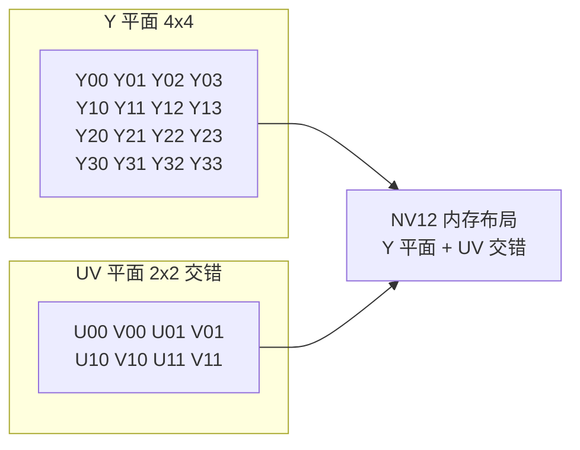
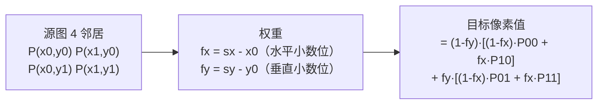

VPSS 是硬件做的缩放，但很多场景你必须自己处理像素：NPU 前处理（归一化、减均值）、OSD 叠加、夜视伪彩、图像质量分析、跨平台算法移植——这些地方没有 VPSS 帮你，只有裸像素和一双手。这一篇把两个最核心的像素算子**从数学原理到优化实现**完整写明白：**RGB↔YUV 颜色转换**和**双线性缩放**，给出浮点、定点、查表、NEON 四档优化，并用 FFmpeg 的 swscale 当标尺做 PSNR 验证。

**双轨对照**：同一套算法代码在 PC 上编译跑通、和 FFmpeg 对比 PSNR；板端用于 NPU 前处理和自定义滤镜。

## 一、为什么必须手写像素处理

**定义**：像素处理就是对图像里每个像素（或像素块）做数学运算——转换格式、调整大小、修改颜色、叠加内容。

**类比**：VPSS 是"工厂流水线"（专用设备，快但只能做固定工序）；手写像素处理是"手工工坊"（什么都能做，但要自己保证效率和质量）。

**必须手写的场景**：

| 场景 | 为什么 VPSS/现成工具不行 |
|:---|:---|
| NPU 前处理 | 模型要 RGB 归一化到 0~1、减均值、乘系数——VPSS 不提供 |
| OSD 叠加 | 把时间/文字/框逐像素混合到画面，需要自定义混合逻辑 |
| 特殊算法 | 夜视伪彩、人脸检测预处理、图像质量评估 |
| 跨平台移植 | 算法要跑在多个平台，不能依赖平台私有硬件 |

**手写像素处理的价值**：不在"写出比 swscale 更好的代码"，而在**你真正理解了像素格式、颜色空间和性能优化**——这是图像/音视频岗位面试的硬通货，也是后面 NPU 前处理和综合项目的基础。

## 二、RGB↔YUV：颜色空间转换的数学

### 2.1 为什么需要 YUV

**定义**：YUV 把颜色分成亮度（Y）和色度（U/V）两部分：Y 是亮度（灰度信息），U（蓝色差 Cb）、V（红色差 Cr）是色度信息。

**关键事实**：**人眼对亮度敏感、对色度不敏感**。所以色度可以降采样——NV12/NV21 是 4:2:0 采样，每 2×2 像素共用一组 UV。数据量从每像素 3 字节（RGB888）降到 1.5 字节（NV12），**直接减半**，而人眼几乎察觉不到差异。

**类比**：黑白照片（只有 Y）+ 一层很淡的彩色信息（U/V）——看起来还是彩色，但彩色部分占的空间小很多。这就是电视广播时代就定下来的设计。

【图1：YUV 4:2:0 采样布局（每 2×2 像素共用一组 UV）】



### 2.2 转换公式（BT.601）

**定义**：BT.601 是标清电视时代的色彩标准，定义了 RGB 与 YUV 之间的转换系数。高清（BT.709）系数略有不同，但思路一样。

RGB 每个分量取值 0~255 时，BT.601 正向转换（YUV 输出带 128 偏置使 U/V 落在无符号范围）：

```
Y  =  0.299R + 0.587G + 0.114B
U  = -0.169R - 0.331G + 0.500B + 128
V  =  0.500R - 0.419G - 0.081B + 128
```

反向（YUV → RGB）：

```
R = Y                  + 1.402(V - 128)
G = Y - 0.344(U - 128) - 0.714(V - 128)
B = Y + 1.772(U - 128)
```

**怎么来的**：Y 是 RGB 的加权和，权重反映人眼对三色的敏感度（绿最亮、红次之、蓝最暗）——0.299/0.587/0.114 加起来等于 1，保证灰阶不变色。U/V 是色差信号（B-Y、R-Y 的缩放），全灰画面（R=G=B）时 U=V=128。

**注意 full range vs limited range**：
- **Full range**：Y 用满 0~255（本篇用这个，简单）；
- **Limited range**：Y 只占 16~235（广播标准，留了过冲余量），需要额外的范围换算——**视频文件/推流常遇到 limited range，转出来偏灰/偏白先查这个**；
- 本篇演示用 full range 简化版；产品里必须确认源和目标的 range 一致，否则颜色发灰或发白（"待核实"时用标准测试图验证）。

### 2.3 朴素浮点实现（先跑对）

```c
// rgb2yuv_basic.c —— RGB888 → NV12（浮点版：先保证正确，再谈效率）
#include <stdint.h>
#include <stdio.h>
#include <stdlib.h>

/* RGB888 → NV12：Y 平面 1 字节/像素；UV 平面每 2×2 像素一组、U/V 交错 */
static void rgb888_to_nv12(const uint8_t *rgb, int w, int h,
                           uint8_t *y_plane, uint8_t *uv_plane)
{
    for (int j = 0; j < h; j++) {
        for (int i = 0; i < w; i++) {
            const uint8_t *p = rgb + (j * w + i) * 3;
            uint8_t r = p[0], g = p[1], b = p[2];

            /* Y：每个像素都算 */
            float yf = 0.299f * r + 0.587f * g + 0.114f * b;
            int yi = (int)yf;
            y_plane[j * w + i] = (uint8_t)(yi < 0 ? 0 : (yi > 255 ? 255 : yi));

            /* UV：只在偶数行列算（4:2:0 降采样） */
            if ((i & 1) == 0 && (j & 1) == 0) {
                float uf = -0.169f * r - 0.331f * g + 0.500f * b + 128.0f;
                float vf =  0.500f * r - 0.419f * g - 0.081f * b + 128.0f;
                int ui = (int)uf, vi = (int)vf;
                int uv_idx = (j / 2) * (w / 2) + (i / 2);
                uv_plane[uv_idx * 2 + 0] = (uint8_t)(ui < 0 ? 0 : (ui > 255 ? 255 : ui));
                uv_plane[uv_idx * 2 + 1] = (uint8_t)(vi < 0 ? 0 : (vi > 255 ? 255 : vi));
            }
        }
    }
}
```

**这段代码能跑，但很慢**：每个像素 3 次浮点乘加，1080p 一帧 200 万像素，每秒 30 帧就是 6000 万次浮点运算——嵌入式 Cortex-A7 上没有 FPU 加速浮点更是灾难。**所以必须优化**：浮点 → 定点 → 查表 → NEON。

## 三、优化一：定点化（浮点转整数运算）

**原理**：浮点系数乘以 2^16（65536）变成整数，运算后右移 16 位还原。整数乘加和移位在 ARM 上比浮点快几倍，而且没有浮点舍入的不确定性。

```c
// rgb2yuv_fixed.c —— 定点版：系数 × 65536 后取整
#define C_YR 19595   /* 0.299 * 65536 */
#define C_YG 38470   /* 0.587 * 65536 */
#define C_YB 7471    /* 0.114 * 65536 */
#define C_UR (-11059)  /* -0.169 * 65536 */
#define C_UG (-21709)  /* -0.331 * 65536 */
#define C_UB 32768     /*  0.500 * 65536 */
#define C_VR 32768
#define C_VG (-27437)  /* -0.419 * 65536 */
#define C_VB (-5309)   /* -0.081 * 65536 */
#define SHIFT 16

static inline int clamp255(int v) { return v < 0 ? 0 : (v > 255 ? 255 : v); }

static inline uint8_t rgb2y(uint8_t r, uint8_t g, uint8_t b)
{
    return (uint8_t)clamp255((C_YR * r + C_YG * g + C_YB * b) >> SHIFT);
}

static inline uint8_t rgb2u(uint8_t r, uint8_t g, uint8_t b)
{
    return (uint8_t)clamp255(((C_UR * r + C_UG * g + C_UB * b) >> SHIFT) + 128);
}

static inline uint8_t rgb2v(uint8_t r, uint8_t g, uint8_t b)
{
    return (uint8_t)clamp255(((C_VR * r + C_VG * g + C_VB * b) >> SHIFT) + 128);
}
```

**精度与溢出分析**：
- 中间量最大：C_YR × 255 ≈ 500 万，三项和 ≈ 1500 万，int（32 位）完全装得下；
- 定点与浮点的误差：系数取整引入约 ±0.0001 的误差，输出最多差 1 个灰度级——**人眼不可见，PSNR 会 > 45dB**；
- 若像素位深到 10bit（值 0~1023），中间量会到 6000 万，仍够 int，但更保险的做法是换 64 位或提前移位——**"待核实"时用测试数据验证**。

## 四、优化二：查表（把乘法换成内存读）

**原理**：R、G、B 各只有 256 个取值，`C_YR * r` 的乘积最多 256 种——**提前算好存表，运行时查表**。每像素把 3 次乘法换成 3 次内存读 + 2 次加法，快一个量级。

```c
// rgb2yuv_lut.c —— 查表版
static int32_t yr_tab[256], yg_tab[256], yb_tab[256];
static int32_t ur_tab[256], ug_tab[256], ub_tab[256];
static int32_t vr_tab[256], vg_tab[256], vb_tab[256];

static void init_tables(void)
{
    for (int i = 0; i < 256; i++) {
        yr_tab[i] = C_YR * i;  yg_tab[i] = C_YG * i;  yb_tab[i] = C_YB * i;
        ur_tab[i] = C_UR * i;  ug_tab[i] = C_UG * i;  ub_tab[i] = C_UB * i;
        vr_tab[i] = C_VR * i;  vg_tab[i] = C_VG * i;  vb_tab[i] = C_VB * i;
    }
}

static inline uint8_t rgb2y_lut(uint8_t r, uint8_t g, uint8_t b)
{
    return (uint8_t)clamp255((yr_tab[r] + yg_tab[g] + yb_tab[b]) >> SHIFT);
}
/* rgb2u_lut / rgb2v_lut 同理，用对应表格 */

/* 更进一步：整表合一。由于 Y 输出只有 256 种可能，也可以直接建
 * y_table[r][g][b]？256^3 = 16M 太大。折中：按行缓存（每行 256 项
 * 的 R×系数 提前算好）——在行循环外层预计算，内层只做加法。 */
```

**查表的工程细节**：
- **表放哪**：256 × 4 字节 × 9 张表 ≈ 9KB，放 .rodata（只读数据段），不占堆；
- **缓存友好性**：表连续访问，命中率高；
- **按行预计算更进一步**：外层行循环先算好 `yr_tab[r]` 这一行的值存临时数组，内层像素循环直接加——进一步减少内存读。

**性能对比预期**（同一张 1080p 图，Cortex-A7 量级，具体以实测为准）：

| 版本 | 相对耗时 | 说明 |
|:---|:---|:---|
| 浮点 | 1.0（基准） | 最慢 |
| 定点 | ~0.4 | 整数运算 |
| 查表 | ~0.15 | 乘法→内存读 |

## 五、优化三：NEON（向量化，一次处理 16 像素）

**定义**：NEON 是 ARM Cortex-A 系列的单指令多数据（SIMD）扩展，一条指令同时处理 128 位数据 = 16 个 8bit 像素或 4 个 32bit 整数。

**类比**：手写循环是"一个一个搬砖"，NEON 是"一次搬一筐"——指令数不变，处理的数据量 ×16。

**NEON 加速点**（思路，不展开实现）：
1. **YUV 转换**：`vld1q_u8` 一次加载 16 个像素的 R 通道，`vmlal_u8`（8bit×8bit 累加到 16bit）并行算 16 个 Y；
2. **缩放**：水平方向一次处理 16 个目标像素，权重用 `vtbl` 向量查表；
3. **拷贝/填充**：`vld1q/vst1q` 一次搬 16 字节，memcpy 级别的带宽。

**NEON 收益**：像素处理提速 **4~8 倍**（实测为准）。但 NEON 代码可读性差、移植性差，**产品里只在热点函数用**，先用 C 跑对，再向量化。

## 六、双线性缩放：从公式到代码

### 6.1 缩放的本质

**定义**：缩放是把源图的 N 个像素重采样到目标图的 M 个像素。关键问题是：目标像素 (dx, dy) 的值从哪里来？

**最近邻**：直接取源图上距离最近的点——快但锯齿严重（放大时马赛克感强）。

**双线性**：取源图上周围 4 个点的**加权平均**——平滑、质量好，是嵌入式主流选择。

**类比**：最近邻是"就近抄答案"（可能抄到歪的），双线性是"问 4 个邻居取平均"（答案更可靠）。

【图2：双线性缩放 4 邻域加权示意】



### 6.2 公式推导

目标像素 (dx, dy) 映射回源图坐标：

```
sx = dx × (sw / dw)
sy = dy × (sh / dh)
```

取 sx 的整数部分 x0、小数部分 fx；sy 同理 y0、fy。四个邻居 (x0,y0)、(x0+1,y0)、(x0,y0+1)、(x0+1,y0+1)，权重由 fx/fy 决定——**距离越近权重越大**：

```
dst(dx,dy) = (1-fy)·[(1-fx)·src(x0,y0) + fx·src(x1,y0)]
           +    fy ·[(1-fx)·src(x0,y1) + fx·src(x1,y1)]
```

### 6.3 实现（含边界处理）

```c
// scale_bilinear.c —— 灰度图双线性缩放（RGB 扩展：逐通道做同样操作）
#include <stdint.h>

static void bilinear_scale(const uint8_t *src, int sw, int sh,
                           uint8_t *dst, int dw, int dh)
{
    for (int dy = 0; dy < dh; dy++) {
        /* 映射到源坐标：+0.5 对齐像素中心，-0.5 修正偏移 */
        float sy = (dy + 0.5f) * sh / dh - 0.5f;
        if (sy < 0) sy = 0;                 /* 边界钳位 */
        int y0 = (int)sy;
        int y1 = y0 + 1 < sh ? y0 + 1 : y0; /* 防止越界（最底行重复） */
        float fy = sy - y0;

        for (int dx = 0; dx < dw; dx++) {
            float sx = (dx + 0.5f) * sw / dw - 0.5f;
            if (sx < 0) sx = 0;
            int x0 = (int)sx;
            int x1 = x0 + 1 < sw ? x0 + 1 : x0;
            float fx = sx - x0;

            /* 4 邻域加权平均 */
            float v = (1.0f - fy) * ((1.0f - fx) * src[y0 * sw + x0]
                                   +        fx  * src[y0 * sw + x1])
                    +        fy  * ((1.0f - fx) * src[y1 * sw + x0]
                                   +        fx  * src[y1 * sw + x1]);
            dst[dy * dw + dx] = (uint8_t)v;
        }
    }
}
```

**代码要点**：
- **`+0.5` 像素中心对齐**：不偏移会导致目标图整体"偏左上"半像素；
- **边界钳位**：映射坐标可能为负（缩小边缘）或超界（放大），要钳位或重复边缘像素；
- **性能**：`(dy + 0.5f) * sh / dh` 每个 dy 算一次，但每个 dx 都要算 sx——**可以定点化**：`fx = ((dx * sw) << 16) / dw & 0xFFFF`，把浮点除法变成整数除法+位运算，性能提升明显（性能优化的思路和前面颜色转换的定点化完全一致）。

## 七、验证：和 FFmpeg swscale 对答案

**标尺**：FFmpeg 的 `swscale` 是业界标准缩放/转换实现，用它的输出当"标准答案"。

### 7.1 生成参考数据

```bash
# 1) 生成一张彩色测试图（或用真实照片）
ffmpeg -f lavfi -i testsrc2=size=640x480:rate=30 -frames:v 1 test.png

# 2) FFmpeg 转成 RGB888 raw，供你的程序读取
ffmpeg -i test.png -pix_fmt rgb24 -f rawvideo test.rgb

# 3) FFmpeg 转成 NV12 raw（你的程序的"标准答案"）
ffmpeg -i test.png -pix_fmt nv12 -f rawvideo test_ref.nv12
```

### 7.2 程序输出 + PSNR 对比

```bash
# 你的程序读 test.rgb，输出 my_out.nv12
# 然后对比：
ffmpeg -s 640x480 -pix_fmt nv12 -i my_out.nv12 -i test_ref.nv12 \
       -lavfi "psnr" -f null -
```

**PSNR 判断标准**：

| PSNR | 含义 |
|:---|:---|
| > 45 dB | 几乎无损，肉眼不可辨 |
| 35~45 dB | 轻微差异，通常可接受 |
| < 30 dB | 明显差异，实现有问题 |

**如果 PSNR 低，按顺序排查**：
1. **range 不一致**：full vs limited（输出整体偏灰/偏白）；
2. **UV 排列错误**：NV12 是 U 在前 V 在后，NV21 相反（颜色偏紫/偏绿）；
3. **坐标偏移**：缩放的 +0.5 对齐（画面整体偏移半像素，PSNR 骤降）；
4. **边界越界**：读到了相邻行数据（花边/条纹）。

**缩放对比**同理：

```bash
ffmpeg -i test.png -vf scale=320:240 -pix_fmt gray -f rawvideo ref_320x240.y
# 你的程序输出 my_320x240.y
ffmpeg -s 320x240 -pix_fmt gray -i my_320x240.y -i ref_320x240.y \
       -lavfi "psnr" -f null -
```

**注意**：swscale 默认用更好的插值，你的双线性与它比 PSNR 在 35~45dB 之间正常；关键是要**稳定**（不随测试图剧烈波动），且肉眼无差异。

## 八、板端应用：NPU 前处理

**定义**：NPU 前处理 = 把采集的 YUV 帧转换成模型输入要求的格式（尺寸、颜色空间、归一化）。

典型流程（RV1126 场景）：

```c
/* 1. VPSS 通道已输出 640×480 RGB888（上一篇配置） */
/* 2. NPU 模型要求：640×480 RGB，像素值归一化到 [0,1] 或 [-1,1]，可能减均值 */
for (int i = 0; i < 640 * 480 * 3; i++) {
    float normalized = rgb_data[i] / 255.0f;   /* 归一化 */
    model_input[i] = (normalized - mean[i % 3]) / scale[i % 3]; /* 减均值除方差 */
}
```

**性能提示**：
- 归一化是**纯逐像素运算**，是查表/NEON 的经典场景（可以预先把 256 种像素值 × 3 通道的归一化结果查表）；
- 很多 RKNN 模型支持在**模型内部**做归一化（输入直接喂 0~255），省掉应用层循环——看模型转换时的配置；
- 归一化浮点运算在嵌入式上很慢，能省就省。

## 九、动手练习

1. 用朴素浮点版 RGB→NV12 转换一张 640×480 测试图，与 FFmpeg 参考对比 PSNR（应 > 45dB）
2. 把浮点系数换成定点（2^16），对比输出与浮点版的差异（应几乎一致，≤1 灰度级）
3. 加查表优化，用 `clock_gettime` 对比浮点/定点/查表三版耗时，记录加速比
4. 写双线性缩放（640×480 → 320×240），与 `ffmpeg -vf scale` 输出对比 PSNR（应 35~45dB）
5. 用最近邻缩放对比双线性，观察锯齿差异，理解为什么双线性更平滑
6. 故意把 NV12 的 U/V 顺序写反，观察 PSNR 和颜色变化——记住这个坑
7. （进阶）把 RGB→YUV 的 Y 通道改成 NEON intrinsics，对比与查表版的速度

## 里程碑

- [ ] 能写出 RGB↔YUV（BT.601）完整转换，并用 PSNR 与 swscale 验证正确
- [ ] 能说出 YUV 4:2:0 为什么省一半空间（人眼对色度不敏感 + UV 共用）
- [ ] 能解释浮点 → 定点 → 查表三档优化各自的原理和收益，并实测加速比
- [ ] 能实现双线性缩放，理解 4 邻域加权公式和 +0.5 中心对齐
- [ ] 能处理缩放边界（钳位/重复边缘像素），并知道越界的后果
- [ ] 能用 FFmpeg 生成参考图并与自己代码做 PSNR 对比，能按排查清单定位问题
- [ ] 能说出 NPU 前处理的典型流程（尺寸/格式/归一化），并指出可查表优化的点

> 🏷️ 标签：像素处理 · RGB · YUV · 颜色转换 · 双线性缩放 · 最近邻 · 查表 · 定点 · NEON · swscale · PSNR · NPU前处理 · 音视频
