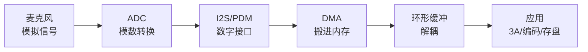
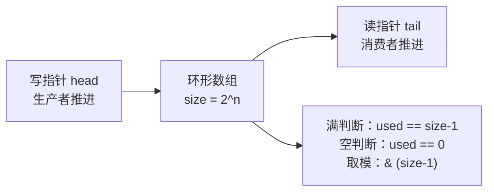

视频链路已经通了，现在把音频补上。双向语音（对讲）、语音唤醒、声纹识别、环境监听——这些产品都从"把麦克风的声音读进内存"开始。这一篇讲透音频采集的完整路径：**声音数字化 → ALSA/tinyalsa 接口 → 环形缓冲 → 电平检测 → 存 WAV**，每一步都有可照抄代码，并附常见问题排查。

**双轨对照**：板端用 tinyalsa/ALSA 采集麦克风；PC 端用 FFmpeg 录音、看波形、验证 WAV。代码结构两边通用。

## 一、音频采集全景

**定义**：音频采集 = 把麦克风拾取的模拟声音，经 ADC（模数转换器）转成数字 PCM 数据，再交给应用处理。

**完整链路**：

【图1：音频采集链路】



**类比**：视频是"逐帧拍照"（每秒 30 帧图像），音频是"连续采样"（每秒 16000/48000 个声音样本）——帧率换成采样率，像素换成样本。区别是**音频对实时性要求更高**：视频丢一帧无所谓，音频丢 20ms 就"咔哒"一声。

**RV1126 音频输入**：
- **I2S**：外接音频 codec（如麦克风阵列板），立体声/高质量；
- **PDM**：数字麦克风（无 codec，麦克风直接出 PDM 脉冲流），常见于麦克风阵列；
- SDK 用 ALSA 框架管理，应用层用 tinyalsa（轻量 ALSA 封装）读写。

**关键参数**（回顾基础篇，这里加深）：

| 参数 | 含义 | 典型值 | 影响 |
|:---|:---|:---|:---|
| 采样率 | 每秒采样数 | 16000（语音）/ 48000（音乐） | 决定最高可还原频率（奈奎斯特定理：采样率 ≥ 2× 信号频率） |
| 位深 | 每个样本位数 | S16_LE（16bit 小端） | 决定动态范围（16bit ≈ 96dB） |
| 声道数 | 单/双声道 | 1（麦克风）/ 2（立体声） | 数据量翻倍 |

**一秒钟 PCM 数据量** = 采样率 × 位深/8 × 声道数：
- 16kHz / 16bit / 单声道 = 16000 × 2 × 1 = **32 KB/s**
- 48kHz / 16bit / 双声道 = 48000 × 2 × 2 = **192 KB/s**

对比 1080p30 视频每秒 93MB，音频小得可以忽略——但**延迟和连续性要求极高**，这是音频工程的核心矛盾。

## 二、声音数字化：采样、量化、奈奎斯特

**定义**：
- **采样**：按固定时间间隔取声音波形的瞬时值。采样率越高，还原的高频越丰富；
- **量化**：把采样值离散成整数（位深决定精度）。16bit 把幅度分成 65536 级；
- **奈奎斯特定理**：采样率必须 ≥ 信号最高频率的 2 倍，否则高频信号会"折叠"成错误低频（混叠）。

**工程含义**：
- 语音最高频率约 4kHz，8kHz 采样就够电话质量——**16kHz 采样是语音识别/对讲的常见选择**（留余量）；
- 音乐/视频伴音要 44.1/48kHz；
- **混叠是硬件问题**（ADC 前有抗混叠滤波器），应用层不用管，但要理解为什么 16kHz 采集能覆盖语音。

**类比**：采样率是"拍照频率"，位深是"照片的色深"。拍照频率太低，快速动作会糊（高频丢失）；色深太低，渐变会断层（量化噪声）。

## 三、ALSA 与 tinyalsa

**定义**：
- **ALSA**（Advanced Linux Sound Architecture）：Linux 的音频框架，提供声卡驱动、PCM 读写、混音、插件；
- **tinyalsa**：ALSA 的精简 C 接口（`tinyalsa` 库），比完整 ALSA 库更轻、更简单，Rockchip/Android SDK 常用。

**类比**：ALSA 是"完整的音频操作系统"，tinyalsa 是"只保留应用层最常用几个函数的口袋版"。

### 3.1 设备查看

```bash
# 板端/PC 查看音频设备
cat /proc/asound/cards          # 声卡列表
arecord -l                      # 录音设备列表
```

### 3.2 tinyalsa 核心 API

| 函数 | 作用 | 关键参数 |
|:---|:---|:---|
| `pcm_open()` | 打开 PCM 设备 | 设备号、通道、PCM_IN/PCM_OUT、配置 |
| `struct pcm_config` | PCM 配置 | 采样率/格式/声道/period |
| `pcm_read()` | 读取一段 PCM 数据（阻塞） | 缓冲、字节数 |
| `pcm_write()` | 写入一段 PCM 数据 | 播放用 |
| `pcm_close()` | 关闭 | - |

### 3.3 period 概念（重要）

**定义**：period 是一次 DMA 传输/读操作的数据块大小，单位是帧（帧 = 一次采样 × 声道数）。

**为什么重要**：
- **period 越小，延迟越低**，但中断越频繁、CPU 开销越大；
- **period 越大，越省 CPU**，但缓冲延迟越大（对讲会"慢半拍"）；
- 语音场景 **20ms period** 是常见平衡点（50Hz 中断频率，延迟可接受）；
- `period_count` = 缓冲中放几段 period，决定抗抖动的深度。

**计算**：16kHz / 20ms → period_size = 16000 × 0.02 = 320 样本（单声道）。

## 四、采集代码（完整可跑）

```c
// alsa_capture.c —— tinyalsa 采集 1 秒，打印样本数与电平
#include <stdio.h>
#include <stdint.h>
#include <stdlib.h>
#include <math.h>
#include <tinyalsa/pcm.h>

#define SAMPLE_RATE 16000
#define CHANNELS    1
#define PERIOD_MS   20          /* 20ms period */
#define PERIOD_SIZE (SAMPLE_RATE * PERIOD_MS / 1000)  /* 320 样本 */

int main(void)
{
    struct pcm_config cfg = {
        .channels = CHANNELS,
        .rate = SAMPLE_RATE,
        .period_size = PERIOD_SIZE,
        .period_count = 8,               /* 8 段缓冲 ≈ 160ms 抗抖动 */
        .format = PCM_FORMAT_S16_LE,
        .start_threshold = 0,
        .stop_threshold = 0,
        .silence_threshold = 0,
    };

    /* pcm_open(card, device, PCM_IN=capture, &cfg) */
    struct pcm *pcm = pcm_open(0, 0, PCM_IN, &cfg);
    if (!pcm || !pcm_is_ready(pcm)) {
        printf("pcm_open failed: %s\n", pcm_get_error(pcm));
        return -1;
    }

    int16_t buf[PERIOD_SIZE];
    int total = 0;
    for (int i = 0; i < 50; i++) {   /* 50 × 20ms = 1 秒 */
        if (pcm_read(pcm, buf, sizeof(buf)) < 0) {
            printf("pcm_read failed\n");
            break;
        }
        /* 简单电平：峰值 */
        int peak = 0;
        for (int j = 0; j < PERIOD_SIZE; j++) {
            int v = buf[j] < 0 ? -buf[j] : buf[j];
            if (v > peak) peak = v;
        }
        printf("[%4dms] peak=%5d (%.1f%%)\n",
               total * 1000 / SAMPLE_RATE, peak,
               100.0 * peak / 32768);
        total += PERIOD_SIZE;
    }
    printf("captured %d samples (%d ms)\n", total, total * 1000 / SAMPLE_RATE);

    pcm_close(pcm);
    return 0;
}
```

**编译链接**（板端 SDK 已带 tinyalsa 时）：

```bash
# 板端（交叉编译链 + SDK 库路径按你的 SDK 配置）
arm-linux-gnueabihf-gcc alsa_capture.c -o alsa_capture -ltinyalsa
# PC（装了 libasound 时可用 ALSA 等价接口，或直接装 tinyalsa）
gcc alsa_capture.c -o alsa_capture -ltinyalsa
```

**运行预期**：对着麦克风说话，peak 明显升高（安静时 < 5%，说话时 20%+）。

## 五、环形缓冲：采集线程与处理线程解耦

### 5.1 为什么需要

**定义**：环形缓冲（ring buffer）是定长数组 + 读写指针的 FIFO，写满绕回开头，实现生产者（采集线程）与消费者（处理线程）解耦。

**类比**：食堂窗口（生产者）把菜放到转盘（缓冲），食客（消费者）按顺序取——转盘转满一圈回到起点继续放，只要食客吃得够快，窗口就不用停。

**不用它的问题**：如果采集线程直接调用处理逻辑，处理慢了（编码/网络抖动/3A 计算）就会阻塞采集——pcm_read 是阻塞的，处理慢一拍就丢一段数据，出现"咔哒"声。环形缓冲让两边各干各的，**生产者永远不阻塞在消费者上**。

### 5.2 实现（单生产者单消费者，无锁版）

```c
// ringbuf.h —— 音频环形缓冲（SPSC，无锁）
#include <stdint.h>

typedef struct {
    int16_t *data;
    int      size;      /* 总容量（样本数），必须是 2 的幂 */
    int      head;      /* 写位置（生产者） */
    int      tail;      /* 读位置（消费者） */
} ringbuf_t;

static inline void rb_init(ringbuf_t *rb, int16_t *buf, int size_pow2)
{
    rb->data = buf;
    rb->size = size_pow2;
    rb->head = rb->tail = 0;
}

/* 已用样本数：head - tail 按 size 取模（size 是 2 的幂，用 & 代替 %） */
static inline int rb_used(const ringbuf_t *rb)
{
    return (rb->head - rb->tail) & (rb->size - 1);
}

/* 空闲样本数：留一个空位区分"满"和"空" */
static inline int rb_free(const ringbuf_t *rb)
{
    return rb->size - 1 - rb_used(rb);
}

/* 写 n 个样本，返回实际写入数（空间不够就截断） */
static inline int rb_write(ringbuf_t *rb, const int16_t *src, int n)
{
    int free = rb_free(rb);
    if (n > free) n = free;
    for (int i = 0; i < n; i++) {
        rb->data[rb->head] = src[i];
        rb->head = (rb->head + 1) & (rb->size - 1);
    }
    return n;
}

/* 读 n 个样本，返回实际读出数 */
static inline int rb_read(ringbuf_t *rb, int16_t *dst, int n)
{
    int used = rb_used(rb);
    if (n > used) n = used;
    for (int i = 0; i < n; i++) {
        dst[i] = rb->data[rb->tail];
        rb->tail = (rb->tail + 1) & (rb->size - 1);
    }
    return n;
}
```

【图2：环形缓冲读写指针】



**无锁原理（重要）**：
- **单生产者单消费者（SPSC）**：`head` 只有写线程改，`tail` 只有读线程改——两个线程不写同一个变量，所以**不需要锁**；
- 但要注意**内存屏障**：极端场景下编译器/CPU 可能重排，产品级代码建议在读写边界加 `__sync_synchronize()` 或原子操作（"待核实"时按平台内存模型处理）；
- **多生产者/多消费者**（如多个采集源）就不能无锁了，需要加锁或用更复杂的无锁队列——本篇场景（一路麦克风）SPSC 足够。

**size 为什么必须是 2 的幂**：`& (size-1)` 一次与运算代替取模（除法），嵌入式性能关键；同时保证"回绕"的正确性。

### 5.3 采集线程 + 处理线程完整骨架

```c
// capture_pipeline.c —— 采集 → 环形缓冲 → 处理 骨架
#include <pthread.h>
#include "ringbuf.h"

#define RB_SIZE (1 << 15)          /* 32768 样本 ≈ 2 秒 @16kHz */
static int16_t rb_mem[RB_SIZE];
static ringbuf_t g_rb;
static struct pcm *g_pcm;

void *capture_thread(void *arg)    /* 生产者：只管往缓冲写 */
{
    int16_t buf[PERIOD_SIZE];
    while (1) {
        if (pcm_read(g_pcm, buf, sizeof(buf)) >= 0) {
            rb_write(&g_rb, buf, PERIOD_SIZE);
        }
    }
    return NULL;
}

void *process_thread(void *arg)    /* 消费者：从缓冲读，做处理 */
{
    int16_t out[PERIOD_SIZE];
    while (1) {
        int n = rb_read(&g_rb, out, PERIOD_SIZE);
        if (n > 0) {
            /* 这里做：电平检测 / 3A / 编码 / 存 WAV ... */
        }
    }
    return NULL;
}

int main(void)
{
    /* ... 初始化 pcm（同上） ... */
    rb_init(&g_rb, rb_mem, RB_SIZE);
    pthread_t t1, t2;
    pthread_create(&t1, NULL, capture_thread, NULL);
    pthread_create(&t2, NULL, process_thread, NULL);
    /* 常驻运行 */
    pthread_join(t1, NULL);
    return 0;
}
```

## 六、电平检测（RMS 与 VU 表）

**定义**：电平 = 当前声音的响度。两个常用指标：
- **峰值（Peak）**：一段内样本绝对值的最大值——反映瞬间冲击；
- **RMS（均方根）**：一段内样本平方的平均再开方——反映能量，更接近人耳感知。

**换算 dBFS**：`dBFS = 20 × log10(level / 32768)`。0dBFS 是满量程（削波临界），语音通常 -30~-12dBFS。

```c
// level.c —— RMS / 峰值 / dBFS 计算
#include <math.h>

typedef struct {
    int   peak;    /* 0~32767 */
    float rms;     /* 0~32767 */
    float rms_db;  /* dBFS */
} level_t;

level_t calc_level(const int16_t *buf, int n)
{
    level_t lv = {0, 0.0f, 0.0f};
    long sum = 0;
    for (int i = 0; i < n; i++) {
        int v = buf[i] < 0 ? -buf[i] : buf[i];
        if (v > lv.peak) lv.peak = v;
        sum += (long)v * v;
    }
    lv.rms = sqrtf((float)sum / n);
    lv.rms_db = 20.0f * log10f(lv.rms / 32768.0f + 1e-6f);
    return lv;
}

/* VU 表：终端打印进度条 */
void print_vu(const level_t *lv)
{
    int bars = (int)(lv->rms / 32768.0f * 40);
    printf("|");
    for (int i = 0; i < 40; i++) putchar(i < bars ? '#' : '-');
    printf("| %6.1f dBFS\n", lv->rms_db);
}
```

**工程用途**：
1. **调试麦克风**：采集没声音 → 电平恒为极低值；采集正常 → 说话时电平波动；
2. **静音检测**：RMS 低于阈值持续 N 秒 → 判定静音（省编码/存储/网络）；
3. **AGC 依据**：自动增益控制要看输入电平决定放大倍数（音频 3A 篇会展开）；
4. **削波检测**：peak 接近 32767 → 过载，需要降增益或开限幅。

## 七、保存 WAV 文件

**定义**：WAV 是通用无损音频容器：**44 字节文件头（RIFF/WAVE/fmt/data）+ PCM 数据**。任何播放器都能读。

### 7.1 WAV 头结构

| 偏移 | 长度 | 内容 |
|:---|:---|:---|
| 0 | 4 | "RIFF" |
| 4 | 4 | 文件总长 - 8（小端） |
| 8 | 4 | "WAVE" |
| 12 | 4 | "fmt " |
| 16 | 4 | fmt 块长 = 16 |
| 20 | 2 | 音频格式 = 1（PCM） |
| 22 | 2 | 声道数 |
| 24 | 4 | 采样率 |
| 28 | 4 | 字节率 = 采样率 × 声道 × 2 |
| 32 | 2 | 块对齐 = 声道 × 2 |
| 34 | 2 | 位深 = 16 |
| 36 | 4 | "data" |
| 40 | 4 | PCM 数据字节数 |
| 44 | - | PCM 数据 |

### 7.2 代码（先写头，录完回填长度）

```c
// wav_write.c —— 写 WAV 头 + 数据 + 回填
#include <stdio.h>
#include <stdint.h>
#include <string.h>

typedef struct {
    FILE *fp;
    long  data_start;   /* 记录数据起始位置，便于回填 */
} wav_writer_t;

static int wav_open(wav_writer_t *w, const char *path,
                    int sample_rate, int channels)
{
    w->fp = fopen(path, "wb");
    if (!w->fp) return -1;
    w->data_start = 44;

    /* 先写占位头（data 长度先写 0，录完回填） */
    uint16_t block_align = channels * 2;
    uint32_t byte_rate = sample_rate * block_align;
    uint32_t zero = 0;

    fwrite("RIFF", 1, 4, w->fp);
    fwrite(&(uint32_t){36}, 4, 1, w->fp);        /* 占位 */
    fwrite("WAVE", 1, 4, w->fp);
    fwrite("fmt ", 1, 4, w->fp);
    fwrite(&(uint32_t){16}, 4, 1, w->fp);
    fwrite(&(uint16_t){1}, 2, 1, w->fp);         /* PCM */
    fwrite(&(uint16_t){channels}, 2, 1, w->fp);
    fwrite(&(uint32_t){sample_rate}, 4, 1, w->fp);
    fwrite(&byte_rate, 4, 1, w->fp);
    fwrite(&block_align, 2, 1, w->fp);
    fwrite(&(uint16_t){16}, 2, 1, w->fp);        /* 16bit */
    fwrite("data", 1, 4, w->fp);
    fwrite(&zero, 4, 1, w->fp);                  /* 占位 */
    return 0;
}

static int wav_write(wav_writer_t *w, const int16_t *pcm, int samples)
{
    return fwrite(pcm, 2, samples, w->fp);
}

static int wav_close(wav_writer_t *w)   /* 回填真实长度 */
{
    long data_bytes = ftell(w->fp) - w->data_start;
    fseek(w->fp, 4, SEEK_SET);
    uint32_t riff_size = 36 + data_bytes;
    fwrite(&riff_size, 4, 1, w->fp);
    fseek(w->fp, 40, SEEK_SET);
    fwrite(&data_bytes, 4, 1, w->fp);
    fclose(w->fp);
    return 0;
}
```

**验证**：

```bash
ffprobe out.wav        # 应显示 16000 Hz / 16bit / mono / PCM
ffplay out.wav         # 播放验证
```

## 八、PC 端对照

```bash
# 1) PC 录音 3 秒（设备名以机器为准，可用 arecord -l 查看）
ffmpeg -f alsa -i hw:0 -t 3 -ar 16000 -ac 1 out.wav

# 2) 查看 WAV 信息
ffprobe out.wav

# 3) 播放
ffplay out.wav

# 4) 转 raw PCM 供你的程序读取验证
ffmpeg -i out.wav -f s16le -ar 16000 -ac 1 out.raw

# 5) 生成波形图
ffmpeg -i out.wav -filter_complex "showwavespic=s=640x200" wave.png

# 6) 看响度统计
ffmpeg -i out.wav -af volumedetect -f null -
```

**对照要点**：PC 上先完整走一遍"录音 → 看波形 → 看响度 → 验证 WAV"，理解 PCM 数据长什么样，再上板用同样的代码结构（tinyalsa 换设备名）跑通。

## 九、常见问题排查

| 现象 | 可能原因 | 排查 |
|:---|:---|:---|
| pcm_open 失败 | 设备号错/驱动没加载/被占用 | `cat /proc/asound/cards`，确认 PCM_IN |
| 采到全零 | 麦克风没供电/模拟开关没开 | 查 codec 初始化、混音器开关 |
| 声音"咔哒"断续 | period 太小或消费太慢丢数据 | 加大 period_count，加环形缓冲 |
| 声音变调/太快太慢 | 采样率配置与实际不符 | 核对 rate 与设备能力 |
| 左右声道反/单声道 | 声道数配置错 | 核对 channels |
| 音量忽大忽小 | 未开 AGC 或噪声 | 检查增益与降噪参数（音频 3A 篇） |

## 十、动手练习

1. 板端跑通 tinyalsa 采集，打印 1 秒采集样本数，验证采样率/位深正确
2. 把采集线程改成"生产 → 环形缓冲 → 消费"，消费线程每 20ms 打印 RMS 电平，对着麦克风说话看电平变化
3. 实现 VU 表终端显示，测试静音/说话/大喊三档电平（dBFS）
4. 采集 5 秒写入 WAV，用 ffprobe 验证文件格式，ffplay 播放确认
5. 用 `ffmpeg showwavespic` 生成波形图，对照你的 RMS 曲线，理解电平与波形的关系
6. 故意不消费环形缓冲，观察 rb_write 截断行为（数据被丢弃）——理解缓冲溢出
7. （进阶）把环形缓冲 size 改成非 2 的幂，观察取模错误导致的问题

## 里程碑

- [ ] 能说出音频采集链路：麦克风 → ADC → I2S/PDM → DMA → 环形缓冲 → 应用
- [ ] 能算出任意采样率/位深/声道下每秒 PCM 数据量
- [ ] 能解释采样率/位深/奈奎斯特定理，说明语音为什么用 16kHz
- [ ] 能用 tinyalsa 配置并读取 PCM 数据，理解 period 与延迟的关系
- [ ] 能实现 SPSC 无锁环形缓冲（2 的幂 + 读写指针 + 满空判断），并说出无锁原理
- [ ] 能计算 RMS/峰值/dBFS，并做出 VU 表显示
- [ ] 能写出正确 WAV 头并保存/回读验证（含回填长度）
- [ ] 能用 FFmpeg 录音/看波形/看响度，与板端行为对照

> 🏷️ 标签：音频采集 · ALSA · tinyalsa · PCM · 采样率 · 位深 · 奈奎斯特 · 环形缓冲 · SPSC · 电平检测 · VU · WAV · 音视频
