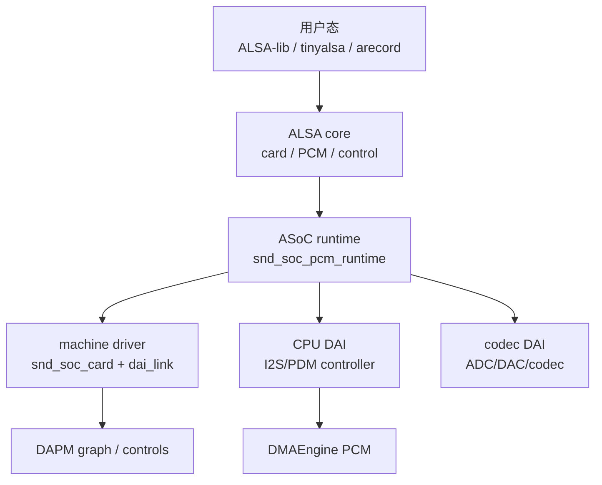
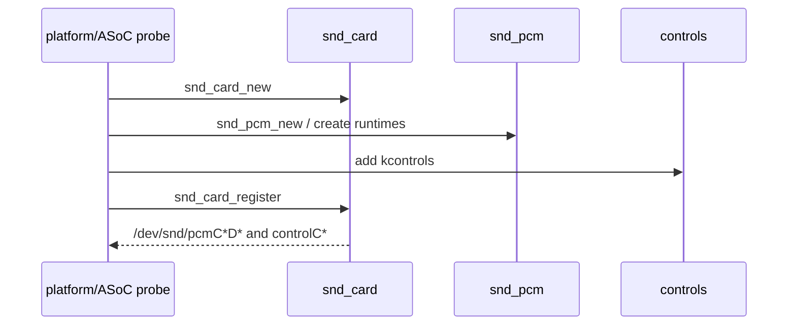
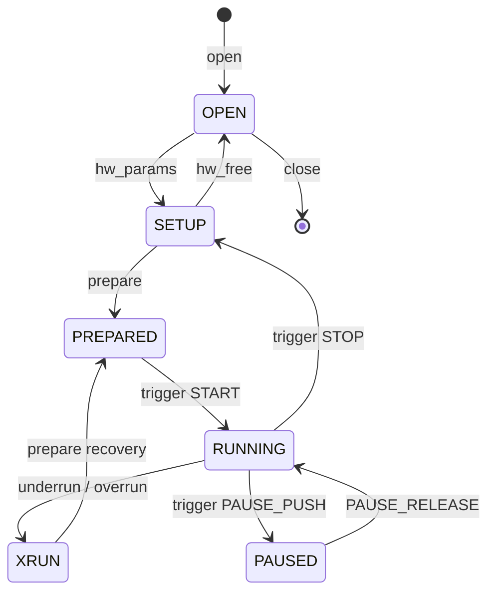
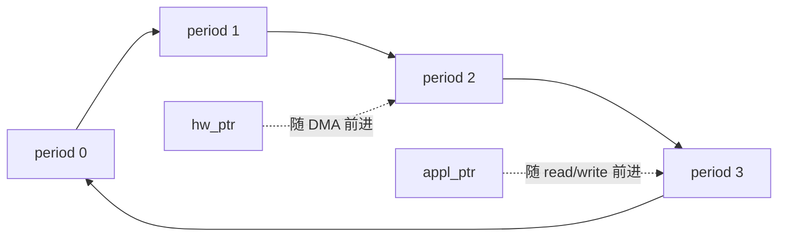
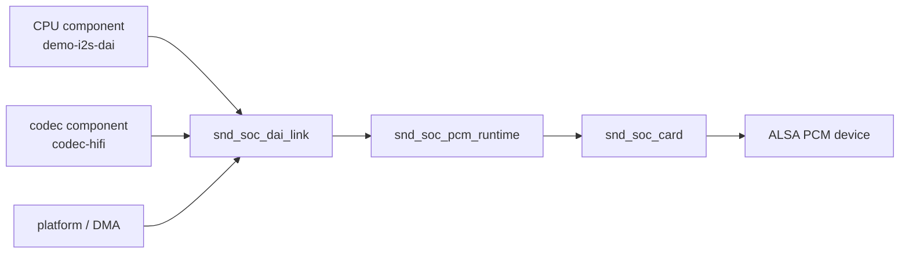
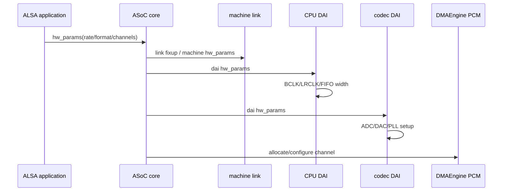
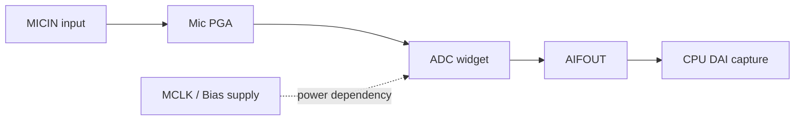
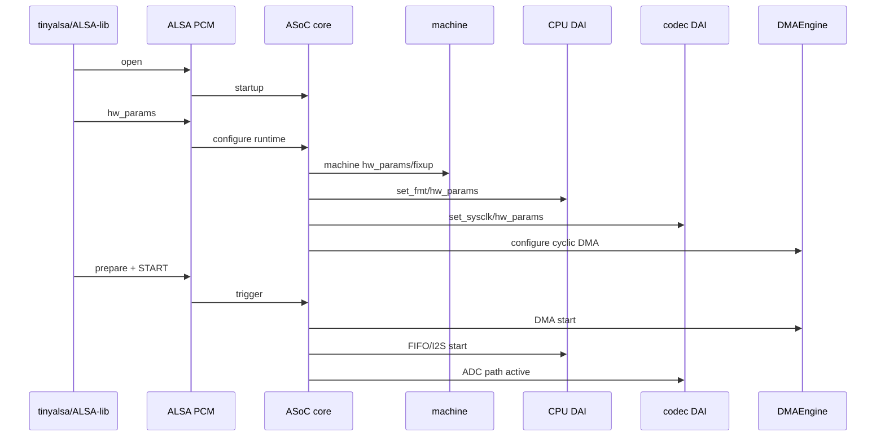

# ALSA 与 ASoC：Linux 音频驱动框架

应用层调用 `arecord`、ALSA-lib 或 tinyalsa 时，只看到 card/device、采样率、格式、声道、period 和 buffer。内核里一次录音却跨过 ALSA core、ASoC runtime、machine driver、CPU DAI、codec DAI、DMAEngine 和 DAPM 电源图。

要读懂“声卡注册成功但录不到声音”“hw_params 返回 EINVAL”“播放一会 underrun”，必须把用户态参数、PCM 状态机、DAI 时钟和 DMA 指针放进同一条调用链。

## 一、ALSA 与 ASoC 的分工

ALSA 是 Linux 通用声音子系统，定义 card、PCM、control、raw MIDI、timer 等用户接口。ASoC（ALSA System on Chip）建立在 ALSA 上，专门把嵌入式音频硬件拆成可复用 component、DAI 与板级连接。



| 层 | 主要对象 | 责任 |
|:---|:---|:---|
| ALSA core | `snd_card`、`snd_pcm`、`snd_kcontrol` | 用户 ABI 与 PCM 状态机 |
| ASoC core | component、DAI、runtime | 把各驱动组合成 ALSA PCM |
| CPU DAI | I2S/SAI/PDM controller | 总线格式、时钟、FIFO、DMA request |
| codec DAI | codec ADC/DAC 接口 | 模拟路径、数字格式、PLL、增益 |
| machine driver | card、DAI link、routes | 板级接线与主从时钟策略 |
| DMAEngine PCM | channel、descriptor、pointer | PCM ring buffer 与 DMA 搬运 |

## 二、ALSA card：一张声卡的根对象

不使用 ASoC 时，传统 ALSA 驱动可直接创建 `snd_card`：

```c
struct demo_audio {
    struct snd_card *card;
    struct snd_pcm *pcm;
};

static int demo_probe(struct platform_device *pdev)
{
    struct snd_card *card;
    struct demo_audio *chip;
    int ret;

    ret = snd_card_new(&pdev->dev, -1, NULL, THIS_MODULE,
                       sizeof(*chip), &card);
    if (ret < 0)
        return ret;

    chip = card->private_data;
    chip->card = card;
    strscpy(card->driver, "demo-audio", sizeof(card->driver));
    strscpy(card->shortname, "Demo Audio", sizeof(card->shortname));
    strscpy(card->longname, "Demo Audio PCM", sizeof(card->longname));

    ret = snd_card_register(card);
    if (ret < 0) {
        snd_card_free(card);
        return ret;
    }

    platform_set_drvdata(pdev, chip);
    return 0;
}
```

`snd_card_new()` 分配 card 和 private_data；`snd_card_register()` 在所有 PCM/control 已创建后统一注册用户可见节点。device-managed 版本 `devm_snd_card_new()` 可减少 remove 清理路径。

ASoC 驱动通常不直接调用 `snd_card_new()`：ASoC core 根据 `snd_soc_card` 与 DAI links 创建底层 ALSA card。



## 三、PCM 对象：device、stream、substream、runtime

`snd_pcm_new()` 创建一个 PCM device，并指定 playback/capture substream 数量：

```c
ret = snd_pcm_new(card, "Demo PCM", 0,
                  1, /* playback substreams */
                  1, /* capture substreams */
                  &chip->pcm);
```

对象关系：

```text
snd_card
  └── snd_pcm (device 0)
       ├── playback stream
       │    └── snd_pcm_substream
       │         └── snd_pcm_runtime (open 后存在)
       └── capture stream
            └── snd_pcm_substream
                 └── snd_pcm_runtime
```

`snd_pcm_substream` 表示一个打开的数据流，记录 stream 方向、编号、ops 和 private_data。`snd_pcm_runtime` 在 open 生命周期内保存硬件能力、当前 hw_params、DMA area/address/bytes、control/appl/hw pointers 与状态。

同一个 PCM device 的 playback 与 capture 可以有不同 substream 数量和硬件约束。不要把 capture 参数存在全局变量后覆盖 playback runtime。

## 四、`snd_pcm_hardware`：把真实硬件能力报告给应用

open 回调通常把 `snd_pcm_hardware` 复制到 runtime：

```c
static const struct snd_pcm_hardware demo_pcm_hw = {
    .info = SNDRV_PCM_INFO_INTERLEAVED |
            SNDRV_PCM_INFO_BLOCK_TRANSFER |
            SNDRV_PCM_INFO_MMAP |
            SNDRV_PCM_INFO_MMAP_VALID,
    .formats = SNDRV_PCM_FMTBIT_S16_LE |
               SNDRV_PCM_FMTBIT_S24_LE,
    .rates = SNDRV_PCM_RATE_8000_96000,
    .rate_min = 8000,
    .rate_max = 96000,
    .channels_min = 1,
    .channels_max = 8,
    .buffer_bytes_max = 512 * 1024,
    .period_bytes_min = 256,
    .period_bytes_max = 64 * 1024,
    .periods_min = 2,
    .periods_max = 128,
};

static int demo_pcm_open(struct snd_pcm_substream *substream)
{
    substream->runtime->hw = demo_pcm_hw;
    return 0;
}
```

能力表必须是 CPU DAI、codec DAI、DMA 和板级时钟的交集。为了让 `arecord` 看起来支持更多格式而填写过宽范围，只会把失败推迟到 hw_params 或产生错误时钟。

ALSA constraints 还能表达采样率列表、period 对齐、buffer/period 整数关系等。硬件要求 period bytes 是 burst 的倍数时，应在 hw rule 中约束，而不是在 trigger 后发现 DMA 不接受。

## 五、`snd_pcm_ops`：一次 PCM 打开的完整接口

传统 ALSA PCM 驱动实现 `snd_pcm_ops`：

```c
static const struct snd_pcm_ops demo_pcm_ops = {
    .open      = demo_pcm_open,
    .close     = demo_pcm_close,
    .ioctl     = snd_pcm_lib_ioctl,
    .hw_params = demo_pcm_hw_params,
    .hw_free   = demo_pcm_hw_free,
    .prepare   = demo_pcm_prepare,
    .trigger   = demo_pcm_trigger,
    .pointer   = demo_pcm_pointer,
    .mmap      = demo_pcm_mmap,
};

snd_pcm_set_ops(pcm, SNDRV_PCM_STREAM_PLAYBACK, &demo_pcm_ops);
snd_pcm_set_ops(pcm, SNDRV_PCM_STREAM_CAPTURE, &demo_pcm_ops);
```

| 回调 | 语义 |
|:---|:---|
| `open` | 设置 hardware capabilities、分配每次打开状态 |
| `close` | 释放 open 私有资源 |
| `hw_params` | 确认格式/率/通道/period/buffer，分配 DMA buffer |
| `hw_free` | 释放 hw_params 取得的资源 |
| `prepare` | 重置 FIFO、DMA 指针和 codec 状态，准备启动 |
| `trigger` | 响应 START/STOP/PAUSE/RESUME，不能睡眠太久 |
| `pointer` | 返回硬件当前 DMA 位置，单位是 frames |
| `mmap` | 将 DMA buffer 映射给应用 |

open 不应立刻启动硬件；hw_params 也不等于开始 DMA。ALSA 状态机把“配置完成”和“正在运行”明确分开。

## 六、PCM 状态机



应用的 write/read、start threshold 和 avail_min 会影响何时从 PREPARED 进入 RUNNING。驱动不能绕开状态机自己修改 runtime state。

xrun 是 **underrun**（playback 数据供不上）或 **overrun**（capture 数据来不及取）的统称。ALSA 将状态置为 XRUN，应用通常调用 `snd_pcm_prepare()` 恢复。

## 七、PCM ring buffer、period 与指针

DMA buffer 是循环缓冲。`buffer_size` 和 `period_size` 的单位通常是 frames；每 frame 包含所有声道的一组 sample。

```text
bytes_per_frame = channels × physical_width(format) / 8
buffer_bytes    = buffer_size_frames × bytes_per_frame
period_bytes    = period_size_frames × bytes_per_frame
```

三个重要位置：

- appl_ptr：应用已经写入（playback）或读取（capture）到哪里；
- hw_ptr：硬件 DMA 已消费或生产到哪里；
- DMA residue/current address：驱动用于计算 hw_ptr 的硬件信息。



`pointer()` 返回相对 ring 起点的 frame offset，必须在 `[0, buffer_size)` 内回绕。返回 bytes 或物理地址会让 ALSA 错误计算 avail，最终产生虚假 xrun。

## 八、period 中断与 `snd_pcm_period_elapsed`

每完成一个 period，DMA 中断或 callback 调用：

```c
snd_pcm_period_elapsed(substream);
```

它更新 ALSA runtime、唤醒 poll/read/write 等待者，并可能检查 xrun。调用频率必须与 period_size 匹配：漏一次会增加延迟并让 hw_ptr 落后；重复调用会让应用误以为数据已就绪。

DMA callback 与 STOP/hw_free 并发时，必须确保 substream 和 DMA descriptor 仍有效。常见做法是在 terminate DMA 后同步等待 callback 退出，再释放 buffer。

## 九、ASoC component：把可复用驱动能力注册给 core

现代 ASoC 用 `snd_soc_component_driver` 描述一个 component：

```c
static const struct snd_soc_component_driver demo_component = {
    .name = "demo-i2s",
    .probe = demo_component_probe,
    .remove = demo_component_remove,
    .controls = demo_controls,
    .num_controls = ARRAY_SIZE(demo_controls),
    .dapm_widgets = demo_widgets,
    .num_dapm_widgets = ARRAY_SIZE(demo_widgets),
    .dapm_routes = demo_routes,
    .num_dapm_routes = ARRAY_SIZE(demo_routes),
};
```

CPU/codec 平台驱动注册 component 与 DAI：

```c
ret = devm_snd_soc_register_component(&pdev->dev,
                                      &demo_component,
                                      demo_dais,
                                      ARRAY_SIZE(demo_dais));
```

非 devm 版本是 `snd_soc_register_component()`，remove 需要 `snd_soc_unregister_component()`。目标内核若已有 devm API，应优先使用，避免 probe 失败清理遗漏。

## 十、DAI：数字音频接口的能力与回调

`snd_soc_dai_driver` 描述 playback/capture stream capabilities 和 `snd_soc_dai_ops`：

```c
static const struct snd_soc_dai_ops demo_dai_ops = {
    .startup      = demo_startup,
    .shutdown     = demo_shutdown,
    .hw_params    = demo_hw_params,
    .set_fmt      = demo_set_fmt,
    .set_sysclk   = demo_set_sysclk,
    .set_tdm_slot = demo_set_tdm_slot,
    .trigger      = demo_trigger,
};

static struct snd_soc_dai_driver demo_dais[] = {
    {
        .name = "demo-i2s-dai",
        .playback = {
            .stream_name = "Playback",
            .channels_min = 2,
            .channels_max = 8,
            .rates = SNDRV_PCM_RATE_8000_192000,
            .formats = SNDRV_PCM_FMTBIT_S16_LE |
                       SNDRV_PCM_FMTBIT_S24_LE,
        },
        .capture = {
            .stream_name = "Capture",
            .channels_min = 2,
            .channels_max = 8,
            .rates = SNDRV_PCM_RATE_8000_192000,
            .formats = SNDRV_PCM_FMTBIT_S16_LE |
                       SNDRV_PCM_FMTBIT_S24_LE,
        },
        .ops = &demo_dai_ops,
    },
};
```

DAI capability 与 ALSA PCM hardware constraints 最终由 ASoC core 求交集。codec 不支持 192 kHz 时，即使 CPU DAI 支持也不能对应用暴露。

## 十一、Machine driver：板级连接事实

`snd_soc_card` 和 `snd_soc_dai_link` 由 machine driver 定义。component 是可复用 IP，machine 描述“这块板上谁连谁”。

```c
static struct snd_soc_dai_link board_links[] = {
    {
        .name = "Codec Link",
        .stream_name = "Codec PCM",
        .cpus = board_cpu,
        .num_cpus = 1,
        .codecs = board_codec,
        .num_codecs = 1,
        .platforms = board_platform,
        .num_platforms = 1,
        .dai_fmt = SND_SOC_DAIFMT_I2S |
                   SND_SOC_DAIFMT_NB_NF |
                   SND_SOC_DAIFMT_CBS_CFS,
    },
};

static struct snd_soc_card board_card = {
    .name = "rv1126-demo-card",
    .owner = THIS_MODULE,
    .dai_link = board_links,
    .num_links = ARRAY_SIZE(board_links),
    .dapm_widgets = board_widgets,
    .num_dapm_widgets = ARRAY_SIZE(board_widgets),
    .dapm_routes = board_routes,
    .num_dapm_routes = ARRAY_SIZE(board_routes),
};
```

probe 最后：

```c
board_card.dev = &pdev->dev;
snd_soc_of_parse_card_name(&board_card, "model");
return devm_snd_soc_register_card(&pdev->dev, &board_card);
```

`devm_snd_soc_register_card()` 成功后，ASoC 才把 links 绑定成 `snd_soc_pcm_runtime` 并创建 ALSA PCM。



## 十二、DAI format：I2S、极性与主从

`set_fmt` 接收组合后的 DAI format。三个维度不能混淆：

### 数据格式

- `SND_SOC_DAIFMT_I2S`：I2S，一 bit clock 延迟；
- `SND_SOC_DAIFMT_LEFT_J`：左对齐；
- `SND_SOC_DAIFMT_RIGHT_J`：右对齐；
- DSP_A/DSP_B：常用于 PCM/TDM 帧同步。

### 时钟极性

`NB_NF`、`NB_IF`、`IB_NF`、`IB_IF` 分别描述 bit clock 与 frame clock 是否反相。

### 主从关系

旧命名 `SND_SOC_DAIFMT_CBS_CFS` 表示 codec bit/frame slave，即 CPU 为主；`CBM_CFM` 表示 codec 为主。新内核逐步采用 provider/consumer 术语，阅读目标内核定义时必须确认语义，不能只凭宏名猜测。

```c
static int demo_set_fmt(struct snd_soc_dai *dai, unsigned int fmt)
{
    switch (fmt & SND_SOC_DAIFMT_FORMAT_MASK) {
    case SND_SOC_DAIFMT_I2S:
        /* configure I2S frame */
        break;
    default:
        return -EINVAL;
    }

    switch (fmt & SND_SOC_DAIFMT_CLOCK_PROVIDER_MASK) {
    case SND_SOC_DAIFMT_CBS_CFS:
        /* CPU provides BCLK/LRCLK on legacy kernels */
        break;
    default:
        return -EINVAL;
    }
    return 0;
}
```

## 十三、`hw_params`：采样参数如何变成时钟和寄存器

ASoC PCM `hw_params` 会依次协调 machine、CPU DAI、codec DAI 与 platform。每一方都可拒绝不支持参数。



典型计算：

```text
LRCLK = sample_rate
BCLK  = sample_rate × slots × slot_width
MCLK  = sample_rate × mclk_fs
```

48 kHz、2 slots、32-bit slot 的 BCLK 是 3.072 MHz。有效样本可以是 S24_LE，但 slot_width 仍为 32；把 sample width 当 slot width 会导致声道错位。

## 十四、`set_sysclk`、PLL 与 TDM slot

`set_sysclk` 选择 DAI 系统时钟来源和频率；codec 可能还通过 `set_pll` 从 MCLK/BCLK 生成内部 ADC/DAC 时钟。

```c
snd_soc_dai_set_sysclk(codec_dai, 0, 12288000,
                       SND_SOC_CLOCK_IN);
```

TDM 多声道需配置 TX/RX slot mask、slots 和 slot width：

```c
snd_soc_dai_set_tdm_slot(cpu_dai,
                         0x0f, 0x0f,
                         4, 32);
```

**TDM slot** mask 表示哪些 slot 有效。CPU 与 codec 的 slots、slot width、bit offset 必须一致；仅将 channels 改为 4 不会自动配置 TDM 总线。

## 十五、DMAEngine PCM：把 ALSA ring 交给通用 DMA

多数 SoC I2S 驱动不手写 PCM DMA 状态机，而是注册 DMAEngine PCM：

```c
ret = snd_dmaengine_pcm_register(&pdev->dev,
                                 &demo_dmaengine_config,
                                 0);
```

或使用 devm 版本。CPU DAI 提供 DMA data：FIFO 地址、地址宽度、最大 burst。DMAEngine PCM 根据 hw_params 申请 channel、配置 cyclic descriptor、报告 pointer 并在 period callback 中通知 ALSA。

```c
static const struct snd_dmaengine_pcm_config demo_dmaengine_config = {
    .prepare_slave_config = snd_dmaengine_pcm_prepare_slave_config,
    .pcm_hardware = &demo_pcm_hw,
    .prealloc_buffer_size = 512 * 1024,
};
```

DMA channel 名通常来自 Device Tree `dmas`/`dma-names`。playback 和 capture 的 FIFO 地址与 direction 相反，配置错误可能 DMA 正常运行但数据方向错误。

## 十六、codec component：regmap、controls 与 runtime PM

codec 驱动通常是 I2C/SPI driver。probe 初始化 `regmap`，读取 chip ID，注册 component/DAI。`regmap` 负责寄存器位宽、cache、volatile 判断和总线访问。

```c
static const struct regmap_config codec_regmap_config = {
    .reg_bits = 8,
    .val_bits = 8,
    .max_register = CODEC_MAX_REG,
    .cache_type = REGCACHE_RBTREE,
};
```

codec 掉电后 regcache 可进入 cache-only；runtime resume 打开 regulator/MCLK、退出 cache-only 并 sync。**runtime PM** 与 DAPM 互补：runtime PM 管整个 device，DAPM 管 codec 内部 signal path widgets。

set_bias_level、component probe/remove 与 runtime suspend/resume 的电源顺序必须和数据手册一致。错误顺序会造成 I2C NACK、爆音或寄存器丢失。

## 十七、ALSA controls 与 TLV dB 映射

ASoC 用宏创建 mixer controls：

```c
static const DECLARE_TLV_DB_SCALE(playback_tlv, -6000, 50, 0);

static const struct snd_kcontrol_new codec_controls[] = {
    SOC_SINGLE_TLV("Playback Volume",
                   CODEC_DAC_VOL, 0, 0xff, 0,
                   playback_tlv),
    SOC_SINGLE("Capture Switch",
               CODEC_ADC_CTRL, 0, 1, 0),
};
```

`SOC_SINGLE_TLV` 把寄存器整数值映射到 dB。invert 参数、最大值和 step 必须依据 codec 数据手册，不能仅让 amixer 范围看起来合理。

枚举 mux 用 `SOC_ENUM`，双声道寄存器可用 `SOC_DOUBLE_R_TLV`。control 写入最终走 regmap，并可能触发 DAPM 重新计算电源图。

## 十八、DAPM widget 与 route

**DAPM widget** 表示音频路径中的电源相关单元：INPUT、OUTPUT、MIC、HP、ADC、DAC、MIXER、MUX、PGA、SUPPLY、AIF_IN/AIF_OUT。

```c
static const struct snd_soc_dapm_widget codec_widgets[] = {
    SND_SOC_DAPM_INPUT("MICIN"),
    SND_SOC_DAPM_ADC("ADC", "Capture", CODEC_PWR, 0, 0),
    SND_SOC_DAPM_AIF_OUT("AIFOUT", "Capture", 0,
                         SND_SOC_NOPM, 0, 0),
};

static const struct snd_soc_dapm_route codec_routes[] = {
    { "ADC", NULL, "MICIN" },
    { "AIFOUT", NULL, "ADC" },
};
```

**DAPM route** 的方向是 sink、control、source。写反仍可能编译和注册，但 path 不会被激活。



当 capture stream 启动时，DAPM 根据 active stream、mux/mixer control 和 routes 计算路径，按 sequence 开启 supply/PGA/ADC；停止时反向掉电。需要特殊延迟或 GPIO 的节点可实现 widget event。

“声卡有节点、DMA 有数据、codec 没声音”经常是 DAPM route 或 mixer switch 未打开，而不是 PCM API 错误。

## 十九、DPCM：前端与后端解耦

**DPCM**（Dynamic PCM）把用户可见 Front-End PCM 与连接真实硬件的 Back-End DAI link 分开。一个 FE 可以在运行时连接不同 BE，多个 FE 也能共享 BE。

```text
Userspace PCM (FE)
  -> DSP/mixer routing
  -> BE link: I2S0 + codec
  -> BE link: HDMI
```

FE link 常标记 `dynamic = 1`，BE link 设置 `no_pcm = 1`，并配置 dpcm_playback/dpcm_capture。BE fixup 可把 DSP 输出固定成硬件需要的 rate/channels/format。

DPCM 增加灵活性，也增加 hw_params 合并、trigger order 和路由调试复杂度。简单单 codec 板卡不需要为了“架构先进”强行使用 DPCM。

## 二十、Device Tree 与 machine driver

简单板卡可以使用 simple-audio-card 或 audio-graph-card binding，复杂产品使用自定义 machine driver。

概念设备树：

```dts
sound {
    compatible = "simple-audio-card";
    simple-audio-card,name = "rv1126-codec";
    simple-audio-card,format = "i2s";
    simple-audio-card,bitclock-master = <&cpu_dai>;
    simple-audio-card,frame-master = <&cpu_dai>;

    cpu_dai: simple-audio-card,cpu {
        sound-dai = <&i2s0>;
    };

    simple-audio-card,codec {
        sound-dai = <&codec>;
    };
};
```

不同内核 binding 的主从属性表达可能演进，必须以目标 kernel YAML binding 为准。时钟、pinctrl、DMA、codec regulator 和 I2C 节点仍分别属于对应设备，sound node 只描述连接。

## 二十一、从 open 到 trigger 的 ASoC 调用链

一次 capture 的逻辑时序：



trigger 回调可能在原子上下文被调用，不能执行可睡眠 I2C 操作。codec 寄存器准备应在 hw_params/prepare 或 DAPM event 的允许上下文完成。

## 二十二、trigger 顺序与 pop/click

ASoC link 可指定 trigger order，避免 playback 时 codec 先出声而 DMA/FIFO 尚未有数据，或 capture 时 DMA 先开但 ADC 尚未稳定。

常见播放顺序：准备时钟和 codec → 预填 DMA → enable CPU DAI/FIFO → enable 输出功放。停止时先 mute/关功放，再停 DMA/时钟。具体顺序依硬件设计，不能套固定模板。

DAPM event 的 PRE_PMU、POST_PMU、PRE_PMD、POST_PMD 用于上/下电前后动作。延时过长会增加 open/start 延迟，遗漏 mute 会造成爆音。

## 二十三、xrun：underrun 与 overrun 如何形成

### Playback underrun

硬件 hw_ptr 追上 appl_ptr，没有新样本可播放。原因包括应用写入不及时、period 太小、调度延迟、DMA 中断丢失或 pointer 计算错误。

### Capture overrun

硬件再次写到应用尚未读取的区域。原因包括处理线程阻塞、buffer 太小、应用读取粒度不合理或 DMA period 通知丢失。

### 诊断指标

- period_size、buffer_size、start_threshold、avail_min；
- DMA callback 周期和最大抖动；
- appl_ptr/hw_ptr/avail；
- CPU 调度延迟与实时优先级；
- 是否调用 `snd_pcm_period_elapsed`；
- clock drift 是否导致长期积累。

不要通过无限增大 buffer 掩盖 xrun：它会显著增加音频延迟。

## 二十四、调试路径

### 声卡与 PCM 枚举

```bash
cat /proc/asound/cards
cat /proc/asound/pcm
arecord -l
aplay -l
```

card 不存在：查 machine driver probe、component/DAI 注册和 deferred probe。card 存在但 PCM 不存在：查 DAI link bind 和 stream capabilities。

### 参数协商

```bash
arecord -D hw:0,0 --dump-hw-params /tmp/test.wav
aplay -D hw:0,0 --dump-hw-params test.wav
```

hw_params EINVAL：逐项核对 format、rate、channels、period、buffer、CPU/codec DAI 能力和 machine fixup。

### Controls 与 DAPM

```bash
amixer -c 0 controls
amixer -c 0 contents
```

debugfs 中的 ASoC/DAPM 节点路径随内核版本变化，可从 `/sys/kernel/debug/asoc/` 查看 card、codec、dai、dapm widgets/routes。

### DMA 与 xrun

```bash
cat /proc/asound/card0/pcm0c/sub0/status
cat /proc/asound/card0/pcm0c/sub0/hw_params
```

观察 state、owner_pid、hw_ptr、appl_ptr。内核 dynamic debug 可针对 sound/soc、dmaengine 与具体 I2S/codec 驱动开启。

## 二十五、典型故障定位表

| 现象 | 优先检查 |
|:---|:---|
| `/proc/asound/cards` 无声卡 | machine probe、deferred probe、DAI link 匹配 |
| card 有但无 PCM | CPU/codec stream name、link、ASoC runtime 创建 |
| hw_params EINVAL | rate/format/channels 交集、BCLK/MCLK、DMA width |
| 录音全零 | DAPM capture route、ADC/mic bias、I2S pinmux、DMA direction |
| 左右声道错位 | slot width、TDM mask、I2S format、BCLK polarity |
| 播放速度异常 | sample rate 与实际 LRCLK 不一致 |
| 周期性爆音 | xrun、period 太小、clock drift、DMA callback 抖动 |
| 首次正常第二次失败 | trigger/close 未停 DMA、runtime PM 引用泄漏 |
| amixer 有控件但无作用 | regmap 地址/shift/invert、DAPM route control 名不匹配 |
| suspend 后无声 | regcache sync、runtime PM、时钟/电源恢复顺序 |

## 二十六、框架边界总结

- ALSA core 提供 card、PCM、control 与状态机；ASoC 组合 SoC 音频组件；
- `snd_pcm_substream` 表示一次流，`snd_pcm_runtime` 保存每次 open 的参数和指针；
- `snd_pcm_ops` 管 PCM 生命周期，DMA period 通过 `snd_pcm_period_elapsed` 通知；
- component/DAI 可复用，machine driver 和 DAI link 描述板级连接；
- `set_fmt`、`set_sysclk`、hw_params 与 TDM slot 必须共同匹配真实时钟；
- DMAEngine PCM 负责 cyclic DMA，DAPM 负责 signal path 电源，controls 负责用户可见参数；
- DPCM 解决动态前后端路由，但简单板卡不应无必要引入；
- xrun 是指针、调度、buffer 与时钟共同作用的结果，不是简单“应用太慢”。

## 官方参考

- [Linux kernel: ALSA PCM interface](https://docs.kernel.org/sound/kernel-api/alsa-driver-api.html)
- [Linux kernel: ASoC overview](https://docs.kernel.org/sound/soc/overview.html)
- [Linux kernel: ASoC DAI](https://docs.kernel.org/sound/soc/dai.html)
- [Linux kernel: ASoC machine driver](https://docs.kernel.org/sound/soc/machine.html)
- [Linux kernel: Dynamic Audio Power Management](https://docs.kernel.org/sound/soc/dapm.html)

> 标签：ALSA · ASoC · PCM · DMAEngine · DAI link · DAPM · controls · DPCM · runtime PM
