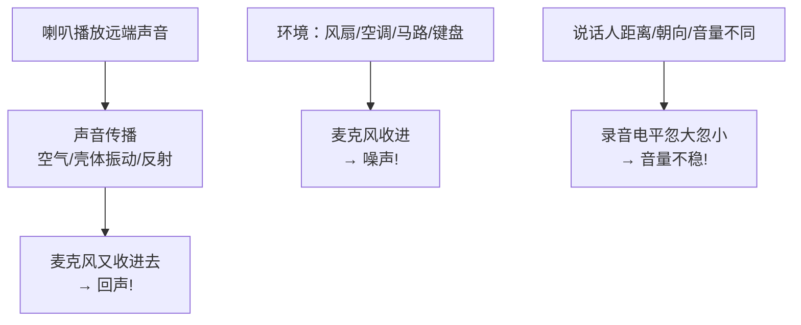
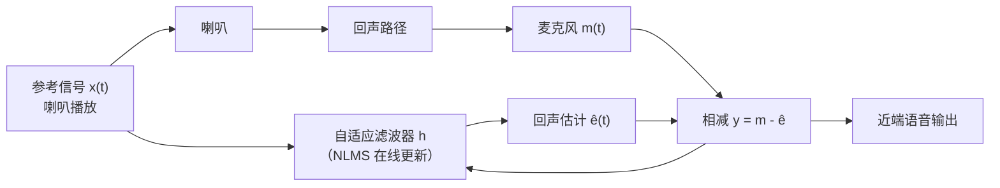
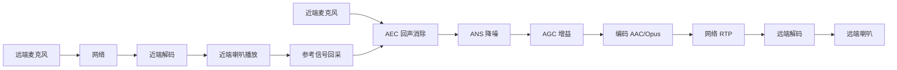

对讲产品最难的不是把音频采进来，而是**让对方听清**。喇叭放出来的声音会被麦克风再收进去（回声），空调风扇是背景噪声，说话人离麦克风远近不同音量忽大忽小——三个问题不解决，对讲就是"喂喂喂，你那边怎么有回音？"。这一篇把音频 3A（**AEC 回声消除 / ANS 噪声抑制 / AGC 自动增益**）的原理讲深讲透，给出 Rockchip 3A 库的工程接入方法、AEC 开关对比实验设计和对讲全链路。

**双轨对照**：板端跑 Rockchip 音频 3A 库做 AEC 开关对比；PC 端用 FFmpeg 滤镜近似体验降噪/音量归一的效果，建立"处理前后"的直觉。

## 一、音频 3A 是什么：对讲的三座大山

**定义**：音频 3A 是三个算法的合称——**AEC**（Acoustic Echo Cancellation，声学回声消除）、**ANS**（Ambient Noise Suppression，环境噪声抑制）、**AGC**（Automatic Gain Control，自动增益控制）。

**类比**：视频 3A（AE/AWB/AF）是让**画质**自动变好，音频 3A 是让**音质**自动变好——一个是"眼睛"的自动调节，一个是"耳朵"的自动调节。

**三座大山的成因**：

【图1：三座大山的成因】



| 算法 | 解决什么 | 效果 |
|:---|:---|:---|
| AEC | 对方的声音从我的喇叭出来又被麦克风收回去 | 远端不再听到自己的回声 |
| ANS | 背景噪声盖过说话声 | 近端语音清晰，背景安静 |
| AGC | 音量忽大忽小 | 远近说话音量一致，不削波 |

**为什么三个必须一起做**：AEC 消不掉非线性失真，ANS 压不掉说话声，AGC 放大噪声——三者配合才能在对讲场景（喇叭+麦克风同时工作）拿到可用音质。

## 二、回声是怎么产生的：先看清问题

**回声链路**：


**关键洞察**：回声不是"麦克风自己产生的"，而是**喇叭播放的内容被麦克风再次采集**。所以：**本地系统完全知道喇叭在放什么**——这就是 AEC 能工作的前提：用"已知的播放内容"去预测"麦克风里的回声成分"，然后减掉。

**工程前提**：AEC 必须有**参考信号**（喇叭实际播放的 PCM）。软件方案直接拿播放缓冲；硬件方案从功放前回采。**没有参考信号，AEC 无法工作**——这是设计对讲链路时的第一约束。

## 三、AEC 原理深度：参考信号 + 自适应滤波

### 3.1 系统模型

麦克风采集的信号 m(t) 由三部分组成：

```
m(t) = s(t) + e(t) + n(t)
       近端语音   回声    噪声
```

AEC 的目标：估计回声 e(t)，从 m(t) 中减掉，得到干净的近端语音 s(t) + 残余噪声（交给 ANS）。

### 3.2 回声路径与自适应滤波

**回声路径**：从喇叭到麦克风的物理传播——包括空气传播、壳体振动、墙壁反射。它的特性：**时变**（人走动、音量变化、温度变化都会改变）。

**自适应滤波器**：用滤波器 h 模拟回声路径，输入是参考信号 x(t)（喇叭播放），输出是回声估计 ê(t)：

```
ê(t) = h * x(t)      （卷积：用滤波器系数与参考信号历史加权）
```

然后从麦克风信号减去：`y(t) = m(t) - ê(t)`。如果 h 恰好等于真实回声路径，y(t) 就只剩近端语音。

**h 怎么得到**：用 **NLMS（归一化最小均方）** 算法在线估计——每帧根据误差 y(t) 调整滤波器系数，让误差最小：

```
h(k+1) = h(k) + μ · x(t) · y(t) / (||x||² + ε)
         学习率  参考信号 误差  归一化（防参考信号过大发散）
```

**类比**：你在嘈杂房间打电话，耳机里传来对方声音的同时你听到自己说话的回声——AEC 就是"认得对方声音的形状（参考信号），实时算出它在麦克风里的样子（滤波器），把它抠掉（相减）"。

【图2：AEC 原理框图】



### 3.3 关键概念：双讲（Double-Talk）

**问题**：本地和远端**同时说话**时，麦克风信号里既有回声又有近端语音。此时用误差 y(t) 更新滤波器，会把近端语音当成"回声误差"来调——滤波器系数被污染（发散），AEC 效果骤降甚至啸叫。

**解决**：**双讲检测器（DTD）**——检测到双讲时，暂停或减慢滤波器更新，只保留旧系数做消除。双讲检测质量直接决定 AEC 的实战体验。

### 3.4 关键概念：尾长（Tail Length）

**定义**：滤波器要覆盖的回声时长（滤波器系数的长度）。尾长必须 ≥ 实际回声路径长度（喇叭到麦克风的延迟 + 混响时间）。

- 尾长 50ms：能消近距离直达回声，消不掉长混响；
- 尾长 150~200ms：覆盖大多数室内对讲场景；
- **尾长越长，滤波器越准但算力越大**（系数个数 × 采样率 × 更新频率）。

**工程实测**：在目标房间对着喇叭说话，听残余回声；尾长不够就加长，直到无感。

### 3.5 非线性失真问题

**问题**：喇叭过载产生谐波失真，**线性滤波器消不掉非线性回声**（谐波成分不在滤波器模型里）。

**对策**：
1. **别让喇叭过载**（功放增益留余量，AGC 限幅）；
2. 高级 AEC 带非线性处理（NLP，把残余小信号压掉/加舒适噪声）；
3. 音量别开到爆——这是对讲啸叫最常见的工程原因之一。

## 四、ANS 噪声抑制：让背景安静

**定义**：ANS 从带噪语音里估计噪声并抑制，保留说话声。

**常用方法**：
- **谱减法**：把信号变换到频域（STFT），估计噪声谱（无声段统计），从信号谱中减去噪声谱，再变换回时域——实现简单，但处理不好有"音乐噪声"残留；
- **维纳滤波**：按信噪比计算每个频点的增益（信噪比高保留、低衰减）——更平滑，是现代降噪主流思路。

**噪声类型与难度**：

| 噪声 | 特征 | 抑制难度 |
|:---|:---|:---|
| 平稳噪声（风扇/空调） | 频谱稳定 | 容易 |
| 非平稳噪声（马路/人声） | 频谱突变 | 难 |
| 突发噪声（关门/碰撞） | 瞬时冲击 | 极难 |
| 风噪 | 低频能量骤增 | 需专门检测 |

**工程要点**：
1. **降噪强度别拉满**：太强会把语音细节一起削掉（听感"闷""碎"），还会在语音间隙留下"音乐噪声"；
2. **噪声估计的更新**：需要区分"语音段"和"噪声段"（VAD 语音活动检测），语音段暂停噪声估计更新；
3. **与 AEC 的顺序**：一般 AEC 在前（消回声），ANS 在后（消残余噪声）——链路顺序错了效果会互相破坏。

**类比**：照片降噪（保留边缘、抹平噪点）；语音降噪是"保留语音特征、抹平背景噪声"——降噪强度太高，照片（语音）会"糊"。

## 五、AGC 自动增益：音量稳定不削波

**定义**：AGC 自动调节增益，让输出音量稳定在目标电平——小声放大、大声压住，并**防止削波**（超过 0dBFS 产生爆音）。

**类比**：视频的自动曝光（AE）——场景太暗就提亮，太亮就压暗，最终亮度稳定。AGC 就是音频的 AE。

**核心参数**：

| 参数 | 含义 | 典型值（语音） |
|:---|:---|:---|
| 目标电平 | 输出 RMS 要稳定到多少 | -20dBFS 左右 |
| 增益范围 | 放大/衰减的上下限 | -10dB ~ +30dB |
| 启动/释放时间 | 增益变化速度 | 几十 ms 级 |
| 限幅器 | 硬性防削波 | 峰值钳到 -1~-3dBFS |

**工程要点**：
1. **增益变化速度**：太快产生"泵浦感"（背景噪声跟着一吸一放）；太慢跟不上说话人移动；
2. **AGC 与噪声**：AGC 放大近端语音的同时也会放大噪声——**一般 AGC 在 ANS 之后**，先降噪再调音量；
3. **限幅器**：AGC 后的最后一道保险，硬性防止削波爆音。

## 六、Rockchip 音频 3A 实操

### 6.1 SDK 中的 3A

Rockchip 音频 3A 算法库（RV1126 SDK 提供，**接口名称以你 SDK 版本的头文件为准**）通常提供：

| 能力 | 说明 |
|:---|:---|
| 初始化 | 采样率、帧长（如 16kHz/20ms）、3A 开关与参数 |
| 处理 | 一帧进一帧出：`in(麦克风) + ref(参考) → out(干净语音)` |
| 参数设置 | 回声尾长、降噪强度、AGC 目标电平、双讲检测开关 |
| 模式 | AEC/ANS/AGC 可独立开关 |

**重要**：音频 3A 和视频 3A（rkaiq）是**两个独立库**，别混用。音频 3A 面向对讲/录音，视频 3A 面向 ISP 画质。

### 6.2 接入流程（示意代码）

```c
// audio3a_demo.c —— 3A 处理流程示意（接口名以 SDK 为准）
#include <stdio.h>
#include <stdint.h>

/* 伪接口：真实名称/参数以 SDK 头文件为准 */
typedef void *audio3a_handle_t;
audio3a_handle_t audio3a_init(int sample_rate, int frame_samples, int flags);
int  audio3a_process(audio3a_handle_t h,
                     const int16_t *mic_in,   /* 麦克风输入 */
                     const int16_t *ref_in,   /* 喇叭参考（AEC 必需） */
                     int16_t *out);           /* 处理后输出 */
int  audio3a_set_param(audio3a_handle_t h, int param_id, int value);
void audio3a_deinit(audio3a_handle_t h);

#define AEC_FLAG (1 << 0)
#define ANS_FLAG (1 << 1)
#define AGC_FLAG (1 << 2)

int main(void)
{
    int sr = 16000, frame = 320;   /* 16kHz, 20ms */
    audio3a_handle_t h = audio3a_init(sr, frame, AEC_FLAG | ANS_FLAG | AGC_FLAG);
    if (!h) return -1;

    /* 常见参数调节（参数 ID 以 SDK 为准） */
    audio3a_set_param(h, /* 尾长 */ 0, 160);      /* 10ms × 16 = 160ms */
    audio3a_set_param(h, /* 目标电平 */ 0, -2000); /* -20dBFS */

    int16_t mic[320], ref[320], out[320];
    /* 循环：mic 从 pcm_read 填；ref 从"喇叭正在播的缓冲"复制 */
    /* audio3a_process(h, mic, ref, out); */

    audio3a_deinit(h);
    return 0;
}
```

**接入的关键点**：
1. **ref 必须和喇叭播放的完全一致**：播放线程把解码 PCM 同时发给喇叭驱动和 3A 参考端——**多拷贝一份给 3A，别拿"播放后"的数据**（经过功放/混音的数据与喇叭实际播放不一致）；
2. **帧长对齐**：3A 的帧长（20ms）要与采集 period 一致，否则要缓冲对齐；
3. **链路顺序**：`mic → AEC → ANS → AGC → 编码`；喇叭路径：`解码 → 播放 + 参考给 AEC`。

### 6.3 对讲全链路

【图3：双向语音对讲全链路】



**注意**：`L → M → B` 是 AEC 的生命线——喇叭播什么，3A 必须知道。工程上常把解码后的 PCM **同时**送去喇叭和 3A 参考端，这是最容易漏的环节。

## 七、AEC 开关对比实验

### 7.1 实验设计

```bash
# 板端对讲测试步骤
# 1) 关闭 AEC（只开 ANS/AGC），播放远端语音并让近端说话
#    → 远端听到"自己的回声"（你的喇叭声被你的麦克风收走又传回去）
# 2) 打开 AEC，同样距离同样音量
#    → 回声明显减少或消失，只剩近端干净语音
```

### 7.2 观察指标

| 指标 | 判断 |
|:---|:---|
| 回声残留 | 远端听到"自己说话的回声"是否消失 |
| 语音失真 | AEC 开后近端语音是否"闷/碎"（滤波器过度消除） |
| 双讲表现 | 两边同时说话时，AEC 是否"抽风"（回声突然出现） |
| 啸叫 | 喇叭音量开到接近过载时，是否出现啸叫（非线性+AEC 极限） |

**合格标准**：正常对讲距离（0.5~1m），AEC 打开后远端不应听到明显回声，且近端语音清晰可懂；双讲时略有残留可接受，但不能"抽风"。

### 7.3 常见调参方向

- 回声残留多 → 加尾长、检查参考信号是否准确、检查喇叭是否过载；
- 语音发闷 → 降 ANS 强度、检查 AGC 目标电平；
- 双讲抽风 → 确认双讲检测开启、降低滤波器更新速度。

## 八、PC 端对照

PC 端没有真正的 AEC（需要喇叭回采硬件链路），但可以用 FFmpeg 滤镜近似体验 ANS/AGC：

```bash
# 1) 降噪（近似 ANS）：afftdn 基于 FFT 的降噪
ffmpeg -i noisy.wav -af "afftdn=nf=-30" denoised.wav
ffplay denoised.wav

# 2) 音量归一（近似 AGC）：dynaudnorm 动态归一
ffmpeg -i varying.wav -af "dynaudnorm=f=150:g=15" normalized.wav
ffplay normalized.wav

# 3) 对比响度
ffmpeg -i noisy.wav -af volumedetect -f null -     # 看 mean/max
ffmpeg -i denoised.wav -af volumedetect -f null -
```

**要点**：PC 上先体验"降噪让背景安静、归一让音量稳定"，理解 3A 的目的和参数含义；AEC 必须上板用真实喇叭+麦克风验证（PC 没有喇叭回采链路）。

## 九、常见问题排查

| 现象 | 可能原因 | 排查 |
|:---|:---|:---|
| AEC 无效 | 参考信号没接/接错 | 确认 ref 与喇叭播放完全一致 |
| 回声消不干净 | 尾长不够/喇叭过载 | 加尾长、降功放增益 |
| 语音失真/发闷 | ANS 太强/AGC 目标过低 | 降噪强度、抬高目标电平 |
| 双讲时回声突现 | 双讲检测未开/更新过快 | 开 DTD、降学习率 |
| 啸叫 | 喇叭过载/增益太高 | 降增益、开限幅、检查 AEC |
| 音量泵浦感 | AGC 启动/释放时间太短 | 加长启动释放时间 |

## 十、动手练习

1. 板端跑通 3A 处理流程：采集 → 3A → 存 WAV，对比 3A 开关前后的波形（FFmpeg showwavespic）
2. 做 AEC 开关对比实验：对着喇叭说话，记录远端听到的回声差异
3. 用 ANS 处理风扇噪声场景，记录降噪前后 RMS 电平变化（噪声段应明显下降）
4. 用 AGC 测试远近说话（靠近/远离麦克风），确认输出音量稳定
5. 故意不接参考信号跑 AEC，观察效果（应几乎无效）——记住参考信号的重要性
6. PC 端用 afftdn/dynaudnorm 处理一段带噪录音，对比 volumedetect 输出，体会参数含义
7. 画出对讲全链路框图，标出参考信号的流向，说明为什么播放线程必须把 PCM 同步给 3A

## 里程碑

- [ ] 能说出音频 3A 是 AEC/ANS/AGC 三件套，各解决什么（回声/噪声/音量）
- [ ] 能解释回声成因：喇叭播放的内容被麦克风再采集
- [ ] 能解释 AEC 原理：参考信号 + 自适应滤波器（NLMS）+ 相减，并知道双讲检测/尾长的作用
- [ ] 能说明 AEC 为什么必须拿参考信号——没有它无法消除
- [ ] 能说出 ANS 的谱减法/维纳滤波思路，以及"强度别拉满"的原因
- [ ] 能说出 AGC 的目标电平/增益范围/限幅，以及"先降噪再调音量"的顺序
- [ ] 能跑通 Rockchip 3A 处理流程（接口名以 SDK 为准），完成 AEC 开关对比实验
- [ ] 能画出对讲全链路（采集→3A→编码→网络→解码→播放 + 参考回采），并说出最容易漏的环节

> 🏷️ 标签：音频3A · AEC · 回声消除 · NLMS · 自适应滤波 · 双讲 · 尾长 · ANS · 降噪 · 谱减法 · 维纳滤波 · AGC · 自动增益 · 限幅 · 对讲 · 双向语音 · 音视频
